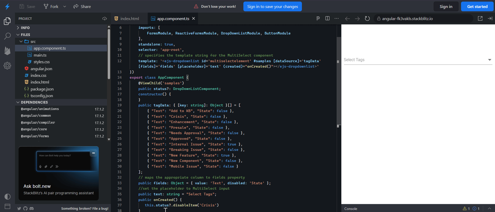
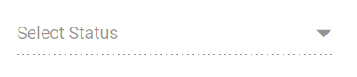

# Disabled Items in Angular DropDownList Component

The DropDownList component allows you to disable specific items to prevent them from being selected. The disabled state of each list item can be defined by mapping a field from the data source to the [fields.disabled](https://ej2.syncfusion.com/angular/documentation/api/drop-down-list/#fields) property. Once an item is disabled, it cannot be selected as a value for the component.

In the following sample, certain states are disabled based on the [`disabled`](https://ej2.syncfusion.com/angular/documentation/api/drop-down-list/fieldSettingsModel/#disabled) field in the data source.










  


## Disable Item Method

The [disableItem](https://ej2.syncfusion.com/angular/documentation/api/drop-down-list/#disableitem) method provides a way to dynamically disable a specific item in the list, preventing it from being selected. This method must be called with a parameter that identifies the target item, and it can be invoked in one of three ways: by passing the item's HTML element, its value, or its index.

When an item is disabled using this method, the corresponding disabled field in the dataSource is updated to reflect the change. If the currently selected item is disabled, the selection will be cleared. To disable multiple items, you can iterate through a list and call this method for each item.

The [disableItem](https://ej2.syncfusion.com/angular/documentation/api/drop-down-list/#disableitem) method can be called using one of the following signatures:

| Parameter | Type | Description |
|------|------|------|
| itemHTMLLIElement |  <code>HTMLLIElement</code> |  It accepts the HTML Li element of the item to be removed.  |
| itemValue | <code>string</code> \| <code>number</code> \| <code>boolean</code> \| <code>object</code> | It accepts the string, number, boolean and object type value of the item to be removed. |
| itemIndex | <code>number</code> | It accepts the index of the item to be removed. |

In the following example, the Crisis status is dynamically disabled in the created event.

```typescript
import { FormsModule, ReactiveFormsModule } from '@angular/forms'
import { DropDownListComponent, DropDownListModule } from '@syncfusion/ej2-angular-dropdowns'
import { ButtonModule } from '@syncfusion/ej2-angular-buttons'
import { Component, ViewChild } from '@angular/core';
@Component({
    imports: [
        FormsModule, ReactiveFormsModule, DropDownListModule, ButtonModule
    ],
    standalone: true,
    selector: 'app-root',
    // specifies the template string for the MultiSelect component
    template: `<ejs-dropdownlist id='multiselectelement' #samples [dataSource]='tagData' [fields]='fields' [placeholder]='text' (created)="onCreated()"></ejs-dropdownlist>`
})
export class AppComponent {
    @ViewChild('samples')
    public status?: DropDownListComponent;
    constructor() {
    }
    public tagData: { [key: string]: Object }[] = [
        { "Text": "Add to KB", "State": false },
        { "Text": "Crisis", "State": false },
        { "Text": "Enhancement", "State": false },
        { "Text": "Presale", "State": false },
        { "Text": "Needs Approval", "State": false },
        { "Text": "Approved", "State": false },
        { "Text": "Internal Issue", "State": true },
        { "Text": "Breaking Issue", "State": false },
        { "Text": "New Feature", "State": true },
        { "Text": "New Component", "State": false },
        { "Text": "Mobile Issue", "State": false }
    ];
    // maps the appropriate column to fields property
    public fields: Object = { value: 'Text', disabled: 'State' };
    //set the placeholder to MultiSelect input
    public text: string = "Select Tags";
    public onCreated() {
       this.status?.disableItem('Crisis')
    }
}
```


## Enabled

To disable the entire DropDownList component, set the [enabled](https://ej2.syncfusion.com/angular/documentation/api/drop-down-list/#enabled) property to `false`.


