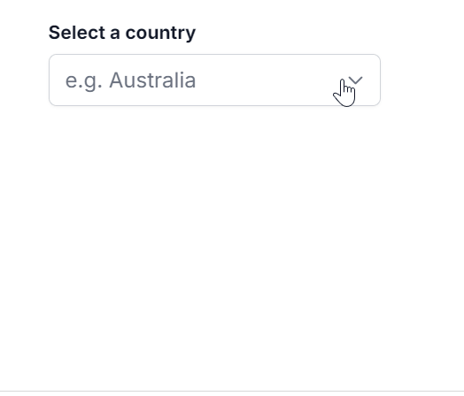

# Popup Resizing in Angular Dropdown List

You can dynamically adjust the size of the popup in the DropDownList component by using the [allowResize](https://ej2.syncfusion.com/angular/documentation/api/drop-down-list#allowresize) property. When enabled, users can resize the popup, improving visibility and control, with the resized dimensions being retained across sessions for a consistent user experience.

The following sample illustrates the implementation of the popup resize feature.










  

