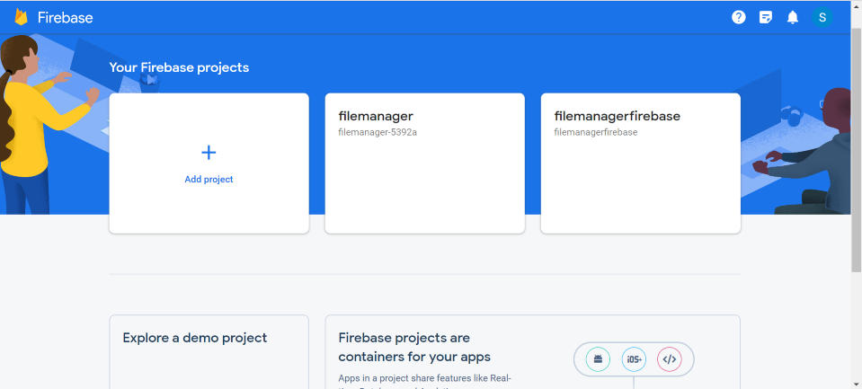
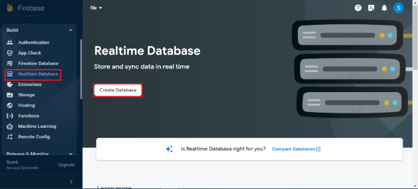
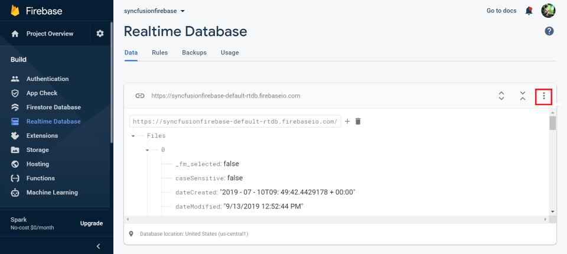
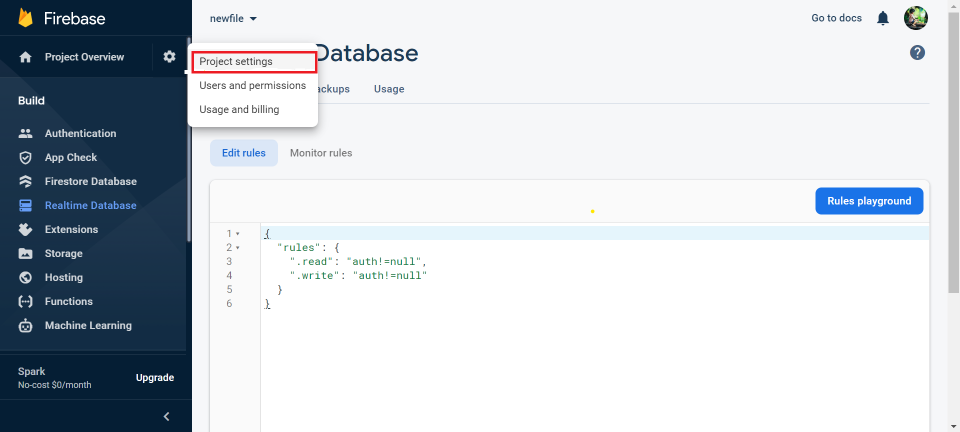
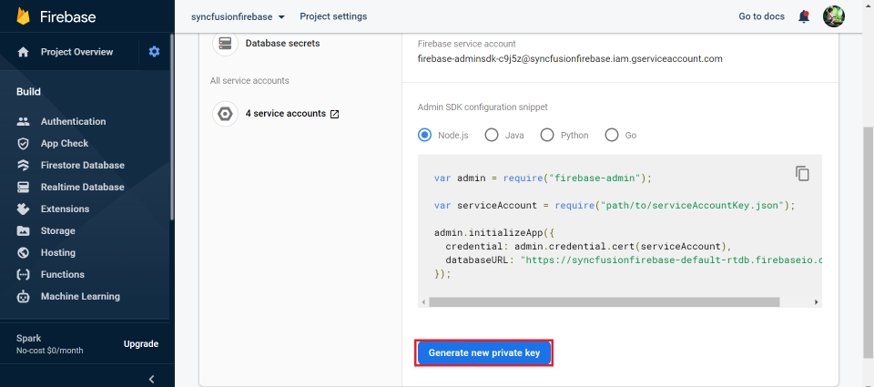
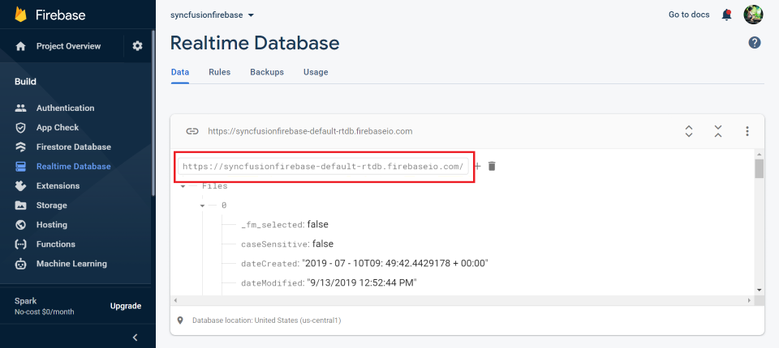

# File system provider in Angular File Manager component

The file system provider allows the File Manager component to manage the files and folders in a physical or cloud-based file system. It provides the methods for performing various file actions like creating a new folder, copying and moving of files or folders, deleting, uploading, and downloading the files or folders in the file system.

## Overview of File System Providers
The following file providers are available in EJ2 File Manager component:

* [Physical file system provider](#physical-file-system-provider)
* [Azure cloud file system Provider](#azure-cloud-file-system-provider)
* [Amazon S3 cloud file provider](#amazon-s3-cloud-file-provider)
* [SharePoint file provider](#sharepoint-file-provider)
* [File Transfer Protocol file system provider](#file-transfer-protocol-file-system-provider)
* [SQL database file system provider](#sql-database-file-system-provider)
* [NodeJS file system provider](#nodejs-file-system-provider)
* [Google Drive file system provider](#google-drive-file-system-provider)
* [Firebase Realtime Database file system provider](#firebase-realtime-database-file-system-provider)

## Physical file system provider

The Physical file system provider allows the users to access and manage the physical file system. To get started, clone the [ej2-aspcore-file-provider](https://github.com/SyncfusionExamples/ej2-aspcore-file-provider) using the following command.

```typescript

git clone https://github.com/SyncfusionExamples/ej2-aspcore-file-provider  ej2-aspcore-file-provider

cd ej2-aspcore-file-provider

```

After cloning, just open the project in Visual Studio and restore the NuGet packages. Now, set the root directory of the physical file system in the File Manager controller.

After setting the root directory of the file system, just build and run the project. Now, the project will be hosted in `http://localhost:{port}` and just mapping the **ajaxSettings** property of the File Manager component to the appropriate controller methods allows to manage the files in the physical file system.

```typescript

import { Component } from '@angular/core';

@Component({
    selector: 'app-root',
    styleUrls: ['app/app.component.css'],
    templateUrl: 'app/app.component.html'
})
export class AppComponent {
    public ajaxSettings: object;
    public hostUrl: string = 'http://localhost:{port}/';
    public ngOnInit(): void {
        // Initializing File Manager with Physical file system provider.
        this.ajaxSettings = {
            // Replace the hosted port number in the place of "{port}"
            url: this.hostUrl + "api/FileManager/FileOperations",
            downloadUrl: this.hostUrl + "api/FileManager/Download",
            uploadUrl: this.hostUrl + "api/FileManager/Upload",
            getImageUrl: this.hostUrl + "api/FileManager/GetImage"
        };
    }
}
```

>Note: To learn more about the file actions that can be performed with Physical file system provider, refer to this [link](https://github.com/SyncfusionExamples/ej2-aspcore-file-provider#key-features)

## Azure cloud file system Provider

### Introduction to Azure Blob Storage

Azure Blob Storage is Microsoft Azure's object storage solution for the cloud, optimized for storing massive amounts of unstructured data. In this guide, the Syncfusion Angular File Manager connects to Blob Storage through an ASP.NET Core backend so you can securely browse and perform file operations in the File Manager component.

### Prerequisites

Before you integrate Azure Blob Storage with the Syncfusion Angular File Manager, ensure you have:
- An active Microsoft Azure subscription
- A Storage Account with Blob service enabled
- A Blob Container and an optional root folder inside that container
- Azure credentials: `accountName`, `accountKey`, and `blobName`

### Setting Up Azure Blob Storage

- Sign in to the [Azure Portal](https://portal.azure.com/) and [create a storage account](https://learn.microsoft.com/en-us/azure/storage/common/storage-account-create?tabs=azure-portal) with Blob service enabled.
- [Create a Blob Container](https://learn.microsoft.com/en-us/azure/storage/blobs/storage-quickstart-blobs-portal?tabs=azure-portal#create-a-container) (example: files). See Azure docs for [container naming rules](https://learn.microsoft.com/en-us/azure/storage/blobs/storage-blobs-introduction#naming-and-referencing-containers-blobs-and-metadata).

### Backend Setup

Clone the [Azure File Provider](https://github.com/SyncfusionExamples/azure-aspcore-file-provider) using the following command,

```bash
git clone https://github.com/SyncfusionExamples/ej2-azure-aspcore-file-provider ej2-azure-aspcore-file-provider
```

> **Note:** This Azure Blob Storage provider for the Syncfusion Angular File Manager is intended for demonstration and evaluation only. Before using it in production, consult your security team and complete a security review.

To initialize a local service with the above-mentioned file operations, create a folder named `Controllers` in the server project. Then, create a `.cs` file in the `Controllers` folder and add the required file operation code from [AzureProviderController.cs](https://github.com/SyncfusionExamples/azure-aspcore-file-provider/blob/master/Controllers/AzureProviderController.cs). You can also find the method-level details for this provider in the same repository.

### Registering Azure Credentials in the Provider

After cloning, open the project in Visual Studio and restore the NuGet packages. Then, register Azure Storage by passing **accountName**, **accountKey**, and **blobName** to the `RegisterAzure` method in the `AzureProviderController.cs` file.

```csharp
this.operation.RegisterAzure("<--accountName-->", "<--accountKey-->", "<--blobName-->");
```

Then, set the blob container and the root blob directory by passing the corresponding URLs as parameters to the `SetBlobContainer` method, as shown below.

```csharp
public AzureProviderController(IHostingEnvironment hostingEnvironment)
{
    this.operation = new AzureFileProvider();
    blobPath = "<--blobPath-->";
    filePath = "<--filePath-->";
    ...
    this.operation.SetBlobContainer(blobPath, filePath);
}
```

> **Note:** The **blobPath** represents a container path in Azure Blob Storage, and **filePath** refers to the file location path. For example, create a container named **blob** in the specified Azure Blob Storage account. Inside that container, create a folder named **Files** that contains all the files and folders to be displayed in the File Manager. Refer to the following paths as an example.

```csharp
public AzureProviderController(IHostingEnvironment hostingEnvironment)
{
    this.operation = new AzureFileProvider();
    blobPath = "https://azure_service_account.blob.core.windows.net/blob/";
    filePath = "https://azure_service_account.blob.core.windows.net/blob/Files";
    ...
}
```

### Configuring Syncfusion File Manager UI

To configure Syncfusion File Manager, add the File Manager component by using `<ejs-filemanager>` selector in template section of the app.component.ts file. Then add the File Manager component as shown in below code example.

Now, build and run the Azure File Service provider project. It will be hosted in `http://localhost:{port}`. Map the [ajaxSettings](https://ej2.syncfusion.com/angular/documentation/api/file-manager/index-default#ajaxsettings) of the File Manager component to the AzureProvider controller endpoints (Url, UploadUrl, DownloadUrl, GetImageUrl) to manage blobs in your Azure Blob Storage container.

```typescript

import { Component } from '@angular/core';

@Component({
    selector: 'app-root',
    styleUrls: ['app/app.component.css'],
    templateUrl: 'app/app.component.html'
})
export class AppComponent {
    public ajaxSettings: object;
    public hostUrl: string = 'http://localhost:{port}/';
    public ngOnInit(): void {
        // File Manager sample with Azure service.
        this.ajaxSettings = {
            // Replace the hosted port number in the place of "{port}"
            url: this.hostUrl + "api/AzureProvider/AzureFileOperations",
            downloadUrl: this.hostUrl + "api/AzureProvider/AzureDownload",
            uploadUrl: this.hostUrl + "api/AzureProvider/AzureUpload",
            getImageUrl: this.hostUrl + "api/AzureProvider/AzureGetImage"
        };
    }
}

```

To perform file operations (Read, Create, Rename, Delete, Get file details, Search, Copy, Move, Upload, Download, GetImage) in the Syncfusion<sup style="font-size:70%">&reg;</sup> Angular File Manager component using the Azure cloud file system provider, initialize the Azure cloud provider in the controller.

### Supported File Operations

We have enabled below list of features that can be performed using Azure File Service provider,

|Operation | Function |
|---|---|
| Upload | <ul><li>[Directory upload](https://ej2.syncfusion.com/angular/documentation/api/file-manager/uploadsettingsmodel#directoryupload)</li><li>[Sequential upload](https://ej2.syncfusion.com/angular/documentation/api/file-manager/uploadsettingsmodel#sequentialupload)</li><li>[Chunk upload](https://ej2.syncfusion.com/angular/documentation/api/file-manager/uploadsettingsmodel#chunksize)</li><li>[Auto upload](https://ej2.syncfusion.com/angular/documentation/api/file-manager/uploadsettingsmodel#autoupload)</li></ul> |
| Access Control | <ul><li>[Setting rules to files/folders](https://github.com/SyncfusionExamples/azure-aspcore-file-provider/blob/master/Models/AzureFileProvider.cs#L58)</li><li>[Supported rules](https://github.com/SyncfusionExamples/azure-aspcore-file-provider/blob/master/Models/Base/AccessDetails.cs#L65)</li></ul> |

Additionally, you can check out all the necessary file operation method details for this provider in the same GitHub repository.

> **Note:** To learn more about the file actions supported by the Azure cloud file system provider, refer to the [key features](https://github.com/SyncfusionExamples/azure-aspcore-file-provider#key-features).

## Amazon S3 cloud file provider

### Introduction to Amazon S3

Amazon Simple Storage Service (Amazon S3) is AWS's object storage service for storing and retrieving any amount of data. S3 is durable, scalable, and pay‑as‑you‑go. In this guide the Syncfusion Angular File Manager connects to S3 through an ASP.NET Core backend so you can securely browse and perform file operations in the File Manager component.

### Prerequisites

Before you integrate Amazon S3 with the Syncfusion Angular File Manager, ensure you have:
 - An AWS Account
 - A configured S3 Bucket
 - AWS credentials: `awsAccessKeyId`, `awsSecretAccessKeyId`, `bucketRegion`, `awsRegion`.

### Setting Up Amazon S3

#### Create an S3 Bucket

 - Open the [AWS Management Console guide](https://docs.aws.amazon.com/awsconsolehelpdocs/) and log into AWS Console -> Navigate to S3.
 - Proceed by clicking `Create Bucket`. A bucket is a container for objects. An object is a file and any metadata that describes that file. The Amazon S3 provider requires a top-level root folder in your bucket to place all required files and subfolders inside this root. Click this [link](https://docs.aws.amazon.com/AmazonS3/latest/userguide/creating-buckets-s3.html) for more details.
 - Provide a DNS-compliant bucket name. Click this [link](https://docs.aws.amazon.com/AmazonS3/latest/userguide/bucketnamingrules.html) for more details.
 - Choose the AWS region. Click this [link](https://docs.aws.amazon.com/general/latest/gr/s3.html) for more details.

### Backend Setup

Clone the [Amazon S3 File Provider](https://github.com/SyncfusionExamples/amazon-s3-aspcore-file-provider) using the following command,

```bash
git clone https://github.com/SyncfusionExamples/ej2-amazon-s3-aspcore-file-provider ej2-amazon-s3-aspcore-file-provider
```

> **Note:** This Amazon S3 provider for the Syncfusion Angular File Manager is intended for demonstration and evaluation only. Before using it consult your security team and complete a security review.

To initialize a local service with the above-mentioned file operations, create a folder named `Controllers` in the server project. Then, create a `.cs` file in the `Controllers` folder and add the required file operation code from [AmazonS3ProviderController.cs](https://github.com/SyncfusionExamples/amazon-s3-aspcore-file-provider/blob/master/Controllers/AmazonS3ProviderController.cs). You can also find the method-level details for this provider in the same repository.

### Registering S3 Credentials in the Provider

After cloning, open the project in Visual Studio and restore the NuGet packages. Then, register the Amazon S3 client details (for example, **bucketName**, **awsAccessKeyId**, **awsSecretAccessKeyId**, and **awsRegion**) in the `RegisterAmazonS3` method in the `AmazonS3ProviderController.cs` file.

```csharp
this.operation.RegisterAmazonS3("<---bucketName--->", "<---awsAccessKeyId--->", "<---awsSecretAccessKey--->", "<---region--->");
```

### Configuring Syncfusion File Manager UI

To configure Syncfusion File Manager, add the File Manager component by using `<ejs-filemanager>` selector in template section of the app.component.ts file. Then add the File Manager component as shown in below code example.

Now, build and run the Amazon File Service provider project. It will be hosted in `http://localhost:{port}`. Map the [ajaxSettings](https://ej2.syncfusion.com/angular/documentation/api/file-manager/index-default#ajaxsettings) of the File Manager component to the AmazonS3Provider controller endpoints (Url, UploadUrl, DownloadUrl, GetImageUrl) to manage blobs in your S3 bucket.

```typescript

import { Component } from '@angular/core';

@Component({
    selector: 'app-root',
    styleUrls: ['app/app.component.css'],
    templateUrl: 'app/app.component.html'
})
export class AppComponent {
    public ajaxSettings: object;
    public hostUrl: string = 'http://localhost:{port}/';
    public ngOnInit(): void {
        // File Manager sample with amazon service.
        this.ajaxSettings = {
            // Replace the hosted port number in the place of "{port}"
            url: this.hostUrl + "api/AmazonS3Provider/AmazonS3FileOperations",
            downloadUrl: this.hostUrl + "api/AmazonS3Provider/AmazonS3Download",
            uploadUrl: this.hostUrl + "api/AmazonS3Provider/AmazonS3Upload",
            getImageUrl: this.hostUrl + "api/AmazonS3Provider/AmazonS3GetImage"
        };
    }
}

```

To perform file operations (Read, Create, Rename, Delete, Get file details, Search, Copy, Move, Upload, Download, GetImage) in the Syncfusion<sup style="font-size:70%">&reg;</sup> Angular File Manager component using the Amazon S3 cloud file provider, initialize the Amazon S3 cloud file provider in the controller.

### Supported File Operations

We have enabled below list of features that can be performed using Amazon File Service provider,

|Operation | Function |
|---|---|
| Upload | <ul><li>[Directory upload](https://ej2.syncfusion.com/angular/documentation/api/file-manager/uploadsettingsmodel#directoryupload)</li><li>[Sequential upload](https://ej2.syncfusion.com/angular/documentation/api/file-manager/uploadsettingsmodel#sequentialupload)</li><li>[Chunk upload](https://ej2.syncfusion.com/angular/documentation/api/file-manager/uploadsettingsmodel#chunksize)</li><li>[Auto upload](https://ej2.syncfusion.com/angular/documentation/api/file-manager/uploadsettingsmodel#autoupload)</li></ul> |
| Access Control | <ul><li>[Setting rules to files/folders](https://github.com/SyncfusionExamples/amazon-s3-aspcore-file-provider/blob/master/Models/AmazonS3FileProvider.cs#L51)</li><li>[Supported rules](https://github.com/SyncfusionExamples/amazon-s3-aspcore-file-provider/blob/master/Models/Base/AccessDetails.cs#L13)</li></ul> |

Additionally, you can check out all the necessary file operation method details for this provider in the same GitHub repository.

> **Note:** To learn more about the file actions supported by the Amazon S3 Cloud File provider, refer to the [key features](https://github.com/SyncfusionExamples/amazon-s3-aspcore-file-provider#key-features).

## SharePoint file provider

The SharePoint file provider allows users to access and manage files within Microsoft SharePoint. To get started, clone the [SharePoint-aspcore-file-provider](https://github.com/SyncfusionExamples/sharepoint-aspcore-file-provider) using the following command.

```typescript

git clone https://github.com/SyncfusionExamples/sharepoint-aspcore-file-provider  sharepoint-aspcore-file-provider

cd sharepoint-aspcore-file-provider

```

**Prerequisites**

To set up the SharePoint service provider, follow these steps:

1. **Create an App Registration in Azure Active Directory (AAD):** 
   - Navigate to the Azure portal and create a new app registration under Azure Active Directory.
   - Note down the **Tenant ID**, **Client ID**, and **Client Secret** from the app registration.

2. **Use Microsoft Graph Instance:** 
   - With the obtained Tenant ID, Client ID, and Client Secret, you can create a Microsoft Graph instance.
   - This instance will be used to interact with the SharePoint document library.

3. **Use Details from `appsettings.json`:**
   - The `SharePointController` is already configured to use the credentials provided in the `appsettings.json` file.
   - You only need to provide your `Tenant ID`, `Client ID`, `Client Secret`, `User Site Name`, and `User Drive ID` in the `appsettings.json` file, and the application will automatically initialize the SharePoint service.

**Example `appsettings.json` Configuration**

```json
{
  "Logging": {
    "LogLevel": {
      "Default": "Warning"
    }
  },
  "SharePointSettings": {
    "TenantId": "<--Tenant Id-->",
    "ClientId": "<--Client Id-->",
    "ClientSecret": "<--Client Secret-->",
    "UserSiteName": "<--User Site Name-->",
    "UserDriveId": "<--User Drive ID-->"
  },
  "AllowedHosts": "*"
}
```

Replace "<--User Site Name-->", "<--User Drive ID-->", "tenantId", "clientId", and "clientSecret" with your actual values.

After configuring the SharePoint file provider, build and run the project. Now, the project will be hosted in `http://localhost:{port}` and just mapping the **ajaxSettings** property of the File Manager component to the appropriate controller methods allows to manage the files in the Microsoft SharePoint.

```typescript

import { Component } from '@angular/core';

@Component({
    selector: 'app-root',
    styleUrls: ['app/app.component.css'],
    templateUrl: 'app/app.component.html'
})
export class AppComponent {
    public ajaxSettings: object;
    public hostUrl: string = 'http://localhost:{port}/';
    public ngOnInit(): void {
        this.ajaxSettings = {
            // Replace the hosted port number in the place of "{port}"
            url: this.hostUrl + 'api/SharePointProvider/SharePointFileOperations',
            downloadUrl: this.hostUrl + 'api/SharePointProvider/SharePointDownload',
            uploadUrl: this.hostUrl + 'api/SharePointProvider/SharePointUpload',
            getImageUrl: this.hostUrl + 'api/SharePointProvider/SharePointGetImage'
        };
    }
}

```

> **Note:** To learn more about the file actions that can be performed with SharePoint file provider, refer to this [link](https://github.com/SyncfusionExamples/sharepoint-aspcore-file-provider#key-features)

## File Transfer Protocol file system provider

In ASP.NET Core, File Transfer Protocol file system provider allows the users to access to the hosted file system as collection of objects stored in the file storage using File Transfer Protocol. To get started, clone the [ftp-aspcore-file-provider](https://github.com/SyncfusionExamples/ftp-aspcore-file-provider) using the following command

```typescript

git clone https://github.com/SyncfusionExamples/ftp-aspcore-file-provider.git  ftp-aspcore-file-provider.git

```

After cloning, open the project in Visual Studio and restore the NuGet packages. Now, register File Transfer Protocol details like *hostName*, *userName* and *password* in **SetFTPConnection** method in the File Manager controller to perform the file operations.

```typescript

void SetFTPConnection(string hostName, string userName, string password)

```

After registering the File Transfer Protocol details, just build and run the project. Now, the project will be hosted in `http://localhost:{port}` and just mapping the **ajaxSettings** property of the File Manager component to the appropriate controller methods allows you to manage the FTP's objects storage.

```typescript

import { Component } from '@angular/core';

@Component({
    selector: 'app-root',
    styleUrls: ['app/app.component.css'],
    templateUrl: 'app/app.component.html'
})
export class AppComponent {
    public ajaxSettings: object;
    public hostUrl: string = 'http://localhost:{port}/';
    public ngOnInit(): void {
        // File Manager sample with file transfer protocol service.
        this.ajaxSettings = {
            // Replace the hosted port number in the place of "{port}"
            url: this.hostUrl + "api/FTPProvider/FTPFileOperations",
            downloadUrl: this.hostUrl + "api/FTPProvider/FTPDownload",
            uploadUrl: this.hostUrl + "api/FTPProvider/FTPUpload",
            getImageUrl: this.hostUrl + "api/FTPProvider/FTPGetImage"
        };
    }
}

```

> **Note:** To learn more about the file actions that can be performed with File Transfer Protocol file system provider, refer to this [link](https://github.com/SyncfusionExamples/ftp-aspcore-file-provider#key-features)

## SQL database file system provider

In ASP.NET Core, SQL database file system provider allows the users to manage the file system being maintained in a SQL database table. Unlike the other file system providers, the SQL database file system provider works on ID basis. Here, each file and folder has a unique ID on which all file operations will be performed. To get started, clone the [sql-server-database-aspcore-file-provider](https://github.com/SyncfusionExamples/sql-server-database-aspcore-file-provider) using the following command.

```typescript

<add name="FileExplorerConnection" connectionString="Data Source=(LocalDB)\v11.0;AttachDbFilename=|DataDirectory|\FileManager.mdf;Integrated Security=True;Trusted_Connection=true" />

```

After cloning, just open the project in Visual Studio and restore the NuGet packages. To establish the SQL server connection with the database file (for eg: FileManager.mdf), specify the connection string in the web config file as follows.

```typescript

<add name="FileExplorerConnection" connectionString="Data Source=(LocalDB)\v11.0;AttachDbFilename=|DataDirectory|\FileManager.mdf;Integrated Security=True;Trusted_Connection=true" />

```

Then, make an entry for the connection string in `appsettings.json` file as follows.

```typescript

"ConnectionStrings": {
    "FileManagerConnection": "Data Source=(LocalDB)\\MSSQLLocalDB;AttachDbFilename=|DataDirectory|\\App_Data\\FileManager.mdf;Integrated Security=True;Connect Timeout=30"
}

```

Now, to configure the database connection, set the connection name, table name and root folder ID value by passing these values to the SetSQLConnection method.

```typescript

void SetSQLConnection(string name, string tableName, string tableID)

```

> Refer to this [FileManager.mdf](https://github.com/SyncfusionExamples/sql-server-database-aspcore-file-provider/blob/master/App_Data/FileManager.mdf), to learn about the pre-defined file system SQL database for the EJ2 File Manager.

After configuring the connection, just build and run the project. Now, the project will be hosted in `http://localhost:{port}` and just mapping the ajaxSettings property of the File Manager component to the appropriate controller methods allows to manage the files in the SQL database table.

```typescript

import { Component } from '@angular/core';

@Component({
    selector: 'app-root',
    styleUrls: ['app/app.component.css'],
    templateUrl: 'app/app.component.html'
})
export class AppComponent {
    public ajaxSettings: object;
    public hostUrl: string = 'http://localhost:{port}/';
    public ngOnInit(): void {
        // Initializing the File Manager with SQL database service.
        this.ajaxSettings = {
            // Replace the hosted port number in the place of "{port}"
            url: this.hostUrl + "api/SQLProvider/SQLFileOperations",
            downloadUrl: this.hostUrl + "api/SQLProvider/SQLDownload",
            uploadUrl: this.hostUrl + "api/SQLProvider/SQLUpload",
            getImageUrl: this.hostUrl + "api/SQLProvider/SQLGetImage"
        };
    }
}

```

> **Note:** To learn more about the file actions that can be performed with SQL database file system provider, refer to this [link](https://github.com/SyncfusionExamples/sql-server-database-aspcore-file-provider#key-features)

## Node JS file system provider

### Introduction

The Node JS file system provider lets File Manager perform all basic file operations like creating a folder, copy, move, delete, and download files and folders on a physical file system via a lightweight Node service.

### Backend Setup

Clone the [Node JS provider](https://github.com/SyncfusionExamples/ej2-filemanager-node-filesystem) using the following command,

```bash

git clone  https://github.com/SyncfusionExamples/ej2-filemanager-node-filesystem.git node-filesystem-provider

```

**Note:** This Node JS file system provider for the Syncfusion Angular File Manager is intended for demonstration and evaluation only. Before using it in production, consult your security team and complete a security review.

After cloning, open the root folder and run the **npm install** command.

After installing the packages, set the root folder directory of the physical file system in the package JSON under scripts sections as follows.

```json

"start": "node filesystem-server.js -d D:/Projects"

```

> **Note:** By default, the root directory will be configured to set `C:/Users` as the root directory.

To set the port in which the project to be hosted and the root directory of the file system. Run the following command.

```bash

set PORT=3000 && node filesystem-server.js -d D:/Projects

```

> **Note:** By default, the service will run `8090` port.

### Configuring Syncfusion File Manager UI

To configure Syncfusion File Manager, add the File Manager component by using `<ejs-filemanager>` selector in template section of the app.component.ts file. Then add the File Manager component as shown in below code example,

Map the ajaxSettings of the File Manager component to the Node JS controller endpoints.

```typescript

import { Component } from '@angular/core';

@Component({
    selector: 'app-root',
    styleUrls: ['app/app.component.css'],
    templateUrl: 'app/app.component.html'
})
export class AppComponent {
    public ajaxSettings: object;
    public hostUrl: string = 'http://localhost:{port}/';
    public ngOnInit(): void {
        // Initializing the File Manager with NodeJS service.
        this.ajaxSettings = {
            // Replace the hosted port number in the place of "{port}"
            url: this.hostUrl,
            downloadUrl: this.hostUrl+ "Download",
            uploadUrl: this.hostUrl+ "Upload",
            getImageUrl: this.hostUrl+ "GetImage"
        };
    }
}
```

### Supported File Operations

We have enabled below list of features that can be performed using Node JS File Service provider,

|Operation | Function |
|---|---|
| Upload | <ul><li>[Directory upload](https://ej2.syncfusion.com/angular/documentation/api/file-manager/uploadsettingsmodel#directoryupload)</li><li>[Sequential upload](https://ej2.syncfusion.com/angular/documentation/api/file-manager/uploadsettingsmodel#sequentialupload)</li><li>[Chunk upload](https://ej2.syncfusion.com/angular/documentation/api/file-manager/uploadsettingsmodel#chunksize)</li><li>[Auto upload](https://ej2.syncfusion.com/angular/documentation/api/file-manager/uploadsettingsmodel#autoupload)</li></ul> |
| Access Control | <ul><li>[Setting rules to files/folders](https://github.com/SyncfusionExamples/ej2-filemanager-node-filesystem/blob/master/accessRules.json)</li></ul> |

Additionally, you can check out all the necessary file operation method details for this provider in the same GitHub repository.

> **Note:** To learn more about the file actions supported by the Node JS File provider, refer to the [key features](https://github.com/SyncfusionExamples/ej2-filemanager-node-filesystem/blob/master/README.md#key-features)

## Google Drive file system provider

In ASP.NET Core, Google Drive file system provider allows the users to manage the files and folders in a Google Drive account. The Google Drive file system provider works on ID basis where each file and folder have a unique ID. To get started, clone the [google-drive-aspcore-file-provider](https://github.com/SyncfusionExamples/google-drive-aspcore-file-provider) using the following command.

```typescript

git clone https://github.com/SyncfusionExamples/google-drive-aspcore-file-provider  google-drive-aspcore-file-provider

cd google-drive-aspcore-file-provider

```

Google Drive file system provider use the [Google Drive APIs](https://developers.google.com/drive/api/v3/reference/) to read the file in the file system and uses the [OAuth 2.0](https://developers.google.com/identity/protocols/oauth2) protocol for authentication and authorization. To authenticate from the client end, obtain the OAuth 2.0 client credentials from the `Google API Console`. To learn more about generating the client credentials from the from Google API Console, refer to this [link](https://developers.google.com/identity/protocols/oauth2/javascript-implicit-flow).

After generating the client secret data, copy the JSON data to the following specified JSON files in the cloned location.

* EJ2GoogleDriveFileProvider > credentials > client_secret.json

* GoogleOAuth2.0Base > credentials > client_secret.json

After updating the credentials, just build and run the project. Now, the project will be hosted in `http://localhost:{port}`, and it will ask to log on to the Gmail account created the client secret credentials. Then, provide permission to access the Google Drive files by clicking the allow access button in the page. Now, just mapping the ajaxSettings property of the File Manager component to the appropriate controller methods will allows to manage the files from the Google Drive.

```typescript

import { Component } from '@angular/core';

@Component({
    selector: 'app-root',
    styleUrls: ['app/app.component.css'],
    templateUrl: 'app/app.component.html'
})
export class AppComponent {
    public ajaxSettings: object;
    public hostUrl: string = 'http://localhost:{port}/';
    public ngOnInit(): void {
        // Initializing the File Manager with Google Drive service.
        this.ajaxSettings = {
            // Replace the hosted port number in the place of "{port}"
            url: this.hostUrl + "api/GoogleDriveProvider/GoogleDriveFileOperations",
            downloadUrl: this.hostUrl + "api/GoogleDriveProvider/GoogleDriveDownload",
            uploadUrl: this.hostUrl + "api/GoogleDriveProvider/GoogleDriveUpload",
            getImageUrl: this.hostUrl + "api/GoogleDriveProvider/GoogleDriveGetImage"
        };
    }
}

```

> **Note:** To learn more about the file actions that can be performed with Google Drive file system provider, refer to this [link](https://github.com/SyncfusionExamples/google-drive-aspcore-file-provider#key-features)

## Firebase Realtime Database file system provider

The [Firebase Realtime Database](https://firebase.google.com/) file system provider in **ASP.NET Core** provides the efficient way to store the File Manager file system in a cloud database as JSON representation.

### Generate Secret access key from service account

Follow the given steps to generate the secret access key:

* To access the Firebase console, please click on this [link](https://console.firebase.google.com/). Once you have accessed the console, you can create a new project by filling in the necessary fields and clicking on the relevant buttons.



* Within the Firebase console, navigate to the **Build** tab. Under this tab, select the option for **Realtime Database**. From there, you can create a new database by clicking on the **Create Database** button.



* To get started, create a root node and add any desired children to it. Please refer to the following code snippet for guidance on the structure of the JSON:

```typescript

{
  "Files" : [ {
    "caseSensitive" : false,
    "dateCreated" : "8/22/2019 5:17:55 PM",
    "dateModified" : "8/22/2019 5:17:55 PM",
    "filterId" : "0/",
    "filterPath" : "/",
    "hasChild" : false,
    "id" : "5",
    "isFile" : false,
    "isRoot" : true,
    "name" : "Music",
    "parentId" : "0",
    "selected" : false,
    "showHiddenItems" : false,
    "size" : 0,
    "type" : "folder"
  },
   {
    "caseSensitive" : false,
    "dateCreated" : "8/22/2019 5:18:03 PM",
    "dateModified" : "8/22/2019 5:18:03 PM",
    "filterId" : "0/",
    "filterPath" : "/",
    "hasChild" : false,
    "id" : "6",
    "isFile" : false,
    "isRoot" : true,
    "name" : "videos",
    "parentId" : "0",
    "selected" : false,
    "showHiddenItems" : false,
    "size" : 0,
    "type" : ""
  }]
 }

```

Here, the `Files` denotes the `rootNode` and the subsequent object refers to the children of the root node. `rootNode` will be taken as the root folder of the file system loaded which will be loaded in File Manager component.

* To import a JSON file into the Firebase Realtime Database, navigate to the **Data** tab and click on the action icon shown in the accompanying image. From there, select the **Import JSON** option and upload the JSON file that was created using the code provided above.



* To interact with the Firebase Realtime Database through your application, it is necessary to grant read and write permissions by defining appropriate rules in the Firebase project's **Rules tab**, as shown in the following code snippet. Once you have specified the rules, you can publish them by clicking the **Publish** button to enable the necessary authentication.

```typescript

{
  /* Visit https://firebase.google.com/docs/database/security to learn more about security rules. */
  "rules": {
    ".read": "auth!=null",
    ".write": "auth!=null"
  }
}

```

> **Note:** By default, rules of a Firebase project will be **false**. To read and write the data, configure the **Rules** as given in the following code snippet in the *Rules* tab in the Firebase Realtime Database project.

* Navigate to the project settings as instructed and then click on the **Service Account** tab.



* To obtain the access key JSON file, simply click on the `Generate new private key` button and then confirm by clicking the `Generate key` button in the pop-up window that appears.



* Next, you will need to clone the [`firebase-realtime-database-aspcore-file-provider`](https://github.com/SyncfusionExamples/firebase-realtime-database-aspcore-file-provider) repository. Once cloned, simply open the project in Visual Studio and restore the NuGet package.

* Once you have generated the secret key, you will need to replace the JSON in the `access_key.json` file in the Firebase Realtime Database provider project with the newly generated key. This will enable authentication and allow you to perform read and write operations.

* In the **Data** tab, locate the project API URL and then paste it into the below mentioned section.



Register the Firebase Realtime Database by assigning *Firebase Realtime Database REST API link*, *rootNode*, and *serviceAccountKeyPath* parameters in the `RegisterFirebaseRealtimeDB` method of class `FirebaseRealtimeDBFileProvider` in the controller part of the ASP.NET Core application.

```typescript

this.operation.RegisterFirebaseRealtimeDB(string apiUrl, string rootNode, string serviceAccountKeyPath)

```

**Example:**

```typescript

this.operation.RegisterFirebaseRealtimeDB("{copy your API URL here}", "Files", hostingEnvironment.ContentRootPath + \\FirebaseRealtimeDBHelper\\access_key.json);

```

In the above code:

* `{copy your API URL here}` denotes Firebase Realtime Database REST API link.

* `Files` denotes newly created root node in Firebase Realtime Database.

* `hostingEnvironment.ContentRootPath + \\FirebaseRealtimeDBHelper\\access_key.json` denotes service account key path which has authentication key for the Firebase Realtime Database data.

After configuring the Firebase Realtime Database service link, build and run the project. Now, the project will be hosted in `http://localhost:{port}` and just mapping the **ajaxSettings** property of the File Manager component to the appropriate controller methods allows to manage the files in the Firebase Realtime Database.

```typescript

import { Component } from '@angular/core';

@Component({
    selector: 'app-root',
    styleUrls: ['app/app.component.css'],
    templateUrl: 'app/app.component.html'
})
export class AppComponent {
    public ajaxSettings: object;
    public hostUrl: string = 'http://localhost:{port}/';
    public ngOnInit(): void {
        // Initializing File Manager with Firebase Realtime Database service.
        this.ajaxSettings = {
            // Replace the hosted port number in the place of "{port}"
            url: this.hostUrl + "api/FirebaseProvider/FirebaseRealtimeFileOperations",
            downloadUrl: this.hostUrl + "api/FirebaseProvider/FirebaseRealtimeDownload",
            uploadUrl: this.hostUrl + "api/FirebaseProvider/FirebaseRealtimeUpload",
            getImageUrl: this.hostUrl + "api/FirebaseProvider/FirebaseRealtimeGetImage"
        };
    }
}

```

> **Note:** To learn more about the file actions that can be performed with Firebase Realtime Database file system provider, refer to this [link](https://github.com/SyncfusionExamples/firebase-realtime-database-aspcore-file-provider#key-features)