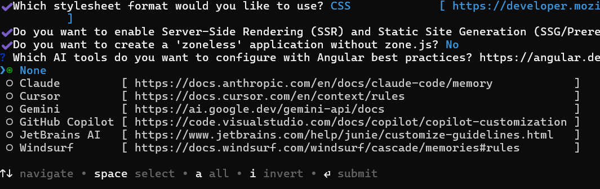

# Getting Started with Angular File Manager component

The File Manager component provides a graphical user interface for browsing, managing, and organizing files and folders. This section explains how to create a simple **File Manager** component and its basic usage.

## Prerequisites

Ensure your development environment meets the [System Requirements for Syncfusion<sup style="font-size:70%">&reg;</sup> Angular UI Components](https://ej2.syncfusion.com/angular/documentation/system-requirement).

## Setup the Angular application

A straightforward approach to beginning with Angular is to create a new application using the [Angular CLI](https://github.com/angular/angular-cli). Install Angular CLI globally with the following command:

```sh
npm install -g @angular/cli
```
> **Angular 21 Standalone Architecture:** Standalone components are the default in Angular 21. This guide uses the modern standalone architecture. If you need more information about the standalone architecture, refer to the [Standalone Guide](https://ej2.syncfusion.com/angular/documentation/getting-started/angular-standalone).

## Create a new application

With Angular CLI installed, execute this command to generate a new application:

```sh
ng new syncfusion-angular-app
```

* This command will prompt you to configure settings like enabling Angular routing and choosing a stylesheet format.

```bash

? Which stylesheet format would you like to use? (Use arrow keys)
> CSS             [ https://developer.mozilla.org/docs/Web/CSS                     ]
  Sass (SCSS)     [ https://sass-lang.com/documentation/syntax#scss                ]
  Sass (Indented) [ https://sass-lang.com/documentation/syntax#the-indented-syntax ]
  Less            [ http://lesscss.org                                             ]

```

* By default, a CSS-based application is created. Use SCSS if required:

```bash
ng new syncfusion-angular-app --style=scss
```

* During project setup, when prompted for the Server-side rendering (SSR) option, choose the appropriate configuration.


* Select the required AI tool or 'none' if you do not need any AI tool.



* Navigate to your newly created application directory:

```sh
cd syncfusion-angular-app
```

> Note: In Angular 19 and below, it uses `app.component.ts`, `app.component.html`, `app.component.css` etc. In Angular 20+, the CLI generates a simpler structure with `src/app/app.ts`, `app.html`, and `app.css` (no `.component.` suffixes).

## Adding Syncfusion<sup style="font-size:70%">&reg;</sup> Angular packages

To install the File Manager component, use the following command:

```bash
npm install @syncfusion/ej2-angular-filemanager --save
```

## Adding CSS reference

To install the [Material3](https://www.npmjs.com/package/@syncfusion/ej2-material3-theme) theme package, use the following command:

```bash
npm i @syncfusion/ej2-material3-theme
```

In this package, the File Manager component includes an `index.css` file that automatically loads all the required dependency styles. Add the following import to the **src/styles.css** file.

```css
@import "../node_modules/@syncfusion/ej2-material3-theme/styles/file-manager/index.css";
```

> Ensure that the import order aligns with the component's dependency sequence.

For using SCSS styles, refer to [this guide](https://ej2.syncfusion.com/angular/documentation/common/how-to/sass).

## Add File Manager component

Modify the template in the **src/app/app.ts** file to render the File Manager component. Add the [Angular File Manager](https://www.syncfusion.com/angular-components/angular-file-manager) by using `<ejs-filemanager>` selector in `template` section of the **app.ts** file.

The [ajaxSettings](https://ej2.syncfusion.com/angular/documentation/api/file-manager#ajaxsettings) property must be defined while initializing the File Manager. File Manager utilizes the URL's mentioned in ajaxSettings to send file operation request to the server. The File Manager service link is provided in the `hostUrl` variable.












  



## Run the application

Use the npm start command to run the application in the browser:

```sh
npm start
```

## See also

* [Ajax Settings Configuration (uploadUrl, downloadUrl, getImageUrl)](./file-operations#ajax-settings-configuration)
* [Injecting Services for Overview](./user-interface#injecting-services-for-overview)
* [File Manager Views](./views)
* [File Manager File Operations](./file-operations)
* [File Manager Upload](./upload)
* [File Manager Customization](./customization)