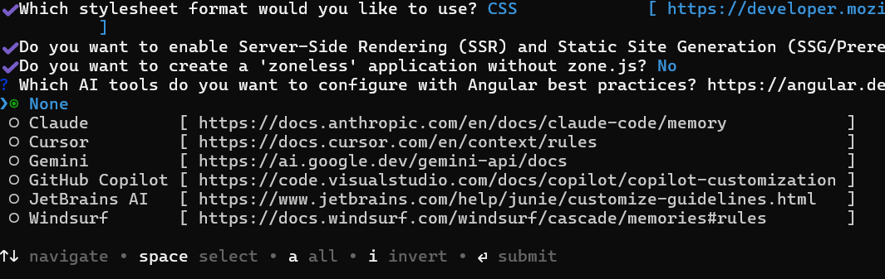

# Getting Started with Angular File Manager

The File Manager component provides a graphical user interface for browsing, managing, and organizing files and folders. This section explains how to create a simple **File Manager** component and its basic usage.





## Prerequisites

- [Node.js 24+](https://nodejs.org/en) (LTS recommended).
- Syncfusion CLI.

## Install the Syncfusion CLI 

Install the Syncfusion CLI globally using the following command:



npm install -g @syncfusion/syncfusion-cli



## Create a new Angular application using Syncfusion CLI

You can create a Angular application using the Syncfusion CLI. The CLI provides two ways to create a project:

### Non-interactive mode

Non-interactive mode allows you to create a project directly using a single command with the required command-line arguments.



sf new syncfusion-angular-app --framework angular --template file-manager



In this mode, the project configuration is passed directly in the command. The above command creates a Angular application configured with the Syncfusion<sup style="font-size:70%">&reg;</sup> File Manager component.

### Interactive mode

Interactive mode guides you through the project creation process with step-by-step prompts.



sf



When you run the `sf` command, the CLI prompts you to select the required project configuration. To create a Angular application with the Syncfusion<sup style="font-size:70%">&reg;</sup> `File Manager` component, select the following options:




√ Project name? ... syncfusion-angular-app
√ Choose Framework: » Angular
√ Choose Template: » File Manager
√ Choose Theme: » Material3
√ Choose Style Format: » CSS
√ Would you like to integrate the Syncfusion MCP Server (AI Assistant) into this project? ... no
√ Would you like to install Syncfusion Component Skills for AI-powered development? ... no
√ Install dependencies and start app now? ... no




The above selections generate a Angular application configured with the Syncfusion<sup style="font-size:70%">&reg;</sup> `File Manager` component. You can choose different values for language, theme, style format, MCP setup, and skills installation based on your project requirements.

The Syncfusion<sup style="font-size:70%">&reg;</sup> CLI creates the project with a predefined template. After the project is generated, you can customize or replace the component code based on your application requirements.

## Run the project

Once the project is created, navigate to the project directory and run the following commands in your terminal.



cd syncfusion-angular-app
npm install
ng serve



The output will appear as follows:






## Prerequisites

| Requirement | Version |
|-------------|---------|
| Angular | 12 and above |
| Node.js | 14.0.0 or above, Recommended: Latest Version |

### Angular supported versions

| Angular Version | Minimum Syncfusion<sup style="font-size:70%">&reg;</sup> Angular File Manager Version |
|-----------------|-----------------------------------------------|
|[Angular v20](https://www.syncfusion.com/blogs/post/whats-new-in-angular-20)| 29.2.8|
|[Angular v19](https://blog.angular.dev/meet-angular-v19-7b29dfd05b84/)| 26.1.35 |
| [Angular v18](https://blog.angular.dev/angular-v18-is-now-available-e79d5ac0affe/) | 25.2.3 |
| [Angular v17](https://blog.angular.io/introducing-angular-v17-4d7033312e4b/)| 23.2.4 |
| [Angular v16](https://blog.angular.io/angular-v16-is-here-4d7a28ec680d/)| 21.1.39 |
| [Angular v15](https://blog.angular.io/angular-v15-is-now-available-df7be7f2f4c8/) | 20.4.38 |
|[Angular v14](https://blog.angular.io/angular-v14-is-now-available-391a6db736af/)| 20.2.36 |
| [Angular v13](https://blog.angular.io/angular-v13-is-now-available-cce66f7bc296/) | 19.4.38 and above |
| [Angular v12](https://blog.angular.io/angular-v12-is-now-available-32ed51fbfd49/)| 19.3.43 |

### Browser Support

| Browser | Supported Versions |
|:--------|:-------------------|
| Google Chrome, including Android & iOS  | Latest 2 versions |
| Mozilla Firefox	 | Latest version |
| Microsoft Edge	    | Latest 2 versions |
| Apple Safari, including iOS	  | Latest 2 versions |

## Setup the Angular application

A straightforward approach to beginning with Angular is to create a new application using the [Angular CLI](https://github.com/angular/angular-cli). Install Angular CLI globally with the following command:

```sh
npm install -g @angular/cli
```
> **Angular 21 Standalone Architecture:** Standalone components are the default in Angular 21. This guide uses the modern standalone architecture. If you need more information about the standalone architecture, refer to the [Standalone Guide](https://ej2.syncfusion.com/angular/documentation/getting-started/angular-standalone).

## Create a new application

With Angular CLI installed, execute this command to generate a new application:

```sh
ng new syncfusion-angular-app
```

* This command will prompt you to configure settings like enabling Angular routing and choosing a stylesheet format.

```bash

? Which stylesheet format would you like to use? (Use arrow keys)
> CSS             [ https://developer.mozilla.org/docs/Web/CSS                     ]
  Sass (SCSS)     [ https://sass-lang.com/documentation/syntax#scss                ]
  Sass (Indented) [ https://sass-lang.com/documentation/syntax#the-indented-syntax ]
  Less            [ http://lesscss.org                                             ]

```

* By default, a CSS-based application is created. Use SCSS if required:

```bash
ng new syncfusion-angular-app --style=scss
```

* During project setup, when prompted for the Server-side rendering (SSR) option, choose the appropriate configuration.


* Select the required AI tool or 'none' if you do not need any AI tool.



* Navigate to your newly created application directory:

```sh
cd syncfusion-angular-app
```

> Note: In Angular 19 and below, it uses `app.component.ts`, `app.component.html`, `app.component.css` etc. In Angular 20+, the CLI generates a simpler structure with `src/app/app.ts`, `app.html`, and `app.css` (no `.component.` suffixes).

## Adding Syncfusion<sup style="font-size:70%">&reg;</sup> Angular packages

To install the File Manager component, use the following command:

```bash
npm install @syncfusion/ej2-angular-filemanager --save
```

## Adding CSS reference

Themes for Syncfusion® File Manager components can be applied using CSS files provided through [npm theme packages](https://www.npmjs.com/package/@syncfusion/ej2-material3-theme). For available themes, refer to the [Themes](https://ej2.syncfusion.com/angular/documentation/appearance/overview) documentation.

Install the Material 3 theme package using the following command:




npm install @syncfusion/ej2-material3-theme --save




Then add the following CSS reference to the **src/style.css** file:




@import "../node_modules/@syncfusion/ej2-material3-theme/styles/file-manager/index.css";




For using SCSS styles, refer to [this guide](https://ej2.syncfusion.com/angular/documentation/common/how-to/sass).

## Add File Manager component

Modify the template in the **src/app/app.ts** file to render the File Manager component. Add the [Angular File Manager](https://www.syncfusion.com/angular-components/angular-file-manager) by using `<ejs-filemanager>` selector in `template` section of the **app.ts** file.

The [ajaxSettings](https://ej2.syncfusion.com/angular/documentation/api/file-manager#ajaxsettings) property must be defined while initializing the File Manager. File Manager utilizes the URLs mentioned in `ajaxSettings` to send file operation requests to the server. The File Manager service link is provided in the `hostUrl` variable.

### Server-side setup

The sample uses `https://physical-service.syncfusion.com/` as the [`url`](https://ej2.syncfusion.com/angular/documentation/api/file-manager/ajaxsettings#url) endpoint in [`ajaxSettings`](https://ej2.syncfusion.com/angular/documentation/api/file-manager/ajaxsettings).

To use your own files, host a File Manager service and replace the `url` value with your service endpoint. See the [File System Provider](./file-system-provider) documentation for setup details.












  


## Registering Your Syncfusion License

Before using Syncfusion components, generate a license key from the [Syncfusion License Dashboard](https://www.syncfusion.com/account/downloads) and register

Open the `main.ts` file and add the following code:

```typescript
import { registerLicense } from '@syncfusion/ej2-base';
registerLicense('YOUR_LICENSE_KEY');
```

> **Note:** A valid Syncfusion license is required for production use. If a valid license is not registered, a trial license warning message will be displayed when the application runs.

## Run the application

Use the npm start command to run the application in the browser:

```sh
npm start
```

N> Looking for the full Angular File Manager component overview, features, pricing, and documentation? Visit the [Angular File Manager](https://www.syncfusion.com/angular-components/angular-file-manager) page.

### Production Build

To create an optimized production build, run:

```bash
ng build
```

This command compiles the application and generates the production-ready files in the `dist/` directory.

To preview the production build locally, run:

```bash
npx http-server dist
```

Then open the URL displayed in the terminal.




## Troubleshooting

- **File Manager styles are not applied:** Ensure the required Syncfusion theme CSS is imported in `src/styles.css`.
- **Trial license warning message:** Register a valid Syncfusion license key using the `registerLicense()` method from `@syncfusion/ej2-base`.
- **Port 4200 is already in use:** Stop the conflicting process or run the application on a different port:

  ```bash
  ng serve --port 3000
  ```

## See also

* [Ajax Settings Configuration (uploadUrl, downloadUrl, getImageUrl)](./file-operations#ajax-settings-configuration)
* [Injecting Services for Overview](./user-interface#injecting-services-for-overview)
* [File Manager Views](./views)
* [File Manager File Operations](./file-operations)
* [File Manager Upload](./upload)
* [File Manager Customization](./customization)