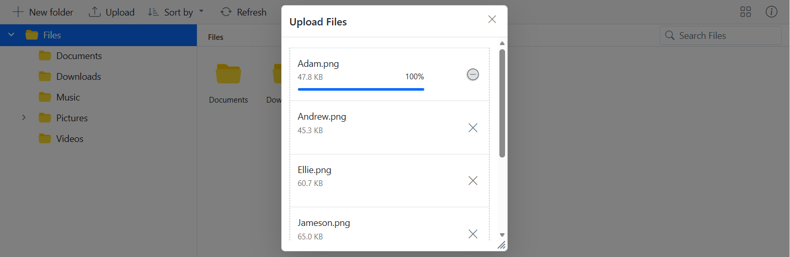

# Upload in Angular File Manager component

The [Angular File Manager](https://www.syncfusion.com/angular-components/angular-file-manager) component provides a [uploadSettings](https://ej2.syncfusion.com/angular/documentation/api/file-manager/uploadsettings) property with various options to customize how files are uploaded, including controlling file size, restricting file types, checking for excessively large and empty files, and enabling chunk uploads.

## Directory Upload

The [directoryUpload](https://ej2.syncfusion.com/angular/documentation/api/file-manager/uploadsettingsmodel#directoryupload) property controls whether users can browse and upload entire directories (folders) in the [Angular File Manager](https://www.syncfusion.com/angular-components/angular-file-manager) component. 

To enable directory upload, set the `directoryUpload` property to `true` in the `uploadSettings` configuration.

When set to `true`, this property enables directory upload in the File Manager, allowing users to upload entire folders. If set to `false`, only individual files can be uploaded. 










  


> **Note:** When `directoryUpload` is set to `true`, only folders can be uploaded. When it is set to `false`, only individual files can be uploaded. The File Manager does not support simultaneous uploading of both files and folders in a single operation.

To learn more about the folder upload actions, refer to this [link](https://ej2.syncfusion.com/angular/documentation/file-manager/file-operations#folder-upload-support)

## Sequential Upload

The [sequentialUpload](https://ej2.syncfusion.com/angular/documentation/api/file-manager/uploadsettingsmodel#sequentialupload) property controls whether users can upload files one by one in a sequential manner in the Angular File Manager component. 

To enable sequential upload, set the `sequentialUpload` property to `true` in the `uploadSettings` configuration.

When set to `true`, the selected files will process sequentially (one after the other) to the server. If the file uploaded successfully or failed, the next file will upload automatically in this sequential upload. This feature helps to reduce the upload traffic and reduce the failure of file upload. 










  


The screenshot below shows that each file begins uploading only after the previous one completes. This demonstrates how the `sequentialUpload` property works in the File Manager component.

To learn more about the folder upload actions, refer to this [link](https://ej2.syncfusion.com/angular/documentation/file-manager/file-operations#folder-upload-support)

## Chunk Upload

The [chunkSize](https://ej2.syncfusion.com/angular/documentation/api/file-manager/uploadsettingsmodel#chunksize) property enables large file uploads by dividing files into smaller chunks that are uploaded sequentially to the server.

When the selected file size exceeds the specified `chunkSize` value, the file is automatically divided into multiple segments for upload. By default, chunk upload is disabled. Setting a value (in bytes) activates this feature.

Benefits of chunk upload include:
- Reduced network load
- Better upload reliability for large files
- Pause and resume capability during uploads

In the following example, the chunkSize is set to 5 MB (5,242,880 bytes), and the maxFileSize is set to 70 MB (73,728,000 bytes). This means files that are up to 70 MB will be uploaded in 5 MB chunks.










  


With chunk upload enabled, users gain access to pause and resume controls during the upload process, providing enhanced control over file uploads.

> **Note:** 
> 1. Chunk upload will only activate when the selected file size is greater than the specified chunk size. Otherwise, files will be uploaded normally.
> 2. The pause and resume features are only available when chunk upload is enabled.

## Auto Upload

The [autoUpload](https://ej2.syncfusion.com/angular/documentation/api/file-manager/uploadsettingsmodel#autoupload) property controls whether files are automatically uploaded when added to the upload queue.

The default value is `true`, the File Manager will automatically upload files as soon as they are added to the upload queue. If set to `false`, the files will not be uploaded automatically, giving you the chance to manipulate the files before uploading them to the server.










  


## Auto Close

The [autoClose](https://ej2.syncfusion.com/angular/documentation/api/file-manager/uploadsettingsmodel#autoclose) property controls whether the upload dialog automatically closes after all the files have been uploaded.

The default value is set to `false`, the upload dialog remains open even after the upload process is complete. If `autoClose` set to `true`, the upload dialog will automatically close after all the files in the upload queue are uploaded.










  


## Prevent upload based on file extensions

The [allowedExtensions](https://ej2.syncfusion.com/angular/documentation/api/file-manager/uploadsettingsmodel#allowedextensions) property specifies which file types are allowed for upload in the File Manager component by defining their extensions.

By default, all file types are allowed. To restrict uploads to specific file types, provide a comma-separated list of file extensions (including the period). For example, to allow only image files, set `allowedExtensions` to `.jpg,.png,.jpeg`.

When users attempt to upload files with extensions not in the allowed list, those files will be rejected with an appropriate error message.

If you want to allow only image files like .jpg and .png, you would set the property as follows:










  


## Restrict drag and drop upload

The File Manager component supports external drag-and-drop functionality that allows uploading files by dragging them from the local file system directly into the File Manager interface.

There are two separate drag-and-drop behaviors that can be controlled:
1. Internal drag-and-drop within the File Manager (controlled by the [allowDragAndDrop](https://ej2.syncfusion.com/angular/documentation/api/file-manager/index-default#allowdraganddrop) property)
2. External drag-and-drop from outside the File Manager (controlled by the uploader's [dropArea](https://ej2.syncfusion.com/angular/documentation/api/uploader/index-default#droparea) property)

To disable external drag-and-drop uploads completely, you need to set the `dropArea` property to null using the File Manager instance methods, as shown in the example below:












  


> **Note:** Setting the `allowDragAndDrop` property to false only prevents drag-and-drop operations within the File Manager itself (such as moving files between folders). It does not prevent external drag-and-drop uploads. To disable external drag-and-drop uploads, you must set the `dropArea` property to null as shown in the example.

## See also

* [Set min and max file size in upload](https://ej2.syncfusion.com/angular/documentation/file-manager/customization#upload-customization)
