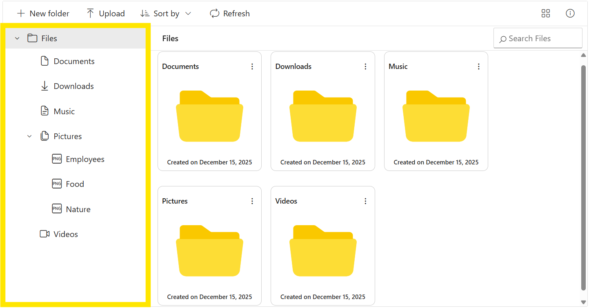
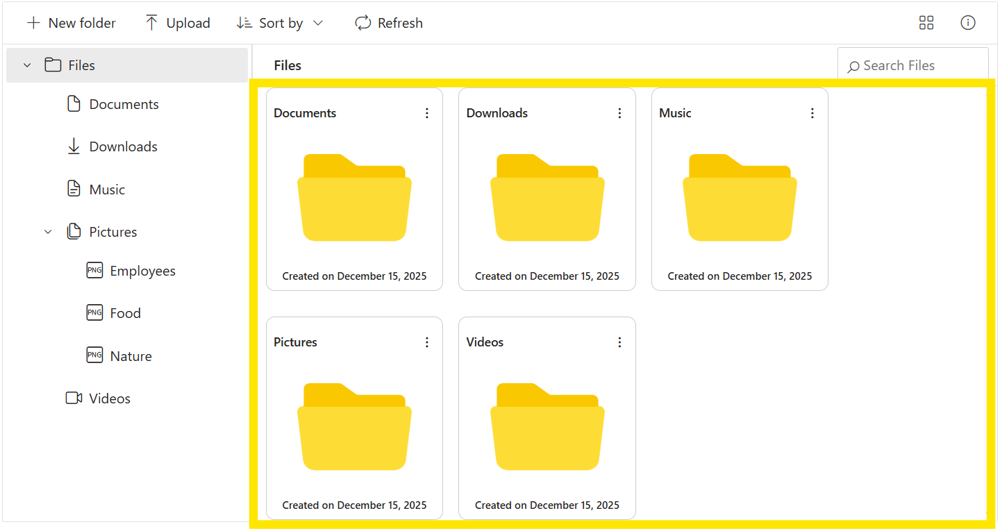
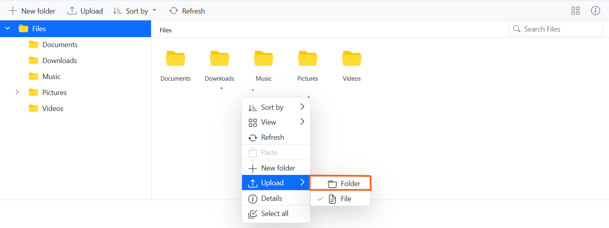

# User interface in Angular File Manager component

The File Manager provides a comprehensive user interface for browsing, organizing, and performing operations on files and folders. This guide explains each UI component and how they work together to provide an intuitive file management experience.

## File Manager UI overview

The File Manager UI consists of several integrated sections that enhance the user experience:
* [View](#view) - Displays files and folders in either Large Icons or Details view
* [Toolbar](#toolbar) - Provides quick access to common file operations
* [Navigation Pane](#navigation-pane)- Enables easy folder navigation through a tree structure
* [Breadcrumb](#breadcrumb) - Shows the current path and parent folder navigation
* [Context Menu](#context-menu) - Provides contextual operations for files and folders


## Basic vs. full-featured File Manager

The File Manager comes in two configurations:

### Full-featured File Manager
Includes all injectable modules (Toolbar, Navigation Pane, and Details View) for comprehensive file management capabilities.

### Basic File Manager
A lightweight version with essential functionality for simple use cases, including:
* [View](#view) (Large Icons view for browsing files and folders),
* [Breadcrumb](#breadcrumb) (For parent folder navigations),
* [Context Menu](#context-menu) (For accessing file operations).


## Injecting Services for Overview

The basic File Manager includes a context menu, large-icons view, and breadcrumb navigation. You can extend its functionality by injecting additional feature modules:

* Toolbar: Provides quick access to common operations
* Navigation pane: Shows folder hierarchy for easy navigation
* Details view: Displays files and folders in a detailed list format

Import and inject these modules as providers in your `app.component.ts`:

```typescript
import { FileManagerModule, NavigationPaneService, ToolbarService, DetailsViewService } from '@syncfusion/ej2-angular-filemanager';
import { Component } from '@angular/core';

@Component({
  imports: [
    FileManagerModule
  ],
  standalone: true,
  providers: [NavigationPaneService, ToolbarService, DetailsViewService]
})
export class App { }
```












  


## Toolbar

The toolbar provides quick access to common file operations through a set of action buttons. It's an injectable module that must be included before rendering the File Manager.

The toolbar intelligently handles space constraints—if there are too many items to display, excess items are moved to a dropdown menu accessed via a button at the end of the toolbar.

*Refer [Toolbar](./file-operations#toolbar) section in file operations to know more about the buttons present in toolbar*.


## Files and folders navigation

The File Manager provides navigation between files and folders using the following two options.

* [Navigation Pane](#navigation-pane)
* [Breadcrumb](#breadcrumb)

### Navigation pane

The navigation pane is an injectable module that displays the folder hierarchy as a tree structure, allowing users to easily navigate between folders. It appears on the left side of the File Manager interface.

You can customize the navigation pane using the [navigationPaneSettings](https://ej2.syncfusion.com/angular/documentation/api/file-manager/index-default#navigationpanesettings) property:
* Control minimum and maximum width
* Show or hide the pane using the `visible` option

You can customize the appearance of the navigation pane by using the `navigationPaneTemplate` property. This enables you to modify icons, display text, and include additional elements to suit your application's requirements.



### Breadcrumb

The breadcrumb displays the current folder path and enables navigation to any parent folder. It's designed to be responsive—when the path becomes too long for the available space, a dropdown button appears at the beginning of the breadcrumb, containing parent folders closer to the root.


## View

The view section displays files and folders for browsing. The File Manager offers two view modes:

* [Large Icons View](#large-icons-view)
* [Details View](#details-view)

The `large icons view` is the default starting view in the File Manager. The view can be changed by using the [toolbar](#toolbar) view button or by using the view menu in [context menu](#context-menu). The [view](https://ej2.syncfusion.com/angular/documentation/api/file-manager/index-default#view) API can also be used to change the initial view of the File Manager.

### Large icons view

In the large icons view, the thumbnail icons will be shown in a larger size, which displays the data in a form that best suits their content.  For image and video type files, a **preview** will be displayed. Extension thumbnails will be displayed for other type files.


The `largeIconsTemplate` property enables complete customization of how folders and files are rendered in the `Large Icons View`. It allows you to enhance the layout by adding background images, custom file-type icons, and actions such as dropdown menus.



### Details view

The details view is an injectable module that displays files and folders in a sortable list with multiple columns of information:
* **Name**: File/folder name with type icon
* **Date Modified**: Last modification timestamp
* **Type**: File type information
* **Size**: File size

You can add additional columns using the [detailsViewSettings](https://ej2.syncfusion.com/angular/documentation/api/file-manager/index-default#detailsviewsettings) API. This view allows sorting by clicking on column headers.


## Context menu

The context menu appears on user interaction such as right-click. The File Manager is provided with context menu support to perform list of file operations with the files and folders. Context menu appears with varying menu items based on the targets such as file, folder (including navigation pane folders),  and layout (empty area in view).

Context menu can be customized using the [contextMenuSettings](https://ej2.syncfusion.com/angular/documentation/api/file-manager/index-default#contextmenusettings), [menuOpen](https://ej2.syncfusion.com/angular/documentation/api/file-manager/index-default#menuopen), and [menuClick](https://ej2.syncfusion.com/angular/documentation/api/file-manager/index-default#menuclick) events.

*Refer [Context Menu](./file-operations#context-menu) section in file operations to know more about the menu items present in context menu*.


### Upload Files or Folders via context menu

File Manager control allows to perform the files or folder [upload](https://ej2.syncfusion.com/angular/documentation/file-manager/file-operations#upload) operations with the help of Context Menu items by switching between the Files or Folder from Upload menu item.


