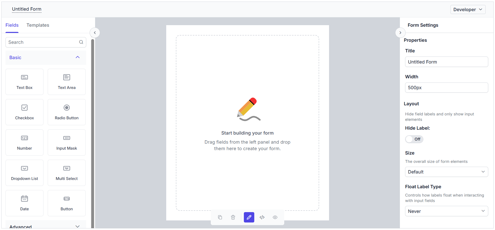
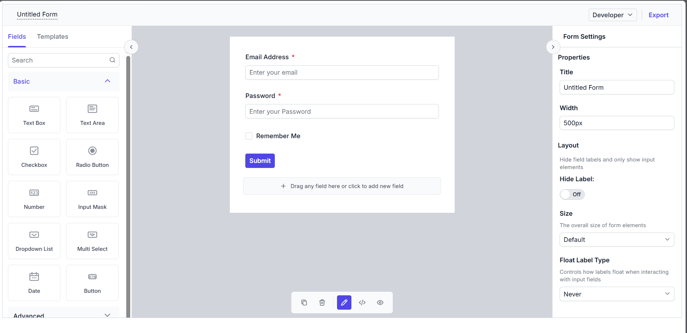

# Exporting and Importing in Angular Form Builder component

The Angular Form Builder supports exporting the generated form schema for reuse in the Form Renderer control and importing an existing schema back into the builder for further editing.

## Export form schema

You can export the generated form schema by clicking the **Export** button in the toolbar at the top of the Form Builder control. The exported schema includes the form structure, field configuration, and other properties required to recreate the form.

You can use the exported schema in the Form Renderer control to render the same form at runtime.

## Disabling the export

Exporting can be disabled in the Form Builder component by setting the `allowExport` property to `false`. The default value of the property is `true`.

```ts
import { Component, ViewChild } from '@angular/core';
import { FormBuilderComponent, FormBuilderModule } from '@syncfusion/ej2-angular-form-builder';

@Component({
  selector: 'app-root',
  standalone: true,
  imports: [FormBuilderModule],
  template: `
  <ejs-form-builder #formObj [allowExport]="false" ></ejs-form-builder>
  `
})
export class App {
  @ViewChild('formObj') public formObj?: FormBuilderComponent;
}
```

The output will appear as follows:



## Import form schema

To import a form, assign the exported schema to the `schema` property of the Form Builder. This loads the form definition into the builder so that you can continue editing it.

The following example shows how to use the same schema for both export and import scenarios.

```ts
import { Component, ViewChild } from '@angular/core';
import { FormBuilderComponent, FormBuilderModule } from '@syncfusion/ej2-angular-form-builder';

@Component({
  selector: 'app-root',
  standalone: true,
  imports: [FormBuilderModule],
  template: `
  <ejs-form-builder #formObj [schema]="schema" ></ejs-form-builder>
  `
})
export class App {
  @ViewChild('formObj') public formObj?: FormBuilderComponent;

  public schema: Schema = {
    "version": "0.1.0",
    "properties": {
      "emailAddress": {
        "id": "textbox_1785491685456_167",
        "name": "emailAddress",
        "type": "string",
        "label": "Email Address",
        "textboxType": "email",
        "required": true,
        "placeholder": "Enter your email",
        "widget": "textbox",
      },
      "password": {
        "id": "textbox_1785491685456_537",
        "name": "password",
        "type": "string",
        "label": "Password",
        "textboxType": "password",
        "required": true,
        "minLength": 6,
        "placeholder": "Enter your password",
        "widget": "textbox"
      },
      "rememberMe": {
        "id": "checkbox_1785491685456_262",
        "name": "rememberMe",
        "type": "boolean",
        "label": "Remember Me",
        "widget": "checkbox"
      },
      "submit": {
        "id": "submit_button_initial",
        "name": "defaultFormsubmit",
        "type": "button",
        "label": "Submit",
        "buttonType": "submit",
        "widget": "button",
        "style": "primary",
        "disabled": false
      }
    },
    "layout": [
      {
        "type": "field",
        "propertyId": "emailAddress"
      },
      {
        "type": "field",
        "propertyId": "password"
      },
      {
        "type": "field",
        "propertyId": "rememberMe"
      },
      {
        "type": "field",
        "propertyId": "submit"
      }
    ],
    "settings": {
      "name": "Untitled Form"
    }
  };
}
```

