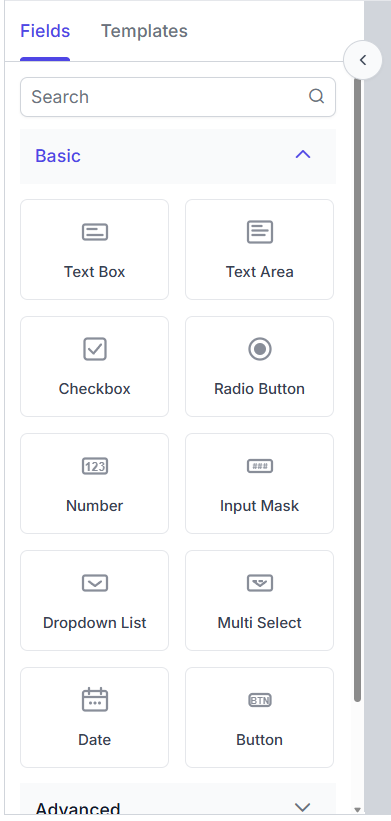
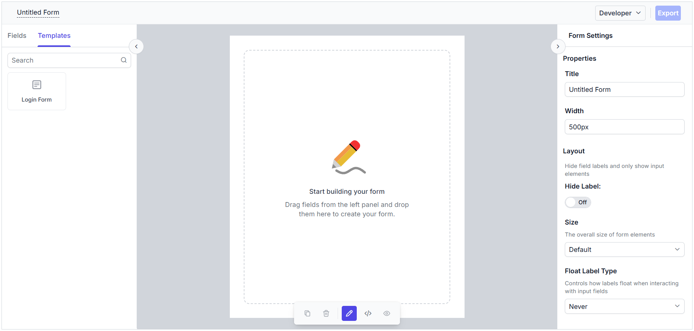
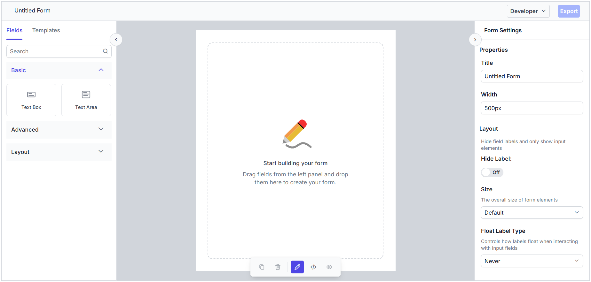

# Field Components Panel in Angular Form Builder component

The **Field Components Panel** is the left pane of the Form Builder. It hosts the draggable palette of form field types, layout containers, and pre-built templates that authors drag onto the design canvas to compose a form.

The pane is split into two tabs that the author can toggle at the top:

- **Fields** — the toolbox with draggable form fields (always available).
- **Templates** — pre-built form schemas (visible in **Developer** mode only).

A search input below the tab strip filters the palette by component label or type. When a search query is active, the accordion collapses and a single flat list of matching components is rendered instead.



## Fields tab

The **Fields** tab displays a categorized list of components that you can drag and drop onto the form canvas to build your form. Components are organized into three expandable categories— **Basic**, **Advanced**, and **Layout** — making it easy to find and add the fields and containers you need. Simply drag a component from the Fields tab and drop it onto your form to start designing.

### Basic

The **Basic** category contains the most common input components.

| Component | Name used in schema |
|---|---|
| Text Box | `textbox` |
| Text Area | `textarea` |
| Checkbox | `checkbox` |
| Radio Button | `radio` |
| Number | `number` |
| Input Mask | `inputMask` |
| Dropdown List | `dropdown` |
| Multi Select | `multiselect` |
| Date | `date` |
| Button | `button` |

### Advanced

The Advanced category contains more specialized input components.

| Component | Name used in schema | Simple mode? |
|---|---|---|
| Checkbox Group | `checkboxGroup` | Visible |
| Date / Time | `dateTime` | Visible |
| Time | `time` | Visible |
| Date Range | `dateRange` | Visible |
| Switch | `switch` | Visible |
| Rating | `rating` | Visible |
| Split Button | `splitButton` | Hidden |
| Range Slider | `rangeSlider` | Visible |
| Signature | `signature` | Hidden |
| Image Editor | `imageEditor` | Hidden |
| File Upload | `fileUpload` | Visible |
| Color Picker | `colorPicker` | Hidden |
| Rich Text Editor | `richTextEditor` | Hidden |
| Data Grid | `dataGrid` | Hidden |

### Layout

The **Layout** category contains containers that group other components. Layout components are not stored in `properties` of the form schema — they appear only as nodes in the `layout[]` array.

| Component | Name used in schema |
|---|---|
| Message | `message` |
| Panel | `panel` |
| Table | `table` |
| Tabs | `tabs` |
| Card | `card` |
| HTML | `staticHtml` |

## Templates tab

The **Templates** tab (available in Developer mode only) displays a flat list of pre-built form templates that you can drag and drop onto the canvas. These templates provide ready-made form layouts to help you quickly get started or add common scenarios to your form. You can also customize the available templates using the `formTemplates` property.

```ts
import { Component, ViewChild } from '@angular/core';
import { FormBuilderComponent, FormBuilderModule } from '@syncfusion/ej2-angular-form-builder';

@Component({
  selector: 'app-root',
  standalone: true,
  imports: [FormBuilderModule],
  template: `
  <ejs-form-builder #formObj [formTemplates]="formTemplates" ></ejs-form-builder>
  `
})
export class App {
  @ViewChild('formObj') public formObj?: FormBuilderComponent;

  public formTemplates = [
    {
      id: "login form",
      title: "login",
      schema: {
        "version": "0.1.0",
        "properties": {
          "emailAddress": {
            "id": "textbox_1785491685456_167",
            "name": "emailAddress",
            "type": "string",
            "label": "Email Address",
            "textboxType": "email",
            "required": true,
            "placeholder": "Enter your email",
            "widget": "textbox",
          },
          "password": {
            "id": "textbox_1785491685456_537",
            "name": "password",
            "type": "string",
            "label": "Password",
            "textboxType": "password",
            "required": true,
            "minLength": 6,
            "placeholder": "Enter your password",
            "widget": "textbox"
          },
          "rememberMe": {
            "id": "checkbox_1785491685456_262",
            "name": "rememberMe",
            "type": "boolean",
            "label": "Remember Me",
            "widget": "checkbox"
          },
          "submit": {
            "id": "submit_button_initial",
            "name": "defaultFormsubmit",
            "type": "button",
            "label": "Submit",
            "buttonType": "submit",
            "widget": "button",
            "style": "primary",
            "disabled": false
          }
        },
        "layout": [
          {
            "type": "field",
            "propertyId": "emailAddress"
          },
          {
            "type": "field",
            "propertyId": "password"
          },
          {
            "type": "field",
            "propertyId": "rememberMe"
          },
          {
            "type": "field",
            "propertyId": "submit"
          }
        ],
        "settings": {
          "name": "Untitled Form"
        }
      }
    }
  ];
}
```

Dragging a template onto the canvas inserts the entire set of components defined by the template's schema. Submit buttons within templates are filtered out to prevent duplicate submit buttons.

The output will appear as follows:



## Customizing the toolbox items

The form fields in the toolbox can be customized using the `toolboxCategories` property. 

```ts
import { Component, ViewChild } from '@angular/core';
import {
  ComponentCategory,
  FormBuilderComponent,
  FormBuilderModule,
  FormWidgetType
} from '@syncfusion/ej2-angular-form-builder';

@Component({
  selector: 'app-root',
  standalone: true,
  imports: [FormBuilderModule],
  template: `
    <ejs-form-builder
      #formObj
      [toolboxCategories]="toolboxCategories">
    </ejs-form-builder>
  `
})
export class App {
  @ViewChild('formObj')
  public formObj?: FormBuilderComponent;

  public toolboxCategories = [
    {
      category: ComponentCategory.Basic,
      items: [
        FormWidgetType.Textbox,
        FormWidgetType.Textarea
      ]
    },
    {
      category: ComponentCategory.Advanced,
      items: [
        FormWidgetType.Date,
        FormWidgetType.DateRange
      ]
    },
    {
      category: ComponentCategory.Layout,
      items: [
        FormWidgetType.Panel,
        FormWidgetType.Card
      ]
    }
  ];
}
```



## Drag and drop behavior

To add a component or template to the form, simply drag it from the toolbox onto the canvas. When you drop it onto the canvas, the component or template is added to your form, and you can immediately configure its properties in the property panel. You can also reorder the form fields within a layout component using drag and drop.
