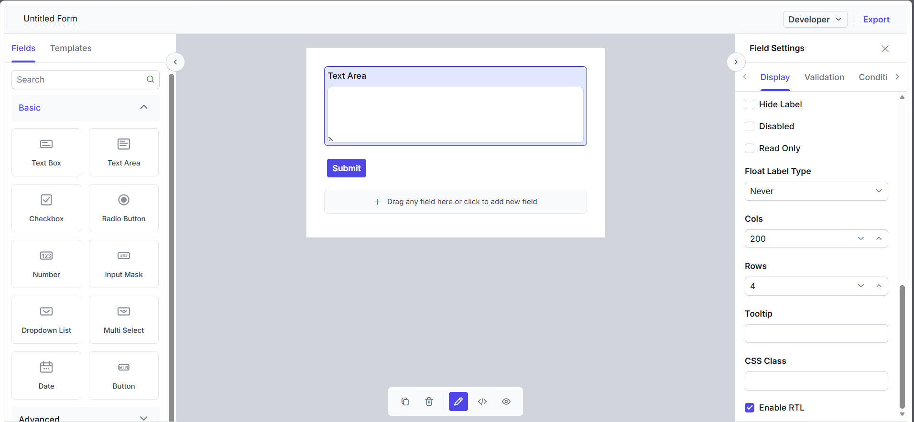
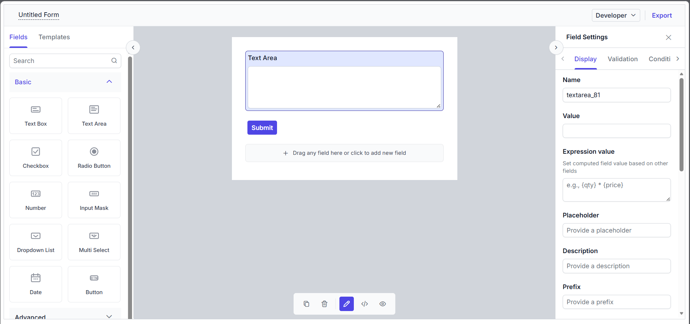

# Property Panel

The **Property Panel** is the right pane of the **Form Builder**. Whenever a field is selected on the design canvas — either by dropping a new field item or by clicking the **Edit** action on an existing field — the right pane switches to property mode and renders the configuration UI for that component.

When no field is selected (for example, on a fresh canvas containing only the default Submit button), the right pane renders the [Form Settings Panel](./form-settings) instead.

## When the property panel appears

The right pane switches to property mode in three situations:

1. **New field drop** — A form field item is dropped onto the canvas or into a nested container. The property dialog for the new component opens immediately so the author can configure its label and primary attributes before continuing.
2. **Edit action** — The author clicks the field wrapper on the canvas to reopen the property panel for an existing field.
3. **Widget switch** — In Developer mode, the author can switch the widget type of the selected field (for example, from `textbox` to `textarea`). The property dialog re-opens for the new widget type with sensible defaults carried over from the original component.

When the dialog is closed explicitly (using the close button), the right pane reverts to the [Form Settings Panel](./form-settings).

## Elements in the property panel

In the property panel, different tabs are available for each form field. They are:

- **Display** — This tab contains basic display-related properties such as labels, placeholders, default values, layout attributes, and visual styling for a form field.
- **Validation** — This tab contains validation-related properties such as the required flag, min/max length, regex pattern, and custom validation.
- **Conditions** — This tab contains a button that opens the Conditions editor for authoring conditional visibility, required, disable, read-only, set-value, choice-based, and conditional-data rules. Once added, the rules will be available in this panel for further editing.
- **Layout** — This tab contains options to customize the form field within the layout, such as the size of the control and its HTML attributes.
- **Data** — This tab is applicable only to the Data Grid. It is used to provide the data source and customize the columns in the grid.

## Real-time auto-save

The property panel automatically saves your changes as you make them. There is no Save button — any adjustment you make is instantly applied to your form and reflected on the design canvas. This makes editing fast and seamless, so you can focus on building your form without worrying about saving your work.

## Adding a new property in the property panel
Properties of the built-in Syncfusion controls, or properties related to the [template](./template), can be added dynamically to the property panel using the `setProperty` method in the Form Builder.

```ts
import { Component, ViewChild } from '@angular/core';
import { FormBuilderComponent, FormBuilderModule, FormWidgetType } from '@syncfusion/ej2-angular-form-builder';

@Component({
  selector: 'app-root',
  standalone: true,
  imports: [FormBuilderModule],
  template: `
  <ejs-form-builder #formObj [enablePreview]="false"></ejs-form-builder>
  `
})
export class App {
  @ViewChild('formObj') public formObj?: FormBuilderComponent;

    ngAfterViewInit() {
    // Set property for Textarea widget
    this.formObj?.setProperty(FormWidgetType.Textarea, {
      key: 'enableRtl',
      label: 'Enable RTL',
      type: 'boolean',
      default: false
    });
  }
}
```



## Hiding a property from the property panel
An existing property in the property panel can be hidden by getting the property details using the `getProperty` method of the Form Builder and setting the `visible` property to **false**.

```ts
import { Component, ViewChild } from '@angular/core';
import { FormBuilderComponent, FormBuilderModule, FormWidgetType } from '@syncfusion/ej2-angular-form-builder';

@Component({
  selector: 'app-root',
  standalone: true,
  imports: [FormBuilderModule],
  template: `
  <ejs-form-builder #formObj [enablePreview]="false"></ejs-form-builder>
  `
})
export class App {
  @ViewChild('formObj') public formObj?: FormBuilderComponent;

  ngAfterViewInit() {
    const labelProp = this.formObj?.getProperty(FormWidgetType.Textarea, "label");
    if (labelProp) {
      labelProp.visible = false;
    }
    this.formObj?.refresh();
  }
}
```

