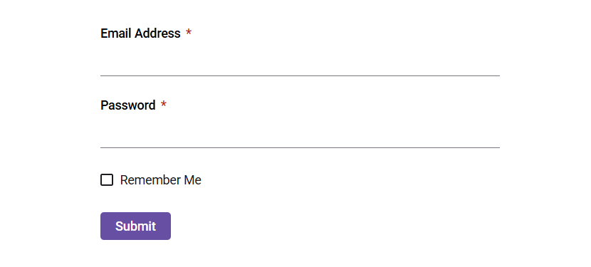

# Getting Started with Angular Form Renderer component

The Form Renderer is a powerful, schema-driven component that enables you to build and render complex forms with ease using a structured JSON schema definition. It streamlines form creation, customization, and data capture by letting you declaratively define form layouts, fields, and validation, and then render the form through a simple component property binding.

This guide demonstrates how to set up and configure the Syncfusion<sup style="font-size:70%">&reg;</sup> Angular Form Renderer component, from initial installation through setting up the form schema in the component.

> Note: This guide supports **Angular 21** and other recent Angular versions. For detailed compatibility with other Angular versions, please refer to the [Angular version support matrix](https://ej2.syncfusion.com/angular/documentation/system-requirement#angular-version-compatibility). Starting from Angular 19, standalone components are the default, and this guide reflects that architecture.

## Prerequisites

- Install a supported [Node.js](https://nodejs.org/en) LTS release and npm (or another Node package manager) before continuing.
- Ensure your environment meets the [System Requirements for Syncfusion<sup style="font-size:70%">&reg;</sup> Angular UI Components](https://ej2.syncfusion.com/angular/documentation/system-requirement).
- Supported Angular and Syncfusion package combinations are listed in the [Version Compatibility](https://ej2.syncfusion.com/angular/documentation/upgrade/version-compatibility) guide.

## Setup the Angular application

A straightforward approach to getting started with Angular is to create a new application using the [Angular CLI](https://github.com/angular/angular-cli). Install Angular CLI globally with the following command:

```bash
npm install -g @angular/cli
```
To install a particular version of Angular CLI, use:

```bash
npm install -g @angular/cli@21.0.0
```

> **Angular 21 Standalone Architecture:** Standalone components are the default in Angular 21. This guide uses the modern standalone architecture. If you need more information about the standalone architecture, refer to the [Standalone Guide](https://ej2.syncfusion.com/angular/documentation/getting-started/angular-standalone).

## Create a new application

With Angular CLI installed, use this command to generate a new application:

```bash
ng new syncfusion-angular-app
```

* This command will prompt you to configure settings like enabling Angular routing and choosing a stylesheet format.

```bash

? Which stylesheet format would you like to use? (Use arrow keys)
> CSS             [ https://developer.mozilla.org/docs/Web/CSS                     ]
  Sass (SCSS)     [ https://sass-lang.com/documentation/syntax#scss                ]
  Sass (Indented) [ https://sass-lang.com/documentation/syntax#the-indented-syntax ]
  Less            [ http://lesscss.org                                             ]

```

* By default, a CSS-based application is created. Use SCSS if required:

```bash
ng new syncfusion-angular-app --style=scss
```

* During project setup, when prompted for the Server-side rendering (SSR) option, choose the appropriate configuration.


* Select the required AI tool, or choose 'None' if you do not need one.


* Navigate to your newly created application directory:

```bash
cd syncfusion-angular-app
```

> Note: In Angular 19 and earlier, the project uses `app.component.ts`, `app.component.html`, and `app.component.css`, and so on. In Angular 20+, the CLI generates a simpler structure with `app.ts`, `app.html`, and `app.css` (no `.component.` suffixes).

## Adding the Syncfusion<sup style="font-size:70%">&reg;</sup> Angular Form Renderer package

To install the **Syncfusion<sup style="font-size:70%">&reg;</sup> Angular Form Renderer** package, use the following command:

```bash
ng add @syncfusion/ej2-angular-form-renderer
```

The `ng add` command installs the package, registers it in `package.json`, and configures the required entries in your workspace automatically. 

If `ng add` is unavailable in your setup, install the package manually with:

```bash
npm install @syncfusion/ej2-angular-form-renderer
```

## Adding CSS reference

Themes for the Syncfusion<sup style="font-size:70%">&reg;</sup> Form Renderer component can be applied using CSS files provided through [npm theme packages](https://www.npmjs.com/package/@syncfusion/ej2-material3-theme). For available themes, refer to the [Themes](https://ej2.syncfusion.com/angular/documentation/appearance/overview) documentation.

Install the Material 3 theme package using the following npm command:

```bash
npm install @syncfusion/ej2-material3-theme
```

Then add the following CSS reference to the **src/styles.css** file. This is the default global stylesheet registered under `styles` in `angular.json`:

```css
@import "../node_modules/@syncfusion/ej2-material3-theme/styles/material3.css";
```

## Add Syncfusion<sup style="font-size:70%">&reg;</sup> Form Renderer component

After package and theme setup, update the root component. File and class names can vary by Angular CLI version (`src/app/app.ts` with `export class App`, or `app.component.ts` with `AppComponent`). Replace the root component content with the sample below, or merge the Form Renderer import, schema, and event handler into your generated file.

The Form Renderer is a schema-driven component. Define your form by passing a JSON schema to the `schema` property of the `<ej2-form-renderer>` element, and capture the submitted form data through the `submit` event.

 ```typescript
import { Component } from '@angular/core';
import { FormRendererAllModule, Schema } from '@syncfusion/ej2-angular-form-renderer';

@Component({
  selector: 'app-root',
  standalone: true,
  imports: [FormRendererAllModule],
  template: `<ejs-form-renderer [schema]="schema" (submit)="onSubmit($event)"></ejs-form-renderer>`
})

export class AppComponent {
  public schema: Schema = {
    "version": "0.1.0",
    "properties": {
      "emailAddress": {
        "id": "textbox_1785491685456_167",
        "name": "emailAddress",
        "type": "string",
        "label": "Email Address",
        "textboxType": "email",
        "required": true,
        "widget": "textbox"
      },
      "password": {
        "id": "textbox_1785491685456_537",
        "name": "password",
        "type": "string",
        "label": "Password",
        "textboxType": "password",
        "required": true,
        "minLength": 6,
        "widget": "textbox"
      },
      "rememberMe": {
        "id": "checkbox_1785491685456_262",
        "name": "rememberMe",
        "type": "boolean",
        "label": "Remember Me",
        "widget": "checkbox"
      },
      "submit": {
        "id": "submit_button_initial",
        "name": "defaultFormsubmit",
        "type": "button",
        "label": "Submit",
        "buttonType": "submit",
        "widget": "button",
        "style": "primary",
        "disabled": false
      }
    },
    "layout": [
      {
        "type": "field",
        "propertyId": "emailAddress"
      },
      {
        "type": "field",
        "propertyId": "password"
      },
      {
        "type": "field",
        "propertyId": "rememberMe"
      },
      {
        "type": "field",
        "propertyId": "submit"
      }
    ],
    "settings": {
      "name": "Untitled Form"
    }
  };
  public onSubmit(args: any) {
    if(args.data){
    console.log(args.data, args.isValid);
    }
  }
}
```

## Running the application

Run the application using the following command:

```bash
ng serve
```

When the build succeeds, the CLI reports a local URL (default: http://localhost:4200). Open that URL in a browser to view the Form Renderer. If the port is already in use, the CLI prompts for another port, or you can run `ng serve --port 4201`.

The output will appear as follows:



## See Also

* [Getting Started with Angular Standalone](./angular-standalone) — deeper standalone-focused walkthrough
* [Getting Started with ASP.NET Core and Angular using the Project Template](./aspnet-core)
* [Getting Started with Angular CLI as frontend in ASP.NET MVC](./aspnet-mvc)
* [Getting Started with Ionic and Angular](../frameworks-and-feature/ionic)
* [Getting Started with Angular and Electron](../frameworks-and-feature/electron)
* [Upgrade Guide](../upgrade/upgrading-syncfusion)