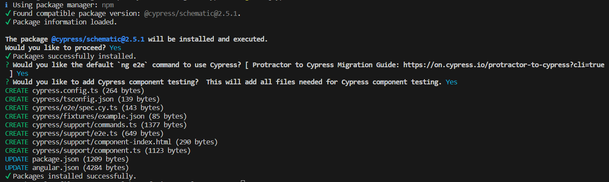
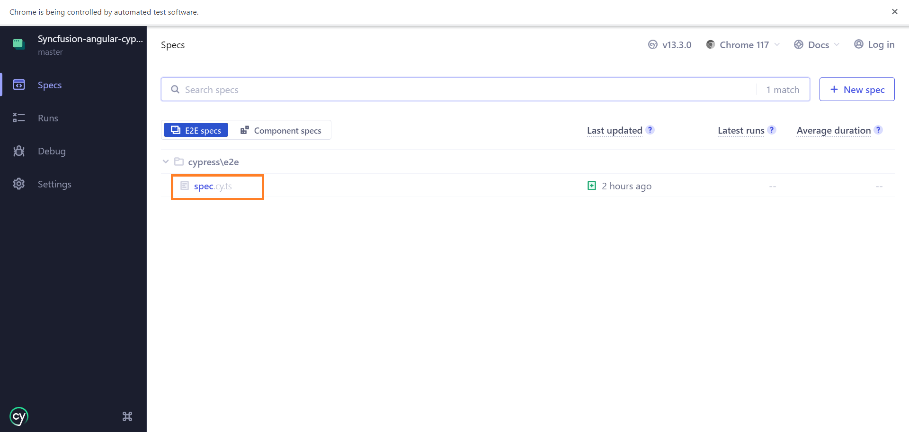
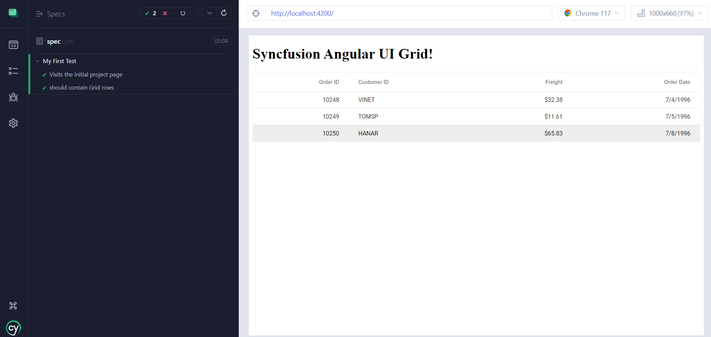
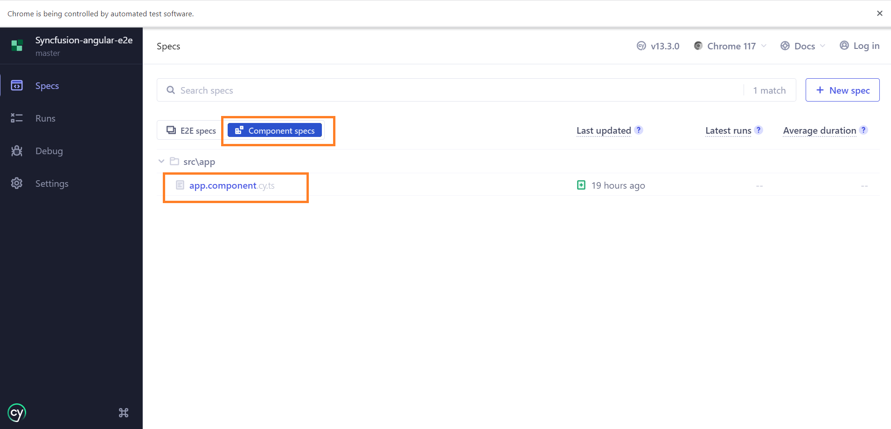
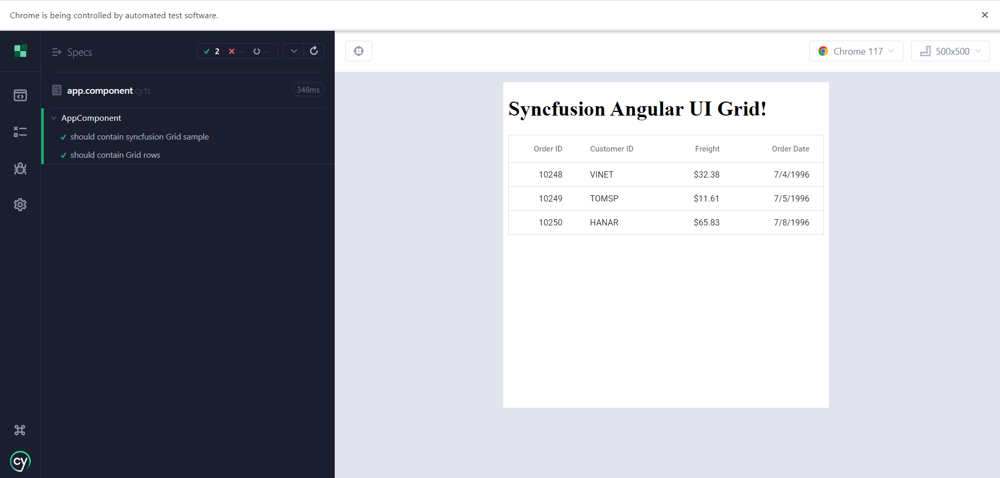

# Angular Cypress Testing

This document explains how to perform the E2E and Component testing with Syncfusion Angular components in Angular web applications using Cypress.

## Cypress

Cypress is a JavaScript-based End-to-End (E2E) testing framework and a next-generation front-end testing tool designed for modern web applications. Cypress is designed to make testing web applications easier, more efficient, and reliable.

For more information about Cypress, refer to this [documentation](https://docs.cypress.io/guides/overview/why-cypress.html).

## Integrate Cypress with Angular

To integrate Cypress with Angular, follow the below steps.

1.Create the angular application and add the Syncfusion DataGrid component by following the [getting started](https://ej2.syncfusion.com/angular/documentation/getting-started/angular-cli) documentation.

2.Once create the application, run the below command to install the Cypress.




ng add @cypress/schematic




## Cypress Testing types

Cypress supports two [types of testing](https://docs.cypress.io/guides/core-concepts/testing-types). Users can choose the testing type based on their requirements.

* [E2E Testing](#cypress-e2e-testing-of-syncfusion-angular-components)
* [Component Testing](#cypress-component-testing-of-syncfusion-angular-components)

For Cypress testing type comparison, refer to this [documentation](https://docs.cypress.io/guides/core-concepts/testing-types#Testing-Type-Comparison).

## Cypress E2E Testing of Syncfusion Angular Components 

The following steps explain how to test the Angular DataGrid component using Cypress E2E testing.

1.Add the following code snippet to test the DataGrid component in the `./cypress/e2e/spec.cy.ts` file.




describe('My First Test', () => {

  it('Visits the initial project page', () => {
    cy.visit('/')
  })

  it('should contain Grid rows', () => {
    cy.visit('/')
    cy.get('.e-grid').should('be.visible')
    cy.get('.e-grid').find('.e-row').should('have.length', 3)
  })
})




2.To start the test cases, run the following command.




ng e2e




3.This will opens the dashboard. Start the E2E testing and click the `spec.cy.ts` file to run the test cases.

4.Once the test cases are completed, the result will be displayed as follows.

For more information about Cypress E2E testing, refer to this [documentation](https://docs.cypress.io/guides/end-to-end-testing/writing-your-first-end-to-end-test).

## Cypress Component Testing of Syncfusion Angular Components 

The following steps explain how to test the Angular DataGrid component in [Cypress component testing](https://docs.cypress.io/guides/component-testing/overview).

1.Create a new file `app.component.cy.ts` in the `./src/app` folder. 

2.Then add the below code snippet in the `app.component.cy.ts` file to test the DataGrid component.




import { AppComponent } from './app.component';

describe('AppComponent', () => {
    it('should contain syncfusion Grid sample', () => {
        cy.mount(AppComponent)
        cy.get('.e-grid').should('be.visible')
    })

    it('should contain Grid rows', () => {
        cy.mount(AppComponent)
        cy.get('.e-grid').find('.e-row').should('have.length', 3)
    })
})




3.To start the test cases, run the following command.




ng e2e




4.This will opens the dashboard. Switch to component testing type and click the `app.component.cy.ts` file to run the test cases.

5.Once the test cases are completed, the result will be displayed as follows.

6.To resolve the license banner in the automation browsers, [register the Syncfusion license key](https://ej2.syncfusion.com/angular/documentation/licensing/license-key-registration#register-syncfusion-license-key-in-the-project) in the `./cypress/support/component.ts` file as follows.




import { registerLicense } from '@syncfusion/ej2-base';

// Registering Syncfusion license key
registerLicense('License Key');




> [View the Syncfusion Angular Cypress testing sample on GitHub](https://github.com/SyncfusionExamples/Syncfusion-Angular-Cypress-Testing)