# Key elements in Gantt UI

This section explains the key elements of the Gantt Chart interface and how users can interact with each component to manage project data effectively. Understanding these elements is essential for maximizing productivity and leveraging the full capabilities of the Gantt component.

The Gantt component consists of two main sections: a `grid` and a `chart`, separated by a resizable `splitter`. The grid section appears on the left side displaying task data in tabular format, while the chart section on the right provides visual timeline representation. The splitter can be adjusted to control the relative size of each section or completely hide either the grid or chart based on user preference.

At the top of the Gantt chart is a customizable [toolbar](https://ej2.syncfusion.com/angular/documentation/gantt/toolbar) that provides quick access to common project management functions including **CRUD** operations on tasks, export capabilities, and view controls.

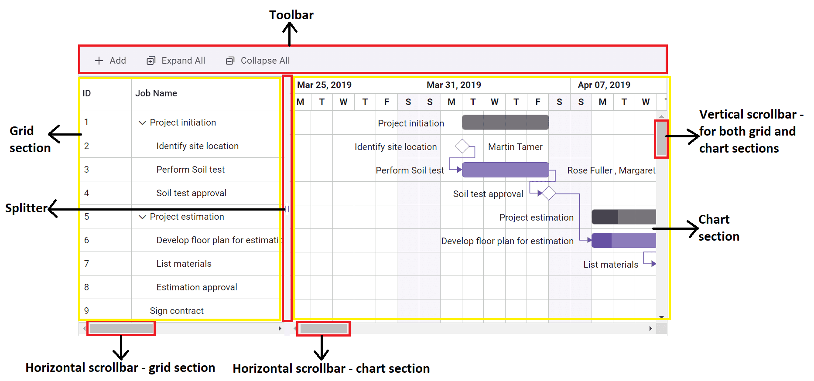

The splitter position can be programmatically controlled using the [splitterSettings](https://ej2.syncfusion.com/angular/documentation/api/gantt/splitterSettings/) property, allowing developers to define the initial layout and user interaction capabilities.

## Grid section

The grid section displays task information in a structured, tabular format optimized for data entry, review, and manipulation. This section inherits many features from the Syncfusion Grid component, providing a familiar and powerful data management interface.

### Key features

* **Tabular presentation**: Task details are presented in a clear, spreadsheet-like format with customizable columns
* **Hierarchical structure**: Parent-child task relationships are visually represented through indentation and expand/collapse icons
* **Expandable/collapsible rows**: Click the expand/collapse icon near parent tasks to show or hide subtasks, controlled by the [collapseAllParentTasks](https://ej2.syncfusion.com/angular/documentation/api/gantt/#collapseallparenttasks) property
* **Column configuration**: Display titles and data for different fields configured through the [columns](https://ej2.syncfusion.com/angular/documentation/api/gantt/#columns) property
* **Inline editing**: Double-click cells to edit task information directly when [editSettings.allowEditing](https://ej2.syncfusion.com/angular/documentation/api/gantt/editSettings/#allowediting) is enabled

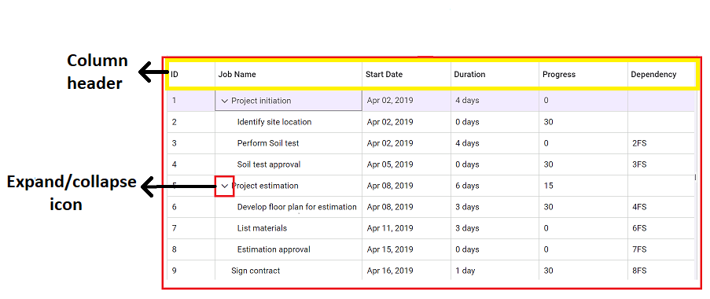

### Grid interactions

The grid supports comprehensive interaction capabilities when corresponding features are enabled:

* **Column sorting**: Click column headers to sort data when [allowSorting](https://ej2.syncfusion.com/angular/documentation/api/gantt/#allowsorting) is true.
* **Column resizing**: Drag column borders to adjust width when [allowResizing](https://ej2.syncfusion.com/angular/documentation/api/gantt/#allowresizing) is enabled.
* **Column reordering**: Drag column headers to change order when [allowReordering](https://ej2.syncfusion.com/angular/documentation/api/gantt/#allowreordering) is configured.
* **Data filtering**: Use column menu filters to display specific tasks when [allowFiltering](https://ej2.syncfusion.com/angular/documentation/api/gantt/#allowfiltering) is enabled.

## Chart section

The chart section provides a visual timeline representation of project tasks, their relationships, and scheduling over time. This section renders the graphical elements that make Gantt charts particularly effective for project visualization and management.

### Timeline components

The chart section consists of several key visual elements:

* **Timeline header**: Configurable time scale showing dates, controlled by [timelineSettings](https://ej2.syncfusion.com/angular/documentation/api/gantt/timelineSettings/)
* **Taskbars**: Visual representations of tasks showing duration, progress, and scheduling status
* **Dependency connectors**: Lines connecting related tasks to show project flow and dependencies
* **Milestones**: Diamond-shaped markers for zero-duration tasks representing key project events
* **Grid lines**: Horizontal and vertical reference lines controlled by [gridLines](https://ej2.syncfusion.com/angular/documentation/api/gantt/#gridlines)

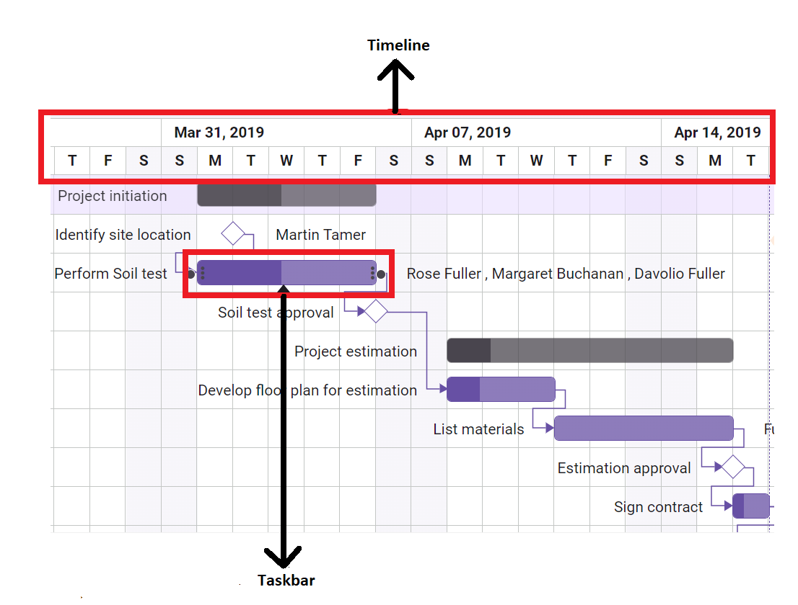

### Chart interactions

The chart section supports various interaction methods:

* **Timeline zoom**: Adjust timeline granularity using zoom controls or mouse wheel when enabled
* **Scroll navigation**: Pan horizontally and vertically through the timeline using scrollbars or mouse drag
* **Task selection**: Click taskbars to select tasks when [allowSelection](https://ej2.syncfusion.com/angular/documentation/api/gantt/#allowselection) is enabled
* **Taskbar manipulation**: Drag and resize taskbars when [allowTaskbarDragAndDrop](https://ej2.syncfusion.com/angular/documentation/api/gantt/#allowtaskbardraganddrop) is configured

## Interactive taskbar elements

Taskbars serve as the primary visual and interactive elements within the chart section, providing multiple interaction points for direct task manipulation.

### Taskbar grippers

Taskbars include interactive grippers that enable precise task adjustments:

* **Start date gripper**: Left edge of taskbar for adjusting task start date
* **End date gripper**: Right edge of taskbar for modifying task end date and duration
* **Progress gripper**: Internal indicator showing completion percentage, draggable when progress editing is enabled

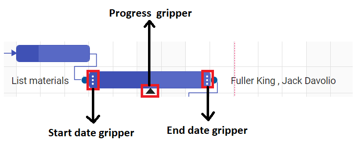

### Taskbar manipulation

Direct taskbar interactions provide intuitive project management capabilities:

* **Drag to reschedule**: Move entire taskbars horizontally to change start and end dates simultaneously
* **Resize for duration**: Extend or shorten taskbars by dragging grippers to adjust task duration
* **Progress updates**: Drag the progress gripper to visually update task completion percentage
* **Validation**: All interactions respect project constraints and validation rules defined in [editSettings](https://ej2.syncfusion.com/angular/documentation/api/gantt/editSettings/)

## Task dependency management

Dependencies define critical relationships between tasks and control project scheduling logic. The Gantt component provides visual tools for creating, managing, and understanding these relationships.

### Dependency creation

Interactive dependency creation is supported through connector points:

* **Connection points**: Small circular handles on taskbar edges for establishing dependencies
* **Visual feedback**: Drag from one connector point to another to create dependency relationships
* **Automatic validation**: System validates dependency logic to prevent circular references

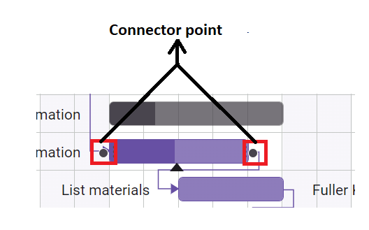

### Dependency types

The component supports all standard project management dependency types:

* **Finish-to-Start (FS)**: Successor task starts when predecessor finishes (most common relationship)
* **Start-to-Start (SS)**: Both tasks start simultaneously or successor starts when predecessor starts
* **Finish-to-Finish (FF)**: Both tasks finish simultaneously or successor finishes when predecessor finishes
* **Start-to-Finish (SF)**: Successor finishes when predecessor starts (least common relationship)

### Dependency configuration

Dependencies can be configured through the [taskFields.dependency](https://ej2.syncfusion.com/angular/documentation/api/gantt/taskFields/#dependency) mapping and managed through the editing interface.

## Specialized taskbar types

### Milestone tasks

Milestones represent significant project events or deliverables with unique visual and behavioral characteristics:

* **Zero duration**: Tasks with no duration or identical start and end dates
* **Diamond shape**: Distinctive visual representation different from standard taskbars
* **Key deliverables**: Mark important project checkpoints, phase completions, or external deadlines

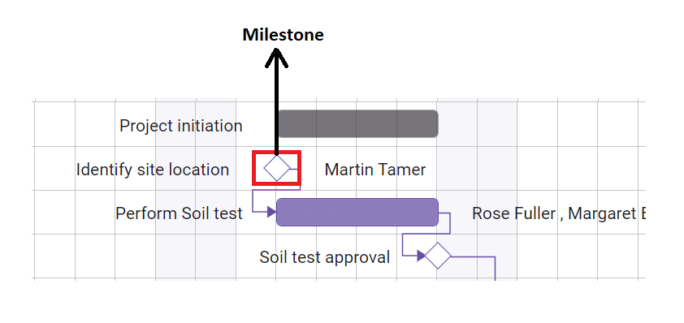

Milestones are automatically identified when task duration equals zero or can be explicitly configured through data properties.

> For more information, refer to [Unscheduled Tasks](https://ej2.syncfusion.com/angular/documentation/gantt/task-scheduling#unscheduled-tasks)

### Manual taskbars

Manual tasks provide flexibility for custom scheduling scenarios that require override of automatic scheduling logic:

* **Manual scheduling mode**: Controlled by [taskMode](https://ej2.syncfusion.com/angular/documentation/api/gantt/#taskmode) property set to 'Manual'
* **Custom date control**: Project managers can set specific dates regardless of dependency constraints
* **Override automation**: Useful for fixed-date deliverables, external dependencies, or regulatory requirements
* **Visual distinction**: Different styling to indicate manual vs. automatic scheduling mode

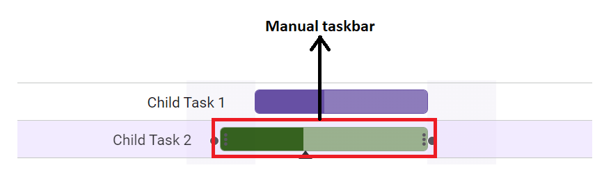

> For more information, refer to [Manual Tasks](https://ej2.syncfusion.com/angular/documentation/gantt/task-scheduling#manually-scheduled-tasks)

## Project tracking elements

### Baseline tracking

Baselines provide essential project performance monitoring through visual comparison capabilities:

* **Planned vs. actual**: Visual overlay comparing planned schedule against actual progress
* **Variance analysis**: Identify schedule deviations, delays, and acceleration opportunities
* **Performance metrics**: Track project execution effectiveness against initial plans
* **Configuration**: Enabled through [renderBaseline](https://ej2.syncfusion.com/angular/documentation/api/gantt/#renderbaseline) property

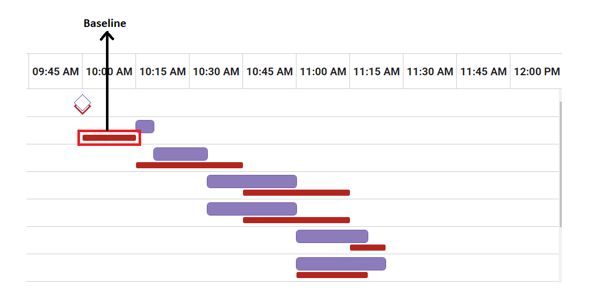

Baseline data is configured through task field mappings and provides historical reference points for project analysis.

### Critical path analysis

Critical path functionality identifies tasks that directly impact overall project completion:

* **Critical task identification**: Tasks that cannot be delayed without affecting project end date
* **Schedule optimization**: Focus management attention on schedule-critical activities
* **Risk management**: Prioritize resources and attention on path-critical tasks
* **Dynamic calculation**: Automatically recalculates as project conditions change

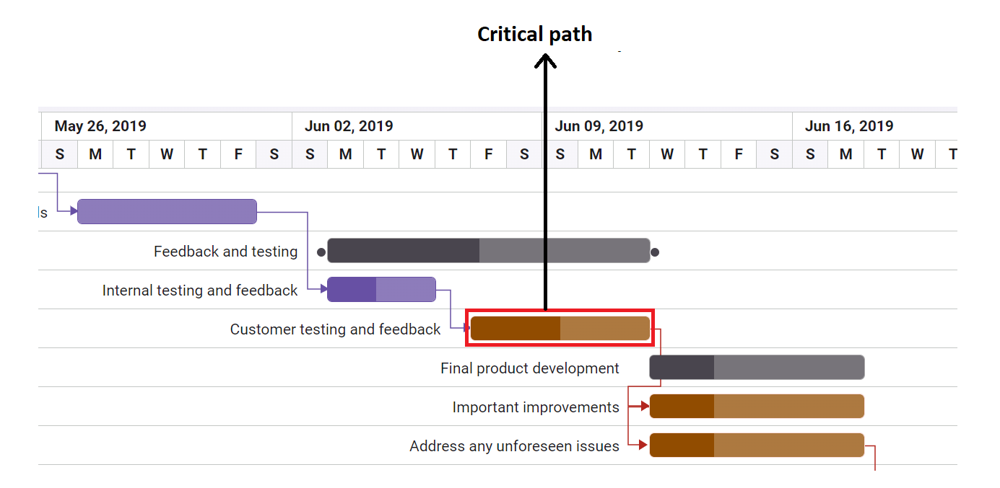

Critical path analysis requires the [enableCriticalPath](https://ej2.syncfusion.com/angular/documentation/api/gantt/#enablecriticalpath) property to be enabled and the CriticalPath module to be injected.

## Additional visual elements

### Task indicators

Task indicators provide contextual information and status markers for individual tasks:

* **Event markers**: Icons and labels showing important dates or events specific to tasks
* **Custom symbols**: Configurable icons for different indicator types or categories
* **Task-specific**: Associated with individual tasks rather than project-wide events
* **Positioning**: Appear at specific dates within the task timeline

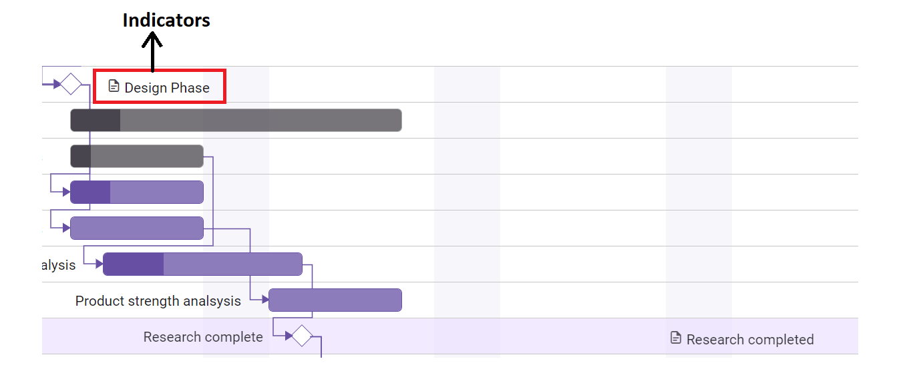

Indicators are configured through the task data structure and can display custom icons, tooltips, and styling.

### Event markers

Event markers highlight significant dates that affect the entire project timeline:

* **Project-wide events**: Company holidays, external deadlines, or regulatory milestones
* **Timeline overlay**: Vertical lines spanning the entire chart height for maximum visibility
* **Custom styling**: Configurable appearance, colors, and labeling through [eventMarkers](https://ej2.syncfusion.com/angular/documentation/api/gantt/#eventmarkers)
* **Interactive tooltips**: Additional information available on hover or click

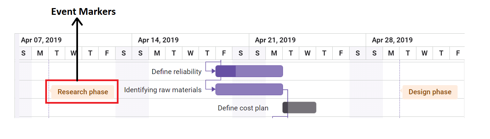

Event markers are particularly useful for displaying holidays, company events, or external dependencies that affect project scheduling.

## Data management features

### Row drag and drop

The row drag and drop feature enables intuitive task hierarchy management through direct manipulation:

* **Hierarchy restructuring**: Change parent-child relationships by dropping tasks on new parents
* **Task reordering**: Adjust task sequence within the same hierarchical level
* **Visual feedback**: Clear drag indicators and drop zones during operation
* **Validation**: Automatic validation prevents invalid hierarchy structures

Row drag and drop behavior is controlled through several properties:

* **Enable feature**: Set [allowRowDragAndDrop](https://ej2.syncfusion.com/angular/documentation/api/gantt/#allowrowdraganddrop) to true
* **Module injection**: Requires RowDD service to be injected
* **Event handling**: Provides events for drag start, dragging, and drop operations

```typescript
// Configure row drag and drop
<ejs-gantt 
    [allowRowDragAndDrop]="true"
    (rowDragStart)="onRowDragStart($event)"
    (rowDrop)="onRowDrop($event)">
</ejs-gantt>
```

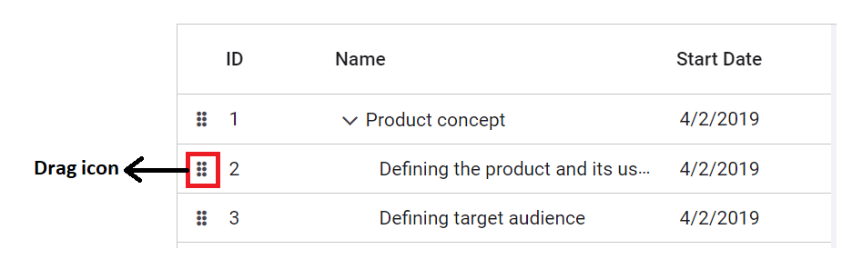

## Task editing interface

The task editing dialog provides comprehensive task management through a well-organized, multi-tabbed interface:

* **Modal interface**: Focused editing environment that prevents accidental data loss
* **Tabbed organization**: Logical grouping of related task properties for efficient navigation
* **Data validation**: Built-in validation for dates, dependencies, resources, and business rules
* **Responsive design**: Adapts to different screen sizes while maintaining functionality

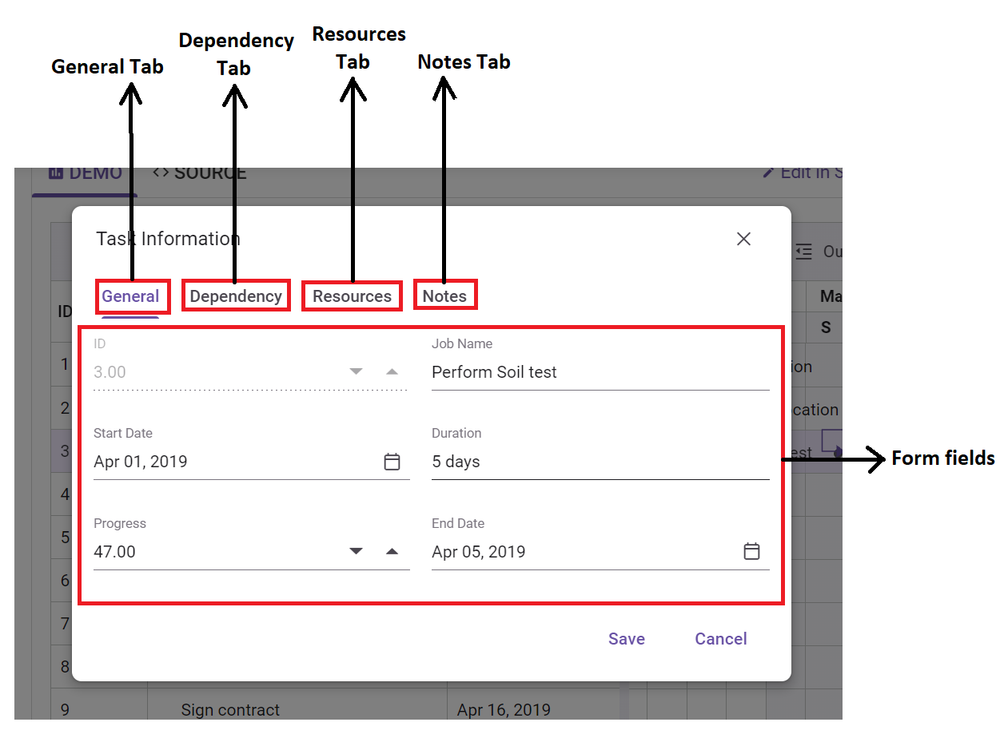

The editing dialog is opened through double-click actions, toolbar buttons, or programmatically through the [openEditDialog](https://ej2.syncfusion.com/angular/documentation/api/gantt/#openeditdialog) method.

### General tab

The General tab contains essential task information fields that define basic task properties:

* **TaskID**: Unique identifier for the task, typically read-only
* **TaskName**: Descriptive name or title of the task
* **Duration**: Time required to complete the task in specified units
* **StartDate**: Planned or actual task start date
* **EndDate**: Planned or actual task completion date
* **Progress**: Current completion percentage (0-100%)
* **Priority**: Task priority level for resource allocation and scheduling

### Dependency tab

The Dependency tab provides comprehensive dependency relationship management:

* **Predecessor management**: Add, edit, or remove tasks that must complete before this task
* **Dependency types**: Select from FS, SS, FF, SF relationship types
* **Lag time**: Configure delays or overlaps between dependent tasks
* **Validation**: Automatic checking for circular dependencies and invalid relationships

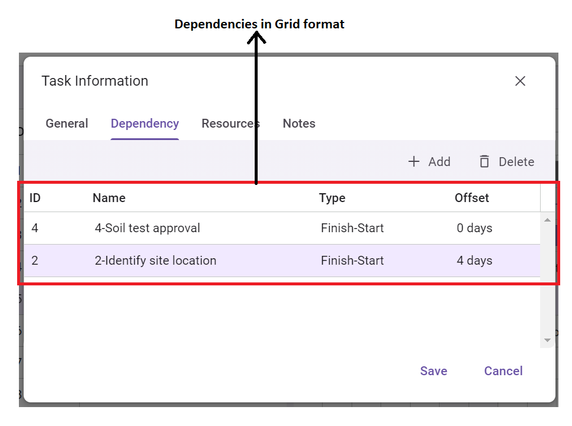

### Resources tab

The Resources tab handles resource allocation and management for individual tasks:

* **Resource assignment**: Select from available project resources for task assignment
* **Allocation details**: Configure work hours, cost rates, and utilization percentages
* **Multiple resources**: Support for assigning multiple resources to a single task
* **Resource conflicts**: Visual indicators for over-allocation or scheduling conflicts

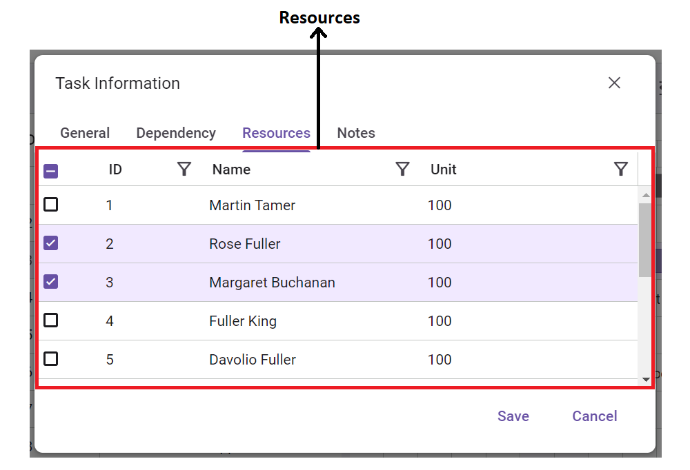

### Notes tab

The Notes tab provides documentation and communication capabilities:

* **Task descriptions**: Detailed task descriptions, instructions, or specifications
* **Rich text support**: Formatted text editing for better readability and organization
* **Communication history**: Track status updates, decisions, and collaboration notes
* **File attachments**: Support for linking relevant documents or files

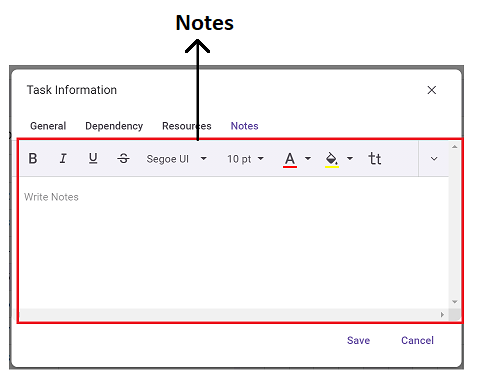

## Accessibility features

The Gantt component incorporates comprehensive accessibility features to ensure usability for all users:

* **Keyboard navigation**: Complete functionality accessible via keyboard shortcuts
* **Screen reader support**: ARIA labels and descriptions for assistive technologies
* **High contrast**: Visual elements maintain visibility in high-contrast modes

## Responsive design

The Gantt interface provides responsive design capabilities for various devices and screen sizes:

### Layout adaptation

* **Flexible splitter**: Grid and chart sections automatically adjust to available screen space
* **Responsive columns**: Column widths adapt to container size while maintaining readability
* **Scrolling behavior**: Optimized scrolling for different input methods and screen sizes
* **Adaptive UI**: Interface elements scale appropriately for touch devices

### Touch support

* **Touch-optimized interactions**: Enlarged touch targets and gesture support for mobile devices
* **Drag operations**: Touch-friendly drag and drop for taskbars and dependencies
* **Zoom gestures**: Pinch-to-zoom support for timeline navigation on touch devices
* **Context menus**: Touch-appropriate context menu activation and display

### Mobile considerations

* **Adaptive layout**: Special layout considerations for narrow screens and mobile viewport
* **Touch editing**: Mobile-optimized editing interfaces and input methods

The responsive design ensures that the Gantt component provides a consistent and usable experience across desktop, tablet, and mobile devices while maintaining full functionality.