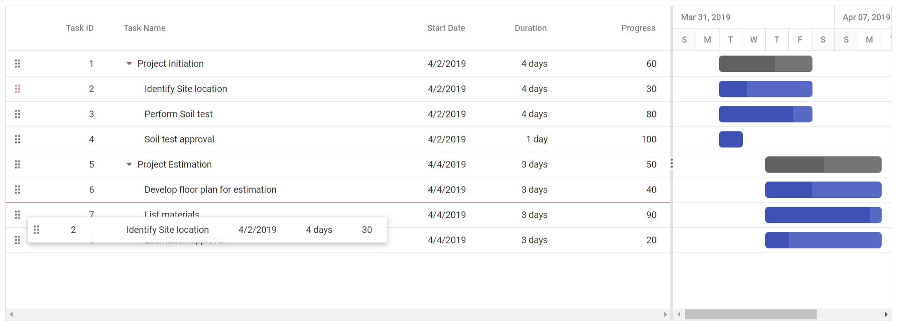

# Row drag and drop in Angular Gantt component

The Syncfusion Angular Gantt chart component provides built-in support for row drag and drop functionality. This feature allows you to easily rearrange rows within the gantt by dragging and dropping them to new positions. Additionally, you can also drag and drop rows to custom components.

To use the row drag and drop feature in Gantt chart component, you need to inject the **RowDDService** in the provider section of the **AppComponent**. The **RowDDService** is responsible for handling the row drag and drop functionality in the Gantt component. Once you have injected the **RowDDService**, you can  use the [allowRowDragAndDrop](https://ej2.syncfusion.com/angular/documentation/api/gantt/#allowrowdraganddrop) property.

## Drag and drop within gantt chart

The drag and drop feature allows you to rearrange rows within the gantt by dragging them using a drag icon. This feature can be enabled by setting the [allowRowDragAndDrop](https://ej2.syncfusion.com/angular/documentation/api/gantt/#allowrowdraganddrop) property to **true**.

Here's an example of how to enable drag and drop within the Gantt chart:









  


## Different drop positions

In a Gantt chart, drag and drop functionality allows to rearrange rows to adjust their position. When dragging and dropping rows in a Gantt chart, you can drop rows into following positions:

1. Above
2. Below
3. Child

**Above**

If the border line appears at the top of the target row, which is **Task ID: 6** while dropping, then the row will be added `above` the target row as sibling.


**Below**

If the border line appears at the bottom of the target row, which is **Task ID: 6** while dropping, then the row will be added `below` the target row as sibling.



**Child**

If the border line appears at both top and bottom of the target row, which is **Task ID: 6** while dropping, then the row will be added as `child` to the target row.


## Drag and drop to custom component 

The Gantt chart provides the feature to drag and drop gantt rows to any custom component. This feature allows you to easily move rows from one component to another without having to manually copy and paste data. To enable row drag and drop, you need to set the [allowRowDragAndDrop](https://ej2.syncfusion.com/angular/documentation/api/gantt/#allowrowdraganddrop) property to **true** and defining the custom component ID in the [targetID](https://ej2.syncfusion.com/angular/documentation/api/treegrid/rowDropSettings/#targetid) property of the [rowDropSettings](https://ej2.syncfusion.com/angular/documentation/api/treegrid/rowDropSettings/) object of treegrid object in gantt instance. The ID provided in `targetID` should correspond to the ID of the target component where the rows are to be dropped.

In the below example, the selected gantt row is dragged and dropped in to the TreeGrid component by using [rowDrop](https://ej2.syncfusion.com/angular/documentation/api/gantt/#rowdrop) event.









  


> * The [rowDrop](https://ej2.syncfusion.com/angular/documentation/api/gantt/#rowdrop) event is fired when a row is dropped onto a custom component, regardless of whether the drop is successful or not. You can use the `args.cancel` property to prevent the default action.

## Drag and drop multiple rows together

Gantt also supports dragging multiple rows at a time and drop them on any other rows. In Gantt, you can enable the multiple row drag and drop by setting the [selectionSettings.type](https://ej2.syncfusion.com/angular/documentation/api/gantt/selectionSettings/#type) property to `Multiple` and you should enable the [allowRowDragAndDrop](https://ej2.syncfusion.com/angular/documentation/api/gantt/#allowrowdraganddrop) property.









  


## Taskbar drag and drop between rows

The taskbar drag and drop feature allows you to rearrange rows within the gantt by dragging the taskbar element. This feature can be enabled by setting the [allowTaskbarDragAndDrop](https://ej2.syncfusion.com/angular/documentation/api/gantt/#allowtaskbardraganddrop) property to **true**.

Here's an example of how to enable taskbar drag and drop within the Gantt:









  


## Drag and drop interactions with server side

In the Gantt chart component, you can perform row drag and drop operations on interaction with the server side. This guide provides step-by-step instructions on how to carry out row drag and drop operations with with server-side integration.

When implementing row drag and drop interactions with server side, it's essential to manage the server-side logic for handling the dragged record and its placement upon dropping. The dragged record details are sent to the server side for processing through the [rowDrop](https://ej2.syncfusion.com/angular/documentation/api/gantt/#rowdrop) event. This involves adding and removing records at the server end based on the dragged record and drop position.

From the arguments of the `rowDrop` event, you can access the following details to handle row drag and drop operations on the server end:

•	Index of the dragged record from `args.fromIndex`
•	Data of the dragged record from `args.data`
•	Drop index from `args.dropIndex`
•	Drop position(**above**, **below**, **child**) from `args.dropPosition`

Using the above details and position, the dragged record can be efficiently removed from its original position and inserted into the new drop position on the server end. This process ensures seamless management of records when using Row Drag and Drop with server-side operations.

```typescript

import { Component, ViewChild } from '@angular/core';
import { GanttComponent, ToolbarItem, EditSettingsModel, } from '@syncfusion/ej2-angular-gantt';
import { DataManager, UrlAdaptor } from '@syncfusion/ej2-data';
import { Ajax } from '@syncfusion/ej2-base';


@Component({
  selector: 'app-root',
  template: `
    <ejs-gantt #gantt [dataSource]='data' [treeColumnIndex]='1' (rowDrop)="rowDrop($event)" 
    [taskFields]="taskSettings" [splitterSettings] = "splitterSettings" [allowRowDragAndDrop]=true [editSettings]="editSettings" [toolbar]="toolbar" height="450">
        <e-columns>
            <e-column field='TaskID' headerText='Task ID' [isPrimaryKey]='true' width='150'></e-column>
            <e-column field='TaskName' headerText='Task Name' width='150'></e-column>
            <e-column field='Duration' headerText='Duration' width='150' textAlign='Right'></e-column>
        </e-columns>
    </ejs-gantt>`
})
export class AppComponent {
  public data?: DataManager;
  public editSettings?: EditSettingsModel;
  public toolbar?: ToolbarItem[];
  @ViewChild('gantt')
  public gantt?: GanttComponent
  public taskSettings?: object;
  public splitterSettings?: object;

  ngOnInit(): void {
    this.data = new DataManager({
      url: '/Home/UrlDatasource',
      adaptor: new UrlAdaptor(),
      offline: true
    });
    this.taskSettings = {
      id: 'TaskID',
      name: 'TaskName',
      startDate: 'StartDate',
      duration: 'Duration',
      child: 'subtasks',
      parentID: 'ParentId',
    };
    this.editSettings = { allowEditing: true, allowAdding: true, allowDeleting: true, };
    this.toolbar = ['Add', 'Edit', 'Delete', 'Update', 'Cancel', 'Search'];
    this.splitterSettings = {
      position: '75%'
    };

  }
  public rowDrop(args: any) {
    var drag_idmapping = (this.gantt as any).currentViewData[args.fromIndex][(this.gantt as any).taskFields.id]
    var drop_idmapping = (this.gantt as any).currentViewData[args.dropIndex][(this.gantt as any).taskFields.id]
    var data = args.data[0];
    var positions = { dragidMapping: drag_idmapping, dropidMapping: drop_idmapping, position: args.dropPosition };
    const ajax = new Ajax({
      url: '/Home/DragandDrop',
      type: 'POST',
      dataType: "json",
      contentType: 'application/json; charset=utf-8',
      data: JSON.stringify({ value: data, pos: positions })
    });
    (this.gantt as any).showSpinner();
    ajax.send();
    ajax.onSuccess = (data: string) => {
      (this.gantt as any).hideSpinner();
    };
  }
}

```

Here's a code snippet demonstrating server-side handling of row drag and drop operations:

```typescript

        public ActionResult UrlDatasource([FromBody] DataManagerRequest dm)
        {
            IEnumerable DataSource = GanttItems.GetSelfData();
            DataOperations operation = new DataOperations();

            if (dm.Sorted != null && dm.Sorted.Count > 0) //Sorting 
            {
                DataSource = operation.PerformSorting(DataSource, dm.Sorted);
            }
            if (dm.Where != null && dm.Where.Count > 0) //Filtering 
            {
                DataSource = operation.PerformFiltering(DataSource, dm.Where, dm.Where[0].Operator);
            }
            int count = DataSource.Cast<GanttItems>().Count();
            if (dm.Take != 0)
            {
                DataSource = operation.PerformTake(DataSource, dm.Take);
            }
             return dm.RequiresCounts ? Ok(new { result = DataSource, count }) : Ok(DataSource);

        }
          
        //Here handle the code of row drag and drop operations
        public bool DragandDrop([FromBody] ICRUDModel value)
        {
            if (value.pos.position == "bottomSegment" || value.pos.position == "topSegment")
            {
                //for bottom and top segment drop position. If the dragged record is the only child for a particular record,
                //we need to set parentItem of dragged record to null and isParent of dragged record's parent to false 
                if (value.value.ParentId != null) // if dragged record has parent
                {
                    var childCount = 0;
                    int parent = (int)value.value.ParentId;
                    childCount += FindChildRecords(parent); // finding the number of child for dragged record's parent
                    if (childCount == 1) // if the dragged record is the only child for a particular record
                    {
                        var i = 0;
                        for (; i < GanttItems.GetSelfData().Count; i++)
                        {
                            if (GanttItems.GetSelfData()[i].TaskID == parent)
                            {
                                //set isParent of dragged record's parent to false 
                                GanttItems.GetSelfData()[i].isParent = false;
                                break;
                            }
                            if (GanttItems.GetSelfData()[i].TaskID == value.value.TaskID)
                            {
                                //set parentItem of dragged record to null
                                GanttItems.GetSelfData()[i].ParentId = null;
                                break;
                            }


                        }
                    }
                }
                GanttItems.GetSelfData().Remove(GanttItems.GetSelfData().Where(ds => ds.TaskID == value.pos.dragidMapping).FirstOrDefault());
                var j = 0;
                for (; j < GanttItems.GetSelfData().Count; j++)
                {
                    if (GanttItems.GetSelfData()[j].TaskID == value.pos.dropidMapping)
                    {
                        //set dragged records parentItem with parentItem of
                        //record in dropindex
                        value.value.ParentId = GanttItems.GetSelfData()[j].ParentId;
                        break;
                    }
                }
                if (value.pos.position == "bottomSegment")
                {
                    this.Insert(value, value.pos.dropidMapping);
                }
                else if (value.pos.position == "topSegment")
                {
                    this.InsertAtTop(value, value.pos.dropidMapping);
                }
            }
            else if (value.pos.position == "middleSegment")
            {
                GanttItems.GetSelfData().Remove(GanttItems.GetSelfData().Where(ds => ds.TaskID == value.pos.dragidMapping).FirstOrDefault());
                value.value.ParentId = value.pos.dropidMapping;
                FindDropdata(value.pos.dropidMapping);
                this.Insert(value, value.pos.dropidMapping);
            }
            return true;
        }

        public ActionResult Insert([FromBody] ICRUDModel value, int rowIndex)
        {
            var i = 0;
            if (value.Action == "insert")
            {
                rowIndex = value.relationalKey;
            }
            Random ran = new Random();
            int a = ran.Next(100, 1000);

            for (; i < GanttItems.GetSelfData().Count; i++)
            {
                if (GanttItems.GetSelfData()[i].TaskID == rowIndex)
                {
                    value.value.ParentId = rowIndex;
                    if (GanttItems.GetSelfData()[i].isParent == false)
                    {
                        GanttItems.GetSelfData()[i].isParent = true;
                    }
                    break;

                }
            }
            i += FindChildRecords(rowIndex);
            GanttItems.GetSelfData().Insert(i, value.value);

            return Json(value.value);
        }

        public void InsertAtTop([FromBody] ICRUDModel value, int rowIndex)
        {
            var i = 0;
            for (; i < GanttItems.GetSelfData().Count; i++)
            {
                if (GanttItems.GetSelfData()[i].TaskID == rowIndex)
                {
                    break;

                }
            }
            i += FindChildRecords(rowIndex);
            GanttItems.GetSelfData().Insert(i - 1, value.value);
        }

        public void FindDropdata(int key)
        {
            var i = 0;
            for (; i < GanttItems.GetSelfData().Count; i++)
            {
                if (GanttItems.GetSelfData()[i].TaskID == key)
                {
                    GanttItems.GetSelfData()[i].isParent = true;
                }
            }
        }

        public int FindChildRecords(int? id)
        {
            var count = 0;
            for (var i = 0; i < GanttItems.GetSelfData().Count; i++)
            {
                if (GanttItems.GetSelfData()[i].ParentId == id)
                {
                    count++;
                    count += FindChildRecords(GanttItems.GetSelfData()[i].TaskID);
                }
            }
            return count;
        }
        public void Remove([FromBody] ICRUDModel value)
        {
            if (value.Key != null)
            {
                // GanttItems value = key;
                GanttItems.GetSelfData().Remove(GanttItems.GetSelfData().Where(ds => ds.TaskID == double.Parse(value.Key.ToString())).FirstOrDefault());
            }

        }

```

> [View the row drag and drop interactions with server side sample on GitHub](https://github.com/SyncfusionExamples/row-drag-and-drop-with-server-side-interaction-in-angular-gantt-chart)

## Drag and drop events

The Gantt component provides a set of events that are triggered during drag and drop operations on gantt rows. These events allow you to customize the drag element, track the progress of the dragging operation, and perform actions when a row is dropped on a target element. The following events are available:

1. [rowDragStartHelper](https://ej2.syncfusion.com/angular/documentation/api/gantt/#rowdragstarthelper): This event is triggered when drag and drop functionality initializes on gantt rows in current view. It allows you to customize drag functionality initialization.

2. [rowDragStart](https://ej2.syncfusion.com/angular/documentation/api/gantt/#rowdragstart): This event is triggered when the dragging of a gantt row starts.

3. [rowDrag](https://ej2.syncfusion.com/angular/documentation/api/gantt/#rowdrag): This event is triggered continuously while the gantt row is being dragged.

4. [rowDrop](https://ej2.syncfusion.com/angular/documentation/api/gantt/#rowdrop): This event is triggered when a drag element is dropped onto a target element.





import { GanttModule } from '@syncfusion/ej2-angular-gantt';
import { RowDDService, EditService, SelectionService } from '@syncfusion/ej2-angular-gantt';
import { Component, ViewEncapsulation, ViewChild } from '@angular/core';
import { GanttData, columnDataType } from './data';
import { GanttComponent } from '@syncfusion/ej2-angular-gantt';
import { RowDragEventArgs } from '@syncfusion/ej2-angular-grids';

@Component({
    imports: [
        GanttModule, 
   ],
providers: [RowDDService, EditService, SelectionService],
standalone: true,
    selector: 'app-root',
    template:
        `<div style="margin-left:180px"><p style="color:red;" id="message">{{ message }}</p></div>
        <ejs-gantt id="gantt" #gantt height="450px" [dataSource]="data" [treeColumnIndex]='1' [splitterSettings]="splitterSettings"
        [allowRowDragAndDrop]='true' (rowDragStartHelper)="rowDragStartHelper($event)" (rowDrop)="rowDrop($event)"  (rowDragStart)="rowDragStart($event)" 
        (rowDrag)="rowDrag($event)"
       [taskFields]="taskSettings">
            <e-columns>
                <e-column field='TaskID' headerText='Task ID' textAlign='Right' [isPrimaryKey]='true' width=90 ></e-column>
                <e-column field='TaskName' headerText='Task Name' textAlign='Left' width=290></e-column>
                <e-column field='StartDate' headerText='Start Date' textAlign='Right' width=120 ></e-column>
                <e-column field='Duration' headerText='Duration' textAlign='Right' width=90 ></e-column>
                <e-column field='Progress' headerText='Progress' textAlign='Right' width=120></e-column>
            </e-columns>
       </ejs-gantt>`,
    encapsulation: ViewEncapsulation.None
})
export class AppComponent {
    public data?: object[];
    @ViewChild('gantt')
    public gantt?: GanttComponent;
    public message?: string;
    public taskSettings?: object;
    public splitterSettings?: object;
    public ngOnInit(): void {
        this.data = GanttData;
        this.taskSettings = {
            id: 'TaskID',
            name: 'TaskName',
            startDate: 'StartDate',
            duration: 'Duration',
            progress: 'Progress',
            child: 'subtasks'
        };
        this.splitterSettings = {
            position: '75%'
        };
    }
    rowDragStartHelper(args: RowDragEventArgs): void {
        this.message = `rowDragStartHelper event triggered`;
        if (((args.data as Object[])[0] as columnDataType).TaskID === 2) {
            args.cancel = true;
        }
    }
    rowDragStart(args: RowDragEventArgs) {
        this.message = `rowDragStart event triggered`;
        if (((args.data as Object[])[0] as columnDataType).TaskID === 2) {
            args.cancel = true;
        }
    }
    rowDrag(args: RowDragEventArgs): void {
        this.message = `rowDrag event triggered`;
    }
    rowDrop(args: RowDragEventArgs): void {
        this.message = `rowDrop event triggered`;
    }    
}







  


## Perform row drag and drop action programmatically

In the Gantt, you can programmatically rearrange rows by using [reorderRows](https://ej2.syncfusion.com/angular/documentation/api/gantt/#reorderrows) method of Gantt chart component. This method takes three arguments:

* **fromIndexes** : Current indexes of the rows to be reordered
* **toIndex** : New index of the row 
* **position** : New position of the row 

In the following example, using `click` event of an external button, row at index 1 is dropped **below** the row at index 2 by using the `reorderRows` method .









  


## Prevent reordering a row 

To prevent the default behavior of rows dropping onto the target, set the `args.cancel` property to `true` in [rowDrop](https://ej2.syncfusion.com/angular/documentation/api/gantt/#rowdrop) event argument.

In the following example, the drop action is cancelled using the `rowDrop` event of the gantt.









  


### Prevent reordering a row as child to another row

To prevent the default behavior of dropping rows as children onto the target, set the `args.cancel` property to `true` in the [rowDrop](https://ej2.syncfusion.com/angular/documentation/api/gantt/#rowdrop) event argument. Additionally, you can change the drop position using the [reorderRows](https://ej2.syncfusion.com/angular/documentation/api/gantt/#reorderrows) method, after cancelling the drop action of row as child to another row.

In the following example, the drop action of the dragged row in **Child** position is prevented, and the row is reordered **above** the target row's position by using the `reorderRows` method.









  


## See also

* [Sorting data in the Syncfusion Gantt Chart](https://ej2.syncfusion.com/angular/documentation/gantt/sorting)
* [Filtering data in the Syncfusion Gantt Chart](https://ej2.syncfusion.com/angular/documentation/gantt/filtering/filtering)