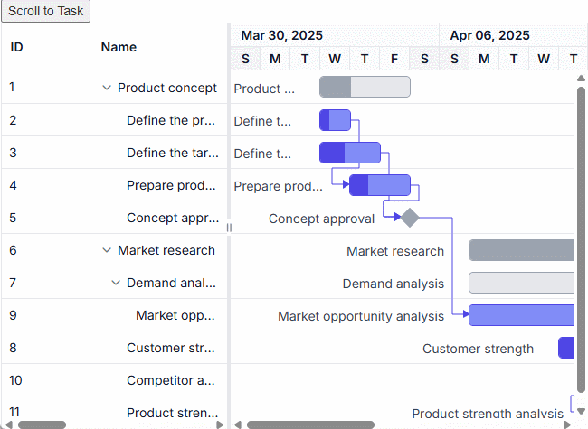
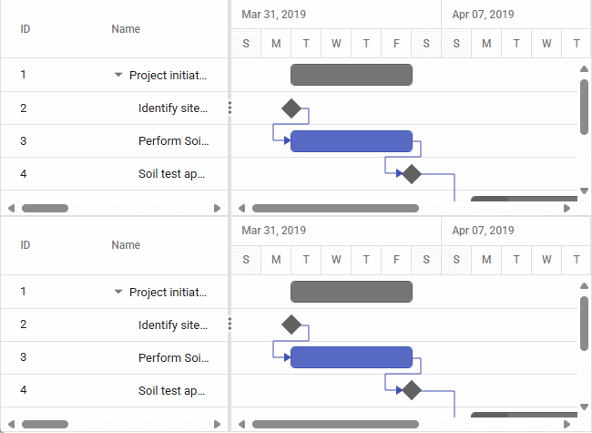

# Scrolling in Angular Gantt component

Scrolling in the Angular Gantt component enables navigation through large project datasets and extended timelines, displaying taskbars, grid rows, and timeline cells within the visible viewport. Configured via the [`height`](https://ej2.syncfusion.com/angular/documentation/api/gantt/#height) and [`width`](https://ej2.syncfusion.com/angular/documentation/api/gantt/#width) properties, scrollbars appear automatically when content exceeds the component’s dimensions, supporting vertical (rows), horizontal (columns), and timeline scrolling. Virtual scrolling optimizes performance for large datasets by rendering only visible content. Scrollbars include ARIA labels for accessibility, ensuring screen reader compatibility, and adapt to responsive designs, though narrow screens may require horizontal scrolling for wide timelines. By default, `height` and `width` are `auto`.

## Configure scrollbar display

Scrollbars appear based on content size:
- Vertical scrollbar: Triggers when task row height exceeds the component’s height.
- Horizontal scrollbar: Triggers when column width exceeds the tree grid pane.
- Timeline scrollbar: Triggers when the timeline exceeds the chart area.

Set fixed dimensions with [`height`](https://ej2.syncfusion.com/angular/documentation/api/gantt/#height) and [`width`](https://ej2.syncfusion.com/angular/documentation/api/gantt/#width) in pixels for precise control.

The following example sets fixed dimensions:













This configuration ensures scrollbars for oversize content.

## Configure responsive scrolling

Set [`height`](https://ej2.syncfusion.com/angular/documentation/api/gantt/#height) and [`width`](https://ej2.syncfusion.com/angular/documentation/api/gantt/#width) to `100%` to make the Gantt component fill its parent container, responding to resize events. The parent container must have an explicit height for percentage-based height to work.

The following example enables responsive scrolling:













This configuration adapts the Gantt to dynamic container sizes.

## Scroll to specific task row

Programmatically scroll the Gantt component to a specific task row using the [`setScrollTop`](https://ej2.syncfusion.com/angular/documentation/api/gantt/#setscrolltop) method, combined with the [`selectRow`](https://ej2.syncfusion.com/angular/documentation/api/gantt/selectionModule/#selectrow) method from the `SelectionModule`. This calculates the scroll position based on the row index and row height, ensuring the taskbar is visible in the viewport.

The following example scrolls to a task row:

```typescript
import { Component, OnInit, ViewChild } from '@angular/core';
import { GanttComponent, GanttModule, SelectionService } from '@syncfusion/ej2-angular-gantt';
import { projectNewData } from './data';

@Component({
    selector: 'app-root',
    template: `
        <div class="control-section">
        <div class="col-lg-3 property-section">
                <div class="property-panel-section">
                    <button ejs-button id="scrollTask" (click)="scrollToTask()">Scroll to Task</button>
                </div>
            </div>
            <div class="col-lg-9 control-section">
                <ejs-gantt #gantt id="ganttContainer" height="475px"
                    [dataSource]="data"
                    [taskFields]="taskSettings"
                    [allowSelection]="true"
                    [labelSettings]="labelSettings"
                    [treeColumnIndex]="1"
                    [splitterSettings]="splitterSettings"
                    [highlightWeekends]="true"
                    [selectionSettings]="selectionSettings">
                </ejs-gantt>
            </div>
        </div>
    `,
    standalone: true,
    imports: [GanttModule],
    providers: [SelectionService]
})
export class AppComponent implements OnInit {
    @ViewChild('gantt') public gantt: GanttComponent;
    public data: object[];
    public taskSettings: object;
    public labelSettings: object;
    public splitterSettings: object;
    public selectionSettings: object;
    public projectStartDate: Date;
    public projectEndDate: Date;

    public ngOnInit(): void {
        this.data = [
            { TaskID: 1, TaskName: "Product concept", StartDate: new Date("04/02/2025"), EndDate: new Date("04/08/2025") },
            { TaskID: 2, TaskName: "Define the product usage", StartDate: new Date("04/02/2025"), EndDate: new Date("04/08/2025"), Duration: 1, Progress: 30, ParentId: 1, BaselineStartDate: new Date("04/02/2025"), BaselineEndDate: new Date("04/02/2025") },
            { TaskID: 3, TaskName: "Define the target audience", StartDate: new Date("04/02/2025"), EndDate: new Date("04/04/2025"), Duration: 2, Progress: 40, ParentId: 1 },
            { TaskID: 4, TaskName: "Prepare product sketch and notes", StartDate: new Date("04/05/2025"), Duration: 2, Progress: 30, ParentId: 1, Predecessor: "2" },
            { TaskID: 5, TaskName: "Concept approval", StartDate: new Date("04/08/2025"), EndDate: new Date("04/08/2025"), Duration: 0, ParentId: 1, Predecessor: "3,4", Indicators: [{ date: new Date("04/07/2025"), name: "Design Phase", tooltip: "Design phase completed", iconClass: "okIcon e-icons" }] },
            { TaskID: 6, TaskName: "Market research", StartDate: new Date("04/09/2025"), EndDate: new Date("04/18/2025"), Progress: 30, BaselineStartDate: new Date("04/09/2025"), BaselineEndDate: new Date("04/09/2025") },
            { TaskID: 7, TaskName: "Demand analysis", Progress: 40, ParentId: 6 },
            { TaskID: 8, TaskName: "Customer strength", StartDate: new Date("04/10/2025"), EndDate: new Date("04/13/2025"), Duration: 4, Progress: 30, ParentId: 6, BaselineStartDate: new Date("04/12/2025"), BaselineEndDate: new Date("04/13/2025") },
            { TaskID: 9, TaskName: "Market opportunity analysis", StartDate: new Date("04/09/2025"), EndDate: new Date("04/12/2025"), Duration: 4, ParentId: 7, Predecessor: "5" },
            { TaskID: 10, TaskName: "Competitor analysis", StartDate: new Date("04/15/2025"), EndDate: new Date("04/18/2025"), Duration: 4, Progress: 30, ParentId: 6, Predecessor: "7,8" },
            { TaskID: 11, TaskName: "Product strength analysis", StartDate: new Date("04/15/2025"), EndDate: new Date("04/18/2025"), Duration: 4, Progress: 40, ParentId: 6, Predecessor: "9" },];
        this.taskSettings = {
            id: 'TaskID',
            name: 'TaskName',
            startDate: 'StartDate',
            endDate: 'EndDate',
            duration: 'Duration',
            progress: 'Progress',
            dependency: 'Predecessor',
            parentID: 'ParentId'
        };
        this.labelSettings = {
            leftLabel: 'TaskName'
        };
        this.splitterSettings = {
            columnIndex: 2
        };
        this.selectionSettings = {
            mode: 'Row',
            type: 'Single',
            enableToggle: false
        };
        this.projectStartDate = new Date('03/27/2019');
        this.projectEndDate = new Date('07/06/2019');
    }

    public scrollToTask(): void {
        const rowIndex: number = 9;
        this.gantt.selectionModule.selectRow(rowIndex);
        const scrollPosition: number = this.gantt.rowHeight * rowIndex;
        this.gantt.setScrollTop(scrollPosition);
    }
}
```


## Synchronize horizontal scroll between Gantt charts

Synchronize horizontal scrolling between two Gantt components by handling the [`actionComplete`](https://ej2.syncfusion.com/angular/documentation/gantt/events#actioncomplete) event with the `HorizontalScroll` action. This captures the scroll position of the first Gantt’s chart area and applies it to the second Gantt using the `scrollLeft` property, ensuring aligned timeline navigation for comparative views. This is useful for displaying related project data side-by-side, such as parallel schedules.

The following example synchronizes horizontal scrolling:

```typescript
import { Component, OnInit, ViewChild } from '@angular/core';
import { GanttComponent, GanttModule } from '@syncfusion/ej2-angular-gantt';

@Component({
    selector: 'app-root',
    template: `
        <div class="control-section" style="height:475px; width:650px;">
            <ejs-gantt #primaryGantt id="primaryGanttContainer" height="50%" width="100%"
                [dataSource]="data"
                [taskFields]="taskSettings"
                [treeColumnIndex]="1"
                [allowSelection]="true"
                dateFormat="MMM dd, y"
                [highlightWeekends]="true"
                (actionComplete)="syncScroll($event)">
            </ejs-gantt>
            <ejs-gantt #secondaryGantt id="secondaryGanttContainer" height="50%" width="100%"
                [dataSource]="data"
                [taskFields]="taskSettings"
                [treeColumnIndex]="1"
                [allowSelection]="true"
                dateFormat="MMM dd, y"
                [highlightWeekends]="true">
            </ejs-gantt>
        </div>
    `,
    standalone: true,
    imports: [GanttModule]
})
export class AppComponent implements OnInit {
    @ViewChild('primaryGantt ') public primaryGantt: GanttComponent;
    @ViewChild('secondaryGantt ') public secondaryGantt: GanttComponent;
    public data: object[];
    public taskSettings: object;

    public ngOnInit(): void {
        this.data = [
            {
                TaskID: 1,
                TaskName: 'Project initiation',
                StartDate: new Date('04/02/2019'),
                EndDate: new Date('04/21/2019'),
                subtasks: [
                    {
                        TaskID: 2, TaskName: 'Identify site location', StartDate: new Date('04/02/2019'), Duration: 0,
                        Progress: 30, resources: [1], info: 'Measure the total property area alloted for construction'
                    },
                    {
                        TaskID: 3, TaskName: 'Perform Soil test', StartDate: new Date('04/02/2019'), Duration: 4, Predecessor: '2',
                        resources: [2, 3, 5], info: 'Obtain an engineered soil test of lot where construction is planned.' +
                            'From an engineer or company specializing in soil testing'
                    },
                    { TaskID: 4, TaskName: 'Soil test approval', StartDate: new Date('04/02/2019'), Duration: 0, Predecessor: '3', Progress: 30 },
                ]
            },
            {
                TaskID: 5,
                TaskName: 'Project estimation',
                StartDate: new Date('04/02/2019'),
                EndDate: new Date('04/21/2019'),
                subtasks: [
                    {
                        TaskID: 6, TaskName: 'Develop floor plan for estimation', StartDate: new Date('04/04/2019'),
                        Duration: 3, Predecessor: '4', Progress: 30, resources: 4,
                        info: 'Develop floor plans and obtain a materials list for estimations'
                    },
                    {
                        TaskID: 7, TaskName: 'List materials', StartDate: new Date('04/04/2019'),
                        Duration: 3, Predecessor: '6', resources: [4, 8], info: ''
                    },
                    {
                        TaskID: 8, TaskName: 'Estimation approval', StartDate: new Date('04/04/2019'),
                        Duration: 0, Predecessor: '7', resources: [12, 5], info: ''
                    }
                ]
            }];
        this.taskSettings = {
            id: 'TaskID',
            name: 'TaskName',
            startDate: 'StartDate',
            endDate: 'EndDate',
            duration: 'Duration',
            progress: 'Progress',
            dependency: 'Predecessor',
            child: 'subtasks',
        };
    }

    public syncScroll(args: any): void {
        if (args.action === 'HorizontalScroll') {
            const chartElement = this.secondaryGantt.element.querySelector('.e-chart-root-container > div');
            if (chartElement) {
                chartElement.scrollLeft = args.scrollLeft;
            }
        }
    }
}
```



## See also
- [How to enable virtual scrolling?](https://ej2.syncfusion.com/angular/documentation/gantt/virtual-scroll)
- [How to configure taskbars?](https://ej2.syncfusion.com/angular/documentation/gantt/taskbar)
- [How to manage large datasets?](https://ej2.syncfusion.com/angular/documentation/gantt/data-binding)