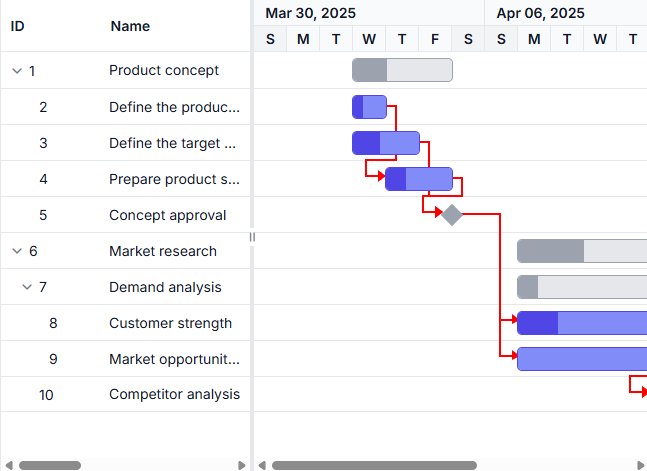

# Task Dependency in Angular Gantt Chart Component

Task dependency in the Angular Gantt Chart component establishes relationships between tasks, affecting scheduling where changes to predecessors impact successors. Dependencies are categorized into four types—Start to Start (SS), Start to Finish (SF), Finish to Start (FS), and Finish to Finish (FF)—mapped via the [taskFields.dependency](https://ej2.syncfusion.com/angular/documentation/api/gantt/taskFields#dependency) property in the data source. Parent dependencies are enabled by default with [allowParentDependency](https://ej2.syncfusion.com/angular/documentation/api/gantt#allowparentdependency) set to **true**, allowing relationships between parent-parent, child-child, parent-child, and child-parent tasks. Offsets support day, hour, or minute units for precise timing, and validation modes handle conflicts during editing via the [actionBegin](https://ej2.syncfusion.com/angular/documentation/api/gantt#actionbegin) event. Connector lines are customized using [connectorLineWidth](https://ej2.syncfusion.com/angular/documentation/api/gantt#connectorlinewidth) and [connectorLineBackground](https://ej2.syncfusion.com/angular/documentation/api/gantt#connectorlinebackground), with the `queryTaskbarInfo` event enabling dynamic styling. Public methods like [addPredecessor](https://ej2.syncfusion.com/angular/documentation/api/gantt#addpredecessor) and [removePredecessor](https://ej2.syncfusion.com/angular/documentation/api/gantt#removepredecessor) allow programmatic management, ensuring accurate visualization with ARIA labels for accessibility and responsive scaling for mobile views.

## Configure task dependencies

Task dependencies are defined in the data source as string values (e.g., '2FS+3d' for Finish to Start with 3-day offset) and mapped using [taskFields.dependency](https://ej2.syncfusion.com/angular/documentation/api/gantt/taskFields#dependency). Parent dependencies can be enabled by [allowParentDependency](https://ej2.syncfusion.com/angular/documentation/api/gantt#allowparentdependency) property. By default, the `allowParentDependency` property will be **true**.

Multiple predecessor relationships can be defined in a single task by assigning a comma-separated string to the `Predecessor` field, such as `'2FS,3FS'`. This configuration allows the Gantt chart to interpret and render multiple dependencies during the initial data load.

```ts
{ TaskID: 4, TaskName: 'Soil test approval', StartDate: new Date('04/02/2024'), Duration: 0, Predecessor: '3FS,2FS', Progress: 30 }
```

The following example establishes dependencies:













This code renders connector lines for dependencies like '2FS', updating taskbars on changes.

## Understand task relationship types

Task relationships are categorized into four types based on start and finish dates:
- Start to Start (SS): Successor starts with predecessor.

    

- Start to Finish (SF): Successor finishes when predecessor starts.

    

- Finish to Start (FS): Successor starts after predecessor finishes (default).

    

- Finish to Finish (FF): Successor finishes with predecessor.

    

Specify types in the data source (e.g., '2SS+1h') for hour-based offsets.

## Configure predecessor offsets with duration units

Predecessor offsets support day, hour, or minute units (e.g., '2FS+3h'), allowing precise delays or leads between tasks.

The following example uses duration units:













This code sets offsets like '2FS+3h', adjusting taskbars accordingly.

## Predecessor offset synchronization on initial load

The [autoUpdatePredecessorOffset](https://ej2.syncfusion.com/angular/documentation/api/gantt/index-default#autoupdatepredecessoroffset) property specifies whether the Gantt Chart automatically adjusts and synchronizes the predecessor offset values (e.g., "+2", "-1d") in the predecessor column display and the underlying data during initial data load/binding, so they match the actually rendered taskbar positions and dependency lines.

- When **enabled**: During the initial data binding/load, the Gantt recalculates the offset portions of predecessor strings based on the final rendered dates after applying calendar rules, weekends, holidays, and working times. The predecessor column in the grid and the corresponding data field values are updated to reflect these accurate offsets - preventing visual or data mismatch between what is displayed and what was actually used for rendering dependency lines - without affecting task dates, durations, or triggering any scheduling/validation logic.

- When **disabled**: The predecessor column displays exactly the offset values provided in the original data source, even if they no longer match the rendered dependency lines due to calendar adjustments. This can result in visual inconsistencies where the grid shows one offset (e.g., "5FS+0") while the drawn arrow connects tasks with a different effective offset (e.g., equivalent to +2 due to non-working days). No automatic correction occurs during load.













## Disable automatic dependency offset updates

Automatic offset updates during taskbar editing are disabled with [updateOffsetOnTaskbarEdit](https://ej2.syncfusion.com/angular/documentation/api/gantt#updateoffsetontaskbaredit) set to `false`, allowing manual updates via the dependency tab or predecessor column.

The following example disables automatic updates:













This code preserves offsets during edits, requiring manual adjustments.

## Handle dependency validation modes

Dependency validation during editing uses the [actionBegin](https://ej2.syncfusion.com/angular/documentation/api/gantt#actionbegin) event with `requestType: 'validateLinkedTask'`. The `validateMode` argument defines modes:
- `respectLink`: Prioritizes links, reverting invalid edits.
- `removeLink`: Prioritizes editing, removing conflicting links.
- `preserveLinkWithEditing`: Updates offsets to maintain links (default).

The following example enables `respectLink` mode:













This code reverts edits violating links, ensuring dependency integrity.

## Use validation dialog

When all validation modes are disabled in [actionBegin](https://ej2.syncfusion.com/angular/documentation/api/gantt#actionbegin), a dialog prompts users to choose modes like canceling edits or removing links, based on the successor's start date relative to the predecessor.

The following example enables the validation dialog:













This code displays options like "Remove the link and move the task" for conflicts.

## Show or hide dependency lines dynamically

Dependency lines are hidden or shown by toggling `visibility: hidden` on `.e-gantt-dependency-view-container`, allowing dynamic control for focused views.

The following example toggles dependency lines:













This code hides lines on button click, with ARIA updates for accessibility.

## Managing predecessor dependencies

You can manage task dependencies by adding, updating, or removing predecessor links. These methods control task order and execution:

- [addPredecessor](https://ej2.syncfusion.com/angular/documentation/api/gantt/index-default#addpredecessor): Adds a predecessor to a task to define its dependency.
- [removePredecessor](https://ej2.syncfusion.com/angular/documentation/api/gantt/index-default#removepredecessor): Removes an existing dependency from the task.
- [updatePredecessor](https://ej2.syncfusion.com/angular/documentation/api/gantt/index-default#updatepredecessor): Updates the dependency details using the task's ID.













## Customize connector lines

Connector lines are styled globally with [connectorLineWidth](https://ej2.syncfusion.com/angular/documentation/api/gantt#connectorlinewidth) and [connectorLineBackground](https://ej2.syncfusion.com/angular/documentation/api/gantt#connectorlinebackground).

The following example sets the connector line background color as red:

```typescript
import { Component } from '@angular/core';
import { GanttModule } from '@syncfusion/ej2-angular-gantt';

@Component({
    imports: [GanttModule],
    standalone: true,
    selector: 'app-root',
    template: `
        <ejs-gantt height="430px" [dataSource]="taskData" [taskFields]="taskSettings" [projectStartDate]="projectStartDate"  [projectEndDate]="projectEndDate" [connectorLineWidth]="2" [connectorLineBackground]="'red'">
        </ejs-gantt>`
})

export class AppComponent {
    public taskData: object[] = [
        { TaskID: 1, TaskName: "Product concept", StartDate: new Date("04/02/2025"), EndDate: new Date("04/08/2025") },
        { TaskID: 2, TaskName: "Define the product usage", StartDate: new Date("04/02/2025"), EndDate: new Date("04/08/2025"), Duration: 1, Progress: 30, ParentId: 1 },
        { TaskID: 3, TaskName: "Define the target audience", StartDate: new Date("04/02/2025"), EndDate: new Date("04/04/2025"), Duration: 2, Progress: 40, ParentId: 1 },
        { TaskID: 4, TaskName: "Prepare product sketch and notes", StartDate: new Date("04/05/2025"), Duration: 2, Progress: 30, ParentId: 1, Predecessor: "2" },
        { TaskID: 5, TaskName: "Concept approval", StartDate: new Date("04/08/2025"), EndDate: new Date("04/08/2025"), Duration: 0, ParentId: 1, Predecessor: "3,4" },
        { TaskID: 6, TaskName: "Market research", StartDate: new Date("04/09/2025"), EndDate: new Date("04/18/2025"), Progress: 30 },
        { TaskID: 7, TaskName: "Demand analysis", Progress: 40, ParentId: 6 },
        { TaskID: 8, TaskName: "Customer strength", StartDate: new Date("04/09/2025"), EndDate: new Date("04/12/2025"), Duration: 4, Progress: 30, ParentId: 7, Predecessor: "5"},
        { TaskID: 9, TaskName: "Market opportunity analysis", StartDate: new Date("04/09/2025"), EndDate: new Date("04/12/2025"), Duration: 4, ParentId: 7, Predecessor: "5" },
        { TaskID: 10, TaskName: "Competitor analysis", StartDate: new Date("04/15/2025"), EndDate: new Date("04/18/2025"), Duration: 4, Progress: 30, ParentId: 6, Predecessor: "7,8" },
    ];
    public taskSettings: object = {
        id: 'TaskID',
        name: 'TaskName',
        startDate: 'StartDate',
        duration: 'Duration',
        progress: 'Progress',
        dependency: 'Predecessor',
        parentID: 'ParentId'
    };

}
```



## Disable predecessor validation

By default, Gantt task dates are validated based on predecessor values. To disable this validation, set the `enablePredecessorValidation` property to **false**.











## Limitation

> When virtualization is enabled, dependency lines are shown only for tasks currently visible in the viewport. If two tasks are connected by a line, the line will appear only if at least one of the tasks is visible. If both tasks are expanded and the line spans across pages, it will still be displayed as long as one task is in view.

## See also
- [How to configure task constraints?](https://ej2.syncfusion.com/angular/documentation/gantt/task-constraints)
- [How to customize taskbars?](https://ej2.syncfusion.com/angular/documentation/gantt/taskbar)
- [How to enable critical path?](https://ej2.syncfusion.com/angular/documentation/gantt/critical-path)