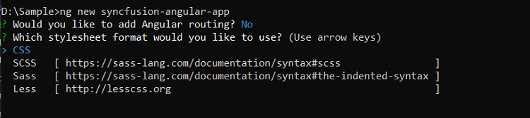
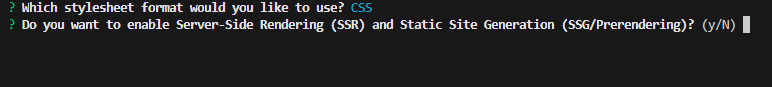
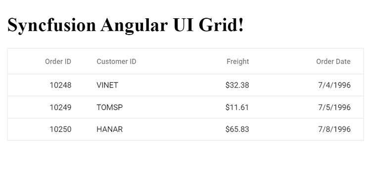

# Getting Started with Angular Standalone Component

Standalone components in Angular provide a streamlined approach to building applications without relying heavily on NgModules. This simplifies the development process while maintaining compatibility with existing module-based architectures. You can gradually adopt standalone components in legacy projects without introducing breaking changes.

## Create a New Application

Ensure that the latest Angular CLI is installed, then create Angular project by executing the below command:

```bash
ng new syncfusion-angular-app
```

This command initiates the project setup and prompts you to select your preferred configuration options, such as stylesheet format.



The default setup creates a CSS-based application. To specify SCSS as your styling format, use:

```bash
ng new syncfusion-angular-app --style=scss
```



Angular enhances developer productivity with server-side rendering (SSR) and static-site generation (SSG or prerendering) options in the `ng new` command. Enable SSR by running:

```bash
ng new syncfusion-angular-app --ssr
```

Once the setup is complete, navigate into your project directory:

```bash
cd syncfusion-angular-app
```

## Installing Syncfusion<sup style="font-size:70%">&reg;</sup> Angular Packages

Syncfusion<sup style="font-size:70%">&reg;</sup>'s Angular packages are available under the `@syncfusion` scope on npm. Obtain these packages by visiting [npm](https://www.npmjs.com/search?q=%40syncfusion%2Fej2-angular-).

To add the latest Syncfusion<sup style="font-size:70%">&reg;</sup> Angular packages, which are Ivy-compatible and support Angular 12 and above, execute:

```bash
ng add @syncfusion/ej2-angular-grids@latest
```

This command performs the following configurations in your Angular application:

- Adds the `@syncfusion/ej2-angular-grids` package and its peer dependencies to `package.json`.
- Imports `GridModule` into your application's default standalone component `app.component.ts`.
- Registers Syncfusion<sup style="font-size:70%">&reg;</sup>'s default material theme in `angular.json`.

These steps simplify adding Syncfusion<sup style="font-size:70%">&reg;</sup>'s Angular Grid module to your project for immediate use.

## Adding Syncfusion<sup style="font-size:70%">&reg;</sup> Angular Components

To incorporate Syncfusion<sup style="font-size:70%">&reg;</sup> Angular components, define them in your template and configure their properties in the component class.

In `src/app/app.component.ts`, you can utilize column directives with `<ejs-grid>` selector and define `<e-column>` elements inside `<ejs-grid>`. Each `e-column` specifies attributes like field name, header text, and data type for the Grid columns.

```typescript
import { Component } from '@angular/core';
import { GridModule, PagerModule } from '@syncfusion/ej2-angular-grids';

@Component({
  selector: 'app-root',
  imports: [GridModule, PagerModule],
  template: `
  <h1>
    Syncfusion Angular UI Grid!
  </h1>

  <ejs-grid [dataSource]='data'>
    <e-columns>
      <e-column field='OrderID' headerText='Order ID' textAlign='Right' width=90></e-column>
      <e-column field='CustomerID' headerText='Customer ID' width=120></e-column>
      <e-column field='Freight' headerText='Freight' textAlign='Right' format='C2' width=90></e-column>
      <e-column field='OrderDate' headerText='Order Date' textAlign='Right' format='yMd' width=120></e-column>
    </e-columns>
  </ejs-grid>
 `
  styleUrl: './app.component.css'
 })
export class AppComponent {
  public data: Object[] = [
    {
      OrderID: 10248, CustomerID: 'VINET', EmployeeID: 5, OrderDate: new Date(8364186e5),
      ShipName: 'Vins et alcools Chevalier', ShipCity: 'Reims', ShipAddress: '59 rue de l Abbaye',
      ShipRegion: 'CJ', ShipPostalCode: '51100', ShipCountry: 'France', Freight: 32.38, Verified: !0
    },
    {
      OrderID: 10249, CustomerID: 'TOMSP', EmployeeID: 6, OrderDate: new Date(836505e6),
      ShipName: 'Toms Spezialitäten', ShipCity: 'Münster', ShipAddress: 'Luisenstr. 48',
      ShipRegion: 'CJ', ShipPostalCode: '44087', ShipCountry: 'Germany', Freight: 11.61, Verified: !1
    },
    {
      OrderID: 10250, CustomerID: 'HANAR', EmployeeID: 4, OrderDate: new Date(8367642e5),
      ShipName: 'Hanari Carnes', ShipCity: 'Rio de Janeiro', ShipAddress: 'Rua do Paço, 67',
      ShipRegion: 'RJ', ShipPostalCode: '05454-876', ShipCountry: 'Brazil', Freight: 65.83, Verified: !0
    }
  ];
}
```
This configuration adds a data grid to your application, complete with specified columns and sample data.

## Adding CSS References

The following CSS styles are available in the `../node_modules/@syncfusion` folder. Reference them in `src/styles.css` as follows:

```css
@import '../node_modules/@syncfusion/ej2-base/styles/material.css';  
@import '../node_modules/@syncfusion/ej2-buttons/styles/material.css';  
@import '../node_modules/@syncfusion/ej2-calendars/styles/material.css';  
@import '../node_modules/@syncfusion/ej2-dropdowns/styles/material.css';  
@import '../node_modules/@syncfusion/ej2-inputs/styles/material.css';  
@import '../node_modules/@syncfusion/ej2-navigations/styles/material.css';
@import '../node_modules/@syncfusion/ej2-popups/styles/material.css';
@import '../node_modules/@syncfusion/ej2-splitbuttons/styles/material.css';
@import '../node_modules/@syncfusion/ej2-notifications/styles/material.css';
@import '../node_modules/@syncfusion/ej2-angular-grids/styles/material.css';
```

## Run the Application

Execute the `ng serve` command in your terminal to launch the application. Once the server starts, open your browser to interact with the application.



>Note: If a license banner appears when running your application, you need to acquire and register a license key to use Syncfusion<sup style="font-size:70%">&reg;</sup> components. Visit our [Licensing Overview](../licensing/overview) page for detailed instructions on obtaining and registering your license key.