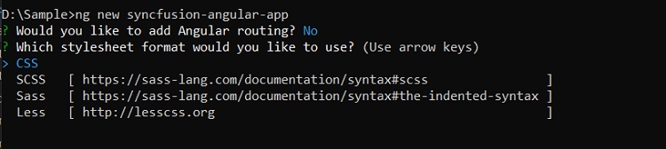
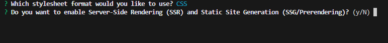
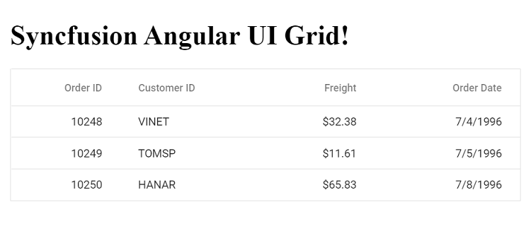

# Getting Started with Angular Standalone Components

Standalone components are a modern approach in Angular that allow you to build applications without extensive NgModule configurations. They enable direct component imports, simplify dependency management, and provide easier integration of libraries like Syncfusion<sup style="font-size:70%">&reg;</sup> components into your Angular applications.

This guide demonstrates how to create an Angular application using standalone components and integrate Syncfusion<sup style="font-size:70%">&reg;</sup> UI components.

## Prerequisites

- Ensure you have Node.js (LTS recommended) and npm installed on your system.
- Requires Angular 12+ for standalone components; Angular 14+ is recommended.
- Verify that your environment meets the system requirements for Syncfusion<sup style="font-size:70%">&reg;</sup> Angular components.

## Create a New Application

Ensure you have the Angular CLI installed. Create a new Angular project by executing the following command:

```bash
ng new syncfusion-angular-app
```

During the setup process, the CLI will prompt you to select configuration options. Accept the defaults (routing can be Yes or No based on your needs), or press Enter to proceed:



### Optional Configuration Variations

You can customize your project setup with the following options:

**SCSS stylesheet:**

By default, the command creates a CSS-based application. To use SCSS instead, specify the style option:

```bash
ng new syncfusion-angular-app --style=scss
```

**Server-side rendering (SSR):**

Angular offers server-side rendering (SSR) and static-site generation (SSG) capabilities to enhance performance and SEO. Enable these features during project creation:



For SSR support, use:

```bash
ng new syncfusion-angular-app --ssr
```

After setup completes, navigate to your project directory:

```bash
cd syncfusion-angular-app
```

## Add Syncfusion<sup style="font-size:70%">&reg;</sup> Angular Packages

To install the **Syncfusion® Angular Grids** package, use the following command:

```bash
npm install @syncfusion/ej2-angular-grids --save
```


## Adding CSS reference

 Themes for Syncfusion® Data Grid components can be applied using CSS files provided through [npm theme packages](https://www.npmjs.com/package/@syncfusion/ej2-material3-theme). For available themes, refer to the [Themes](https://ej2.syncfusion.com/angular/documentation/appearance/overview) documentation.

Install the Material 3  theme package using the following npm command:

```bash
npm install @syncfusion/ej2-material3-theme --save
```

Then add the following CSS reference to the **src/style.css** file:

```css
@import "../node_modules/@syncfusion/ej2-material3-theme/styles/grid/index.css";
```


## Adding Syncfusion<sup style="font-size:70%">&reg;</sup> Angular Components

In standalone components, you directly import the required modules in the component file rather than configuring them in an NgModule.

Modify your main component file (the file name may vary by Angular version: `src/app/app.ts`, `app.component.ts`, or similar) to incorporate the Syncfusion<sup style="font-size:70%">&reg;</sup> Grid component. Add the following Grid markup in `src/app/app.html`:

```typescript
import { Component } from '@angular/core';
import { GridModule, PagerModule } from '@syncfusion/ej2-angular-grids';

@Component({
  selector: 'app-root',
  standalone: true,
  imports: [GridModule, PagerModule],
  templateUrl: './app.html'
})
export class App {
  public data: Object[] = [
    {
      OrderID: 10248, CustomerID: 'VINET', EmployeeID: 5, OrderDate: new Date(8364186e5),
      ShipName: 'Vins et alcools Chevalier', ShipCity: 'Reims', ShipAddress: '59 rue de l Abbaye',
      ShipRegion: 'CJ', ShipPostalCode: '51100', ShipCountry: 'France', Freight: 32.38, Verified: true
    },
    {
      OrderID: 10249, CustomerID: 'TOMSP', EmployeeID: 6, OrderDate: new Date(836505e6),
      ShipName: 'Toms Spezialitäten', ShipCity: 'Münster', ShipAddress: 'Luisenstr. 48',
      ShipRegion: 'CJ', ShipPostalCode: '44087', ShipCountry: 'Germany', Freight: 11.61, Verified: false
    },
    {
      OrderID: 10250, CustomerID: 'HANAR', EmployeeID: 4, OrderDate: new Date(8367642e5),
      ShipName: 'Hanari Carnes', ShipCity: 'Rio de Janeiro', ShipAddress: 'Rua do Paço, 67',
      ShipRegion: 'RJ', ShipPostalCode: '05454-876', ShipCountry: 'Brazil', Freight: 65.83, Verified: true
    }
  ];
}
```
In `app.html`, add the Grid markup below:

```html
<ejs-grid [dataSource]='data'>
  <e-columns>
    <e-column field='OrderID' headerText='Order ID' textAlign='Right' width=90></e-column>
    <e-column field='CustomerID' headerText='Customer ID' width=120></e-column>
    <e-column field='Freight' headerText='Freight' textAlign='Right' format='C2' width=90></e-column>
    <e-column field='OrderDate' headerText='Order Date' textAlign='Right' format='yMd' width=120></e-column>
  </e-columns>
</ejs-grid>
```


Key points about the standalone component configuration:

- The `imports` array in the `@Component` decorator specifies the required Syncfusion<sup style="font-size:70%">&reg;</sup> modules.
- Each component must be explicitly imported in the imports array.
- For Grid features like paging, you need to import both the main `GridModule` and feature-specific modules like `PagerModule`. Other available feature modules include `SortService`, `FilterService`, `GroupService`, and more. See the [Grid API documentation](https://ej2.syncfusion.com/angular/documentation/api/grid/index-default) for the complete list.


## Run the Application

Start your Angular application with:

```bash
ng serve
```

Once the compilation completes, open your browser and navigate to `http://localhost:4200/` to see your application with the integrated Syncfusion<sup style="font-size:70%">&reg;</sup> Grid component:



If port 4200 is already in use, you can run the application on a different port:

```bash
ng serve --port 4300
```

### License Note

>If a license banner appears when running your application, you need to acquire and register a license key to use Syncfusion<sup style="font-size:70%">&reg;</sup> components. Visit our [Licensing Overview](../licensing/overview) page for detailed instructions on obtaining and registering your license key.