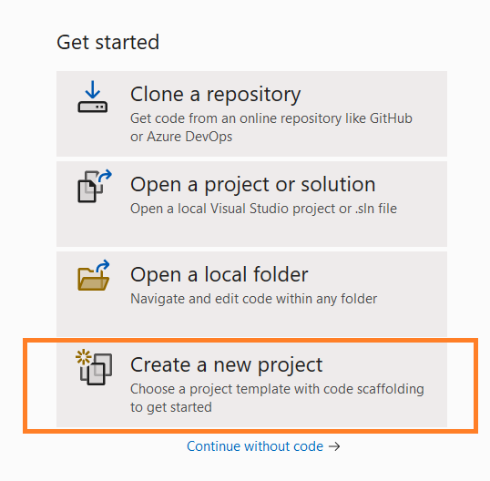
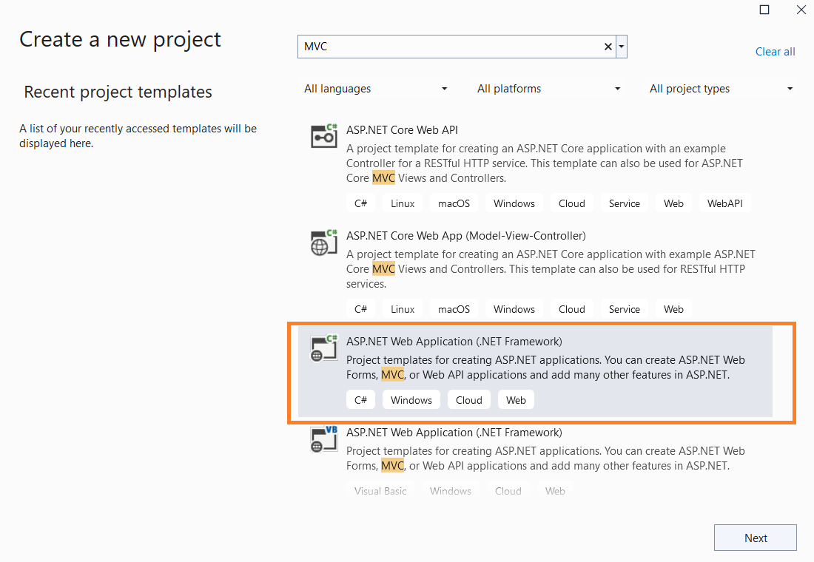
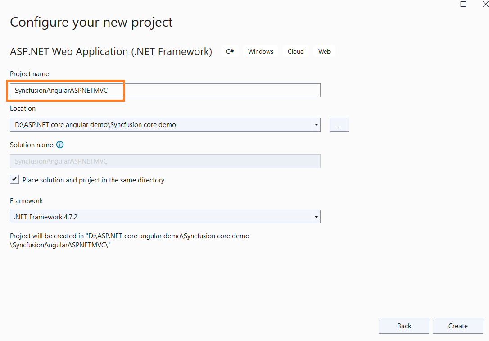
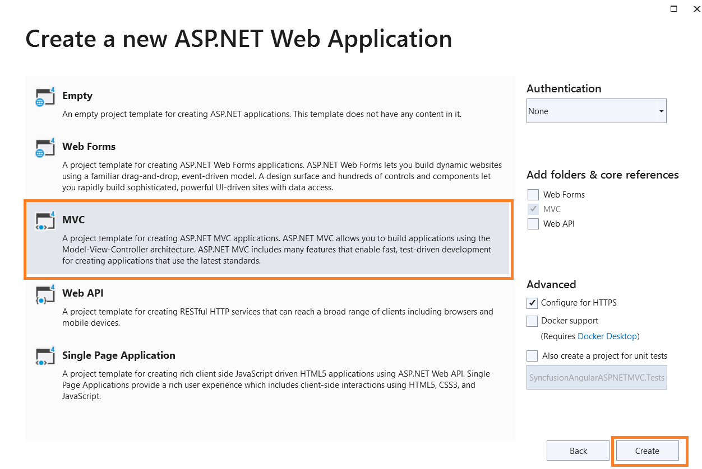

# Getting Started with Angular CLI as Front End in ASP.NET MVC

This guide details the process for creating an ASP.NET MVC framework with an Angular CLI project serving as the front end, and how to integrate Syncfusion Angular UI components.

## Prerequisites

Ensure the following requirements are met before integrating Syncfusion Angular Components in an ASP.NET MVC with Angular project:

* [System requirements for Syncfusion Angular UI components](https://ej2.syncfusion.com/angular/documentation/system-requirement)
* [Visual Studio 2022](https://visualstudio.microsoft.com/vs/)

## Create an ASP.NET MVC Web Application

Follow these steps to create a new ASP.NET MVC Web application using the Microsoft template:

1. Open Visual Studio and select the `Create a new project` option.

   

2. Search for the MVC template in the search box and select the `ASP.NET Web Application(.NET Framework)` template.

   

3. Enter the project name as `SyncfusionAngularASPNETMVC` and click the Next button.

   

4. Select `MVC` as the project template and click **Create**. The application will be generated.

   

## Create Angular CLI Application 

1. Open the `Developer Command Prompt` from Visual Studio as shown below.

   

2. Create an Angular CLI application by executing the `ng new ClientApp` command, as demonstrated in the image below.

   

3. Navigate to the ClientApp directory using the `cd ClientApp` command.

   

4. Install and add the Syncfusion Angular components by following the instructions in the [Getting Started with Angular CLI](../getting-started/angular-cli/#installing-syncfusion-angular-packages) documentation.

5. Update the `outputPath` value in the `angular.json` file for the production build to `../Scripts/ClientApp`.




"projects": {
    "ClientApp": {
      "projectType": "application",
      "schematics": {},
      "root": "",
      "sourceRoot": "src",
      "prefix": "app",
      "architect": {
        "build": {
          "builder": "@angular-devkit/build-angular:browser",
          "options": {
            "outputPath": "../Scripts/ClientApp",
          }
        }
      }
    }
}




## Configuring ASP.NET MVC Application 

### For Building Angular Application Using MS Build

To automate the installation and build process of the Angular application when the MVC application is built, append the MS Build configuration to the end of the `SyncfusionAngularASPNETMVC.csproj` file as illustrated below.




<PropertyGroup>
    <TypeScriptCompileBlocked>true</TypeScriptCompileBlocked>
    <TypeScriptToolsVersion>Latest</TypeScriptToolsVersion>
    <IsPackable>false</IsPackable>
    <SpaRoot>ClientApp\</SpaRoot>
    <DefaultItemExcludes>$(DefaultItemExcludes);$(SpaRoot)node_modules\**</DefaultItemExcludes>
    <BuildServerSideRenderer>false</BuildServerSideRenderer>
</PropertyGroup>

<ItemGroup>
    <!-- Don't publish the SPA source files, but do show them in the project files list -->
    <Content Remove="$(SpaRoot)**" />
    <None Remove="$(SpaRoot)**" />
    <None Include="$(SpaRoot)**" Exclude="$(SpaRoot)node_modules\**" />
</ItemGroup>

<Target Name="BeforeBuild" AfterTargets="ComputeFilesToPublish">
    <!-- As part of publishing, ensure the JS resources are freshly built in production mode -->
    <Exec WorkingDirectory="$(SpaRoot)" Command="npm install" />
    <Exec WorkingDirectory="$(SpaRoot)" Command="npm run build --prod -- --base-href /" />
    <Exec WorkingDirectory="$(SpaRoot)" Command="npm run build:ssr --prod" Condition=" '$(BuildServerSideRenderer)' == 'true' " />

    <!-- Include the newly-built files in the publish output -->
    <ItemGroup>
        <DistFiles Include="$(SpaRoot)dist\**; $(SpaRoot)dist-server\**" />
        <DistFiles Include="$(SpaRoot)node_modules\**" Condition="'$(BuildServerSideRenderer)' == 'true'" />
        <ResolvedFileToPublish Include="@(DistFiles->'%(FullPath)')" Exclude="@(ResolvedFileToPublish)">
        <RelativePath>%(DistFiles.Identity)</RelativePath>
        <CopyToPublishDirectory>PreserveNewest</CopyToPublishDirectory>
        <ExcludeFromSingleFile>true</ExcludeFromSingleFile>
        </ResolvedFileToPublish>
    </ItemGroup>
</Target>




### Configure MVC Bundle with Angular Production Scripts

To configure the MVC bundle with Angular production script and style files, edit the `App_Start\BundleConfig.cs` file as illustrated in the following code snippet.




using System.Web;
using System.Web.Optimization;

namespace SyncfusionAngularASPNETMVC
{
    public class BundleConfig
    {
        // For more information on bundling, visit https://go.microsoft.com/fwlink/?LinkId=301862
        public static void RegisterBundles(BundleCollection bundles)
        {
            bundles.Add(new Bundle("~/bundles/clientapp").Include(
                "~/Scripts/ClientApp/runtime.*",
                "~/Scripts/ClientApp/polyfills.*",
                "~/Scripts/ClientApp/main.*"));

            bundles.Add(new StyleBundle("~/Content/clientapp").Include(
                      "~/Scripts/ClientApp/styles.*"));




### Include Angular Production Scripts in MVC

To incorporate Angular production scripts and style files, add the highlighted sections to the `~/Views/Shared/_Layout.cshtml` file.




<!DOCTYPE html>
<html>
<head>
    <meta charset="utf-8" />
    <meta name="viewport" content="width=device-width, initial-scale=1.0">
    <title>@ViewBag.Title - My ASP.NET Application</title>
    <base href="/" />
    @Styles.Render("~/Content/css")
    @Styles.Render("~/Content/clientapp")
    @Scripts.Render("~/bundles/modernizr")
</head>
<body>
    @RenderBody()

    ...
    @Scripts.Render("~/bundles/jquery")
    @Scripts.Render("~/bundles/bootstrap")
    @Scripts.Render("~/bundles/clientapp")
    @RenderSection("scripts", required: false)
</body>
</html>




Add the `<app-root>` tag in the `~/Views/Home/index.cshtml` file.




@{
    ViewBag.Title = "Home Page";
}

<app-root></app-root>




## Run the Application

Execute the application from Visual Studio to display the component.

> [Explore the Angular Sample with ASP.NET MVC on GitHub](https://github.com/SyncfusionExamples/Aspnet-mvc-with-angular-cli).
