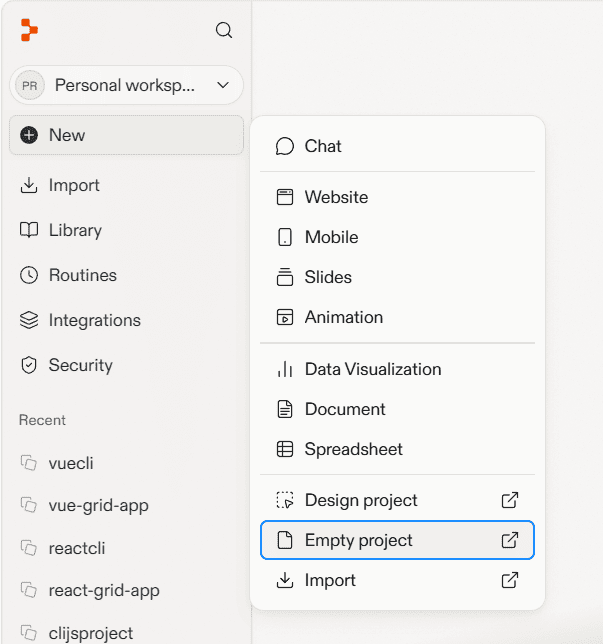
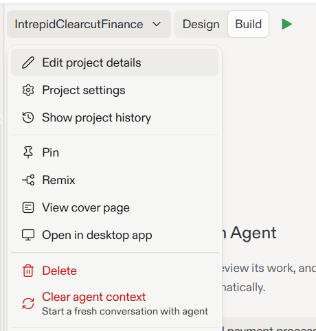
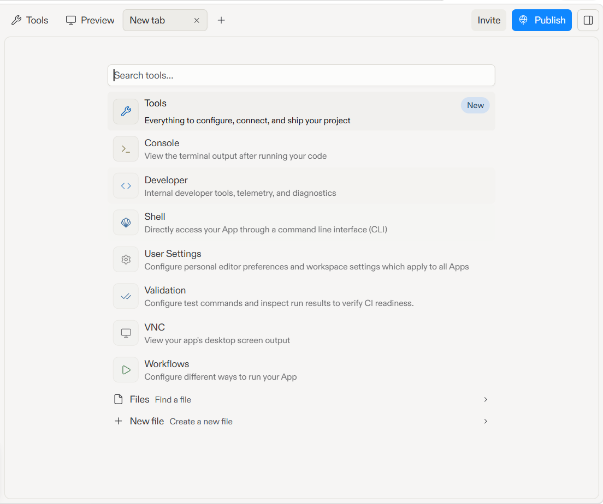
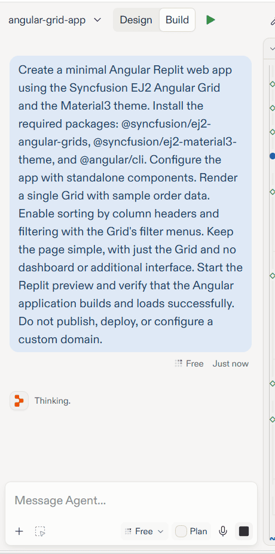
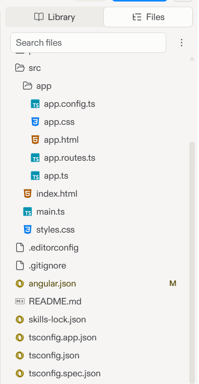
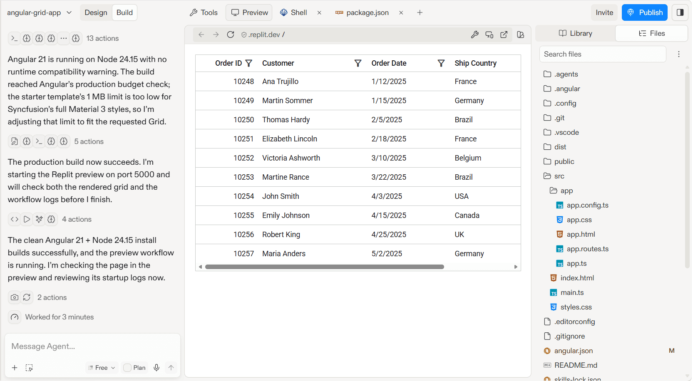
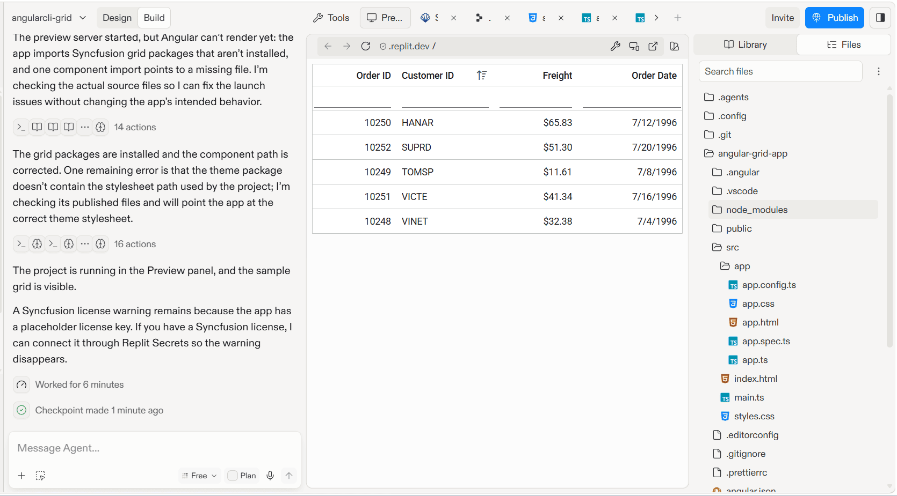

# Getting Started with Syncfusion® Grid in Replit

This section provides a step-by-step guide for setting up an Angular application in Replit and integrating the Syncfusion® Grid component — without installing any local tools.

`Replit` is a browser-based development environment that lets you write, run, and deploy applications entirely in the cloud. It requires no local setup and is well suited for users who are new to software development, or who want to prototype and iterate quickly without configuring local development tools.

## Prerequisites

Before getting started, ensure the following:

* A free or paid Replit account
* A valid Syncfusion® license key (licensed or trial)

> No local Node.js, npm, or IDE installation is required. All development happens inside the Replit browser environment.

## Create a project in Replit

1. Sign in to [Replit](https://replit.com/).
2. Click **New** and select **Empty project**.

Replit creates an empty project with a default generated name.



3. To rename the project, click the project name dropdown located at the top of the Replit workspace, select **Edit project details**, and enter a name such as `angular-grid-app`.



## Integrate the Angular Grid component

This section explains how to integrate the Syncfusion® Angular Grid component into your existing Replit Angular project with the minimum required configuration. You can use either of the following approaches to add and run the Grid component successfully.

Before proceeding, click the **+** icon in the tab bar and select **Shell** from the new tab. The Shell is required for both the Agent Skills and CLI approaches described in the following sections.







Use the pre-installed Syncfusion® Angular Grid skills with the Replit Agent to generate the application code automatically.

## Install the Angular Grid skills

To install the Syncfusion® Angular Grid skills, run the following command in the Shell tab:

```bash
npx skills add syncfusion/angular-ui-controls-skills --skill syncfusion-angular-grid
```

Once skills are installed, the Replit Agent automatically:

* **Reads the skill files** — The agent retrieves component APIs, best practices, and code patterns from the installed Syncfusion® skills.
* **Grounds code generation** — The agent uses skill-based knowledge instead of generic AI suggestions, ensuring accurate Syncfusion® APIs and patterns.
* **Generates production-ready code** — The agent generates complete, working implementations that can be directly integrated into your application.
* **Enforces best practices** — The agent recommends correct packages, proper license registration, theme setup, and configuration.

Once skills are installed, the Replit Agent can generate Grid component code automatically. Open the Replit Agent panel and enter a prompt such as:

> Create a minimal Angular Replit web app using the Syncfusion EJ2 Angular Grid and the Material3 theme. Install the required packages: @syncfusion/ej2-angular-grids, @syncfusion/ej2-material3-theme, and @angular/cli. Configure the app with standalone components. Register my Syncfusion license key in `src/main.ts` before bootstrap — I'll paste the key into the placeholder. Render a single Grid with sample order data. Enable sorting by column headers and filtering with the Grid's filter menus. Keep the page simple, with just the Grid and no dashboard or additional interface. Start the Replit preview and verify that the Angular application builds and loads successfully. Do not publish, deploy, or configure a custom domain.



The agent will:

* Create an Angular application structure
* Install the required Syncfusion® packages (@syncfusion/ej2-angular-grids, @syncfusion/ej2-material3-theme, etc.)
* Register the license key before component initialization when requested in the prompt
* Import the theme CSS in the correct file
* Generate the complete Grid component implementation with your requested features
* Create sample data and configuration based on your requirements

Review the generated code by opening the Library panel on the right side. Click the Files tab to view all project files. Then, click on files like `src/main.ts`, `src/app/app.component.ts`, `src/index.html`, and `src/styles.css` to view and edit the generated code if needed. You can also press Ctrl + Shift + L (Windows) / Cmd + Shift + L (macOS) to quickly toggle the Library panel.



## Run the application

Once the agent finishes generating the application code, it automatically starts the dev server and the Angular Grid application is displayed in the preview pane. If the preview does not start, click the **Run** button (▶) at the top of the Replit workspace.







Create the Angular application manually using the Vite CLI and add the Syncfusion® Angular Grid component step by step.

## Create a Vite Angular project

1. Update the Node.js Version and Create an Angular Project

In the Replit `.replit` file, add or update the `modules` entry to use Node.js 24 as shown below:

```
modules = ["nodejs-24"]
```

Restart or reload the Replit workspace to apply the Node.js version update.
 
In the Shell tab, run the following command to verify the Node.js version:
 
```bash
node -v
```
Once Node.js 24 is active, run the following commands to create an Angular project:
 
```bash
npx @angular/cli@21 new angular-grid-app --package-manager=npm --routing=false --style=css --skip-git
cd angular-grid-app
```

> A Package Firewall warning may appear in Replit during dependency installation. This is related to Replit's security policy and does not affect the runtime compatibility of the Angular application or Syncfusion components after successful installation.

2. Install the Syncfusion® Grid package and the Material3 theme:

```bash
npm install @syncfusion/ej2-angular-grids @syncfusion/ej2-material3-theme --save
```

3. Open the `src/styles.css` file and add the following import statement:

```css
@import "@syncfusion/ej2-material3-theme/styles/material3.css";
```

4. Update the `src/app/app.component.ts` file and replace its contents with:

```typescript
import { Component, OnInit } from '@angular/core';
import { GridModule } from '@syncfusion/ej2-angular-grids';
import { PageService, SortService, FilterService } from '@syncfusion/ej2-angular-grids';

// Sample data
const data: Object[] = [
    {
        OrderID: 10248,
        CustomerID: 'VINET',
        Freight: 32.38,
        OrderDate: new Date(8364186e5)
    },
    {
        OrderID: 10249,
        CustomerID: 'TOMSP',
        Freight: 11.61,
        OrderDate: new Date(8367642e5)
    },
    {
        OrderID: 10250,
        CustomerID: 'HANAR',
        Freight: 65.83,
        OrderDate: new Date(8371242e5)
    },
    {
        OrderID: 10251,
        CustomerID: 'VICTE',
        Freight: 41.34,
        OrderDate: new Date(8374842e5)
    },
    {
        OrderID: 10252,
        CustomerID: 'SUPRD',
        Freight: 51.3,
        OrderDate: new Date(8378442e5)
    }
];

@Component({
    selector: 'app-root',
    standalone: true,
    imports: [GridModule],
    providers: [PageService, SortService, FilterService],
    template: `
        <ejs-grid [dataSource]="gridData" [allowSorting]="true" [allowFiltering]="true">
            <e-columns>
                <e-column field='OrderID' headerText='Order ID' textAlign='Right' width='120'></e-column>
                <e-column field='CustomerID' headerText='Customer ID' width='140'></e-column>
                <e-column field='Freight' headerText='Freight' textAlign='Right' format='C2' width='120'></e-column>
                <e-column field='OrderDate' headerText='Order Date' textAlign='Right' format='yMd' width='150'></e-column>
            </e-columns>
        </ejs-grid>
    `,
    styles: [`
        :host {
            display: block;
        }
    `]
})
export class AppComponent implements OnInit {
    public gridData: Object[] = [];

    ngOnInit(): void {
        this.gridData = data;
    }
}
```

For more information on obtaining and registering a license key, see [How to Register a Syncfusion® License Key](../../licensing/license-key-registration).

5. Update the `src/main.ts` file and register your Syncfusion license key before bootstrapping the application:

```typescript
import { bootstrapApplication } from '@angular/platform-browser';
import { registerLicense } from '@syncfusion/ej2-base';
import { AppComponent } from './app/app.component';

// Register your Syncfusion license key here
registerLicense('YOUR_LICENSE_KEY');

bootstrapApplication(AppComponent);
```

> **Note:** Replace `YOUR_LICENSE_KEY` with your actual license key. The license key must be registered before any Syncfusion component is initialized to avoid the license warning banner. For more information, see [License Key Registration](https://ej2.syncfusion.com/angular/documentation/licensing/license-key-registration).





## Run the application

Once you have completed all the setup steps, click the **Run** button (▶) at the top of the Replit workspace. The Angular Grid application will be built and rendered in the preview pane.



## Key features to explore

Once your Grid is running, you can enhance it with:

* Data binding: Bind data from APIs or remote sources
* Sorting and filtering: Enable sorting and filtering on columns using Grid properties
* Paging: Add pagination to handle large datasets
* Selection: Enable row or cell selection
* Editing: Allow inline editing of cell values with the Edit module
* Exporting: Export data to Excel or PDF formats
* Responsive design: Build responsive layouts that adapt to different screen sizes

## Tips for working in Replit

* Shell access: Use the Shell tab to run any npm commands, such as installing additional packages or starting or stopping the dev server manually.
* Persistent storage: Replit persists your project files automatically. Changes are saved as you type.
* File management: Use the file browser to view and edit project files. You can also use the context menu to create, edit, and manage files.

## Troubleshooting

| Issue | Resolution |
|-------|-----------|
| Preview shows "Your app is not running" | Click **Run** and wait for the build to finish. If the issue persists, open the Agent panel, paste the preview error text, and ask it to check the workflow, restart the development server, and fix any runtime errors. |
| Module not found errors | Open the Shell and run `npm install` to restore all dependencies. |
| License warning banner | Verify that `registerLicense` is called before initializing the Grid component. |
| Grid not displaying | Ensure the theme CSS is imported in `src/styles.css` and that the Grid component is properly imported in your Angular component. |
| Unknown element 'ejs-grid' | Ensure `GridModule` is listed in the component's `imports` array. |
| Shell commands not working | Wait for Replit to finish booting the environment, then retry the command. |
| Angular build errors | Check that all Syncfusion packages are compatible with your Angular version. Refer to the [Version Compatibility](../upgrade/version-compatibility) guide. |

## See Also

* [Getting Started with Angular CLI](./angular-cli)
* [Getting Started with Angular Standalone](./angular-standalone)
* [Grid Getting Started Documentation](https://ej2.syncfusion.com/angular/documentation/grid/getting-started)
* [How to register Syncfusion® license key](https://ej2.syncfusion.com/angular/documentation/licensing/license-key-registration)
* [Syncfusion Angular Themes](https://ej2.syncfusion.com/angular/documentation/appearance/overview)
* [Replit Documentation](https://docs.replit.com/)
