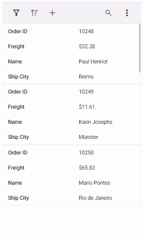
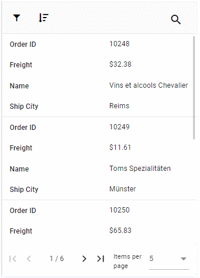

# Adaptive in Angular Grid Component

The Grid user interface (UI) was redesigned to provide an optimal viewing experience and improve usability on small screens. This interface will render the filter, sort, column chooser, column menu(supports only when the `rowRenderingMode` as Horizontal) and edit dialogs adaptively and have an option to render the grid row elements in the vertical direction.

## Render adaptive dialogs

The Syncfusion&reg; [Angular Data Grid](https://www.syncfusion.com/angular-components/angular-data-grid) offers a valuable feature for rendering adaptive dialogs, specifically designed to enhance usability on smaller screens. This feature proves especially useful for optimizing the interface on devices with limited screen real estate. The functionality is achieved by enabling the [enableAdaptiveUI](https://ej2.syncfusion.com/angular/documentation/api/grid#enableadaptiveui) property, allowing the grid to render filter, sort, and edit dialogs in full-screen mode.

Additionally, apply the `e-bigger` class to the grid's parent element to enable the adaptive view.

The following sample demonstrates to enable adaptive dialogs in the Syncfusion Angular Grid:










  


## Vertical row rendering

The Angular Data Grid introduces vertical row rendering, which displays row elements in a vertical order. This presentation enhances data visibility in scenarios where a vertical layout is preferable. Set the [rowRenderingMode](https://ej2.syncfusion.com/angular/documentation/api/grid#rowrenderingmode) property to `Vertical`.

> The default row rendering mode is `Horizontal`.

The following sample demonstrates dynamic switching between `Vertical` and `Horizontal` row rendering modes using a DropDownList:




import { NgModule } from '@angular/core'
import { BrowserModule } from '@angular/platform-browser'
import { GridModule } from '@syncfusion/ej2-angular-grids'
import { PageService, SortService, FilterService, EditService, ToolbarService, AggregateService } from '@syncfusion/ej2-angular-grids'
import { DropDownListModule } from '@syncfusion/ej2-angular-dropdowns'
import { Component, OnInit, ViewChild } from '@angular/core';
import { GridComponent, RowRenderingDirection } from '@syncfusion/ej2-angular-grids';
import { data } from './datasource';
import { ChangeEventArgs } from '@syncfusion/ej2-dropdowns';

@Component({
    imports: [GridModule,DropDownListModule],
    providers: [PageService,SortService,FilterService,EditService,ToolbarService,AggregateService],
    standalone: true,
    selector: 'app-root',
    template: `
    

        <label style="padding: 30px 17px 0 0;"> Select row rendering mode :</label>
        <ejs-dropdownlist #dropdown style="padding: 26px 0 0 0" index="0" width="150" [dataSource]="dropDownData"  (change)="changeAlignment($event)"></ejs-dropdownlist>
    

    

        

            

                <ejs-grid #adaptive id="adaptivebrowser" [dataSource]='data' enableAdaptiveUI='true' [rowRenderingMode]="rowMode" height='100%' allowPaging='true' allowFiltering='true' allowSorting='true' [editSettings]='editSettings' [filterSettings]='filterSettings' [toolbar]='toolbar' (load)='onLoad()'>
                <e-columns>
                    <e-column field='SNO' headerText='S NO' width='150' isPrimaryKey='true' [validationRules]='orderidrules'></e-column>
                    <e-column field='Model' headerText='Model' width='200' editType='dropdownedit'[validationRules]='customeridrules'></e-column>
                    <e-column field='Developer' headerText='Developer' width='200' [validationRules]='customeridrules' [filter]='menuFilter'></e-column>
                    <e-column field='ReleaseDate' headerText='Released Date' width='200' type='date' format='yMMM' editType='datepickeredit'>
                    <e-column field='AndroidVersion' headerText='Android Version' width='200' [validationRules]='customeridrules' [filter]='checkboxFilter'></e-column></e-column>
                </e-columns>
                <e-aggregates>
                    <e-aggregate>
                        <e-columns>
                            <e-column type="Count" field="Model" >
                                <ng-template #footerTemplate let-data>Total Models: {{data.Count}}</ng-template>
                            </e-column>
                        </e-columns>
                    </e-aggregate>
                </e-aggregates>
            </ejs-grid>
        

        

         
        
Source: <a href="https://en.wikipedia.org/wiki/List_of_Android_smartphones"target="_blank">Wikipedia: List of Android smartphones</a>

    
`
})

export class AppComponent implements OnInit {
    @ViewChild('adaptive')
    public grid?: GridComponent;
    public data?: object[];
    public editSettings?: Object;
    public toolbar?: string[];
    public orderidrules?: Object;
    public customeridrules?: Object;
    public filterSettings?: Object;
    public menuFilter?: Object;
    public checkboxFilter?: Object;
    public rowMode?: string;
    public dropDownData: Object[] = [
        { text: 'Vertical', value: 'Vertical' },
        { text: 'Horizontal', value: 'Horizontal' },
    ];

    ngOnInit(): void {
        this.data = data;
        this.editSettings = { allowEditing: true, allowAdding: true, allowDeleting: true, mode: 'Dialog' };
        this.toolbar = ['Add', 'Edit', 'Delete', 'Update', 'Cancel', 'Search'];
        this.orderidrules = { required: true, number: true };
        this.customeridrules = { required: true };
        this.filterSettings = { type: 'Excel' };
        this.menuFilter = {
            type: 'Menu'
        };
        this.checkboxFilter = {
            type: 'CheckBox'
        };
    }

    public changeAlignment(args: ChangeEventArgs): void {
        (this.grid as GridComponent).rowRenderingMode = (args.value as RowRenderingDirection);
    }

    public onLoad(): void {
        (this.grid as GridComponent).adaptiveDlgTarget = document.getElementsByClassName('e-mobile-content')[0] as HTMLElement;
    }
}







  


> The [enableAdaptiveUI](https://ej2.syncfusion.com/angular/documentation/api/grid#enableadaptiveui) property must be enabled for vertical row rendering to function properly.

### Supported features by vertical row rendering

Vertical row rendering supports the following grid features:

* Paging, including page size dropdown
* Sorting
* Filtering
* Selection
* Dialog editing
* Aggregates
* Infinite scrolling
* Toolbar - Options like `Add`, `Filter`, `Sort`, `Edit`, `Delete`, `Search` and `toolbarTemplate` are available when their respective features are enabled. The toolbar dynamically includes a three-dotted icon, containing additional features like `ColumnChooser`, `Print`, `PdfExport`, `ExcelExport`, or `CsvExport`, once these features are enabled. Please refer to the following snapshot.

The following image shows the adaptive grid with enabled paging and pager dropdown:

> The Column Menu feature, which includes grouping, sorting, autofit, filter, and column chooser, is exclusively supported for the grid in `Horizontal` [rowRenderingMode](https://ej2.syncfusion.com/angular/documentation/api/grid/index-default#rowrenderingmode).

## Rendering an adaptive layout for smaller screens alone

By default, adaptive UI layout is rendered in both mobile devices and desktop mode too while setting the [enableAdaptiveUI](https://ej2.syncfusion.com/angular/documentation/api/grid#enableadaptiveui) property as `true`. Now the DataGrid component has an option to render an adaptive layout only for mobile screen sizes. This can be achieved by specifying the `AdaptiveUIMode` property value as `Mobile`. The default value of the `AdaptiveUIMode` property is `Both`.

> The [rowRenderingMode](https://ej2.syncfusion.com/angular/documentation/api/grid#rowrenderingmode) property behavior depends on the [adaptiveUIMode](https://ej2.syncfusion.com/angular/documentation/api/grid#adaptiveuimode) setting.




import { GridModule, PageService, SortService, FilterService, EditService, SelectionService, ExcelExportService, PdfExportService, 
ToolbarService, AggregateService, GroupService, GridComponent, ResizeService, ReorderService } from '@syncfusion/ej2-angular-grids';
import { Component, OnInit, ViewChild } from '@angular/core';
import { data } from './datasource';
import { ClickEventArgs } from '@syncfusion/ej2-navigations';

@Component({
    imports: [GridModule],
    providers: [ PageService, GroupService, SortService, FilterService, EditService,ToolbarService, AggregateService, SelectionService, ExcelExportService,PdfExportService, ResizeService, ReorderService],
    standalone: true,
    selector: 'app-root',
    template: `
        

            

                

                    <ejs-grid #grid id="Grid" [dataSource]='data' enableAdaptiveUI='true' adaptiveUIMode= 'Mobile'height='100%' allowPaging='true' allowGrouping=true allowFiltering='true' allowSorting='true' allowSelection='true' [selectionSettings]="selectionSettings" showColumnChooser='true' [editSettings]='editSettings' [filterSettings]='filterSettings' [toolbar]='toolbar' allowExcelExport='true' allowPdfExport='true' (load)='onLoad()' (toolbarClick)='toolbarClick($event)'>
                        <e-columns>
                            <e-column field='OrderID' headerText='Order ID' width='120' isPrimaryKey='true' [validationRules]='orderidrules'></e-column>
                            <e-column field='CustomerID' headerText='Customer Name' width='160' minWidth=80 maxWidth=300 [validationRules]='customerIDRules'></e-column>
                            <e-column field='Freight' headerText='Freight' width='150' minWidth=80 maxWidth=300 [validationRules]='freightRules'></e-column>
                            <e-column field='OrderDate' headerText='Order Date' width='200' type='date' [format]='dateFormat' editType='datepickeredit'></e-column>
                            <e-column field='ShipCountry' headerText='Ship Country' width='200'></e-column>
                        </e-columns>                       
                    </ejs-grid>
                

            

        
`
})

export class AppComponent implements OnInit {
    @ViewChild('grid')
    public grid?: GridComponent;
    public data?: object[];
    public editSettings?: Object;
    public toolbar?: string[];
    public orderidrules?: Object;
    public customerIDRules?: Object;
    public freightRules?: Object;
    public filterSettings?: Object;
    public selectionSettings?: Object;
    public dateFormat?: Object;

    ngOnInit(): void {
        this.data = data;
        this.editSettings = { allowEditing: true, allowAdding: true, allowDeleting: true, mode: 'Dialog' };
        this.toolbar = ['Add', 'Edit', 'Delete', 'Update', 'Cancel', 'Search', 'ColumnChooser', 'ExcelExport', 'PdfExport', 'CsvExport'];
        this.orderidrules = { required: true, number: true };
        this.customerIDRules = { required: true };
        this.freightRules = { required: true };
        this.filterSettings = { type: 'Excel' };
        this.selectionSettings = { type: 'Multiple' };
        this.dateFormat = { type: 'dateTime', format: 'M/d/y hh:mm a' };
    }

    public onLoad(): void {
        (this.grid as GridComponent).adaptiveDlgTarget = document.getElementsByClassName('e-mobile-content')[0] as HTMLElement;
    }

    toolbarClick(args: ClickEventArgs): void {
        switch (args.item.id) {
            case 'Grid_pdfexport':
                (this.grid as GridComponent).pdfExport();
                break;
            case 'Grid_excelexport':
                (this.grid as GridComponent).excelExport();
                break;
        }
    }
}






  


N> N> Looking for the full responsive Angular Data Grid component overview, features, pricing, and documentation? Visit the [Angular Data Grid](https://www.syncfusion.com/angular-components/angular-data-grid) page.

## See Also

[Effective ways to utilize responsiveness](https://www.syncfusion.com/blogs/post/essential-js-2-effective-ways-to-utilize-responsiveness-in-the-angular-grid.aspx)