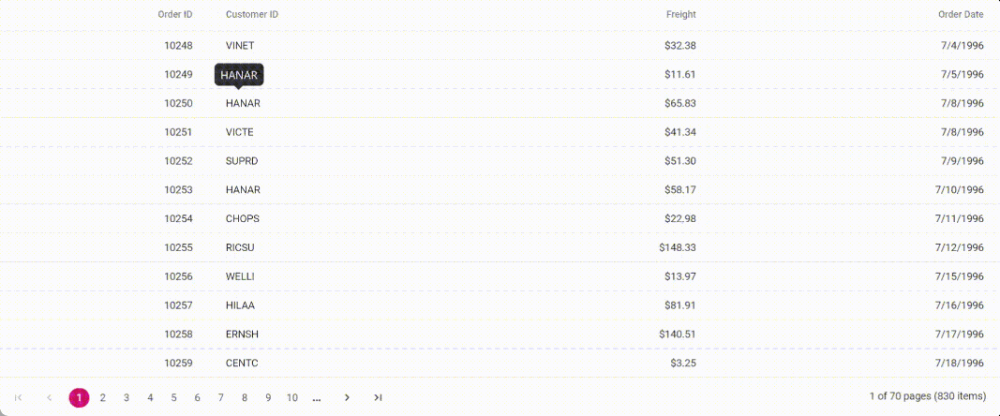

# Cell Customization and Styling in Angular Grid Component

A cell in the Syncfusion<sup style="font-size:70%">&reg;</sup> Angular Grid component represents the smallest unit of data within the grid. Each cell corresponds to the intersection of a row and a column, and it is responsible for displaying the value associated with that specific row-column combination. Cells can display plain text, formatted values, or fully customized content, making them highly flexible for presenting structured data in a grid layout. to create interactive and visually appealing data presentations.

## Displaying the HTML content

Displaying HTML content in a grid can be useful when displaying formatted content, such as images, links, or tables, in a tabular format. The Grid component allows HTML tags to be displayed in the grid header and content. By default, HTML content is encoded to prevent potential security vulnerabilities. However, the [disableHtmlEncode](https://ej2.syncfusion.com/angular/documentation/api/grid/column#disablehtmlencode) property can be set to `false` to display HTML tags without encoding. This feature is useful when displaying HTML content in a grid cell.

In the following example, the [EJ2 Toggle Switch Button](https://ej2.syncfusion.com/angular/documentation/switch/getting-started) component is added  to enable and disable the [disableHtmlEncode](https://ej2.syncfusion.com/angular/documentation/api/grid/column#disablehtmlencode) property. When the switch is toggled, the [change](https://ej2.syncfusion.com/angular/documentation/api/switch#change) event is triggered and the `disableHtmlEncode` property of the column is updated accordingly. The [refreshColumns](https://ej2.syncfusion.com/angular/documentation/api/grid#refreshcolumns) method is called to refresh the grid and display the updated content.










  


> * The [disableHtmlEncode](https://ej2.syncfusion.com/angular/documentation/api/grid/column#disablehtmlencode) property disables HTML encoding for the corresponding column in the grid. 
> * If the property is set to `true`, any HTML tags in the column's data will be displayed. 
> * If the property is set to `false`, the HTML tags will be removed and displayed as plain text.
> * Disabling HTML encoding can potentially introduce security vulnerabilities, so use caution when enabling this feature.
> * If [enableHtmlSanitizer](https://ej2.syncfusion.com/angular/documentation/api/grid#enablehtmlsanitizer) property of grid is set to `true`, then the content is sanitized to prevent any potential security vulnerabilities.
> * The `disableHtmlEncode` property of the column can also be disabled using [getColumns](https://ej2.syncfusion.com/angular/documentation/api/grid#getcolumns) method on [change](https://ej2.syncfusion.com/angular/documentation/api/switch#change) event of `Switch` component. This is demonstrated in the following code snippet:

```typescript
change(args) {
  if (args.checked) {
    this.grid.getColumns()[1].disableHtmlEncode = false;
  } else {
    this.grid.getColumns()[1].disableHtmlEncode = true;
  }
  this.grid.refresh();
}
```

## Autowrap the grid content

The auto wrap feature allows cell content in the grid to wrap to the next line when it exceeds the boundary of the specified cell width. Cell content wrapping works based on the position of white space between words. To support the Autowrap functionality in Syncfusion<sup style="font-size:70%">&reg;</sup> Grid, an appropriate [width](https://ej2.syncfusion.com/angular/documentation/api/grid/column#width) must be set for the columns. The column `width` defines the maximum width of a column and helps wrap content automatically.

To enable auto wrap, set the [allowTextWrap](https://ej2.syncfusion.com/angular/documentation/api/grid#allowtextwrap) property to `true`. The wrap mode can also be configured by setting the [textWrapSettings.wrapMode](https://ej2.syncfusion.com/angular/documentation/api/grid/textWrapSettings#wrapmode) property.

Grid provides three wrap mode options:

* `Both` - Default value. Wraps both header and content text.
* `Header` - Wraps only column header text.
* `Content` - Wraps only cell content text.

The following example demonstrates setting the [allowTextWrap](https://ej2.syncfusion.com/angular/documentation/api/grid#allowtextwrap) property to `true` and specify the wrap mode as `Content` by setting the [textWrapSettings.wrapMode](https://ej2.syncfusion.com/angular/documentation/api/grid/textWrapSettings#wrapmode) property. Also change the `textWrapSettings.wrapMode` property to `Content` and `Both` on changing the dropdown value using the [change](https://ej2.syncfusion.com/angular/documentation/api/drop-down-list#change) event of the `DropDownList` component.










  


> * If a column `width` is not specified, then the Autowrap of columns will be adjusted with respect to the grid's `width`.
> * If a column's header text contains no white space, the text may not be wrapped.
> * If the content of a cell contains HTML tags, the Autowrap functionality may not work as expected. In such cases, the [headerTemplate](https://ej2.syncfusion.com/angular/documentation/api/grid/column#headertemplate) and [template](https://ej2.syncfusion.com/angular/documentation/api/grid/column#template) properties of the column can be used to customize the appearance of the header and cell content.

## Customize cell styles

Customizing grid cell styles allows modification of cell appearance in the grid control to meet specific design requirements. The font, background color, and other cell styles can be customized using grid events, CSS, properties, or method support.

### Using event

The [queryCellInfo](https://ej2.syncfusion.com/angular/documentation/api/grid#querycellinfo) event of the grid can be used to customize cell appearance. This event triggers when the grid renders each header cell and provides an object containing information about the header cell. This object can be used to modify header cell styles.

The following example demonstrates adding the [queryCellInfo](https://ej2.syncfusion.com/angular/documentation/api/grid#querycellinfo) event handler to the grid. In the event handler, the current column is checked to determine if it is the "Freight" field, and the appropriate CSS class is applied to the cell based on its value.










  


> The [queryCellInfo](https://ej2.syncfusion.com/angular/documentation/api/grid#querycellinfo) event is triggered for every cell of the grid, so it may impact grid performance when used to modify a large number of cells.

### Using CSS

Styles can be applied to cells using CSS selectors. The Grid provides a class name for each cell element, which can be used to apply styles to specific cells or cells in a particular column. The `e-rowcell` class is used to style row cells, and the `e-selectionbackground` class is used to change the background color of selected rows.

```CSS
.e-grid td.e-cellselectionbackground {
  background: #9ac5ee;
  font-style: italic;
}
```

The following example demonstrates CSS-based cell styling for selected rows using custom class names.










  


### Using property

To customize the style of grid cells, define the [customAttributes](https://ej2.syncfusion.com/angular/documentation/api/grid/column#customattributes) property in the column definition object. The `customAttributes` property takes an object with name-value pairs to customize CSS properties for grid cells. Multiple CSS properties can be set to the custom class using the `customAttributes` property.

```CSS
.custom-css {
  background: #d7f0f4;
  font-style: italic;
  color: navy;
}
```

Here, the `customAttributes` property of the "Ship City" column is set to an object that contains the CSS class "custom-css". This CSS class is applied to all cells in the "Ship City" column of the grid.

```typescript
{
    field: 'ShipCity', headerText: 'Ship City', customAttributes: {class: 'custom-css'}, width: '120'
}
```

The following example demonstrates [customAttributes](https://ej2.syncfusion.com/angular/documentation/api/grid/column#customattributes) property usage for styling "Order ID" and "Ship City" columns.










  


> Custom attributes apply to all cells in the specified column, including header and content cells.

### Using methods

The Grid provides the following methods to customize the appearance of grid column headers and cells:

1. [getHeaderContent](https://ej2.syncfusion.com/angular/documentation/api/grid#getheadercontent): The `getHeaderContent` method is used to customize column header appearance. The header element is accessed using the `querySelector` method, and styles are applied using the `style` property of the cell element.

2. [getCellFromIndex](https://ej2.syncfusion.com/angular/documentation/api/grid#getcellfromindex): The `getCellFromIndex` method is used to customize the appearance of a specific cell in the grid by specifying the row and column index of the target cell.

The following example demonstrates the use of the [getColumnHeaderByIndex](https://ej2.syncfusion.com/angular/documentation/api/grid#getcolumnheaderbyindex) and [getCellFromIndex](https://ej2.syncfusion.com/angular/documentation/api/grid#getcellfromindex) methods to customize the appearance of the "Customer ID" column header and specific cell inside the [dataBound](https://ej2.syncfusion.com/angular/documentation/api/grid#databound) event of the grid.










  


> Make sure to pass the correct row and column indices to [getCellFromIndex](https://ej2.syncfusion.com/angular/documentation/api/grid#getcellfromindex) method, or else the appearance of the wrong cell might get customized.

## Clip Mode

The clip mode feature is useful when grid cells contain long text or content that overflows the cell's width or height. It provides options to display overflow content by truncating it, displaying an ellipsis, or displaying an ellipsis with a tooltip. This feature is enabled by setting the [clipMode](https://ej2.syncfusion.com/angular/documentation/api/grid/column#clipmode) property to one of the available options.

Three types of [clipMode](https://ej2.syncfusion.com/angular/documentation/api/grid/column#clipmode) are available:

* `Clip`: Truncates overflowing content without visual indicators.
* `Ellipsis`: Displays ellipsis (...) for overflowing content.
* `EllipsisWithTooltip`: Shows ellipsis with hover tooltip displaying full content.

The following example demonstrates clip mode functionality with dynamic switching using a DropDownList [change](https://ej2.syncfusion.com/angular/documentation/api/drop-down-list#change) event. The [refresh](https://ej2.syncfusion.com/angular/documentation/api/grid#refresh) method applies the updated clip mode settings.










  


> * By default, [clipMode](https://ej2.syncfusion.com/angular/documentation/api/grid/column#clipmode) value is `Ellipsis`.
> * When the [width](https://ej2.syncfusion.com/angular/documentation/api/grid/column#width) property is set for a column, the clip mode feature is automatically applied to that column if content exceeds the specified width.
> * The Clip mode should be used with caution, as it may result in important information being truncated. The `Ellipsis` or `EllipsisWithTooltip` modes are generally recommended instead.

## Tooltip

The Syncfusion<sup style="font-size:70%">&reg;</sup> Grid displays information about grid columns when the user hovers over them with the mouse.

### Render bootstrap tooltip in grid cells

Integrate Bootstrap tooltips with grid cells for custom tooltip styling and behavior. This approach requires Bootstrap framework installation and configuration.

**Step 1**: Install Bootstrap and jQuery packages:

```bash
npm install @ng-bootstrap/ng-bootstrap
npm install jquery
```

Configure angular.json with required styles and scripts:

```json
"styles": [
  "node_modules/bootstrap/dist/css/bootstrap.min.css",
  "src/styles.css",
  "node_modules/@syncfusion/ej2-material-theme/styles/material3.css"
],
"scripts": ["node_modules/jquery/dist/jquery.min.js"]
```

**Step 2**: Add Bootstrap CDN links to index.html:

```html
<link href="https://cdn.jsdelivr.net/npm/bootstrap@5.3.0-alpha3/dist/css/bootstrap.min.css" rel="stylesheet" integrity="sha384-KK94CHFLLe+nY2dmCWGMq91rCGa5gtU4mk92HdvYe+M/SXH301p5ILy+dN9+nJOZ" crossorigin="anonymous">
<script src="https://cdn.jsdelivr.net/npm/bootstrap@5.3.0-alpha3/dist/js/bootstrap.bundle.min.js" integrity="sha384-ENjdO4Dr2bkBIFxQpeoTz1HIcje39Wm4jDKdf19U8gI4ddQ3GYNS7NTKfAdVQSZe" crossorigin="anonymous"></script>
<script src="https://cdn.jsdelivr.net/npm/@popperjs/core@2.11.7/dist/umd/popper.min.js" integrity="sha384-zYPOMqeu1DAVkHiLqWBUTcbYfZ8osu1Nd6Z89ify25QV9guujx43ITvfi12/QExE" crossorigin="anonymous"></script>
<script src="https://cdn.jsdelivr.net/npm/bootstrap@5.3.0-alpha3/dist/js/bootstrap.min.js" integrity="sha384-Y4oOpwW3duJdCWv5ly8SCFYWqFDsfob/3GkgExXKV4idmbt98QcxXYs9UoXAB7BZ" crossorigin="anonymous"></script>
```

**Step 3**: Implement Bootstrap tooltip with Angular life cycle hooks:




import { AfterViewChecked, Component } from '@angular/core';
import { orderDataSource } from './data';
import 'bootstrap';
declare var $: any;
@Component({
  selector: 'app-root',
  template: `
  <div>
    <ejs-grid [dataSource]='data' [allowPaging]='true'>
      <e-columns>
        <e-column field='OrderID' headerText='Order ID' textAlign='Right' width=90></e-column>
        <e-column field='CustomerID' headerText='Customer ID' width=120>
        <ng-template #template let-data>
          <div class="row clearfix">
            <div class="col-md-2" style="text-align:right">
              <div
                data-toggle="tooltip"
                data-container="body"
                [title]="data.CustomerID"
                data-placement="left"
                data-delay='{"show":"800", "hide":"300"}'>
                <i class="fas fa-pencil-alt"></i> {{data.CustomerID }}
              </div>
            </div>
          </div>
        </ng-template>
        </e-column>
        <e-column field='Freight' headerText='Freight' textAlign='Right' format='C2' width=90></e-column>
        <e-column field='OrderDate' headerText='Order Date' textAlign='Right' format='yMd' width=120></e-column>
      </e-columns>
    </ejs-grid>
 </div>`
})
export class AppComponent implements AfterViewChecked {
  public data = orderDataSource;

  ngAfterViewChecked() {
    $('[data-toggle="tooltip"]').tooltip();
  }
}




The following screenshot represents the Bootstrap tooltip for the "CustomerID" field:



> * Bootstrap CDN links are required in the HTML file for proper functionality.
> * The `ngAfterViewChecked` life cycle hook ensures tooltip initialization after view rendering.

### Display custom tooltip for columns

The Grid provides a feature to display custom tooltips for its columns using the [EJ2 Tooltip](https://ej2.syncfusion.com/angular/documentation/tooltip/getting-started) component. This allows providing additional information about columns when the user hovers over them.

To enable custom tooltips for columns in the grid, the grid control is rendered inside the `Tooltip` component and the target is set as `.e-rowcell`. This displays the tooltip when hovering over grid cells.

The tooltip content for grid cells can be changed by using the following code in the [beforeRender](https://ej2.syncfusion.com/angular/documentation/api/tooltip#beforerender) event. 

```typescript
beforeRender(args): void {
  if (args.target.classList.contains('e-rowcell')) {
    // Customize tooltip content based on cell data
    this.tooltip.content = 'This is value "' + args.target.innerText + '" ';
  }
}
```

The following example demonstrates customizing the tooltip content for grid cells by using the [beforeRender](https://ej2.syncfusion.com/angular/documentation/api/tooltip#beforerender) event of the `EJ2 Tooltip` component.










  


## Grid lines

The [gridLines](https://ej2.syncfusion.com/angular/documentation/api/grid#gridlines) in a grid are used to separate cells with horizontal and vertical lines for better readability. Grid lines are enabled by setting the [gridLines](https://ej2.syncfusion.com/angular/documentation/api/grid#gridlines) property to one of the following values:

| Modes | Actions |
|-------|---------|
| `Both` | Displays both the horizontal and vertical grid lines.|
| `None` | No grid lines are displayed.|
| `Horizontal` | Displays the horizontal grid lines only.|
| `Vertical` | Displays the vertical grid lines only.|
| `Default` | Displays grid lines based on the theme.|

The following example demonstrates setting the [gridLines](https://ej2.syncfusion.com/angular/documentation/api/grid#gridlines) property based on changing the dropdown value using the [change](https://ej2.syncfusion.com/angular/documentation/api/drop-down-list#change) event of the `DropDownList` component.










  


> By default, the grid renders with `Default` mode.

## See Also

* [Is it possible to apply gradient color based on min and max value in Angular Grid?](https://www.syncfusion.com/forums/160346/is-it-possible-to-apply-gradient-color-based-on-min-and-max-value-in-angular-grid)
* [How to customize the header cell styles using methods](columns/headers#using-methods)