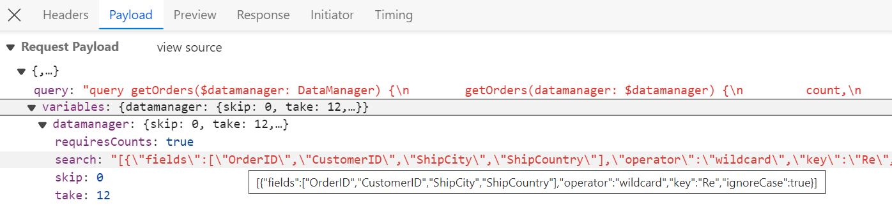
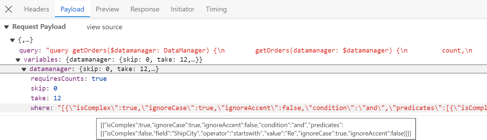
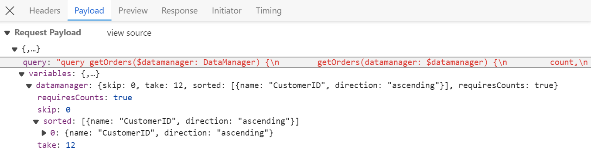
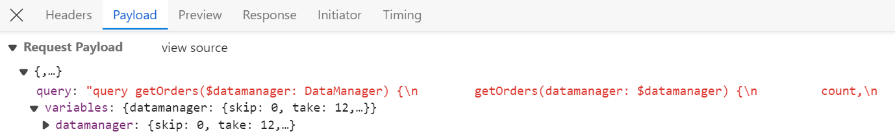
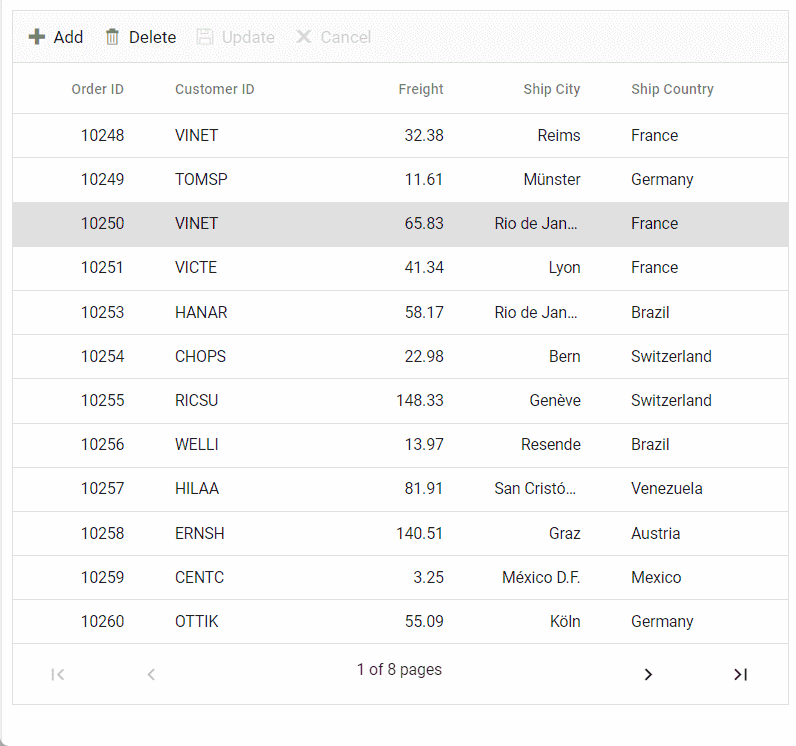

# Connecting GraphQL Service with Angular Grid Component

GraphQL is a powerful query language for APIs, designed to provide a more efficient alternative to traditional REST APIs. GraphQL allows precise data fetching, reducing over-fetching and under-fetching of data. GraphQL provides a flexible and expressive syntax for querying, enabling clients to request only the specific data they require.

Syncfusion's Grid component seamlessly integrates with GraphQL servers using the [GraphQLAdaptor](https://ej2.syncfusion.com/angular/documentation/data/adaptors#graphql-adaptor) in the [DataManager](https://ej2.syncfusion.com/angular/documentation/data/getting-started). This specialized adaptor simplifies the interaction between the Syncfusion Grid and GraphQL servers, allowing efficient data retrieval with support for various operations like CRUD (Create, Read, Update, Delete), paging, sorting, and filtering.

This section describes a step-by-step process for retrieving data from GraphQL service using `GraphQLAdaptor`, then binding it to the Angular Grid component to facilitate data and CRUD operations.

## Configure GraphQL Server

To configure a GraphQL server with Syncfusion Angular Grid, follow these steps:

**Step 1: Create Service for GraphQL**

* Create a new folder named **GraphQLServer** specifically for the GraphQL server.

* Install the [graph pack](https://www.npmjs.com/package/graphpack) npm package. Open the terminal and navigate to the server folder, then run:

  ```bash
  npm i graphpack
  ```
* To utilize Syncfusion's **ej2-data** package, include it as a dependency in the project's **package.json** file. Here's the configuration:
  
  ```json
  {
    "name": "graphql-server",
    "version": "1.0.0",
    "description": "",
    "scripts": {
      "dev": "graphpack --port 4205",
      "build": "graphpack build"
    },
    "devDependencies": {
      "graphpack": "^1.0.9"
    },
    "dependencies": {
      "@syncfusion/ej2-data": "24.1.41"
    }
  }
  ```

* Create a database file (src/db.js) to store the data.

  ```js
  export let OrderData = [
  {
      OrderID: 10248, CustomerID: 'VINET', EmployeeID: 5, OrderDate: new Date("07 12 1996 02:00:23"),
      ShipName: 'Vins et alcools Chevalier', ShipCity: 'Reims', ShipAddress: '59 rue de l Abbaye',
      ShipRegion: 'CJ', ShipPostalCode: '51100', ShipCountry: 'France', Freight: 32.38, Verified: !0
  },
  {
      OrderID: 10249, CustomerID: 'TOMSP', EmployeeID: 6, OrderDate: new Date("07 12 1996 00:03:23"),
      ShipName: 'Toms Spezialitäten', ShipCity: 'Münster', ShipAddress: 'Luisenstr. 48',
      ShipRegion: 'CJ', ShipPostalCode: '44087', ShipCountry: 'Germany', Freight: 11.61, Verified: !1
  },
  {
      OrderID: 10250, CustomerID: 'HANAR', EmployeeID: 4, OrderDate: new Date("07 12 1996 00:00:23"),
      ShipName: 'Hanari Carnes', ShipCity: 'Rio de Janeiro', ShipAddress: 'Rua do Paço, 67',
      ShipRegion: 'RJ', ShipPostalCode: '05454-876', ShipCountry: 'Brazil', Freight: 65.83,Verified: !0
  },
    ....
  ];
  ```
Ensure that the GraphQL server is properly configured and dependencies are installed to proceed with the next steps.

**Step 2: Schema Definition for GraphQL Server**

In GraphQL, a schema defines the structure of data that clients can query from the server. The schema serves as a contract between the client and the server, outlining the types of data available, the operations that can be performed, and how the data is related.

When integrating GraphQL with the Syncfusion Grid, defining a schema involves specifying the types of data the Grid expects to receive from the GraphQL server, along with any additional parameters for operations like sorting, filtering, and paging.

Here's how to define a schema for the Syncfusion Grid:

* **Define Types:** Create types representing the structure of data retrieved from GraphQL queries. Since the `GraphQLAdaptor` in Syncfusion extends from `UrlAdaptor`, it expects a JSON response with specific properties:
   *  **result**: An array containing the data entities.
   *  **count**: The total number of records.
   *  **aggregates**: Contains total aggregate data(optional).

  For example, if the Grid displays orders, define types for ReturnType and Order:

  ```
  type ReturnType {
    result: [Order]
    count: Int
    aggregates: String # Total records aggregates
  }

  type Order {
    OrderID: Int!
    CustomerID: String
    EmployeeID: Int
    Freight: Int
    ShipCity: String
    ShipCountry: String
  }
  ```

* **Define Queries:** Define queries that can be made to retrieve data from the server. In the case of a Grid, define a query to fetch orders, accepting parameters such as `DataManager` for advanced data operations. To utilize `Datamanager`, install packages from `@syncfusion/ej2-data`

  ```
  type Query {
    getOrders(datamanager: DataManager): ReturnType
  }
  ```

* **Define DataManager Input:** Define input types for `DataManager`, specifying parameters for sorting, filtering, paging, aggregates, etc., to be used in queries. The query parameters will be sent in a string format which contains the below details.

  | Parameters       | Description                                                                     |
  | ---------------- | ------------------------------------------------------------------------------- |
  | `requiresCounts` | If it is **true** then the total count of records will be included in response. |
  | `skip`           | Holds the number of records to skip.                                            |
  | `take`           | Holds the number of records to take.                                            |
  | `sorted`         | Contains details about current sorted column and its direction.                 |
  | `where`          | Contains details about current filter column name and its constraints.          |
  | `group`          | Contains details about current grouped column names.                            |
  | `search`         | Contains details about current search data.                                     |
  | `aggregates`     | Contains details about aggregate data.                                          |

  ```
  input DataManager {
    skip: Int
    take: Int
    sorted: [Sort]
    group: [String]
    table: String
    select: [String]
    where: String
    search: String
    requiresCounts: Boolean
    aggregates: [Aggregate]
    params: String
  }
  ```

Create a schema file (e.g., src/schema.graphql) in the GraphQL server project and write the schema definition there.

```
#Grid Sort direction

input Sort {
    name: String
    direction: String
} 

#Grid aggregates type

input Aggregate {
    field: String! 
    type: String!
}

# Represents parameters for querying data, including sorting, filtering, etc.
input DataManager {
  skip: Int
  take: Int
  sorted: [Sort]
  group: [String]
  table: String
  select: [String]
  where: String
  search: String
  requiresCounts: Boolean
  aggregates: [Aggregate]
  params: String
}

# Represents an order type
type Order {
  OrderID: Int!
  CustomerID: String
  EmployeeID: Int
  Freight: Int
  ShipCity: String
  ShipCountry: String
}

# Represents the result of a query, including the data and count
type ReturnType {
  result: [Order]
  count: Int
  aggregates: String
}

# Represents a query to fetch orders with specified data manager parameters
type Query {
  getOrders(datamanager: DataManager): ReturnType 
}

```

**Step 3: Implement Resolvers**

To handle GraphQL queries and fetch data from the database, create resolver functions. These resolver functions process GraphQL queries and return the appropriate data. In order to return data based on the grid expected result and count, utilize `DataUtil` from `@syncfusion/ej2-data` package.

Create a resolver file(**src/resolvers.js**) and implement the following code.

```javascript

import { OrderData } from "./db";
import { DataUtil } from "@syncfusion/ej2-data";

const resolvers = {
  Query: {
    getOrders: (parent, { datamanager }, context, info) => {
      var ret = DataUtil.processData(datamanager, OrderData);
      return ret;
    }
  }
};

export default resolvers;
```

**Step 4: Run GraphQL Server**

Install required packages and start the GraphQL server by running the following commands in the terminal:

```bash
npm install
npm run dev
```
The server will be hosted at **http://localhost:xxxx/** (where xxxx represents the port number).

## Connecting grid to a GraphQL service

To integrate GraphQL with the Syncfusion Grid in the Angular application, follow these steps:

**Step 1: Create a Syncfusion Angular Grid:**

Start a new Angular application using the Angular CLI command.

```bash
npm install -g @angular/cli
ng new GridClient
```

This command will prompt for a few settings for the new project, such as whether to add Angular routing and which stylesheet format to use.

```bash
cd GridClient
```

**Step 2: Adding Syncfusion Grid Package**

To use Syncfusion Grid component and Datamanager, install the packages using the command below.

```bash
npm i @syncfusion/ej2-data 
npm install @syncfusion/ej2-angular-grids --save
```

**Step 3: Registering Grid Module**

Import Grid module into Angular application(app.module.ts) from the package @syncfusion/ej2-angular-grids [src/app/app.module.ts].

```ts
[app.module.ts]

import { NgModule } from '@angular/core';
import { BrowserModule } from '@angular/platform-browser';
// import the GridModule for the Grid component
import { GridModule } from '@syncfusion/ej2-angular-grids';
import { AppComponent }  from './app.component';

@NgModule({
  //declaration of ej2-angular-grids module into NgModule
  imports:      [ BrowserModule, GridModule ],
  declarations: [ AppComponent ],
  bootstrap:    [ AppComponent ]
})
export class AppModule { }
```

**Step 4: Adding CSS reference**

The following CSS files are available in `../node_modules/@syncfusion` package folder.
This can be referenced in [src/styles.css] using following code.

```css
[styles.css]

@import '../node_modules/@syncfusion/ej2-base/styles/material.css';  
@import '../node_modules/@syncfusion/ej2-buttons/styles/material.css';  
@import '../node_modules/@syncfusion/ej2-calendars/styles/material.css';  
@import '../node_modules/@syncfusion/ej2-dropdowns/styles/material.css';  
@import '../node_modules/@syncfusion/ej2-inputs/styles/material.css';  
@import '../node_modules/@syncfusion/ej2-navigations/styles/material.css';
@import '../node_modules/@syncfusion/ej2-popups/styles/material.css';
@import '../node_modules/@syncfusion/ej2-splitbuttons/styles/material.css';
@import '../node_modules/@syncfusion/ej2-notifications/styles/material.css';
@import '../node_modules/@syncfusion/ej2-angular-grids/styles/material.css';
```

**Step 5:Configure DataManager with GraphQLAdaptor:**

Set up the `DataManager` with the `GraphQLAdaptor` to communicate with the GraphQL server. Define the GraphQL query to specify the expected data structure and retrieval parameters:

```ts
[app.component.ts]

import { Component, OnInit } from '@angular/core';
import { DataManager, GraphQLAdaptor } from '@syncfusion/ej2-data';

@Component({
    selector: 'app-root',
    template: `<ejs-grid [dataSource]='data'>
    <e-columns>
    <e-column field='OrderID' headerText='Order ID' textAlign='Right' width=90 isPrimaryKey='true'></e-column>
    <e-column field='CustomerID' headerText='Customer ID' width=120></e-column>
    <e-column field='EmployeeID' headerText='Employee ID' textAlign='Right' width=90></e-column>
    <e-column field='ShipCountry' headerText='Ship Country' width=120></e-column>
    </e-columns>
    </ejs-grid>`
})
export class AppComponent implements OnInit {

  public data?: DataManager;

  ngOnInit(): void {
    // Configure DataManager with GraphQLAdaptor
    this.data =  new DataManager({
      url: "http://localhost:xxxx/",  // xxxx represents the port number
      adaptor: new GraphQLAdaptor({
        response: {
          result: 'getOrders.result',// Retrieve the actual order data
          count: 'getOrders.count'    // Retrieve the total count of orders
        },
        // GraphQL query to fetch orders
        query: `query getOrders($datamanager: DataManager) {
        getOrders(datamanager: $datamanager) {
          count,
          result{
          OrderID, CustomerID, EmployeeID, ShipCountry}
          }
        }`,
      })
    });;
  }
}
```

**Step 6: Run the Application:**

Once the GraphQL server is running, assign its URL (e.g., http://localhost:xxxx/) to the `dataManager.url` property of the `DataManager` in the Angular application.

```bash
npm i
ng serve
```

By following these steps, you will successfully integrate GraphQL with the Syncfusion Grid in the Angular application. Ensure that the GraphQL server is running smoothly and is accessible at the specified URL.

You can find the complete `GraphQLAdaptor` sample in the [GitHub](https://github.com/SyncfusionExamples/Performing-data-and-CRUD-operations-in-ej2-angular-grid-using-GraphQLAdaptor) link.

## Handling searching operation

To handle search operation in the Syncfusion Grid using the GraphQLAdaptor, utilize the `datamanager.search` parameters and execute the search operation with the [search](https://ej2.syncfusion.com/documentation/api/data/query/#search) method. This feature allows users to efficiently search through the grid's data and retrieve relevant information based on specified criteria.

In the image below, you can see the values of `datamanager.search` parameters:






import { OrderData } from "./db";
import { DataUtil, Query, DataManager } from "@syncfusion/ej2-data";

const resolvers = {
  Query: {
    getOrders: (parent, { datamanager }, context, info) => {
      let orders = [...OrderData];
      const query = new Query();
      const performSearching = (searchParam) => {
        const { fields, key } = JSON.parse(searchParam)[0];
        query.search(key, fields);
      }
      // Perform Searching
      if (datamanager.search) {
        performSearching(datamanager.search);
      }
      orders = new DataManager(orders).executeLocal(query);
      var count = orders.length;
      return { result: orders, count: count }; // Return result and count
    },
  },
};

export default resolvers;


import { Component, OnInit } from '@angular/core';
import { DataManager, GraphQLAdaptor } from '@syncfusion/ej2-data';

@Component({
  selector: 'app-root',
  template: `<ejs-grid [dataSource]='data' [toolbar]="toolbar">
  <e-columns>
      <e-column field='OrderID' headerText='Order ID' textAlign='Right' width=90 isPrimaryKey='true'></e-column>
      <e-column field='CustomerID' headerText='Customer ID' width=120></e-column>
      <e-column field='ShipCity' headerText='Ship City' textAlign='Right' width=90></e-column>
      <e-column field='ShipCountry' headerText='Ship Country' width=120></e-column>
  </e-columns>
</ejs-grid>
  `,
  styleUrls: ['./app.component.css']
})
export class AppComponent implements OnInit {
  public data!: DataManager;
  public toolbar?: string[];

  ngOnInit(): void {
    this.data = new DataManager({
      url: "http://localhost:xxxx/", // Here xxxx denotes port number
      adaptor: new GraphQLAdaptor({
        response: {
          result: 'getOrders.result',
          count: 'getOrders.count'
        },
        query: `query getOrders($datamanager: DataManager) {
        getOrders(datamanager: $datamanager) {
         count,
         result{
          OrderID, CustomerID, ShipCity, ShipCountry}
         }
        }`,
      })
    });
    this.toolbar = ['Search'];
  }
}


import { NgModule } from '@angular/core';
import { BrowserModule } from '@angular/platform-browser';
// import the GridModule for the Grid component
import { GridModule, ToolbarService } from '@syncfusion/ej2-angular-grids';
import { AppComponent } from './app.component';

@NgModule({
  //declaration of ej2-angular-grids module into NgModule
  imports: [BrowserModule, GridModule],
  declarations: [AppComponent],
  bootstrap: [AppComponent],
  providers: [ToolbarService]
})
export class AppModule { }




## Handling filtering operation

To handle filter operation in the Syncfusion Grid using the GraphQLAdaptor, utilize the `datamanager.where` parameters and execute the filter operation with the [where](https://ej2.syncfusion.com/documentation/api/data/query/#where) method. This feature allows efficient filtering through the grid's data and retrieval of relevant information based on specified criteria.

In the image below, you can see the values of `datamanager.where` parameters:





import { OrderData } from "./db";
import { DataUtil, Query, DataManager } from "@syncfusion/ej2-data";

const resolvers = {
  Query: {
    getOrders: (parent, { datamanager }, context, info) => {
      let orders = [...OrderData];
      const query = new Query();

      const performFiltering = (filterString) => {
        const filter = JSON.parse(filterString);
        // Iterating over each predicate
        filter[0].predicates.forEach(predicate => {
          const field = predicate.field;
          const operator = predicate.operator;
          const value = predicate.value;
          query.where(field, operator, value);
        });
      }

      // Perform filtering
      if (datamanager.where) {
        performFiltering(datamanager.where);
      }
      orders = new DataManager(orders).executeLocal(query);
      var count = orders.length;
      return { result: orders, count: count }; // Return result and count
    },
  },
};

export default resolvers;


import { Component, OnInit } from '@angular/core';
import { DataManager, GraphQLAdaptor } from '@syncfusion/ej2-data';

@Component({
  selector: 'app-root',
  template: `
  <ejs-grid [dataSource]='data' [allowFiltering]="true">
  <e-columns>
      <e-column field='OrderID' headerText='Order ID' textAlign='Right' width=90 isPrimaryKey='true'></e-column>
      <e-column field='CustomerID' headerText='Customer ID' width=120></e-column>
      <e-column field='ShipCity' headerText='Ship City' textAlign='Right' width=90></e-column>
      <e-column field='ShipCountry' headerText='Ship Country' width=120></e-column>
  </e-columns>
</ejs-grid>
  `,
  styleUrls: ['./app.component.css']
})
export class AppComponent implements OnInit {
  public data!: DataManager;

  ngOnInit(): void {
    this.data = new DataManager({
      url: "http://localhost:xxxx/", // Here xxxx denotes port number
      adaptor: new GraphQLAdaptor({
        response: {
          result: 'getOrders.result',
          count: 'getOrders.count'
        },
        query: `query getOrders($datamanager: DataManager) {
        getOrders(datamanager: $datamanager) {
         count,
         result{
          OrderID, CustomerID, ShipCity, ShipCountry}
         }
        }`,
      })
    });
  }
}


import { NgModule } from '@angular/core';
import { BrowserModule } from '@angular/platform-browser';
// import the GridModule for the Grid component
import { FilterService, GridModule} from '@syncfusion/ej2-angular-grids';
import { AppComponent } from './app.component';

@NgModule({
  //declaration of ej2-angular-grids module into NgModule
  imports: [BrowserModule, GridModule],
  declarations: [AppComponent],
  bootstrap: [AppComponent],
  providers: [FilterService]
})
export class AppModule { }



## Handling sorting operation

To handle sort operation in the Syncfusion Grid using the GraphQLAdaptor, utilize the `datamanager.sorted` parameters and execute the sort operation with the [sortBy](https://ej2.syncfusion.com/documentation/api/data/query/#sortBy) method. This feature allows users to efficiently sort grid data based on specified criteria.

In the image below, you can see the values of `datamanager.sorted` parameters:






import { OrderData } from "./db";
import { DataUtil, Query, DataManager } from "@syncfusion/ej2-data";

const resolvers = {
  Query: {
    getOrders: (parent, { datamanager }, context, info) => {
      let orders = [...OrderData];
      const query = new Query();

      const performSorting = (sorted) => {
        for (let i = 0; i < sorted.length; i++) {
          const { name, direction } = sorted[i];
          query.sortBy(name, direction);
        }
      }
      // Perform sorting
      if (datamanager.sorted) {
        performSorting(datamanager.sorted);
      }
      orders = new DataManager(orders).executeLocal(query);
      var count = orders.length;
      return { result: orders, count: count }; // Return result and count
    },
  },
};

export default resolvers;



import { Component, OnInit } from '@angular/core';
import { DataManager, GraphQLAdaptor } from '@syncfusion/ej2-data';

@Component({
  selector: 'app-root',
  template: `
  <ejs-grid [dataSource]='data' [allowSorting]="true">
  <e-columns>
      <e-column field='OrderID' headerText='Order ID' textAlign='Right' width=90 isPrimaryKey='true'></e-column>
      <e-column field='CustomerID' headerText='Customer ID' width=120></e-column>
      <e-column field='ShipCity' headerText='Ship City' textAlign='Right' width=90></e-column>
      <e-column field='ShipCountry' headerText='Ship Country' width=120></e-column>
  </e-columns>
</ejs-grid>
  `,
  styleUrls: ['./app.component.css']
})
export class AppComponent implements OnInit {
  public data!: DataManager;
  public pageSettings!: PageSettingsModel;

  ngOnInit(): void {
    this.data = new DataManager({
      url: "http://localhost:xxxx/", // Here xxxx denotes port number
      adaptor: new GraphQLAdaptor({
        response: {
          result: 'getOrders.result',
          count: 'getOrders.count'
        },
        query: `query getOrders($datamanager: DataManager) {
        getOrders(datamanager: $datamanager) {
         count,
         result{
          OrderID, CustomerID, ShipCity, ShipCountry}
         }
        }`,
      })
    });
  }
}


import { NgModule } from '@angular/core';
import { BrowserModule } from '@angular/platform-browser';
// import the GridModule for the Grid component
import { GridModule, SortService } from '@syncfusion/ej2-angular-grids';
import { AppComponent } from './app.component';

@NgModule({
  //declaration of ej2-angular-grids module into NgModule
  imports: [BrowserModule, GridModule],
  declarations: [AppComponent],
  bootstrap: [AppComponent],
  providers: [SortService]
})
export class AppModule { }



## Handling paging operation

To handle page operation in the Syncfusion Grid using the GraphQLAdaptor, utilize the `datamanager.skip` and `datamanager.take` parameters and execute the paging with the [page](https://ej2.syncfusion.com/documentation/api/data/query/#page) method. This feature allows users to navigate through large datasets efficiently by dividing them into pages.

In the image below, you can see the value of `datamanager.skip` and `datamanager.take` parameters:






import { OrderData } from "./db";
import { DataUtil, Query, DataManager } from "@syncfusion/ej2-data";

const resolvers = {
  Query: {
    getOrders: (parent, { datamanager }, context, info) => {
      let orders = [...OrderData];
      const query = new Query();

      // Perform paging
      if (datamanager.skip && datamanager.take) {
        const pageSkip = datamanager.skip / datamanager.take + 1;
        const pageTake = datamanager.take;
        query.page(pageSkip, pageTake);
      } else if (datamanager.skip === 0 && datamanager.take) {
        query.page(1, datamanager.take);
      }
      const currentResult = new DataManager(orders).executeLocal(query);
      return { result: currentResult, count: count }; // Return result and count
    },
  },
};

export default resolvers;


import { Component, OnInit } from '@angular/core';
import { PageSettingsModel } from '@syncfusion/ej2-angular-grids';
import { DataManager, GraphQLAdaptor } from '@syncfusion/ej2-data';

@Component({
  selector: 'app-root',
  template: `
  <ejs-grid [dataSource]='data' [allowPaging]="true" [pageSettings]="pageSettings" >
  <e-columns>
      <e-column field='OrderID' headerText='Order ID' textAlign='Right' width=90 isPrimaryKey='true'></e-column>
      <e-column field='CustomerID' headerText='Customer ID' width=120></e-column>
      <e-column field='ShipCity' headerText='Ship City' textAlign='Right' width=90></e-column>
      <e-column field='ShipCountry' headerText='Ship Country' width=120></e-column>
  </e-columns>
</ejs-grid>
  `,
  styleUrls: ['./app.component.css']
})
export class AppComponent implements OnInit {
  public data!: DataManager;
  public pageSettings!: PageSettingsModel;

  ngOnInit(): void {
    this.data = new DataManager({
      url: "http://localhost:xxxx/", // Here xxxx denotes port number
      adaptor: new GraphQLAdaptor({
        response: {
          result: 'getOrders.result',
          count: 'getOrders.count'
        },
        query: `query getOrders($datamanager: DataManager) {
        getOrders(datamanager: $datamanager) {
         count,
         result{
          OrderID, CustomerID, ShipCity, ShipCountry}
         }
        }`,
      })
    });
    this.pageSettings = { pageSize: 12 };
  }
}


import { NgModule } from '@angular/core';
import { BrowserModule } from '@angular/platform-browser';
// import the GridModule for the Grid component
import { PageService } from '@syncfusion/ej2-angular-grids';
import { AppComponent } from './app.component';

@NgModule({
  //declaration of ej2-angular-grids module into NgModule
  imports: [BrowserModule, GridModule],
  declarations: [AppComponent],
  bootstrap: [AppComponent],
  providers: [PageService]
})
export class AppModule { }



## Handling CRUD operations

Syncfusion Grid seamlessly integrates with GraphQL servers using the `GraphQLAdaptor`, enabling efficient CRUD (Create, Read, Update, Delete) operations on data. The steps below explain how to perform CRUD actions using `GraphQLAdaptor` in Syncfusion Grid.

**Insert operation**

Adding a new record to the database involves the following steps:

* Define the **createOrder** mutation in the GraphQL schema to handle creating a new order. This mutation should accept an OrderInput object containing the new order details.
  
  ```
  [schema.graphql]
  
  input OrderInput {
    OrderID: Int!
    CustomerID: String
    Freight: Float
    ShipCity: String
    ShipCountry: String
  }
  type Mutation {
    createOrder(value: OrderInput): Order!
  }
  ```

* Implement the **createOrder** resolver function in the resolver file. This function should add the new order data to the data source and return the newly created order object.
  
  ```js
  [resolver.js]

    Mutation: {
    createOrder: (parent, { value }, context, info) => {
      const newOrder = value;
      OrderData.push(newOrder);
      return newOrder;
    },
  }
  ```
* Configure the **getMutation** function in the `GraphQLAdaptor` to return the appropriate GraphQL mutation query string based on the insert action. This query string should reference the **createOrder** mutation defined in the schema.
  
  ```ts
  [app.component.ts]

  // mutation for performing insert operation
  getMutation: function (action: string) {
    if (action === 'insert') {
      return `mutation CreateOrderMutation($value: OrderInput!){
      createOrder(value: $value){
      OrderID, CustomerID, Freight, ShipCity, ShipCountry
      }}`;
    }
  }
  ```

**Update Operation**

Updating an existing record in the database involves the following steps:

* Define the **updateOrder** mutation in the GraphQL schema to handle updating an order. This mutation should accept three arguments:
  
  * **key**: The unique identifier of the order to be updated.
  * **keyColumn**: The name of the column containing the unique identifier.
  * **value**: An OrderInput object containing the updated order details.
  
  ```
  [schema.graphql]

  type Order {
    OrderID: Int!
    CustomerID: String
    Freight: Float
    ShipCity: String
    ShipCountry: String
  }
  input OrderInput {
    OrderID: Int!
    CustomerID: String
    Freight: Float
    ShipCity: String
    ShipCountry: String
  }
  type Mutation {
    updateOrder(key: Int!, keyColumn: String, value: OrderInput): Order
  }
  ```

* Implement the **updateOrder** resolver function in the resolver file. This function should find the order based on the provided key and keyColumn, update its properties with the values from the value argument, and return the updated order object.
  
  ```js
  [resolver.js]

    Mutation: {
    updateOrder: (parent, { key, keyColumn, value }, context, info) => {
      let updatedOrder = OrderData.find(order => order.OrderID === parseInt(key));
      updatedOrder.CustomerID = value.CustomerID;
      updatedOrder.EmployeeID = value.EmployeeID;
      updatedOrder.Freight = value.Freight;
      updatedOrder.ShipCity = value.ShipCity;
      updatedOrder.ShipCountry = value.ShipCountry;
      return updatedOrder; // Make sure to return the updated order.
    },
  }
  ```
* Configure the **getMutation** function in the GraphQLAdaptor to return the appropriate GraphQL mutation query string based on the update action. This query string should reference the **updateOrder** mutation defined in the schema.
  
  ```ts
  [app.component.ts]

  // mutation for performing update operation
  getMutation: function (action: any): string {
    if (action === 'update') {
      return `mutation UpdateOrderMutation($key: Int!, $keyColumn: String,$value: OrderInput){
      updateOrder(key: $key, keyColumn: $keyColumn, value: $value) {
      OrderID, CustomerID, Freight, ShipCity, ShipCountry
      }}`;
    }
  }
  
  ```
**Delete Operation**

Deleting a record from the database involves the following steps:

* Define the **deleteOrder** mutation in the GraphQL schema to handle deleting an order. This mutation should accept three arguments similar to the updateOrder mutation.
  
  ```
  [schema.graphql]

  type Order {
    OrderID: Int!
    CustomerID: String
    Freight: Float
    ShipCity: String
    ShipCountry: String
  }
  input OrderInput {
    OrderID: Int!
    CustomerID: String
    Freight: Float
    ShipCity: String
    ShipCountry: String
  }
  type Mutation {
    deleteOrder(key: Int!, keyColumn: String, value: OrderInput): Order!
  }
  ```

* Implement the **deleteOrder** resolver function in the resolver file. This function should find the order based on the provided key and keyColumn, remove it from the data source, and return the deleted order object.

  ```js
  [resolver.js]
    Mutation: {
    deleteOrder: (parent, { key, keyColumn, value }, context, info) => {
      const orderIndex = OrderData.findIndex(order => order.OrderID === parseInt(key));
      if (orderIndex === -1) throw new Error("Order not found." + value);
      const deletedOrders = OrderData.splice(orderIndex, 1);
      return deletedOrders[0];
    }
  }
  ```
* Configure the **getMutation** function in the GraphQL adaptor to return the appropriate GraphQL mutation query string based on the delete action. This query string should reference the **deleteOrder** mutation defined in the schema.

  ```ts
  [app.component.ts]
  // mutation for performing delete operation
  getMutation: function (action: string) {
    if (action === 'delete') {
      return `mutation RemoveOrderMutation($key: Int!, $keyColumn: String, $value: OrderInput){
      deleteOrder(key: $key, keyColumn: $keyColumn, value: $value) {
      OrderID, CustomerID, Freight, ShipCity, ShipCountry
      }}`;
    }
  }
  
  ```

> Normal/Inline editing is the default edit [mode](https://ej2.syncfusion.com/angular/documentation/api/grid/editSettings/#mode) for the Grid component. To enable CRUD operations, ensure that the [isPrimaryKey](https://ej2.syncfusion.com/angular/documentation/api/grid/column/#isprimarykey) property is set to **true** for a specific grid column, ensuring that its value is unique.



import { OrderData } from "./db";
import { DataUtil } from "@syncfusion/ej2-data";

const resolvers = {
  Query: {
    getOrders: (parent, { datamanager }, context, info) => {
      var ret = DataUtil.processData(datamanager, OrderData);
      return ret;
    }
  },
  Mutation: {
    createOrder: (parent, { value }, context, info) => {
      const newOrder = value;
      OrderData.push(newOrder);
      return newOrder;
    },
    updateOrder: (parent, { key, keyColumn, value }, context, info) => {
      let updatedOrder = OrderData.find(order => order.OrderID === parseInt(key));
      updatedOrder.CustomerID = value.CustomerID;
      updatedOrder.EmployeeID = value.EmployeeID;
      updatedOrder.Freight = value.Freight;
      updatedOrder.ShipCity = value.ShipCity;
      updatedOrder.ShipCountry = value.ShipCountry;
      return updatedOrder; // Make sure to return the updated order.
    },
    deleteOrder: (parent, { key, keyColumn, value }, context, info) => {
      const orderIndex = OrderData.findIndex(order => order.OrderID === parseInt(key));
      if (orderIndex === -1) throw new Error("Order not found." + value);
      const deletedOrders = OrderData.splice(orderIndex, 1);
      return deletedOrders[0];
    }
  }
};

export default resolvers;



#Grid Sort direction

input Sort {
    name: String
    direction: String
} 

#Grid aggregates type

input Aggregate {
    field: String! 
    type: String!
}

#Syncfusion DataManager query params

input DataManager {
    skip: Int
    take: Int
    sorted: [Sort]
    group: [String]
    table: String
    select: [String]
    where: String
    search: String
    requiresCounts: Boolean,
    aggregates: [Aggregate],
    params: String
}

#Grid field names
input OrderInput {
  OrderID: Int!
  CustomerID: String
  ShipCity: String
  ShipCountry: String
}

type Order {
  OrderID: Int!
  CustomerID: String
  ShipCity: String
  ShipCountry: String
}

#need to return type as 'result (i.e, current pager data)' and count (i.e., total number of records in your database)
type ReturnType {
  result: [Order]
  count: Int
  aggregates: String
}

type Query {
  getOrders(datamanager: DataManager): ReturnType 
}
type Mutation {

  createOrder(value: OrderInput): Order!
  updateOrder(key: Int!, keyColumn: String, value: OrderInput): Order
  deleteOrder(key: Int!, keyColumn: String, value: OrderInput): Order!
}


import { Component, OnInit } from '@angular/core';
import { EditSettingsModel } from '@syncfusion/ej2-angular-grids';
import { DataManager, GraphQLAdaptor } from '@syncfusion/ej2-data';

@Component({
  selector: 'app-root',
  template: `
  <ejs-grid [dataSource]='data' [editSettings]="editSettings" [toolbar]="toolbar">
  <e-columns>
      <e-column field='OrderID' headerText='Order ID' textAlign='Right' width=90 isPrimaryKey='true'></e-column>
      <e-column field='CustomerID' headerText='Customer ID' width=120></e-column>
      <e-column field='ShipCity' headerText='Ship City' textAlign='Right' width=90></e-column>
      <e-column field='ShipCountry' headerText='Ship Country' width=120></e-column>
  </e-columns>
</ejs-grid>
  `,
  styleUrls: ['./app.component.css']
})
export class AppComponent implements OnInit {
  public data!: DataManager;
  public pageSettings!: PageSettingsModel;
  public editSettings?: EditSettingsModel;
  public toolbar?: string[];

  ngOnInit(): void {
    this.data = new DataManager({
      url: "http://localhost:xxxx/",  // Here xxxx denotes port number
      adaptor: new GraphQLAdaptor({
        response: {
          result: 'getOrders.result',
          count: 'getOrders.count'
        },
        query: `query getOrders($datamanager: DataManager) {
        getOrders(datamanager: $datamanager) {
         count,
         result{
          OrderID, CustomerID, ShipCity, ShipCountry}
         }
        }`,
        // mutation for performing CRUD
        getMutation: function (action: string) {
          if (action === 'insert') {
            return `mutation CreateOrderMutation($value: OrderInput!){
           createOrder(value: $value){
            OrderID, CustomerID, ShipCity, ShipCountry
           }}`;
          }
          if (action === 'update') {
            return `mutation UpdateOrderMutation($key: Int!, $keyColumn: String,$value: OrderInput){
           updateOrder(key: $key, keyColumn: $keyColumn, value: $value) {
            OrderID, CustomerID, ShipCity, ShipCountry
           }
         }`;
          } else {
            return `mutation RemoveOrderMutation($key: Int!, $keyColumn: String, $value: OrderInput){
           deleteOrder(key: $key, keyColumn: $keyColumn, value: $value) {
            OrderID, CustomerID, ShipCity, ShipCountry
           }
          }`;
          }
        }
      })
    });
    this.editSettings = { allowAdding: true, allowDeleting: true, allowEditing: true, mode: 'Normal' };
    this.toolbar = ['Add', 'Delete', 'Update', 'Cancel'];
  }
}


import { NgModule } from '@angular/core';
import { BrowserModule } from '@angular/platform-browser';
// import the GridModule for the Grid component
import { EditService, ToolbarService } from '@syncfusion/ej2-angular-grids';
import { AppComponent } from './app.component';

@NgModule({
  //declaration of ej2-angular-grids module into NgModule
  imports: [BrowserModule, GridModule],
  declarations: [AppComponent],
  bootstrap: [AppComponent],
  providers: [ EditService, ToolbarService]
})
export class AppModule { }





You can find the complete GraphQLAdaptor sample in the [GitHub](https://github.com/SyncfusionExamples/Performing-data-and-CRUD-operations-in-ej2-angular-grid-using-GraphQLAdaptor) link.