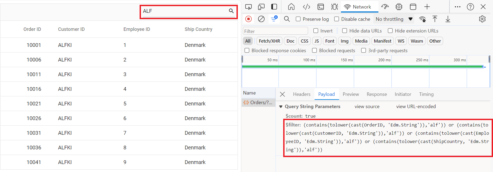
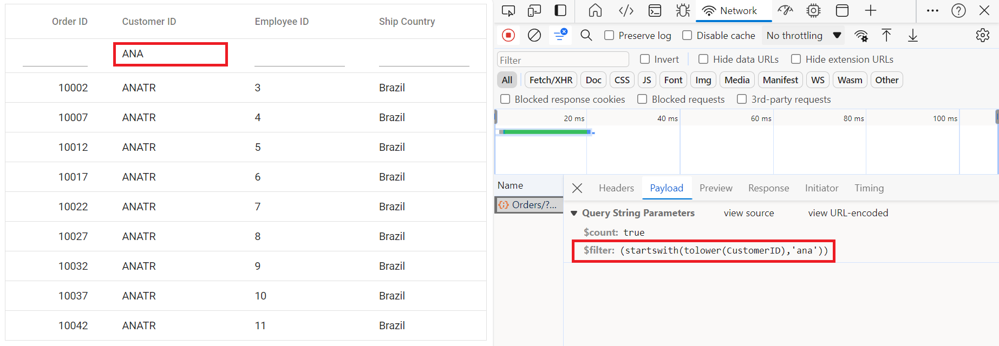
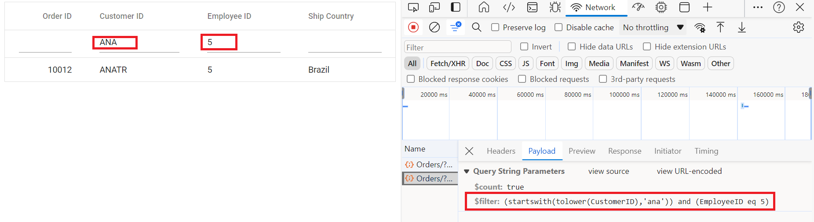
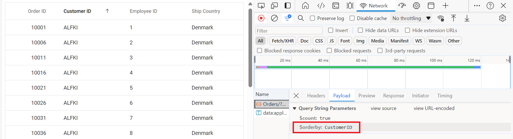
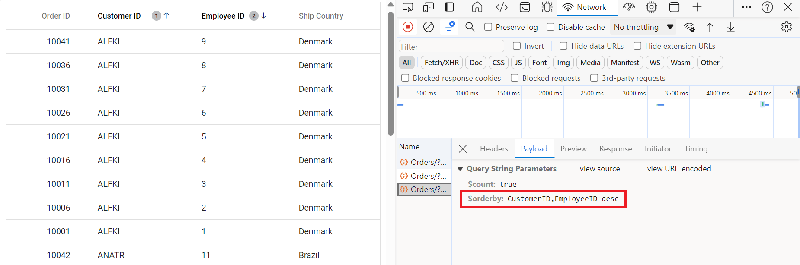
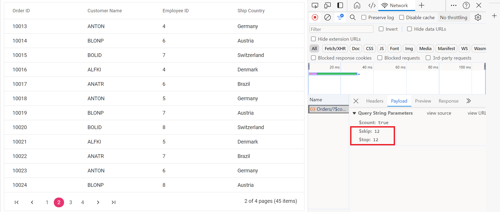
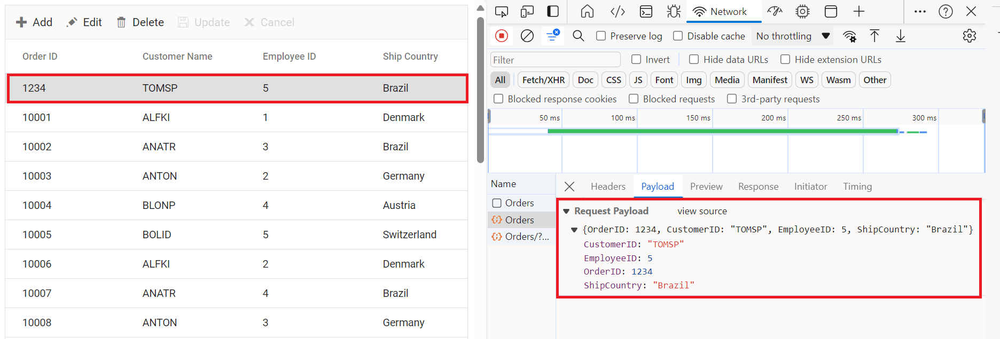
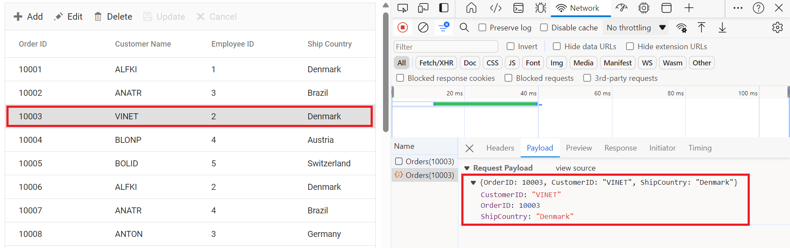
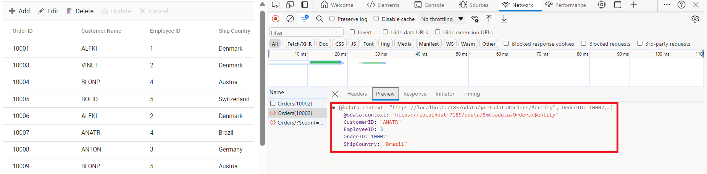

# ODataV4Adaptor in Syncfusion Angular Grid Component

The `ODataV4Adaptor` in the Syncfusion Angular Grid Component allows seamless integration of the Angular Grid with OData v4 services, enabling efficient data fetching and manipulation. This guide provides detailed instructions on binding data and performing CRUD (Create, Read, Update, Delete) actions using the `ODataV4Adaptor` in your Syncfusion Angular Grid Component.

## Creating an OData service

To configure a server with Syncfusion Angular Grid, you need to follow the below steps:

**1. Project Creation:**

Open Visual Studio and create an Angular and ASP.NET Core project named **ODataV4Adaptor**. To create an Angular and ASP.NET Core application, follow the documentation [link](https://learn.microsoft.com/en-us/visualstudio/javascript/tutorial-asp-net-core-with-angular?view=vs-2022) for detailed steps.

**2. Install NuGet Packages**

Using the NuGet package manager in Visual Studio (Tools → NuGet Package Manager → Manage NuGet Packages for Solution), install the `Microsoft.AspNetCore.OData` NuGet package.

**3. Model Class Creation:**

Create a model class named **OrdersDetails.cs** in the server-side **Models** folder to represent the order data.




using System.ComponentModel.DataAnnotations;

namespace ODataV4Adaptor.Server.Models
{
 public class OrdersDetails
    {
        public static List<OrdersDetails> order = new List<OrdersDetails>();
        public OrdersDetails()
        {

        }
        public OrdersDetails(
        int OrderID, string CustomerId, int EmployeeId, string ShipCountry)
        {
            this.OrderID = OrderID;
            this.CustomerID = CustomerId;
            this.EmployeeID = EmployeeId;
            this.ShipCountry = ShipCountry;
        }

        public static List<OrdersDetails> GetAllRecords()
        {
            if (order.Count() == 0)
            {
                int code = 10000;
                for (int i = 1; i < 10; i++)
                {
                    order.Add(new OrdersDetails(code + 1, "ALFKI", i + 0,  "Denmark"));
                    order.Add(new OrdersDetails(code + 2, "ANATR", i + 2, "Brazil"));
                    order.Add(new OrdersDetails(code + 3, "ANTON", i + 1, "Germany"));
                    order.Add(new OrdersDetails(code + 4, "BLONP", i + 3, "Austria"));
                    order.Add(new OrdersDetails(code + 5, "BOLID", i + 4, "Switzerland"));
                    code += 5;
                }
            }
            return order;
        }
        [Key]
        public int? OrderID { get; set; }
        public string? CustomerID { get; set; }
        public int? EmployeeID { get; set; }
        public string? ShipCountry { get; set; }
    }
}




**4. Build the Entity Data Model**

To construct the Entity Data Model for your OData service, utilize the `ODataConventionModelBuilder` to define the model's structure. Start by creating an instance of the `ODataConventionModelBuilder`, then register the entity set **Orders** using the `EntitySet<T>` method, where `OrdersDetails` represents the CLR type containing order details. 

```cs
// Create an ODataConventionModelBuilder to build the OData model
var modelBuilder = new ODataConventionModelBuilder();

// Register the "Orders" entity set with the OData model builder
modelBuilder.EntitySet<OrdersDetails>("Orders");
```

**5. Register the OData Services**

Once the Entity Data Model is built, you need to register the OData services in your ASP.NET Core application. Here's how:

```cs
// Add controllers with OData support to the service collection
builder.Services.AddControllers().AddOData(
    options => options
        .Count()
        .AddRouteComponents("odata", modelBuilder.GetEdmModel()));
```
**6. Add controllers**

Finally, add controllers to expose the OData endpoints. Here's an example:

```cs
using Microsoft.AspNetCore.Mvc;
using Microsoft.AspNetCore.OData.Query;
using ODataV4Adaptor.Server.Models;

namespace ODataV4Adaptor.Server.Controllers
{
    [Route("[controller]")]
    [ApiController]
    public class OrdersController : ControllerBase
    {
        /// <summary>
        /// Retrieves all orders.
        /// </summary>
        /// <returns>The collection of orders.</returns>
        [HttpGet]
        [EnableQuery]
        public IActionResult Get()
        {
            var data = OrdersDetails.GetAllRecords().AsQueryable();
            return Ok(data);
        }
    }
}
```
**4. Run the Application:**

Run the application in Visual Studio. It will be accessible on a URL like **https://localhost:xxxx**. 

After running the application, you can verify that the server-side API controller is successfully returning the order data in the URL(https://localhost:xxxx/odata/Orders). Here **xxxx** denotes the port number.

## Connecting Syncfusion Angular Grid to an OData service

To integrate the Syncfusion Grid component into your Angular and ASP.NET Core project using Visual Studio, follow the below steps:

**1: Install Syncfusion Package**

Open your terminal in the project's client folder and install the required Syncfusion packages using npm:

```bash
npm install @syncfusion/ej2-angular-grids --save
npm install @syncfusion/ej2-data --save
```

**2: Import Grid Module**

In the `app.module.ts` file, import the **GridModule** from the `@syncfusion/ej2-angular-grids` package:





import { GridModule } from '@syncfusion/ej2-angular-grids';

@NgModule({
  imports: [
    // Other imports...
    GridModule,
  ],
})
export class AppModule { }





**Step 3: Adding CSS reference**

Include the necessary CSS files in your `styles.css` file to style the Syncfusion Angular component:




@import '../node_modules/@syncfusion/ej2-base/styles/material.css';
@import '../node_modules/@syncfusion/ej2-buttons/styles/material.css';
@import '../node_modules/@syncfusion/ej2-calendars/styles/material.css';
@import '../node_modules/@syncfusion/ej2-dropdowns/styles/material.css';
@import '../node_modules/@syncfusion/ej2-inputs/styles/material.css';
@import '../node_modules/@syncfusion/ej2-navigations/styles/material.css';
@import '../node_modules/@syncfusion/ej2-popups/styles/material.css';
@import '../node_modules/@syncfusion/ej2-splitbuttons/styles/material.css';
@import '../node_modules/@syncfusion/ej2-angular-grids/styles/material.css';




**Step 4: Adding Syncfusion Component**

In your component file (e.g., app.component.ts), import `DataManager` and `ODataV4Adaptor` from `@syncfusion/ej2-data`. Create a `DataManager` instance specifying the URL of your API endpoint(https:localhost:xxxx/odata/Orders) using the `url` property and set the adaptor `ODataV4Adaptor`.



import { Component, ViewChild } from '@angular/core';
import { DataManager, ODataV4Adaptor } from '@syncfusion/ej2-data';
import { GridComponent } from '@syncfusion/ej2-angular-grids';

@Component({
  selector: 'app-root',
  templateUrl: './app.component.html',
})
export class AppComponent {
  public data?: DataManager;

  @ViewChild('grid')
  public grid?: GridComponent;

  ngOnInit(): void {
    this.data = new DataManager({
      url:'https://localhost:xxxx/odata/Orders', // Here xxxx represents the port number
      adaptor: new ODataV4Adaptor()
    });
  }
}


<ejs-grid #grid [dataSource]='data'>
  <e-columns>
    <e-column field='OrderID' headerText='Order ID' width='120' textAlign='Right' isPrimaryKey="true"></e-column>
    <e-column field='CustomerID' headerText='Customer ID' width='160'></e-column>
    <e-column field='EmployeeID' headerText='Employee ID' width='150'></e-column>
    <e-column field='ShipCountry' headerText='Ship Country' width='150'></e-column>
  </e-columns>
</ejs-grid>



> Replace https://localhost:xxxx/odata/Orders with the actual **URL** of your API endpoint that provides the data in a consumable format (e.g., JSON).

Run the application in Visual Studio. It will be accessible on a URL like **https://localhost:xxxx**.

> Ensure your API service is configured to handle CORS (Cross-Origin Resource Sharing) if necessary.
  ```cs
  [program.cs]
  builder.Services.AddCors(options =>
  {
    options.AddDefaultPolicy(builder =>
    {
      builder.AllowAnyOrigin().AllowAnyMethod().AllowAnyHeader();
    });
  });
  var app = builder.Build();
  app.UseCors();
  ```

## Handling searching operation

To enable search operations in your web application using OData, you first need to configure the OData support in your service collection. This involves adding the `Filter` method within the OData setup, allowing you to filter data based on specified criteria. Once enabled, clients can utilize the **$filter** query option in their requests to search for specific data entries.



// Create a new instance of the web application builder
var builder = WebApplication.CreateBuilder(args);

// Create an ODataConventionModelBuilder to build the OData model
var modelBuilder = new ODataConventionModelBuilder();

// Register the "Orders" entity set with the OData model builder
modelBuilder.EntitySet<OrdersDetails>("Orders");

// Add services to the container.

// Add controllers with OData support to the service collection
builder.Services.AddControllers().AddOData(
    options => options
        .Count()
        .Filter() //searching
        .AddRouteComponents("odata", modelBuilder.GetEdmModel()));


import { Component, ViewChild } from '@angular/core';
import { GridComponent } from '@syncfusion/ej2-angular-grids';
import { DataManager, ODataV4Adaptor } from '@syncfusion/ej2-data';

@Component({
  selector: 'app-root',
  templateUrl: './app.component.html'
})
export class AppComponent {
  @ViewChild('grid')
  public grid?: GridComponent;
  public data?: DataManager;
  public toolbar?: ToolbarItems[];

  ngOnInit(): void {
    this.data = new DataManager({
      url: 'https://localhost:xxxx/odata/Orders',
      adaptor: new ODataV4Adaptor()
    });
  }
  this.toolbar = ['Search'];
}


<ejs-grid #grid [dataSource]='data' [toolbar]='toolbar'>
  <e-columns>
    <e-column field='OrderID' headerText='Order ID' isPrimaryKey=true width='150'></e-column>
    <e-column field='CustomerID' headerText='Customer Name' width='150'></e-column>
    <e-column field='EmployeeID' headerText='Employee ID' width='150'></e-column>
    <e-column field='ShipCountry' headerText='Ship Country' width='150'></e-column>
  </e-columns>
</ejs-grid>


import { HttpClientModule } from '@angular/common/http';
import { NgModule } from '@angular/core';
import { BrowserModule } from '@angular/platform-browser';

import { AppRoutingModule } from './app-routing.module';
import { AppComponent } from './app.component';
import { GridModule, ToolbarService } from '@syncfusion/ej2-angular-grids';

@NgModule({
  declarations: [
    AppComponent
  ],
  imports: [
    BrowserModule, HttpClientModule,
    AppRoutingModule,
    GridModule
  ],
  providers: [ToolbarService],
  bootstrap: [AppComponent]
})
export class AppModule { }






## Handling filtering operation

To enable filter operations in your web application using OData, you first need to configure the OData support in your service collection. This involves adding the `Filter` method within the OData setup, allowing you to filter data based on specified criteria. Once enabled, clients can utilize the **$filter** query option in your requests to filter for specific data entries.



// Create a new instance of the web application builder
var builder = WebApplication.CreateBuilder(args);

// Create an ODataConventionModelBuilder to build the OData model
var modelBuilder = new ODataConventionModelBuilder();

// Register the "Orders" entity set with the OData model builder
modelBuilder.EntitySet<OrdersDetails>("Orders");

// Add services to the container.

// Add controllers with OData support to the service collection
builder.Services.AddControllers().AddOData(
    options => options
        .Count()
        .Filter() // filtering
        .AddRouteComponents("odata", modelBuilder.GetEdmModel()));


import { Component, ViewChild } from '@angular/core';
import { DataManager, ODataV4Adaptor } from '@syncfusion/ej2-data';
import { GridComponent } from '@syncfusion/ej2-angular-grids';

@Component({
  selector: 'app-root',
  templateUrl: './app.component.html',
})
export class AppComponent {
  public data?: DataManager;

  @ViewChild('grid')
  public grid?: GridComponent;

  ngOnInit(): void {
    this.data = new DataManager({
      url: 'https://localhost:xxxx/odata/Orders', // Replace your hosted link
      adaptor: new ODataV4Adaptor()
    });
  }
}



<ejs-grid #grid [dataSource]='data' allowFiltering="true" >
  <e-columns>
    <e-column field='OrderID' headerText='Order ID' isPrimaryKey=true width='150'></e-column>
    <e-column field='CustomerID' headerText='Customer Name' width='150'></e-column>
    <e-column field='EmployeeID' headerText='Employee ID' width='150'></e-column>
    <e-column field='ShipCountry' headerText='Ship Country' width='150'></e-column>
  </e-columns>
</ejs-grid>


import { HttpClientModule } from '@angular/common/http';
import { NgModule } from '@angular/core';
import { BrowserModule } from '@angular/platform-browser';

import { AppRoutingModule } from './app-routing.module';
import { AppComponent } from './app.component';
import { FilterService, GridModule } from '@syncfusion/ej2-angular-grids';

@NgModule({
  declarations: [
    AppComponent
  ],
  imports: [
    BrowserModule, HttpClientModule,
    AppRoutingModule,
    GridModule
  ],
  providers: [FilterService],
  bootstrap: [AppComponent]
})
export class AppModule { }




Single column filtering

Multi column filtering


## Handling sorting operation

To enable sorting operations in your web application using OData, you first need to configure the OData support in your service collection. This involves adding the `OrderBy` method within the OData setup, allowing you to sort data based on specified criteria. Once enabled, clients can utilize the **$orderby** query option in their requests to sort data entries according to desired attributes.



// Create a new instance of the web application builder
var builder = WebApplication.CreateBuilder(args);

// Create an ODataConventionModelBuilder to build the OData model
var modelBuilder = new ODataConventionModelBuilder();

// Register the "Orders" entity set with the OData model builder
modelBuilder.EntitySet<OrdersDetails>("Orders");

// Add services to the container.

// Add controllers with OData support to the service collection
builder.Services.AddControllers().AddOData(
    options => options
        .Count()
        .OrderBy() // sorting
        .AddRouteComponents("odata", modelBuilder.GetEdmModel()));


import { Component, ViewChild } from '@angular/core';
import { DataManager, ODataV4Adaptor } from '@syncfusion/ej2-data';
import { GridComponent } from '@syncfusion/ej2-angular-grids';

@Component({
  selector: 'app-root',
  templateUrl: './app.component.html',
})
export class AppComponent {
  public data?: DataManager;

  @ViewChild('grid')
  public grid?: GridComponent;

  ngOnInit(): void {
    this.data = new DataManager({
      url: 'https://localhost:xxxx/odata/Orders', // Replace your hosted link
      adaptor: new ODataV4Adaptor()
    });
  }
}



<ejs-grid #grid [dataSource]='data' allowSorting="true" >
  <e-columns>
    <e-column field='OrderID' headerText='Order ID' isPrimaryKey=true width='150'></e-column>
    <e-column field='CustomerID' headerText='Customer Name' width='150'></e-column>
    <e-column field='EmployeeID' headerText='Employee ID' width='150'></e-column>
    <e-column field='ShipCountry' headerText='Ship Country' width='150'></e-column>
  </e-columns>
</ejs-grid>


import { HttpClientModule } from '@angular/common/http';
import { NgModule } from '@angular/core';
import { BrowserModule } from '@angular/platform-browser';

import { AppRoutingModule } from './app-routing.module';
import { AppComponent } from './app.component';
import { SortService, GridModule } from '@syncfusion/ej2-angular-grids';

@NgModule({
  declarations: [
    AppComponent
  ],
  imports: [
    BrowserModule, HttpClientModule,
    AppRoutingModule,
    GridModule
  ],
  providers: [SortService],
  bootstrap: [AppComponent]
})
export class AppModule { }




*Single column sorting*



*Multi column sorting*



## Handling paging operation

To implement paging operations in your web application using OData, you can utilize the `SetMaxTop` method within your OData setup to limit the maximum number of records that can be returned per request. While you configure the maximum limit, clients can utilize the **$skip** and **$top** query options in their requests to specify the number of records to skip and the number of records to take, respectively. 




// Create a new instance of the web application builder
var builder = WebApplication.CreateBuilder(args);

// Create an ODataConventionModelBuilder to build the OData model
var modelBuilder = new ODataConventionModelBuilder();

// Register the "Orders" entity set with the OData model builder
modelBuilder.EntitySet<OrdersDetails>("Orders");

// Add services to the container.

// Add controllers with OData support to the service collection

var recordCount= OrdersDetails.GetAllRecords().Count;

builder.Services.AddControllers().AddOData(
    options => options
    .Count()
    .SetMaxTop(recordCount)
    .AddRouteComponents(
        "odata",
        modelBuilder.GetEdmModel()));



import { Component, ViewChild } from '@angular/core';
import { DataManager, ODataV4Adaptor } from '@syncfusion/ej2-data';
import { GridComponent } from '@syncfusion/ej2-angular-grids';

@Component({
  selector: 'app-root',
  templateUrl: './app.component.html',
})
export class AppComponent {
  public data?: DataManager;

  @ViewChild('grid')
  public grid?: GridComponent;

  ngOnInit(): void {
    this.data = new DataManager({
      url: 'https://localhost:xxxx/odata/Orders', // Replace your hosted link
      adaptor: new ODataV4Adaptor()
    });
  }
}



<ejs-grid #grid [dataSource]='data' allowPaging="true" >
  <e-columns>
    <e-column field='OrderID' headerText='Order ID' isPrimaryKey=true width='150'></e-column>
    <e-column field='CustomerID' headerText='Customer Name' width='150'></e-column>
    <e-column field='EmployeeID' headerText='Employee ID' width='150'></e-column>
    <e-column field='ShipCountry' headerText='Ship Country' width='150'></e-column>
  </e-columns>
</ejs-grid>


import { HttpClientModule } from '@angular/common/http';
import { NgModule } from '@angular/core';
import { BrowserModule } from '@angular/platform-browser';

import { AppRoutingModule } from './app-routing.module';
import { AppComponent } from './app.component';
import { GridModule, PageService } from '@syncfusion/ej2-angular-grids';

@NgModule({
  declarations: [
    AppComponent
  ],
  imports: [
    BrowserModule, HttpClientModule,
    AppRoutingModule,
    GridModule
  ],
  providers: [PageService],
  bootstrap: [AppComponent]
})
export class AppModule { }






## Handling CRUD operations

To manage CRUD (Create, Read, Update, Delete) operations using the ODataV4Adaptor, follow the provided guide for configuring the Syncfusion Grid for [editing](https://ej2.syncfusion.com/angular/documentation/grid/editing/edit) and utilize the sample implementation of the `OrdersController` in your server application. This controller handles HTTP requests for CRUD operations such as GET, POST, PATCH, and DELETE.

To enable CRUD operations in the Syncfusion Grid component within an Angular application, follow the below steps:



import { Component, ViewChild } from '@angular/core';
import { GridComponent, ToolbarItems, EditSettingsModel } from '@syncfusion/ej2-angular-grids';
import { DataManager, ODataV4Adaptor } from '@syncfusion/ej2-data';

@Component({
  selector: 'app-root',
  templateUrl: './app.component.html'
})
export class AppComponent {
  @ViewChild('grid')
  public grid?: GridComponent;
  public data?: DataManager;
  public editSettings?: EditSettingsModel;
  public toolbar?: ToolbarItems[];

  ngOnInit(): void {
    this.data = new DataManager({
      url: 'https://localhost:xxxx/odata/Orders', // xxxx denotes port number
      adaptor: new ODataV4Adaptor()
    });

    this.editSettings = { allowEditing: true, allowAdding: true, allowDeleting: true, mode: 'Normal' };
    this.toolbar = ['Add', 'Edit', 'Delete', 'Update', 'Cancel', 'Search'];
  }
}


<ejs-grid #grid [dataSource]='data' [editSettings]="editSettings" [toolbar]="toolbar">
  <e-columns>
    <e-column field='OrderID' headerText='Order ID' isPrimaryKey=true width='150'></e-column>
    <e-column field='CustomerID' headerText='Customer Name' width='150'></e-column>
    <e-column field='EmployeeID' headerText='Employee ID' width='150'></e-column>
    <e-column field='ShipCountry' headerText='Ship Country' width='150'></e-column>
  </e-columns>
</ejs-grid>


import { HttpClientModule } from '@angular/common/http';
import { NgModule } from '@angular/core';
import { BrowserModule } from '@angular/platform-browser';

import { AppRoutingModule } from './app-routing.module';
import { AppComponent } from './app.component';
import { EditService, GridModule, ToolbarService } from '@syncfusion/ej2-angular-grids';

@NgModule({
  declarations: [
    AppComponent
  ],
  imports: [
    BrowserModule, HttpClientModule,
    AppRoutingModule,
    GridModule
  ],
  providers: [EditService, ToolbarService],
  bootstrap: [AppComponent]
})
export class AppModule { }




> Normal/Inline editing is the default edit [mode](https://ej2.syncfusion.com/angular/documentation/api/grid/editSettings/#mode) for the Grid component. To enable CRUD operations, ensure that the [isPrimaryKey](https://ej2.syncfusion.com/angular/documentation/api/grid/column/#isprimarykey) property is set to **true** for a specific Grid column, ensuring that its value is unique.

**Insert Record**

To insert a new record into your Syncfusion Grid, you can utilize the `HttpPost` method in your server application. Below is a sample implementation of inserting a record using the **OrdersController**:

```cs
/// <summary>
/// Inserts a new order to the collection.
/// </summary>
/// <param name="addRecord">The order to be inserted.</param>
/// <returns>It returns the newly inserted record detail.</returns>
[HttpPost]
[EnableQuery]
public IActionResult Post([FromBody] OrdersDetails addRecord)
{
    if (addRecord == null)
    {
      return BadRequest("Null order");
    }
    OrdersDetails.GetAllRecords().Insert(0, addRecord);
    return Json(addRecord);
}
```



**Update Record**

Updating a record in the Syncfusion Grid can be achieved by utilizing the `HttpPatch` method in your controller. Here's a sample implementation of updating a record:

```cs
/// <summary>
/// Updates an existing order.
/// </summary>
/// <param name="key">The ID of the order to update.</param>
/// <param name="updateRecord">The updated order details.</param>
/// <returns>It returns the updated order details.</returns>
[HttpPatch("{key}")]
public IActionResult Patch(int key, [FromBody] OrdersDetails updateRecord)
{
    if (updateRecord == null)
    {
        return BadRequest("No records");
    }
    var existingOrder = OrdersDetails.GetAllRecords().FirstOrDefault(order => order.OrderID == key);
    if (existingOrder != null)
    {
        // If the order exists, update its properties
        existingOrder.CustomerID = updateRecord.CustomerID ?? existingOrder.CustomerID;
        existingOrder.EmployeeID = updateRecord.EmployeeID ?? existingOrder.EmployeeID;
        existingOrder.ShipCountry = updateRecord.ShipCountry ?? existingOrder.ShipCountry;
    }
    return Json(updateRecord);
}
```


**Delete Record**

To delete a record from your Syncfusion Grid, you can utilize the `HttpDelete` method in your controller. Below is a sample implementation:

```cs
/// <summary>
/// Deletes an order.
/// </summary>
/// <param name="key">The ID of the order to delete.</param>
/// <returns>It returns the deleted record detail</returns>
[HttpDelete("{key}")]
public IActionResult Delete(int key)
{
    var deleteRecord = OrdersDetails.GetAllRecords().FirstOrDefault(order => order.OrderID == key);
    if (deleteRecord != null)
    {
        OrdersDetails.GetAllRecords().Remove(deleteRecord);
    }
    return Json(deleteRecord);
}
```


> You can find the complete sample for the ODataV4Adaptor in [GitHub](https://github.com/SyncfusionExamples/Binding-data-from-remote-service-to-angular-data-grid) link.
