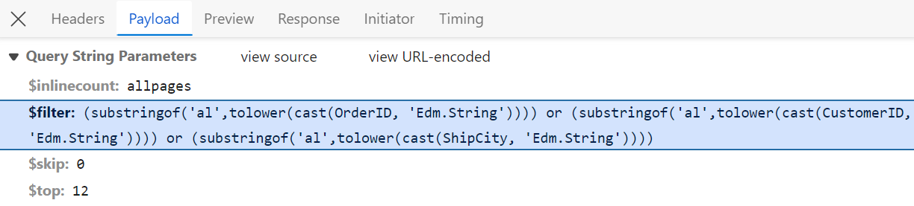
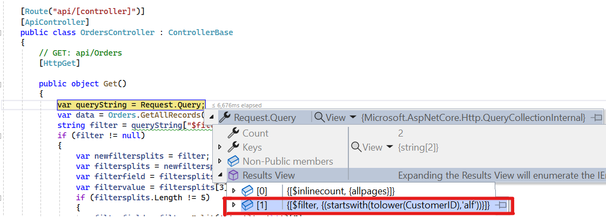
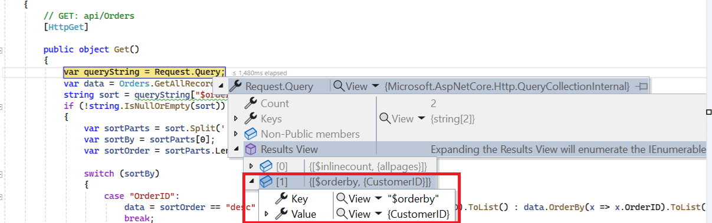
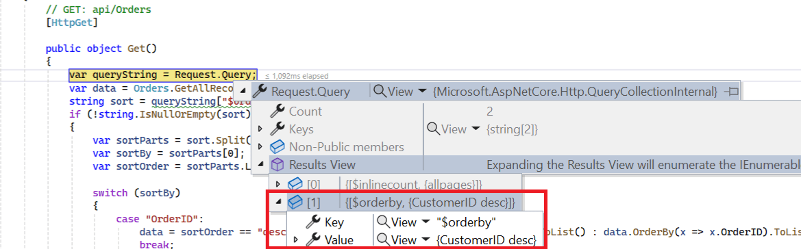
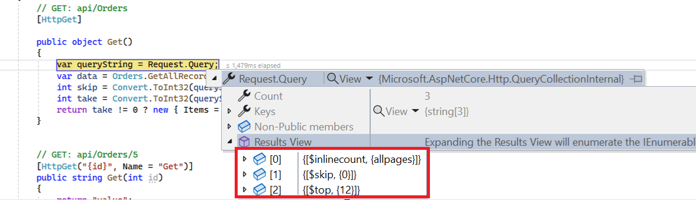
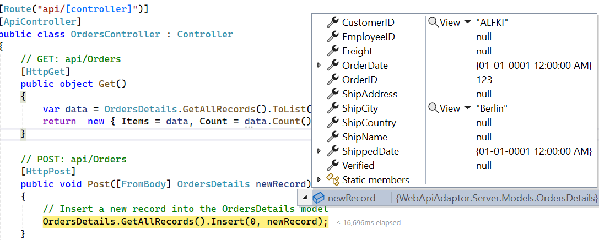

# WebApiAdaptor in Syncfusion Angular Grid Component

The `WebApiAdaptor` extends the `ODataAdaptor` to facilitate seamless communication between the Syncfusion Angular Grid and Web APIs created with OData endpoints. This adaptor enables efficient data retrieval and manipulation by ensuring that OData-formatted queries are properly transmitted with requests to the server endpoint.

The WebApiAdaptor is specifically designed for Web API services that support OData query options, providing automatic query translation and response handling. For successful integration, the target endpoint must be capable of processing OData-formatted queries.

To enable OData query options for a Web API service, refer to the corresponding [documentation](https://learn.microsoft.com/en-us/aspnet/web-api/overview/odata-support-in-aspnet-web-api/supporting-odata-query-options) for detailed configuration instructions.

This section provides step-by-step guidance for retrieving data using the `WebApiAdaptor` and binding it to the Angular Grid component to facilitate data operations and CRUD functionality.

## Creating a Web API service

To configure a server for use with the Syncfusion Angular Grid, follow these steps:

**1. Project Creation:**

Open Visual Studio and create an Angular and ASP.NET Core project named **WebApiAdaptor**. To create an Angular and ASP.NET Core application, follow the [documentation link](https://learn.microsoft.com/en-us/visualstudio/javascript/tutorial-asp-net-core-with-angular?view=vs-2022) for detailed steps.

**2. Model Class Creation:**

Create a model class named `OrdersDetails.cs` in the server-side **Models** folder to represent the order data.




 namespace WebApiAdaptor.Server.Models
 {
 public class OrdersDetails
 {
    public static List<OrdersDetails> order = new List<OrdersDetails>();
    public OrdersDetails()
    {

    }
    public OrdersDetails(
    int OrderID, string CustomerId, int EmployeeId, double Freight, bool Verified,
    DateTime OrderDate, string ShipCity, string ShipName, string ShipCountry,
    DateTime ShippedDate, string ShipAddress)
    {
    this.OrderID = OrderID;
    this.CustomerID = CustomerId;
    this.EmployeeID = EmployeeId;
    this.Freight = Freight;
    this.ShipCity = ShipCity;
    this.Verified = Verified;
    this.OrderDate = OrderDate;
    this.ShipName = ShipName;
    this.ShipCountry = ShipCountry;
    this.ShippedDate = ShippedDate;
    this.ShipAddress = ShipAddress;
    }

    public static List<OrdersDetails> GetAllRecords()
    {
    if (order.Count() == 0)
    {
        int code = 10000;
        for (int i = 1; i < 10; i++)
        {
        order.Add(new OrdersDetails(code + 1, "ALFKI", i + 0, 2.3 * i, false, new DateTime(1991, 05, 15), "Berlin", "Simons bistro", "Denmark", new DateTime(1996, 7, 16), "Kirchgasse 6"));
        order.Add(new OrdersDetails(code + 2, "ANATR", i + 2, 3.3 * i, true, new DateTime(1990, 04, 04), "Madrid", "Queen Cozinha", "Brazil", new DateTime(1996, 9, 11), "Avda. Azteca 123"));
        order.Add(new OrdersDetails(code + 3, "ANTON", i + 1, 4.3 * i, true, new DateTime(1957, 11, 30), "Cholchester", "Frankenversand", "Germany", new DateTime(1996, 10, 7), "Carrera 52 con Ave. Bolívar #65-98 Llano Largo"));
        order.Add(new OrdersDetails(code + 4, "BLONP", i + 3, 5.3 * i, false, new DateTime(1930, 10, 22), "Marseille", "Ernst Handel", "Austria", new DateTime(1996, 12, 30), "Magazinweg 7"));
        order.Add(new OrdersDetails(code + 5, "BOLID", i + 4, 6.3 * i, true, new DateTime(1953, 02, 18), "Tsawassen", "Hanari Carnes", "Switzerland", new DateTime(1997, 12, 3), "1029 - 12th Ave. S."));
        code += 5;
        }
    }
    return order;
    }

    public int? OrderID { get; set; }
    public string? CustomerID { get; set; }
    public int? EmployeeID { get; set; }
    public double? Freight { get; set; }
    public string? ShipCity { get; set; }
    public bool? Verified { get; set; }
    public DateTime OrderDate { get; set; }
    public string? ShipName { get; set; }
    public string? ShipCountry { get; set; }
    public DateTime ShippedDate { get; set; }
    public string? ShipAddress { get; set; }
 }
}




**3. API Controller Creation:**

Create a file named `OrdersController.cs` under the **Controllers** folder. This controller handles data communication with the Angular Grid component. Implement the **Get** method in the controller to return data in JSON format, including the **Items** and **Count** properties required by the `WebApiAdaptor`.




using Microsoft.AspNetCore.Http;
using Microsoft.AspNetCore.Mvc;
using WebApiAdaptor.Server.Models;

namespace WebApiAdaptor.Server.Controllers
{
  [Route("api/[controller]")]
  [ApiController]
  public class OrdersController : ControllerBase
  {
    [HttpGet]
    public object Get()
    {
    var data = OrdersDetails.GetAllRecords().ToList();
    return  new { Items = data, Count = data.Count() };
    }
  }
}




**4. Run the Application:**

Run the application in Visual Studio. The application will be accessible on a URL like **https://localhost:xxxx**. 

After running the application, verify that the server-side API controller successfully returns the order data by navigating to the URL (https://localhost:xxxx/api/Orders). Here **xxxx** denotes the port number.


## Connecting Syncfusion Angular Grid to an API service

To integrate the Syncfusion Grid component into your Angular and ASP.NET Core project using Visual Studio, follow these steps:

**1. Install Syncfusion Packages**

Open your terminal in the project's root directory of the client folder and install the required Syncfusion packages using npm:

```bash
npm install @syncfusion/ej2-angular-grids --save
npm install @syncfusion/ej2-data --save
```

**2. Import Grid Module**

In the `app.module.ts` file, import the **GridModule** from the `@syncfusion/ej2-angular-grids` package and configure it in the module:




import { NgModule } from '@angular/core';
import { BrowserModule } from '@angular/platform-browser';
import { GridModule } from '@syncfusion/ej2-angular-grids';

import { AppComponent } from './app.component';

@NgModule({
  declarations: [
    AppComponent
  ],
  imports: [
    BrowserModule,
    GridModule
  ],
  providers: [],
  bootstrap: [AppComponent]
})
export class AppModule { }




**3. Adding CSS Reference**

Include the necessary CSS files in your `styles.css` file to style the Syncfusion Angular components:




@import '../node_modules/@syncfusion/ej2-base/styles/material3.css';
@import '../node_modules/@syncfusion/ej2-buttons/styles/material3.css';
@import '../node_modules/@syncfusion/ej2-calendars/styles/material3.css';
@import '../node_modules/@syncfusion/ej2-dropdowns/styles/material3.css';
@import '../node_modules/@syncfusion/ej2-inputs/styles/material3.css';
@import '../node_modules/@syncfusion/ej2-navigations/styles/material3.css';
@import '../node_modules/@syncfusion/ej2-popups/styles/material3.css';
@import '../node_modules/@syncfusion/ej2-splitbuttons/styles/material3.css';
@import '../node_modules/@syncfusion/ej2-angular-grids/styles/material3.css';




**4. Adding Syncfusion Component**

In your component file (e.g., app.component.ts), import `DataManager` and `WebApiAdaptor` from `@syncfusion/ej2-data`. Create a `DataManager` instance specifying the URL of your API endpoint (https:localhost:xxxx/api/Orders) using the `url` property and set the adaptor to `WebApiAdaptor`.




import { Component, ViewChild } from '@angular/core';
import { DataManager, WebApiAdaptor } from '@syncfusion/ej2-data';
import { GridComponent } from '@syncfusion/ej2-angular-grids';

@Component({
  selector: 'app-root',
  templateUrl: './app.component.html',
})
export class AppComponent {
  public data?: DataManager;

  @ViewChild('grid')
  public grid?: GridComponent;

  ngOnInit(): void {
    this.data = new DataManager({
      url:'https://localhost:xxxx/api/Orders', // Here xxxx represents the port number
      adaptor: new WebApiAdaptor()
    });
  }
}




<ejs-grid #grid [dataSource]='data'>
  <e-columns>
    <e-column field='OrderID' headerText='Order ID' width='120' textAlign='Right' isPrimaryKey="true"></e-column>
    <e-column field='CustomerID' headerText='Customer ID' width='160'></e-column>
    <e-column field='ShipCity' headerText='Ship City' width='150'></e-column>
    <e-column field='ShipCountry' headerText='Ship Country' width='150'></e-column>
  </e-columns>
</ejs-grid>




> Replace https://localhost:xxxx/api/Orders with the actual URL of your API endpoint that provides the data in a consumable format (e.g., JSON).

Run the application in Visual Studio. The application will be accessible on a URL like **https://localhost:xxxx**.

> Ensure your API service is configured to handle CORS (Cross-Origin Resource Sharing) if necessary.
  ```cs
  [program.cs]
  builder.Services.AddCors(options =>
  {
    options.AddDefaultPolicy(builder =>
    {
      builder.AllowAnyOrigin().AllowAnyMethod().AllowAnyHeader();
    });
  });
  var app = builder.Build();
  app.UseCors();
  ```
 
> You can find the complete sample for the WebApiAdaptor in the [GitHub](https://github.com/SyncfusionExamples/Performing-data-and-CRUD-operations-in-ej2-angular-grid-using-WebApi-Adaptor) repository.


## Handling searching operation

To handle search operations, implement search logic on the server side according to the received OData-formatted query.





// GET: api/Orders
[HttpGet]

public object Get()
{
  var queryString = Request.Query;
  var data = OrdersDetails.GetAllRecords().ToList();
  string filter = queryString["$filter"];

  if (filter != null)
  {
    var filters = filter.Split(new string[] { " and " }, StringSplitOptions.RemoveEmptyEntries);
    foreach (var filterItem in filters)
    {
      if (filterItem.Contains("substringof"))
      {
        // Perform Searching
        var searchParts = filterItem.Split('(', ')', '\'');
        var searchValue = searchParts[3];

        // Apply the search value to all searchable fields
        data = data.Where(cust =>
          cust.OrderID.ToString().Contains(searchValue) ||
          cust.CustomerID.ToLower().Contains(searchValue) ||
          cust.ShipCity.ToLower().Contains(searchValue)
        // Add conditions for other searchable fields as needed
        ).ToList();
      }
      else
      {
        // Perform filtering
      }
    }
  }
  return new { Items = data, Count = data.Count() };
}


import { Component, ViewChild } from '@angular/core';
import { GridComponent, ToolbarItems } from '@syncfusion/ej2-angular-grids';
import { DataManager, WebApiAdaptor } from '@syncfusion/ej2-data';

@Component({
  selector: 'app-root',
  templateUrl: './app.component.html'
})
export class AppComponent {
  @ViewChild('grid')
  public grid?: GridComponent;
  public data?: DataManager;
  public toolbar?: ToolbarItems[];

  ngOnInit(): void {
    this.data = new DataManager({
      url: 'api/Orders',
      adaptor: new WebApiAdaptor()
    });
    this.toolbar = ['Search'];
  }
}


<ejs-grid #grid [dataSource]='data' [toolbar]='toolbar' height='320'>
  <e-columns>
    <e-column field='OrderID' headerText='Order ID' isPrimaryKey=true width='150'></e-column>
    <e-column field='CustomerID' headerText='Customer Name' width='150'></e-column>
    <e-column field='ShipCity' headerText='ShipCity' width='150' textAlign='Right'></e-column>
    <e-column field='ShipCountry' headerText='Ship Country' width='150'></e-column>
  </e-columns>
</ejs-grid>




## Handling filtering operation

To handle filter operations, ensure that your Web API endpoint supports filtering based on OData-formatted queries. Implement the filtering logic on the server-side as shown in the provided code snippet.






// GET: api/Orders
[HttpGet]

public object Get()
{
  var queryString = Request.Query;
  var data = Orders.GetAllRecords().ToList();
  string filter = queryString["$filter"];
  
  if (filter != null)
  {
    var filters = filter.Split(new string[] { " and " }, StringSplitOptions.RemoveEmptyEntries);
    foreach (var filterItem in filters)
    {
      var filterfield = "";
      var filtervalue = "";
      var filterParts = filterItem.Split('(', ')', '\'');
      if (filterParts.Length != 9)
      {
        var filterValueParts = filterParts[1].Split();
        filterfield = filterValueParts[0];
        filtervalue = filterValueParts[2];
      }
      else
      {
        filterfield = filterParts[3];
        filtervalue = filterParts[5];
      }
      switch (filterfield)
      {
        case "OrderID":
          data = (from cust in data
                where cust.OrderID.ToString() == filtervalue.ToString()
                select cust).ToList();
        break;
        case "CustomerID":
          data = (from cust in data
                where cust.CustomerID.ToLower().StartsWith(filtervalue.ToString())
                select cust).ToList();
        break;
        case "ShipCity":
          data = (from cust in data
                where cust.ShipCity.ToLower().StartsWith(filtervalue.ToString())
                select cust).ToList();
        break;
      }
    }
    return new { Items = data, Count = data.Count() };
  }
}


import { Component, ViewChild } from '@angular/core';
import { DataManager, WebApiAdaptor } from '@syncfusion/ej2-data';
import { GridComponent } from '@syncfusion/ej2-angular-grids';

@Component({
  selector: 'app-root',
  templateUrl: './app.component.html',
})
export class AppComponent {
  public data?: DataManager;

  @ViewChild('grid')
  public grid?: GridComponent;

  ngOnInit(): void {
    this.data = new DataManager({
      url: 'https://localhost:xxxx/api/Orders', // Replace with your hosted link
      adaptor: new WebApiAdaptor()
    });
  }
}



<ejs-grid #grid [dataSource]='data' allowFiltering="true" height="320">
  <e-columns>
    <e-column field='OrderID' headerText='Order ID' isPrimaryKey=true width='150'></e-column>
    <e-column field='CustomerID' headerText='Customer Name' width='150'></e-column>
    <e-column field='ShipCity' headerText='ShipCity' width='150' textAlign='Right'></e-column>
    <e-column field='ShipCountry' headerText='Ship Country' width='150'></e-column>
  </e-columns>
</ejs-grid>




## Handling sorting operation

To handle sorting actions, implement sorting logic on the server-side according to the received OData-formatted query.

***Ascending Sorting***



***Descending Sorting***





// GET: api/Orders
[HttpGet]

public object Get()
{
    var queryString = Request.Query;
    var data = OrdersDetails.GetAllRecords().ToList();
    string sort = queryString["$orderby"];   //sorting     
    if (!string.IsNullOrEmpty(sort))
    {
        var sortConditions = sort.Split(',');
        var orderedData = data.OrderBy(x => 0); // Start with a stable sort
        foreach (var sortCondition in sortConditions)
        {
            var sortParts = sortCondition.Trim().Split(' ');
            var sortBy = sortParts[0];
            var sortOrder = sortParts.Length > 1 && sortParts[1].ToLower() == "desc";
            switch (sortBy)
            {
                case "OrderID":
                    orderedData = sortOrder ? orderedData.ThenByDescending(x => x.OrderID) : orderedData.ThenBy(x => x.OrderID);
                    break;
                case "CustomerID":
                    orderedData = sortOrder ? orderedData.ThenByDescending(x => x.CustomerID) : orderedData.ThenBy(x => x.CustomerID);
                    break;
                case "ShipCity":
                    orderedData = sortOrder ? orderedData.ThenByDescending(x => x.ShipCity) : orderedData.ThenBy(x => x.ShipCity);
                    break;
            }
        }
        data = orderedData.ToList();
    }
    return new { Items = data, Count = data.Count() };
}


import { Component, ViewChild } from '@angular/core';
import { DataManager, WebApiAdaptor } from '@syncfusion/ej2-data';
import { GridComponent } from '@syncfusion/ej2-angular-grids';

@Component({
  selector: 'app-root',
  templateUrl: './app.component.html',
})
export class AppComponent {
  public data?: DataManager;

  @ViewChild('grid')
  public grid?: GridComponent;

  ngOnInit(): void {
    this.data = new DataManager({
      url: 'https://localhost:xxxx/api/Orders', // Replace with your hosted link
      adaptor: new WebApiAdaptor()
    });
  }
}



<ejs-grid #grid [dataSource]='data' allowSorting="true" height="320">
  <e-columns>
    <e-column field='OrderID' headerText='Order ID' isPrimaryKey=true width='150'></e-column>
    <e-column field='CustomerID' headerText='Customer Name' width='150'></e-column>
    <e-column field='ShipCity' headerText='ShipCity' width='150' textAlign='Right'></e-column>
    <e-column field='ShipCountry' headerText='Ship Country' width='150'></e-column>
  </e-columns>
</ejs-grid>




## Handling paging operation

Implement paging logic on the server-side according to the received OData-formatted query. Ensure that the endpoint supports paging based on the specified criteria.






// GET: api/Orders
[HttpGet]

public object Get()
{
    var queryString = Request.Query;
    var data = Orders.GetAllRecords().ToList();
    // Perform Paging operation
    int skip = Convert.ToInt32(queryString["$skip"]);
    int take = Convert.ToInt32(queryString["$top"]);
    return take != 0 ? new { Items = data.Skip(skip).Take(take).ToList(), Count = data.Count() } : new { Items = data, Count = data.Count() };
}


import { Component, ViewChild } from '@angular/core';
import { DataManager, WebApiAdaptor } from '@syncfusion/ej2-data';
import { GridComponent } from '@syncfusion/ej2-angular-grids';

@Component({
  selector: 'app-root',
  templateUrl: './app.component.html',
})
export class AppComponent {
  public data?: DataManager;

  @ViewChild('grid')
  public grid?: GridComponent;

  ngOnInit(): void {
    this.data = new DataManager({
      url: 'https://localhost:xxxx/api/Orders', // Replace with your hosted link
      adaptor: new WebApiAdaptor()
    });
  }
}



<ejs-grid #grid [dataSource]='data' allowPaging="true" height="320">
  <e-columns>
    <e-column field='OrderID' headerText='Order ID' isPrimaryKey=true width='150'></e-column>
    <e-column field='CustomerID' headerText='Customer Name' width='150'></e-column>
    <e-column field='ShipCity' headerText='ShipCity' width='150' textAlign='Right'></e-column>
    <e-column field='ShipCountry' headerText='Ship Country' width='150'></e-column>
  </e-columns>
</ejs-grid>




## Handling CRUD operations

To manage CRUD (Create, Read, Update, Delete) operations using the WebApiAdaptor, follow the provided guide for configuring the Syncfusion Grid for [editing](https://ej2.syncfusion.com/angular/documentation/grid/editing/edit) and utilize the sample implementation of the `OrdersController` in your server application. This controller handles HTTP requests for CRUD operations such as GET, POST, PUT, and DELETE.

To enable CRUD operations in the Syncfusion Grid component within an Angular application, follow these steps:



import { Component, ViewChild } from '@angular/core';
import { GridComponent, ToolbarItems, EditSettingsModel } from '@syncfusion/ej2-angular-grids';
import { DataManager, WebApiAdaptor } from '@syncfusion/ej2-data';

@Component({
  selector: 'app-root',
  templateUrl: './app.component.html'
})
export class AppComponent {
  @ViewChild('grid')
  public grid?: GridComponent;
  public data?: DataManager;
  public editSettings?: EditSettingsModel;
  public toolbar?: ToolbarItems[];

  ngOnInit(): void {
    this.data = new DataManager({
      url: 'https://localhost:xxxx/api/Orders',
      adaptor: new WebApiAdaptor()
    });

    this.editSettings = { allowEditing: true, allowAdding: true, allowDeleting: true, mode: 'Normal' };
    this.toolbar = ['Add', 'Edit', 'Delete', 'Update', 'Cancel', 'Search'];
  }
}


<ejs-grid #grid [dataSource]='data' [editSettings]="editSettings" [toolbar]="toolbar" height="320">
  <e-columns>
    <e-column field='OrderID' headerText='Order ID' isPrimaryKey=true width='150'></e-column>
    <e-column field='CustomerID' headerText='Customer Name' width='150'></e-column>
    <e-column field='ShipCity' headerText='ShipCity' width='150' textAlign='Right'></e-column>
    <e-column field='ShipCountry' headerText='Ship Country' width='150'></e-column>
  </e-columns>
</ejs-grid>




> Normal/Inline editing is the default edit [mode](https://ej2.syncfusion.com/angular/documentation/api/grid/editSettings/#mode) for the Grid component. To enable CRUD operations, ensure that the [isPrimaryKey](https://ej2.syncfusion.com/angular/documentation/api/grid/column/#isprimarykey) property is set to **true** for a specific Grid column, ensuring that its value is unique.

**Insert Record**

To insert a new record into your Syncfusion Grid, utilize the `HttpPost` method in your server application. Below is a sample implementation of inserting a record using the **OrdersController**:



```cs

// POST: api/Orders
[HttpPost]
/// <summary>
/// Inserts a new data item into the data collection.
/// </summary>
/// <param name="newRecord">It holds new record detail which is need to be inserted.</param>
/// <returns>Returns void</returns>
public void Post([FromBody] OrdersDetails newRecord)
{
  // Insert a new record into the OrdersDetails model
  OrdersDetails.GetAllRecords().Insert(0, newRecord);
}
```

**Update Record**

Updating a record in the Syncfusion Grid can be achieved by utilizing the `HttpPut` method in your controller. Here's a sample implementation of updating a record:


```cs

// PUT: api/Orders/5
[HttpPut]
/// <summary>
/// Update a existing data item from the data collection.
/// </summary>
/// <param name="updatedOrder">It holds updated record detail which is need to be updated.</param>
/// <returns>Returns void</returns>
public void Put(int id, [FromBody] OrdersDetails updatedOrder)
{
  // Find the existing order by ID
  var existingOrder = OrdersDetails.GetAllRecords().FirstOrDefault(o => o.OrderID == id);
  if (existingOrder != null)
  {
    // If the order exists, update its properties
    existingOrder.OrderID = updatedOrder.OrderID;
    existingOrder.CustomerID = updatedOrder.CustomerID;
    existingOrder.ShipCity = updatedOrder.ShipCity;
    existingOrder.ShipCountry = updatedOrder.ShipCountry;
  }
}
```

**Delete Record**

To delete a record from your Syncfusion Grid, utilize the `HttpDelete` method in your controller. Below is a sample implementation:


```cs

// DELETE: api/5

[HttpDelete("{id}")]
/// <summary>
/// Remove a specific data item from the data collection.
/// </summary>
/// <param name="key">It holds specific record detail id which is need to be removed.</param>
/// <returns>Returns void</returns>
public void Delete(int key)
{
  // Find the order to remove by ID
  var orderToRemove = OrdersDetails.GetAllRecords().FirstOrDefault(order => order.OrderID == key);
  // If the order exists, remove it
  if (orderToRemove != null)
  {
    OrdersDetails.GetAllRecords().Remove(orderToRemove);
  }
}
```


> You can find the complete sample for the WebApiAdaptor in the [GitHub](https://github.com/SyncfusionExamples/Performing-data-and-CRUD-operations-in-ej2-angular-grid-using-WebAPI-Adaptor) repository.