# WebMethodAdaptor in Syncfusion Angular Grid Component

The [WebMethodAdaptor](https://ej2.syncfusion.com/angular/documentation/data/adaptors#webmethod-adaptor) in the Syncfusion Angular Grid facilitates seamless data binding from remote services using web methods. This adaptor provides efficient communication between client-side applications and server endpoints by encapsulating query parameters within a structured **value** object. Similar to the URL adaptor, the WebMethodAdaptor transmits various DataManager properties including **requiresCounts**, **skip**, **take**, **sorted**, and **where** queries within this **value** container.

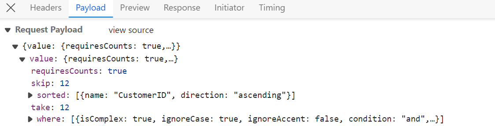

This section provides comprehensive step-by-step guidance for retrieving data using the WebMethodAdaptor and binding it to the Angular Grid component to facilitate data operations and CRUD functionality.

## Creating an API service

To configure a server for use with the Syncfusion Angular Grid, follow these steps:

**1. Project Creation:**

Open Visual Studio and create an Angular and ASP.NET Core project named **WebMethodAdaptor**. To create an Angular and ASP.NET Core application, follow the [documentation link](https://learn.microsoft.com/en-us/visualstudio/javascript/tutorial-asp-net-core-with-angular?view=vs-2022) for detailed steps.

**2. Model Class Creation:**

Create a model class named **OrdersDetails.cs** in the server-side **Models** folder to represent the order data.




 namespace WebMethodAdaptor.Server.Models
 {
 public class OrdersDetails
 {
    public static List<OrdersDetails> order = new List<OrdersDetails>();
    public OrdersDetails()
    {

    }
    public OrdersDetails(
    int OrderID, string CustomerId, int EmployeeId, double Freight, bool Verified,
    DateTime OrderDate, string ShipCity, string ShipName, string ShipCountry,
    DateTime ShippedDate, string ShipAddress)
    {
    this.OrderID = OrderID;
    this.CustomerID = CustomerId;
    this.EmployeeID = EmployeeId;
    this.Freight = Freight;
    this.ShipCity = ShipCity;
    this.Verified = Verified;
    this.OrderDate = OrderDate;
    this.ShipName = ShipName;
    this.ShipCountry = ShipCountry;
    this.ShippedDate = ShippedDate;
    this.ShipAddress = ShipAddress;
    }

    public static List<OrdersDetails> GetAllRecords()
    {
    if (order.Count() == 0)
    {
        int code = 10000;
        for (int i = 1; i < 10; i++)
        {
        order.Add(new OrdersDetails(code + 1, "ALFKI", i + 0, 2.3 * i, false, new DateTime(1991, 05, 15), "Berlin", "Simons bistro", "Denmark", new DateTime(1996, 7, 16), "Kirchgasse 6"));
        order.Add(new OrdersDetails(code + 2, "ANATR", i + 2, 3.3 * i, true, new DateTime(1990, 04, 04), "Madrid", "Queen Cozinha", "Brazil", new DateTime(1996, 9, 11), "Avda. Azteca 123"));
        order.Add(new OrdersDetails(code + 3, "ANTON", i + 1, 4.3 * i, true, new DateTime(1957, 11, 30), "Cholchester", "Frankenversand", "Germany", new DateTime(1996, 10, 7), "Carrera 52 con Ave. Bolívar #65-98 Llano Largo"));
        order.Add(new OrdersDetails(code + 4, "BLONP", i + 3, 5.3 * i, false, new DateTime(1930, 10, 22), "Marseille", "Ernst Handel", "Austria", new DateTime(1996, 12, 30), "Magazinweg 7"));
        order.Add(new OrdersDetails(code + 5, "BOLID", i + 4, 6.3 * i, true, new DateTime(1953, 02, 18), "Tsawassen", "Hanari Carnes", "Switzerland", new DateTime(1997, 12, 3), "1029 - 12th Ave. S."));
        code += 5;
        }
    }
    return order;
    }

    public int? OrderID { get; set; }
    public string? CustomerID { get; set; }
    public int? EmployeeID { get; set; }
    public double? Freight { get; set; }
    public string? ShipCity { get; set; }
    public bool? Verified { get; set; }
    public DateTime OrderDate { get; set; }
    public string? ShipName { get; set; }
    public string? ShipCountry { get; set; }
    public DateTime ShippedDate { get; set; }
    public string? ShipAddress { get; set; }
 }
}




**3. API Controller Creation:**

Create a file named `GridController.cs` under the **Controllers** folder. This controller handles data communication with the Angular Grid component.




using Microsoft.AspNetCore.Http;
using Microsoft.AspNetCore.Mvc;
using WebMethodAdaptor.Server.Models;
using Syncfusion.EJ2.Base;

namespace WebMethodAdaptor.Server.Controllers
{
  [Route("api/[controller]")]
  [ApiController]
  public class GridController : ControllerBase
  {
    
    // method to retrieve data
    [HttpGet]
    [Route("api/[controller]")]
    public List<OrdersDetails> GetOrderData()
    {
        // Retrieve all records and convert to list
        var data = OrdersDetails.GetAllRecords().ToList();
        return data;
    }

     // method to handle incoming data manager requests
    [HttpPost]
    [Route("api/[controller]")]
    public object Post()
    {
        // Retrieve data source and convert to queryable
        IQueryable<OrdersDetails> DataSource = GetOrderData().AsQueryable();

        // Initialize QueryableOperation
        QueryableOperation queryableOperation = new QueryableOperation();

        // Get total record count
        int totalRecordsCount = DataSource.Count();

        // Return result and total record count
        return new { result = DataSource, count = totalRecordsCount };
    }
  }
}




> The **GetOrderData** method retrieves sample order data. You can replace it with your custom logic to fetch data from a database or any other source.

**4. Run the Application:**

Run the application in Visual Studio. The application will be accessible on a URL like **https://localhost:xxxx**. 

After running the application, verify that the server-side API controller successfully returns the order data by navigating to the URL (https://localhost:xxxx/api/Grid). Here **xxxx** denotes the port number.

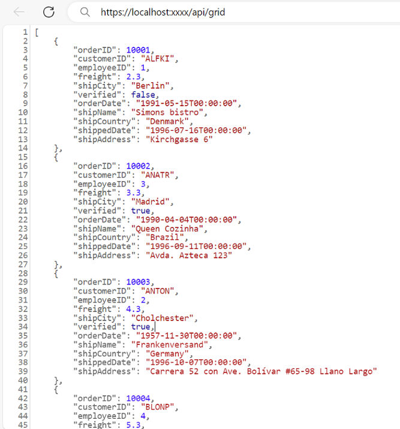

## Connecting Syncfusion Angular Grid to an API service

To integrate the Syncfusion Grid component into your Angular and ASP.NET Core project using Visual Studio, follow these steps:

**1. Install Syncfusion Packages**

Open your terminal in the project's client folder and install the required Syncfusion packages using npm:

```bash
npm install @syncfusion/ej2-angular-grids --save
npm install @syncfusion/ej2-data --save
```

**2. Import Grid Module**

In the `app.module.ts` file, import the **GridModule** from the `@syncfusion/ej2-angular-grids` package and configure it:





import { GridModule } from '@syncfusion/ej2-angular-grids';

@NgModule({
  imports: [
    // Other imports...
    GridModule,
  ],
})
export class AppModule { }





**3. Adding CSS Reference**

Include the necessary CSS files in your `styles.css` file to style the Syncfusion Angular components:




@import '../node_modules/@syncfusion/ej2-base/styles/material.css';
@import '../node_modules/@syncfusion/ej2-buttons/styles/material.css';
@import '../node_modules/@syncfusion/ej2-calendars/styles/material.css';
@import '../node_modules/@syncfusion/ej2-dropdowns/styles/material.css';
@import '../node_modules/@syncfusion/ej2-inputs/styles/material.css';
@import '../node_modules/@syncfusion/ej2-navigations/styles/material.css';
@import '../node_modules/@syncfusion/ej2-popups/styles/material.css';
@import '../node_modules/@syncfusion/ej2-splitbuttons/styles/material.css';
@import '../node_modules/@syncfusion/ej2-angular-grids/styles/material.css';




**4. Adding Syncfusion Component**

In your component file (e.g., app.component.ts), import `DataManager` and `WebMethodAdaptor` from `@syncfusion/ej2-data`. Create a `DataManager` instance specifying the URL of your API endpoint (https:localhost:xxxx/api/Grid) using the `url` property and set the adaptor to `WebMethodAdaptor`.



import { Component, ViewChild } from '@angular/core';
import { DataManager, WebMethodAdaptor } from '@syncfusion/ej2-data';
import { GridComponent } from '@syncfusion/ej2-angular-grids';

@Component({
  selector: 'app-root',
  templateUrl: './app.component.html',
})
export class AppComponent {
  public data?: DataManager;

  @ViewChild('grid')
  public grid?: GridComponent;

  ngOnInit(): void {
    this.data = new DataManager({
      url:'https://localhost:xxxx/api/grid', // Here xxxx represents the port number
      adaptor: new WebMethodAdaptor()
    });
  }
}


<ejs-grid #grid [dataSource]='data'>
  <e-columns>
    <e-column field='OrderID' headerText='Order ID' width='120' textAlign='Right' isPrimaryKey="true"></e-column>
    <e-column field='CustomerID' headerText='Customer ID' width='160'></e-column>
    <e-column field='ShipCity' headerText='Ship City' width='150'></e-column>
    <e-column field='ShipCountry' headerText='Ship Country' width='150'></e-column>
  </e-columns>
</ejs-grid>



> Replace https://localhost:xxxx/api/grid with the actual **URL** of your API endpoint that provides the data in a consumable format (e.g., JSON).

Run the application in Visual Studio. The application will be accessible on a URL like **https://localhost:xxxx**.

> Ensure your API service is configured to handle CORS (Cross-Origin Resource Sharing) if necessary.
  ```cs
  [program.cs]
  builder.Services.AddCors(options =>
  {
    options.AddDefaultPolicy(builder =>
    {
      builder.AllowAnyOrigin().AllowAnyMethod().AllowAnyHeader();
    });
  });
  var app = builder.Build();
  app.UseCors();
  ```

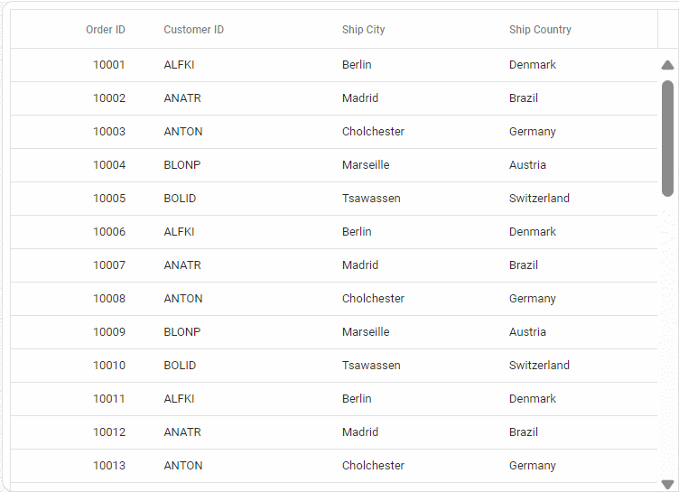

> * The Syncfusion Grid component provides built-in support for handling various data operations such as searching, sorting, filtering, aggregate and paging on the server-side. These operations can be handled using methods such as [PerformSearching](https://help.syncfusion.com/cr/aspnetmvc-js2/Syncfusion.EJ2.Base.QueryableOperation.html#Syncfusion_EJ2_Base_QueryableOperation_PerformSearching__1_System_Linq_IQueryable___0__System_Collections_Generic_List_Syncfusion_EJ2_Base_SearchFilter__), [PerformFiltering](https://help.syncfusion.com/cr/aspnetmvc-js2/Syncfusion.EJ2.Base.QueryableOperation.html#Syncfusion_EJ2_Base_QueryableOperation_PerformFiltering__1_System_Linq_IQueryable___0__System_Collections_Generic_List_Syncfusion_EJ2_Base_WhereFilter__System_String_), [PerformSorting](https://help.syncfusion.com/cr/aspnetmvc-js2/Syncfusion.EJ2.Base.QueryableOperation.html#Syncfusion_EJ2_Base_QueryableOperation_PerformSorting__1_System_Linq_IQueryable___0__System_Collections_Generic_List_Syncfusion_EJ2_Base_Sort__), [PerformTake](https://help.syncfusion.com/cr/aspnetmvc-js2/Syncfusion.EJ2.Base.QueryableOperation.html#Syncfusion_EJ2_Base_QueryableOperation_PerformTake__1_System_Linq_IQueryable___0__System_Int32_) and [PerformSkip](https://help.syncfusion.com/cr/aspnetmvc-js2/Syncfusion.EJ2.Base.QueryableOperation.html#Syncfusion_EJ2_Base_QueryableOperation_PerformSkip__1_System_Linq_IQueryable___0__System_Int32_) available in the `Syncfusion.EJ2.AspNet.Core` package. Let's explore how to manage these data operations using the `WebMethodAdaptor`.
> * In an API service project, add `Syncfusion.EJ2.AspNet.Core` by opening the NuGet package manager in Visual Studio (Tools → NuGet Package Manager → Manage NuGet Packages for Solution), search and install it.
> * To access [DataManagerRequest](https://help.syncfusion.com/cr/aspnetmvc-js2/Syncfusion.EJ2.Base.DataManagerRequest.html) and [QueryableOperation](https://help.syncfusion.com/cr/aspnetmvc-js2/Syncfusion.EJ2.Base.QueryableOperation.html), import `Syncfusion.EJ2.Base` in `GridController.cs` file.
> * In the WebMethodAdaptor configuration, the properties of the DataManager object are encapsulated within an object named **value**. To access the DataManager properties, a dedicated class is created, representing the **value** object.
    ```cs
    // Model for handling data manager requests
    public class DataManager
    {
        public required DataManagerRequest Value { get; set; }
    }
    ```

## Handling searching operation

To handle search operations, ensure that your API endpoint supports custom searching criteria. Implement the searching logic on the server-side using the [PerformSearching](https://help.syncfusion.com/cr/aspnetmvc-js2/Syncfusion.EJ2.Base.QueryableOperation.html#Syncfusion_EJ2_Base_QueryableOperation_PerformSearching__1_System_Linq_IQueryable___0__System_Collections_Generic_List_Syncfusion_EJ2_Base_SearchFilter__) method from the [QueryableOperation](https://help.syncfusion.com/cr/aspnetmvc-js2/Syncfusion.EJ2.Base.QueryableOperation.html) class. This allows the custom data source to undergo searching based on the criteria specified in the incoming [DataManagerRequest](https://help.syncfusion.com/cr/aspnetmvc-js2/Syncfusion.EJ2.Base.DataManagerRequest.html) object.

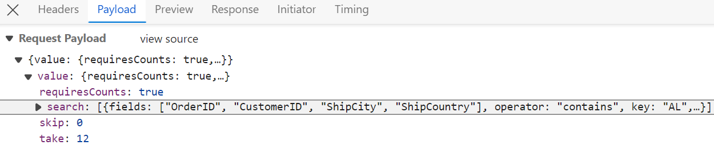



    [HttpPost]
    public object Post([FromBody] DataManager DataManagerRequest)
    {
        // Retrieve data from the data source (e.g., database)
        IQueryable<OrdersDetails> DataSource = GetOrderData().AsQueryable();

        QueryableOperation queryableOperation = new QueryableOperation(); // Initialize QueryableOperation instance

        // Retrieve data manager value
        DataManagerRequest DataManagerParams = DataManagerRequest.Value;

        // Handling Searching
        if (DataManagerParams.Search != null && DataManagerParams.Search.Count > 0)
        {
        DataSource = queryableOperation.PerformSearching(DataSource, DataManagerParams.Search);
        }
        // Get the total records count
        int totalRecordsCount = DataSource.Count();

        // Return data based on the request
        return new { result = DataSource, count = totalRecordsCount };
    }

    // Model for handling data manager requests
    public class DataManager
    {
        public required DataManagerRequest Value { get; set; }
    }


import { Component, ViewChild } from '@angular/core';
import { DataManager, WebMethodAdaptor } from '@syncfusion/ej2-data';
import { GridComponent, ToolbarItems } from '@syncfusion/ej2-angular-grids';

@Component({
  selector: 'app-root',
  templateUrl: './app.component.html',
})
export class AppComponent {
  public data?: DataManager;

  @ViewChild('grid')
  public grid?: GridComponent;
  public toolbar?: ToolbarItems[];

  ngOnInit(): void {
    this.data = new DataManager({
      url: 'https://localhost:xxxx/api/Grid', // Replace with your hosted link
      adaptor: new WebMethodAdaptor()
    });
    this.toolbar = ['Search'];
  }
}


<ejs-grid #grid [dataSource]='data' [toolbar]="toolbar" height="320">
  <e-columns>
    <e-column field='OrderID' headerText='Order ID' isPrimaryKey=true width='150'></e-column>
    <e-column field='CustomerID' headerText='Customer Name' width='150'></e-column>
    <e-column field='ShipCity' headerText='ShipCity' width='150' textAlign='Right'></e-column>
  </e-columns>
</ejs-grid>


import { HttpClientModule } from '@angular/common/http';
import { NgModule } from '@angular/core';
import { BrowserModule } from '@angular/platform-browser';
import { GridModule, ToolbarService } from '@syncfusion/ej2-angular-grids';
import { AppRoutingModule } from './app-routing.module';
import { AppComponent } from './app.component';

@NgModule({
  declarations: [
    AppComponent
  ],
  imports: [
    BrowserModule, HttpClientModule,
    AppRoutingModule, GridModule
  ],
  providers: [ToolbarService],
  bootstrap: [AppComponent]
})
export class AppModule { }



## Handling filtering operation

To handle filter operations, ensure that your API endpoint supports custom filtering criteria. Implement the filtering logic on the server-side using the [PerformFiltering](https://help.syncfusion.com/cr/aspnetmvc-js2/Syncfusion.EJ2.Base.QueryableOperation.html#Syncfusion_EJ2_Base_QueryableOperation_PerformFiltering__1_System_Linq_IQueryable___0__System_Collections_Generic_List_Syncfusion_EJ2_Base_WhereFilter__System_String_) method from the [QueryableOperation](https://help.syncfusion.com/cr/aspnetmvc-js2/Syncfusion.EJ2.Base.QueryableOperation.html) class. This allows the custom data source to undergo filtering based on the criteria specified in the incoming [DataManagerRequest](https://help.syncfusion.com/cr/aspnetmvc-js2/Syncfusion.EJ2.Base.DataManagerRequest.html) object.

**Single Column Filtering**
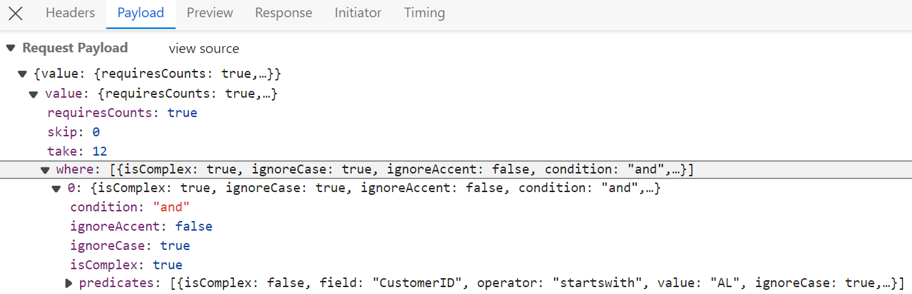

**Multi Column Filtering**
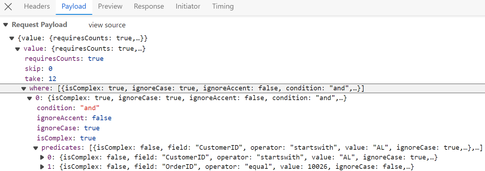



[HttpPost]
public object Post([FromBody] DataManager DataManagerRequest)
{
    // Retrieve data from the data source (e.g., database)
    IQueryable<OrdersDetails> DataSource = GetOrderData().AsQueryable();

    QueryableOperation queryableOperation = new QueryableOperation(); // Initialize QueryableOperation instance

    // Retrieve data manager value
    DataManagerRequest DataManagerParams = DataManagerRequest.Value;

    if (DataManagerParams.Where != null && DataManagerParams.Where.Count > 0)
    {
        // Handling filtering operation
        foreach (var condition in DataManagerParams.Where)
        {
            foreach (var predicate in condition.predicates)
            {
                DataSource = queryableOperation.PerformFiltering(DataSource, DataManagerParams.Where, predicate.Operator);
            }
        }
    }
    // Get the total records count
    int totalRecordsCount = DataSource.Count();

    // Return data based on the request
    return new { result = DataSource, count = totalRecordsCount };
}

// Model for handling data manager requests
public class DataManager
{
    public required DataManagerRequest Value { get; set; }
}


import { Component, ViewChild } from '@angular/core';
import { DataManager, WebMethodAdaptor } from '@syncfusion/ej2-data';
import { GridComponent } from '@syncfusion/ej2-angular-grids';

@Component({
  selector: 'app-root',
  templateUrl: './app.component.html',
})
export class AppComponent {
  public data?: DataManager;

  @ViewChild('grid')
  public grid?: GridComponent;

  ngOnInit(): void {
    this.data = new DataManager({
      url: 'https://localhost:xxxx/api/Grid', // Replace with your hosted link
      adaptor: new WebMethodAdaptor()
    });
  }
}


<ejs-grid #grid [dataSource]='data' allowFiltering='true' height="320">
  <e-columns>
    <e-column field='OrderID' headerText='Order ID' isPrimaryKey=true width='150'></e-column>
    <e-column field='CustomerID' headerText='Customer Name' width='150'></e-column>
    <e-column field='ShipCity' headerText='ShipCity' width='150' textAlign='Right'></e-column>
  </e-columns>
</ejs-grid>


import { HttpClientModule } from '@angular/common/http';
import { NgModule } from '@angular/core';
import { BrowserModule } from '@angular/platform-browser';
import { GridModule, FilterService } from '@syncfusion/ej2-angular-grids';
import { AppRoutingModule } from './app-routing.module';
import { AppComponent } from './app.component';

@NgModule({
  declarations: [
    AppComponent
  ],
  imports: [
    BrowserModule, HttpClientModule,
    AppRoutingModule, GridModule
  ],
  providers: [FilterService],
  bootstrap: [AppComponent]
})
export class AppModule { }



## Handling sorting operation

To handle sort operations, ensure that your API endpoint supports custom sorting criteria. Implement the sorting logic on the server-side using the [PerformSorting](https://help.syncfusion.com/cr/aspnetmvc-js2/Syncfusion.EJ2.Base.QueryableOperation.html#Syncfusion_EJ2_Base_QueryableOperation_PerformSorting__1_System_Linq_IQueryable___0__System_Collections_Generic_List_Syncfusion_EJ2_Base_Sort__) method from the [QueryableOperation](https://help.syncfusion.com/cr/aspnetmvc-js2/Syncfusion.EJ2.Base.QueryableOperation.html) class. This allows the custom data source to undergo sorting based on the criteria specified in the incoming [DataManagerRequest](https://help.syncfusion.com/cr/aspnetmvc-js2/Syncfusion.EJ2.Base.DataManagerRequest.html) object.

**Single Column Sorting**
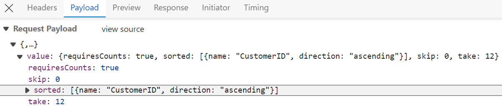

**Multi Column Sorting**
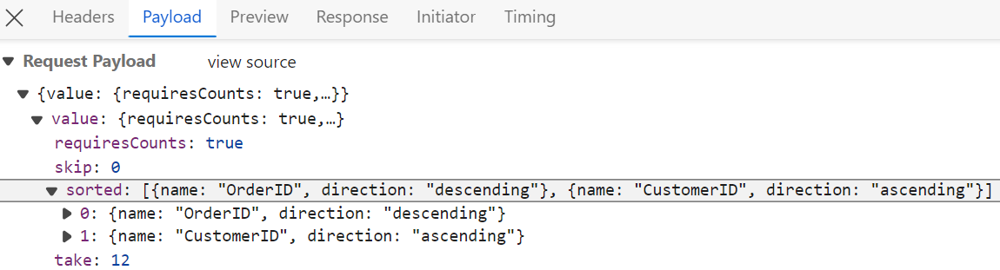



[HttpPost]
public object Post([FromBody] DataManager DataManagerRequest)
{
    // Retrieve data from the data source (e.g., database)
    IQueryable<OrdersDetails> DataSource = GetOrderData().AsQueryable();

    QueryableOperation queryableOperation = new QueryableOperation(); // Initialize QueryableOperation instance

    // Retrieve data manager value
    DataManagerRequest DataManagerParams = DataManagerRequest.Value;

    // Handling Sorting operation
    if (DataManagerParams.Sorted != null && DataManagerParams.Sorted.Count > 0)
    {
        DataSource = queryableOperation.PerformSorting(DataSource, DataManagerParams.Sorted);
    }

    // Get the total count of records
    int totalRecordsCount = DataSource.Count();

    // Return data based on the request
    return new { result = DataSource, count = totalRecordsCount };
}

// Model for handling data manager requests
public class DataManager
{
    public required DataManagerRequest Value { get; set; }
}


import { Component, ViewChild } from '@angular/core';
import { DataManager, WebMethodAdaptor } from '@syncfusion/ej2-data';
import { GridComponent } from '@syncfusion/ej2-angular-grids';

@Component({
  selector: 'app-root',
  templateUrl: './app.component.html',
})
export class AppComponent {
  public data?: DataManager;

  @ViewChild('grid')
  public grid?: GridComponent;

  ngOnInit(): void {
    this.data = new DataManager({
      url: 'https://localhost:xxxx/api/Grid', // Replace with your hosted link
      adaptor: new WebMethodAdaptor()
    });
  }
}


<ejs-grid #grid [dataSource]='data' allowSorting='true' height="320">
  <e-columns>
    <e-column field='OrderID' headerText='Order ID' isPrimaryKey=true width='150'></e-column>
    <e-column field='CustomerID' headerText='Customer Name' width='150'></e-column>
    <e-column field='ShipCity' headerText='ShipCity' width='150' textAlign='Right'></e-column>
  </e-columns>
</ejs-grid>


import { HttpClientModule } from '@angular/common/http';
import { NgModule } from '@angular/core';
import { BrowserModule } from '@angular/platform-browser';
import { GridModule, SortService } from '@syncfusion/ej2-angular-grids';
import { AppRoutingModule } from './app-routing.module';
import { AppComponent } from './app.component';

@NgModule({
  declarations: [
    AppComponent
  ],
  imports: [
    BrowserModule, HttpClientModule,
    AppRoutingModule, GridModule
  ],
  providers: [SortService],
  bootstrap: [AppComponent]
})
export class AppModule { }



## Handling paging operation

To handle paging operations, ensure that your API endpoint supports custom paging criteria. Implement the paging logic on the server-side using the [PerformTake](https://help.syncfusion.com/cr/aspnetmvc-js2/Syncfusion.EJ2.Base.QueryableOperation.html#Syncfusion_EJ2_Base_QueryableOperation_PerformTake__1_System_Linq_IQueryable___0__System_Int32_) and [PerformSkip](https://help.syncfusion.com/cr/aspnetmvc-js2/Syncfusion.EJ2.Base.QueryableOperation.html#Syncfusion_EJ2_Base_QueryableOperation_PerformSkip__1_System_Linq_IQueryable___0__System_Int32_) methods from the [QueryableOperation](https://help.syncfusion.com/cr/aspnetmvc-js2/Syncfusion.EJ2.Base.QueryableOperation.html) class. This allows the custom data source to undergo paging based on the criteria specified in the incoming [DataManagerRequest](https://help.syncfusion.com/cr/aspnetmvc-js2/Syncfusion.EJ2.Base.DataManagerRequest.html) object.

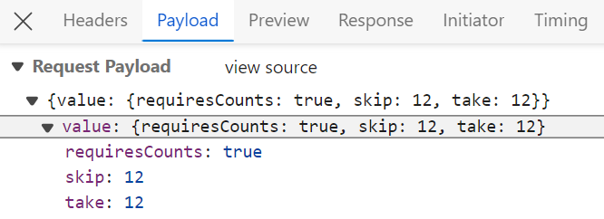



[HttpPost]
public object Post([FromBody] DataManager DataManagerRequest)
{
    // Retrieve data from the data source (e.g., database)
    IQueryable<OrdersDetails> DataSource = GetOrderData().AsQueryable();

    // Get the total records count
    int totalRecordsCount = DataSource.Count();

    QueryableOperation queryableOperation = new QueryableOperation(); // Initialize QueryableOperation instance

    // Retrieve data manager value
    DataManagerRequest DataManagerParams = DataManagerRequest.Value;

    // Handling paging operation.
    if (DataManagerParams.Skip != 0)
    {
        // Paging
        DataSource = queryableOperation.PerformSkip(DataSource, DataManagerParams.Skip);
    }
    if (DataManagerParams.Take != 0)
    {
        DataSource = queryableOperation.PerformTake(DataSource, DataManagerParams.Take);
    }

    // Return data based on the request
    return new { result = DataSource, count = totalRecordsCount };
}

// Model for handling data manager requests
public class DataManager
{
    public required DataManagerRequest Value { get; set; }
}


import { Component, ViewChild } from '@angular/core';
import { DataManager, WebMethodAdaptor } from '@syncfusion/ej2-data';
import { GridComponent } from '@syncfusion/ej2-angular-grids';

@Component({
  selector: 'app-root',
  templateUrl: './app.component.html',
})
export class AppComponent {
  public data?: DataManager;

  @ViewChild('grid')
  public grid?: GridComponent;

  ngOnInit(): void {
    this.data = new DataManager({
      url: 'https://localhost:xxxx/api/Grid', // Replace with your hosted link
      adaptor: new WebMethodAdaptor()
    });
  }
}


<ejs-grid #grid [dataSource]='data' allowPaging='true' height="320">
  <e-columns>
    <e-column field='OrderID' headerText='Order ID' isPrimaryKey=true width='150'></e-column>
    <e-column field='CustomerID' headerText='Customer Name' width='150'></e-column>
    <e-column field='ShipCity' headerText='ShipCity' width='150' textAlign='Right'></e-column>
  </e-columns>
</ejs-grid>


import { HttpClientModule } from '@angular/common/http';
import { NgModule } from '@angular/core';
import { BrowserModule } from '@angular/platform-browser';
import { GridModule, PageService } from '@syncfusion/ej2-angular-grids';
import { AppRoutingModule } from './app-routing.module';
import { AppComponent } from './app.component';

@NgModule({
  declarations: [
    AppComponent
  ],
  imports: [
    BrowserModule, HttpClientModule,
    AppRoutingModule, GridModule
  ],
  providers: [PageService],
  bootstrap: [AppComponent]
})
export class AppModule { }



## Handling CRUD operations

The Syncfusion Angular Grid Component seamlessly integrates CRUD (Create, Read, Update, Delete) operations with server-side controller actions through specific properties: [insertUrl](https://help.syncfusion.com/cr/aspnetmvc-js2/Syncfusion.EJ2.DataManager.html#Syncfusion_EJ2_DataManager_InsertUrl), [removeUrl](https://help.syncfusion.com/cr/aspnetmvc-js2/Syncfusion.EJ2.DataManager.html#Syncfusion_EJ2_DataManager_RemoveUrl), [updateUrl](https://help.syncfusion.com/cr/aspnetmvc-js2/Syncfusion.EJ2.DataManager.html#Syncfusion_EJ2_DataManager_UpdateUrl), [crudUrl](https://help.syncfusion.com/cr/aspnetmvc-js2/Syncfusion.EJ2.DataManager.html#Syncfusion_EJ2_DataManager_CrudUrl), and [batchUrl](https://help.syncfusion.com/cr/aspnetmvc-js2/Syncfusion.EJ2.DataManager.html#Syncfusion_EJ2_DataManager_BatchUrl). These properties enable the grid to communicate with the data service for every grid action, facilitating server-side operations.

**CRUD Operations Mapping**

CRUD operations within the grid can be mapped to server-side controller actions using specific properties:

1. **insertUrl**: Specifies the URL for inserting new data.
2. **removeUrl**: Specifies the URL for removing existing data.
3. **updateUrl**: Specifies the URL for updating existing data.
4. **crudUrl**: Specifies a single URL for all CRUD operations.
5. **batchUrl**: Specifies the URL for batch editing.

To enable editing in the Angular Grid component, refer to the editing [documentation](https://ej2.syncfusion.com/angular/documentation/grid/editing/edit). In the below example, the batch edit [mode](https://ej2.syncfusion.com/angular/documentation/api/grid/editSettings/#mode) is enabled and the [toolbar](https://ej2.syncfusion.com/angular/documentation/api/grid/#toolbar) property is configured to display toolbar items for editing purposes.



import { Component, ViewChild } from '@angular/core';
import { DataManager, WebMethodAdaptor } from '@syncfusion/ej2-data';
import { GridComponent, EditSettingsModel, ToolbarItems } from '@syncfusion/ej2-angular-grids';

@Component({
  selector: 'app-root',
  templateUrl: './app.component.html',
})
export class AppComponent {
  public data?: DataManager;

  @ViewChild('grid')
  public grid?: GridComponent;
  public editSettings?: EditSettingsModel;
  public toolbar?: ToolbarItems[];

  ngOnInit(): void {
    this.data = new DataManager({
      url: 'https://localhost:xxxx/api/grid', // Replace with your hosted link
      insertUrl: 'https://localhost:xxxx/api/grid/Insert',
      updateUrl: 'https://localhost:xxxx/api/grid/Update',
      removeUrl: 'https://localhost:xxxx/api/grid/Remove',
      adaptor: new WebMethodAdaptor()
    });
    this.toolbar = ['Add', 'Edit', 'Update', 'Delete', 'Cancel'];
    this.editSettings = { allowAdding: true, allowDeleting: true, allowEditing: true, mode: 'Batch' };
  }
}



<ejs-grid #grid [dataSource]='data' [toolbar]="toolbar" [editSettings]="editSettings">
  <e-columns>
    <e-column field='OrderID' headerText='Order ID' width='120' textAlign='Right' isPrimaryKey="true"></e-column>
    <e-column field='CustomerID' headerText='Customer ID' width='160'></e-column>
    <e-column field='ShipCity' headerText='Ship City' width='150'></e-column>
    <e-column field='ShipCountry' headerText='Ship Country' width='150'></e-column>
  </e-columns>
</ejs-grid>


import { HttpClientModule } from '@angular/common/http';
import { NgModule } from '@angular/core';
import { BrowserModule } from '@angular/platform-browser';
import { EditService, GridModule, ToolbarService } from '@syncfusion/ej2-angular-grids';
import { AppRoutingModule } from './app-routing.module';
import { AppComponent } from './app.component';

@NgModule({
  declarations: [
    AppComponent
  ],
  imports: [
    BrowserModule, HttpClientModule,
    AppRoutingModule, GridModule
  ],
  providers: [EditService, ToolbarService],
  bootstrap: [AppComponent]
})
export class AppModule { }




> Normal/Inline editing is the default edit [mode](https://ej2.syncfusion.com/angular/documentation/api/grid/editSettings/#mode) for the Grid component. To enable CRUD operations, ensure that the [isPrimaryKey](https://ej2.syncfusion.com/angular/documentation/api/grid/column/#isprimarykey) property is set to **true** for a specific Grid column, ensuring that its value is unique.

The following class is used to structure data sent during CRUD operations:

```cs
public class CRUDModel<T> where T : class
{
  public string? action { get; set; }
  public string? keyColumn { get; set; }
  public object? key { get; set; }
  public T? value { get; set; }
  public List<T>? added { get; set; }
  public List<T>? changed { get; set; }
  public List<T>? deleted { get; set; }
  public IDictionary<string, object>? @params { get; set; }
}
```

**Insert Operation:**

To insert a new record, utilize the [insertUrl](https://help.syncfusion.com/cr/aspnetmvc-js2/Syncfusion.EJ2.DataManager.html#Syncfusion_EJ2_DataManager_InsertUrl) property to specify the controller action mapping URL for the insert operation. The newly added record details are bound to the **newRecord** parameter.

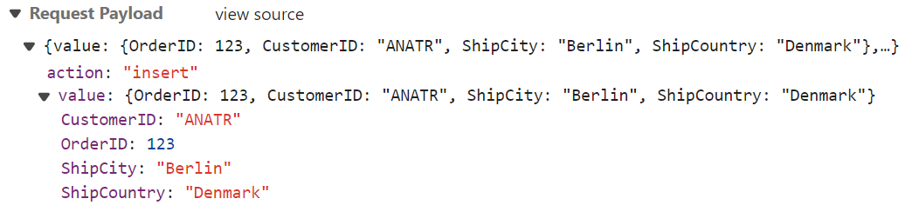

```cs

/// <summary>
/// Inserts a new data item into the data collection.
/// </summary>
/// <param name="newRecord">It contains the new record detail which is need to be inserted.</param>
/// <returns>Returns void</returns>
[HttpPost]
[Route("api/[controller]/Insert")]
public void Insert([FromBody] CRUDModel<OrdersDetails> newRecord)
{
    // Check if new record is not null
    if (newRecord.value != null)
    {
        // Insert new record
        OrdersDetails.GetAllRecords().Insert(0, newRecord.value);
    }
}
```

**Update Operation:**

For updating existing records, utilize the [updateUrl](https://help.syncfusion.com/cr/aspnetmvc-js2/Syncfusion.EJ2.DataManager.html#Syncfusion_EJ2_DataManager_UpdateUrl) property to specify the controller action mapping URL for the update operation. The updated record details are bound to the **updatedRecord** parameter.

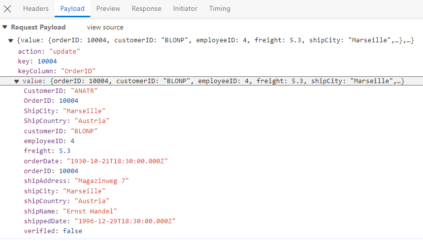

```cs

/// <summary>
/// Update a existing data item from the data collection.
/// </summary>
/// <param name="updatedRecord">It contains the updated record detail which is need to be updated.</param>
/// <returns>Returns void</returns>
[HttpPost]
[Route("api/[controller]/Update")]
public void Update([FromBody] CRUDModel<OrdersDetails> updatedRecord)
{
    // Retrieve updated order
    var updatedOrder = updatedRecord.value;
    if (updatedOrder != null)
    {
        // Find existing record
        var data = OrdersDetails.GetAllRecords().FirstOrDefault(or => or.OrderID == updatedOrder.OrderID);
        if (data != null)
        {
            // Update existing record
            data.OrderID = updatedOrder.OrderID;
            data.CustomerID = updatedOrder.CustomerID;
            data.ShipCity = updatedOrder.ShipCity;
            data.ShipCountry = updatedOrder.ShipCountry;
            // Update other properties similarly
        }
    }
}
```

**Delete Operation**

To delete existing records, use the [removeUrl](https://help.syncfusion.com/cr/aspnetmvc-js2/Syncfusion.EJ2.DataManager.html#Syncfusion_EJ2_DataManager_RemoveUrl) property to specify the controller action mapping URL for the delete operation. The primary key value of the deleted record is bound to the **deletedRecord** parameter.

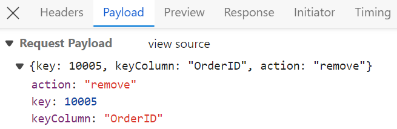

```cs
/// <summary>
/// Remove a specific data item from the data collection.
/// </summary>
/// <param name="deletedRecord">It contains the specific record detail which is need to be removed.</param>
/// <return>Returns void</return>
[HttpPost]
[Route("api/[controller]/Remove")]
public void Remove([FromBody] CRUDModel<OrdersDetails> deletedRecord)
{
    int orderId = int.Parse(deletedRecord.key.ToString()); // get key value from the deletedRecord
    var data = OrdersDetails.GetAllRecords().FirstOrDefault(orderData => orderData.OrderID == orderId);
    if (data != null)
    {
        // Remove the record from the data collection
        OrdersDetails.GetAllRecords().Remove(data);
    }
}
```

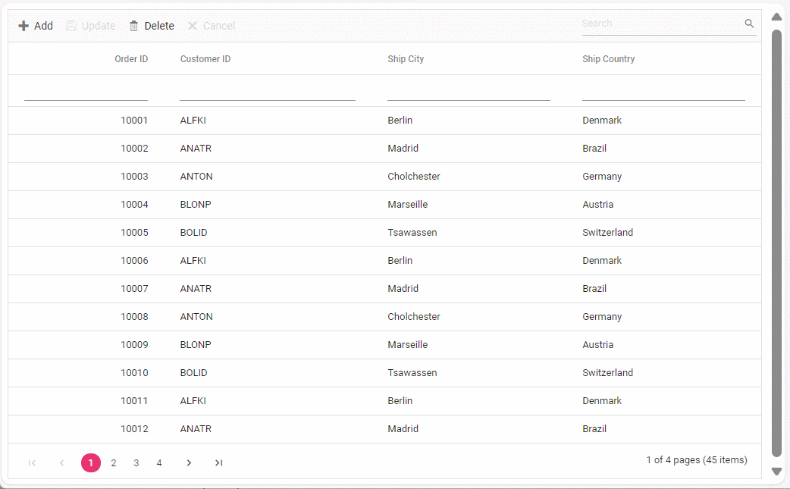

**Single Method for Performing All CRUD Operations**

Using the `crudUrl` property, the controller action mapping URL can be specified to perform all CRUD operations at the server-side using a single method instead of specifying separate controller action methods for CRUD (insert, update and delete) operations.

The following code example describes the above behavior:

```ts
import { Component, ViewChild } from '@angular/core';
import { DataManager, WebMethodAdaptor } from '@syncfusion/ej2-data';
import { GridComponent, EditSettingsModel, ToolbarItems } from '@syncfusion/ej2-angular-grids';

@Component({
  selector: 'app-root',
  templateUrl: './app.component.html',
})
export class AppComponent {
  public data?: DataManager;

  @ViewChild('grid')
  public grid?: GridComponent;
  public editSettings?: EditSettingsModel;
  public toolbar?: ToolbarItems[];

  ngOnInit(): void {
    this.data = new DataManager({
      url: 'https://localhost:xxxx/api/grid', // Replace with your hosted link
      crudUrl:'https://localhost:xxxx/api/grid/CrudUpdate',
      adaptor: new WebMethodAdaptor()
    });
    this.toolbar = ['Add', 'Edit', 'Update', 'Delete', 'Cancel'];
    this.editSettings = { allowAdding: true, allowDeleting: true, allowEditing: true, mode: 'Normal' };
  }
}

```

```cs

[HttpPost]
[Route("api/[controller]/CrudUpdate")]
public void CrudUpdate([FromBody] CRUDModel<OrdersDetails> request)
{
  // perform update operation
  if (request.action == "update")
  {
    var orderValue = request.value;
    OrdersDetails existingRecord = OrdersDetails.GetAllRecords().Where(or => or.OrderID == orderValue.OrderID).FirstOrDefault();
    existingRecord.OrderID = orderValue.OrderID;
    existingRecord.CustomerID = orderValue.CustomerID;
    existingRecord.ShipCity = orderValue.ShipCity;
  }
  // perform insert operation
  else if (request.action == "insert")
  {
    OrdersDetails.GetAllRecords().Insert(0, request.value);
  }
  // perform remove operation
  else if (request.action == "remove")
  {
    OrdersDetails.GetAllRecords().Remove(OrdersDetails.GetAllRecords().Where(or => or.OrderID == int.Parse(request.key.ToString())).FirstOrDefault());
  }
}
```

**Batch Operation**

To perform batch operations, define the edit [mode](https://ej2.syncfusion.com/angular/documentation/api/grid/editSettings/#mode) as **Batch** and specify the `batchUrl` property in the DataManager. Use the **Add** toolbar button to insert new rows in batch editing mode. To edit a cell, double-click the desired cell and update the value as required. To delete a record, simply select the record and press the **Delete** toolbar button. All CRUD operations will be executed in a single request. Clicking the **Update** toolbar button will update the newly added, edited, or deleted records from the OrdersDetails table using a single API POST request.

```ts
[app.component.ts]
import { Component, ViewChild } from '@angular/core';
import { GridComponent, ToolbarItems, EditSettingsModel } from '@syncfusion/ej2-angular-grids';
import { DataManager, WebMethodAdaptor } from '@syncfusion/ej2-data';

@Component({
  selector: 'app-root',
  template:`<ejs-grid #grid [dataSource]='data' [editSettings]='editSettings' [toolbar]='toolbar'>
<e-columns>
<e-column field='OrderID' headerText='Order ID' width='90' textAlign='Right' isPrimaryKey='true'></e-column>
<e-column field="CustomerID" headerText="Customer Name" width="100"></e-column>
<e-column field='ShipCountry' headerText='Ship Country' width=100></e-column>
</e-columns>
</ejs-grid>`
})
export class AppComponent {
  @ViewChild('grid')
  public grid?: GridComponent;
  public data?: DataManager;
  public editSettings?: EditSettingsModel;
  public toolbar?: ToolbarItems[];
  public orderIDRules?: object;
  public customerIDRules?: object;

  ngOnInit(): void {
    this.data = new DataManager({
      url: 'https://localhost:xxxx/api/grid', // Replace with your hosted link
      batchUrl:'https://localhost:xxxx/api/grid/BatchUpdate',
      adaptor: new WebMethodAdaptor()
    });

    this.editSettings = { allowEditing: true, allowAdding: true, allowDeleting: true, mode: 'Batch' };
    this.toolbar = ['Add', 'Edit', 'Delete', 'Update', 'Cancel', 'Search'];
    this.orderIDRules = { required: true };
    this.customerIDRules = { required: true, minLength: 3 };
  }
}
```

```cs
[HttpPost]
[Route("api/[controller]/BatchUpdate")]
public IActionResult BatchUpdate([FromBody] CRUDModel<OrdersDetails> batchOperation)
{
  if (batchOperation.added != null)
  {
    foreach (var addedOrder in batchOperation.added)
    {
      OrdersDetails.GetAllRecords().Insert(0, addedOrder);
    }
  }
 if (batchOperation.changed != null)
  {
    foreach (var changedOrder in batchOperation.changed)
    {
      var existingOrder = OrdersDetails.GetAllRecords().FirstOrDefault(or => or.OrderID == changedOrder.OrderID);
      if (existingOrder != null)
      {
        existingOrder.CustomerID = changedOrder.CustomerID;
        existingOrder.ShipCity = changedOrder.ShipCity;
        // Update other properties as needed
      }
    }
  }
if (batchOperation.deleted != null)
  {
    foreach (var deletedOrder in batchOperation.deleted)
    {
      var orderToDelete = OrdersDetails.GetAllRecords().FirstOrDefault(or => or.OrderID == deletedOrder.OrderID);
      if (orderToDelete != null)
      {
        OrdersDetails.GetAllRecords().Remove(orderToDelete);
      }
    }
  }
  return Json(batchOperation);
}
```
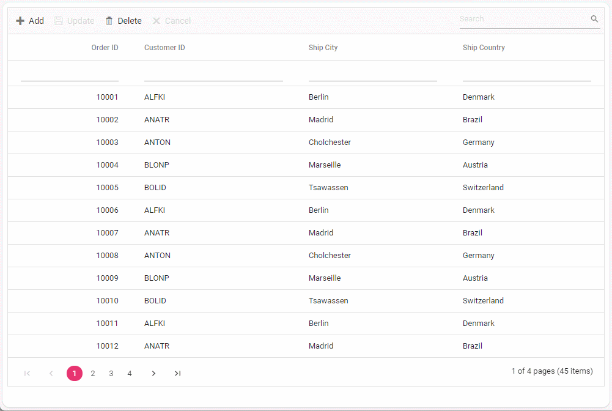

> You can find the complete sample for the WebMethodAdaptor in the [GitHub](https://github.com/SyncfusionExamples/Binding-data-from-remote-service-to-angular-data-grid) repository.