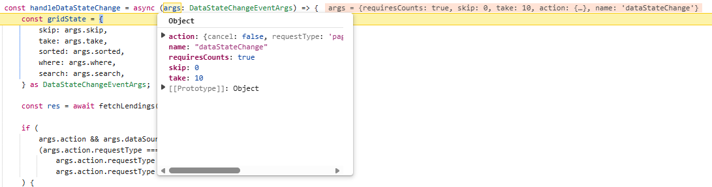
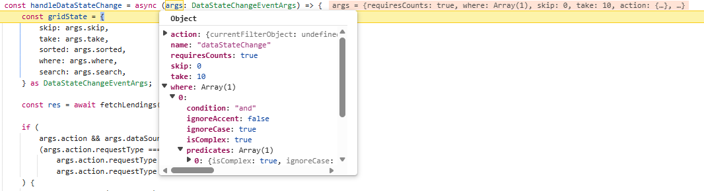
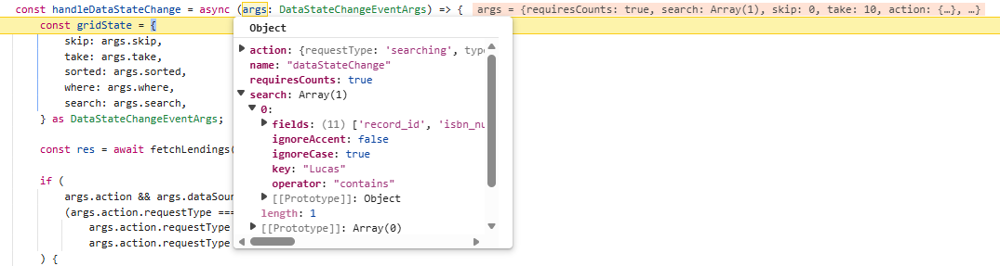
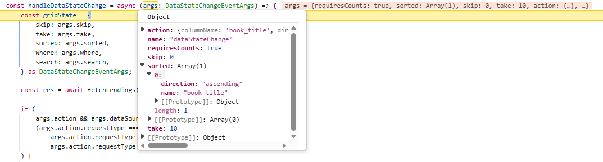
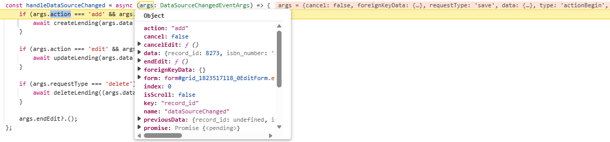
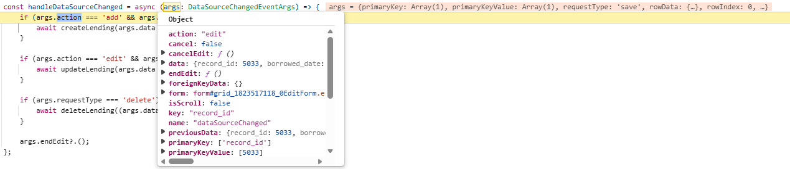
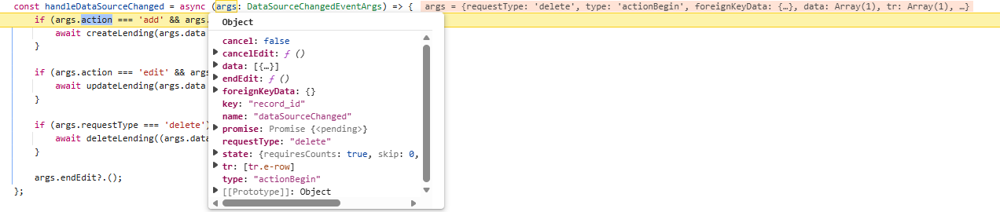

# Syncfusion Angular Grid with Django REST Framework

This guide explains connecting the Syncfusion Angular Grid to a **Django REST Framework (DRF)** backend with **Custom Binding**. Custom Binding provides full control over the Grid’s communication with the server: the Grid raises events for data operations (paging, sorting, filtering, searching) and CRUD,  client code calls DRF endpoints, and DRF returns standardized results.

**Difference between Custom Binding and UrlAdaptor:**

With **UrlAdaptor**, the Syncfusion DataManager serializes all Grid actions into a single, framework‑specific payload posted to one endpoint.

**Custom Binding** provides full, manual control over request design. The Grid raises events (`dataStateChange`, `dataSourceChanged`), and the client code shapes the request (query string, body, headers) and targets specific RESTful endpoints.  

Since Django REST Framework expects standard REST patterns, calls can be designed to match DRF conventions, for example, `GET` for actions like paging, filtering, sorting, searching, and `POST/PUT/DELETE` for CRUD, while responses return the simple `{ result, count }` structure that the Grid can bind to.

In short, Custom Binding means the contract (requests and responses) is owned by the application, making alignment with DRF's native pagination, filtering, ordering, and searching straightforward.

## Prerequisites

- **Node.js** LTS (v20+), npm/yarn.
- **Angular** 18+ (with TypeScript 5.x+).
- **Python** 3.11+.
- **Django** 5.2+, **Django REST Framework**, **django-filter**, **django-cors-headers**.
- **Microsoft SQL Server** (or adapt to PostgreSQL/MySQL/SQLite).

## Key topics

| # | Topics | Link |
|---|---------|------|
| 1 | Set up Django REST Framework and connect it to Microsoft SQL Server | [View](#setting-up-the-django-rest-framework-for-microsoft-sql-database) |
| 2 | Create and configure the Angular application with the Syncfusion Angular Grid | [View](#integrate-syncfusion-angular-grid-with-django-rest-framework-custom-binding) |
| 3 | Handle server-side data operations (paging/sorting/filtering/searching) with Custom Binding | [View](#perform-data-operations) |
| 4 | Enable create, update, and delete operations with Custom Binding | [View](#performing-crud-operations) |
| 5 | Run the Django and Angular applications locally for development | [View](#running-the-application) |

## Setting up the Django REST Framework for Microsoft SQL database

The DRF backend exposes REST endpoints the Grid calls from client-side event handlers.

### Step 1: Set up the Django REST Framework server and install required packages

**Instructions:**
1. Open a terminal ( for example, an integrated terminal in Visual Studio Code or Windows Command prompt opened with <kbd>Win+R</kbd>, or macOS Terminal launched with <kbd>Cmd+Space</kbd> ).

2. Before creating the `Django` project, set up a virtual environment. A virtual environment keeps project dependencies isolated, ensuring that package installations do not affect other projects.

    The following commands create and activate the environment:

    ```bash
    python -m venv .venv
    .venv\Scripts\activate   # Mac/Linux: source .venv/bin/activate
    ```
3. Once the virtual environment is active, install the required packages for Django REST Framework and Microsoft SQL Server support:

    ```bash
    pip install django djangorestframework django-filter django-cors-headers mssql-django pyodbc
    ```
    - `mssql-django` enables `Django` to connect to SQL Server through `pyodbc`.
    - For `Django` settings reference, see [databases](https://docs.djangoproject.com/en/6.0/ref/settings/#databases).

4. Initialize the `Django` project and Application:

    For this guide, a `Django` project named **django_server** is created, along with a new application module, using the following commands:

    ```bash
    django-admin startproject django_server .
    python manage.py startapp library
    ```
The **django_server** folder is now created. This initializes the project structure and creates the library app, which will contain the models, views, and API logic for the Django REST Framework backend.

### Step 2: Configure Django settings

The file (**django_server/server/settings.py**) is automatically generated when a Django project is created.

This step updates the file to establish the SQL Server connection and enable essential Django REST Framework features such as CORS, filtering, and pagination.

**Instructions:**

1. Opens the (**django_server/server/settings.py**) file.
2. Define the SQL server database connection: 

    The **DATABASES** section configures Django to connect to SQL Server.

    ```python
    DATABASES = {
        "default": {
            "ENGINE": "mssql",
            "NAME": "LibraryDB",
            "USER": "django_user",
            "PASSWORD": "Django@123",
            "HOST": "(localdb)\MSSQLLocalDB",
            "OPTIONS": {
                "driver": "ODBC Driver 18 for SQL Server",
                "trustServerCertificate": "yes",
            },
        }
    }
    ```
    **Line breakdown:**
    - **ENGINE**: Database backend; for SQL Server via `mssql-django`, set to `"mssql"`.
    - **NAME**: Database name to connect to (e.g., **LibraryDB**).
    - **USER**: SQL Server login used by `Django`.
    - **PASSWORD**: Password for the above user.
    - **HOST**: Server/instance name or address (e.g., **(localdb)\MSSQLLocalDB** or a hostname).
    - **OPTIONS.driver**: ODBC driver to use (e.g., **ODBC Driver 18 for SQL Server**). Must be installed on the machine.
    - **OPTIONS.trustServerCertificate**: When "yes", accepts the server certificate without validation (convenient for local/dev). For production, configure TLS properly and remove this override.

3. Add required applications:

    Add the required packages to the **INSTALLED_APPS** list to enable REST APIs, filtering, CORS, and the project's app (library):

    ```python
    INSTALLED_APPS = [
        "django.contrib.admin",
        "django.contrib.auth",
        "django.contrib.contenttypes",
        "django.contrib.sessions",
        "django.contrib.messages",
        "django.contrib.staticfiles",
        "rest_framework",
        "django_filters",
        "corsheaders",
        "library",
    ]
    ```
    **Purpose of key apps:**
    - **rest_framework** – Core Django REST Framework functionality support.
    - **corsheaders** - Cross‑origin access for frontend frameworks.
    - **library** - Application created in the project.

4. Configure middleware:

    Middleware processes incoming requests.

    ```python
    MIDDLEWARE = [
        "corsheaders.middleware.CorsMiddleware",
        "django.middleware.security.SecurityMiddleware",
        "django.contrib.sessions.middleware.SessionMiddleware",
        "django.middleware.common.CommonMiddleware",
        "django.middleware.csrf.CsrfViewMiddleware",
        "django.contrib.auth.middleware.AuthenticationMiddleware",
        "django.contrib.messages.middleware.MessageMiddleware",
        "django.middleware.clickjacking.XFrameOptionsMiddleware",
    ]
    ```
    > Place "CORS" middleware near the top so preflight requests are handled correctly.

5. Enable "CORS" for the Angular development server:

    Add the Angular dev origin so the browser can call the API during development.

    ```python
    CORS_ALLOWED_ORIGINS = [
        "http://localhost:4200",
    ]
    ```
    This prevents cross‑origin access errors while the frontend calls backend APIs during development.

6. Configure **Django REST Framework (DRF)**:

    The **REST_FRAMEWORK** section defines the API's input formats, data parsing rules, pagination behavior, and features for filtering, searching, and ordering.

    ```python
    REST_FRAMEWORK = {
        "DATETIME_INPUT_FORMATS": [
            "%Y-%m-%dT%H:%M:%S.%fZ",
            "%Y-%m-%dT%H:%M:%SZ",
            "%Y-%m-%dT%H:%M:%S",
            "iso-8601",
        ],
        "DATE_INPUT_FORMATS": [
            "%Y-%m-%d",
            "%Y-%m-%dT%H:%M:%S.%fZ",
            "%Y-%m-%dT%H:%M:%SZ",
            "%Y-%m-%dT%H:%M:%S",
            "iso-8601",
        ],
        "DEFAULT_PARSER_CLASSES": [
            "rest_framework.parsers.JSONParser",
            "rest_framework.parsers.FormParser",
            "rest_framework.parsers.MultiPartParser",
        ],
        "DEFAULT_PAGINATION_CLASS": "rest_framework.pagination.PageNumberPagination",
        "PAGE_SIZE": 12,
        "DEFAULT_FILTER_BACKENDS": [
            "django_filters.rest_framework.DjangoFilterBackend",
            "rest_framework.filters.SearchFilter",
            "rest_framework.filters.OrderingFilter",
        ],
    }
    ```

### Step 3: Define models

A Django model defines the way data is stored and accessed in the database. Each model maps to a database table and exposes its fields as structured records that can be queried, created, updated, and deleted by the application and API.

**Instructions:**
1. Open the (**library/models.py**) file. This file contains the model definitions for the library app.

2. Add the "BookLending" model.

    The model describes the table structure, including fields for book details, borrower details, important dates, and lending status.

    Indexed fields ("book_title", "author_name", "genre", "lending_status") speed up server‑side filtering/search; default ordering shows most recent borrowings first.

    ```python
    [library/models.py]

    from django.db import models

    class BookLending(models.Model):
        record_id = models.AutoField(primary_key=True)
        book_title = models.CharField(max_length=255)
        isbn_number = models.CharField(max_length=32, db_index=True)
        author_name = models.CharField(max_length=255)
        genre = models.CharField(max_length=100)
        borrower_name = models.CharField(max_length=255)
        borrower_email = models.EmailField()
        borrowed_date = models.DateField()
        expected_return_date = models.DateField()
        actual_return_date = models.DateField(null=True, blank=True)
        lending_status = models.CharField(max_length=20)

        class Meta:
            indexes = [
                models.Index(fields=["book_title"]),
                models.Index(fields=["author_name"]),
                models.Index(fields=["genre"]),
                models.Index(fields=["lending_status"]),
            ]
            ordering = ["-borrowed_date"]

        def __str__(self):
            return f"{self.book_title} ({self.isbn_number}) - {self.borrower_name}"
    ```
3. Create database migrations:

    Django migrations are the mechanism that convert model definitions into real SQL Server tables and columns. Whenever a model is created or modified, migrations ensure the database structure stays updated.

    - **Generate a new migration**

        Open the Visual Studio Code Terminal and run the following command:

        ```bash
            python manage.py makemigrations
        ```
        **Explanation:**
        - Scans the **models.py** file for any new or updated models.
        - Creates a migration file inside the (**library/migrations**) folder.
        - This migration file acts as a blueprint describing the required database changes.

    - **Apply the migration to the database**

        After the migration file is created, run the next command:

        ```bash
            python manage.py migrate
        ```
        **Explanation:**
        - Reads the migration blueprint created earlier.
        - Creates the required SQL Server tables.
        - Adds all fields defined in the model.
        - Updates or modifies existing tables if the model structure changed.

        This step updates the actual database and ensures the structure matches the "BookLending" model.

    - **Purpose of migrations:**
        
        Migrations act as a bridge between the `Python` models and the SQL Server database.
        - Every change in a model (new field, renamed field, removed field, new model) is recorded as a migration.
        - These changes are applied safely without writing SQL manually.
        - The database structure remains consistent across all environments (development, staging, production).
        - Whenever a model is modified in the future:
            ```bash
                makemigrations → migrate
            ```
    This sequence updates the database schema automatically.

### Step 4: Create serializer

A serializer defines the transformation of model instances to and from JSON over the API. This layer centralizes field formatting (e.g., dates) and validation so responses remain consistent across list, detail, and CRUD endpoints.

**Instructions:**

1. Open the (**library/serializers.py**) file. This file contains serializer definitions for the library app.

2. Add the ZuluDateField and BookLendingSerializer. The custom ZuluDateField normalizes all date fields to a consistent wire format (YYYY-MM-DDT00:00:00Z). This avoids timezone offsets and simplifies client-side parsing. The model serializer then exposes every field of the BookLending model for read and write operations.

    ```python
    # django_server/library/serializers.py

    from rest_framework import serializers
    from .models import BookLending

    class ZuluDateField(serializers.DateField):
        """Date field serialized as YYYY-MM-DDT00:00:00Z."""
        def to_representation(self, value):
            if value is None:
                return None
            return f"{value:%Y-%m-%d}T00:00:00Z"

    class BookLendingSerializer(serializers.ModelSerializer):
        borrowed_date = ZuluDateField()
        expected_return_date = ZuluDateField()
        actual_return_date = ZuluDateField(allow_null=True, required=False)

        class Meta:
            model = BookLending
            fields = "__all__"
    ```

**Explanation:**  

- **ZuluDateField** ensures that all date values are emitted as UTC strings.

- **BookLendingSerializer** exposes every field from the model, enabling list/detail retrievals and round‑trip CRUD while maintaining the standardized date format.

### Step 5: Configure API routing

API routing defines the URLs through which the application exposes CRUD operations for book‑lending records.

A Django REST Framework router automatically generates RESTful routes for the "BookLendingViewSet", allowing the API to handle listing, retrieving, creating, updating, and deleting records under a single endpoint.

**Instructions:**

1. Open the following auto generated file named (**django_server/urls.py**). This file controls all top‑level routes in the Django project.

2. Register the "BookLendingViewSet" with a DRF router:

    Add the following code to define the "api/lendings" route.

    ```python
    [django_server/urls.py]

    from django.contrib import admin
    from django.urls import path, include
    from rest_framework.routers import DefaultRouter
    from library.views import BookLendingViewSet

    router = DefaultRouter()
    router.register(r"lendings", BookLendingViewSet, basename="lending")

    urlpatterns = [
        path("admin/", admin.site.urls),
        path("api/", include(router.urls)),
    ]
    ```

**Explanation:**

- The router connects the "BookLendingViewSet" to the URL path `api/lendings`.
- Standard REST routes (list, retrieve, create, update, delete) are generated automatically.
- No manual URL writing for each action is required.
- All router‑generated routes are added to the project through include(router.urls).
- This keeps the API structure organized and avoids repetitive URL definitions.

### Step 6: Add filters & ViewSet for RESTful endpoints

The ViewSet exposes RESTful endpoints and wires **filtering**, **searching**, **ordering**, **paging**, and **CRUD** for Custom Binding. A dedicated `FilterSet` declares field-level lookups, including CSV **date-set** filters (e.g., `borrowed_date__in=2026-01-01,2026-01-10`), while the `list()` method returns `{ result, count }` required by the Grid.

**Instructions:**
1. Open (**library/views.py**).
2. Add a `DateInFilter` for CSV date membership and define a `BookLendingFilterSet` describing allowed lookups per field (exact, in, icontains, gt/gte/lt/lte, etc.).
3. Implement `BookLendingViewSet` with `DjangoFilterBackend`, `SearchFilter`, and `OrderingFilter`. The `list()` action honors `page` and `page_size` and returns `{ result, count }` to support Grid paging. Keep default DRF methods for **POST/PUT/DELETE** so Custom Binding CRUD works via `dataSourceChanged`.

```python
# django_server/library/views.py

from rest_framework import viewsets
from rest_framework.filters import OrderingFilter, SearchFilter
from rest_framework.response import Response
from django_filters.rest_framework import DjangoFilterBackend
from django_filters import rest_framework as filters

from .models import BookLending
from .serializers import BookLendingSerializer

class DateInFilter(filters.BaseInFilter, filters.DateFilter):
    """Accepts CSV dates -> applies <field>__in for DateField."""
    pass

class BookLendingFilterSet(filters.FilterSet):
    borrowed_date__in = DateInFilter(field_name='borrowed_date', lookup_expr='in')
    expected_return_date__in = DateInFilter(field_name='expected_return_date', lookup_expr='in')
    actual_return_date__in = DateInFilter(field_name='actual_return_date', lookup_expr='in')

    class Meta:
        model = BookLending
        fields = {
            "record_id": ["exact", "in"],
            "book_title": ["exact", "in", "icontains", "istartswith", "iendswith"],
            "isbn_number": ["exact", "in", "icontains", "istartswith", "iendswith"],
            "author_name": ["exact", "in", "icontains", "istartswith", "iendswith"],
            "genre": ["exact", "in", "icontains", "istartswith", "iendswith"],
            "borrower_name": ["exact", "in", "icontains", "istartswith", "iendswith"],
            "borrower_email": ["exact", "in", "icontains", "istartswith", "iendswith"],
            "borrowed_date": ["exact", "gt", "gte", "lt", "lte"],
            "expected_return_date": ["exact", "gt", "gte", "lt", "lte"],
            "actual_return_date": ["exact", "gt", "gte", "lt", "lte"],
            "lending_status": ["exact", "in", "icontains", "istartswith", "iendswith"],
        }

class BookLendingViewSet(viewsets.ModelViewSet):
    """
    REST ViewSet for BookLending with standard DRF request/response formats.
    """
    queryset = BookLending.objects.all()
    serializer_class = BookLendingSerializer

    filter_backends = [DjangoFilterBackend, SearchFilter, OrderingFilter]
    filterset_class = BookLendingFilterSet

    # Fields included in DRF SearchFilter (space-separated search string)
    search_fields = [
        "record_id",
        "isbn_number",
        "book_title",
        "author_name",
        "genre",
        "borrower_name",
        "borrower_email",
        "lending_status",
    ]

    # READ for Custom Binding: page/page_size + filters/search/ordering -> { result, count }
    def list(self, request, *args, **kwargs):
        queryset = self.filter_queryset(self.get_queryset())

        page = int(request.query_params.get("page"))
        page_size = int(request.query_params.get("page_size"))

        total = queryset.count()
        offset = (page - 1) * page_size
        serializer = self.get_serializer(queryset[offset: offset + page_size], many=True)
        return Response({ "result": serializer.data, "count": total })

    # CREATE: POST /api/lendings/
    def create(self, request, *args, **kwargs):
        return super().create(request, *args, **kwargs)

    # UPDATE: PUT /api/lendings/{record_id}/
    def update(self, request, *args, **kwargs):
        return super().update(request, *args, **kwargs)

    # DELETE: DELETE /api/lendings/{record_id}/
    def destroy(self, request, *args, **kwargs):
        return super().destroy(request, *args, **kwargs)
```

**Explanation:**

- **FilterSet & lookups:** Centralizes allowed operators per field (text, numeric, date) so server-side filtering remains consistent.
- **CSV date membership:** `DateInFilter` accepts comma‑separated dates and maps them to a single `__in` lookup for efficient date multi‑select filtering.
- **Search & ordering:** `SearchFilter` handles the `search` parameter across `search_fields`; `OrderingFilter` applies the `ordering` parameter (e.g., `book_title`, `-borrowed_date`).
- **Paging & contract:** `list()` reads `page`/`page_size`, applies filters/search/sort, slices the queryset, and returns `{ result, count }` for the Grid pager.
- **CRUD:** Default DRF `create`, `update`, and `destroy` support `POST/PUT/DELETE`.

ViewSet configured for RESTful reads and writes aligned with Custom Binding.

## Integrate Syncfusion Angular Grid with Django REST Framework (Custom Binding)

The Syncfusion Angular Grid is a robust, high‑performance component built to efficiently display, manage, and manipulate large datasets. It provides advanced features such as sorting, filtering, and paging. Follow these steps to render the grid and integrate it with a Django backend.

### Step 1 : Creating the Angular client application

Create a new Angular application using the Angular CLI, which provides a complete development environment optimized for Angular development.

Open a Visual Studio Code terminal or Command prompt and run the below command:

```bash
ng new client
cd client
```

This command creates an Angular application named **client** with the essential folder structure and files required to begin development immediately.

The integration process begins by installing the required Syncfusion Angular Grid packages before establishing the DRF API.

### Step 2: Install Syncfusion Grid packages

Install the necessary Syncfusion packages using the below command in Visual Studio Code terminal or Command prompt:

```bash
npm install @syncfusion/ej2-angular-grids @syncfusion/ej2-data --save
```

- **@syncfusion/ej2-angular-grids** – Required package for integrating the Syncfusion Grid component in Angular.
- **@syncfusion/ej2-data** – Provides data utilities for binding and manipulating Grid data.

### Step 3: Including required Syncfusion stylesheets

Once the dependencies are installed, the required CSS files are made available in the (**../node_modules/@syncfusion**) package directory, and the corresponding CSS references are included in the **styles.css** file.

```css
[src/styles.css]

@import '../node_modules/@syncfusion/ej2-base/styles/bootstrap5.3.css';  
@import '../node_modules/@syncfusion/ej2-buttons/styles/bootstrap5.3.css';  
@import '../node_modules/@syncfusion/ej2-calendars/styles/bootstrap5.3.css';  
@import '../node_modules/@syncfusion/ej2-dropdowns/styles/bootstrap5.3.css';  
@import '../node_modules/@syncfusion/ej2-inputs/styles/bootstrap5.3.css';  
@import '../node_modules/@syncfusion/ej2-navigations/styles/bootstrap5.3.css';
@import '../node_modules/@syncfusion/ej2-popups/styles/bootstrap5.3.css';
@import '../node_modules/@syncfusion/ej2-splitbuttons/styles/bootstrap5.3.css';
@import '../node_modules/@syncfusion/ej2-notifications/styles/bootstrap5.3.css';
@import '../node_modules/@syncfusion/ej2-angular-grids/styles/bootstrap5.3.css';
```

For this project, the `Bootstrap 5.3` theme is used. A different theme can be selected or the existing theme can be customized based on project requirements. Refer to the [Syncfusion Angular Components Appearance](https://ej2.syncfusion.com/angular/documentation/appearance/theme-studio) documentation to learn more about theming and customization options.

### Step 4: Create the Grid component

Create a new component with the Syncfusion Grid and include the basic column definitions to render the Grid. This component will serve as the base for integrating custom binding and data operations.

**Instructions:**

1. Update the component template file (**client/src/app/app.component.html**) with the basic Grid structure and column definitions:

    ```html
    <!-- client/src/app/app.component.html -->
    <div class="grid-shell">
      <ejs-grid [dataSource]="[]">
        <e-columns>
          <e-column field="record_id" headerText="Record ID" width="120" isPrimaryKey="true" textAlign="Right"></e-column>
          <e-column field="isbn_number" headerText="ISBN" width="160"></e-column>
          <e-column field="book_title" headerText="Book Title" width="220"></e-column>
          <e-column field="author_name" headerText="Author" width="180"></e-column>
          <e-column field="genre" headerText="Genre" width="140"></e-column>
          <e-column field="borrower_name" headerText="Borrower" width="180"></e-column>
          <e-column field="borrower_email" headerText="Email" width="220"></e-column>
          <e-column field="borrowed_date" headerText="Borrowed Date" width="160"></e-column>
          <e-column field="expected_return_date" headerText="Expected Return" width="170"></e-column>
          <e-column field="actual_return_date" headerText="Actual Return" width="160"></e-column>
          <e-column field="lending_status" headerText="Status" width="140"></e-column>
        </e-columns>
      </ejs-grid>
    </div>
    ```

2. Update the component TypeScript file (**client/src/app/app.component.ts**) with basic component setup:

    ```typescript
    // client/src/app/app.component.ts
    import { Component } from '@angular/core';
    import { CommonModule } from '@angular/common';
    import { GridModule } from '@syncfusion/ej2-angular-grids';

    @Component({
      selector: 'app-root',
      standalone: true,
      imports: [CommonModule, GridModule],
      templateUrl: './app.component.html',
      styleUrl: './app.component.css'
    })
    export class AppComponent {
    }
    ```

### Step 5: Create a client API service for DRF query-string model

This step builds a lightweight client service that translates Syncfusion Grid state (paging, sorting, filtering, searching) into **Django REST Framework (DRF)** query parameters and calls REST endpoints for **read** and **CRUD**. The service centralizes request/response handling so components stay small and focused on UI.

**Instructions:**

1. Create a new file at (**client/src/app/services/apiClient.ts**).
2. Copy the code below. It includes:
   - A `request` helper for JSON GET/POST/PUT/DELETE.
   - `buildQueryParams()` to convert Grid state into DRF query params (`page`, `page_size`, `ordering`, `search`, field filters with `__in`, `__icontains`, etc.).
   - `fetchLendings()` for server-side data operations returning `{ result, count }`.
   - `createLending`, `updateLending`, `deleteLending` for CRUD.
3. Update `API_BASE_URL` if the backend runs on a different host/port.

```typescript
// client/src/app/services/apiClient.ts
import { DataUtil } from '@syncfusion/ej2-data';
import type { DataStateChangeEventArgs } from '@syncfusion/ej2-angular-grids';

const API_BASE_URL = 'http://localhost:8000/api';

const request = async <T = unknown>(path: string, options: RequestInit = {}): Promise<T> => {
  const res = await fetch(`${API_BASE_URL}${path}`, {
    headers: { 'Content-Type': 'application/json' },
    ...options,
  });
  if (res.status === 204) return null as T;
  return res.json() as Promise<T>;
};

// Keep ":" unencoded in the final query string (DevTools readability)
const keepColonsReadable = (qs: string): string => qs.replace(/%3A/gi, ':');

// Flatten nested predicates
const flatten = (items: Predicate[] = []): Predicate[] =>
  items.flatMap((p) => (p.predicates?.length ? flatten(p.predicates) : [p]));

// DRF operator suffix map (non-date multi-select fields still use these)
const OP_SUFFIX: Record<string, string> = {
  contains: '__icontains',
  startswith: '__istartswith',
  endswith: '__iendswith',
  greaterthan: '__gt',
  greaterthanorequal: '__gte',
  lessthan: '__lt',
  lessthanorequal: '__lte',
};

// Your three date columns are always treated as multi-select
const dateFields = new Set(['borrowed_date', 'expected_return_date', 'actual_return_date']);

// Normalize any date-like into YYYY-MM-DD (UTC), safe against TZ offsets
const toDay = (v: unknown): string | null => {
  if (v == null) return null;
  const d = typeof v === 'string' || v instanceof Date ? new Date(v as any) : null;
  return d && !isNaN(d.getTime()) ? d.toISOString().slice(0, 10) : null;
};

const buildFilterParams = (predicates: Predicate[] | undefined, params: URLSearchParams) => {
  if (!predicates?.length) return;

  // Collectors
  const equalsByField = new Map<string, string[]>();         // non-date equals -> later field / field__in
  const daySetByDateField = new Map<string, Set<string>>();  // date fields -> set of YYYY-MM-DD

  const addDay = (field: string, v: unknown) => {
    const day = toDay(v);
    if (!day) return;
    const set = daySetByDateField.get(field) ?? new Set<string>();
    set.add(day);
    daySetByDateField.set(field, set);
  };

  for (const p of flatten(predicates)) {
    const field = p.field;
    if (!field || p.value === undefined || p.value === null) continue;

    const op = String(p.operator || 'equal').toLowerCase();

    // Handling for date fields
    if (dateFields.has(field)) {
      if (Array.isArray(p.value)) {
        for (const v of p.value) addDay(field, v);
      } else if (op === 'equal' || op === 'lessthan') {
        addDay(field, p.value);
      }
      // Skip emitting any other operators for these fields.
      continue;
    }

    // Non-date fields
    if (Array.isArray(p.value)) {
      if (op === 'equal') {
        const list = equalsByField.get(field) ?? [];
        list.push(...p.value.map(String));
        equalsByField.set(field, list);
      } else {
        params.set(`${field}__in`, p.value.map(String).join(','));
      }
      continue;
    }

    if (op === 'equal') {
      const list = equalsByField.get(field) ?? [];
      list.push(String(p.value));
      equalsByField.set(field, list);
      continue;
    }

    const suffix = OP_SUFFIX[op];
    if (suffix) params.set(`${field}${suffix}`, String(p.value));
  }

  // Emit equals as field or field__in for non-date fields
  for (const [field, values] of equalsByField.entries()) {
    params.set(values.length === 1 ? field : `${field}__in`, values.join(','));
  }

  // Emit <date_field>__in for date multi-select
  for (const [field, set] of daySetByDateField.entries()) {
    if (set.size) params.set(`${field}__in`, [...set].join(','));
  }
};

// Builds DRF query params from Syncfusion Grid state.
export const buildQueryParams = (state: DataStateChangeEventArgs): URLSearchParams => {
  const params = new URLSearchParams();
  const take = state.take ?? 10;
  const skip = state.skip ?? 0;
  const page = Math.floor(skip / take) + 1;

  params.set('page', String(page));
  params.set('page_size', String(take));

  const sorted = (state.sorted || []) as SortDescriptor[];
  if (sorted.length) {
    params.set(
      'ordering',
      sorted.map((s) => (s.direction === 'descending' ? `-${s.name}` : s.name)).join(',')
    );
  }

  const search = (state.search || []) as SearchDescriptor[];
  if (search.length) params.set('search', search.map((s) => s.key).join(' '));

  buildFilterParams(state.where as Predicate[] | undefined, params);

  return params;
};

/** Fetch lending records using DRF pagination format. **/
export const fetchLendings = async (state: DataStateChangeEventArgs) => {
  const query = keepColonsReadable(buildQueryParams(state).toString());
  const res = await request<{ result?: LendingRecord[]; count: number }>(`/lendings/?${query}`);

  return {
    result: (DataUtil as any).parse.parseJson(res.result) ?? [],
    count: res.count ?? 0,
  };
};

/** CRUD **/
export const createLending = (payload: LendingRecord) =>
  request<LendingRecord>('/lendings/', { method: 'POST', body: JSON.stringify(payload) });

export const updateLending = (payload: LendingRecord) =>
  request<LendingRecord>(`/lendings/${payload.record_id}/`, {
    method: 'PUT',
    body: JSON.stringify(payload),
  });

export const deleteLending = (recordId: number) =>
  request<void>(`/lendings/${recordId}/`, { method: 'DELETE' });

/** Types */
export interface LendingRecord {
  record_id: number;
  isbn_number: string;
  book_title: string;
  author_name: string;
  genre: string;
  borrower_name: string;
  borrower_email: string;
  borrowed_date: string;
  expected_return_date: string;
  actual_return_date?: string | null;
  lending_status: string;
}

interface SortDescriptor {
  name: string;
  direction: 'ascending' | 'descending';
}

interface SearchDescriptor {
  key: string;
}

interface Predicate {
  field?: string;
  operator?: string;
  value?: unknown;
  predicates?: Predicate[];
  condition?: 'and' | 'or';
}
```

**Explanation:**

- **Single service boundary:** Centralizes HTTP logic (base URL, headers, verbs) so components stay UI‑focused and Custom Binding calls remain consistent.
- **State → DRF params:** `buildQueryParams()` converts Grid state into DRF‑friendly query parameters:
  - Paging → `page`, `page_size` derived from `skip`/`take`.
  - Sorting → `ordering` list (e.g., `author_name,-borrowed_date`).
  - Search → `search` space‑separated terms for DRF `SearchFilter`.
  - Filters → field operators (`__icontains`, `__istartswith`, `__lte`, etc.) and list filters via `__in`.
- **Date multi‑select:** Date columns are normalized to `YYYY‑MM‑DD` (UTC) and merged as `<date_field>__in=…`, matching Excel‑style multi‑select in the Grid while avoiding timezone shifts.
- **Read shape for Custom Binding:** `fetchLendings()` returns `{ result, count }`. `result` binds to Grid rows; `count` drives the pager without extra round trips.
- **CRUD alignment:** `createLending` (POST), `updateLending` (PUT), and `deleteLending` (DELETE) match DRF endpoints expected by `ModelViewSet`, enabling `dataSourceChanged` to complete edits with `endEdit()`.
- **Resilience & clarity:** `request()` handles JSON and `204 No Content`. `keepColonsReadable()` preserves legibility in DevTools, and helper mappers keep filter translation explicit and maintainable.

The client service bridges Syncfusion Grid Custom Binding with DRF's REST API and query parameter conventions.

### Step 6: Integrate Syncfusion Angular Grid with custom binding

The Syncfusion Angular Grid custom databinding feature integrates with the Django REST API through event-driven calls. Grid actions (paging, sorting, filtering, searching) are sent via **dataStateChange**, and CRUD is sent via **dataSourceChanged**. The component uses the shared `apiClient` service (created in the previous step) to translate Grid state into DRF query parameters and to call REST endpoints.

**Instructions:**

1. Update (**client/src/app/app.component.ts**) to import the necessary services and wire the event handlers.
2. Update (**client/src/app/app.component.html**) to add the Grid with `dataStateChange` and `dataSourceChanged` events.
3. Ensure (**client/src/app/services/apiClient.ts**) is configured as in [Step 5](#step-5-create-a-client-api-service-for-drf-query-string-model).

**Component TypeScript (client/src/app/app.component.ts):**

```typescript
import { Component, OnInit } from '@angular/core';
import { CommonModule } from '@angular/common';
import { GridModule, PageService, SortService, FilterService, EditService, ToolbarService, SearchService } from '@syncfusion/ej2-angular-grids';
import type { DataSourceChangedEventArgs, DataStateChangeEventArgs } from '@syncfusion/ej2-grids';
import { fetchLendings, createLending, updateLending, deleteLending, LendingRecord } from './services/apiClient';

@Component({
  selector: 'app-root',
  standalone: true,
  imports: [CommonModule, GridModule],
  providers: [PageService, SortService, FilterService, EditService, ToolbarService, SearchService],
  templateUrl: './app.component.html',
  styleUrl: './app.component.css'
})
export class AppComponent implements OnInit {
  public data: { result: LendingRecord[]; count: number } = { result: [], count: 0 };

  ngOnInit(): void {
    const initialState = { skip: 0, take: 10 } as DataStateChangeEventArgs;
    void this.dataStateChange(initialState);
  }

  /** Loads data when Grid state changes (paging / sorting / filtering / searching). */
  public async dataStateChange(args: DataStateChangeEventArgs): Promise<void> {
    const gridState: DataStateChangeEventArgs = {
      skip: args.skip,
      take: args.take,
      sorted: args.sorted,
      where: args.where,
      search: args.search,
    } as DataStateChangeEventArgs;

    const res = await fetchLendings(gridState);

    if (
      (args as any).action && (args as any).dataSource &&
      ((args as any).action.requestType === 'filterchoicerequest' ||
       (args as any).action.requestType === 'filterSearchBegin' ||
       (args as any).action.requestType === 'stringfilterrequest')
    ) {
      (args as any).dataSource(res.result);
    } else {
      this.data = res;
    }
  }

  /** Handles CRUD actions (add/edit/delete) using custom data binding. */
  public async dataSourceChanged(args: DataSourceChangedEventArgs): Promise<void> {
    if (args.action === 'add' && args.requestType === 'save') {
      await createLending(args.data as LendingRecord);
    }

    if (args.action === 'edit' && args.requestType === 'save') {
      await updateLending(args.data as LendingRecord);
    }

    if (args.requestType === 'delete') {
      const batch = args.data as LendingRecord[];
      const id = batch && batch.length ? (batch[0] as any).record_id : undefined;
      if (id !== undefined) {
        await deleteLending(id);
      }
    }

    if (typeof (args as any).endEdit === 'function') {
      (args as any).endEdit();
    }
  }
}
```

**Component Template (client/src/app/app.component.html):**

```html
<div class="grid-shell">
  <ejs-grid [dataSource]="data" (dataStateChange)="dataStateChange($event)" (dataSourceChanged)="dataSourceChanged($event)">
  </ejs-grid>
</div>
```

**Explanation:**

- **Initial load:** `ngOnInit` triggers once, calling `dataStateChange` with `{ skip: 0, take: 10 }`.
- **Reads:** `dataStateChange` maps Grid state to DRF query params via `fetchLendings` and binds `{ result, count }` to the Grid.
- **Excel filter UI:** For filter-choice/data requests, feeds `res.result` back to the filter popup using `args.dataSource(...)`.
- **CRUD:** `dataSourceChanged` invokes `createLending`, `updateLending`, or `deleteLending` and finishes with `endEdit()`.

## Perform data operations

### Enable Paging

The paging feature divides Grid records into multiple pages, improving performance and usability when handling large datasets.

**Instructions:**

1. Enable paging by setting the [allowPaging](https://ej2.syncfusion.com/angular/documentation/api/grid#allowpaging) property to `true` and injecting the `PageService`.
2. Customize pager behavior using the [pageSettings](https://ej2.syncfusion.com/angular/documentation/api/grid#pagesettings) property.

**Component TypeScript (client/src/app/app.component.ts):**

```typescript
import { Component } from '@angular/core';
import { CommonModule } from '@angular/common';
import { GridModule, PageService } from '@syncfusion/ej2-angular-grids';

@Component({
  selector: 'app-root',
  standalone: true,
  imports: [CommonModule, GridModule],
  providers: [PageService],
  templateUrl: './app.component.html',
  styleUrl: './app.component.css'
})
export class AppComponent {
  public pageSettings = { pageSize: 10, pageSizes: [10, 20, 50, 100] };
}
```

**Component Template (client/src/app/app.component.html):**

```html
<ejs-grid [dataSource]="data" [allowPaging]="true" [pageSettings]="pageSettings" (dataStateChange)="dataStateChange($event)">
</ejs-grid>
```



### Enable Filtering

Filtering helps refine records by applying conditions on column values. It allows selecting specific values or using simple comparison options such as equals, greater than, or less than to display only the matching data.

**Instructions:**

1. Enable filtering by setting the [allowFiltering](https://ej2.syncfusion.com/angular/documentation/api/grid#allowfiltering) property to `true` and injecting the `FilterService`.
2. Customize filtering options using the [filterSettings](https://ej2.syncfusion.com/angular/documentation/api/grid#filtersettings) property.

**Component TypeScript (client/src/app/app.component.ts):**

```typescript
import { Component } from '@angular/core';
import { CommonModule } from '@angular/common';
import { GridModule, PageService, FilterService } from '@syncfusion/ej2-angular-grids';
import type { FilterSettingsModel } from '@syncfusion/ej2-grids';

@Component({
  selector: 'app-root',
  standalone: true,
  imports: [CommonModule, GridModule],
  providers: [PageService, FilterService],
  templateUrl: './app.component.html',
  styleUrl: './app.component.css'
})
export class AppComponent {
  public pageSettings = { pageSize: 10 };
  public filterSettings: FilterSettingsModel = { type: 'Excel' };
}
```

**Component Template (client/src/app/app.component.html):**

```html
<ejs-grid [dataSource]="data" [allowPaging]="true" [pageSettings]="pageSettings" [allowFiltering]="true" [filterSettings]="filterSettings" (dataStateChange)="dataStateChange($event)">
</ejs-grid>
```



### Enable Searching

Searching allows locating rows by supplying a term that can be checked against one or more fields, making it easy to find relevant records quickly.

**Instructions:**

1. Enable searching by adding `Search` to the Grid's [toolbar](https://ej2.syncfusion.com/angular/documentation/api/grid#toolbar) property and injecting the `ToolbarService`.

**Component TypeScript (client/src/app/app.component.ts):**

```typescript
import { Component } from '@angular/core';
import { CommonModule } from '@angular/common';
import { GridModule, PageService, FilterService, ToolbarService } from '@syncfusion/ej2-angular-grids';
import type { ToolbarItems } from '@syncfusion/ej2-grids';

@Component({
  selector: 'app-root',
  standalone: true,
  imports: [CommonModule, GridModule],
  providers: [PageService, FilterService, ToolbarService],
  templateUrl: './app.component.html',
  styleUrl: './app.component.css'
})
export class AppComponent {
  public pageSettings = { pageSize: 10 };
  public toolbar: ToolbarItems[] = ['Search'];
}
```

**Component Template (client/src/app/app.component.html):**

```html
<ejs-grid [dataSource]="data" [allowPaging]="true" [pageSettings]="pageSettings" [toolbar]="toolbar" (dataStateChange)="dataStateChange($event)">
</ejs-grid>
```



### Enable Sorting

Sorting allows records to be organized by clicking on column headers to arrange data in ascending or descending order.

**Instructions:**

1. Enable sorting by setting the [allowSorting](https://ej2.syncfusion.com/angular/documentation/api/grid#allowsorting) property to `true` and injecting the `SortService`.

**Component TypeScript (client/src/app/app.component.ts):**

```typescript
import { Component } from '@angular/core';
import { CommonModule } from '@angular/common';
import { GridModule, PageService, SortService } from '@syncfusion/ej2-angular-grids';

@Component({
  selector: 'app-root',
  standalone: true,
  imports: [CommonModule, GridModule],
  providers: [PageService, SortService],
  templateUrl: './app.component.html',
  styleUrl: './app.component.css'
})
export class AppComponent {
  public pageSettings = { pageSize: 10 };
}
```

**Component Template (client/src/app/app.component.html):**

```html
<ejs-grid [dataSource]="data" [allowPaging]="true" [pageSettings]="pageSettings" [allowSorting]="true" (dataStateChange)="dataStateChange($event)">
</ejs-grid>
```



## Performing CRUD operations

CRUD operations allow creating, updating, and deleting rows directly in the Grid, with changes persisted to the database through DRF.

**Instructions:**

1. Enable editing by configuring the Grid's [editSettings](https://ej2.syncfusion.com/angular/documentation/api/grid#editsettings) with the required properties such as [allowAdding](https://ej2.syncfusion.com/angular/documentation/api/grid/editSettingsModel#allowadding), [allowEditing](https://ej2.syncfusion.com/angular/documentation/api/grid/editSettingsModel#allowediting), and [allowDeleting](https://ej2.syncfusion.com/angular/documentation/api/grid/editSettingsModel#allowdeleting).

2. Ensure that the `Add`, `Edit`, `Delete`, `Update`, and `Cancel` items are added to the `toolbar`.

**Component TypeScript (client/src/app/app.component.ts):**

```typescript
import { Component } from '@angular/core';
import { CommonModule } from '@angular/common';
import { GridModule, PageService, EditService, ToolbarService } from '@syncfusion/ej2-angular-grids';
import type { EditSettingsModel, ToolbarItems } from '@syncfusion/ej2-grids';

@Component({
  selector: 'app-root',
  standalone: true,
  imports: [CommonModule, GridModule],
  providers: [PageService, EditService, ToolbarService],
  templateUrl: './app.component.html',
  styleUrl: './app.component.css'
})
export class AppComponent {
  public pageSettings = { pageSize: 10 };
  public toolbar: ToolbarItems[] = ['Add', 'Edit', 'Delete', 'Update', 'Cancel'];
  public editSettings: EditSettingsModel = {
    allowAdding: true,
    allowEditing: true,
    allowDeleting: true,
  };
}
```

**Component Template (client/src/app/app.component.html):**

```html
<ejs-grid [dataSource]="data" [allowPaging]="true" [pageSettings]="pageSettings" [toolbar]="toolbar" [editSettings]="editSettings" (dataStateChange)="dataStateChange($event)" (dataSourceChanged)="dataSourceChanged($event)">
</ejs-grid>
```

Inserted data passed to the server through the `dataSourceChanged` event arguments in the Grid:



Updated data passed to the server through the `dataSourceChanged` event arguments in the Grid:



Deleted data passed to the server through the `dataSourceChanged` event arguments in the Grid:



## Running the application

Open a terminal or Command prompt. Start the Django server first, and then run the Angular client.

### Run the Django server

1. Open the first terminal and navigate to the **django_server** folder from the project root.
2. Run the following commands to start the server.

```bash
python manage.py makemigrations
python manage.py migrate
python manage.py runserver 8000
```

The server will start on **http://localhost:8000** and the lendings endpoint is **http://localhost:8000/api/lendings**.

### Run the Angular client

Execute the below commands in a new terminal to run the Angular application:

```bash
ng serve --open
```

Then open the browser and navigate to **http://localhost:4200**.

The complete folder structure looks like below:

```txt
├── client
│   ├── public
│   ├── src
│   │   ├── app
│   │   │   ├── app.component.css
│   │   │   ├── app.component.html
│   │   │   ├── app.component.ts
│   │   │   └── app.config.ts
│   │   ├── services
│   │   │   └── apiClient.ts
│   │   ├── index.html
│   │   ├── main.ts
│   │   └── styles.css
│   ├── angular.json
│   ├── package.json
│   ├── tsconfig.json
│   └── tsconfig.app.json
└── django_server
    ├── library
    │   ├── admin.py
    │   ├── apps.py
    │   ├── models.py
    │   ├── serializers.py
    │   ├── views.py
    │   └── migrations
    ├── server
    │   ├── asgi.py
    │   ├── settings.py
    │   ├── urls.py
    │   └── wsgi.py
    ├── manage.py
    └── requirements.txt
```

## Complete Sample Repository

For a complete working implementation of this example, refer the [GitHub](https://github.com/SyncfusionExamples/ej2-angular-grid-samples/tree/master/connecting-to-backends/syncfusion-angular-grid-custom-binding-with-django-server) repository.

The application now offers a reliable, scalable solution for managing book lending records with a robust Django REST API on Microsoft SQL Server and a Syncfusion Angular Grid front end.

## See also

- [Types of Edit](https://ej2.syncfusion.com/angular/documentation/grid/editing/edit-types)
- [Validation Rules](https://ej2.syncfusion.com/angular/documentation/grid/editing/validation)
- [Filter Menu](https://ej2.syncfusion.com/angular/documentation/grid/filtering/filter-menu)
