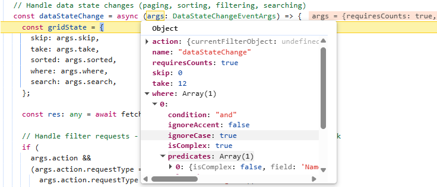
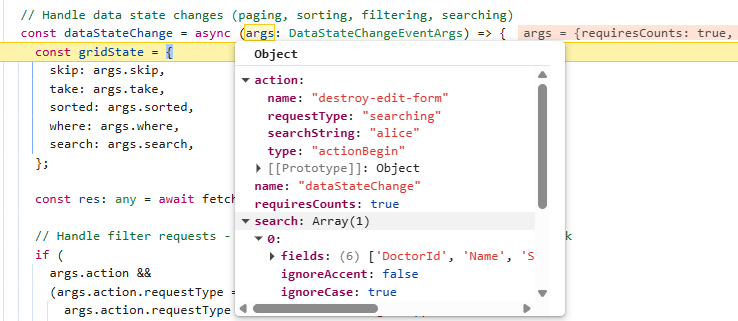
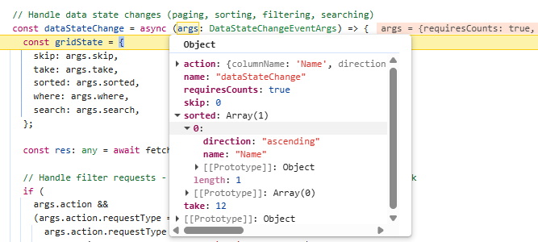
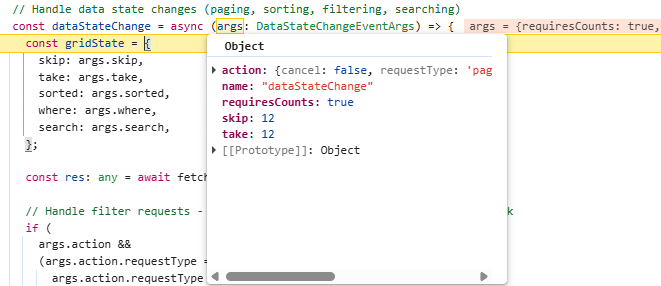
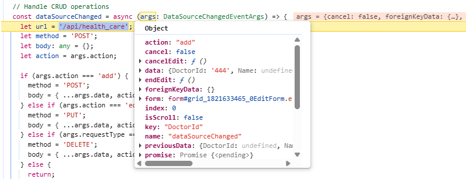
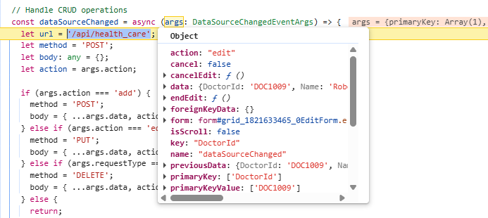
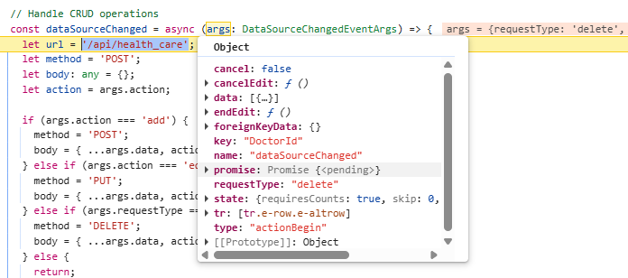

# Connecting the Syncfusion Angular Grid with Next.js backend

[Next.js](https://nextjs.org/) is a powerful Angular framework designed for building full-stack web applications. It includes built‑in features such as server‑side rendering, automatic code splitting, intuitive routing, and API routes, providing a solid foundation for developing modern, high‑performance applications.

This guide walks through integrating the Syncfusion<sup style="font-size:70%">&reg;</sup> Angular Grid with a Next.js backend, creating a hybrid architecture where the UI layer is powered fully by Angular while data operations are handled by server‑side endpoints exposed by Next.js. In this setup, the Angular application hosts the Syncfusion<sup style="font-size:70%">&reg;</sup> Grid component in the browser, and all CRUD operations, pagination, and data processing requests are routed to RESTful API handlers implemented within the Next.js server.

## Prerequisites

  - Node.js: LTS version (e.g., v20.x or later).

  - npm/yarn: For package management.

  - Angular CLI: For creating and serving the Angular client application.

## Key topics

| # | Topics                                                                                          | Link                                            |
|------|------------------------------------------------------------------------------------------------------|-------------------------------------------------|
| 1    | Create a Next.js project and install the required packages                                          | [View](#building-the-nextjs-application)          |
| 2    | Configure Next.js route handlers to create server-side API endpoints.                                | [View](#configuring-nextjs-server)                |
| 3    | Integrate Syncfusion<sup style="font-size:70%">&reg;</sup> Angular Grid with the Next.js server using the custom data binding feature        | [View](#connecting-syncfusion-angular-grid-with-nextjs) |
| 4    | Handle data operations like filtering, searching, sorting, and paging in the Grid                     | [View](#step-4-implement-data-operations-on-server-side) |
| 5    | Implement CRUD operations (Create, Read, Update, Delete) using `POST`, `GET`, `PUT`, and `DELETE` methods    | [View](#step-9-implement-crud-operations)         |
| 6    | Set up navigation to other pages using the Angular routing feature                                   | [View](#routing)                                  |
| 7    | Deploy and run the application to manage and display data efficiently in the Grid                     | [View](#running-the-application) |  


## Building the Next.js application

Open a terminal (for example, an integrated terminal in Visual Studio Code or Windows Command Prompt opened with <kbd>Win+R</kbd> or macOS terminal launched with <kbd>Cmd+Space</kbd> ) and run the following command to create and navigate to the project folder:

```bash
npm create next-app@latest next_js_server
cd next_js_server
```
Start the development server by running the below command:

```bash 
npm run dev
```
Now the project has been successfully launched, and the application is available at **http://localhost:3000**.

## Configuring Next.js server

Next.js Route handlers provide a modern way to create server-side endpoints within the App router, utilizing the Web-standard request and response APIs. They enable the execution of backend operations such as data processing, CRUD actions, and custom API creation without requiring an additional server layer.

Route handlers are defined in the **route.ts** file within the **app** directory, enabling custom request handlers for specific routes. The following steps outline the process for populating health care data entries:

**Step 1:** Create a new route file (**api/health_care/route.ts**) to implement the server-side data logic.

**Step 2:** Create a new database file (**data/health_care_Entities.ts**) to store the relevant data.

**Step 3:** Inside the **route.ts** file, add a `GET` method to return the data to the client when a request is sent. Ensure the response follows a structured format that includes both the current view dataset and the total data count. This approach supports on‑demand data loading and enables the client to handle operations such as paging or filtering effectively when using Syncfusion<sup style="font-size:70%">&reg;</sup> data binding approaches.

The required response format includes:
  - **result**: The list of data displayed in the current view, supporting on‑demand loading for large datasets.
  - **count**: The total count of records in the dataset.

```typescript
import { NextResponse, NextRequest } from "next/server";
import { doctorDetails } from '../../data/health_care_Entities';

// CORS headers configuration
const CORS_HEADERS = {
  'Access-Control-Allow-Origin': 'http://localhost:4200',
  'Access-Control-Allow-Methods': 'GET, POST, PUT, DELETE, OPTIONS',
  'Access-Control-Allow-Headers': 'Content-Type',
};

// Create a method to send responses with CORS headers
const corsResponse = (body: any, status = 200) => {
  return new NextResponse(JSON.stringify(body), {
    status,
    headers: { 'Content-Type': 'application/json', ...CORS_HEADERS },
  });
};

// Handle the preflight request for CORS
export async function OPTIONS(request: NextRequest) {
  return new NextResponse(null, { headers: CORS_HEADERS });
}

// GET - Retrieve all data
export async function GET(request: NextRequest) {

    const count = doctorDetails.length;
    const result = doctorDetails;

    return corsResponse({ result, count });
}
```

> Browsers enforce the same-origin policy, which blocks scripts from one origin (for example, the Angular application running at **http://localhost:4200**) from accessing resources on a different origin (such as a Next.js server at **http://localhost:3000**) unless the server explicitly allows it. By enabling the appropriate **CORS headers** on the Next.js backend, the Angular client can safely make API requests, perform CRUD operations, and communicate seamlessly across different ports or origins.

## Connecting Syncfusion Angular Grid with Next.js

The Syncfusion<sup style="font-size:70%">&reg;</sup> Angular Grid is a robust, high‑performance component built to efficiently display, manage, and manipulate large datasets. It provides advanced features such as sorting, filtering, and paging. Follow these steps to render the grid and integrate it with a Next.js backend.

### Step 1: Creating the Angular client application

Open a Visual Studio Code terminal or Command Prompt and run the below command to create a Angular application:

```bash
ng new angular_client
```

### Step 2: Adding Syncfusion packages

Install the necessary Syncfusion<sup style="font-size:70%">&reg;</sup> packages using the below command in Visual Studio Code terminal or Command Prompt.

```bash
npm install @syncfusion/ej2-angular-grids --save
npm install @syncfusion/ej2-data --save
```

After installation, the necessary CSS files are available in the (**../node_modules/@syncfusion**) directory. Add the required CSS references to the (**src/styles.css**) file to ensure proper styling of the Grid component.

```css
  [src/styles.css]

  @import '../node_modules/@syncfusion/ej2-base/styles/material3.css';
  @import '../node_modules/@syncfusion/ej2-buttons/styles/material3.css';  
  @import '../node_modules/@syncfusion/ej2-calendars/styles/material3.css';  
  @import '../node_modules/@syncfusion/ej2-dropdowns/styles/material3.css';  
  @import '../node_modules/@syncfusion/ej2-inputs/styles/material3.css';  
  @import '../node_modules/@syncfusion/ej2-navigations/styles/material3.css';
  @import '../node_modules/@syncfusion/ej2-popups/styles/material3.css';
  @import '../node_modules/@syncfusion/ej2-splitbuttons/styles/material3.css';
  @import "../node_modules/@syncfusion/ej2-angular-grids/styles/material3.css";
  @import "../node_modules/@syncfusion/ej2-icons/styles/material3.css";
```

For this project, the "Material 3" theme is applied. Other themes can be selected, or the existing theme can be customized to meet specific project requirements. For detailed guidance on theming and customization, refer to the [Syncfusion<sup style="font-size:70%">&reg;</sup> Angular Components Appearance](https://ej2.syncfusion.com/angular/documentation/appearance/theme-studio) documentation.


### Step 3: Add Syncfusion Angular Grid component with Next.js

The Syncfusion<sup style="font-size:70%">&reg;</sup> Angular Grid provides [custom data binding](https://ej2.syncfusion.com/angular/documentation/grid/data-binding/remote-data#custom-binding), which enables seamless integration with external API services. With this feature, the grid can fetch data from a Next.js server and efficiently display health care details. It supports search, filter, sort, and pagination capabilities, making it easy to navigate and manage large datasets.

In the created angular application, generate a component "doctors" using the below command in Visual Studio Code terminal or Command Prompt:

```bash
ng generate component doctors
```

In (**src/app/doctors/doctors.html**) file, configure the Grid with custom data binding:

```html
<ejs-grid [dataSource]="data" (dataStateChange)="dataStateChange($event)">
  <e-columns>
    <e-column field="DoctorId" headerText="Doctor ID" width="120" isPrimaryKey="true"
      [validationRules]="{ required: true }"></e-column>
    <!-- Include more columns here -->
  </e-columns>
</ejs-grid>
```

In (**src/app/doctors/doctors.ts**) file, define the logic for custom data binding:

```ts
import { Component } from '@angular/core';
import { DataStateChangeEventArgs, GridModule, GridComponent } from '@syncfusion/ej2-angular-grids';

@Component({
  selector: 'app-doctors',
  standalone: true,
  imports: [GridModule],
  templateUrl: './doctors.html',
  styleUrls: ['./doctors.css'],
})
export class Doctors {
  public data!: Object[];

  @ViewChild('grid') public gridInstance!: GridComponent;

  // Fetch grid data from back-end, passing current state
  async fetchData(gridState: any) {
    const encodedState = encodeURIComponent(JSON.stringify(gridState));
    const url = `http://localhost:3000/api/health_care?gridState=${encodedState}`;
    const response = await fetch(url, { method: 'GET', headers: { 'Content-Type': 'application/json' } });
    return await response.json();
  }

  ngOnInit(): void {
    // Load initial data when component initializes
    const initialState = { skip: 0, take: 12, sorted: [], where: [], search: [] };
    this.fetchData(initialState).then(res => this.data = res);
  }

  async dataStateChange(args: DataStateChangeEventArgs) {
    const gridState = { skip: args.skip, take: args.take, sorted: args.sorted, where: args.where, search: args.search };
    this.fetchData(gridState).then((res) => {
      this.gridInstance.dataSource = res;
    });
  }
}
```

**Custom data binding workflow**:

The Syncfusion<sup style="font-size:70%">&reg;</sup> Angular Grid supports custom data binding, enabling seamless integration with external API services. When Grid actions such as paging, sorting, filtering, or CRUD operations are performed, requests are sent to the API. The API processes these operations and returns the results in the required format, giving complete control over application‑specific workflows and enabling efficient handling of large datasets. The custom data binding feature can interact with backend APIs through two key events.

- [dataStateChange](https://ej2.syncfusion.com/angular/documentation/api/grid/index-default#datastatechange): Triggered when the Grid performs actions such as paging, sorting, or filtering. It provides the current state details, which are sent to the API so the request can be processed and data returned in the required "{ result:[], count:100 }" format.

- [dataSourceChanged](https://ej2.syncfusion.com/angular/documentation/api/grid/index-default#datasourcechanged): Triggered during CRUD operations. (Create, Update, Delete). It provides the affected record along with the action type, which is sent to the API to execute the corresponding insert, update, or delete operation.

Since the `dataStateChange` event does not fire on the first render, use the Angular initialization method (`ngOnInit`) to load the initial dataset when the component initializes. Implement a reusable "fetchData" function that posts the current grid state to the Next.js API and binds the returned result to the grid.

**API response format:**

  The Grid custom data binding feature expects the following response from the backend:

```ts
  { "result": [ /* records to display */ ], "count": 100 }
```

This format has already been implemented in the **route.ts** file during the Next.js server setup. 

### Step 4: Implement data operations on server-side

In a Next.js server environment, the Syncfusion<sup style="font-size:70%">&reg;</sup> [DataManager](https://ej2.syncfusion.com/angular/documentation/data/getting-started) efficiently handles data operations such as filtering, sorting, searching, paging. It processes the Syncfusion<sup style="font-size:70%">&reg;</sup> DataManager [Query](https://ej2.syncfusion.com/angular/documentation/data/querying), which specifies all operation details, and executes them directly against the data source. By streamlining these tasks, DataManager ensures consistent, accurate results and significantly reduces development effort and time.

Inside the (**api/health_care/route.ts**) file, import the `DataManager` and `Query` from the `@syncfusion/ej2-data` package to implement the data operations using the Syncfusion<sup style="font-size:70%">&reg;</sup> DataManager.

```typescript
//[route.ts]
  import { NextResponse, NextRequest } from "next/server";
  import { DataManager, Query } from '@syncfusion/ej2-data';
  import { doctorDetails } from '../../data/health_care_Entities';

  // GET - Retrieve the resultant data
  export async function GET(request: NextRequest) {

    const gridStateParam = new URL(request.url).searchParams.get('gridState');
    const gridState = JSON.parse(decodeURIComponent(gridStateParam));
    const query = new Query();

    // Execute query on data
    let result: object[] = new DataManager(doctorDetails).executeLocal(query);
    let count: number = result.length;

    return corsResponse({ result, count });
  }
```

In this application, the Grid communicates with the Next.js  server through the `dataStateChange` event. The complete code example below demonstrates managing filtering, searching, sorting, and paging using this event.

```ts
  // Syncfusion Grid data state change handler (paging, sorting, filtering, searching)
  async dataStateChange(args: DataStateChangeEventArgs) {
    const gridState = {
      skip: args.skip,
      take: args.take,
      sorted: args.sorted,
      where: args.where,
      search: args.search,
    };

    const res: any = await this.fetchData(gridState);

    if (
      args.action &&
      (args.action.requestType === 'filterchoicerequest' ||
        args.action.requestType === 'filtersearchbegin' ||
        args.action.requestType === 'stringfilterrequest')
    ) {
      // For filter dialog data
      args.dataSource(res.result);
    } else {
      // For paging, sorting and other data actions
      this.gridInstance.dataSource  = res;
    }
  }
```

### Step 5: Implement filtering feature

The Grid supports filtering through a menu interface that restricts data based on column values. Filtering is enabled by setting the [allowFiltering](https://ej2.syncfusion.com/angular/documentation/api/grid/index-default#allowfiltering) property to `true` and injecting the `FilterService` module into the `providers` property.  

```ts
import { FilterService } from '@syncfusion/ej2-angular-grids'

@Component({
  providers: [FilterService],
})

export class Doctors {
  public filterSettings: Object = { type: 'Excel' };
}
```

```html
<ejs-grid #grid [dataSource]="data" [allowFiltering]="true" [filterSettings]="filterSettings"
  (dataStateChange)="dataStateChange($event)">
  <e-columns>
    <e-column field="DoctorId" headerText="Doctor ID" width="120" isPrimaryKey="true"
      [validationRules]="{ required: true }"></e-column>
      <!-- Include additional columns here -->
  </e-columns>
</ejs-grid>
```

The [implement data operations](#step-3-implement-data-operations-on-server-side) section already includes a code example that sends filter parameters from the Grid to the Next.js server using the `dataStateChange` event handler. When filtering is applied in the Grid, the `dataStateChange` event provides the current filter details through its `where` parameter. 

The image below illustrates the filter state being passed to the `where` property of the `dataStateChange` event arguments.



The following code example demonstrates handling the filter action in the server file **route.ts** based on the Grid request.

```typescript
import { Predicate } from '@syncfusion/ej2-data';
import { NextResponse, NextRequest } from "next/server";
import { DataManager, Query } from '@syncfusion/ej2-data';
import { doctorDetails } from '../../data/health_care_Entities';

// GET - Retrieve the resultant data
export async function GET(request: NextRequest) {

  const gridStateParam = new URL(request.url).searchParams.get('gridState');
  const gridState = JSON.parse(decodeURIComponent(gridStateParam));
  const query = new Query();

  // Filtering
  if (gridState.where && Array.isArray(gridState.where) && gridState.where.length > 0) {
    performFiltering(gridState.where, query);
  }

  // Execute query on data
  let result: object[] = new DataManager(doctorDetails).executeLocal(query);
  let count: number = result.length;

  return corsResponse({ result, count });
}
```

Complex filter conditions, where multiple predicates are combined with logical operators such as **and** or **or**, can be handled using the following helper functions in the server file **route.ts**:

```typescript
// Normalize condition string (default to 'and')
const normalize = (condition?: string) => (condition || 'and').toLowerCase();

// Recursively build predicate tree
const buildPredicate = (node: any, ignoreCase: boolean): any =>
  node?.isComplex && node.predicates?.length
    ? node.predicates
      .map((p: Predicate) => buildPredicate(p, ignoreCase))
      .filter(Boolean)
      .reduce((acc: any, cur: any) =>
        acc ? (normalize(node.condition) === 'or' ? acc.or(cur) : acc.and(cur)) : cur, null)
    : (node?.field && node?.operator ? new Predicate(node.field, node.operator, node.value, ignoreCase) : null);

// Apply filtering based on predicates
const performFiltering = (input: any, query: Query) => {
  const filter = Array.isArray(input) ? input[0] : input;
  if (!filter?.predicates?.length) return;
  const ignoreCase = filter.ignoreCase !== undefined ? !!filter.ignoreCase : true;
  const condition = normalize(filter.condition);
  const combined = filter.predicates
    .map((p: Predicate) => buildPredicate(p, ignoreCase))
    .filter(Boolean)
    .reduce((acc: any, cur: any) => acc ? (condition === 'or' ? acc.or(cur) : acc.and(cur)) : cur, null);
  if (combined) query.where(combined);
};

```
  
### Step 6: Implement searching feature 

The search feature in the Grid allows records to be located and filtered using keywords. It scans all visible columns and displays only the matching rows, making it easier to locate specific information within large datasets. The searching feature in the Grid is enabled by adding `Search` to the Grid’s [toolbar](https://ej2.syncfusion.com/angular/documentation/api/grid/index-default#toolbar) items and injecting the `ToolbarService` module into the `providers` property.

```ts
import { ToolbarService } from '@syncfusion/ej2-angular-grids'

@Component({
  providers: [ToolbarService],
})

export class Doctors {
  public toolbar: string[] = ['Search'];
}
```

```html
<ejs-grid #grid [dataSource]="data" [toolbar]="toolbar" (dataStateChange)="dataStateChange($event)">
  <e-columns>
    <e-column field="DoctorId" headerText="Doctor ID" width="120" isPrimaryKey="true"
      [validationRules]="{ required: true }"></e-column>
      <!-- Include additional columns here -->
  </e-columns>
</ejs-grid>
```

The [implement data operations](#step-3-implement-data-operations-on-server-side) section already includes a code example that sends search parameters from the Grid to the Next.js server using the `dataStateChange` event handler. When searching is applied in the Grid, the `dataStateChange` event provides the current search details through its `search` parameter. 

The image below illustrates the search state being passed to the `search` property of the `dataStateChange` event arguments.



The following code example demonstrates handling the search action inside the server **route.ts** file based on the Grid request:
 
```typescript
import { NextResponse, NextRequest } from "next/server";
import { DataManager, Query } from '@syncfusion/ej2-data';
import { doctorDetails } from '../../data/health_care_Entities';

// Helper function: Apply search functionality
const performSearching = (searchParam: any, query: Query) => {
  const { fields, key, operator, ignoreCase } = searchParam[0];
  query.search(key, fields, operator, ignoreCase);
};

// GET - Retrieve the resultant data
export async function GET(request: NextRequest) {

  const gridStateParam = new URL(request.url).searchParams.get('gridState');
  const gridState = JSON.parse(decodeURIComponent(gridStateParam));
  const query = new Query();

  // Searching
  if (gridState.search && Array.isArray(gridState.search) && gridState.search.length > 0) {
    performSearching(gridState.search, query);
  }

  // Execute query on data
  let result: object[] = new DataManager(doctorDetails).executeLocal(query);
  let count: number = result.length;

  return corsResponse({ result, count });
}
```

### Step 7: Implement sorting feature

The sorting feature in the Grid allows records to be organized in ascending or descending order based on one or more columns. It can be enabled by setting the [allowSorting](https://ej2.syncfusion.com/angular/documentation/api/grid/index-default#allowsorting) property to `true` and injecting the `SortService` module into the `providers` property.

```ts
import { SortService } from '@syncfusion/ej2-angular-grids'

@Component({
  providers: [SortService],
})

export class Doctors {

}
```

```html
<ejs-grid #grid [dataSource]="data" [allowSorting]="true" (dataStateChange)="dataStateChange($event)">
  <e-columns>
    <e-column field="DoctorId" headerText="Doctor ID" width="120" isPrimaryKey="true"
      [validationRules]="{ required: true }"></e-column>
      <!-- Include additional columns here -->
  </e-columns>
</ejs-grid>
```

The [implement data operations](#step-3-implement-data-operations-on-server-side) section already includes a code example that sends sort parameters from the Grid to the Next.js server using the `dataStateChange` event handler. When sorting is applied in the Grid, the `dataStateChange` event provides the current sort details through its `sorted` parameter.

The image below illustrates the sort state being passed to the `sorted` property of the `dataStateChange` event arguments.



The following code example demonstrates handling the sort action inside the server **route.ts** file based on the Grid request:

```typescript
import { NextResponse, NextRequest } from "next/server";
import { DataManager, Query } from '@syncfusion/ej2-data';
import { doctorDetails } from '../../data/health_care_Entities';

// Helper function: Apply sorting
const performSorting = (sortArray: any[], query: Query) => {
  for (let i = 0; i < sortArray.length; i++) {
    const { name, direction } = sortArray[i];
    query.sortBy(name, direction);
  }
};

// GET - Retrieve the resultant data
export async function GET(request: NextRequest) {

  const gridStateParam = new URL(request.url).searchParams.get('gridState');
  const gridState = JSON.parse(decodeURIComponent(gridStateParam));
  const query = new Query();

  // Sorting
  if (gridState.sorted && Array.isArray(gridState.sorted) && gridState.sorted.length > 0) {
    performSorting(gridState.sorted, query);
  }

  // Execute query on data
  let result: object[] = new DataManager(doctorDetails).executeLocal(query);
  let count: number = result.length;

  return corsResponse({ result, count });
}
```
  
### Step 8: Implement paging feature

The paging feature allows efficient loading of large data sets through on‑demand loading. Paging in the Grid is enabled by setting the [allowPaging](https://ej2.syncfusion.com/angular/documentation/api/grid/index-default#allowpaging) property to `true` and injecting the `PageService` module into the `providers` property. This sends parameters to fetch only the data required for the current viewport.

```ts
[doctors/doctors.ts]

import { PageService } from '@syncfusion/ej2-angular-grids'

@Component({
  providers: [PageService],
})

export class Doctors {

}
```

```html
[doctors/doctors.html]

<ejs-grid #grid [dataSource]="data" [allowPaging]="true" (dataStateChange)="dataStateChange($event)">
  <e-columns>
    <e-column field="DoctorId" headerText="Doctor ID" width="120" isPrimaryKey="true"
      [validationRules]="{ required: true }"></e-column>
      <!-- Include additional columns here -->
  </e-columns>
</ejs-grid>
```

The [implement data operations](#step-3-implement-data-operations-on-server-side) section already includes a code example that sends page parameters from the Grid to the Next.js server using the `dataStateChange` event handler. When paging is applied in the Grid, the `dataStateChange` event provides the current page details through its `skip` and `take` parameter. 

The image below illustrates the page state being passed to the `skip` and `take` property of the `dataStateChange` event arguments.



The following code example demonstrates handling the paging action inside the server **route.ts** file based on the Grid request:

```typescript
import { NextResponse, NextRequest } from "next/server";
import { DataManager, Query } from '@syncfusion/ej2-data';
import { doctorDetails } from '../../data/health_care_Entities';

// GET - Retrieve the resultant data
export async function GET(request: NextRequest) {

  const gridStateParam = new URL(request.url).searchParams.get('gridState');
  const gridState = JSON.parse(decodeURIComponent(gridStateParam));
  const query = new Query();

  // Execute query on data
  let result: object[] = new DataManager(doctorDetails).executeLocal(query);
  let count: number = result.length;

  // Paging
  if (gridState.take && gridState.take > 0) {
    const skip = gridState.skip || 0;
    const take = gridState.take;
    query.page(skip / take + 1, take);
    result = new DataManager(result).executeLocal(query);
  }

  return corsResponse({ result, count });
}
```
  
### Step 9: Implement CRUD operations

Editing operations in the Grid are enabled through custom data binding by configuring the editSettings properties (`allowEditing`, `allowAdding`, and `allowDeleting`) to `true` and injecting the `EditService` module into the `providers` property. The `dataSourceChanged` event must be included in the Grid component to send CRUD requests to the Next.js server. During a CRUD operation, this event is triggered and provides the necessary parameters to the server for processing create, update, or delete actions.

Grid data requires a primary key to modify row data based on the database’s unique values. To enable this, configure a primary key by setting the [isPrimaryKey](https://ej2.syncfusion.com/angular/documentation/api/grid/column#isprimarykey) property must be set to `true` on the column that contains unique values.

```ts
[doctors/doctors.ts]

import { EditService } from '@syncfusion/ej2-angular-grids'

@Component({
  providers: [ EditService ],
})

export class Doctors {
  public editSettings: Object = {allowEditing: true, allowAdding: true, allowDeleting: true, mode: 'Normal'};
  // Handle CRUD operations
  async dataSourceChanged(args: DataSourceChangedEventArgs) {
    // Handle CRUD operations here 
  };
}
```

```html
[doctors/doctors.html]

<ejs-grid #grid [dataSource]="data" (dataSourceChanged)="dataSourceChanged($event)" [editSettings]="editSettings">
  <e-columns>
    <e-column field="DoctorId" headerText="Doctor ID" width="120" isPrimaryKey="true"
      [validationRules]="{ required: true }"></e-column>
      <!-- Include additional columns here -->
  </e-columns>
</ejs-grid>
```
 
**Server‑side insert operation handling**:

In the **route.ts** file, define the `POST` method to manage the creation of new records. This method accepts the new data provided by the Grid and performs the insertion into the database.

```ts
// POST - Create a new data
export async function POST(request: NextRequest) {
    const body = await request.json();
    if (body.action === 'add') {
        const newDoctor: any = {
            DoctorId: body.DoctorId,
            Name: body.Name,
            Specialty: body.Specialty,
            Experience: body.Experience,
            Availability: body.Availability,
            Email: body.Email,
            Contact: body.Contact
        };
        doctorDetails.push(newDoctor);
        return corsResponse(newDoctor, 201);
    }
}
```

The `dataSourceChanged` event handler in the **doctors.ts** file is responsible for sending an asynchronous request to the server based on the Grid’s add record details provided in the event arguments. Once the server (`POST`) method response is received, the `endEdit` method is invoked within the `dataSourceChanged` event to complete the Grid operation.

The image illustrates the newly inserted data passed to the server through the `dataSourceChanged` event arguments in the Grid:



```ts
 // Handle CRUD operations
   async dataSourceChanged(args: DataSourceChangedEventArgs) {
      const response = fetch('http://localhost:3000/api/health_care', {
        'POST',
        headers: { 'Content-Type': 'application/json' },
        body: JSON.stringify({ ...args.data, action: 'add' }),
      });

    if (response.ok) {
      const result = await response.json();
      args.endEdit();
    }
  };
```

**Server‑side update operation handling**:

In the **route.ts** file, define the `PUT` method to manage updates for an existing record. This method accepts the updated data from the Grid and applies the changes to the database.

```ts
// PUT - Update an existing data
export async function PUT(request: NextRequest) {
    const body = await request.json();
    if (body.action === 'edit') {
        const doctorIndex = doctorDetails.findIndex(u => u.DoctorId === body.DoctorId);
        if (doctorIndex === -1) {
            return NextResponse.json(
                { error: "Doctor not found" },
                { status: 404 }
            );
        }
        doctorDetails[doctorIndex] = {
            ...doctorDetails[doctorIndex],
            Name: body.Name || doctorDetails[doctorIndex].Name,
            Specialty: body.Specialty || doctorDetails[doctorIndex].Specialty,
            Experience: body.Experience || doctorDetails[doctorIndex].Experience,
            Availability: body.Availability || doctorDetails[doctorIndex].Availability,
            Email: body.Email || doctorDetails[doctorIndex].Email,
            Contact: body.Contact || doctorDetails[doctorIndex].Contact
        };
        return NextResponse.json(doctorDetails[doctorIndex]);
    }
}
```

The `dataSourceChanged` event handler in the **doctors.ts** file is responsible for sending an asynchronous request to the server based on the Grid’s update record details provided in the event arguments. Once the server (`PUT`) method response is received, the `endEdit` method is invoked within the `dataSourceChanged` event to complete the Grid operation.

The image illustrates the updated data passed to the server through the `dataSourceChanged` event arguments in the Grid:




```ts
  // Handle CRUD operations
  async dataSourceChanged(args: DataSourceChangedEventArgs) {
    const response = fetch('http://localhost:3000/api/health_care', {
        'PUT',
        headers: { 'Content-Type': 'application/json' },
        body: JSON.stringify({ ...args.data, action: 'edit' }),
    });

    if (response.ok) {
        const result = await response.json();
        args.endEdit();
    }
  };
```

**Server‑side delete operation handling**:

In the **route.ts** file, define the `DELETE` method to handle the removal of existing records. This method receives the primary key value from the client and deletes the corresponding record from the database.

```ts
// DELETE - Delete a data
export async function DELETE(request: NextRequest) {
    const body = await request.json();
    if (body.action === 'delete') {
        const doctorID = body[0].DoctorId;
        const doctorIndex = doctorDetails.findIndex(u => u.DoctorId === doctorID);
        const deletedDoctor = doctorDetails[doctorIndex];
        doctorDetails.splice(doctorIndex, 1);
        return corsResponse({ message: "Doctor deleted" });
    }
}
```

The `dataSourceChanged` event handler in the **doctors.ts** file is responsible for sending an asynchronous request to the server based on the Grid’s delete record details provided in the event arguments. Once the server (`DELETE`) method response is received, the `endEdit` method is invoked within the `dataSourceChanged` event to complete the Grid operation.

The image illustrates the deleted data passed to the server through the `dataSourceChanged` event arguments in the Grid:



```ts
// Handle CRUD operations
async dataSourceChanged(args: DataSourceChangedEventArgs) {
  const response = fetch('http://localhost:3000/api/health_care', {
    'DELETE',
    headers: { 'Content-Type': 'application/json' },
    body: JSON.stringify({ ...args.data, action: 'delete' }),
  });

  if (response.ok) {
    const result = await response.json();
    args.endEdit();
  }
};
```

## Routing

Next.js uses a file‑system‑based router to manage navigation, primarily through the modern **App Router**.

In this application, routing is used to display the appointment details of doctors. When the "View Appointment Details" button in the Doctors portal is clicked, the selected "DoctorId" is passed as a router parameter. The patients assigned to that doctor are then displayed on a separate page.

**Step 1:** Configure the Doctors portal page with a template column. Enable routing to the appointment details page when the button inside the template column is clicked, and pass "DoctorID" as the router parameter.

```ts
import { Router } from '@angular/router';

export class Doctors {
  @ViewChild('grid') public gridInstance!: GridComponent;
  private router = inject(Router);
  // Navigate to patients for the selected doctor
  btnClick(event: MouseEvent) {
    const currentRowInfo: RowInfo = this.gridInstance.getRowInfo(event.target as HTMLElement);
    const doctorID = (currentRowInfo.rowData as any).DoctorId;
    this.router.navigate(['patients'], {
      queryParams: { doctorID },
    });
  }
}
```

```html
<ejs-grid #grid [dataSource]="data">
  <e-columns>
    <e-column headerText="Appointments" width="150" [allowEditing]="false">
      <ng-template #template let-data>
        <button ejs-button (click)="btnClick($event)">View Appointments</button>
      </ng-template>
    </e-column>
      <!-- Include additional columns here -->
  </e-columns>
</ejs-grid>
```

**Step 2:** Create the Patients Component

Generate a new Angular component named "patients":

```bash
ng generate component patients
```

**Step 3:** Add the code for the Grid containing appointment details inside the dynamic component (**src/app/patients/patients.html**).

```html
<ejs-grid #grid [dataSource]="data" [query]="query">
  <e-columns>
    <e-column field="PatientId" headerText="Patient ID" width="120" isPrimaryKey="true"></e-column>
    <!-- Include additional columns here -->
  </e-columns>
</ejs-grid>

```

**Step 4:** Retrieve the router parameters and pass the "DoctorId" to the query property of the Grid. This ensures that only the patients associated with the current doctor are fetched and displayed.

```ts
import { patientData } from '../data/health_care_Entities';
import { Router, ActivatedRoute } from '@angular/router';
import { Query } from '@syncfusion/ej2-data';
import { inject } from '@angular/core'

export class Patients {
  public data: object[] = patientData;
  private router = inject(Router);
  private route = inject(ActivatedRoute);
  ngOnInit(): void {
    // Read doctorID from query params
    this.route.queryParams.subscribe((params) => {
      this.doctorID = params['doctorID'] || '';
      // Apply filter based on router parameter
      this.query = new Query().where('DoctorAssigned', 'equal', this.doctorID, true);
    });
  }
}
```

## Running the application

Open a terminal in Visual Studio Code or use the Command Prompt. Start the server application first, and then launch the client application.

 Run the following commands to start the server:

```bash
cd next_js_server
npm run dev
```

The server is now running at **http://localhost:3000**.

Execute the below commands to run the client application:

```bash
cd angular_client
ng serve
```

Open **http://localhost:4200** in the browser.

## Complete sample repository

A complete, working sample implementation is available in the [GitHub](https://github.com/SyncfusionExamples/ej2-angular-grid-samples/tree/master/connecting-to-backends/syncfusion-angular-grid-with-nextjs-server) repository.
  
The application now provides a complete solution for integrating the Syncfusion<sup style="font-size:70%">&reg;</sup> Angular Grid with Next.js server, enabling seamless data operations with a modern, user-friendly interface.

## See also

  - [Types of editing](https://ej2.syncfusion.com/angular/documentation/grid/editing/edit-types)
  - [Validation rules](https://ej2.syncfusion.com/angular/documentation/grid/editing/validation)
  - [Filter menu](https://ej2.syncfusion.com/angular/documentation/grid/filtering/filter-menu)