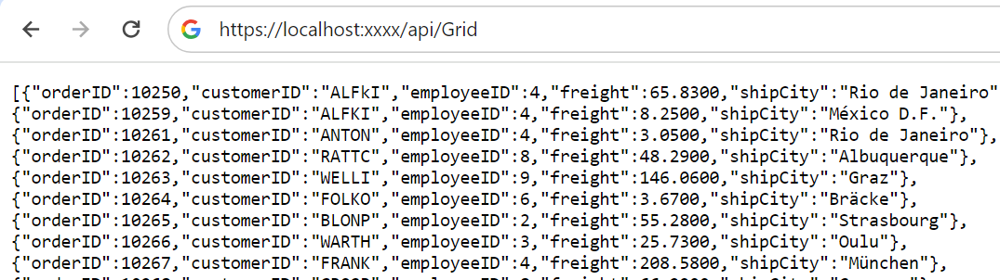
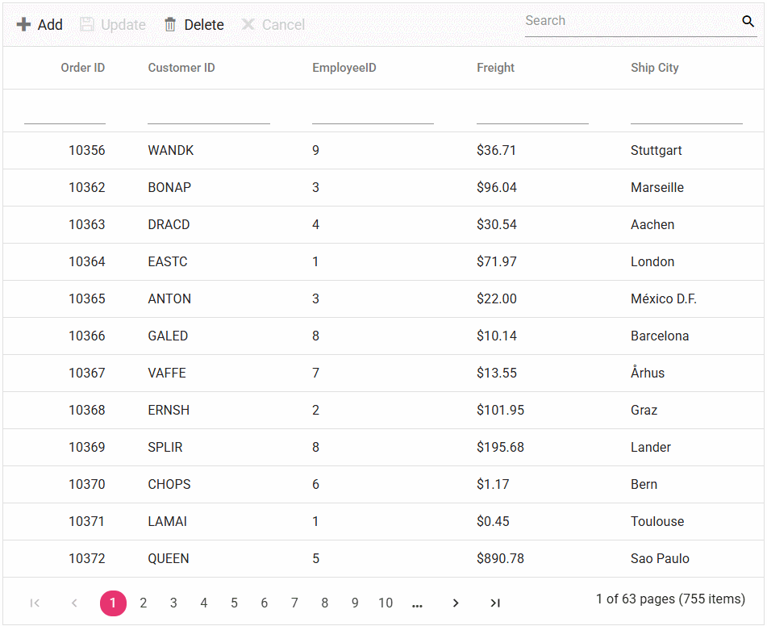

# Connect MySQL Server Data to Syncfusion Angular Grid

This section explains how to connect and retrieve data from a MySQL Server database using [MySQL.Data](https://www.nuget.org/packages/MySql.Data), and bind it to the Syncfusion Angular Grid component.

A MySQL Server database can be bound to the Grid in several ways, including the [dataSource](https://ej2.syncfusion.com/angular/documentation/api/grid/#datasource) property, custom adaptor, and remote data binding via various adaptors. Two approaches are demonstrated in this documentation, both supporting full data and CRUD handling using built-in or custom logic.

**1. Using UrlAdaptor**

The [UrlAdaptor](https://ej2.syncfusion.com/angular/documentation/grid/connecting-to-adaptors/url-adaptor?cs-save-lang=1&cs-lang=csharp) is the base adaptor for remote data service communication, enabling the remote binding of data to the Syncfusion Angular Grid by connecting to a pre-configured API service linked to MySQL Server. Other adaptors—such as [Web API](https://ej2.syncfusion.com/angular/documentation/grid/connecting-to-adaptors/web-api-adaptor), [ODataV4](https://ej2.syncfusion.com/angular/documentation/grid/connecting-to-adaptors/odatav4-adaptor), and [GraphQL](https://ej2.syncfusion.com/angular/documentation/grid/connecting-to-adaptors/graphql-adaptor)—are also supported. The `UrlAdaptor` is particularly useful for scenarios involving a custom API service that controls data and CRUD logic, returning Grid-compatible responses with `result` and `count` properties.

**2. Using CustomAdaptor**

The [CustomAdaptor](https://ej2.syncfusion.com/angular/documentation/grid/connecting-to-adaptors/custom-adaptor) acts as a bridge between the Grid UI and the database. While you can bind the database directly to the Grid via the `dataSource` property, the CustomAdaptor is optimal for fully customizing data and CRUD logic. Each Grid action triggers a request to the CustomAdaptor, where operations like **searching**, **filtering**, **sorting**, **aggregation**, **paging**, and **grouping** can be performed using built-in or custom logic. All responses must use the `result` and `count` format for Grid integration. CRUD logic can be overridden as required.

## Bind Data from MySQL Server Using an API Service

This section presents a step-by-step process for retrieving data from a MySQL Server through an API service and binding it to the Syncfusion Angular Grid.

### Creating an API Service

**1.** Use Visual Studio to create a new Angular & ASP.NET Core project called **Grid_MySQL**. Refer to [this Visual Studio guide](https://learn.microsoft.com/en-us/visualstudio/javascript/tutorial-asp-net-core-with-angular?view=vs-2022) for details.

**2.** Install the [MySql.Data](https://www.nuget.org/packages/MySql.Data) NuGet package in your backend using the NuGet Package Manager (Tools → NuGet Package Manager → Manage NuGet Packages for Solution).

**3.** Add an API controller (e.g., GridController.cs) in the **Controllers** folder to facilitate data exchange with the Grid.

**4.** In the controller, connect to MySQL Server within a **GetOrderData()** method using **MySqlConnection**. Use **MySqlCommand** and **MySqlDataAdapter** to execute a SQL query and populate results into a **DataTable**; map the rows to a list of `Orders` objects for the Grid.




using Microsoft.AspNetCore.Mvc;
using MySql.Data.MySqlClient;
using System.ComponentModel.DataAnnotations;
using System.Data;
using Syncfusion.EJ2.Base;

namespace Grid_MySQL.Server.Controllers
{
  [ApiController]
  public class GridController : ControllerBase
  {
    string ConnectionString = @"<Enter a valid connection string>";

    /// <summary>
    /// Processes the DataManager request to perform searching, filtering, sorting, and paging operations.
    /// </summary>
    /// <param name="DataManagerRequest">Contains the details of the data operation requested.</param>
    /// <returns>Returns a JSON object along with the total record count.</returns>
    [HttpPost]
    [Route("api/[controller]")]
    public object Post([FromBody] DataManagerRequest DataManagerRequest)
    {
      // Retrieve data from the data source (e.g., database).
      IQueryable<Orders> DataSource = GetOrderData().AsQueryable();

      // Get the total count of records.
      int totalRecordsCount = DataSource.Count();

      // Return data based on the request.
      return new { result = DataSource, count = totalRecordsCount };
    }

    /// <summary>
    /// Retrieves the order data from the database.
    /// </summary>
    /// <returns>Returns a list of orders fetched from the database.</returns>
    [HttpGet]
    [Route("api/[controller]")]
    public List<Orders> GetOrderData()
    {
      // Define the SQL query to retrieve all records from the orders table, ordered by OrderID.
      string queryStr = "SELECT * FROM orders ORDER BY OrderID";

      // Create a MySqlConnection object using the connection string.
      MySqlConnection sqlConnection = new(ConnectionString);

      // Open the database connection to allow executing SQL commands.
      sqlConnection.Open();

      // Initialize the MySqlCommand object with the SQL query and the connection object.
      MySqlCommand SqlCommand = new(queryStr, sqlConnection);

      // Initialize the MySqlDataAdapter, which acts as a bridge between the database and DataTable.
      MySqlDataAdapter DataAdapter = new(SqlCommand);

      // Create an empty DataTable object to store the retrieved data.
      DataTable DataTable = new();

      // Using MySqlDataAdapter, process the query string and fill the data into the dataset.
      DataAdapter.Fill(DataTable);

      // Close the database connection after executing the query.
      sqlConnection.Close();

      //Cast the data fetched from MySqlDataAdapter to List.<T>
      List<Orders> dataSource = (from DataRow Data in DataTable.Rows
        select new Orders()
        {
          OrderID = Convert.ToInt32(Data["OrderID"]),
          CustomerID = Data["CustomerID"].ToString(),
          EmployeeID = Convert.ToInt32(Data["EmployeeID"]),
          ShipCity = Data["ShipCity"].ToString(),
          Freight = Convert.ToDecimal(Data["Freight"])
        }).ToList();
        return dataSource;
      }

      public class Orders
      {
        [Key]
        public int? OrderID { get; set; }
        public string? CustomerID { get; set; }
        public int? EmployeeID { get; set; }
        public decimal? Freight { get; set; }
        public string? ShipCity { get; set; }
      }
    }
}




**5.** Run the application; it will be hosted at a URL like `https://localhost:xxxx`.

**6.** The API endpoint providing data is at `https://localhost:xxxx/api/Grid`.



### Connecting Syncfusion Angular Grid to the API Service

To bind the Syncfusion Angular Grid to the API service in your Angular app:

**Step 1: Install Syncfusion Packages**

Open the terminal in the client folder and run:

```bash
npm install @syncfusion/ej2-angular-grids --save
npm install @syncfusion/ej2-data --save
```

**Step 2: Import Grid Module**

Import and register **GridModule** in your Angular application's main module.

**Step 3: Add CSS References**

Include Syncfusion stylesheets in your `styles.css`:



@import '../node_modules/@syncfusion/ej2-base/styles/material.css';
@import '../node_modules/@syncfusion/ej2-buttons/styles/material.css';
@import '../node_modules/@syncfusion/ej2-calendars/styles/material.css';
@import '../node_modules/@syncfusion/ej2-dropdowns/styles/material.css';
@import '../node_modules/@syncfusion/ej2-inputs/styles/material.css';
@import '../node_modules/@syncfusion/ej2-navigations/styles/material.css';
@import '../node_modules/@syncfusion/ej2-popups/styles/material.css';
@import '../node_modules/@syncfusion/ej2-splitbuttons/styles/material.css';
@import '../node_modules/@syncfusion/ej2-angular-grids/styles/material.css';



**2.** In your component file (e.g., app.component.ts), import `DataManager` and `UrlAdaptor` from `@syncfusion/ej2-data`. Create a [DataManager](https://ej2.syncfusion.com/angular/documentation/data/getting-started) instance specifying the URL of your API endpoint(https:localhost:xxxx/api/Grid) using the `url` property and set the adaptor `UrlAdaptor`.

**3.** The `DataManager` offers multiple adaptor options to connect with remote database based on an API service. Below is an example of the `UrlAdaptor` configuration where an API service are set up to return the resulting data in the `result` and `count` format.

**4.** The `UrlAdaptor` acts as the base adaptor for interacting with remote data service. Most of the built-in adaptors are derived from the `UrlAdaptor`.




import { Component, ViewChild } from '@angular/core';
import { DataManager, UrlAdaptor } from '@syncfusion/ej2-data';
import { GridComponent, GridModule } from '@syncfusion/ej2-angular-grids';

@Component({
  selector: 'app-root',
  templateUrl: './app.component.html',
  standalone: true,
  imports: [GridModule],
})
export class AppComponent {
  @ViewChild('grid') public grid?: GridComponent;
  public data?: DataManager;

  public ngOnInit(): void {
    this.data = new DataManager({
      url:'https://localhost:xxxx/api/Grid', // Here xxxx represents the port number.
      adaptor: new UrlAdaptor()
    });
  }
}




<ejs-grid #grid [dataSource]='data' height="348px">
  <e-columns>
      <e-column field='OrderID' headerText='Order ID' width='120' textAlign='Right'></e-column>
      <e-column field='CustomerID' headerText='Customer ID' width='160'></e-column>
      <e-column field='EmployeeID' headerText='Employee ID' width='160' textAlign='Right' ></e-column>
      <e-column field='Freight' headerText='Freight' format="C2" width='160' textAlign='Right'></e-column>
      <e-column field='ShipCity' headerText='Ship City' width='150'></e-column>
  </e-columns>
</ejs-grid>




using Microsoft.AspNetCore.Mvc;
using MySql.Data.MySqlClient;
using System.ComponentModel.DataAnnotations;
using System.Data;
using Syncfusion.EJ2.Base;

namespace Grid_MySQL.Server.Controllers
{
  [ApiController]
  public class GridController : ControllerBase
  {
    string ConnectionString = @"<Enter a valid connection string>";

    /// <summary>
    /// Processes the DataManager request to perform searching, filtering, sorting, and paging operations.
    /// </summary>
    /// <param name="DataManagerRequest">Contains the details of the data operation requested.</param>
    /// <returns>Returns a JSON object with the filtered, sorted, and paginated data along with the total record count.</returns>
    [HttpPost]
    [Route("api/[controller]")]
    public object Post([FromBody] DataManagerRequest DataManagerRequest)
    {
      // Retrieve data from the data source (e.g., database).
      IQueryable<Orders> DataSource = GetOrderData().AsQueryable();

      // Get the total count of records.
      int totalRecordsCount = DataSource.Count();

      // Return data based on the request.
      return new { result = DataSource, count = totalRecordsCount };
    }

    /// <summary>
    /// Retrieves the order data from the database.
    /// </summary>
    /// <returns>Returns a list of orders fetched from the database.</returns>
    [HttpGet]
    [Route("api/[controller]")]
    public List<Orders> GetOrderData()
    {
      // Define the SQL query to retrieve all records from the orders table, ordered by OrderID.
      string queryStr = "SELECT * FROM orders ORDER BY OrderID";

      // Create a MySqlConnection object using the connection string.
      MySqlConnection sqlConnection = new(ConnectionString);

      // Open the database connection to allow executing SQL commands.
      sqlConnection.Open();

      // Initialize the MySqlCommand object with the SQL query and the connection object.
      MySqlCommand SqlCommand = new(queryStr, sqlConnection);

      // Initialize the MySqlDataAdapter, which acts as a bridge between the database and DataTable.
      MySqlDataAdapter DataAdapter = new(SqlCommand);

      // Create an empty DataTable object to store the retrieved data.
      DataTable DataTable = new();

      // Using MySqlDataAdapter, process the query string and fill the data into the dataset.
      DataAdapter.Fill(DataTable);

      // Close the database connection after executing the query.
      sqlConnection.Close();

      //Cast the data fetched from MySqlDataAdapter to List.<T>
      List<Orders> dataSource = (from DataRow Data in DataTable.Rows
        select new Orders()
        {
          OrderID = Convert.ToInt32(Data["OrderID"]),
          CustomerID = Data["CustomerID"].ToString(),
          EmployeeID = Convert.ToInt32(Data["EmployeeID"]),
          ShipCity = Data["ShipCity"].ToString(),
          Freight = Convert.ToDecimal(Data["Freight"])
        }).ToList();
      return dataSource;
    }

    public class Orders
    {
      [Key]
      public int? OrderID { get; set; }
      public string? CustomerID { get; set; }
      public int? EmployeeID { get; set; }
      public decimal? Freight { get; set; }
      public string? ShipCity { get; set; }
    }
  }
}




> **Note:** Replace `https://localhost:xxxx/api/Grid` with your actual API endpoint.

**5.** Run the app. It should be available at `https://localhost:xxxx`.

> Ensure your API service is configured to handle CORS (Cross-Origin Resource Sharing) if necessary.
  ```cs
  [program.cs]
  builder.Services.AddCors(options =>
  {
    options.AddDefaultPolicy(builder =>
    {
      builder.AllowAnyOrigin().AllowAnyMethod().AllowAnyHeader();
    });
  });
  var app = builder.Build();
  app.UseCors();
  ```

> * The Syncfusion Angular Grid provides built-in support for handling various data operations such as searching, sorting, filtering, aggregate and paging on the server-side. These operations can be handled using methods such as `PerformSearching`, `PerformFiltering`, `PerformSorting`, `PerformTake` and `PerformSkip` available in the [Syncfusion.EJ2.AspNet.Core](https://www.nuget.org/packages/Syncfusion.EJ2.AspNet.Core/) package. Let’s explore how to manage these data operations using the `UrlAdaptor`.
> * In an API service project, add `Syncfusion.EJ2.AspNet.Core` by opening the NuGet package manager in Visual Studio (Tools → NuGet Package Manager → Manage NuGet Packages for Solution), search and install it.
> * To access `DataManagerRequest` and `QueryableOperation`, import `Syncfusion.EJ2.Base` in `GridController.cs` file.

### Handling searching operation

To handle searching operation, ensure that your API endpoint supports custom searching criteria. Implement the searching logic on the server-side using the `PerformSearching` method from the `QueryableOperation` class. This allows the custom data source to undergo searching based on the criteria specified in the incoming `DataManagerRequest` object.




/// <summary>
/// Processes the DataManager request to perform searching operation.
/// </summary>
/// <param name="DataManagerRequest">Contains the details of the data operation requested.</param>
/// <returns>Returns a JSON object with the searched data along with the total record count.</returns>
[HttpPost]
[Route("api/[controller]")]
public object Post([FromBody] DataManagerRequest DataManagerRequest)
{
  // Retrieve data from the data source (e.g., database).
  IQueryable<Orders> DataSource = GetOrderData().AsQueryable();

  // Initialize QueryableOperation instance.
  QueryableOperation queryableOperation = new QueryableOperation();

  // Handling searching operation.
  if (DataManagerRequest.Search != null && DataManagerRequest.Search.Count > 0)
  {
    DataSource = queryableOperation.PerformSearching(DataSource, DataManagerRequest.Search);
    //Add custom logic here if needed and remove above method.
  }

  // Get the total count of records.
  int totalRecordsCount = DataSource.Count();

  // Return data based on the request.
  return new { result = DataSource, count = totalRecordsCount };
}





import { Component, ViewChild } from '@angular/core';
import { DataManager, UrlAdaptor } from '@syncfusion/ej2-data';
import { GridComponent, ToolbarItems, GridModule, ToolbarService } from '@syncfusion/ej2-angular-grids';

@Component({
  selector: 'app-root',
  templateUrl: './app.component.html',
  standalone: true,
  providers: [ToolbarService],
  imports: [GridModule],
})
export class AppComponent {
  @ViewChild('grid') public grid?: GridComponent;
  public data?: DataManager;
  public toolbar?: ToolbarItems[];

  public ngOnInit(): void {
    this.data = new DataManager({
      url: 'https://localhost:xxxx/api/Grid', // Replace your hosted link.
      adaptor: new UrlAdaptor()
    });
    this.toolbar = ['Search'];
  }
}





<ejs-grid #grid [dataSource]='data' [toolbar]="toolbar" height="348px">
  <e-columns>
    <e-column field='OrderID' headerText='Order ID' width='120' textAlign='Right'></e-column>
    <e-column field='CustomerID' headerText='Customer ID' width='160'></e-column>
    <e-column field='EmployeeID' headerText='Employee ID' width='160' textAlign='Right'></e-column>
    <e-column field='Freight' headerText='Freight' format="C2" width='160' textAlign='Right'></e-column>
    <e-column field='ShipCity' headerText='Ship City' width='150'></e-column>
  </e-columns>
</ejs-grid>




### Handling filtering operation

To handle filtering operation, ensure that your API endpoint supports custom filtering criteria. Implement the filtering logic on the server-side using the `PerformFiltering` method from the `QueryableOperation` class. This allows the custom data source to undergo filtering based on the criteria specified in the incoming `DataManagerRequest` object.




/// <summary>
/// Processes the DataManager request to perform filtering operation.
/// </summary>
/// <param name="DataManagerRequest">Contains the details of the data operation requested.</param>
/// <returns>Returns a JSON object with the filtered data along with the total record count.</returns>

[HttpPost]
[Route("api/[controller]")]
public object Post([FromBody] DataManagerRequest DataManagerRequest)
{
  // Retrieve data from the data source (e.g., database).
  IQueryable<Orders> DataSource = GetOrderData().AsQueryable();

  // Initialize QueryableOperation instance.
  QueryableOperation queryableOperation = new QueryableOperation();

  // Handling filtering operation.
  if (DataManagerRequest.Where != null && DataManagerRequest.Where.Count > 0)
  {
    foreach (WhereFilter condition in DataManagerRequest.Where)
    {
      foreach (WhereFilter predicate in condition.predicates)
      {
        DataSource = queryableOperation.PerformFiltering(DataSource, DataManagerRequest.Where, predicate.Operator);
        //Add custom logic here if needed and remove above method.
      }
    }
  }

  // Get the total count of records.
  int totalRecordsCount = DataSource.Count();

  // Return data based on the request.
  return new { result = DataSource, count = totalRecordsCount };
}





import { Component, ViewChild } from '@angular/core';
import { DataManager, UrlAdaptor } from '@syncfusion/ej2-data';
import { GridComponent, FilterService, GridModule } from '@syncfusion/ej2-angular-grids';

@Component({
  selector: 'app-root',
  templateUrl: './app.component.html',
  standalone: true,
  providers: [FilterService],
  imports: [GridModule],
})
export class AppComponent {
  @ViewChild('grid')public grid?: GridComponent;
  public data?: DataManager;

 public ngOnInit(): void {
    this.data = new DataManager({
      url: 'https://localhost:xxxx/api/Grid', // Replace your hosted link.
      adaptor: new UrlAdaptor()
    });
  }
}




<ejs-grid #grid [dataSource]='data' allowFiltering="true" height="348px">
  <e-columns>
    <e-column field='OrderID' headerText='Order ID' width='120' textAlign='Right'></e-column>
    <e-column field='CustomerID' headerText='Customer ID' width='160'></e-column>
    <e-column field='EmployeeID' headerText='Employee ID' width='160' textAlign='Right'></e-column>
    <e-column field='Freight' headerText='Freight' format="C2" width='160' textAlign='Right'></e-column>
    <e-column field='ShipCity' headerText='Ship City' width='150'></e-column>
  </e-columns>
</ejs-grid>




### Handling sorting operation

To handle sorting operation, ensure that your API endpoint supports custom sorting criteria. Implement the sorting logic on the server-side using the `PerformSorting` method from the `QueryableOperation` class. This allows the custom data source to undergo sorting based on the criteria specified in the incoming `DataManagerRequest` object.





/// <summary>
/// Processes the DataManager request to perform sorting operation.
/// </summary>
/// <param name="DataManagerRequest">Contains the details of the data operation requested.</param>
/// <returns>Returns a JSON object with the sorted data along with the total record count.</returns>
[HttpPost]
[Route("api/[controller]")]
public object Post([FromBody] DataManagerRequest DataManagerRequest)
{
  // Retrieve data from the data source (e.g., database).
  IQueryable<Orders> DataSource = GetOrderData().AsQueryable();

  // Initialize QueryableOperation instance.
  QueryableOperation queryableOperation = new QueryableOperation();

  // Handling sorting operation.
  if (DataManagerRequest.Sorted != null && DataManagerRequest.Sorted.Count > 0)
  {
    DataSource = queryableOperation.PerformSorting(DataSource, DataManagerRequest.Sorted);
    //Add custom logic here if needed and remove above method.
  }

  // Get the total count of records.
  int totalRecordsCount = DataSource.Count();

  // Return data based on the request.
  return new { result = DataSource, count = totalRecordsCount };
}





import { Component, ViewChild } from '@angular/core';
import { DataManager, UrlAdaptor } from '@syncfusion/ej2-data';
import { GridComponent, SortService, GridModule } from '@syncfusion/ej2-angular-grids';

@Component({
  selector: 'app-root',
  templateUrl: './app.component.html',
  standalone: true,
  providers: [SortService],
  imports: [GridModule],
})
export class AppComponent {
  @ViewChild('grid') public grid?: GridComponent;
  public data?: DataManager;

  public ngOnInit(): void {
    this.data = new DataManager({
      url: 'https://localhost:xxxx/api/Grid', // Replace your hosted link.
      adaptor: new UrlAdaptor()
    });
  }
}





<ejs-grid #grid [dataSource]='data' allowSorting="true" height="348px">
  <e-columns>
    <e-column field='OrderID' headerText='Order ID' width='120' textAlign='Right'></e-column>
    <e-column field='CustomerID' headerText='Customer ID' width='160'></e-column>
    <e-column field='EmployeeID' headerText='Employee ID' width='160' textAlign='Right'></e-column>
    <e-column field='Freight' headerText='Freight' format="C2" width='160' textAlign='Right'></e-column>
    <e-column field='ShipCity' headerText='Ship City' width='150'></e-column>
  </e-columns>
</ejs-grid>




### Handling paging operation

To handle paging operation, ensure that your API endpoint supports custom paging criteria. Implement the paging logic on the server-side using the `PerformTake` and `PerformSkip`method from the `QueryableOperation` class. This allows the custom data source to undergo paging based on the criteria specified in the incoming `DataManagerRequest` object.




/// <summary>
/// Processes the DataManager request to perform paging operation.
/// </summary>
/// <param name="DataManagerRequest">Contains the details of the data operation requested.</param>
/// <returns>Returns a JSON object with the paginated data along with the total record count.</returns>
[HttpPost]
[Route("api/[controller]")]
public object Post([FromBody] DataManagerRequest DataManagerRequest)
{
  // Retrieve data from the data source (e.g., database).
  IQueryable<Orders> DataSource = GetOrderData().AsQueryable();

  // Initialize QueryableOperation instance.
  QueryableOperation queryableOperation = new QueryableOperation();

  // Get the total count of records.
  int totalRecordsCount = DataSource.Count();

  // Handling paging operation.
  if (DataManagerRequest.Skip != 0)
  {
    DataSource = queryableOperation.PerformSkip(DataSource, DataManagerRequest.Skip);
    //Add custom logic here if needed and remove above method.
  }
  if (DataManagerRequest.Take != 0)
  {
    DataSource = queryableOperation.PerformTake(DataSource, DataManagerRequest.Take);
    //Add custom logic here if needed and remove above method.
  }

  // Return data based on the request.
  return new { result = DataSource, count = totalRecordsCount };
}





import { Component, ViewChild } from '@angular/core';
import { DataManager, UrlAdaptor } from '@syncfusion/ej2-data';
import { GridComponent, PageService, GridModule } from '@syncfusion/ej2-angular-grids';

@Component({
  selector: 'app-root',
  templateUrl: './app.component.html',
  standalone: true,
  providers: [PageService],
  imports: [GridModule],
})
export class AppComponent {
  @ViewChild('grid') public grid?: GridComponent;
  public data?: DataManager;

  public ngOnInit(): void {
    this.data = new DataManager({
      url: 'https://localhost:xxxx/api/Grid', // Replace your hosted link.
      adaptor: new UrlAdaptor()
    });
  }
}





<ejs-grid #grid [dataSource]='data' allowPaging="true" height="348px">
  <e-columns>
    <e-column field='OrderID' headerText='Order ID' width='120' textAlign='Right'></e-column>
    <e-column field='CustomerID' headerText='Customer ID' width='160'></e-column>
    <e-column field='EmployeeID' headerText='Employee ID' width='160' textAlign='Right'></e-column>
    <e-column field='Freight' headerText='Freight' format="C2" width='160' textAlign='Right'></e-column>
    <e-column field='ShipCity' headerText='Ship City' width='150'></e-column>
  </e-columns>
</ejs-grid>




### Handling CRUD operations

The Syncfusion Angular Grid seamlessly integrates CRUD (Create, Read, Update, and Delete) operations with server-side controller actions through specific properties: `insertUrl`, `removeUrl`, `updateUrl` and `batchUrl`. These properties enable the Grid to communicate with the data service for every Grid action, facilitating server-side operations.

**CRUD Operations Mapping**

CRUD operations within the Grid can be mapped to server-side controller actions using specific properties:

1. **insertUrl**: Specifies the URL for inserting new data.
2. **removeUrl**: Specifies the URL for removing existing data.
3. **updateUrl**: Specifies the URL for updating existing data.
4. **batchUrl**: Specifies the URL for batch editing.

To enable editing in Grid, refer to the editing [documentation](https://ej2.syncfusion.com/angular/documentation/grid/editing/edit). In the below example, the inline edit [mode](https://ej2.syncfusion.com/angular/documentation/api/grid/editSettings/#mode) is enabled and [toolbar](https://helpej2.syncfusion.com/angular/documentation/api/grid/#toolbar) property is configured to display toolbar items for editing purposes.




import { Component, ViewChild } from '@angular/core';
import { DataManager, UrlAdaptor } from '@syncfusion/ej2-data';
import { GridComponent, EditSettingsModel,GridModule, ToolbarItems,EditService, ToolbarService } from '@syncfusion/ej2-angular-grids';

@Component({
  selector: 'app-root',
  templateUrl: './app.component.html',
  standalone: true,
  providers: [EditService, ToolbarService],
  imports: [GridModule],
})
export class AppComponent {
  @ViewChild('grid') public grid?: GridComponent;
  public data?: DataManager;
  public editSettings?: EditSettingsModel;
  public toolbar?: ToolbarItems[];
  public employeeIDRules?: Object;
  public customerIDRules?: Object;
  public freightRules?: Object;
  public shipCityRules?: Object;

  public ngOnInit(): void {
    this.data = new DataManager({
      url: 'https://localhost:xxxx/api/Grid', // Replace your hosted link.
      insertUrl: 'https://localhost:xxxx/api/Grid/Insert',
      updateUrl: 'https://localhost:xxxx/api/Grid/Update',
      removeUrl: 'https://localhost:xxxx/api/Grid/Remove',
      // Enable batch URL when batch editing is enabled.
      //batchUrl: 'https://localhost:xxxx/api/Grid/BatchUpdate',
      adaptor: new UrlAdaptor()
    });
    this.employeeIDRules = { required: true, number: true };
    this.customerIDRules = { required: true };
    this.freightRules = { required: true, min: 1, max: 1000 };
    this.shipCityRules = { required: true };
    this.toolbar = ['Add', 'Update', 'Delete', 'Cancel', 'Search'];
    this.editSettings = { allowAdding: true, allowDeleting: true, allowEditing: true, mode: 'Normal' };
  }
}





<ejs-grid #grid [dataSource]='data' [toolbar]="toolbar" [editSettings]="editSettings" height="348px">
  <e-columns>
      <e-column field='OrderID' headerText='Order ID' width='120' textAlign='Right' isIdentity="true" isPrimaryKey="true"></e-column>
      <e-column field='CustomerID' headerText='Customer ID' [validationRules]='customerIDRules' width='160'></e-column>
      <e-column field='EmployeeID' headerText='Employee ID' [validationRules]='employeeIDRules' width='160' textAlign='Right'></e-column>
      <e-column field='Freight' headerText='Freight' [validationRules]='freightRules' format="C2" width='160' textAlign='Right'></e-column>
      <e-column field='ShipCity' headerText='Ship City' [validationRules]='shipCityRules' width='150'></e-column>
  </e-columns>
</ejs-grid>




> * Normal/Inline editing is the default edit [mode](https://ej2.syncfusion.com/angular/documentation/api/grid/editSettings/#mode) for the Grid. To enable CRUD operations, ensure that the [isPrimaryKey](https://ej2.syncfusion.com/angular/documentation/api/grid/column/#isprimarykey) property is set to **true** for a specific Grid column, ensuring that its value is unique.
> * If database has an auto generated  column, ensure to define [isIdentity](https://ej2.syncfusion.com/angular/documentation/api/grid/column/#isidentity) property of Grid column to disable them during adding or editing operations.

**Insert Operation:**

To insert a new row, simply click the **Add** toolbar button. The new record edit form will be displayed as shown below. Upon clicking the **Update** toolbar button, the record will be inserted into the **Orders** table by calling the following **POST** method of an API.




/// <summary>
/// Inserts a new data item into the data collection.
/// </summary>
/// <param name="value">It contains the new record detail which is need to be inserted.</param>
/// <returns>Returns void.</returns>
[HttpPost]
[Route("api/[controller]/Insert")]
public void Insert([FromBody] CRUDModel<Orders> value)
{
  //Create query to insert the specific into the database by accessing its properties.
  string queryStr = $"Insert into Orders(CustomerID,Freight,ShipCity,EmployeeID) values('{value.value.CustomerID}','{value.value.Freight}','{value.value.ShipCity}','{value.value.EmployeeID}')";

  // Create a new MySqlConnection object using the connection string.
  MySqlConnection Connection = new MySqlConnection(ConnectionString);

  // Open the database connection before executing the query.
  Connection.Open();

  // Initialize the MySqlCommand object with the SQL INSERT query and the database connection.
  MySqlCommand Command = new MySqlCommand(queryStr, Connection);

  //Execute this code to reflect the changes into the database.
  Command.ExecuteNonQuery();

  // Close the database connection after executing the query.
  Connection.Close();

  //Add custom logic here if needed and remove above method.
}

public class CRUDModel<T> where T : class
{
  public string? action { get; set; }
  public string? keyColumn { get; set; }
  public object? key { get; set; }
  public T? value { get; set; }
  public List<T>? added { get; set; }
  public List<T>? changed { get; set; }
  public List<T>? deleted { get; set; }
  public IDictionary<string, object>? @params { get; set; }
}




**Update Operation:**

To edit a row, first select desired row and click the **Edit** toolbar button. The edit form will be displayed and proceed to modify any column value as per your requirement. Clicking the **Update** toolbar button will update the edit record in the **Orders** table by involving the following **Post** method of an API.




/// <summary>
/// Update a existing data item from the data collection.
/// </summary>
/// <param name="value">It contains the updated record detail which is need to be updated.</param>
/// <returns>Returns void.</returns>
[HttpPost]
[Route("api/[controller]/Update")]
public void Update([FromBody] CRUDModel<Orders> value)
{
  //Create query to update the changes into the database by accessing its properties.
  string queryStr = $"Update Orders set CustomerID='{value.value.CustomerID}', Freight='{value.value.Freight}',EmployeeID='{value.value.EmployeeID}',ShipCity='{value.value.ShipCity}' where OrderID='{value.value.OrderID}'";

  // Create a new MySqlConnection object using the connection string.
  MySqlConnection Connection = new MySqlConnection(ConnectionString);

  // Open the database connection before executing the query.
  Connection.Open();

  // Initialize the MySqlCommand object with the SQL update query and the database connection.
  MySqlCommand Command = new MySqlCommand(queryStr, Connection);

  //Execute this code to reflect the changes into the database.
  Command.ExecuteNonQuery();

  // Close the database connection after executing the query.
  Connection.Close();

  //Add custom logic here if needed and remove above method.
}

public class CRUDModel<T> where T : class
{
  public string? action { get; set; }
  public string? keyColumn { get; set; }
  public object? key { get; set; }
  public T? value { get; set; }
  public List<T>? added { get; set; }
  public List<T>? changed { get; set; }
  public List<T>? deleted { get; set; }
  public IDictionary<string, object>? @params { get; set; }
}




**Delete Operation:**

To delete a row, simply select the desired row and click the **Delete** toolbar button. This action will trigger a **DELETE** request to an API, containing the primary key value of the selected record. As a result corresponding record will be removed from the **Orders** table. 




/// <summary>
/// Remove a specific data item from the data collection.
/// </summary>
/// <param name="value">It contains the specific record detail which is need to be removed.</param>
/// <return>Returns void.</return>
[HttpPost]
[Route("api/[controller]/Remove")]
public void Remove([FromBody] CRUDModel<Orders> value)
{
  //Create query to remove the specific from database by passing the primary key column value.
  string queryStr = $"Delete from Orders where OrderID={value.key}";

  // Create a new MySqlConnection object using the connection string.
  MySqlConnection Connection = new MySqlConnection(ConnectionString);

  // Open the database connection before executing the query.
  Connection.Open();

  // Initialize the MySqlCommand object with the SQL DELETE query and the database connection.
  MySqlCommand Command = new MySqlCommand(queryStr, Connection);

  //Execute this code to reflect the changes into the database.
  Command.ExecuteNonQuery();

  // Close the database connection after executing the query.
  Connection.Close();

  //Add custom logic here if needed and remove above method.
}

public class CRUDModel<T> where T : class
{
  public string? action { get; set; }
  public string? keyColumn { get; set; }
  public object? key { get; set; }
  public T? value { get; set; }
  public List<T>? added { get; set; }
  public List<T>? changed { get; set; }
  public List<T>? deleted { get; set; }
  public IDictionary<string, object>? @params { get; set; }
}




**Batch Operation:**

To perform batch operation, define the edit [mode](https://ej2.syncfusion.com/angular/documentation/api/grid/editSettings/#mode) as **Batch** and specify the `batchUrl` property in the `DataManager`. Use the **Add** toolbar button to insert new row in batch editing mode. To edit a cell, double-click the desired cell and update the value as required. To delete a record, simply select the record and press the **Delete** toolbar button. Now, all CRUD operations will be executed in batch editing mode. Clicking the **Update** toolbar button will update the newly added, edited, or deleted records from the **Orders** table using a single API **POST** request.




/// <summary>
/// Batch update (Insert, Update, and Delete) a collection of data items from the data collection.
/// </summary>
/// <param name="value">The set of information along with details about the CRUD actions to be executed from the database.</param>
/// <returns>Returns void.</returns>
[HttpPost]
[Route("api/[controller]/BatchUpdate")]
public IActionResult BatchUpdate([FromBody] CRUDModel<Orders> value)
{
  if (value.changed != null && value.changed.Count > 0)
  {
    foreach (Orders Record in (IEnumerable<Orders>)value.changed)
    {
      //Create query to update the changes into the database by accessing its properties.
      string queryStr = $"Update Orders set CustomerID='{Record.CustomerID}', Freight='{Record.Freight}',EmployeeID='{Record.EmployeeID}',ShipCity='{Record.ShipCity}' where OrderID='{Record.OrderID}'";

      // Create a new MySqlConnection object using the connection string.
      MySqlConnection Connection = new MySqlConnection(ConnectionString);

      // Open the database connection before executing the query.
      Connection.Open();

      // Initialize the MySqlCommand object with the SQL update query and the database connection.
      MySqlCommand Command = new MySqlCommand(queryStr, Connection);

      //Execute this code to reflect the changes into the database.
      Command.ExecuteNonQuery();

      // Close the database connection after executing the query.
      Connection.Close();

      //Add custom logic here if needed and remove above method.
    }
  }
  if (value.added != null && value.added.Count > 0)
  {
    foreach (Orders Record in (IEnumerable<Orders>)value.added)
    {
      //Create query to insert the specific into the database by accessing its properties.
      string queryStr = $"Insert into Orders(CustomerID,Freight,ShipCity,EmployeeID) values('{Record.CustomerID}','{Record.Freight}','{Record.ShipCity}','{Record.EmployeeID}')";

      // Create a new MySqlConnection object using the connection string.
      MySqlConnection Connection = new MySqlConnection(ConnectionString);

      // Open the database connection before executing the query.
      Connection.Open();

      // Initialize the MySqlCommand object with the SQL INSERT query and the database connection.
      MySqlCommand Command = new MySqlCommand(queryStr, Connection);

      //Execute this code to reflect the changes into the database.
      Command.ExecuteNonQuery();

      // Close the database connection after executing the query.
      Connection.Close();

      //Add custom logic here if needed and remove above method.
    }
  }
  if (value.deleted != null && value.deleted.Count > 0)
  {
    foreach (Orders Record in (IEnumerable<Orders>)value.deleted)
    {
      //Create query to remove the specific from database by passing the primary key column value.
      string queryStr = $"Delete from Orders where OrderID={Record.OrderID}";

      // Create a new MySqlConnection object using the connection string.
      MySqlConnection Connection = new MySqlConnection(ConnectionString);

      // Open the database connection before executing the query.
      Connection.Open();

      // Initialize the MySqlCommand object with the SQL DELETE query and the database connection.
      MySqlCommand Command = new MySqlCommand(queryStr, Connection);

      //Execute this code to reflect the changes into the database.
      Command.ExecuteNonQuery();

      // Close the database connection after executing the query.
      Connection.Close();

      //Add custom logic here if needed and remove above method.
    }
  }
  return new JsonResult(value);
}

public class CRUDModel<T> where T : class
{
  public string? action { get; set; }
  public string? keyColumn { get; set; }
  public object? key { get; set; }
  public T? value { get; set; }
  public List<T>? added { get; set; }
  public List<T>? changed { get; set; }
  public List<T>? deleted { get; set; }
  public IDictionary<string, object>? @params { get; set; }
}




When you run the application, the resultant Syncfusion Angular Grid will look like this



> Please find the sample in this [GitHub location](https://github.com/SyncfusionExamples/connecting-databases-to-angular-grid/tree/master/Binding%20MySQL%20database%20using%20UrlAdaptor/Grid_MySQL).

## Bind Data from MySQL Server Using CustomAdaptor

This section describes step by step process how to retrieve data from a MySQL Server using [CustomAdaptor](https://ej2.syncfusion.com/angular/documentation/grid/connecting-to-adaptors/custom-adaptor) and bind it to the Grid.

**1.** To create a simple Grid, the procedure is explained in the above-mentioned topic on [Connecting Syncfusion Angular Grid to an API service](#connecting-syncfusion-angular-grid-to-an-api-service)

**2.** To connect a MySQL Server database using the MySQL driver in your application, you need to install the [MySQL.Data](https://www.nuget.org/packages/MySql.Data) NuGet package. To add **MySQL.Data** in the app, open the NuGet package manager in Visual Studio (Tools → NuGet Package Manager → Manage NuGet Packages for Solution), search and install it.

**3.** If you intend to inject your own service into the `CustomAdaptor` and utilize it, you can achieve this as follows:

  * Create a `CustomAdaptor` that extends the `UrlAdaptor` class.
  * Override the `processResponse` method to process server responses.

**4.** Within the `processResponse` method of `CustomAdaptor`, fetch data by calling the **GetOrderData** method.

  * In this `GetOrderData` method, the MySQL Server database data is fetch by using the **MySqlDataAdapter** class.

  * Employ the **Fill** method of the **DataAdapter** to populate a **DataSet** with the results of the `Select` command of the **DataAdapter**, followed by conversion of the **DataSet** into a List.

  * Finally, return the response as a `result` and `count` pair object in the `processResponse` method to bind the data to the Grid.




import { Component, ViewChild } from '@angular/core';
import { DataManager } from '@syncfusion/ej2-data';
import { GridComponent, GridModule } from '@syncfusion/ej2-angular-grids';
import { CustomAdaptor } from './CustomAdaptor'

@Component({
  selector: 'app-root',
  templateUrl: './app.component.html',
  standalone: true,
  imports: [GridModule],
})
export class AppComponent {
  @ViewChild('grid') public grid?: GridComponent;
  public data?: DataManager;

  public ngOnInit(): void {
    this.data = new DataManager({
      url: 'https://localhost:xxxx/api/Grid',
      adaptor: new CustomAdaptor()
    });
  }
}





<ejs-grid #grid [dataSource]='data' height="348px">
  <e-columns>
    <e-column field='OrderID' headerText='Order ID' width='120' textAlign='Right'></e-column>
    <e-column field='CustomerID' headerText='Customer ID' width='160'></e-column>
    <e-column field='EmployeeID' headerText='Employee ID' width='160' textAlign='Right'></e-column>
    <e-column field='Freight' headerText='Freight' format="C2" width='160' textAlign='Right'></e-column>
    <e-column field='ShipCity' headerText='Ship City' width='150'></e-column>
  </e-columns>
</ejs-grid>





import { UrlAdaptor } from '@syncfusion/ej2-data';

export class CustomAdaptor extends UrlAdaptor {
  public override processResponse(): any {
    // Calling base class processResponse function.
    const original: any = super.processResponse.apply(this, arguments as any);
    return original;
  }
}





using Microsoft.AspNetCore.Mvc;
using System.ComponentModel.DataAnnotations;
using System.Data;
using Syncfusion.EJ2.Base;
using MySql.Data.MySqlClient;

namespace Grid_MySQL.Server.Controllers
{
  [ApiController]
  public class GridController : ControllerBase
  {
    string ConnectionString = @"<Enter a valid connection string>";

    /// <summary>
    /// Processes the DataManager request to perform searching, filtering, sorting, and paging operations.
    /// </summary>
    /// <param name="DataManagerRequest">Contains the details of the data operation requested.</param>
    /// <returns>Returns a JSON object along with the total record count.</returns>
    [HttpPost]
    [Route("api/[controller]")]
    public object Post([FromBody] DataManagerRequest DataManagerRequest)
    {
      // Retrieve data from the data source (e.g., database).
      IQueryable<Orders> DataSource = GetOrderData().AsQueryable();

      // Get the total count of records.
      int totalRecordsCount = DataSource.Count();

      // Return data based on the request.
      return new { result = DataSource, count = totalRecordsCount };
    }

    /// <summary>
    /// Retrieves the order data from the database.
    /// </summary>
    /// <returns>Returns a list of orders fetched from the database.</returns>
    [HttpGet]
    [Route("api/[controller]")]
    public List<Orders> GetOrderData()
    {
      // Define the SQL query to retrieve all records from the orders table, ordered by OrderID.
      string queryStr = "SELECT * FROM orders ORDER BY OrderID";

      // Create a MySqlConnection object using the connection string.
      MySqlConnection sqlConnection = new(ConnectionString);

      // Open the database connection to allow executing SQL commands.
      sqlConnection.Open();

      // Initialize the MySqlCommand object with the SQL query and the connection object.
      MySqlCommand SqlCommand = new(queryStr, sqlConnection);

      // Initialize the MySqlDataAdapter, which acts as a bridge between the database and DataTable.
      MySqlDataAdapter DataAdapter = new(SqlCommand);

      // Create an empty DataTable object to store the retrieved data.
      DataTable DataTable = new();

      // Using MySqlDataAdapter, process the query string and fill the data into the dataset.
      DataAdapter.Fill(DataTable);

      // Close the database connection after executing the query.
      sqlConnection.Close();

      //Cast the data fetched from MySqlDataAdapter to List.<T>
      List<Orders> dataSource = (from DataRow Data in DataTable.Rows
        select new Orders()
        {
          OrderID = Convert.ToInt32(Data["OrderID"]),
          CustomerID = Data["CustomerID"].ToString(),
          EmployeeID = Convert.ToInt32(Data["EmployeeID"]),
          ShipCity = Data["ShipCity"].ToString(),
          Freight = Convert.ToDecimal(Data["Freight"])
        }).ToList();
      return dataSource;
    }

    public class Orders
    {
      [Key]
      public int? OrderID { get; set; }
      public string? CustomerID { get; set; }
      public int? EmployeeID { get; set; }
      public decimal? Freight { get; set; }
      public string? ShipCity { get; set; }
    }
  }
}




> * The `DataManagerRequest` encompasses details about the Grid actions such as searching, filtering, sorting, aggregate, paging and grouping.

### Handling searching operation

When utilizing the `CustomAdaptor` in Angular, managing the searching operation involves overriding the `processResponse` method of the `UrlAdaptor` class.

In the code example below, searching a custom data source can be accomplished by employing the built-in `PerformSearching` method of the `QueryableOperation` class. Alternatively, you can implement your own method for searching operation and bind the resultant data to the Grid.




/// <summary>
/// Processes the DataManager request to perform searching operation.
/// </summary>
/// <param name="DataManagerRequest">Contains the details of the data operation requested.</param>
/// <returns>Returns a JSON object with the searched data along with the total record count.</returns>
[HttpPost]
[Route("api/[controller]")]
public object Post([FromBody] DataManagerRequest DataManagerRequest) 
{
  // Retrieve data from the data source (e.g., database).
  IQueryable<Orders> DataSource = GetOrderData().AsQueryable();

  // Initialize QueryableOperation instance.
  QueryableOperation queryableOperation = new QueryableOperation();

  // Handling searching operation.                                        
  if (DataManagerRequest.Search != null && DataManagerRequest.Search.Count > 0) 
  {
    DataSource = queryableOperation.PerformSearching(DataSource, DataManagerRequest.Search);
    //Add custom logic here if needed and remove above method.
  }

  // Get the total count of records.
  int totalRecordsCount = DataSource.Count();

  // Return data based on the request.
  return new { result = DataSource, count = totalRecordsCount };
}





import { Component, ViewChild } from '@angular/core';
import { DataManager } from '@syncfusion/ej2-data';
import { GridComponent, ToolbarItems, ToolbarService, GridModule} from '@syncfusion/ej2-angular-grids';
import { CustomAdaptor } from './CustomAdaptor'

@Component({
  selector: 'app-root',
  templateUrl: './app.component.html',
  standalone: true,
  providers: [ToolbarService],
  imports: [GridModule],
})
export class AppComponent {
  @ViewChild('grid') public grid?: GridComponent;
  public data?: DataManager;
  public toolbar?: ToolbarItems[];

  public ngOnInit(): void {
    this.data = new DataManager({
      url: 'https://localhost:xxxx/api/Grid', // Replace your hosted link.
      adaptor: new CustomAdaptor()
    });
    this.toolbar = ['Search'];
  }
}





<ejs-grid #grid [dataSource]='data' [toolbar]="toolbar" height="348px">
  <e-columns>
    <e-column field='OrderID' headerText='Order ID' width='120' textAlign='Right'></e-column>
    <e-column field='CustomerID' headerText='Customer ID' width='160'></e-column>
    <e-column field='EmployeeID' headerText='Employee ID' width='160' textAlign='Right'></e-column>
    <e-column field='Freight' headerText='Freight' format="C2" width='160' textAlign='Right'></e-column>
    <e-column field='ShipCity' headerText='Ship City' width='150'></e-column>
  </e-columns>
</ejs-grid>






import { UrlAdaptor } from '@syncfusion/ej2-data';

export class CustomAdaptor extends UrlAdaptor {
  public override processResponse(): any {
    // Calling base class processResponse function.
    const original: any = super.processResponse.apply(this, arguments as any);
    return original;
  }
}




### Handling filtering operation

When utilizing the `CustomAdaptor` in Angular, managing the filtering operation involves overriding the `processResponse` method of the `UrlAdaptor` class.

In the code example below, filtering a custom data source can be achieved by utilizing the built-in `PerformFiltering` method of the `QueryableOperation` class. Alternatively, you can implement your own method for filtering operation and bind the resulting data to the Grid.




/// <summary>
/// Processes the DataManager request to perform filtering operation.
/// </summary>
/// <param name="DataManagerRequest">Contains the details of the data operation requested.</param>
/// <returns>Returns a JSON object with the filtered data along with the total record count.</returns>
[HttpPost]
[Route("api/[controller]")]
public object Post([FromBody] DataManagerRequest DataManagerRequest) 
{
  // Retrieve data from the data source (e.g., database).
  IQueryable<Orders> DataSource = GetOrderData().AsQueryable();

  // Initialize QueryableOperation instance.
  QueryableOperation queryableOperation = new QueryableOperation();

  // Handling filtering operation.
  if (DataManagerRequest.Where != null && DataManagerRequest.Where.Count > 0) 
  {
    foreach (WhereFilter condition in DataManagerRequest.Where) 
    {
      foreach (WhereFilter predicate in condition.predicates) 
      {
        DataSource = queryableOperation.PerformFiltering(DataSource, DataManagerRequest.Where, predicate.Operator);
        //Add custom logic here if needed and remove above method.
      }
    }
  }

  // Get the total count of records.
  int totalRecordsCount = DataSource.Count();

  // Return data based on the request.
  return new { result = DataSource, count = totalRecordsCount };
}





import { Component, ViewChild } from '@angular/core';
import { DataManager } from '@syncfusion/ej2-data';
import { GridComponent, FilterService, GridModule } from '@syncfusion/ej2-angular-grids';
import { CustomAdaptor } from './CustomAdaptor'

@Component({
  selector: 'app-root',
  templateUrl: './app.component.html',
  standalone: true,
  providers: [FilterService],
  imports: [GridModule],
})
export class AppComponent {
  @ViewChild('grid')public grid?: GridComponent;
  public data?: DataManager;

 public ngOnInit(): void {
    this.data = new DataManager({
      url: 'https://localhost:xxxx/api/Grid', // Replace your hosted link.
      adaptor: new CustomAdaptor()
    });
  }
}




<ejs-grid #grid [dataSource]='data' allowFiltering="true" height="348px">
  <e-columns>
    <e-column field='OrderID' headerText='Order ID' width='120' textAlign='Right'></e-column>
    <e-column field='CustomerID' headerText='Customer ID' width='160'></e-column>
    <e-column field='EmployeeID' headerText='Employee ID' width='160' textAlign='Right'></e-column>
    <e-column field='Freight' headerText='Freight' format="C2" width='160' textAlign='Right'></e-column>
    <e-column field='ShipCity' headerText='Ship City' width='150'></e-column>
  </e-columns>
</ejs-grid>





import { UrlAdaptor } from '@syncfusion/ej2-data';

export class CustomAdaptor extends UrlAdaptor {
  public override processResponse(): any {
    // Calling base class processResponse function.
    const original: any = super.processResponse.apply(this, arguments as any);
    return original;
  }
}




### Handling sorting operation

When utilizing the `CustomAdaptor` in Angular, managing the sorting operation involves overriding the `processResponse` method of the `UrlAdaptor` class.

In the code example below, sorting a custom data source can be accomplished by employing the built-in `PerformSorting` method of the `QueryableOperation` class. Alternatively, you can implement your own method for sorting operation and bind the resulting data to the Grid.




/// <summary>
/// Processes the DataManager request to perform sorting operation.
/// </summary>
/// <param name="DataManagerRequest">Contains the details of the data operation requested.</param>
/// <returns>Returns a JSON object with the sorted data along with the total record count.</returns>
[HttpPost]
[Route("api/[controller]")]
public object Post([FromBody] DataManagerRequest DataManagerRequest) 
{
  // Retrieve data from the data source (e.g., database).
  IQueryable<Orders> DataSource = GetOrderData().AsQueryable();

  // Initialize QueryableOperation instance.
  QueryableOperation queryableOperation = new QueryableOperation(); 

  // Handling sorting operation.
  if (DataManagerRequest.Sorted != null && DataManagerRequest.Sorted.Count > 0) 
  {
    DataSource = queryableOperation.PerformSorting(DataSource, DataManagerRequest.Sorted);
    //Add custom logic here if needed and remove above method.
  }

  // Get the total count of records.
  int totalRecordsCount = DataSource.Count();

  // Return data based on the request.
  return new { result = DataSource, count = totalRecordsCount };
}





import { Component, ViewChild } from '@angular/core';
import { DataManager } from '@syncfusion/ej2-data';
import { GridComponent, SortService, GridModule } from '@syncfusion/ej2-angular-grids';
import { CustomAdaptor } from './CustomAdaptor'

@Component({
  selector: 'app-root',
  templateUrl: './app.component.html',
  standalone: true,
  providers: [SortService],
  imports: [GridModule],
})
export class AppComponent {
  @ViewChild('grid') public grid?: GridComponent;
  public data?: DataManager;

  public ngOnInit(): void {
    this.data = new DataManager({
      url: 'https://localhost:xxxx/api/Grid', // Replace your hosted link.
      adaptor: new CustomAdaptor()
    });
  }
}





<ejs-grid #grid [dataSource]='data' allowSorting="true" height="348px">
  <e-columns>
    <e-column field='OrderID' headerText='Order ID' width='120' textAlign='Right'></e-column>
    <e-column field='CustomerID' headerText='Customer ID' width='160'></e-column>
    <e-column field='EmployeeID' headerText='Employee ID' width='160' textAlign='Right'></e-column>
    <e-column field='Freight' headerText='Freight' format="C2" width='160' textAlign='Right'></e-column>
    <e-column field='ShipCity' headerText='Ship City' width='150'></e-column>
  </e-columns>
</ejs-grid>





import { UrlAdaptor } from '@syncfusion/ej2-data';

export class CustomAdaptor extends UrlAdaptor {
  public override processResponse(): any {
    // Calling base class processResponse function.
    const original: any = super.processResponse.apply(this, arguments as any);
    return original;
  }
}




### Handling paging operation

When utilizing the `CustomAdaptor` in Angular, managing the paging operation involves overriding the `processResponse` method of the `UrlAdaptor` class.

In the code example below, paging a custom data source can be achieved by utilizing the built-in `PerformTake` and `PerformSkip` method of the `QueryableOperation` class. Alternatively, you can use your own method for paging operation and bind the resulting data to the Grid.




/// <summary>
/// Processes the DataManager request to perform paging operation.
/// </summary>
/// <param name="DataManagerRequest">Contains the details of the data operation requested.</param>
/// <returns>Returns a JSON object with the paginated data along with the total record count.</returns>
  [HttpPost]
  [Route("api/[controller]")]
  public object Post([FromBody] DataManagerRequest DataManagerRequest) 
  {
    // Retrieve data from the data source (e.g., database).
    IQueryable<Orders> DataSource = GetOrderData().AsQueryable();

    // Initialize QueryableOperation instance.
    QueryableOperation queryableOperation = new QueryableOperation();

    // Get the total count of records.
    int totalRecordsCount = DataSource.Count();

    // Handling paging operation.
    if (DataManagerRequest.Skip != 0) 
    {
      DataSource = queryableOperation.PerformSkip(DataSource, DataManagerRequest.Skip);
      //Add custom logic here if needed and remove above method.
    }
    if (DataManagerRequest.Take != 0) 
    {
      DataSource = queryableOperation.PerformTake(DataSource, DataManagerRequest.Take);
      //Add custom logic here if needed and remove above method.
    }

    // Return data based on the request.
    return new { result = DataSource, count = totalRecordsCount };
  }





import { Component, ViewChild } from '@angular/core';
import { DataManager } from '@syncfusion/ej2-data';
import { GridComponent, PageService, GridModule } from '@syncfusion/ej2-angular-grids';
import { CustomAdaptor } from './CustomAdaptor'

@Component({
  selector: 'app-root',
  templateUrl: './app.component.html',
  standalone: true,
  providers: [PageService],
  imports: [GridModule],
})
export class AppComponent {
  @ViewChild('grid') public grid?: GridComponent;
  public data?: DataManager;

  public ngOnInit(): void {
    this.data = new DataManager({
      url: 'https://localhost:xxxx/api/Grid', // Replace your hosted link.
      adaptor: new CustomAdaptor()
    });
  }
}





<ejs-grid #grid [dataSource]='data' allowPaging="true" height="348px">
  <e-columns>
    <e-column field='OrderID' headerText='Order ID' width='120' textAlign='Right'></e-column>
    <e-column field='CustomerID' headerText='Customer ID' width='160'></e-column>
    <e-column field='EmployeeID' headerText='Employee ID' width='160' textAlign='Right'></e-column>
    <e-column field='Freight' headerText='Freight' format="C2" width='160' textAlign='Right'></e-column>
    <e-column field='ShipCity' headerText='Ship City' width='150'></e-column>
  </e-columns>
</ejs-grid>





import { UrlAdaptor } from '@syncfusion/ej2-data';

export class CustomAdaptor extends UrlAdaptor {
  public override processResponse(): any {
    // Calling base class processResponse function.
    const original: any = super.processResponse.apply(this, arguments as any);
    return original;
  }
}




### Handling CRUD operations

To enable editing in the Syncfusion Angular Grid, utilize the [editSettings](https://ej2.syncfusion.com/angular/documentation/api/grid/editSettings/) property. The Grid offers multiple edit modes including the **Inline/Normal**, **Dialog** and **Batch** editing. For more details, refer to the Grid [editing](https://ej2.syncfusion.com/angular/documentation/grid/editing/edit) documentation.

In this scenario, the inline edit [mode](https://ej2.syncfusion.com/angular/documentation/api/grid/editSettings/#mode) and [toolbar](https://ej2.syncfusion.com/angular/documentation/api/grid/#toolbar) property configured to display toolbar items for editing purpose.




import { Component, ViewChild } from '@angular/core';
import { DataManager } from '@syncfusion/ej2-data';
import { GridComponent, EditSettingsModel, ToolbarItems,EditService, ToolbarService, GridModule } from '@syncfusion/ej2-angular-grids';
import { CustomAdaptor } from './CustomAdaptor'

@Component({
  selector: 'app-root',
  templateUrl: './app.component.html',
  standalone: true,
  providers: [EditService, ToolbarService ],
  imports: [GridModule],
})
export class AppComponent {
  @ViewChild('grid') public grid?: GridComponent;
  public data?: DataManager;
  public editSettings?: EditSettingsModel;
  public toolbar?: ToolbarItems[];
  public employeeIDRules?: Object;
  public customerIDRules?: Object;
  public freightRules?: Object;
  public shipCityRules?: Object;

  public ngOnInit(): void {
    this.data = new DataManager({
      url: 'https://localhost:xxxx/api/Grid',
      insertUrl: 'https://localhost:xxxx/api/Grid/Insert',
      updateUrl: 'https://localhost:xxxx/api/Grid/Update',
      removeUrl: 'https://localhost:xxxx/api/Grid/Remove',
      // Enable batch URL when batch editing is enabled.
      //batchUrl: 'https://localhost:xxxx/api/Grid/BatchUpdate',
      adaptor: new CustomAdaptor()
    });
    this.employeeIDRules = { required: true, number: true };
    this.customerIDRules = { required: true };
    this.freightRules = { required: true, min: 1, max: 1000 };
    this.shipCityRules = { required: true };
    this.toolbar = ['Add', 'Update', 'Delete', 'Cancel', 'Search'];
    this.editSettings = { allowAdding: true, allowDeleting: true, allowEditing: true, mode: 'Normal' };
  }
}





<ejs-grid #grid [dataSource]='data' [toolbar]="toolbar" [editSettings]="editSettings" height="348px">
  <e-columns>
    <e-column field='OrderID' headerText='Order ID' width='120' textAlign='Right' isIdentity="true" isPrimaryKey="true">
    </e-column>
    <e-column field='CustomerID' headerText='Customer ID' [validationRules]='customerIDRules' width='160'></e-column>
    <e-column field='EmployeeID' headerText='Employee ID' [validationRules]='employeeIDRules' width='160' textAlign='Right'></e-column>
    <e-column field='Freight' headerText='Freight' [validationRules]='freightRules' format="C2" width='160' textAlign='Right'></e-column>
    <e-column field='ShipCity' headerText='Ship City' [validationRules]='shipCityRules' width='150'></e-column>
  </e-columns>
</ejs-grid>




> * Normal/Inline editing is the default edit `mode` for the Grid. To enable CRUD operations, ensure that the [isPrimaryKey](https://ej2.syncfusion.com/angular/documentation/api/grid/column/#isprimarykey) property is set to **true** for a specific Grid column, ensuring that its value is unique.
> * If database has an auto generated  column, ensure to define [isIdentity](https://ej2.syncfusion.com/angular/documentation/api/grid/column/#isidentity) property of Grid column to disable them during adding or editing operations.

The CRUD operations can be performed and customized on our own by overriding the following CRUD methods of the `UrlAdaptor` 

* insert
* remove
* update
* batchRequest

Let’s see how to perform CRUD operation using MySQL Server data with Grid.

**Insert Operation:**

To execute the insert operation, you will need to override the `insert` method of the `CustomAdaptor`. Then, integrate the following code snippet into the `CustomAdaptor` class. The below code snippet demonstrated how to handle the insertion of new records within the `insert` method of `CustomAdaptor`. Modify the logic within this method according to the requirements of your application.




import { UrlAdaptor } from '@syncfusion/ej2-data';

export class CustomAdaptor extends UrlAdaptor {
  public override processResponse(): any {
    const original: any = super.processResponse.apply(this, arguments as any);
    return original;
  }

  public override insert(dm: any, data: any): any {
    return {
      url: dm.dataSource.insertUrl || dm.dataSource.url,
      data: JSON.stringify({
        __RequestVerificationToken: "Syncfusion",
        value: data,
        action: 'insert'
      }),
      type: 'POST'
    };
  }
}





/// <summary>
/// Inserts a new data item into the data collection.
/// </summary>
/// <param name="value">It contains the new record detail which is need to be inserted.</param>
/// <returns>Returns void.</returns>
[HttpPost]
[Route("api/[controller]/Insert")]
public void Insert([FromBody] CRUDModel<Orders> value)
{
  //Create query to insert the specific into the database by accessing its properties.
  string queryStr = $"Insert into Orders(CustomerID,Freight,ShipCity,EmployeeID) values('{value.value.CustomerID}','{value.value.Freight}','{value.value.ShipCity}','{value.value.EmployeeID}')";
  MySqlConnection Connection = new MySqlConnection(ConnectionString);
  Connection.Open();
  MySqlCommand Command = new MySqlCommand(queryStr, Connection);

  //Execute this code to reflect the changes into the database.
  Command.ExecuteNonQuery();
  Connection.Close();

  //Add custom logic here if needed and remove above method.
}

public class CRUDModel<T> where T : class
{
  public string? action { get; set; }
  public string? keyColumn { get; set; }
  public object? key { get; set; }
  public T? value { get; set; }
  public List<T>? added { get; set; }
  public List<T>? changed { get; set; }
  public List<T>? deleted { get; set; }
  public IDictionary<string, object>? @params { get; set; }
}




**Update Operation:**

To execute the update operation, override the `update` method of the `CustomAdaptor`. Then, integrate the following code snippet into the `CustomAdaptor` class. The below code snippet demonstrated how to handle the updating of existing records within the `update` method of the `CustomAdaptor`. Modify the logic within this method according to the requirements of your application. Modify the logic within this method according to the requirements of your application.




import { UrlAdaptor } from '@syncfusion/ej2-data';

export class CustomAdaptor extends UrlAdaptor {
  public override processResponse(): any {
    // Calling base class processResponse function.
    const original: any = super.processResponse.apply(this, arguments as any);
    return original;
  }

  public override update(dm: any, keyField: string, value: any): any {
    return {
      url: dm.dataSource.updateUrl || dm.dataSource.url,
      data: JSON.stringify({
        __RequestVerificationToken: "Syncfusion",
        value: value,
        action: 'update'
      }),
      type: 'POST'
    };
  }
}





/// <summary>
/// Update a existing data item from the data collection.
/// </summary>
/// <param name="value">It contains the updated record detail which is need to be updated.</param>
/// <returns>Returns void.</returns>
[HttpPost]
[Route("api/[controller]/Update")]
public void Update([FromBody] CRUDModel<Orders> value)
{
  //Create query to update the changes into the database by accessing its properties.
  string queryStr = $"Update Orders set CustomerID='{value.value.CustomerID}', Freight='{value.value.Freight}',EmployeeID='{value.value.EmployeeID}',ShipCity='{value.value.ShipCity}' where OrderID='{value.value.OrderID}'";

  // Create a new MySqlConnection object using the connection string.
  MySqlConnection Connection = new MySqlConnection(ConnectionString);

  // Open the database connection before executing the query.
  Connection.Open();

  // Initialize the MySqlCommand object with the SQL update query and the database connection.
  MySqlCommand Command = new MySqlCommand(queryStr, Connection);

  //Execute this code to reflect the changes into the database.
  Command.ExecuteNonQuery();

  // Close the database connection after executing the query.
  Connection.Close();

  //Add custom logic here if needed and remove above method.
}

public class CRUDModel<T> where T : class
{
  public string? action { get; set; }
  public string? keyColumn { get; set; }
  public object? key { get; set; }
  public T? value { get; set; }
  public List<T>? added { get; set; }
  public List<T>? changed { get; set; }
  public List<T>? deleted { get; set; }
  public IDictionary<string, object>? @params { get; set; }
}




**Delete Operation:**

To perform the delete operation, you need to override the `remove` method of the `CustomAdaptor`. Below is the code snippet that you can add to `CustomAdaptor` class. The below code snippet demonstrated how to handle the deletion of existing records within the `remove` method of `CustomAdaptor`. Modify the logic within this method according to the requirements of your application.




import { UrlAdaptor } from '@syncfusion/ej2-data';

export class CustomAdaptor extends UrlAdaptor {
  public override processResponse(): any {
    // Calling base class processResponse function.
    const original: any = super.processResponse.apply(this, arguments as any);
    return original;
  }

  public override remove(dm: any, keyField: string, value: any): any {
    return {
      url: dm.dataSource.removeUrl || dm.dataSource.url,
      data: JSON.stringify({
        __RequestVerificationToken: "Syncfusion",
        key: value,
        keyColumn: keyField,
        action: 'remove'
      }),
      type: 'POST'
    };
  }
}





/// <summary>
/// Remove a specific data item from the data collection.
/// </summary>
/// <param name="value">It contains the specific record detail which is need to be removed.</param>
/// <return>Returns void.</return>
[HttpPost]
[Route("api/[controller]/Remove")]
public void Remove([FromBody] CRUDModel<Orders> value)
{
  //Create query to remove the specific from database by passing the primary key column value.
  string queryStr = $"Delete from Orders where OrderID={value.key}";

  // Create a new MySqlConnection object using the connection string.
  MySqlConnection Connection = new MySqlConnection(ConnectionString);

  // Open the database connection before executing the query.
  Connection.Open();

  // Initialize the MySqlCommand object with the SQL DELETE query and the database connection.
  MySqlCommand Command = new MySqlCommand(queryStr, Connection);

  //Execute this code to reflect the changes into the database.
  Command.ExecuteNonQuery();

  // Close the database connection after executing the query.
  Connection.Close();

  //Add custom logic here if needed and remove above method.
}

public class CRUDModel<T> where T : class
{
  public string? action { get; set; }
  public string? keyColumn { get; set; }
  public object? key { get; set; }
  public T? value { get; set; }
  public List<T>? added { get; set; }
  public List<T>? changed { get; set; }
  public List<T>? deleted { get; set; }
  public IDictionary<string, object>? @params { get; set; }
}




**Batch Operation:**

To perform the batch operation, override the **batchRequest** method of the `CustomAdaptor` and add the following code in the `CustomAdaptor`. The below code snippet demonstrated how to handle the batch update request within the **batchRequest** method of `CustomAdaptor`. Modify the logic within this method according to the requirements of your application.




import { UrlAdaptor } from '@syncfusion/ej2-data';

export class CustomAdaptor extends UrlAdaptor {
  public override processResponse(): any {
    // Calling base class processResponse function.
    const original: any = super.processResponse.apply(this, arguments as any);
    return original;
  }

  public override batchRequest(dm:any, changes: any, e:any, query: any, original?: Object): Object {
    return {
      url: dm.dataSource.batchUrl || dm.dataSource.url,
      data: JSON.stringify({
        __RequestVerificationToken: "Syncfusion",
        added: changes.addedRecords,
        changed: changes.changedRecords,
        deleted: changes.deletedRecords,
        key: e.key,
        action: 'batch'
      }),
      type: 'POST'
    };
  }
}





/// <summary>
/// Batch update (Insert, Update, and Delete) a collection of data items from the data collection.
/// </summary>
/// <param name="value">The set of information along with details about the CRUD actions to be executed from the database.</param>
/// <returns>Returns void.</returns>
[HttpPost]
[Route("api/[controller]/BatchUpdate")]
public IActionResult BatchUpdate([FromBody] CRUDModel<Orders> value)
{
  if (value.changed != null && value.changed.Count > 0)
  {
    foreach (Orders Record in (IEnumerable<Orders>)value.changed)
    {
      //Create query to update the changes into the database by accessing its properties.
      string queryStr = $"Update Orders set CustomerID='{Record.CustomerID}', Freight='{Record.Freight}',EmployeeID='{Record.EmployeeID}',ShipCity='{Record.ShipCity}' where OrderID='{Record.OrderID}'";

      // Create a new MySqlConnection object using the connection string.
      MySqlConnection Connection = new MySqlConnection(ConnectionString);

      // Open the database connection before executing the query.
      Connection.Open();

      // Initialize the MySqlCommand object with the SQL update query and the database connection.
      MySqlCommand Command = new MySqlCommand(queryStr, Connection);

      //Execute this code to reflect the changes into the database.
      Command.ExecuteNonQuery();

      // Close the database connection after executing the query.
      Connection.Close();

      //Add custom logic here if needed and remove above method.
    }
  }
  if (value.added != null && value.added.Count > 0)
  {
    foreach (Orders Record in (IEnumerable<Orders>)value.added)
    {
      //Create query to insert the specific into the database by accessing its properties.
      string queryStr = $"Insert into Orders(CustomerID,Freight,ShipCity,EmployeeID) values('{Record.CustomerID}','{Record.Freight}','{Record.ShipCity}','{Record.EmployeeID}')";

      // Create a new MySqlConnection object using the connection string.
      MySqlConnection Connection = new MySqlConnection(ConnectionString);

      // Open the database connection before executing the query.
      Connection.Open();

      // Initialize the MySqlCommand object with the SQL INSERT query and the database connection.
      MySqlCommand Command = new MySqlCommand(queryStr, Connection);

      //Execute this code to reflect the changes into the database.
      Command.ExecuteNonQuery();

      // Close the database connection after executing the query.
      Connection.Close();

      //Add custom logic here if needed and remove above method.
    }
  }
  if (value.deleted != null && value.deleted.Count > 0)
  {
    foreach (Orders Record in (IEnumerable<Orders>)value.deleted)
    {
      //Create query to remove the specific from database by passing the primary key column value.
      string queryStr = $"Delete from Orders where OrderID={Record.OrderID}";

      // Create a new MySqlConnection object using the connection string.
      MySqlConnection Connection = new MySqlConnection(ConnectionString);

      // Open the database connection before executing the query.
      Connection.Open();

      // Initialize the MySqlCommand object with the SQL DELETE query and the database connection.
      MySqlCommand Command = new MySqlCommand(queryStr, Connection);

      //Execute this code to reflect the changes into the database.
      Command.ExecuteNonQuery();

      // Close the database connection after executing the query.
      Connection.Close();

      //Add custom logic here if needed and remove above method.
    }
  }
  return new JsonResult(value);
}

public class CRUDModel<T> where T : class
{
  public string? action { get; set; }
  public string? keyColumn { get; set; }
  public object? key { get; set; }
  public T? value { get; set; }
  public List<T>? added { get; set; }
  public List<T>? changed { get; set; }
  public List<T>? deleted { get; set; }
  public IDictionary<string, object>? @params { get; set; }
}





> Reference a working sample project example at [this GitHub location](https://github.com/SyncfusionExamples/connecting-databases-to-angular-grid/tree/master/Binding%20MySQL%20database%20using%20CustomAdaptor/Grid_MySQL).
