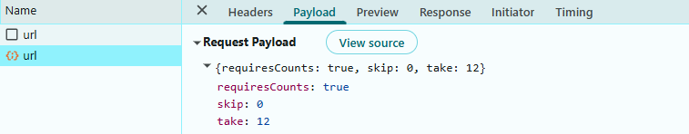
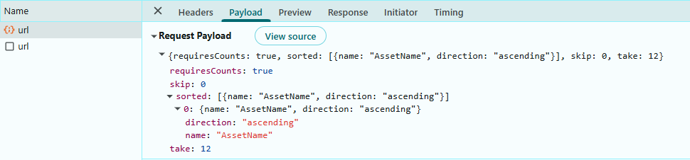
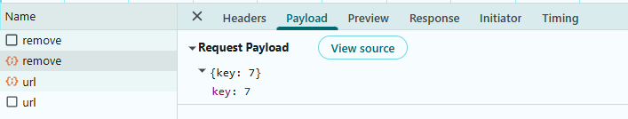

# Connecting SQLite Data to Angular Grid using EF Core

The Syncfusion<sup style="font-size:70%">&reg;</sup> Angular Grid supports binding data from a SQLite database using Entity Framework Core (EF Core). This approach provides a lightweight, server less database solution ideal for mobile applications, desktop applications, and small-to-medium scale web applications.

**What is Entity Framework Core?**

Entity Framework Core (EF Core) is a software tool that simplifies database operations in .NET applications. It serves as a bridge between C# code and databases like SQLite.

**Key benefits of Entity Framework Core**

- **Automatic SQL Generation**: Entity Framework Core generates optimized SQL queries automatically, eliminating the need to write raw SQL code.
- **Type Safety**: Work with strongly-typed objects instead of raw SQL strings, reducing errors.
- **Built-in Security**: Automatic parameterization prevents SQL injection attacks.
- **Version Control for Databases**: Manage database schema changes version-by-version through migrations.
- **Familiar Syntax**: Use LINQ (Language Integrated Query) syntax, which is more intuitive than raw SQL strings.

**What is SQLite?**

**SQLite** is a C-language library that implements a small, fast, self-contained, high-reliability, full-featured, SQL database engine. Unlike other database management systems, SQLite is not a client-server database engine. Rather, it is embedded into the end program.

## Prerequisites

Ensure the following software and packages are installed before proceeding:

| Software/Package | Version | Purpose |
|-----------------|---------|---------|
| Visual Studio 2022 | 17.0 or later | Development IDE with ASP.NET Core workload |
| .NET SDK | net9.0 or compatible | Runtime and build tools |
| SQLite database | 3.0 or later | Embedded Database engine |
| Microsoft.EntityFrameworkCore | 9.0.0 or later | Core framework for database operations |
| Microsoft.EntityFrameworkCore.Tools | 9.0.0 or later | Tools for managing database migrations |
| Microsoft.EntityFrameworkCore.Sqlite | 9.0.0 or later | SQLite provider for Entity Framework Core |

## Key topics

| # | Topics | Link |
|---|---------|-------|
| 1 | Create an ASP.NET Core with Angular project | [View](#step-2-create-a-new-aspnet-core-with-angular-project) |
| 2 | Create a SQLite database with asset records | [View](#step-1-create-the-database-and-table-in-sqlite) |
| 3 | Install necessary NuGet packages for Entity Framework Core and Syncfusion | [View](#step-3-install-required-nuget-packages) |
| 4 | Create data models and DbContext for database communication | [View](#step-4-create-the-data-model) |
| 5 | Configure connection strings and register services | [View](#step-6-configure-connection-string-in-appsettingsjson) |
| 6 | Create an Angular Grid component that supports searching, filtering, sorting, paging, and CRUD operations | [View](#integrating-syncfusion-Angular-grid) |
| 7 | Handle bulk operations and batch updates | [View](#step-9-perform-crud-operations) |

## Setting up the SQLite Environment for Entity Framework Core

### Step 1: Create the database and table in SQLite

First, the **SQLite database** structure must be created to store asset records. Unlike server-based databases, a SQLite database is a single file on disk.

**Instructions:**

1. To view or edit the database, use **DB Browser for SQLite** or the `sqlite3` command-line tool.
2. Create a new database file named **asset.db**.
3. Define an "asset" table with the specified schema.
4. Insert sample data for testing.

Run the following SQL script:

```sql
-- Create Database asset.db
-- Create the IT Assets table (matches Asset entity)
CREATE TABLE IF NOT EXISTS asset (
    Id              INTEGER PRIMARY KEY AUTOINCREMENT,
    AssetID         TEXT NOT NULL UNIQUE,
    AssetName       TEXT NOT NULL,
    AssetType       TEXT NOT NULL,
    Model           TEXT,
    SerialNumber    TEXT NOT NULL,
    InvoiceID       TEXT,
    AssignedTo      TEXT,
    Department      TEXT,
    PurchaseDate    DATE,
    PurchaseCost    REAL,
    WarrantyExpiry  DATE,
    Condition       TEXT CHECK(Condition IN ('New', 'Good', 'Fair', 'Poor')) DEFAULT 'New',
    LastMaintenance DATE,
    Status          TEXT CHECK(Status IN ('Active', 'In Repair', 'Retired', 'Available')) DEFAULT 'Available'
);

-- Insert sample data
INSERT INTO asset (Id, AssetID, AssetName, AssetType, Model, SerialNumber, InvoiceID, AssignedTo, Department, PurchaseDate, PurchaseCost, WarrantyExpiry, Condition, LastMaintenance, Status) VALUES
('1', 'AST-001', 'Dell Latitude Laptop', 'Laptop', 'Latitude 5520', 'SN-DEL-2024-001', 'INV-2023-0015', 'John Smith', 'IT', '2023-01-15', 1250.00, '2026-01-15', 'Good', '2024-06-10', 'Active'),
('2', 'AST-002', 'HP ProBook Laptop', 'Laptop', 'ProBook 450 G8', 'SN-HP-2024-002', 'INV-2023-0042', 'Sarah Johnson', 'Finance', '2023-03-20', 1100.00, '2026-03-20', 'Good', '2024-05-15', 'Active');
```

After executing this script, the asset records are stored in the "asset" table within the **asset.db** database. The database is now ready for integration with the Syncfusion<sup style="font-size:70%">&reg;</sup> components.

### Step 2: Create a new ASP.NET Core with Angular project

Before installing NuGet packages, a new ASP.NET Core Web Application with Angular must be created. This template creates a full-stack application with both the ASP.NET Core backend server and Angular frontend client in a single solution.

**Instructions:**

1. Open **Visual Studio 2022**.
2. Click **Create a new project**.
3. Search for **ASP.NET Core with Angular**.
4. Select the template and click **Next**.
5. Configure the project:
  - **Project name**: **Grid_SQLite** (or a preferred name)
  - **Location**: Choose the desired folder
  - **Solution name**: **Grid_SQLite**
6. Click **Next**.
7. Configure additional options:
   - **Framework**: Select .NET 9.0 (or latest available)
   - **Authentication type**: None
   - **Configure for HTTPS**: Checked (recommended)
8. Click **Create**.

Visual Studio will create a solution with two projects:
- **Grid_SQLite.Server**: The ASP.NET Core backend with Controllers, and configuration files
- **grid_sqlite.client**: The Angular + Vite frontend client application

### Step 3: Install required NuGet packages

NuGet packages are software libraries that add functionality to the application. These packages enable Entity Framework Core, SQLite connectivity, and Syncfusion Grid integration.

**Method 1: Using .NET CLI (Recommended)**

1. Open a terminal in Visual Studio 2022 (View → Terminal).
2. Navigate to your project directory.
3. Run the following commands in sequence:

```bash
dotnet add package Microsoft.EntityFrameworkCore --version 9.0.0
dotnet add package Microsoft.EntityFrameworkCore.Sqlite --version 9.0.0
dotnet add package Microsoft.EntityFrameworkCore.Tools --version 9.0.0
dotnet add package Syncfusion.EJ2.AspNet.Core --version 32.2.3
```

**Method 2: Using Package Manager Console**

1. Open Visual Studio 2022.
2. Navigate to **Tools → NuGet Package Manager → Package Manager Console**.
3. Run the following commands:

```powershell
Install-Package Microsoft.EntityFrameworkCore -Version 9.0.0
Install-Package Microsoft.EntityFrameworkCore.Sqlite -Version 9.0.0
Install-Package Microsoft.EntityFrameworkCore.Tools -Version 9.0.0
Install-Package Syncfusion.EJ2.AspNet.Core -Version 32.2.3
```

**Method 3: Using NuGet Package Manager UI**

1. Open **Visual Studio 2022 → Tools → NuGet Package Manager → Manage NuGet Packages for Solution**.
2. Search for and install each package individually:
   - **Microsoft.EntityFrameworkCore** (version 9.0.0)
   - **Microsoft.EntityFrameworkCore.Sqlite** (version 9.0.0)
   - **Microsoft.EntityFrameworkCore.Tools** (version 9.0.0)
   - **Syncfusion.EJ2.AspNet.Core** (version 32.2.3)

All required packages are now installed. Verify the installation by checking the project's **.csproj** file or using `dotnet list package` command.


### Step 4: Create the data model

A data model is a C# class that represents the structure of a database table. This model defines the properties that correspond to the columns in the "asset" table.

**Instructions:**

1. Create a new folder named **Data** in the server application project.
2. Inside the **Data** folder, create a new file named **Asset.cs**.
3. Define the **Asset** class with the following code:

```csharp
using System.ComponentModel.DataAnnotations;

namespace Grid_SQLite.Server.Data
{
 /// <summary>
    /// Represents an asset record mapped to the 'asset' table in the database.
    /// This model defines the structure of asset-related data used throughout the application.
    /// </summary>
    public class Asset
    {
        /// <summary>
        /// Gets or sets the unique identifier for the Asset record.
        /// </summary>
        [Key]
        public int Id { get; set; }

        /// <summary>
        /// Gets or sets the unique asset reference generated by the system.
        /// Format: AST-XXXXX (e.g., AST-001, AST-002)
        /// </summary>
        public string AssetID { get; set; } = string.Empty;

        /// <summary>
        /// Gets or sets the Name/description of the asset
        /// </summary>
        public string AssetName { get; set; } = string.Empty;

        /// <summary>
        /// Gets or sets the Type/category of the asset (Laptop, Desktop, Monitor, Printer, etc.)
        /// </summary>
        public string AssetType { get; set; } = string.Empty;

        /// <summary>
        /// Gets or sets the Model/specification of the asset
        /// </summary>
        public string? Model { get; set; }

        /// <summary>
        /// Gets or sets the Serial number/unique identifier from manufacturer
        /// </summary>
        public string SerialNumber { get; set; } = string.Empty;

        /// <summary>
        /// Gets or sets the Invoice/purchase order number
        /// </summary>
        public string? InvoiceID { get; set; }

        /// <summary>
        /// Gets or sets the Name/person the asset is assigned to
        /// </summary>
        public string? AssignedTo { get; set; }

        /// <summary>
        /// Gets or sets the Department that owns/uses the asset
        /// Values: IT, Finance, Marketing, HR, Design, Sales, Operations, Executive, Training
        /// </summary>
        public string? Department { get; set; }

        /// <summary>
        /// Gets or sets the Date when the asset was purchased
        /// </summary>
        public DateTime? PurchaseDate { get; set; }

        /// <summary>
        /// Gets or sets the Purchase cost in currency units
        /// Stored with 2 decimal places
        /// </summary>
        public decimal? PurchaseCost { get; set; }

        /// <summary>
        /// Gets or sets the Date when the warranty expires
        /// </summary>
        public DateTime? WarrantyExpiry { get; set; }

        /// <summary>
        /// Gets or sets the Current condition of the asset
        /// Values: New, Good, Fair, Poor
        /// </summary>
        public string? Condition { get; set; } = "New";

        /// <summary>
        /// Gets or sets the Date of the last maintenance performed
        /// </summary>
        public DateTime? LastMaintenance { get; set; }

        /// <summary>
        /// Gets or sets the Current status of the asset
        /// Values: Active, In Repair, Retired, Available
        /// </summary>
        public string Status { get; set; } = "Available";
    }
}
```

**Explanation:**

- The `[Key]` attribute marks the "Id" property as the primary key (a unique identifier for each record).
- Each property represents a column in the database table.
- The `?` symbol indicates that a property is nullable (can be empty).

The data model has been successfully created.

### Step 5: Create the DbContext class

A `DbContext` is a special class that manages the connection between the application and the SQLite database. It handles all database operations such as saving, updating, deleting, and retrieving data.

**Instructions:**

1. Inside the **Data** folder, create a new file named **AssetDbContext.cs**.
2. Define the **AssetDbContext** class with the following code:

```csharp
using Microsoft.EntityFrameworkCore;
using System.Reflection.Emit;

namespace Grid_SQLite.Server.Data
{
    /// <summary>
    /// DbContext for Asset entity
    /// Manages database connections and entity configurations for SQLite
    /// </summary>
    public class AssetDbContext : DbContext
    {
        public AssetDbContext(DbContextOptions<AssetDbContext> options)
            : base(options)
        {
        }

        /// <summary>
        /// DbSet for Asset entities
        /// </summary>
        public DbSet<Asset> Assets => Set<Asset>();

        /// <summary>
        /// Configures the entity mappings and constraints
        /// </summary>
        protected override void OnModelCreating(ModelBuilder modelBuilder)
        {
            base.OnModelCreating(modelBuilder);

            modelBuilder.Entity<Asset>(entity =>
            {
                // Primary Key
                entity.HasKey(e => e.Id);

                entity.Property(e => e.Id)
                    .ValueGeneratedOnAdd();

                entity.Property(e => e.AssetID)
                    .HasMaxLength(20)
                    .IsRequired(true);

                entity.Property(e => e.AssetName)
                    .HasMaxLength(255)
                    .IsRequired(true);

                entity.Property(e => e.AssetType)
                    .HasMaxLength(100)
                    .IsRequired(true);

                entity.Property(e => e.Model)
                    .HasMaxLength(150)
                    .IsRequired(false);

                entity.Property(e => e.SerialNumber)
                    .HasMaxLength(100)
                    .IsRequired(true);

                entity.Property(e => e.InvoiceID)
                    .HasMaxLength(100)
                    .IsRequired(false);

                entity.Property(e => e.AssignedTo)
                    .HasMaxLength(150)
                    .IsRequired(false);

                entity.Property(e => e.Department)
                    .HasMaxLength(50)
                    .IsRequired(false);

                entity.Property(e => e.PurchaseDate)
                    .HasColumnType("DATE")
                    .IsRequired(false);

                entity.Property(e => e.PurchaseCost)
                    .HasPrecision(12, 2)
                    .IsRequired(false);

                entity.Property(e => e.WarrantyExpiry)
                    .HasColumnType("DATE")
                    .IsRequired(false);

                entity.Property(e => e.Condition)
                    .HasMaxLength(50)
                    .IsRequired(false)
                    .HasDefaultValue("New");

                entity.Property(e => e.LastMaintenance)
                    .HasColumnType("DATE")
                    .IsRequired(false);

                entity.Property(e => e.Status)
                    .HasMaxLength(50)
                    .IsRequired(true)
                    .HasDefaultValue("Available");

                entity.ToTable("asset");
            });
        }
    }
}
```

**Explanation:**

- The `DbContext` class inherits from Entity Framework's `DbContext` base class.
- The `Assets` property represents the "asset" table in the database.
- The `OnModelCreating` method configures the behavior of database columns (maximum length, required/optional, default values, etc.).

The **AssetDbContext** class is required because:

- It **connects** the application to the database.
- It **manages** all database operations.
- It **maps** C# models to actual database tables.
- It **configures** the structure of data inside the database.

Without this class, Entity Framework Core will not know where to save data or to create the assets table. The `DbContext` has been successfully configured.

### Step 6: Configure connection string in appsettings.json

A connection string contains the information needed to connect the application to the SQLite database, which is typically the path to the database file.

**Instructions:**

1. Open the `appsettings.json` file in the project root.
2. Add or update the `ConnectionStrings` section with the SQLite connection details:

```json
{
  "Logging": {
    "LogLevel": {
      "Default": "Information",
      "Microsoft.AspNetCore": "Warning"
    }
  },
  "AllowedHosts": "*",
  "ConnectionStrings": {
    "DefaultConnection": "Data Source=D:\\Database\\asset.db"
  }
}
```

> Ensure the path to **asset.db** is correct for the environment.

The database connection string has been configured successfully.

### Step 7: Register services in Program.cs file

The **Program.cs** file is the entry point for configuring and bootstrapping the ASP.NET Core application. This is where all required services and middleware are registered, including CORS (Cross-Origin Resource Sharing), Entity Framework Core `DbContext`, JSON serialization, and controllers.

**Instructions:**

1. Open the **Program.cs** file in the project root.
2. Replace the existing content with the following configuration:

```csharp
using Grid_SQLite.Server.Data;
using Microsoft.EntityFrameworkCore;

var builder = WebApplication.CreateBuilder(args);

// Learn more about configuring OpenAPI at https://aka.ms/aspnet/openapi
builder.Services.AddOpenApi();

// CORS (dev)
builder.Services.AddCors(options =>
{
    options.AddPolicy("cors", p => p.AllowAnyOrigin().AllowAnyHeader().AllowAnyMethod());
});

// Controllers with System.Text.Json configured to KEEP PascalCase
builder.Services.AddControllers()
    .AddJsonOptions(o =>
    {
        // Keep property names as declared in C# (PascalCase)
        o.JsonSerializerOptions.PropertyNamingPolicy = null;
        // Keep dictionary keys as-is too
        o.JsonSerializerOptions.DictionaryKeyPolicy = null;
        // Allow case-insensitive reads (accept camelCase or PascalCase on input)
        o.JsonSerializerOptions.PropertyNameCaseInsensitive = true;
    });

// Get connection string from appsettings.json
var connectionString = builder.Configuration.GetConnectionString("DefaultConnection");

// Register DbContext with SQLite provider
builder.Services.AddDbContext<AssetDbContext>(options =>
{
    options.UseSqlite(connectionString);

    // Enable detailed error messages in development
    if (builder.Environment.IsDevelopment())
    {
        options.EnableSensitiveDataLogging();
    }
});

var app = builder.Build();
app.UseCors("cors");
app.UseDefaultFiles();
app.MapStaticAssets();

// Configure the HTTP request pipeline.
if (app.Environment.IsDevelopment())
{
    app.MapOpenApi();
}

app.UseHttpsRedirection();

app.UseAuthorization();

app.MapControllers();

app.MapFallbackToFile("/index.html");

app.Run();

```
## Integrating Syncfusion Angular Grid

The Syncfusion<sup style="font-size:70%">&reg;</sup> Angular Grid is a robust, high‑performance component built to efficiently display, manage, and manipulate large datasets. It provides advanced features such as sorting, filtering, and paging. Follow these steps to render the grid and integrate it with a SQLite database.

> The Angular client application **grid_sqlite.client** is already created as part of the ASP.NET Core with Angular template.

### Step 1: Adding Syncfusion packages

Install the necessary Syncfusion<sup style="font-size:70%">&reg;</sup> packages using the below command in Visual Studio Code terminal or Command prompt.

**Instructions:**

1. Open a terminal in Visual Studio 2022 (View → Terminal).
2. Navigate to the **grid_sqlite.client** directory:

    ```bash
    cd grid_sqlite.client
    ```

3. Install the Syncfusion packages:

    ```bash
    npm install @syncfusion/ej2-angular-grids --save
    npm install @syncfusion/ej2-data --save
    ```

After installation, the necessary CSS files are available in the (**../node_modules/@syncfusion**) directory. Add the required CSS references to the (**src/styles.css**) file to ensure proper styling of the Grid component.

```css
@import '../node_modules/@syncfusion/ej2-base/styles/bootstrap5.3.css';  
@import '../node_modules/@syncfusion/ej2-buttons/styles/bootstrap5.3.css';  
@import '../node_modules/@syncfusion/ej2-calendars/styles/bootstrap5.3.css';  
@import '../node_modules/@syncfusion/ej2-dropdowns/styles/bootstrap5.3.css';  
@import '../node_modules/@syncfusion/ej2-inputs/styles/bootstrap5.3.css';  
@import '../node_modules/@syncfusion/ej2-navigations/styles/bootstrap5.3.css';
@import '../node_modules/@syncfusion/ej2-popups/styles/bootstrap5.3.css';
@import '../node_modules/@syncfusion/ej2-splitbuttons/styles/bootstrap5.3.css';
@import '../node_modules/@syncfusion/ej2-notifications/styles/bootstrap5.3.css';
@import '../node_modules/@syncfusion/ej2-angular-grids/styles/bootstrap5.3.css';
```

For this project, the "Bootstrap 5" theme is applied. Other themes can be selected, or the existing theme can be customized to meet specific project requirements. For detailed guidance on theming and customization, refer to the [Syncfusion Angular Components Appearance](https://ej2.syncfusion.com/angular/documentation/appearance/theme-studio) documentation.

### Step 2: Add Syncfusion Angular Grid

The Angular Grid component can be added to the application by following these steps. To get started, add the Grid component to the application using the following code in (**grid_sqlite.client/src/app/app.ts**):

```ts
// File: src/app/app.ts
import { Component, OnInit } from '@angular/core';
import { CommonModule } from '@angular/common';
import { DataManager, UrlAdaptor } from '@syncfusion/ej2-data';
import { GridModule,} from '@syncfusion/ej2-angular-grids';
import { CustomAdaptor } from './custom-adaptor';

@Component({
  selector: 'app-root',
  standalone: true,
  imports: [
    CommonModule,
    GridModule,
  ],
templateUrl: './app.html',
})
export class AppComponent {
  public dataManager?: DataManager;

  ngOnInit(): void {
    this.dataManager = new DataManager({
      url: 'https://localhost:7066/api/asset/url',
      insertUrl: 'https://localhost:7066/api/asset/insert',
      updateUrl: 'https://localhost:7066/api/asset/update',
      removeUrl: 'https://localhost:7066/api/asset/remove',
      batchUrl: 'https://localhost:7066/api/asset/batch',
      adaptor: new CustomAdaptor()
    });
  }
}

```

```html
<ejs-grid [dataSource]="dataManager">
  <e-columns>
    <e-column field="Id" [isPrimaryKey]="true" [visible]="false"></e-column>
    <!-- Include more columns here -->
  </e-columns>
</ejs-grid>
```

### Step 3: Implement the CustomAdaptor

The Syncfusion<sup style="font-size:70%">&reg;</sup> Angular Grid can bind data from a **SQLite database**  using [DataManager](https://ej2.syncfusion.com/angular/documentation/data/getting-started) and set the `adaptor` property to `CustomAdaptor` for scenarios that require full control over data operations.

The `CustomAdaptor` (client-side) is a bridge between the Angular Grid and the ASP.NET Core backend. It extends the `UrlAdaptor` and handles all data operation requests by constructing HTTP POST calls to corresponding server endpoints. When the Grid performs operations like reading, searching, filtering, sorting, paging, and CRUD operations, the CustomAdaptor intercepts these actions and formats them into HTTP requests. These requests are sent to the ASP.NET Core Web API controller on the server, which processes the `DataManagerRequest` using Entity Framework Core to query the SQLite database and return the results.

**Instructions:**

1. Create a new **custom-adaptor.ts** file in the (**app**) folder.
2. Add the following code inside this file:

```ts
import { BatchChanges } from '@syncfusion/ej2-angular-grids';
import {
  DataManager,
  UrlAdaptor,
  Query,
  ReturnOption,
  DataResult,
} from '@syncfusion/ej2-data';

export class CustomAdaptor extends UrlAdaptor {
  public override processResponse(data: DataResult): ReturnOption {
    const original = data as any;
    if (original && original.result) {
      let i = 0;
      original.result.forEach((item: any) => (item.SNo = ++i));
    }
    return original;
  }

  public override beforeSend(
    dm: DataManager,
    request: Request,
    settings?: any,
  ): void {
    super.beforeSend(dm, request, settings);
  }

  public override insert(dm: DataManager, data: DataResult) {
    return {
      url: `${dm.dataSource['insertUrl']}`,
      type: 'POST',
      contentType: 'application/json; charset=utf-8',
      data: JSON.stringify({ value: data }),
    };
  }

  public override update(dm: DataManager, _keyField: string, value: any) {
    return {
      url: `${dm.dataSource['updateUrl']}`,
      type: 'POST',
      contentType: 'application/json; charset=utf-8',
      data: JSON.stringify({ value }),
    };
  }

  public override remove(dm: DataManager, keyField: string, value: any) {
    const keyValue =
      value && typeof value === 'object' ? value[keyField] : value;
    return {
      url: `${dm.dataSource['removeUrl']}`,
      type: 'POST',
      contentType: 'application/json; charset=utf-8',
      data: JSON.stringify({ key: keyValue }),
    };
  }

  public override batchRequest(dm: DataManager, changes: BatchChanges) {
    return {
      url: `${dm.dataSource['batchUrl']}`,
      type: 'POST',
      contentType: 'application/json; charset=utf-8',
      data: JSON.stringify({
        added: changes.addedRecords,
        changed: changes.changedRecords,
        deleted: changes.deletedRecords,
      }),
    };
  }
}
```

The `CustomAdaptor` class has been successfully implemented with all data operations.

### Step 4: Add toolbar with CRUD and search options

The toolbar provides buttons for adding, editing, deleting records, and searching the data.

**Instructions:**

1. Open the (**src/app/app.ts**) file.
2. Inject the `ToolbarService` in to the `providers` array of the "AppComponent".
3. Update the Grid component to include the [toolbar](https://ej2.syncfusion.com/angular/documentation/api/grid/index-default#toolbar) property with CRUD and search options:

```ts
// File: src/app/app.ts
import { Component, OnInit } from '@angular/core';
import { CommonModule } from '@angular/common';
import { DataManager, UrlAdaptor } from '@syncfusion/ej2-data';
import {
  GridModule,
  ToolbarService,
} from '@syncfusion/ej2-angular-grids';
import { CustomAdaptor } from './custom-adaptor';

@Component({
  selector: 'app-root',
  standalone: true,
  imports: [
    CommonModule,
    GridModule, // NgModule imported directly into a standalone component
  ],
  providers: [
    ToolbarService,
  ],
  templateUrl: './app.html',
})
export class AppComponent {
  public toolbar = ['Add', 'Edit', 'Delete', 'Update', 'Cancel', 'Search'];

}
```

```html
<ejs-grid [dataSource]="dataManager" [toolbar]="toolbar">
  <e-columns>
    <e-column field="Id" [isPrimaryKey]="true" [visible]="false"></e-column>
    <!-- Include more columns here -->
  </e-columns>
</ejs-grid>
```

**Toolbar Items Explanation:**

| Item | Function |
| ------ | ---------- |
| `Add` | Opens a form to add a new record. |
| `Edit` | Enables editing of the selected record. |
| `Delete` | Deletes the selected record from the database. |
| `Update` | Saves changes made to the selected record. |
| `Cancel` | Cancels the current edit or add operation. |
| `Search` | Displays a search box to find records. |

The toolbar has been successfully added.

### Step 5: Implement paging feature

The paging feature allows efficient loading of large data sets through on‑demand loading.

**Instructions:**

1. Paging in the Grid is enabled by setting the [allowPaging](https://ej2.syncfusion.com/angular/documentation/api/grid/index-default#allowpaging) property to `true`.
2. And injecting the `PagerService` module in the `providers` property of the "AppComponent".

```ts
// File: src/app/app.ts
import { Component, OnInit } from '@angular/core';
import { CommonModule } from '@angular/common';
import { DataManager, UrlAdaptor } from '@syncfusion/ej2-data';
import {
  GridModule,
  PageService,
} from '@syncfusion/ej2-angular-grids';
import { CustomAdaptor } from './custom-adaptor';

@Component({
  selector: 'app-root',
  standalone: true,
  imports: [
    CommonModule,
    GridModule, // NgModule imported directly into a standalone component
  ],
  providers: [
    PageService,
  ],
  templateUrl: './app.html',
})
export class AppComponent {

}
```

```html
<ejs-grid [dataSource]="dataManager" [allowPaging]="true">
  <e-columns>
    <e-column field="Id" [isPrimaryKey]="true" [visible]="false"></e-column>
    <!-- Include more columns here -->
  </e-columns>
</ejs-grid>
```

On the server side create a file **AssetController.cs** and add the "UrlDataSource" method provided below:

```csharp
using Grid_SQLite.Server.Data;
using Microsoft.AspNetCore.Mvc;
using Microsoft.EntityFrameworkCore;
using Syncfusion.EJ2.Base;

namespace Grid_SQLite.Server.Controllers
{
    [Route("api/[controller]")]
    public class AssetController : ControllerBase
    {
        private readonly AssetDbContext _db;

        public AssetController(AssetDbContext db)
        {
            _db = db;
        }

        // READ
        [HttpPost("url")]
        public IActionResult UrlDataSource([FromBody] DataManagerRequest dm)
        {
            IQueryable<Asset> query = _db.Assets.AsNoTracking();
            var op = new DataOperations();

            var count = query.Count();

            if (dm.Skip > 0)
                query = query.Skip(dm.Skip);

            if (dm.Take > 0)
                query = query.Take(dm.Take);

            return dm.RequiresCounts
                ? Ok(new { result = query.ToList(), count })
                : Ok(query.ToList());
        }
    }
}
```

**Paging details:**

- The Grid sends page size `take` and skip count `skip` parameters to the server.
- The `operation.PerformSkip()` method skips the specified number of records.
- The `operation.PerformTake()` method retrieves only the required number of records for the current page.
- The total count is calculated before paging to display the total number of records.
- Results are returned and displayed in the Grid with pagination controls.

When paging is performed in the Grid, a request is sent to the server with the following payload.



### Step 6: Implement searching feature

Searching allows finding records by entering keywords in the search box.

**Instructions:**

1. Ensure the toolbar includes the `Search` item.

```ts
// File: src/app/app.ts
import { Component, OnInit } from '@angular/core';
import { CommonModule } from '@angular/common';
import { DataManager, UrlAdaptor } from '@syncfusion/ej2-data';
import {
  GridModule,
  ToolbarService,
} from '@syncfusion/ej2-angular-grids';
import { CustomAdaptor } from './custom-adaptor';

@Component({
  selector: 'app-root',
  standalone: true,
  imports: [
    CommonModule,
    GridModule, // NgModule imported directly into a standalone component
  ],
  providers: [
    ToolbarService,
  ],
  templateUrl: './app.html',
})
export class AppComponent {
  public toolbar = ['Search'];
}
```

```html
<ejs-grid [dataSource]="dataManager" [toolbar]="toolbar">
  <e-columns>
    <e-column field="Id" [isPrimaryKey]="true" [visible]="false"></e-column>
    <!-- Include more columns here -->
  </e-columns>
</ejs-grid>
```

Update the "UrlDataSource" method in the **AssetController.cs** file to handle searching:

```csharp
using Grid_SQLite.Server.Data;
using Microsoft.AspNetCore.Mvc;
using Microsoft.EntityFrameworkCore;
using Syncfusion.EJ2.Base;

namespace Grid_SQLite.Server.Controllers
{
    [Route("api/[controller]")]
    public class AssetController : ControllerBase
    {
        private readonly AssetDbContext _db;

        public AssetController(AssetDbContext db)
        {
            _db = db;
        }

        // READ
        [HttpPost("url")]
        public IActionResult UrlDataSource([FromBody] DataManagerRequest dm)
        {
            IQueryable<Asset> query = _db.Assets.AsNoTracking();
            var op = new DataOperations();

            if (dm.Search?.Count > 0)
                query = op.PerformSearching(query, dm.Search).Cast<Asset>().AsQueryable();
                
            var count = query.Count();

            return dm.RequiresCounts
                ? Ok(new { result = query.ToList(), count })
                : Ok(query.ToList());
        }
    }
}
```

**Searching details:**

-- When text is entered in the search box and Enter is pressed, the Grid sends a search request to the server.
- The "UrlDataSource" method receives the search criteria in `search` parameter.
- The `operation.PerformSearching()` method filters the data based on the search term.
- Results are returned and displayed in the Grid.

When searching is performed in the Grid, a request is sent to the server with the following payload.


### Step 7: Implement filtering feature

Filtering allows restricting data based on column values using a menu interface.

**Instructions:**

1. Filtering is enabled by setting the [allowFiltering](https://ej2.syncfusion.com/angular/documentation/api/grid/index-default#allowfiltering) property to `true`.
2. Inject the `FilterService` module in the `providers` property of the "AppComponent".

```ts
// File: src/app/app.ts
import { Component, OnInit } from '@angular/core';
import { CommonModule } from '@angular/common';
import { DataManager, UrlAdaptor } from '@syncfusion/ej2-data';
import {
  GridModule,
  FilterService,
} from '@syncfusion/ej2-angular-grids';
import { CustomAdaptor } from './custom-adaptor';

@Component({
  selector: 'app-root',
  standalone: true,
  imports: [
    CommonModule,
    GridModule, // NgModule imported directly into a standalone component
  ],
  providers: [
    FilterService,
  ],
  templateUrl: './app.html',
})
export class AppComponent {
  public toolbar = ['Search'];
}
```

```html
<ejs-grid [dataSource]="dataManager"  [allowFiltering]="true">
  <e-columns>
    <e-column field="Id" [isPrimaryKey]="true" [visible]="false"></e-column>
    <!-- Include more columns here -->
  </e-columns>
</ejs-grid>
```

Update the "UrlDataSource" method in the **AssetController.cs** file to handle filtering:

```csharp
using Grid_SQLite.Server.Data;
using Microsoft.AspNetCore.Mvc;
using Microsoft.EntityFrameworkCore;
using Syncfusion.EJ2.Base;

namespace Grid_SQLite.Server.Controllers
{
    [Route("api/[controller]")]
    public class AssetController : ControllerBase
    {
        private readonly AssetDbContext _db;

        public AssetController(AssetDbContext db)
        {
            _db = db;
        }

        // READ
        [HttpPost("url")]
        public IActionResult UrlDataSource([FromBody] DataManagerRequest dm)
        {
            IQueryable<Asset> query = _db.Assets.AsNoTracking();
            var op = new DataOperations();

            if (dm.Where?.Count > 0)
                query = op.PerformFiltering(query, dm.Where, dm.Where[0].Operator)
                    .Cast<Asset>()
                    .AsQueryable();

            var count = query.Count();

            return dm.RequiresCounts
                ? Ok(new { result = query.ToList(), count })
                : Ok(query.ToList());
        }
    }
}
```

**Filtering details:**

- Open the filter menu from any of the column header.
- Select filtering criteria (equals, contains, greater than, less than, etc.).
- Click the "Filter" button to apply the filter.
- The "UrlDataSource" method receives the filter criteria in `where` property.
- Results are filtered accordingly and displayed in the Grid.

When filtering is performed in the Grid, a request is sent to the server with the following payload.


### Step 8: Implement sorting feature

Sorting enables arranging records in ascending or descending order based on column values.

**Instructions:**

1. Sorting can be enabled by setting the [allowSorting](https://ej2.syncfusion.com/angular/documentation/api/grid/index-default#allowsorting) property to `true`.
2. Inject the `SortService` module in the `providers` property of the "AppComponent".

```ts
// File: src/app/app.ts
import { Component, OnInit } from '@angular/core';
import { CommonModule } from '@angular/common';
import { DataManager, UrlAdaptor } from '@syncfusion/ej2-data';
import {
  GridModule,
  SortService,
} from '@syncfusion/ej2-angular-grids';
import { CustomAdaptor } from './custom-adaptor';

@Component({
  selector: 'app-root',
  standalone: true,
  imports: [
    CommonModule,
    GridModule, // NgModule imported directly into a standalone component
  ],
  providers: [
    SortService,
  ],
  templateUrl: './app.html',
})
export class AppComponent {

}
```

```html
<ejs-grid [dataSource]="dataManager"  [allowSorting]="true">
  <e-columns>
    <e-column field="Id" [isPrimaryKey]="true" [visible]="false"></e-column>
    <!-- Include more columns here -->
  </e-columns>
</ejs-grid>
```

Update the "UrlDataSource" method in the **AssetController.cs** file to handle sorting:

```csharp
using Grid_SQLite.Server.Data;
using Microsoft.AspNetCore.Mvc;
using Microsoft.EntityFrameworkCore;
using Syncfusion.EJ2.Base;

namespace Grid_SQLite.Server.Controllers
{
    [Route("api/[controller]")]
    public class AssetController : ControllerBase
    {
        private readonly AssetDbContext _db;

        public AssetController(AssetDbContext db)
        {
            _db = db;
        }

        // READ
        [HttpPost("url")]
        public IActionResult UrlDataSource([FromBody] DataManagerRequest dm)
        {
            IQueryable<Asset> query = _db.Assets.AsNoTracking();
            var op = new DataOperations();

            if (dm.Sorted?.Count > 0)
                query = op.PerformSorting(query, dm.Sorted).Cast<Asset>().AsQueryable();
            else
                query = query.OrderBy(a => a.Id);

            var count = query.Count();

            return dm.RequiresCounts
                ? Ok(new { result = query.ToList(), count })
                : Ok(query.ToList());
        }
    }
}
```

**Sorting details:**

- Click on the column header to sort in ascending order.
- Click again to sort in descending order.
- The "UrlDataSource" method receives the sort criteria in `sorted` property.
- Records are sorted accordingly and displayed in the Grid.

When sorting is performed in the Grid, a request is sent to the server with the following payload.



### Step 9: Perform CRUD operations

CRUD operations allow adding new records, modifying existing records, and removing items that are no longer relevant. The `DataManager` posts a specific action for each operation so that the server can route to the appropriate handler.

Editing operations in the Grid are enabled through configuring the [editSettings](https://ej2.syncfusion.com/angular/documentation/api/grid/index-default#editsettings) properties ([allowEditing](https://ej2.syncfusion.com/angular/documentation/api/grid/gridModel#allowediting), [allowAdding](https://ej2.syncfusion.com/angular/documentation/api/grid/editSettingsModel#allowadding), and [allowDeleting](https://ej2.syncfusion.com/angular/documentation/api/grid/editSettingsModel#allowdeleting)) to `true`. Inject the `EditService` and `ToolbarService` modules in the `providers` property of "AppComponent".

```ts
// File: src/app/app.ts
import { Component, OnInit } from '@angular/core';
import { CommonModule } from '@angular/common';
import { DataManager, UrlAdaptor } from '@syncfusion/ej2-data';
import {
  GridModule,
  ToolbarService,
} from '@syncfusion/ej2-angular-grids';
import { CustomAdaptor } from './custom-adaptor';

@Component({
  selector: 'app-root',
  standalone: true,
  imports: [
    CommonModule,
    GridModule,
  ],
  providers: [
    ToolbarService,
  ],
  templateUrl: './app.html',
})
export class AppComponent {
  public toolbar = ['Add', 'Edit', 'Delete', 'Update', 'Cancel', 'Search'];
  public edit = {
    allowAdding: true,
    allowEditing: true,
    allowDeleting: true,
  };
    public dataManager?: DataManager;
    ngOnInit(): void {
    this.dataManager = new DataManager({
      url: 'https://localhost:7066/api/asset/url',
      insertUrl: 'https://localhost:7066/api/asset/insert',
      updateUrl: 'https://localhost:7066/api/asset/update',
      removeUrl: 'https://localhost:7066/api/asset/remove',
      batchUrl: 'https://localhost:7066/api/asset/batch',
      adaptor: new CustomAdaptor()
    });
  }
}
```

```html
<ejs-grid [dataSource]="dataManager" [editSettings]="edit"
  [toolbar]="toolbar">
  <e-columns>
    <e-column field="Id" [isPrimaryKey]="true" [visible]="false"></e-column>
    <!-- Include more columns here -->
  </e-columns>
</ejs-grid>
```

**Insert:**

Record insertion allows new assets to be added directly through the Grid component. The adaptor processes the insertion request, performs any required business‑logic validation, and saves the newly created record to the SQL database.

Implement the "insert" method in (**src/app/custom-adaptor.ts**) to handle record insertion within the `CustomAdaptor` class:

```ts
  public override insert(dm: DataManager, data: DataResult) {
    return {
      url: `${dm.dataSource["insertUrl"]}`,
      type: "POST",
      contentType: "application/json; charset=utf-8",
      data: JSON.stringify({ value: data }),
    };
  }
```

In **AssetController.cs**, implement the "Insert" method:

```csharp
        // CREATE
        [HttpPost("insert")]
        public IActionResult Insert([FromBody] CRUDModel<Asset> value)
        {
            var asset = value.Value;

            // Identity handled automatically
            asset.Id = 0;

            _db.Assets.Add(asset);
            _db.SaveChanges();

            return Ok(asset);
        }
```

**What happens behind the scenes:**

1. The form data is collected and validated in the CustomAdaptor's "insert" method.
2. The "Insert" method in **AssetController.cs** file is called.
3. The new record is added to the "Asset" collection.
4. The Grid automatically refreshes to display the new record.

Now the new asset is persisted to the database and reflected in the grid.

When a new record added in the Grid, a request is sent to the server with the following payload.


**Update:**

Record modification allows asset details to be updated directly within the Grid. The adaptor processes the edited row, validates the updated values, and applies the changes to the SQL database while ensuring data integrity is preserved.

Implement the "update" method in (**src/app/custom-adaptor.ts**) to handle record update within the `CustomAdaptor` class:

```ts
  public override update(dm: DataManager, _keyField: string, value: any) {
    return {
      url: `${dm.dataSource["updateUrl"]}`,
      type: "POST",
      contentType: "application/json; charset=utf-8",
      data: JSON.stringify({ value }),
    };
  }
```

In **AssetController.cs**, implement the update method:

```csharp
        // UPDATE
        [HttpPost("update")]
        public IActionResult Update([FromBody] CRUDModel<Asset> value)
        {
            var asset = value.Value;

            _db.Entry(asset).State = EntityState.Modified;
            _db.SaveChanges();

            return Ok(asset);
        }
```

**What happens behind the scenes:**

1. The modified data is collected and validated in the CustomAdaptor's "update" method.
2. The "Update" method in **AssetController.cs** file is called.
3. The existing record is retrieved from the database by "ID".
4. All properties are updated with the new values.
5. The Grid refreshes to display the updated record.

Now modifications are synchronized to the database and reflected in the grid UI.

When a record updated is in the Grid, a request is sent to the server with the following payload.


**Delete:**

Record deletion allows assets to be removed directly from the Grid. The adaptor captures the delete request, executes the corresponding SQL DELETE operation, and updates both the database and the grid to reflect the removal.

Implement the "remove" method in (**src/app/custom-adaptor.ts**) to handle record deletion within the `CustomAdaptor` class:

```ts
  public override remove(dm: DataManager, keyField: string, value: any) {
    const keyValue =
      value && typeof value === "object" ? value[keyField] : value;
    return {
      url: `${dm.dataSource["removeUrl"]}`,
      type: "POST",
      contentType: "application/json; charset=utf-8",
      data: JSON.stringify({ key: keyValue }),
    };
  }
```

In **AssetController.cs**, implement the delete method:

```csharp
        // DELETE
        [HttpPost("remove")]
        public IActionResult Remove([FromBody] CRUDModel<Asset> value)
        {
            int key;
            if (value.Key is System.Text.Json.JsonElement jsonElement)
            {
                key = jsonElement.GetInt32();
            }
            else
            {
                key = Convert.ToInt32(value.Key);
            }
            var asset = _db.Assets.First(a => a.Id == key);

            _db.Assets.Remove(asset);
            _db.SaveChanges();

            return Ok(value);
        }
```

**What happens behind the scenes:**

1. A record is selected and the `Delete` button is clicked.
2. The CustomAdaptor's "remove" method is called.
3. The "Remove" method in **AssetController.cs** file is called.
4. The record is located in the database by its ID.
5. The record is removed from the `_db.Assets` collection.
6. The Grid refreshes to remove the deleted record from the UI.

Now assets are removed from the database and the grid UI reflects the changes immediately.

When a record is deleted in the Grid, a request is sent to the server with the following payload.



**Batch update:**

Batch operations combine multiple insert, update, and delete actions into a single request, minimizing network overhead by applying all changes atomically to the SQL database.

Implement the `batchRequest` method in (**src/app/custom-adaptor.ts**) to handle multiple record updates in a single request within the `CustomAdaptor` class:

```ts
  public override batchRequest(dm: DataManager, changes: BatchChanges) {
    return {
      url: `${dm.dataSource["batchUrl"]}`,
      type: "POST",
      contentType: "application/json; charset=utf-8",
      data: JSON.stringify({
        added: changes.addedRecords,
        changed: changes.changedRecords,
        deleted: changes.deletedRecords,
      }),
    };
  }
```

In **AssetController.cs**, implement the batch method:

```csharp
        // BATCH
        [HttpPost("batch")]
        public IActionResult Batch([FromBody] CRUDModel<Asset> value)
        {
            if (value.Changed != null)
            {
                foreach (var asset in value.Changed)
                {
                    _db.Assets.Attach(asset);
                    _db.Entry(asset).State = EntityState.Modified;
                }
            }

            if (value.Added != null)
            {
                foreach (var asset in value.Added)
                {
                    asset.Id = 0;
                    _db.Assets.Add(asset);
                }
            }

            if (value.Deleted != null)
            {
                foreach (var asset in value.Deleted)
                {
                    var existing = _db.Assets.Find(asset.Id);
                    if (existing != null)
                        _db.Assets.Remove(existing);
                }
            }

            _db.SaveChanges();
            return Ok(value);
        }
```

> This method is triggered when the Grid is operating in [Batch](https://ej2.syncfusion.com/angular/documentation/grid/editing/batch-editing) Edit mode.

**What happens behind the scenes:**

- The Grid collects all added, edited, and deleted records in `Batch` edit mode.
- The combined batch request is passed to the CustomAdaptor’s `batchRequest` method.
- Each modified record, added and deleted records are processed using `BatchUpdate` method in **AssetController.cs** file.
- All repository operations persist changes to the SQL database.
- The Grid refreshes to display the updated, added, and removed records in a single response.

Now the adaptor supports bulk modifications with atomic database synchronization. All CRUD operations are now fully implemented, enabling comprehensive data management capabilities within the Grid.

When a batch update is performed in the Grid, a request is sent to the server with the following payload.


### Step 10: Complete code

Here is the complete and final (**src/app/app.ts**) component with all features integrated:


```ts
import { Component } from '@angular/core';
import { DataManager } from '@syncfusion/ej2-data';
import { CustomAdaptor } from './custom-adaptor';
import { CommonModule } from '@angular/common'
import {
  GridComponent,
  GridModule,
  EditSettingsModel,
  ToolbarItems,
  EditService,
  ToolbarService,
  PageService,
  SortService,
  FilterService,
  SearchService,
} from '@syncfusion/ej2-angular-grids';
@Component({
  selector: 'app-root',
  standalone: true,
  templateUrl: './app.html',
  imports: [CommonModule, GridModule],
  providers: [
    EditService,
    ToolbarService,
    PageService,
    SortService,
    FilterService,
    SearchService,
  ],
})
export class AppComponent {
  public dataManager: DataManager;
  public toolbarOptions: string[];
  public editSettings: Object;
  public filterSettings: Object;
  public requiredrules?: Object;
  constructor() {
    this.requiredrules = { required: true };
    this.toolbarOptions = ['Add', 'Edit', 'Delete', 'Update', 'Cancel', 'Search'];
    this.editSettings = {
      allowAdding: true,
      allowEditing: true,
      allowDeleting: true,
      mode: 'Normal'
    };
    this.filterSettings = { type: 'Excel' };

    this.dataManager = new DataManager({
      url: 'https://localhost:7066/api/asset/url',
      insertUrl: 'https://localhost:7066/api/asset/insert',
      updateUrl: 'https://localhost:7066/api/asset/update',
      removeUrl: 'https://localhost:7066/api/asset/remove',
      batchUrl: 'https://localhost:7066/api/asset/batch',
      adaptor: new CustomAdaptor()
    });
  }
}

```

```html
<div>
  <ejs-grid [dataSource]="dataManager"
            [allowSorting]="true"
            [allowFiltering]="true"
            [allowPaging]="true"
            [toolbar]="toolbarOptions"
            [editSettings]="editSettings"
            [filterSettings]="filterSettings">
    <e-columns>
      <e-column field="Id" [isPrimaryKey]="true" [visible]="false"></e-column>
      <e-column field="AssetID" headerText="Asset ID" width="120" [validationRules]='requiredrules'></e-column>
      <e-column field="AssetName" headerText="Asset Name" width="180" textAlign="Left"
                [validationRules]='requiredrules'></e-column>
      <e-column field="AssetType" headerText="Type" width="130" textAlign="Left"
                [validationRules]='requiredrules'></e-column>
      <e-column field="Model" headerText="Model" width="150" textAlign="Left"
                [validationRules]='requiredrules'></e-column>
      <e-column field="SerialNumber" headerText="Serial Number" width="160" [validationRules]='requiredrules'></e-column>
      <e-column field="InvoiceID" headerText="Invoice ID" width="130" textAlign="Left" [validationRules]='requiredrules'></e-column>
      <e-column field="AssignedTo" headerText="Assigned To" width="150" textAlign="Left" [validationRules]='requiredrules'></e-column>
      <e-column field="Department" headerText="Department" width="130" textAlign="Left" editType="dropdownedit" [validationRules]='requiredrules'></e-column>
      <e-column field="PurchaseDate" headerText="Purchase Date" width="140" textAlign="Center"
                type="date" format="yyyy-MM-dd" editType="datepickeredit"
                [validationRules]='requiredrules'></e-column>
      <e-column field="PurchaseCost" headerText="Cost" width="120" textAlign="Right"
                format="C0" editType="numericedit"></e-column>
      <e-column field="WarrantyExpiry" headerText="Warranty Expiry" width="150" textAlign="Center"
                type="date" format="yyyy-MM-dd" editType="datepickeredit" [validationRules]='requiredrules'></e-column>
      <e-column field="Condition" headerText="Condition" width="120" textAlign="Center" editType="dropdownedit" [validationRules]='requiredrules'> <ng-template #template let-data> <div [ngSwitch]="data.Condition" class="statustemp"> <span *ngSwitchCase="'New'" class="badge bg-success">{{ data.Condition }}</span> <span *ngSwitchCase="'Good'" class="badge bg-primary">{{ data.Condition }}</span> <span *ngSwitchCase="'Fair'" class="badge bg-warning">{{ data.Condition }}</span> <span *ngSwitchCase="'Poor'" class="badge bg-danger">{{ data.Condition }}</span> <span *ngSwitchDefault class="badge bg-secondary">{{ data.Condition }}</span> </div> </ng-template> </e-column>
      <e-column field="LastMaintenance" headerText="Last Maintenance" width="150" textAlign="Center"
                type="date" format="yyyy-MM-dd" editType="datepickeredit" [validationRules]='requiredrules'></e-column>
      <e-column field="Status" headerText="Status" width="150" textAlign="Center" editType="dropdownedit" [validationRules]='requiredrules'> <ng-template #template let-data> <div [ngSwitch]="data.Status" class="statustemp"> <span *ngSwitchCase="'Active'" class="badge bg-success">{{ data.Status }}</span> <span *ngSwitchCase="'In Repair'" class="badge bg-warning">{{ data.Status }}</span> <span *ngSwitchCase="'Retired'" class="badge bg-secondary">{{ data.Status }}</span> <span *ngSwitchCase="'Available'" class="badge bg-info">{{ data.Status }}</span> <span *ngSwitchDefault class="badge bg-secondary">{{ data.Status }}</span> </div> </ng-template> </e-column>
    </e-columns>
  </ejs-grid>
</div>
```

> - Set [isPrimaryKey](https://ej2.syncfusion.com/angular/documentation/api/grid/column#isprimarykey) to `true` for a column that contains unique values.
> - The [editType](https://ej2.syncfusion.com/angular/documentation/api/grid/column#edittype) property can be used to specify the desired editor for each column.
> - The [type](https://ej2.syncfusion.com/angular/documentation/api/grid/columnmodel#type) property of the Grid columns specifies the data type of a grid column.

Here is the complete Controller **AssetController.cs** file:

```csharp
using Grid_SQLite.Server.Data;
using Microsoft.AspNetCore.Mvc;
using Microsoft.EntityFrameworkCore;
using Syncfusion.EJ2.Base;

namespace Grid_SQLite.Server.Controllers
{
    [Route("api/[controller]")]
    public class AssetController : ControllerBase
    {
        private readonly AssetDbContext _db;

        public AssetController(AssetDbContext db)
        {
            _db = db;
        }

        // READ
        [HttpPost("url")]
        public IActionResult UrlDataSource([FromBody] DataManagerRequest dm)
        {
            IQueryable<Asset> query = _db.Assets.AsNoTracking();
            var op = new DataOperations();

            if (dm.Search?.Count > 0)
                query = op.PerformSearching(query, dm.Search).Cast<Asset>().AsQueryable();

            if (dm.Where?.Count > 0)
                query = op.PerformFiltering(query, dm.Where, dm.Where[0].Operator)
                    .Cast<Asset>()
                    .AsQueryable();

            if (dm.Sorted?.Count > 0)
                query = op.PerformSorting(query, dm.Sorted).Cast<Asset>().AsQueryable();
            else
                query = query.OrderBy(a => a.Id);

            var count = query.Count();

            if (dm.Skip > 0)
                query = query.Skip(dm.Skip);

            if (dm.Take > 0)
                query = query.Take(dm.Take);

            return dm.RequiresCounts
                ? Ok(new { result = query.ToList(), count })
                : Ok(query.ToList());
        }

        // CREATE
        [HttpPost("insert")]
        public IActionResult Insert([FromBody] CRUDModel<Asset> value)
        {
            var asset = value.Value;

            // Identity handled automatically
            asset.Id = 0;

            _db.Assets.Add(asset);
            _db.SaveChanges();

            return Ok(asset);
        }

        // UPDATE
        [HttpPost("update")]
        public IActionResult Update([FromBody] CRUDModel<Asset> value)
        {
            var asset = value.Value;

            _db.Entry(asset).State = EntityState.Modified;
            _db.SaveChanges();

            return Ok(asset);
        }

        // DELETE
        [HttpPost("remove")]
        public IActionResult Remove([FromBody] CRUDModel<Asset> value)
        {
            int key;
            if (value.Key is System.Text.Json.JsonElement jsonElement)
            {
                key = jsonElement.GetInt32();
            }
            else
            {
                key = Convert.ToInt32(value.Key);
            }
            var asset = _db.Assets.First(a => a.Id == key);

            _db.Assets.Remove(asset);
            _db.SaveChanges();

            return Ok(value);
        }

        // BATCH
        [HttpPost("batch")]
        public IActionResult Batch([FromBody] CRUDModel<Asset> value)
        {
            if (value.Changed != null)
            {
                foreach (var asset in value.Changed)
                {
                    _db.Assets.Attach(asset);
                    _db.Entry(asset).State = EntityState.Modified;
                }
            }

            if (value.Added != null)
            {
                foreach (var asset in value.Added)
                {
                    asset.Id = 0;
                    _db.Assets.Add(asset);
                }
            }

            if (value.Deleted != null)
            {
                foreach (var asset in value.Deleted)
                {
                    var existing = _db.Assets.Find(asset.Id);
                    if (existing != null)
                        _db.Assets.Remove(existing);
                }
            }

            _db.SaveChanges();
            return Ok(value);
        }
    }
}

```

## Running the application

Since the project is created using the ASP.NET Core with Angular template, both the backend and frontend are configured to run together automatically. Visual Studio handles the build and launch process for both projects.

**Step 1: Open the solution**

1. Open **Visual Studio 2022**.
2. Open the **Grid_SQLite.slnx** file.

**Step 2: Set startup project**

1. Ensure **Grid_SQLite.Server** is set as the startup project (it should be by default).
2. The solution is configured to automatically launch both the backend server and the Angular development server.

**Step 3: Run the application**

1. Press <kbd>F5</kbd> or click the **Start** button in Visual Studio.
2. Visual Studio will:
   - Build the **Grid_SQLite.Server** project
   - Start the ASP.NET Core backend server (typically on **https://localhost:7066**)
   - Automatically start the Angular development server in the background
   - Open a browser window with the application

**Step 4: Verify the application is running**

- The application should open automatically in your default browser
- The Angular frontend will be served through the ASP.NET Core server
- All API calls to **https://localhost:7066/api/asset** will be handled by the backend

The asset management application is now running and ready to use.

**Available features:**

- **View Data**: All assets from the SQLite database are displayed in the Grid.
- **Search**: Use the search box to find assets by any field.
- **Filter**: Click on column headers to apply filters.
- **Sort**: Click on column headers to sort data in ascending or descending order.
- **Pagination**: Navigate through records using page numbers.
- **Add**: Click the `Add` button to create a new asset.
- **Edit**: Click the `Edit` button to modify existing assets.
- **Delete**: Click the `Delete` button to remove assets.

## Complete Sample Repository

A complete, working sample implementation is available in the [GitHub repository](https://github.com/SyncfusionExamples/ej2-angular-grid-samples/tree/master/connecting-to-database/syncfusion-angular-grid-SQLite).