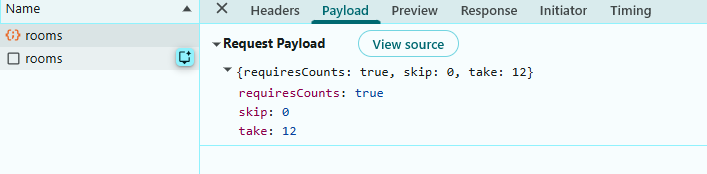
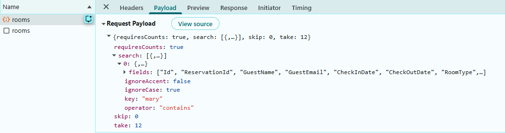
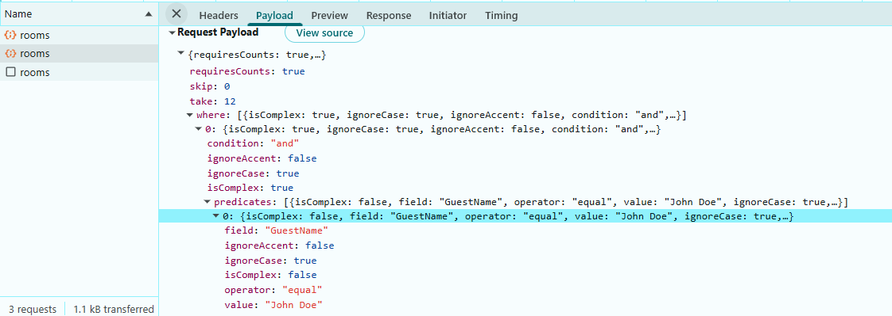
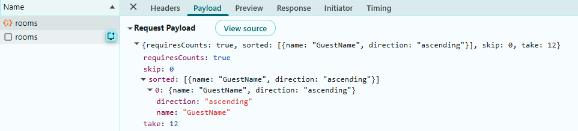
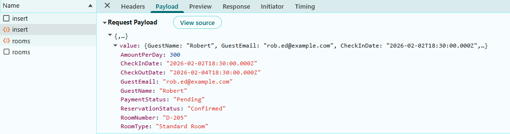
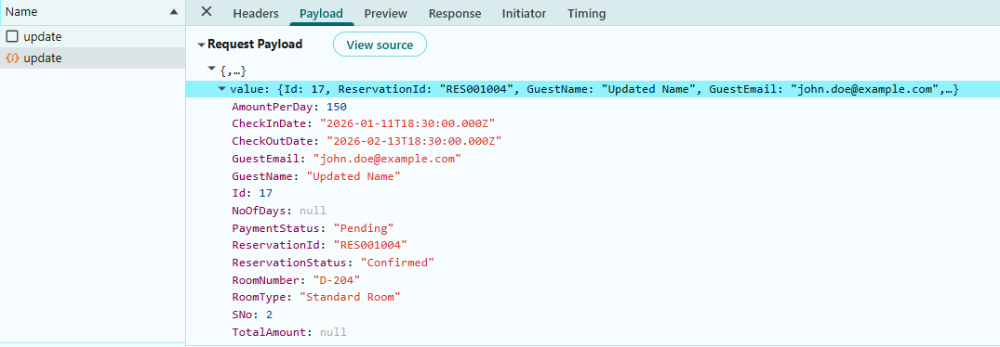
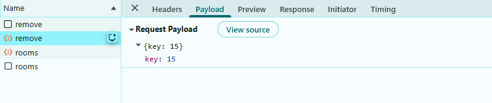
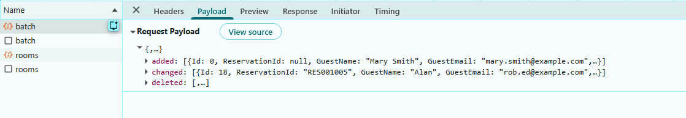

# Connecting SQL Server to Syncfusion Angular Grid Using Dapper

The Syncfusion<sup style="font-size:70%">&reg;</sup> Angular Grid supports binding data from SQL Server using the lightweight **Dapper** micro‑ORM. This modern approach provides a simpler, more direct alternative where raw SQL control is preferred.

## What is Dapper?

[Dapper](https://www.learndapper.com/) is a lightweight, high-performance ORM (Object-Relational Mapper) that provides a minimal abstraction over ADO.NET. It maps query results directly to C# objects with minimal overhead, making it ideal for applications where performance and control over SQL are critical.

**Key benefits of Dapper**

- **High Performance**: Minimal overhead with direct ADO.NET access, resulting in faster query execution.
- **SQL Control**: Write raw SQL queries when needed, giving developers full control over database operations.
- **Simple and Lightweight**: Requires minimal configuration and learning curve compared to full ORMs.
- **Flexible Mapping**: Automatically maps query results to objects with minimal configuration.
- **Built-in Security**: Parameterized queries prevent SQL injection attacks.

## Prerequisites

Ensure the following software and packages are installed before proceeding:

| Software/Package | Version | Purpose |
|-----------------|---------|---------|
| Visual Studio | 2022 or later | Development IDE with Angular and ASP.NET Core workload |
| .NET SDK | .NET 10.0 or later | Runtime and build tools for backend API |
| Node.js | 18.x or later | JavaScript runtime for Angular development |
| Angular CLI | 18.x or later | Angular command-line interface |
| SQL Server | 2019 or later | Database server |
| Dapper | 2.1.66 or later | Lightweight micro-ORM for SQL mapping |

## Key topics

| # | Topics | Link |
|---|---------|-------|
| 1 | Create a SQL Server database with reservation records | [View](#step-1-create-the-database-and-table-in-sql-server) |
| 2 | Install necessary NuGet packages for Dapper and Syncfusion | [View](#step-3-install-required-nuget-packages) |
| 3 | Create data models for database mapping | [View](#step-4-create-the-data-model) |
| 4 | Configure connection strings for SQL Server | [View](#step-5-configure-the-connection-string) |
| 5 | Implement the repository pattern with Dapper for efficient data access | [View](#step-6-create-the-repository-class) |
| 6 | Create an Angular Grid component that supports searching, filtering, sorting, paging, and CRUD operations | [View](#integrating-syncfusion-angular-grid) |
| 7 | Handle bulk operations and batch updates | [View](#step-10-perform-crud-operations) |
| 8 | Complete end‑to‑end reservation management workflow using the Syncfusion Angular Grid with server‑side processing and SQL Server integration | [View](#step-11-complete-code)  |


## Setting up the SQL Server environment with Dapper

The API service relies on an existing SQL Server database containing a table. Within this documentation, a "Rooms" table is introduced to support hotel reservation management.

### Step 1: Create the Database and Table in SQL Server

First, the **SQL Server database** structure must be created to store reservation records.

**Instructions:**

1. Open SQL Server Management Studio or any SQL Server client.
2. Create a new database named "HotelBookingDB".
3. Define a "Rooms" table with the specified schema.
4. Insert sample data for testing.

Run the following SQL script:

```sql
-- Create Database if it doesn't exist
IF NOT EXISTS (SELECT 1 FROM sys.databases WHERE name = N'HotelBookingDB')
BEGIN
    CREATE DATABASE HotelBookingDB;
END
GO

USE HotelBookingDB;
GO

-- Create Rooms table if it doesn't exist
IF NOT EXISTS (SELECT 1 FROM sys.tables WHERE name = N'Rooms' AND schema_id = SCHEMA_ID(N'dbo'))
BEGIN
    CREATE TABLE dbo.Rooms (
        Id                 INT IDENTITY(1,1) PRIMARY KEY,
        ReservationId      NVARCHAR(50)  NOT NULL,
        GuestName          NVARCHAR(255) NOT NULL,
        GuestEmail         NVARCHAR(255) NULL,
        CheckInDate        DATE          NULL,
        CheckOutDate       DATE          NULL,
        RoomType           NVARCHAR(100) NULL,
        RoomNumber         NVARCHAR(50)  NULL,
        AmountPerDay       DECIMAL(18,2) NULL,
        NoOfDays           INT           NULL,
        TotalAmount        DECIMAL(18,2) NULL,
        PaymentStatus      NVARCHAR(50)  NULL,
        ReservationStatus  NVARCHAR(50)  NULL
    );
END
GO

-- Insert Sample Data (Optional)
IF NOT EXISTS (SELECT 1 FROM dbo.Rooms WHERE ReservationId IN (N'RES001001', N'RES001002'))
BEGIN
    INSERT INTO dbo.Rooms
        (ReservationId, GuestName, GuestEmail, CheckInDate, CheckOutDate, RoomType, RoomNumber, 
         AmountPerDay, NoOfDays, TotalAmount, PaymentStatus, ReservationStatus)
    VALUES
        (N'RES001001', N'John Doe', N'john.doe@example.com', '2025-01-15', '2025-01-18', N'Deluxe', N'101', 150.00, 3, 450.00, N'Paid', N'Confirmed'),
        (N'RES001002', N'Jane Smith', N'jane.smith@example.com', '2025-01-20', '2025-01-22', N'Standard', N'202', 100.00, 2, 200.00, N'Pending', N'Confirmed');
END
GO
```

After executing this script, the reservation records are stored in the "Rooms" table within the "HotelBookingDB" database. The database is now ready for integration with the Angular application.

### Step 2: Create a new ASP.NET Core project

Before installing NuGet packages, a new ASP.NET Core Web Application must be created.

**Instructions:**

1. Open **Visual Studio 2022**.
2. Click **Create a new project**.
3. Search for **ASP.NET Core Web API**.
4. Select the template and click **Next**.
5. Configure the project:
   - **Project name**: **Grid_Dapper.Server** (or a preferred name)
   - **Location**: Choose a folder location
   - **Framework**: Select .NET 10.0 (or latest available)
6. Click **Create**.

Visual Studio will create the project with the default structure, including folders like **Controllers** and configuration files. The ASP.NET Core project is now ready for integration with Dapper and Syncfusion components.

### Step 3: Install required NuGet packages

NuGet packages are software libraries that add functionality to the application. These packages enable Dapper, SQL Server connectivity, and Syncfusion Grid integration.

**Method 1: Using Package Manager Console**

1. Open Visual Studio.
2. Navigate to **Tools → NuGet Package Manager → Package Manager Console**.
3. Run the following commands:

```powershell
Install-Package Microsoft.Data.SqlClient
Install-Package Dapper
Install-Package Syncfusion.EJ2.AspNet.Core
```

**Method 2: Using NuGet Package Manager UI**

1. Open **Visual Studio → Tools → NuGet Package Manager → Manage NuGet Packages for Solution**.
2. Search for and install each package individually:
   - **Microsoft.Data.SqlClient**
   - **Dapper**
   - **Syncfusion.EJ2.AspNet.Core**

All required packages are now installed.

### Step 4: Create the data model

A data model is a C# class that represents the structure of a database table. This model defines the properties that correspond to the columns in the Rooms table.

**Instructions:**

1. Create a new folder named **Data** in the ASP.NET Core project.
2. Inside the **Data** folder, create a new file named **Reservation.cs**.
3. Define the **Reservation** class with the following code:

```csharp
using System.ComponentModel.DataAnnotations;

namespace Grid_Dapper.Server.Data
{
    /// <summary>
    /// Represents a hotel room reservation record
    /// </summary>
    public class Reservation
    {
        /// <summary>
        /// Unique identifier (primary key, auto-generated)
        /// </summary>
        [Key]
        public int Id { get; set; }

        /// <summary>
        /// Reservation identifier (e.g., "RES001001")
        /// </summary>
        public string ReservationId { get; set; } = string.Empty;

        /// <summary>
        /// Guest name
        /// </summary>
        public string GuestName { get; set; } = string.Empty;

        /// <summary>
        /// Guest email address
        /// </summary>
        public string? GuestEmail { get; set; }

        /// <summary>
        /// Check-in date
        /// </summary>
        public DateTime? CheckInDate { get; set; }

        /// <summary>
        /// Check-out date
        /// </summary>
        public DateTime? CheckOutDate { get; set; }

        /// <summary>
        /// Room type (e.g., "Deluxe", "Standard")
        /// </summary>
        public string? RoomType { get; set; }

        /// <summary>
        /// Room number (e.g., "101")
        /// </summary>
        public string? RoomNumber { get; set; }

        /// <summary>
        /// Daily room rate
        /// </summary>
        public decimal? AmountPerDay { get; set; }

        /// <summary>
        /// Total number of days for the reservation
        /// </summary>
        public int? NoOfDays { get; set; }

        /// <summary>
        /// Total amount for the entire stay
        /// </summary>
        public decimal? TotalAmount { get; set; }

        /// <summary>
        /// Payment status (e.g., "Paid", "Pending")
        /// </summary>
        public string? PaymentStatus { get; set; }

        /// <summary>
        /// Reservation status (e.g., "Confirmed", "Cancelled")
        /// </summary>
        public string? ReservationStatus { get; set; }
    }
}
```

**Explanation:**

- The `[Key]` attribute marks the "Id" property as the primary key (a unique identifier for each record).
- Each property represents a column in the database table.
- The `?` symbol indicates that a property is nullable (can be empty).
- XML documentation comments describe each property's purpose.

The data model has been successfully created.

### Step 5: Configure the connection string

A connection string contains the information needed to connect the application to the SQL Server database, including the server address, database name, and credentials.

**Instructions:**

1. Open the **appsettings.json** file in the project root.
2. Add or update the `ConnectionStrings` section with the SQL Server connection details:

```json
{
  "Logging": {
    "LogLevel": {
      "Default": "Information",
      "Microsoft.AspNetCore": "Warning"
    }
  },
  "AllowedHosts": "*",
  "ConnectionStrings": {
    "HotelBookingDB": "Server=localhost;Database=HotelBookingDB;Trusted_Connection=True;TrustServerCertificate=True"
  }
}
```

**Connection string components:**

| Component | Description |
|-----------|-------------|
| Server | The address of the SQL Server instance |
| Database | The database name (in this case, "HotelBookingDB") |
| Trusted_Connection | Set to `True` for Windows Authentication; use `False` with Username/Password for SQL Authentication |
| TrustServerCertificate | Set to `True` to bypass certificate validation (suitable for local development) |

The database connection string has been configured successfully.

### Step 6: Create the Repository Class

A repository class is an intermediary layer that handles all database operations. With Dapper, this class uses raw SQL queries executed through Dapper's extension methods on `IDbConnection`, which automatically maps query results to C# objects.

**Instructions:**

1. Inside the **Data** folder, create a new file named **ReservationRepository.cs**.
2. Define the **ReservationRepository** class with the following code: 

```csharp
using Dapper;
using System.Data;

namespace Grid_Dapper.Server.Data
{
    /// <summary>
    /// Repository pattern implementation for Reservation using Dapper
    /// Handles CRUD operations for hotel room reservations
    /// </summary>
    public class ReservationRepository
    {
        private readonly IDbConnection _connection;

        // ReservationId configuration (matches samples like RES001001)
        private const string ReservationIdPrefix = "RES";
        private const int ReservationIdStartNumber = 1001;

        public ReservationRepository(IDbConnection connection)
        {
            _connection = connection;
        }

        /// <summary>
        /// Retrieves all reservations ordered by Id descending.
        /// </summary>
        public async Task<List<Reservation>> GetReservationsAsync()
        {
            const string sql = @"SELECT Id, ReservationId, GuestName, GuestEmail, CheckInDate, CheckOutDate,
                                         RoomType, RoomNumber, AmountPerDay, NoOfDays, TotalAmount,
                                         PaymentStatus, ReservationStatus
                                  FROM dbo.Rooms ORDER BY Id DESC";

            var result = await _connection.QueryAsync<Reservation>(sql);
            return result.ToList();
        }

        /// <summary>
        /// Generates the next ReservationId (e.g., RES001002) by reading the current max numeric suffix.
        /// </summary>
        private async Task<string> GenerateReservationIdAsync()
        {
            const string sql = @"
                SELECT MAX(TRY_CAST(SUBSTRING(ReservationId, LEN(@prefix) + 1, 50) AS INT))
                FROM dbo.Rooms
                WHERE ReservationId LIKE @like";

            var maxNumber = await _connection.ExecuteScalarAsync<int?>(sql, new
            {
                prefix = ReservationIdPrefix,
                like = ReservationIdPrefix + "%"
            });

            int next = (maxNumber ?? (ReservationIdStartNumber - 1)) + 1;
            // Pad to 6 digits to match existing samples like RES001001
            return $"{ReservationIdPrefix}{next:D6}";
        }

        /// <summary>
        /// Inserts a new reservation and returns the created entity with generated Id.
        /// </summary>
        public async Task<Reservation> AddReservationAsync(Reservation value)
        {
            if (value == null) throw new ArgumentNullException(nameof(value));

            if (string.IsNullOrWhiteSpace(value.ReservationId))
                value.ReservationId = await GenerateReservationIdAsync();

            const string sql = @"
                INSERT INTO dbo.Rooms
                    (ReservationId, GuestName, GuestEmail, CheckInDate, CheckOutDate, RoomType, RoomNumber,
                     AmountPerDay, NoOfDays, TotalAmount, PaymentStatus, ReservationStatus)
                OUTPUT INSERTED.Id
                VALUES
                    (@ReservationId, @GuestName, @GuestEmail, @CheckInDate, @CheckOutDate, @RoomType, @RoomNumber,
                     @AmountPerDay, @NoOfDays, @TotalAmount, @PaymentStatus, @ReservationStatus)";

            value.Id = await _connection.ExecuteScalarAsync<int>(sql, value);
            return value;
        }

        /// <summary>
        /// Updates an existing reservation by Id and returns the updated entity.
        /// </summary>
        public async Task<Reservation> UpdateReservationAsync(Reservation value)
        {
            if (value == null) throw new ArgumentNullException(nameof(value));

            const string sql = @"
                UPDATE dbo.Rooms
                   SET ReservationId     = @ReservationId,
                       GuestName         = @GuestName,
                       GuestEmail        = @GuestEmail,
                       CheckInDate       = @CheckInDate,
                       CheckOutDate      = @CheckOutDate,
                       RoomType          = @RoomType,
                       RoomNumber        = @RoomNumber,
                       AmountPerDay      = @AmountPerDay,
                       NoOfDays          = @NoOfDays,
                       TotalAmount       = @TotalAmount,
                       PaymentStatus     = @PaymentStatus,
                       ReservationStatus = @ReservationStatus
                 WHERE Id = @Id";

            await _connection.ExecuteAsync(sql, value);
            return value;
        }

        /// <summary>
        /// Deletes a reservation by Id. Returns the number of affected rows (0 or 1).
        /// </summary>
        public async Task<int> RemoveReservationAsync(int id)
        {
            const string sql = @"DELETE FROM dbo.Rooms WHERE Id = @Id";
            return await _connection.ExecuteAsync(sql, new { Id = id });
        }
    }
}
```

**Dapper extension methods:**

| Method | Description |
|--------|-------------|
| `QueryAsync<T>` | Executes a SQL SELECT and automatically maps each row to an instance of `T` by matching column names to property names. Returns `IEnumerable<T>`. |
| `ExecuteScalarAsync<T>` | Executes a SQL statement and returns the first column of the first row as type `T` (used for `INSERT … OUTPUT INSERTED.Id` and aggregate queries). |
| `ExecuteAsync` | Executes a SQL INSERT / UPDATE / DELETE statement and returns the number of affected rows. |

The repository class manages all interactions with the database and is now ready for implementation.


### Step 7: Register services in Program.cs

The **Program.cs** file is where application services are registered and configured. This file must be updated to enable Dapper and the repository pattern.

**Instructions:**

1. Open the **Program.cs** file at the project root.
2. Add the following code:

```csharp
using Grid_Dapper.Server.Data;
using System.Data;
using Microsoft.Data.SqlClient;
using Microsoft.AspNetCore.Http.Json;

var builder = WebApplication.CreateBuilder(args);

builder.Services.AddOpenApi();

// CORS: allow all (simple for local dev / separate frontend)
builder.Services.AddCors(options =>
{
    options.AddDefaultPolicy(policy => policy.AllowAnyOrigin().AllowAnyHeader().AllowAnyMethod());
});


// Controllers with System.Text.Json configured to KEEP PascalCase
builder.Services.AddControllers()
    .AddJsonOptions(o =>
    {
        // Preserve PascalCase property names in JSON serialization
        o.JsonSerializerOptions.PropertyNamingPolicy = null;
        // Handle reference loops (if any circular dependencies exist)
        o.JsonSerializerOptions.ReferenceHandler = System.Text.Json.Serialization.ReferenceHandler.IgnoreCycles;
        // Optional: Enable indented JSON for debugging
        o.JsonSerializerOptions.WriteIndented = true;
    });


// Get connection string from appsettings.json
var connectionString = builder.Configuration.GetConnectionString("HotelBookingDB");
if (string.IsNullOrEmpty(connectionString))
{
    throw new InvalidOperationException("Connection string 'HotelBookingDB' not found in configuration.");
}


// Register IDbConnection for Dapper
builder.Services.AddScoped<IDbConnection>(sp => new SqlConnection(connectionString));

// Register the repository for dependency injection
builder.Services.AddScoped<ReservationRepository>();

var app = builder.Build();

// Configure HTTP request pipeline
if (app.Environment.IsDevelopment())
{
    app.MapOpenApi();
    app.UseDeveloperExceptionPage();
}

app.UseHttpsRedirection();
app.UseCors();
app.UseAuthorization();
app.MapControllers();

app.Run();
```

**Service registration explanation:**

| Registration | Purpose |
|-------------|---------|
| `AddCors` | Enables Cross-Origin Resource Sharing (CORS) to allow Angular client requests |
| `AddControllers().AddJsonOptions` | Configures JSON serialization to preserve PascalCase property names |
| `AddScoped<IDbConnection>` | Registers SQL Server connection for dependency injection |
| `AddScoped<ReservationRepository>` | Registers the repository for use in controllers |

The service registration has been completed successfully.

### Step 8: Create the Controller

A controller is an ASP.NET Core component that handles HTTP requests from the client. This controller exposes API endpoints for the Angular Grid to perform CRUD operations.

**Instructions:**

1. Create a new folder named **Controllers** in the project root (if it doesn't exist).
2. Inside the **Controllers** folder, create a new file named **RoomsController.cs**.
3. Define the **RoomsController** class with the following code:

```csharp
using Microsoft.AspNetCore.Mvc;
using Syncfusion.EJ2.Base;
using Grid_Dapper.Server.Data;
using System.Collections.Generic;
using System.Linq;

namespace Grid_Dapper.Server.Controllers
{
    [ApiController]
    [Route("api/[controller]")]
    public class RoomsController : ControllerBase
    {
        private readonly ReservationRepository _repo;
        private readonly DataOperations _dataOps = new DataOperations();

        public RoomsController(ReservationRepository repo)
        {
            _repo = repo;
        }

        // POST: api/rooms
        [HttpPost]
        public async Task<IActionResult> List([FromBody] DataManagerRequest dm)
        {
            IEnumerable<Reservation> data = await _repo.GetReservationsAsync();

            // Searching
            if (dm.Search != null && dm.Search.Count > 0)
            {
                data = _dataOps.PerformSearching(data, dm.Search);
            }

            // Filtering
            if (dm.Where != null && dm.Where.Count > 0)
            {
                data = _dataOps.PerformFiltering(data, dm.Where, dm.Where[0].Operator);
            }

            // Sorting
            if (dm.Sorted != null && dm.Sorted.Count > 0)
            {
                data = _dataOps.PerformSorting(data, dm.Sorted);
            }

            // Count BEFORE paging
            int count = data.Count();

            // Paging
            if (dm.Skip != 0)
                data = _dataOps.PerformSkip(data, dm.Skip);
            if (dm.Take != 0)
                data = _dataOps.PerformTake(data, dm.Take);

            // Final shape required by UrlAdaptor
            return Ok(dm.RequiresCounts ? new { result = data, count } : data);
        }

        [HttpGet("ping")]
        public IActionResult Ping() => Ok(new { ok = true, time = DateTime.UtcNow });

        // INSERT
        // POST api/rooms/insert
        [HttpPost("insert")]
        public async Task<IActionResult> Insert([FromBody] CRUDModel<Reservation> args)
        {
           if (args?.Value == null)
               return BadRequest("Invalid payload.");
           var created = await _repo.AddReservationAsync(args.Value);
           return Ok(created);
        }

        // UPDATE
        // POST api/rooms/update
        [HttpPost("update")]
        public async Task<IActionResult> Update([FromBody] CRUDModel<Reservation> args)
        {
           if (args?.Value == null)
               return BadRequest("Invalid payload.");
           if (args.Value.Id <= 0)
               return BadRequest("Id is required for update.");
           var updated = await _repo.UpdateReservationAsync(args.Value);
           return Ok(updated);
        }

        // REMOVE
        // POST api/rooms/remove
        // UrlAdaptor sends { key: <id>, keyColumn: "Id", action: "remove" }
        [HttpPost("remove")]
        public async Task<IActionResult> Remove([FromBody] CRUDModel<Reservation> args)
        {
           if (args == null || args.Key == null)
               return BadRequest("Key is required.");
           if (!int.TryParse(args.Key.ToString(), out var id))
               return BadRequest("Invalid key format.");

           await _repo.RemoveReservationAsync(id);
           return Ok(new { Id = id });
        }

        // BATCH
        // POST api/rooms/batch
        [HttpPost("batch")]
        public async Task<IActionResult> Batch([FromBody] CRUDModel<Reservation> args)
        {
           if (args == null)
               return BadRequest("Invalid payload.");

           if (args.Changed != null)
           {
               foreach (var t in args.Changed)
                   await _repo.UpdateReservationAsync(t);
           }

           if (args.Added != null)
           {
               for (int i = 0; i < args.Added.Count; i++)
                   args.Added[i] = await _repo.AddReservationAsync(args.Added[i]);
           }

           if (args.Deleted != null)
           {
               foreach (var t in args.Deleted)
                   await _repo.RemoveReservationAsync(t.Id);
           }

           return Ok(new { status = "ok" });
        }
    }
}
```

**Controller endpoint explanation:**

| Endpoint | HTTP Method | Purpose |
|----------|------------|---------|
| `/api/rooms` | POST | Retrieves all reservations with server-side searching, filtering, sorting, and paging |
| `/api/rooms/insert` | POST | Inserts a new reservation |
| `/api/rooms/update` | POST | Updates an existing reservation |
| `/api/rooms/remove` | POST | Deletes a reservation by Id |
| `/api/rooms/batch` | POST | Handles batch operations (add, update, delete multiple records) |

The controller has been successfully created and is ready to handle requests from the Angular Grid.

## Integrating Syncfusion Angular Grid

The Syncfusion Angular Grid is a robust, high‑performance component built to efficiently display, manage, and manipulate large datasets. It provides advanced features such as sorting, filtering, and paging. Follow these steps to render the grid and integrate it with a SQL Server database.

### Step 1: Creating the Angular client application

Open a Visual Studio Code terminal or Command prompt and run the below command to create an Angular application:

```bash
ng new grid_dapper.client
cd grid_dapper.client
```

### Step 2: Adding Syncfusion packages

Install the necessary Syncfusion packages using the below command in Visual Studio Code terminal or Command prompt.

```bash
npm install @syncfusion/ej2-angular-grids --save
npm install @syncfusion/ej2-data --save
```

After installation, the necessary CSS files are available in the (**../node_modules/@syncfusion**) directory. Add the required CSS references to the (**src/styles.css**) file to ensure proper styling of the Grid component.

```css
@import '../node_modules/@syncfusion/ej2-base/styles/bootstrap5.3.css';  
@import '../node_modules/@syncfusion/ej2-buttons/styles/bootstrap5.3.css';  
@import '../node_modules/@syncfusion/ej2-calendars/styles/bootstrap5.3.css';  
@import '../node_modules/@syncfusion/ej2-dropdowns/styles/bootstrap5.3.css';  
@import '../node_modules/@syncfusion/ej2-inputs/styles/bootstrap5.3.css';  
@import '../node_modules/@syncfusion/ej2-navigations/styles/bootstrap5.3.css';
@import '../node_modules/@syncfusion/ej2-popups/styles/bootstrap5.3.css';
@import '../node_modules/@syncfusion/ej2-splitbuttons/styles/bootstrap5.3.css';
@import '../node_modules/@syncfusion/ej2-notifications/styles/bootstrap5.3.css';
@import '../node_modules/@syncfusion/ej2-angular-grids/styles/bootstrap5.3.css';

```

For this project, the "Bootstrap 5.3" theme is applied. Other themes can be selected, or the existing theme can be customized to meet specific project requirements. For detailed guidance on theming and customization, refer to the [Syncfusion Angular Components Appearance](https://ej2.syncfusion.com/angular/documentation/appearance/theme-studio) documentation.

### Step 3: Add Syncfusion Angular Grid

The Angular Grid component can be added to the application by following these steps. To get started, add the Grid component to the application using the following code in (**src/app/app.ts**):

```ts
// File: src/app/app.ts
import { Component, OnInit } from '@angular/core';
import { CommonModule } from '@angular/common';
import { DataManager } from '@syncfusion/ej2-data';
import {GridModule,} from '@syncfusion/ej2-angular-grids';
import { CustomAdaptor } from './custom-adaptor';

@Component({
  selector: 'app-root',
  standalone: true,
  imports: [
    CommonModule,
    GridModule,
  ],
  templateUrl: './app.html',
})
export class AppComponent {
  public dataManager?: DataManager;
  public BASE_URL = 'https://localhost:7000/api/rooms';
  ngOnInit(): void {
    this.dataManager = new DataManager({
      url: `${this.BASE_URL}`,
      insertUrl: `${this.BASE_URL}/insert`,
      updateUrl: `${this.BASE_URL}/update`,
      removeUrl: `${this.BASE_URL}/remove`,
      batchUrl: `${this.BASE_URL}/batch`,
      adaptor: new CustomAdaptor(),
    });
  }
}

```

```html
<ejs-grid [dataSource]="dataManager">
  <e-columns>
    <e-column field="ReservationId" headerText="Reservation ID" width="170" [allowEditing]="false" ></e-column>
    <!-- Additional columns -->
  </e-columns>
</ejs-grid>
```

### Step 4: Implement the CustomAdaptor

The Syncfusion Angular Grid can bind data from a **SQL Server** database using [DataManager](https://ej2.syncfusion.com/angular/documentation/data/getting-started) and set the `adaptor` property to `CustomAdaptor` for scenarios that require full control over data operations.

The `CustomAdaptor` (client-side) is a bridge between the Angular Grid and the ASP.NET Core backend. It extends the `UrlAdaptor` and handles all data operation requests by constructing HTTP POST calls to corresponding server endpoints. When the Grid performs operations like reading, searching, filtering, sorting, paging, and CRUD operations, the CustomAdaptor intercepts these actions and formats them into HTTP requests. These requests are sent to the ASP.NET Core Web API controller on the server, which processes the `DataManagerRequest` using Dapper to query the SQL Server database and return the results.

**Instructions:**

1. Create a new **custom-adaptor.ts** file in the (**app**) folder.
2. Add the following code inside this file:

```ts
// File: src/app/custom-adaptor.ts
import {
  DataManager,
  UrlAdaptor,
  Query,
  ReturnOption,
} from '@syncfusion/ej2-data';

export class CustomAdaptor extends UrlAdaptor {
  public override processResponse() {
    let i = 0;
    const original: any = super.processResponse.apply(this, arguments as any);
    // Adding serial number.
    if (original.result) {
      original.result.forEach((item: any) => (item.SNo = ++i));
    }
    return original;
  }

  public override beforeSend(
    dm: DataManager,
    request: Request,
    settings?: any,
  ): void {
    super.beforeSend(dm, request, settings);
  }

  public override insert(dm: DataManager, data: any, tableName?: string): any {
    return {
      url: `${(dm as any).dataSource['insertUrl']}`,
      type: 'POST',
      contentType: 'application/json; charset=utf-8',
      data: JSON.stringify(data),
    };
  }

  public override update(
    dm: DataManager,
    keyField: string,
    value: any,
    tableName?: string,
  ): any {
    return {
      url: `${(dm as any).dataSource['updateUrl']}`,
      type: 'POST',
      contentType: 'application/json; charset=utf-8',
      data: JSON.stringify(value),
    };
  }

  public override remove(
    dm: DataManager,
    keyField: string,
    value: any,
    tableName?: string,
  ): any {
    const keyValue =
      value && typeof value === 'object' ? value[keyField] : value;
    return {
      url: `${(dm as any).dataSource['removeUrl']}`,
      type: 'POST',
      contentType: 'application/json; charset=utf-8',
      data: JSON.stringify({ key: keyValue }),
    };
  }

  public override batchRequest(dm: DataManager, changes: any): any {
    return {
      url: `${(dm as any).dataSource['batchUrl']}`,
      type: 'POST',
      contentType: 'application/json; charset=utf-8',
      data: JSON.stringify({
        added: changes.addedRecords,
        changed: changes.changedRecords,
        deleted: changes.deletedRecords,
      }),
    };
  }
}

```

The `CustomAdaptor` class has been successfully implemented with all data operations.

 ### Step 5: Add toolbar with CRUD and search options

The toolbar provides buttons for adding, editing, deleting records, and searching the data.

**Instructions:**

1. Open the (**src/app/app.ts**) file.
2. Inject the `ToolbarService` into the `providers` array of the "AppComponent".
3. Update the Grid component to include the [toolbar](https://ej2.syncfusion.com/angular/documentation/api/grid/index-default#toolbar) property with CRUD and search options:

```ts
// File: src/app/app.ts
import { Component, OnInit } from '@angular/core';
import { CommonModule } from '@angular/common';
import { DataManager } from '@syncfusion/ej2-data';
import {
  GridModule,
  ToolbarService,
} from '@syncfusion/ej2-angular-grids';
import { CustomAdaptor } from './custom-adaptor';

@Component({
  selector: 'app-root',
  standalone: true,
  imports: [
    CommonModule,
    GridModule,
  ],
  providers: [
    ToolbarService,
  ],
  templateUrl: './app.html',
})
export class AppComponent {
  public toolbar = ['Add', 'Edit', 'Delete', 'Update', 'Cancel', 'Search'];
}
```

```html
<ejs-grid [dataSource]="dataManager" [toolbar]="toolbar">
  <e-columns>
    <e-column field="ReservationId" headerText="Reservation ID" width="170" [allowEditing]="false" ></e-column>
    <!-- Additional columns -->
  </e-columns>
</ejs-grid>
```

**Toolbar Items Explanation:**

| Item | Function |
| ------ | ---------- |
| `Add` | Opens a form to add a new record. |
| `Edit` | Enables editing of the selected record. |
| `Delete` | Deletes the selected record from the database. |
| `Update` | Saves changes made to the selected record. |
| `Cancel` | Cancels the current edit or add operation. |
| `Search` | Displays a search box to find records. |

The toolbar has been successfully added.

### Step 6: Implement paging feature

The paging feature allows efficient loading of large data sets through on‑demand loading.

**Instructions:**

1. Paging in the Grid is enabled by setting the [allowPaging](https://ej2.syncfusion.com/angular/documentation/api/grid/index-default#allowpaging) property to `true`.
2. And injecting the `PagerService` module in the `providers` property of the "AppComponent".

```ts
// File: src/app/app.ts
import { Component, OnInit } from '@angular/core';
import { CommonModule } from '@angular/common';
import { DataManager } from '@syncfusion/ej2-data';
import {
  GridModule,
  PageService,
} from '@syncfusion/ej2-angular-grids';
import { CustomAdaptor } from './custom-adaptor';

@Component({
  selector: 'app-root',
  standalone: true,
  imports: [
    CommonModule,
    GridModule, // NgModule imported directly into a standalone component
  ],
  providers: [
    PageService,
  ],
  templateUrl: './app.html',
})
export class AppComponent {

}
```

```html
<ejs-grid [dataSource]="dataManager" [allowPaging]="true">
  <e-columns>
    <e-column field="ReservationId" headerText="Reservation ID" width="170" [allowEditing]="false" ></e-column>
    <!-- Additional columns -->
  </e-columns>
</ejs-grid>
```

On the server side, create a file **RoomsController.cs** and add the "List" method provided below:

```csharp
using Microsoft.AspNetCore.Mvc;
using Syncfusion.EJ2.Base;
using Grid_Dapper.Server.Data;
using System.Collections.Generic;
using System.Linq;

namespace Grid_Dapper.Server.Controllers
{
    [ApiController]
    [Route("api/[controller]")]
    public class RoomsController : ControllerBase
    {
        private readonly ReservationRepository _repo;
        private readonly DataOperations _dataOps = new DataOperations();

        public RoomsController(ReservationRepository repo)
        {
            _repo = repo;
        }

        // POST: api/rooms
        [HttpPost]
        public async Task<IActionResult> List([FromBody] DataManagerRequest dm)
        {
            IEnumerable<Reservation> data = await _repo.GetReservationsAsync();

            // Count before paging
            int count = data.Count();

            // Paging
            if (dm.Skip != 0)
                data = _dataOps.PerformSkip(data, dm.Skip);
            if (dm.Take != 0)
                data = _dataOps.PerformTake(data, dm.Take);

            return Ok(dm.RequiresCounts ? new { result = data, count } : data);
        }
    }
}
```

**Paging details:**

- The Grid sends page size `take` and skip count `skip` parameters to the server.
- The `operation.PerformSkip()` method skips the specified number of records.
- The `operation.PerformTake()` method retrieves only the required number of records for the current page.
- The total count is calculated before paging to display the total number of records.
- Results are returned and displayed in the Grid with pagination controls.

When paging is performed in the Grid, a request is sent to the server with the following payload.



### Step 7: Implement searching feature

Searching allows finding records by entering keywords in the search box.

**Instructions:**

1. Ensure the toolbar includes the `Search` item.
2. Inject the `ToolbarService` module in the `providers` property of the "AppComponent".

```ts
// File: src/app/app.ts
import { Component, OnInit } from '@angular/core';
import { CommonModule } from '@angular/common';
import { DataManager, UrlAdaptor } from '@syncfusion/ej2-data';
import {
  GridModule,
  ToolbarService,
} from '@syncfusion/ej2-angular-grids';
import { CustomAdaptor } from './custom-adaptor';

@Component({
  selector: 'app-root',
  standalone: true,
  imports: [
    CommonModule,
    GridModule, // NgModule imported directly into a standalone component
  ],
  providers: [
    ToolbarService,
  ],
  templateUrl: './app.html',
})
export class AppComponent {
  public toolbar = ['Search'];
}
```

```html
<ejs-grid [dataSource]="dataManager" [toolbar]="toolbar">
  <e-columns>
    <e-column field="ReservationId" headerText="Reservation ID" width="170" [allowEditing]="false" ></e-column>
    <!-- Additional columns -->
  </e-columns>
</ejs-grid>
```

Update the "List" method in the **RoomsController.cs** file to handle searching:


```csharp
using Microsoft.AspNetCore.Mvc;
using Syncfusion.EJ2.Base;
using Grid_Dapper.Server.Data;
using System.Collections.Generic;
using System.Linq;

namespace Grid_Dapper.Server.Controllers
{
    [ApiController]
    [Route("api/[controller]")]
    public class RoomsController : ControllerBase
    {
        private readonly ReservationRepository _repo;
        private readonly DataOperations _dataOps = new DataOperations();

        public RoomsController(ReservationRepository repo)
        {
            _repo = repo;
        }

        // POST: api/rooms
        [HttpPost]
        public async Task<IActionResult> List([FromBody] DataManagerRequest dm)
        {
            IEnumerable<Reservation> data = await _repo.GetReservationsAsync();

            // Searching
            if (dm.Search != null && dm.Search.Count > 0)
                data = _dataOps.PerformSearching(data, dm.Search);

            // Other action code goes here

            int count = data.Count();

            return Ok(dm.RequiresCounts ? new { result = data, count } : data);
        }
    }
}
```

**Searching details:**

- When text is entered in the search box and Enter is pressed, the Grid sends a search request to the server.
- The "List" method receives the search criteria in `search` parameter.
- The `operation.PerformSearching()` method filters the data based on the search term.
- Results are returned and displayed in the Grid.

When searching is performed in the Grid, a request is sent to the server with the following payload.



### Step 8: Implement filtering feature

Filtering enables the data to be narrowed down based on column values through a menu interface

**Instructions:**

1. Filtering is enabled by setting the [allowFiltering](https://ej2.syncfusion.com/angular/documentation/api/grid/index-default#allowfiltering) property to `true`.
2. Inject the `FilterService` module in the `providers` property of the "AppComponent".

```ts
// File: src/app/app.ts
import { Component, OnInit } from '@angular/core';
import { CommonModule } from '@angular/common';
import { DataManager } from '@syncfusion/ej2-data';
import {
  GridModule,
  FilterService,
} from '@syncfusion/ej2-angular-grids';
import { CustomAdaptor } from './custom-adaptor';

@Component({
  selector: 'app-root',
  standalone: true,
  imports: [
    CommonModule,
    GridModule, // NgModule imported directly into a standalone component
  ],
  providers: [
    FilterService,
  ],
  templateUrl: './app.html',
})
export class AppComponent {
  public filterSettings: Object = { type: 'Excel' };
}
```

```html
<ejs-grid [dataSource]="dataManager" [allowFiltering]="true" [filterSettings]="filterSettings">
  <e-columns>
    <e-column field="ReservationId" headerText="Reservation ID" width="170" [allowEditing]="false" ></e-column>
    <!-- Additional columns -->
  </e-columns>
</ejs-grid>
```

Update the "List" method in the **RoomsController.cs** file to handle filtering:

```csharp
using Microsoft.AspNetCore.Mvc;
using Syncfusion.EJ2.Base;
using Grid_Dapper.Server.Data;
using System.Collections.Generic;
using System.Linq;

namespace Grid_Dapper.Server.Controllers
{
    [ApiController]
    [Route("api/[controller]")]
    public class RoomsController : ControllerBase
    {
        private readonly ReservationRepository _repo;
        private readonly DataOperations _dataOps = new DataOperations();

        public RoomsController(ReservationRepository repo)
        {
            _repo = repo;
        }

        // POST: api/rooms
        [HttpPost]
        public async Task<IActionResult> List([FromBody] DataManagerRequest dm)
        {
            IEnumerable<Reservation> data = await _repo.GetReservationsAsync();

            // Filtering
            if (dm.Where != null && dm.Where.Count > 0)
                data = _dataOps.PerformFiltering(data, dm.Where, dm.Where[0].Operator);

            // Other action code goes here

            int count = data.Count();

            return Ok(dm.RequiresCounts ? new { result = data, count } : data);
        }
    }
}
```

**Filtering details:**

- Open the filter menu from any of the column header.
- Select filtering criteria (equals, contains, greater than, less than, etc.).
- Click the "Filter" button to apply the filter.
- The "List" method receives the filter criteria in `where` property.
- Results are filtered accordingly and displayed in the DataGrid.

When filtering is performed in the Grid, a request is sent to the server with the following payload.



### Step 9: Implement sorting feature

Sorting enables arranging records in ascending or descending order based on column values.

**Instructions:**

1. Sorting can be enabled by setting the [allowSorting](https://ej2.syncfusion.com/angular/documentation/api/grid/index-default#allowsorting) property to `true`.
2. Inject the `SortService` module in the `providers` property of the "AppComponent".

```ts
// File: src/app/app.ts
import { Component, OnInit } from '@angular/core';
import { CommonModule } from '@angular/common';
import { DataManager } from '@syncfusion/ej2-data';
import {
  GridModule,
  SortService,
} from '@syncfusion/ej2-angular-grids';
import { CustomAdaptor } from './custom-adaptor';

@Component({
  selector: 'app-root',
  standalone: true,
  imports: [
    CommonModule,
    GridModule, // NgModule imported directly into a standalone component
  ],
  providers: [
    SortService,
  ],
  templateUrl: './app.html',
})
export class AppComponent {

}
```

```html
<ejs-grid [dataSource]="dataManager"  [allowSorting]="true">
  <e-columns>
    <e-column field="SNo" headerText="S.No" width="70" textAlign="Right"></e-column>
    <!-- Include more columns here -->
  </e-columns>
</ejs-grid>
```

Update the "List" method in the **RoomsController.cs** file to handle sorting:

```csharp
using Microsoft.AspNetCore.Mvc;
using Syncfusion.EJ2.Base;
using Grid_Dapper.Server.Data;
using System.Collections.Generic;
using System.Linq;

namespace Grid_Dapper.Server.Controllers
{
    [ApiController]
    [Route("api/[controller]")]
    public class RoomsController : ControllerBase
    {
        private readonly ReservationRepository _repo;
        private readonly DataOperations _dataOps = new DataOperations();

        public RoomsController(ReservationRepository repo)
        {
            _repo = repo;
        }

        // POST: api/rooms
        [HttpPost]
        public async Task<IActionResult> List([FromBody] DataManagerRequest dm)
        {
            IEnumerable<Reservation> data = await _repo.GetReservationsAsync();

            // Sorting
            if (dm.Sorted != null && dm.Sorted.Count > 0)
                data = _dataOps.PerformSorting(data, dm.Sorted);

            // Other action code goes here

            int count = data.Count();

            return Ok(dm.RequiresCounts ? new { result = data, count } : data);
        }
    }
}
```

**Sorting details:**

- Click on the column header to sort in ascending order.
- Click again to sort in descending order.
- The "List" method receives the sort criteria in `sorted` property.
- Records are sorted accordingly and displayed in the DataGrid.

When sorting is performed in the Grid, a request is sent to the server with the following payload.



### Step 10: Perform CRUD operations

CRUD operations allow adding new records, modifying existing records, and removing items that are no longer relevant. The `DataManager` posts a specific action for each operation so that the server can route to the appropriate handler.

Editing operations in the Grid are enabled through configuring the [editSettings](https://ej2.syncfusion.com/angular/documentation/api/grid/index-default#editsettings) properties ([allowEditing](https://ej2.syncfusion.com/angular/documentation/api/grid/gridModel#allowediting), [allowAdding](https://ej2.syncfusion.com/angular/documentation/api/grid/editSettingsModel#allowadding), and [allowDeleting](https://ej2.syncfusion.com/angular/documentation/api/grid/editSettingsModel#allowdeleting)) to `true`. Inject the `EditService` and `ToolbarService` modules in the `providers` property of "AppComponent".

Update (**app.ts**):

```typescript
import { Component } from '@angular/core';
import { GridComponent, GridModule, ToolbarService, PageService, FilterService, SortService, EditService } from '@syncfusion/ej2-angular-grids';
import { DataManager } from '@syncfusion/ej2-data';
import { CustomAdaptor } from './custom-adaptor';

@Component({
  selector: 'app-root',
  standalone: true,
  imports: [GridModule],
  templateUrl: "app.html",
  providers: [ToolbarService, PageService, FilterService, SortService, EditService],
})
export class AppComponent {
  public dataManager?: DataManager;
  public filterSettings: Object = { type: 'Excel' };
  public requiredRule: Object = { required: true };
  public BASE_URL = 'https://localhost:7000/api/rooms';
    ngOnInit(): void {
    this.dataManager = new DataManager({
      url: `${this.BASE_URL}`,
      insertUrl: `${this.BASE_URL}/insert`,
      updateUrl: `${this.BASE_URL}/update`,
      removeUrl: `${this.BASE_URL}/remove`,
      batchUrl: `${this.BASE_URL}/batch`,
      adaptor: new CustomAdaptor(),
    });
    this.editSettings = { allowAdding: true, allowEditing: true, allowDeleting: true };
    this.toolbar = ['Add', 'Edit', 'Delete', 'Update', 'Cancel', 'Search'];
  }
}
```

Update (**app.html**):

```html
<ejs-grid
  [dataSource]="dataManager"
  [allowPaging]="true"
  [toolbar]="toolbar"
  [allowFiltering]="true"
  [filterSettings]="filterSettings"
  [allowSorting]="true"
  [editSettings]="editSettings">
  <e-columns>
    <e-column field="ReservationId" headerText="Reservation ID" width="170" [allowEditing]="false" ></e-column>
    <!-- Additional columns -->
  </e-columns>
</ejs-grid>
```

**Insert:**

Record insertion allows new records to be added directly through the Grid component. The adaptor processes the insertion request, performs any required business‑logic validation, and saves the newly created record to the SQL database.

Implement the "insert" method in (**src/custom-adaptor.ts**) to handle record insertion within the `CustomAdaptor` class:

```ts
  public override insert(dm: DataManager, data: DataResult) {
    return {
      url: `${dm.dataSource['insertUrl']}`,
      type: 'POST',
      contentType: 'application/json; charset=utf-8',
      data: JSON.stringify({ value: data }),
    };
  }
```

In **RoomsController.cs**, implement the "Insert" method:

```csharp
        // INSERT
        // POST api/rooms/insert
        [HttpPost("insert")]
        public async Task<IActionResult> Insert([FromBody] CRUDModel<Reservation> args)
        {
            if (args?.Value == null)
                return BadRequest("Invalid payload.");
            var created = await _repo.AddReservationAsync(args.Value);
            return Ok(created);
        }
```

**What happens behind the scenes:**

1. The form data is collected and validated in the CustomAdaptor's "insert" method.
2. The "Insert" method in **RoomsController.cs** file is called.
3. The new record is added to the "Rooms" table via the repository.
4. The Grid automatically refreshes to display the new record.

When a new record is added in the Grid, a request is sent to the server with the following payload.



**Update:**

Record modification allows record details to be updated directly within the Grid. The adaptor processes the edited row, validates the updated values, and applies the changes to the SQL database while ensuring data integrity is preserved.

Implement the "update" method in (**src/custom-adaptor.ts**) to handle record update within the `CustomAdaptor` class:

```ts
  public override update(dm: DataManager, _keyField: string, value: any) {
    return {
      url: `${dm.dataSource['updateUrl']}`,
      type: 'POST',
      contentType: 'application/json; charset=utf-8',
      data: JSON.stringify({ value }),
    };
  }
```

In **RoomsController.cs**, implement the update method:

```csharp
        // UPDATE
        // POST api/rooms/update
        [HttpPost("update")]
        public async Task<IActionResult> Update([FromBody] CRUDModel<Reservation> args)
        {
            if (args?.Value == null)
                return BadRequest("Invalid payload.");
            if (args.Value.Id <= 0)
                return BadRequest("Id is required for update.");
            var updated = await _repo.UpdateReservationAsync(args.Value);
            return Ok(updated);
        }
```

**What happens behind the scenes:**

1. The modified data is collected and validated in the CustomAdaptor's "update" method.
2. The "Update" method in **RoomsController.cs** file is called.
3. The existing record is located by "Id" and all properties are updated with the new values.
4. The Grid refreshes to display the updated record.

When a record is updated in the Grid, a request is sent to the server with the following payload.



**Delete:**

Record deletion allows record to be removed directly from the Grid. The adaptor captures the delete request, executes the corresponding SQL DELETE operation, and updates both the database and the grid to reflect the removal.

Implement the "remove" method in (**src/custom-adaptor.ts**) to handle record deletion within the `CustomAdaptor` class:

```ts
  public override remove(dm: DataManager, keyField: string, value: any) {
    const keyValue =
      value && typeof value === 'object' ? value[keyField] : value;
    return {
      url: `${dm.dataSource['removeUrl']}`,
      type: 'POST',
      contentType: 'application/json; charset=utf-8',
      data: JSON.stringify({ key: keyValue }),
    };
  }
```

In **RoomsController.cs**, implement the delete method:

```csharp
        // REMOVE
        // POST api/rooms/remove
        // UrlAdaptor sends { key: <id>, keyColumn: "Id", action: "remove" }
        [HttpPost("remove")]
        public async Task<IActionResult> Remove([FromBody] CRUDModel<Reservation> args)
        {
            if (args == null || args.Key == null)
                return BadRequest("Key is required.");
            if (!int.TryParse(args.Key.ToString(), out var id))
                return BadRequest("Invalid key format.");

            await _repo.RemoveReservationAsync(id);
            return Ok(new { Id = id });
        }
```

**What happens behind the scenes:**

1. A record is selected and the `Delete` button is clicked.
2. The CustomAdaptor's "remove" method is called.
3. The "Remove" method in **RoomsController.cs** file is called.
4. The record is located in the database by its "Id".
5. The record is deleted from the "Rooms" table via the repository.
6. The Grid refreshes to remove the deleted record from the UI.

When a record is deleted in the Grid, a request is sent to the server with the following payload.



**Batch update:**

Batch operations combine multiple insert, update, and delete actions into a single request, minimizing network overhead by applying all changes atomically to the SQL database.

Implement the `batchRequest` method in (**src/custom-adaptor.ts**) to handle multiple record updates in a single request within the `CustomAdaptor` class:

```ts
  public override batchRequest(dm: DataManager, changes: BatchChanges) {
    return {
      url: `${dm.dataSource['batchUrl']}`,
      type: 'POST',
      contentType: 'application/json; charset=utf-8',
      data: JSON.stringify({
        added: changes.addedRecords,
        changed: changes.changedRecords,
        deleted: changes.deletedRecords,
      }),
    };
  }
```

In **RoomsController.cs**, implement the batch method:

```csharp
        // BATCH
        // POST api/rooms/batch
        [HttpPost("batch")]
        public async Task<IActionResult> Batch([FromBody] CRUDModel<Reservation> args)
        {
            if (args == null)
                return BadRequest("Invalid payload.");

            if (args.Changed != null)
            {
                foreach (var t in args.Changed)
                    await _repo.UpdateReservationAsync(t);
            }

            if (args.Added != null)
            {
                for (int i = 0; i < args.Added.Count; i++)
                    args.Added[i] = await _repo.AddReservationAsync(args.Added[i]);
            }

            if (args.Deleted != null)
            {
                foreach (var t in args.Deleted)
                    await _repo.RemoveReservationAsync(t.Id);
            }

            return Ok(new { status = "ok" });
        }
```

> This method is triggered when the Grid is operating in [Batch](https://ej2.syncfusion.com/angular/documentation/grid/editing/batch-editing) edit mode.

**What happens behind the scenes:**

- The Grid collects all added, edited, and deleted records in `Batch` edit mode.
- The combined batch request is passed to the CustomAdaptor’s `batchRequest` method.
- Each modified record, added and deleted records are processed using the `Batch` method in **RoomsController.cs** file.
- All repository operations persist changes to the SQL database.
- The Grid refreshes to display the updated, added, and removed records in a single response.

When a batch update is performed in the Grid, a request is sent to the server with the following payload.



Now the adaptor supports bulk modifications with atomic database synchronization. All CRUD operations are now fully implemented, enabling comprehensive data management capabilities within the Angular Grid.

### Step 11: Complete code

Here is the complete and final Angular component (**src/app/app.ts**) with all features integrated:

```ts
import { Component, OnInit, ViewChild } from '@angular/core';
import { CommonModule } from '@angular/common';
import {
  GridComponent,
  GridModule,
  EditSettingsModel,
  ToolbarItems,
  EditService,
  ToolbarService,
  PageService,
  SortService,
  FilterService,
  SearchService,
  Sort,
} from '@syncfusion/ej2-angular-grids';
import { DataManager } from '@syncfusion/ej2-data';
import { CustomAdaptor } from './custom-adaptor';

@Component({
  selector: 'app-root',
  standalone: true,
  templateUrl: './app.html',
  imports: [CommonModule, GridModule],
  providers: [
    EditService,
    ToolbarService,
    PageService,
    SortService,
    FilterService,
    SearchService,
  ],
})
export class AppComponent {
  @ViewChild('grid', { static: true }) grid!: GridComponent;
  public dataManager?: DataManager;
  public editSettings!: EditSettingsModel;
  public toolbar!: ToolbarItems[];
  public filterSettings: Object = { type: 'Excel' };
  public requiredRule: Object = { required: true };
  public BASE_URL = 'https://localhost:7000/api/rooms';
  
  ngOnInit(): void {
    this.dataManager = new DataManager({
      url: `${this.BASE_URL}`,
      insertUrl: `${this.BASE_URL}/insert`,
      updateUrl: `${this.BASE_URL}/update`,
      removeUrl: `${this.BASE_URL}/remove`,
      batchUrl: `${this.BASE_URL}/batch`,
      adaptor: new CustomAdaptor(),
    });
    this.editSettings = { allowAdding: true, allowEditing: true, allowDeleting: true };
    this.toolbar = ['Add', 'Edit', 'Delete', 'Update', 'Cancel', 'Search'];
  }
}
```

```html
<div class="container-fluid p-4">
    <ejs-grid id="grid" width="100%" [height]="500" [dataSource]="dataManager" [allowSorting]="true"
        [allowFiltering]="true" [allowPaging]="true" [toolbar]="toolbar" [editSettings]="editSettings"
        [filterSettings]="filterSettings">
        <e-columns>
            <e-column field="Id" headerText="ID" [isIdentity]="true" [visible]="false" [isPrimaryKey]="true"></e-column>
            <e-column field="ReservationId" headerText="Reservation ID" width="170" [allowEditing]="false"></e-column>
            <e-column field="GuestName" headerText="Guest Name" width="160" [validationRules]="requiredRule"></e-column>
            <e-column field="GuestEmail" headerText="Email" width="200" [validationRules]="requiredRule">
                <ng-template #template let-data>
                    <div>
                        <a href="mailto:{{data.GuestEmail}}">{{data.GuestEmail}}</a>
                    </div>
                </ng-template>
            </e-column>
            <e-column field="CheckInDate" headerText="Check-In" width="140" type="date" format="dd-MMM-yyyy"
                editType="datepickeredit" [validationRules]="requiredRule"></e-column>
            <e-column field="CheckOutDate" headerText="Check-Out" width="140" type="date" format="dd-MMM-yyyy"
                editType="datepickeredit" [validationRules]="requiredRule"></e-column>
            <e-column field="RoomType" headerText="Room Type" width="130" editType="dropdownedit"
                [validationRules]="requiredRule"></e-column>
            <e-column field="RoomNumber" headerText="Room Number" width="150"
                [validationRules]="requiredRule"></e-column>
            <e-column field="AmountPerDay" headerText="Amount Per Day" width="170" format="N2" textAlign="Right"
                editType="numericedit" [validationRules]="requiredRule"></e-column>
            <e-column field="NoOfDays" headerText="Number of Days" width="170" textAlign="Right"
                [validationRules]="requiredRule"></e-column>
            <e-column field="TotalAmount" headerText="Total Amount" width="160" format="N2" textAlign="Right"
                [validationRules]="requiredRule"></e-column>
            <e-column field="PaymentStatus" headerText="Payment" width="110" editType="dropdownedit"
                [validationRules]="requiredRule">
                <ng-template #template let-data>
                    <div>{{data.PaymentStatus}}</div>
                </ng-template>
            </e-column>
            <e-column field="ReservationStatus" headerText="Status" width="120" editType="dropdownedit"
                [validationRules]="requiredRule"></e-column>
        </e-columns>
    </ejs-grid>
</div>
```

> - Set [isPrimaryKey](https://ej2.syncfusion.com/angular/documentation/api/grid/column#isprimarykey) to `true` for a column that contains unique values.
> - The [editType](https://ej2.syncfusion.com/angular/documentation/api/grid/column#edittype) property can be used to specify the desired editor for each column.
> - The [type](https://ej2.syncfusion.com/angular/documentation/api/grid/columnmodel#type) property of the Grid columns specifies the data type of a grid column.

Here is the complete Controller **RoomsController.cs** file:

```csharp
using Microsoft.AspNetCore.Mvc;
using Syncfusion.EJ2.Base;
using Grid_Dapper.Server.Data;
using System.Collections.Generic;
using System.Linq;

namespace Grid_Dapper.Server.Controllers
{
    [ApiController]
    [Route("api/[controller]")]
    public class RoomsController : ControllerBase
    {
        private readonly ReservationRepository _repo;
        private readonly DataOperations _dataOps = new DataOperations();

        public RoomsController(ReservationRepository repo)
        {
            _repo = repo;
        }

        // POST: api/rooms
        [HttpPost]
        public async Task<IActionResult> List([FromBody] DataManagerRequest dm)
        {
            IEnumerable<Reservation> data = await _repo.GetReservationsAsync();

            // Searching
            if (dm.Search != null && dm.Search.Count > 0)
            {
                data = _dataOps.PerformSearching(data, dm.Search);
            }

            // Filtering
            if (dm.Where != null && dm.Where.Count > 0)
            {
                data = _dataOps.PerformFiltering(data, dm.Where, dm.Where[0].Operator);
            }

            // Sorting
            if (dm.Sorted != null && dm.Sorted.Count > 0)
            {
                data = _dataOps.PerformSorting(data, dm.Sorted);
            }

            // Count BEFORE paging
            int count = data.Count();

            // Paging
            if (dm.Skip != 0)
                data = _dataOps.PerformSkip(data, dm.Skip);
            if (dm.Take != 0)
                data = _dataOps.PerformTake(data, dm.Take);

            // Final shape required by UrlAdaptor
            return Ok(dm.RequiresCounts ? new { result = data, count } : data);
        }

        [HttpGet("ping")]
        public IActionResult Ping() => Ok(new { ok = true, time = DateTime.UtcNow });

        // INSERT
        // POST api/rooms/insert
        [HttpPost("insert")]
        public async Task<IActionResult> Insert([FromBody] CRUDModel<Reservation> args)
        {
            if (args?.Value == null)
                return BadRequest("Invalid payload.");
            var created = await _repo.AddReservationAsync(args.Value);
            return Ok(created);
        }

        // UPDATE
        // POST api/rooms/update
        [HttpPost("update")]
        public async Task<IActionResult> Update([FromBody] CRUDModel<Reservation> args)
        {
            if (args?.Value == null)
                return BadRequest("Invalid payload.");
            if (args.Value.Id <= 0)
                return BadRequest("Id is required for update.");
            var updated = await _repo.UpdateReservationAsync(args.Value);
            return Ok(updated);
        }

        // REMOVE
        // POST api/rooms/remove
        // UrlAdaptor sends { key: <id>, keyColumn: "Id", action: "remove" }
        [HttpPost("remove")]
        public async Task<IActionResult> Remove([FromBody] CRUDModel<Reservation> args)
        {
            if (args == null || args.Key == null)
                return BadRequest("Key is required.");
            if (!int.TryParse(args.Key.ToString(), out var id))
                return BadRequest("Invalid key format.");

            await _repo.RemoveReservationAsync(id);
            return Ok(new { Id = id });
        }

        // BATCH
        // POST api/rooms/batch
        [HttpPost("batch")]
        public async Task<IActionResult> Batch([FromBody] CRUDModel<Reservation> args)
        {
            if (args == null)
                return BadRequest("Invalid payload.");

            if (args.Changed != null)
            {
                foreach (var t in args.Changed)
                    await _repo.UpdateReservationAsync(t);
            }

            if (args.Added != null)
            {
                for (int i = 0; i < args.Added.Count; i++)
                    args.Added[i] = await _repo.AddReservationAsync(args.Added[i]);
            }

            if (args.Deleted != null)
            {
                foreach (var t in args.Deleted)
                    await _repo.RemoveReservationAsync(t.Id);
            }

            return Ok(new { status = "ok" });
        }
    }
}
```

## Running the application

Follow the steps below to set up and run both the backend server and the Angular frontend client.

### Running the ASP.NET Core backend server

- Open a terminal or Package Manager Console, navigate to the **Grid_Dapper.Server** project directory, and run the following commands to build and start the backend server:

```bash
dotnet build
dotnet run
```

- The backend server should start and listen on **https://localhost:7000** (or the port shown in the terminal).
- Test the API endpoint by opening **https://localhost:7000/api/rooms/ping** in a browser, where you should see a JSON response similar to `{\"ok\": true, \"time\": \"2025-03-02T10:30:00Z\"}`.

### Running the Angular frontend client

- Open a terminal, navigate to the **grid_dapper.client** directory, and run the following command to start the development server:

Execute the following command:

```bash
ng serve
```

- Navigate to **http://localhost:4200** (Angular default port), where the application automatically connects to the backend API at **https://localhost:7000/api/rooms**.


**Available features:**

- **View Data**: All reservations from the SQL database are displayed in the Grid.
- **Search**: Use the search box in the toolbar to find reservations by any field.
- **Filter**: Click on column headers to access Excel-style filtering options.
- **Sort**: Click on column headers to sort data in ascending or descending order.
- **Pagination**: Navigate through records using page numbers at the bottom of the Grid.
- **Add**: Click the `Add` button to create a new reservation.
- **Edit**: Click the `Edit` button to modify existing reservations.
- **Delete**: Click the `Delete` button to remove reservations.
- **Validation**: Form fields are validated before saving (e.g., required fields, email format).

## Complete sample repository

A complete, working sample implementation is available in the [GitHub repository](https://github.com/SyncfusionExamples/ej2-angular-grid-samples/tree/master/connecting-to-database/syncfusion-angular-grid-Dapper).

## See also

- [Types of Edit](https://ej2.syncfusion.com/angular/documentation/grid/editing/edit-types)
- [Column Templates](https://ej2.syncfusion.com/angular/documentation/grid/columns/column-template)
- [Validation Rules](https://ej2.syncfusion.com/angular/documentation/grid/editing/validation)