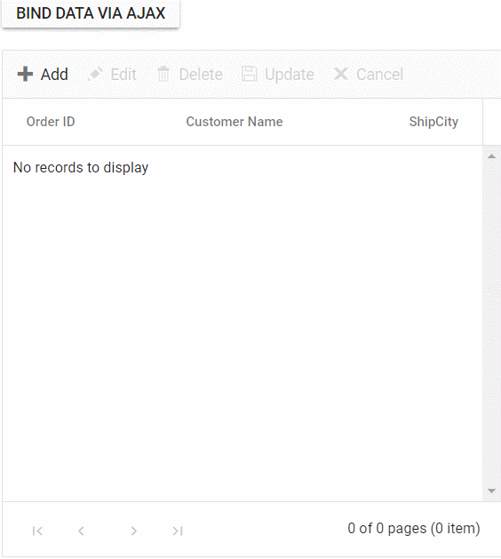

# Local Data Binding in Angular Data Grid

The [Data Grid](https://www.syncfusion.com/angular-components/angular-data-grid) provides a straightforward way to bind local data, such as arrays or JSON objects, to the grid component. This feature allows data to be displayed and manipulated within the grid without the need for external server calls, making it particularly useful for scenarios involving static or locally stored data.

Assign an array of JavaScript objects to the [dataSource](https://ej2.syncfusion.com/angular/documentation/api/grid/index-default#datasource) property.

The following example demonstrates the local data binding feature in the Data Grid component:



 






    


## Binding data from Excel file

The Data Grid supports importing data from Excel files for display and manipulation within the grid. This enables transferring Excel data into a web-based environment. Use the [Uploader](https://ej2.syncfusion.com/angular/documentation/uploader/getting-started) component's [change](https://ej2.syncfusion.com/angular/documentation/api/uploader#change) event to handle the import.

Install the `XLSX` library using the following command:

```bash
npm install xlsx
```

To import Excel data into the grid, follow these steps:

1. Import the Excel file using the `Uploader` component.
2. Parse the Excel file data using `XLSX` library.
3. Bind the resulting JSON to the grid.

The following example demonstrates Excel data import into the grid utilizing the `Uploader` component's `change` event with the `XLSX` library:



 
 





  


## CRUD operations using Fetch requests

The Data Grid provides a seamless way to bind data from external sources using Fetch requests, facilitating CRUD (Create, Read, Update, Delete) operations with data retrieved from a server. This feature is particularly valuable for sending data to a server for database updates and for asynchronously retrieving data without refreshing the entire web page.

To achieve data binding and perform CRUD actions using Fetch requests in the grid, follow these steps:

**Step 1:** Include the Data Grid in the HTML with necessary configurations:

```html
<button ejs-button (click)="click()">Bind data via Fetch</button>
<div style="padding: 20px 17px 0 0">
    <ejs-grid #grid [dataSource]='data' [editSettings]='editSettings' [toolbar]='toolbar' allowPaging="true" height="320" (actionBegin)="actionBegin($event)" (actionComplete)="actionComplete($event)">
        <e-columns>
            <e-column field='OrderID' headerText='Order ID' isPrimaryKey=true width='150'></e-column>
            <e-column field='CustomerID' headerText='Customer Name' width='150'></e-column>
            <e-column field='ShipCity' headerText='Ship City' width='150' textAlign='Right'></e-column>
        </e-columns>
    </ejs-grid>
</div>
```

**Step 2:** To bind data from an external Fetch request, utilize the [dataSource](https://ej2.syncfusion.com/angular/documentation/api/grid/index-default#datasource) property of the grid. Fetch data from the server and provide it to the `dataSource` property using the fetch API:

```ts
click() {
    fetch("https://localhost:****/Home/Getdata", {
        method: 'POST',
        headers: {
            'Content-Type': 'application/json'
        }
    }) //Use remote server host number instead ****
    .then(response => response.json())
    .then(data => {
        this.grid.dataSource = data;
    })
    .catch(error => {
        console.error('Error fetching data:', error);
    });
}
```

On the server side, the **GetData** method within the HomeController contains the grid's data source. When the button is clicked, a Fetch request retrieves data from the server and binds it to the Data Grid component.

```cs
public class HomeController : Controller
{        
    public ActionResult Getdata()
    {
        IEnumerable DataSource = OrdersDetails.GetAllRecords();
        return Json(DataSource);
    } 

    // Create model class to define properties
    public class OrdersDetails
    {
        public OrdersDetails()
        {
        }

        public OrdersDetails(int OrderID, string CustomerId, int EmployeeId, double Freight, bool Verified, DateTime OrderDate, string ShipCity, string ShipName, string ShipCountry, DateTime ShippedDate, string ShipAddress)
        {
            this.OrderID = OrderID;
            this.CustomerID = CustomerId;
            this.EmployeeID = EmployeeId;
            this.Freight = Freight;
            this.ShipCity = ShipCity;
            this.Verified = Verified;
            this.OrderDate = OrderDate;
            this.ShipName = ShipName;
            this.ShipCountry = ShipCountry;
            this.ShippedDate = ShippedDate;
            this.ShipAddress = ShipAddress;
        }

        // Render data in this method
        public static List<OrdersDetails> GetAllRecords()
        {
            List<OrdersDetails> order = new List<OrdersDetails>();
            int code = 10000;
            for (int i = 1; i < 10; i++)
            {
                order.Add(new OrdersDetails(code + 1, "ALFKI", i + 0, 2.3 * i, false, new DateTime(1991, 05, 15), "Berlin", "Simons bistro", "Denmark", new DateTime(1996, 7, 16), "Kirchgasse 6"));
                order.Add(new OrdersDetails(code + 2, "ANATR", i + 2, 3.3 * i, true, new DateTime(1990, 04, 04), "Madrid", "Queen Cozinha", "Brazil", new DateTime(1996, 9, 11), "Avda. Azteca 123"));
                order.Add(new OrdersDetails(code + 3, "ANTON", i + 1, 4.3 * i, true, new DateTime(1957, 11, 30), "Cholchester", "Frankenversand", "Germany", new DateTime(1996, 10, 7), "Carrera 52 con Ave. Bolívar #65-98 Llano Largo"));
                order.Add(new OrdersDetails(code + 4, "BLONP", i + 3, 5.3 * i, false, new DateTime(1930, 10, 22), "Marseille", "Ernst Handel", "Austria", new DateTime(1996, 12, 30), "Magazinweg 7"));
                order.Add(new OrdersDetails(code + 5, "BOLID", i + 4, 6.3 * i, true, new DateTime(1953, 02, 18), "Tsawassen", "Hanari Carnes", "Switzerland", new DateTime(1997, 12, 3), "1029 - 12th Ave. S."));
                code += 5;
            }
            return order;
        }

        public int? OrderID { get; set; }
        public string CustomerID { get; set; }
        public int? EmployeeID { get; set; }
        public double? Freight { get; set; }
        public string ShipCity { get; set; }
        public bool Verified { get; set; }
        public DateTime OrderDate { get; set; }
        public string ShipName { get; set; }
        public string ShipCountry { get; set; }
        public DateTime ShippedDate { get; set; }
        public string ShipAddress { get; set; }
    }    
}
```

**Step 3:** To perform CRUD actions, leverage the [actionBegin](https://ej2.syncfusion.com/angular/documentation/api/grid/index-default#actionbegin) event. The default CRUD operations can be canceled by utilizing the `cancel` argument provided by this event. This allows dynamic invocation of server-side methods using Fetch, along with the relevant data received from the `actionBegin` event, to update server data accordingly.

A. To add a new record using Fetch requests, follow these steps:

```ts
public flag = false;

actionBegin(e: EditEventArgs) {
    // Initially this.flag needs to be false to enter this condition
    if (!this.flag) {
        // Add operations
        if (e.requestType == 'save' && ((e as any).action == 'add')) {
            var editedData = (e as any).data;
            // Cancel default edit operation
            e.cancel = true;
            // Send updated data to server using fetch call
            fetch('https://localhost:****/Home/Insert', {
                method: 'POST',
                headers: {
                    'Content-Type': 'application/json'
                },
                body: JSON.stringify({ value: editedData })
            }) //Use remote server host number instead ****
            .then(response => response.json())
            .then(data => {
                // this.flag is enabled to skip this execution when grid ends add/edit
                this.flag = true;
                // The added/edited data will be saved in the Grid
                this.grid.endEdit();
            })
            .catch(error => {
                // Add/edit failed
                // The this.flag is disabled if operation fails so it can enter the condition on next execution
                this.flag = false;
                console.error('Add operation failed:', error);
            });
        }
    }
}
```

```cs
// Insert record
public ActionResult Insert(OrdersDetails value)
{
    OrdersDetails.GetAllRecords().Insert(0, value);
    return Json(value);
}
```

B. To edit and save a record using a Fetch request, follow these steps:

```ts
public flag = false;

actionBegin(e: EditEventArgs) {
    // Initially this.flag needs to be false to enter this condition
    if (!this.flag) {
        if (e.requestType == 'save' && ((e as any).action == "edit")) {
            var editedData = (e as any).data;
            // Cancel default edit operation
            e.cancel = true;
            // Send updated data to server using fetch call
            fetch('https://localhost:****/Home/Update', {
                method: 'POST',
                headers: {
                    'Content-Type': 'application/json'
                },
                body: JSON.stringify({ value: editedData })
            }) //Use remote server host number instead ****
            .then(response => response.json())
            .then(data => {
                // this.flag is enabled to skip this execution when grid ends add/edit
                this.flag = true;
                // The added/edited data will be saved in the Grid
                this.grid.endEdit();
            })
            .catch(error => {
                // Add/edit failed
                // The this.flag is disabled if operation fails so it can enter the condition on next execution
                this.flag = false;
                console.error('Update operation failed:', error);
            });
        }        
    }
}
```

```cs
// Update record
public ActionResult Update(OrdersDetails value)
{
    var ord = value;
    OrdersDetails val = OrdersDetails.GetAllRecords().Where(or => or.OrderID == ord.OrderID).FirstOrDefault();
    val.OrderID = ord.OrderID;
    val.EmployeeID = ord.EmployeeID;
    val.CustomerID = ord.CustomerID;
    return Json(value);
}
```

C. To delete a record using a Fetch request, follow these steps:

```ts
public flag = false;

actionBegin(e: EditEventArgs) {
    // Initially this.flag needs to be false to enter this condition
    if (!this.flag) {
        if (e.requestType == 'delete') {
            var editedData = (e as any).data;
            // Cancel default delete operation
            e.cancel = true;
            // Send deleted data to server using fetch call
            fetch('https://localhost:****/Home/Delete', {
                method: 'POST',
                headers: {
                    'Content-Type': 'application/json'
                },
                body: JSON.stringify({ key: editedData[0][this.grid.getPrimaryKeyFieldNames()[0]] })
            }) //Use remote server host number instead ****
            .then(response => response.json())
            .then(data => {
                // this.flag is enabled to skip this execution when grid deletes record
                this.flag = true;
                // The deleted data will be removed in the Data Grid
                this.grid.deleteRecord();
            })
            .catch(error => {
                // Delete failed
                // The this.flag is disabled if operation fails so it can enter the condition on next execution
                this.flag = false;
                console.error('Delete operation failed:', error);
            });
        }
    }
}
```

```cs
// Delete record
public ActionResult Delete(int key)
{
    OrdersDetails.GetAllRecords().Remove(OrdersDetails.GetAllRecords().Where(or => or.OrderID == key).FirstOrDefault());
    var data = OrdersDetails.GetAllRecords();
    return Json(data);
}
```

**Step 4:** In the Fetch success event, the grid's [endEdit](https://ej2.syncfusion.com/angular/documentation/api/grid/index-default#endedit) and [deleteRecord](https://ej2.syncfusion.com/angular/documentation/api/grid/index-default#deleterecord) methods can be utilized to handle the addition, editing, and deletion of corresponding data in the grid. However, invoking these methods triggers the `actionBegin` event once again to save the changes in the grid. To prevent this behavior and maintain control over the execution flow, a flag variable can be employed and managed within the `actionComplete` and Fetch failure events. The following code snippet demonstrates this approach:

```ts
actionComplete(e: EditEventArgs) {
    if (e.requestType === 'save' || e.requestType === 'delete') {
        // The this.flag is disabled after operation is successfully performed so it can enter the condition on next execution
        this.flag = false;
    }
}
```

The following screenshot demonstrates data loading when the button is clicked and the performance of CRUD operations:


### Display loading indicator with local data

The Data Grid allows displaying a loading indicator while loading local data. This is useful when data loading from a local source is delayed and a visual indication is required to show that data is being fetched.

To display the loading indicator when using local data, invoke the [showSpinner](https://ej2.syncfusion.com/angular/documentation/api/grid/index-default#showspinner) method. This method controls the visibility of the loading indicator.

The following example demonstrates displaying the loading indicator in the grid using the [load](https://ej2.syncfusion.com/angular/documentation/api/grid/index-default#load) and [created](https://ej2.syncfusion.com/angular/documentation/api/grid/index-default#created) events:

```typescript
import { Component, OnInit, ViewChild } from '@angular/core';
import { GridComponent } from '@syncfusion/ej2-angular-grids';
import { data } from './datasource';

@Component({
  selector: 'app-root',
  template: `
    <ejs-grid #Grid (load)='load()' (created)='created()' >
        <e-columns>
            <e-column field='OrderID' headerText='Order ID' textAlign='Right' width=120></e-column>
            <e-column field='CustomerID' headerText='Customer ID' textAlign='Right' width=120></e-column>
            <e-column field='Quantity' headerText='Quantity' textAlign='Right' width=120></e-column>
            <e-column field='CustomerAddress' headerText='Ship Address' textAlign='Right' width=120></e-column>
        </e-columns>
    </ejs-grid>`
})
export class AppComponent implements OnInit {
 
  @ViewChild('Grid') public grid?: GridComponent;
  public isDataLoading = true;
  
  load() {
    if (this.isDataLoading) { 
      (this.grid as GridComponent).showSpinner();
    }
  }

  created(){
    this.isDataLoading = true;
    (this.grid as GridComponent).dataSource = data as Object[];
  }
}
```

## CRUD Operations using AJAX requests

The Data Grid provides a seamless way to bind data from external sources using AJAX requests, facilitating CRUD (Create, Read, Update, Delete) operations with data retrieved from a server. This feature is particularly valuable for sending data to a server for database updates and asynchronously retrieving data without refreshing the entire web page.

To achieve data binding and perform CRUD actions using Ajax requests in the Data Grid, follow these steps:

**Step 1:** Include the Data Grid in the HTML with necessary configurations:

```html
<button ejs-button (click)="click()">Bind data via AJAX</button>
<div style="padding: 20px 17px 0 0">
    <ejs-grid #grid [dataSource]='data' allowFiltering="true" [editSettings]='editSettings' [toolbar]='toolbar' allowPaging="true" height="320" (actionBegin)="actionBegin($event)" (actionComplete)="actionComplete($event)">
        <e-columns>
            <e-column field='OrderID' headerText='Order ID' isPrimaryKey=true width='150'></e-column>
            <e-column field='CustomerID' headerText='Customer Name' width='150'></e-column>
            <e-column field='ShipCity' headerText='Ship City' width='150' textAlign='Right'></e-column>
        </e-columns>
    </ejs-grid>
</div>
```

**Step 2:** To bind data from an external AJAX request, utilize the [dataSource](https://ej2.syncfusion.com/angular/documentation/api/grid#datasource) property of the grid. Fetch data from the server and provide it to the `dataSource` property using the `onSuccess` event of the AJAX request:

```ts
import { Ajax } from '@syncfusion/ej2-base';

click() {
    const ajax = new Ajax("https://localhost:****/Home/Getdata", 'POST'); //Use remote server host number instead ****
    ajax.send();
    ajax.onSuccess = (data: string) => {
        this.grid.dataSource = JSON.parse(data);
    };
}  
```

On the server side, the "GetData" method within the HomeController contains the grid's data source. When the button is clicked, an AJAX request retrieves data from the server and binds it to the Data Grid component.

```cs
public class HomeController : Controller
{        
    public ActionResult Getdata()
    {
        var DataSource = OrdersDetails.GetAllRecords();
        return Json(DataSource);
    } 

    // Create model class to define properties
    public class OrdersDetails
    {
        public OrdersDetails()
        {
        }

        public OrdersDetails(int OrderID, string CustomerId, int EmployeeId, double Freight, bool Verified, DateTime OrderDate, string ShipCity, string ShipName, string ShipCountry, DateTime ShippedDate, string ShipAddress)
        {
            this.OrderID = OrderID;
            this.CustomerID = CustomerId;
            this.EmployeeID = EmployeeId;
            this.Freight = Freight;
            this.ShipCity = ShipCity;
            this.Verified = Verified;
            this.OrderDate = OrderDate;
            this.ShipName = ShipName;
            this.ShipCountry = ShipCountry;
            this.ShippedDate = ShippedDate;
            this.ShipAddress = ShipAddress;
        }

        // Render data in this method
        public static List<OrdersDetails> GetAllRecords()
        {
            List<OrdersDetails> order = new List<OrdersDetails>();
            int code = 10000;
            for (int i = 1; i < 10; i++)
            {
                order.Add(new OrdersDetails(code + 1, "ALFKI", i + 0, 2.3 * i, false, new DateTime(1991, 05, 15), "Berlin", "Simons bistro", "Denmark", new DateTime(1996, 7, 16), "Kirchgasse 6"));
                order.Add(new OrdersDetails(code + 2, "ANATR", i + 2, 3.3 * i, true, new DateTime(1990, 04, 04), "Madrid", "Queen Cozinha", "Brazil", new DateTime(1996, 9, 11), "Avda. Azteca 123"));
                order.Add(new OrdersDetails(code + 3, "ANTON", i + 1, 4.3 * i, true, new DateTime(1957, 11, 30), "Cholchester", "Frankenversand", "Germany", new DateTime(1996, 10, 7), "Carrera 52 con Ave. Bolívar #65-98 Llano Largo"));
                order.Add(new OrdersDetails(code + 4, "BLONP", i + 3, 5.3 * i, false, new DateTime(1930, 10, 22), "Marseille", "Ernst Handel", "Austria", new DateTime(1996, 12, 30), "Magazinweg 7"));
                order.Add(new OrdersDetails(code + 5, "BOLID", i + 4, 6.3 * i, true, new DateTime(1953, 02, 18), "Tsawassen", "Hanari Carnes", "Switzerland", new DateTime(1997, 12, 3), "1029 - 12th Ave. S."));
                code += 5;
            }
            return order;
        }

        public int? OrderID { get; set; }
        public string CustomerID { get; set; }
        public int? EmployeeID { get; set; }
        public double? Freight { get; set; }
        public string ShipCity { get; set; }
        public bool Verified { get; set; }
        public DateTime OrderDate { get; set; }
        public string ShipName { get; set; }
        public string ShipCountry { get; set; }
        public DateTime ShippedDate { get; set; }
        public string ShipAddress { get; set; }
    }    
}
```

**Step 3:** To perform CRUD actions, leverage the [actionBegin](https://ej2.syncfusion.com/angular/documentation/api/grid/index-default#actionbegin) event. The default CRUD operations can be canceled by utilizing the `cancel` argument provided by this event. This allows dynamic invocation of server-side methods using AJAX, along with the relevant data received from the `actionBegin` event, to update server data accordingly.

A. To add a new record using AJAX requests, follow these steps:

```typescript
import { Ajax } from '@syncfusion/ej2-base';

public flag = false;

actionBegin(e: EditEventArgs) {
    // Initially this.flag needs to be false to enter this condition
    if (!this.flag) {
        // Add operations
        if (e.requestType == 'save' && ((e as any).action == 'add')) {
            var editedData = (e as any).data;
            // Cancel default edit operation
            e.cancel = true;
            // Send updated data to server using AJAX call
            var ajax = new Ajax({
                url: 'https://localhost:****/Home/Insert',
                type: 'POST',
                contentType: 'application/json; charset=utf-8',
                data: JSON.stringify({ value: editedData });
            });  //Use remote server host number instead ****
            ajax.onSuccess = () => {
                // this.flag is enabled to skip this execution when grid ends add/edit
                this.flag = true;
                // The added/edited data will be saved in the Data Grid
                this.grid.endEdit();
            }
            ajax.onFailure = () => {
                // Add/edit failed
                // The this.flag is disabled if operation fails so it can enter the condition on next execution
                this.flag = false;
            }
            ajax.send();
        }
    }
}
```

```cs
// Insert record
public ActionResult Insert([FromBody] CRUDModel<OrdersDetails> value)
{
    OrdersDetails.GetAllRecords().Insert(0, value.value);
    return Json(value.value);
}
```

B. To edit and save a record using an AJAX request, follow these steps:

```typescript
public flag = false;

actionBegin(e: EditEventArgs) {
    // Initially this.flag needs to be false to enter this condition
    if (!this.flag) {
        if (e.requestType == 'save' && ((e as any).action == "edit")) {
            var editedData = (e as any).data;
            // Cancel default edit operation
            e.cancel = true;
            // Send updated data to server using AJAX call
            var ajax = new Ajax({
                url: 'https://localhost:****/Home/Update',
                type: 'POST',
                contentType: 'application/json; charset=utf-8',
                data: JSON.stringify({ value: editedData })
            }); //Use remote server host number instead ****
            ajax.onSuccess = () => {
                // this.flag is enabled to skip this execution when grid ends add/edit
                this.flag = true;
                // The added/edited data will be saved in the Data Grid
                this.grid.endEdit();
            }
            ajax.onFailure = () => {
                // Add/edit failed
                // The this.flag is disabled if operation fails so it can enter the condition on next execution
                this.flag = false;
            }
            ajax.send();
        }
    }
}
```

```cs
// Update record
public ActionResult Update([FromBody] CRUDModel<OrdersDetails> value)
{
    var ord = value.value;
    OrdersDetails val = OrdersDetails.GetAllRecords().Where(or => or.OrderID == ord.OrderID).FirstOrDefault();
    val.OrderID = ord.OrderID;
    val.EmployeeID = ord.EmployeeID;
    val.CustomerID = ord.CustomerID;
    val.Freight = ord.Freight;
    val.OrderDate = ord.OrderDate;
    val.ShipCity = ord.ShipCity;
    val.ShipCountry = ord.ShipCountry;
    return Json(value.value);
}
```

C. To delete a record using an AJAX request, follow these steps:

```typescript
public flag = false;

actionBegin(e: EditEventArgs) {
    // Initially this.flag needs to be false to enter this condition
    if (!this.flag) {
        if (e.requestType == 'delete') {
            var editedData = (e as any).data;
            // Cancel default delete operation
            e.cancel = true;
            // Send deleted data to server using AJAX call
            var ajax = new Ajax({
                url: 'https://localhost:****/Home/Delete',
                type: 'POST',
                contentType: 'application/json; charset=utf-8',
                data: JSON.stringify({ key: editedData[0][this.grid.getPrimaryKeyFieldNames()[0]] })
            }) //Use remote server host number instead ****
            ajax.onSuccess = () => {
                // this.flag is enabled to skip this execution when grid deletes record
                this.flag = true;
                // The deleted data will be removed in the Data Grid
                this.grid.deleteRecord();
            }
            ajax.onFailure = () => {
                // Delete failed
                // The this.flag is disabled if operation fails so it can enter the condition on next execution
                this.flag = false;
            }
            ajax.send();
        }
    }
}
```

```cs
// Delete record
public ActionResult Delete(int key)
{
    OrdersDetails.GetAllRecords().Remove(OrdersDetails.GetAllRecords().Where(or => or.OrderID == key).FirstOrDefault());
    var data = OrdersDetails.GetAllRecords();
    return Json(data);
}
```

**Step 4:** In the AJAX success event, the grid's [endEdit](https://ej2.syncfusion.com/angular/documentation/api/grid/index-default#endedit) and [deleteRecord](https://ej2.syncfusion.com/angular/documentation/api/grid/index-default#deleterecord) methods can be utilized to handle the addition, editing, and deletion of corresponding data in the grid. However, invoking these methods triggers the `actionBegin` event once again to save the changes in the grid. To prevent this behavior and maintain control over the execution flow, a flag variable can be employed and managed within the `actionComplete` and AJAX failure events. The following code snippet demonstrates this approach:

```typescript
actionComplete(e: EditEventArgs) {
    if (e.requestType === 'save' || e.requestType === 'delete') {
        // The this.flag is disabled after operation is successfully performed so it can enter the condition on next execution
        this.flag = false;
    }
}
```

The following screenshot demonstrates data loading when the button is clicked and CRUD operations performance:



### Display loading indicator using AJAX

The Data Grid allows displaying a loading indicator while loading data using AJAX. This feature is useful when there is a delay in loading data from a data source, and a visual indication is required to show that the data is being fetched. This is particularly beneficial when working with large datasets or under conditions of slower internet connections.

Invoke the [showSpinner](https://ej2.syncfusion.com/angular/documentation/api/grid/index-default#showspinner) method to display the loading indicator. This method controls the spinner visibility.

The following example demonstrates displaying the loading indicator in the Data Grid using the [load](https://ej2.syncfusion.com/angular/documentation/api/grid/index-default#load) and [created](https://ej2.syncfusion.com/angular/documentation/api/grid/index-default#created) events:

```typescript
import { Component, OnInit, ViewChild } from '@angular/core';
import { GridComponent } from '@syncfusion/ej2-angular-grids';
import { Ajax } from '@syncfusion/ej2-base';

@Component({
    selector: 'app-root',
    template: `
    <ejs-grid #Grid allowPaging="true" [pageSettings]="pageSettings" (created)='created()' (load)='load()'>
    <e-columns>
        <e-column field='OrderID' headerText='Order ID' textAlign='Right' width=120></e-column>
        <e-column field='CustomerID' headerText='Customer ID' textAlign='Right' width=120></e-column>
        <e-column field='EmployeeID' headerText='Employee ID' textAlign='Right' width=120></e-column>
        <e-column field='ShipCountry' headerText='Ship Country' textAlign='Right' width=120></e-column>
    </e-columns>
    </ejs-grid>`
})
export class AppComponent implements OnInit {
    public data?: object[];
    public isDataLoading = true;
    public pageSettings?: object = { pageSize: 5, pageCount: 3 }
    @ViewChild('Grid') public grid?: GridComponent;
    
    ngOnInit(): void {
    }
    
    load() {
        if (this.isDataLoading) {
            (this.grid as GridComponent).showSpinner();
            this.isDataLoading = false;
        }
    }
    
    created() {
        this.isDataLoading = true;
        const grid = this.grid;  // Data Grid instance
        const ajax = new Ajax(
                'https://services.syncfusion.com/angular/production/api/orders',
                'GET'
              );
        ajax.send();
        ajax.onSuccess = (data: string) => {
            (grid as GridComponent).dataSource = JSON.parse(data);
        };
    }
}
```

## Managing spinner visibility during data loading

Showing a spinner during data loading in the Data Grid enhances the experience by providing a visual indication of the loading progress. This feature helps to understand that data is being fetched or processed.

To show or hide a spinner during data loading in the grid, use the [showSpinner](https://ej2.syncfusion.com/angular/documentation/api/grid/index-default#showspinner) and [hideSpinner](https://ej2.syncfusion.com/angular/documentation/api/grid/index-default#hidespinner) methods provided by the Data Grid component.

The following example demonstrates showing and hiding the spinner during data loading using external buttons in a grid:



 





    


## Immutable mode

Immutable mode in the Data Grid is designed to optimize re-rendering performance by utilizing the object reference and deep compare concept. This mode ensures that when performing grid actions, only the modified or newly added rows are re-rendered, preventing unnecessary re-rendering of unchanged rows. 

Enable immutable mode by setting [enableImmutableMode](https://ej2.syncfusion.com/angular/documentation/api/grid/index-default#enableimmutablemode) to `true`.

If immutable mode is enabled, when the datasource changes, only newly added rows are regenerated or reused. Consequently, the grid's [queryCellInfo](https://ej2.syncfusion.com/angular/documentation/api/grid/index-default#querycellinfo) and [rowDataBound](https://ej2.syncfusion.com/angular/documentation/api/grid/index-default#rowdatabound) events trigger only for newly generated rows, not for existing rows. 

If immutable mode is not enabled, both newly added rows and existing rows are regenerated or reused when the datasource changes. As a result, the `rowDataBound` and `queryCellInfo` events trigger for both newly added and existing rows. 

> This feature uses the primary key value for data comparison. Therefore, the [isPrimaryKey](https://ej2.syncfusion.com/angular/documentation/api/grid/column#isprimarykey) column must be provided.

The following example demonstrates enabling immutable mode in an Angular component. When add, delete, or update actions are performed, existing rows are not regenerated or reused, ensuring efficient rendering of only the modified or newly added rows:




import { GridModule, PageService } from '@syncfusion/ej2-angular-grids'
import { Component, ViewChild, OnInit } from "@angular/core";
import { GridComponent, RowDataBoundEventArgs, SelectionSettingsModel } from "@syncfusion/ej2-angular-grids";
import { data } from "./datasource";

interface CustomRowDataBoundEventArgs extends RowDataBoundEventArgs {
  column: {
    field: string;
  };
  cell: HTMLElement;
  data: DataType;
}

interface DataType {
  OrderID: number;
  CustomerID: string;
  Freight: number;
  ShipName: string;
  ShipCity: string;
  isNewlyAdded: boolean;
}

@Component({
imports: [GridModule],
providers: [PageService],
standalone: true,
  selector: 'app-root',
  template: `
      <button  #addtop ejs-button class="e-control e-btn e-lib e-info" (click)="addTopEvent()">Add rows Data</button>
      <button style="margin-left: 20px" #delete ejs-button class="e-control e-btn e-lib e-info" (click)="deleteEvent()">Delete rows</button>
      <button style="margin-left: 20px" #addbottom ejs-button class="e-control e-btn e-lib e-info" (click)="updateEvent()">Update Freight Data</button>
      <div id="message"> {{ message }}</div>
      <div  style="padding-top: 20px">
        <ejs-grid #immutable [dataSource]='rowData' [enableHover]="false" height='350' [enableImmutableMode]="true" allowPaging="true" [selectionSettings]="selectionOptions"
          [pageSettings]="pageSettings"  (rowDataBound)="rowDataBound($event)" (queryCellInfo)="queryCellInfo($event)">
          <e-columns>
            <e-column field='OrderID' headerText='Order ID' isPrimaryKey="true" width='120'
            textAlign='Right'></e-column>
            <e-column field='CustomerID' headerText='Customer ID' width='120'></e-column>
            <e-column field='Freight' headerText='Freight' width='120'></e-column>
            <e-column field='ShipName' headerText='Ship Name' width='120'></e-column>
          </e-columns>
        </ejs-grid>
      </div>`
})
export class AppComponent implements OnInit {

  public pageSettings?: Object = { pageSize: 50 };
  public rowData?: DataType[];
  @ViewChild("immutable")
  public immutablegrid?: GridComponent;
  public intervalId: NodeJS.Timeout;
  public selectionOptions?: SelectionSettingsModel;
  public message: string = '';

  ngOnInit(): void {
    this.rowData = data as DataType[];
    this.selectionOptions = { type: 'Multiple' };
    this.message = `Initial rows rendered: ${this.rowData.length}`;
  }

  queryCellInfo(args: CustomRowDataBoundEventArgs): void {
    if (args.column.field === 'ShipName' && args.data.ShipName === "Gems Chevalier") {
      (args.cell as HTMLElement).style.backgroundColor = 'rgb(210, 226, 129)';
    }
  }
  
  rowDataBound(args: RowDataBoundEventArgs): void {
    (args.row as HTMLElement).style.backgroundColor = (args.data as DataType).isNewlyAdded ? '' : ' rgb(208, 255, 255)';
  }
  
  addTopEvent(): void {
    // Set the background color of all rows to indicate existing data
    (this.immutablegrid as GridComponent).getAllDataRows().forEach(row => {
      (row as HTMLElement).style.backgroundColor = "rgb(208, 255, 255)";
    });
    let count = 0;
    if (count < 1) {
      let newRowData: object[] = [];
      let addedRecords: object = {
        'OrderID': this.generateOrderId(),
        'CustomerID': this.generateCustomerId(),
        'ShipCity': this.generateShipCity(),
        'Freight': this.generateFreight(),
        'ShipName': this.generateShipName(),
        'isNewlyAdded': true
      };
      newRowData.push(addedRecords);
      this.rowData = ([...newRowData, ...this.rowData as DataType[]] as DataType[]);
      count++;
      this.message = `${count} rows rendered after performing the add action`;
    }
  }
  
  deleteEvent(): void {
    let count = 0;
    if (count < 1 && (this.rowData as DataType[]).length > 0) {
      this.rowData = (this.rowData as DataType[]).slice(1);
      count++;
      this.message = `${count} rows deleted after performing delete action`;
    }
  }
  
  updateEvent(): void {
    let count = 0;
    let newRowData = (this.rowData as any).map((row: any) => {
    if (row.ShipName === 'Hanari Carnes') {
        count++;
        return { ...row, 'ShipName': "Gems Chevalier" };
      } else {
        return row;
      }
    });
    this.rowData = newRowData;
    this.message = ` ${count} rows updated after performing update action`;
  }

  generateOrderId(): number {
    return Math.floor(10000 + Math.random() * 90000);
  }

  generateCustomerId(): string {
    const characters = 'ABCDEFGHIJKLMNOPQRSTUVWXYZ';
    let result = '';
    for (let i = 0; i < 5; i++) {
      result += characters.charAt(Math.floor(Math.random() * characters.length));
    }
    return result;
  }

  generateShipCity(): string {
    const cities = ['London', 'Paris', 'New York', 'Tokyo', 'Berlin'];
    return cities[Math.floor(Math.random() * cities.length)];
  }

  generateFreight(): number {
    const randomValue = Math.random() * 100;
    return parseFloat(randomValue.toFixed(2));
  }

  generateShipName(): string {
    const names = ['Que Delícia', 'Hanari Carnes', 'Island Trading', 'Laughing Bacchus Winecellars'];
    return names[Math.floor(Math.random() * names.length)];
  }
}







  


### Immutable mode constraints

Immutable mode updates only the rows whose data has changed to improve rendering performance. As a result, features that rely on complex layouts, advanced rendering scenarios, data processing operations, or interactive grid behaviors may not function as expected.