# Remote Data in Angular Grid Component

In Angular Grid component, binding remote data is a fundamental aspect that enhances the efficiency of data interaction. This process involves assigning the service data, represented as an instance of `DataManager`, to the `dataSource` property of the Angular Grid component. By doing so, seamless interaction with a remote data source is enabled, achieved by specifying the endpoint URL where the data is hosted.

Additionally, leverage the power for data retrieval and operations, enhancing event handling, asynchronous programming, and concurrent value management in Angular applications.

## Binding observable data using async pipe

Observables represent a fundamental reactive programming concept widely adopted throughout the Angular framework. An Observable creates a stream of data or events that can be observed over time, providing an elegant solution for handling asynchronous operations including input event processing, HTTP requests, and event management.

The Syncfusion Angular Grid seamlessly integrates with Observables through the async pipe, enabling effortless binding of grid data. The [AsyncPipe](https://angular.dev/api/common/AsyncPipe) automatically subscribes to observables, extracting the latest emitted value with the required `result` and `count` properties structure that aligns perfectly with the grid's data expectations.

The Syncfusion Grid component delivers comprehensive functionality for handling grid actions including **searching**, **filtering**, **sorting**, **grouping**, and **paging**. These interactions trigger the [dataStateChange](https://ej2.syncfusion.com/angular/documentation/api/grid#datastatechange) event, providing opportunities to manage and manipulate data according to user interactions.

**Using the `dataStateChange` event**

The `dataStateChange` event triggers whenever actions modify the grid's data state, such as changing pages, applying sorting, or grouping. This event provides detailed information about the performed action and current grid state, including parameters like page number, sorting details, and filtering criteria.

To implement the `dataStateChange` event effectively:

1. **Subscribe to the event:** In the component code, subscribe to the `dataStateChange` event using the appropriate event handler function. This function is executed whenever the grid is interacted with.

2. **Handle data state:** Inside the event handler function, the event arguments can be accessed to determine the specific actions and intentions. The action property of the event arguments indicates the type of action performed (e.g., paging, sorting, grouping).

> The `dataStateChange` event will not be triggered during the initial rendering. To display records on grid initialization, perform the operation in the `ngOnInit` life cycle hook.

### Handling searching operation

When performing a search operation in the grid, the `dataStateChange` event is triggered, allowing access to the following referenced arguments within the event.

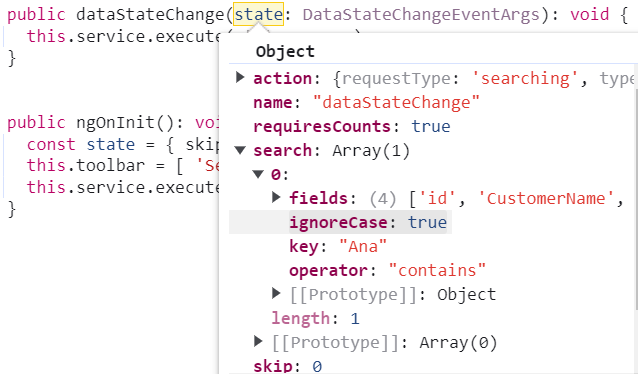

The grid's data state during a search action can be updated using the following approach:

```typescript
private applySearching(query: Query, search: Array<any>): void {
  // Check if a search operation is requested
  if (search && search.length > 0) {
    // Extract the search key and fields from the search array
    const { fields, key } = search[0];
    // perform search operation using the field and key on the query
    query.search(key, fields);
  }
}

/** GET all data from the server */
getAllData(state: any, action: any): Observable<any> {
  const query = new Query();
  // search
  if (state.search) {
    this.applySearching(query, state.search);
  }
  // To get the count of the data
  query.isCountRequired = true;

  return this.http.get<Customer[]>(this.customersUrl).pipe(
    map((response: any[]) => {
      // Execute local data operations using the provided query
      const currentResult: any = new DataManager(response).executeLocal(query);
      // Return the result along with the count of total records
      return {
        result: currentResult.result, // Result of the data
        count: currentResult.count // Total record count
      };
    })
  );
}
```

### Handling filtering operation

When filtering operation is performed in the grid, the `dataStateChange` event is triggered, providing access to the following referenced arguments within the event.

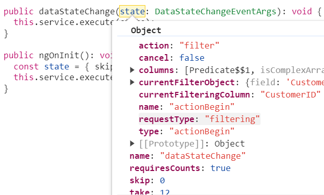

The filter action's updated data state can be applied as shown below:

```typescript
private applyFiltering(query: Query, filter: any): void {
  // Check if filter columns are specified
  if (filter.columns && filter.columns.length) {
    // Apply filtering for each specified column
    for (let i = 0; i < filter.columns.length; i++) {
      const field = filter.columns[i].field;
      const operator = filter.columns[i].operator;
      const value = filter.columns[i].value;
      query.where(field, operator, value);
    }
  } else {
    // Apply filtering based on direct filter conditions
    for (let i = 0; i < filter.length; i++) {
      const { fn, e } = filter[i];
      if (fn === 'onWhere') {
        query.where(e as string);
      }
    }
  }
}

/** GET all data from the server */
getAllData(state: any, action: any): Observable<any> {
  const query = new Query();
  // filtering
  if (state.where) {
    this.applyFiltering(query, action.queries);
  }
  // initial filtering
  if (state.filter && state.filter.columns && state.filter.columns.length) {
    this.applyFiltering(query, state.filter);
  }
  // To get the count of the data
  query.isCountRequired = true;
  
  return this.http.get<Customer[]>(this.customersUrl).pipe(
    map((response: any[]) => {
      // Execute local data operations using the provided query
      const currentResult: any = new DataManager(response).executeLocal(query);
      // Return the result along with the count of total records
      return {
        result: currentResult.result, // Result of the data
        count: currentResult.count // Total record count
      };
    })
  );
}
```

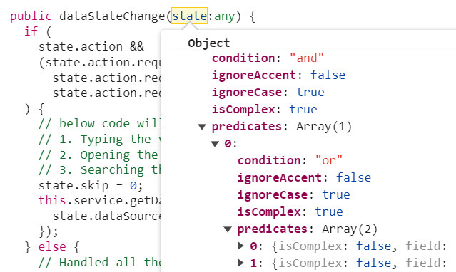

When filtering multiple values, predicates can be retrieved as arguments in the `dataStateChange` event. Create predicate execution based on the predicate values.

### Handling sorting operation

When a sorting operation is performed in the grid, the `dataStateChange` event is triggered. Within this event, the following referenced arguments can be accessed.

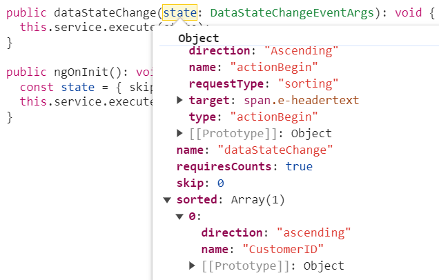

When performing multi‑column sorting, the following referenced arguments are available in the `dataStateChange` event.

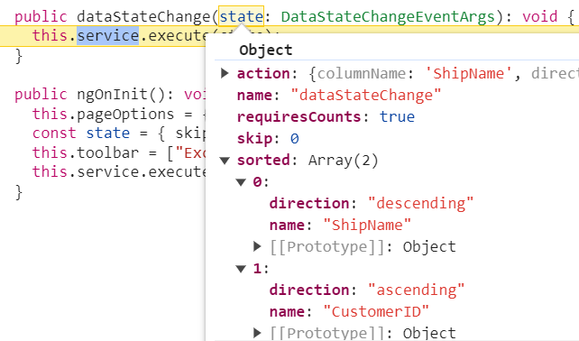

The grid's data state during a sort action can be updated using the following approach:

```typescript
private applySorting(query: Query, sorted: sortInfo[]): void {
  // Check if sorting data is available
  if (sorted && sorted.length > 0) {
    // Iterate through each sorting info
    sorted.forEach(sort => {
      // Get the sort field name either by name or field
      const sortField = sort.name || sort.field;
      // Perform sort operation using the query based on the field name and direction
      query.sortBy(sortField as string, sort.direction);
    });
  }
}

/** GET all data from the server */
getAllData(state: any, action: any): Observable<any> {
  const query = new Query();
  // sorting
  if (state.sorted) {
    state.sorted.length ? this.applySorting(query, state.sorted) :
      // initial sorting
      state.sorted.columns.length ? this.applySorting(query, state.sorted.columns) : null;
  } 
  // To get the count of the data
  query.isCountRequired = true;

  return this.http.get<Customer[]>(this.customersUrl).pipe(
    map((response: any[]) => {
      // Execute local data operations using the provided query
      const currentResult: any = new DataManager(response).executeLocal(query);
      // Return the result along with the count of total records
      return {
        result: currentResult.result, // Result of the data
        count: currentResult.count // Total record count
      };
    })
  ); 
}
```

### Handling paging operation

When a paging operation is performed in the grid, the `dataStateChange` event is triggered, and the following referenced arguments become available within this event.

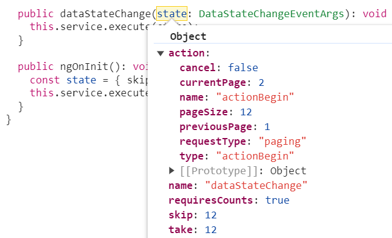

The grid's data state for a paging action can then be updated using the following approach:

```typescript
private applyPaging(query: Query, state: any): void {
  // Check if both 'take' and 'skip' values are available
  if (state.take && state.skip) {
    // Calculate pageSkip and pageTake values to get pageIndex and pageSize
    const pageSkip = state.skip / state.take + 1;
    const pageTake = state.take;
    query.page(pageSkip, pageTake);
  }
  // If only 'take' is available and 'skip' is 0, apply paging for the first page
  else if (state.skip === 0 && state.take) {
    query.page(1, state.take);
  }
}

/** GET all data from the server */
getAllData(state: any, action: any): Observable<any> {
  const query = new Query();
  // paging
  this.applyPaging(query, state);
  // To get the count of the data
  query.isCountRequired = true;

  return this.http.get<Customer[]>(this.customersUrl).pipe(
    map((response: any[]) => {
      // Execute local data operations using the provided query
      const currentResult: any = new DataManager(response).executeLocal(query);
      // Return the result along with the count of total records
      return {
        result: currentResult.result, // Result of the data
        count: currentResult.count // Total record count
      };
    })
  );
}
```

### Handling grouping operation

When grouping operation is performed in the grid, the `dataStateChange` event is triggered, providing access to the following referenced arguments within the event.

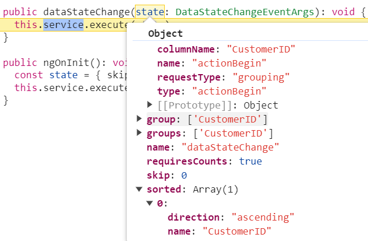

The grid's data state during a group action can be updated using the following approach:

```typescript
private applyGrouping(query: Query, group: any): void {
  // Check if grouping data is available
  if (group.length > 0) {
    // Iterate through each group info
    group.forEach((column: string) => {
      // perform group operation using the column on the query
      query.group(column);
    });
  }
}

/** GET all data from the server */
getAllData(state: any, action: any): Observable<any> {
  const query = new Query();
  // grouping
  if (state.group) {
    state.group.length ? this.applyGrouping(query, state.group) :
      // initial grouping
      state.group.columns.length ? this.applyGrouping(query, state.group.columns) : null;
  }
  // To get the count of the data
  query.isCountRequired = true;
  
  return this.http.get<Customer[]>(this.customersUrl).pipe(
    map((response: any[]) => {
      // Execute local data operations using the provided query
      const currentResult: any = new DataManager(response).executeLocal(query);
      // Return the result along with the count of total records
      return {
        result: currentResult.result, // Result of the data
        count: currentResult.count // Total record count
      };
    })
  );
}
```

> To utilize group actions, it is necessary to manage the sorting query within the service.

**Lazy load grouping**

In Angular, lazy loading refers to the technique of loading data dynamically when they are needed, instead of loading everything upfront. Lazy load grouping enables efficient loading and display of grouped data by fetching only the required data on demand.

To enable this feature, the [groupSettings.enableLazyLoading](https://ej2.syncfusion.com/angular/documentation/api/grid/groupsettings#enableLazyLoading) property must be set to `true`. In addition, the state must be managed based on the initial grid action as follows.

```typescript
public ngOnInit(): void {
  this.groupOptions = { columns: ['ProductName'], enableLazyLoading: true };
  const state = { skip: 0, take: 12, group: this.groupOptions };
  this.crudService.execute(state, query);
}
```

Based on the initial state, access the arguments as shown below:

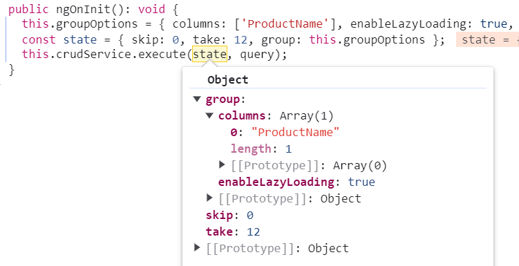

The grid's state can be modified using the following approach:

```typescript
private applyGrouping(query: Query, group: any): void {
  // Check if grouping data is available
  if (group.length > 0) {
    // Iterate through each group info
    group.forEach((column: string) => {
      // perform group operation using the column on the query
      query.group(column);
    });
  }
}

private applyLazyLoad = (query: Query, state: any): void => {
  if (state.isLazyLoad) {
    // Configure lazy loading for the main data
    query.lazyLoad.push({ key: 'isLazyLoad', value: true });
    // If on-demand group loading is enabled, configure lazy loading for grouped data
    if (state.onDemandGroupInfo) {
      query.lazyLoad.push({
        key: 'onDemandGroupInfo',
        value: state.action.lazyLoadQuery,
      });
    }
  }
}

/** GET all data from the server */
getAllData(state: any, action: any): Observable<any> {
  const query = new Query();
  // grouping
  if (state.group) {
    state.group.length ? this.applyGrouping(query, state.group) :
      // initial grouping
      state.group.columns.length ? this.applyGrouping(query, state.group.columns) : null;
  }
  // lazy load grouping
  this.applyLazyLoad(query, state);
  // initial grouping with lazy load
  if (state.group && state.group.enableLazyLoading) {
    query.lazyLoad.push({ key: 'isLazyLoad', value: true });
  }
  // To get the count of the data
  query.isCountRequired = true;

  return this.http.get<Customer[]>(this.customersUrl).pipe(
    map((response: any[]) => {
      // Execute local data operations using the provided query
      const currentResult: any = new DataManager(response).executeLocal(query);
      // Return the result along with the count of total records
      return {
        result: currentResult.result, // Result of the data
        count: currentResult.count // Total record count
      };
    })
  );
}
```

> Further information can be accessed in the respective documentation for [lazy load grouping](https://ej2.syncfusion.com/angular/documentation/grid/grouping/lazy-load-grouping).

The complete example is available in the [handling CRUD operations topic](#handling-crud-operations).

### Handling CRUD operations

The Grid component provides powerful options for dynamically inserting, deleting, and updating records, enabling data to be modified directly within the grid. This feature is useful for performing CRUD (**Create**, **Read**, **Update**, **Delete**) operations seamlessly.

**Integrating CRUD Operations**

To implement CRUD operations using [Angular Data Grid](https://www.syncfusion.com/angular-components/angular-data-grid), follow these steps:

1. **Configure grid settings:** Set up the grid to allow editing, adding, and deleting operations, and specify the `toolbar` options that will provide access to these features.

2. **Handle data state changes:** Utilize the [dataStateChange](https://ej2.syncfusion.com/angular/documentation/api/grid#datastatechange) event to respond to changes in the grid's data state. This event is triggered whenever the grid is interacted with, such as during paging or sorting.

3. **Execute CRUD operations:** Within the event handler for [dataSourceChanged](https://ej2.syncfusion.com/angular/documentation/api/grid#datasourcechanged), implement logic to handle various CRUD actions based on the action or `requestType` property of the event arguments.

4. **Call endEdit method:** After performing CRUD operations (adding, editing, or deleting), call the [endEdit](https://ej2.syncfusion.com/angular/documentation/api/grid#endedit) method to signal operation completion and update the grid accordingly.

**Insert operation**

When an insert operation is performed in the grid, the `dataSourceChanged` event will be triggered, allowing access to the following referenced arguments within the event.

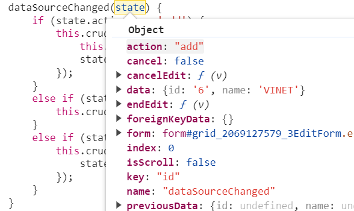

```typescript
/** POST: add a new record to the server */
addRecord(state: DataSourceChangedEventArgs): Observable<Customer> {
  return this.http.post<Customer>(this.customersUrl, state.data, httpOptions);
}
```

**Edit operation**

When an edit operation is performed in the grid, the `dataSourceChanged` event will be triggered, providing access to the following referenced arguments within the event.

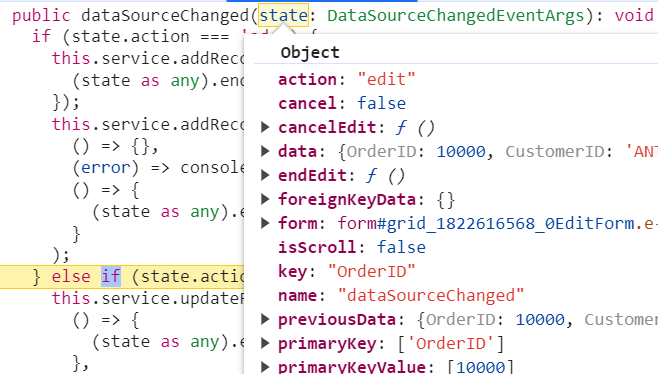

```typescript
/** PUT: update the record on the server */
updateRecord(state: DataSourceChangedEventArgs): Observable<Customer> {
  return this.http.put<Customer>(this.customersUrl, state.data, httpOptions);
}
```

**Delete operation**

When a delete operation is performed in the grid, the `dataSourceChanged` event will be triggered, allowing access to the following referenced arguments within the event.

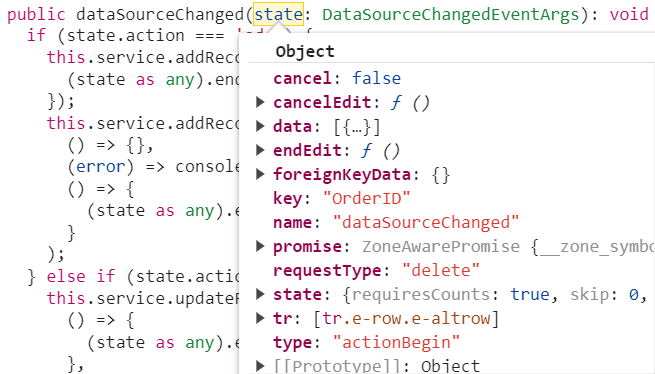

```typescript
/** DELETE: delete the record from the server */
deleteRecord(state: any): Observable<Customer> {
  const id = state.data[0].id;
  const url = `${this.customersUrl}/${id}`;
  return this.http.delete<Customer>(url, httpOptions);
}
```

The following example demonstrates binding observable data using the async pipe to handle grid actions and perform CRUD operations:


















  


> * While working with grid edit operation, defining the `isPrimaryKey` property of column is a mandatory step. In case the primary key column is not defined, the edit or delete action will take place on the first row of the grid.
> * Need to maintain the same instance for all grid actions.
> * Refer to the guidelines for CRUD using observables [here](https://www.youtube.com/watch?v=yGLdi_Es0ac)

### Export all records in client side

Exporting all records with async pipe proves especially beneficial when dealing with large datasets that require export for offline analysis or sharing purposes.

By default, the Syncfusion Angular Grid component exports only the records available on the current page. However, the Grid component allows exporting all records, including those from multiple pages, by configuring the [pdfExportProperties](https://ej2.syncfusion.com/angular/documentation/api/grid/pdfExportProperties) and [excelExportProperties](https://ej2.syncfusion.com/angular/documentation/api/grid/excelExportProperties) in conjunction with the Async Pipe for data binding.

To export all records, including those from multiple pages, configure the [pdfExportProperties.dataSource](https://ej2.syncfusion.com/angular/documentation/api/grid/pdfExportProperties#datasource) for PDF exporting and [excelExportProperties.dataSource](https://ej2.syncfusion.com/angular/documentation/api/grid/excelExportProperties#datasource) for Excel exporting within the [toolbarClick](https://ej2.syncfusion.com/angular/documentation/api/grid#toolbarclick) event handler. Inside this event, set the `dataSource` property of `pdfExportProperties` and `excelExportProperties` for PDF and Excel exporting to include all records.

**Excel Exporting**

To export the complete grid data to Excel, utilize the `excelExportProperties.dataSource` when initiating the Excel export. Use the following code snippet to export all records within the grid:

```typescript
this.service.getData(state).subscribe((e: any) => {
  let excelExportProperties: ExcelExportProperties = {
    dataSource: e.result ? e.result : result
  };
  (this.grid as GridComponent).excelExport(excelExportProperties); // need to call excelExport method of grid when get the entire data
});
```

**PDF Exporting**

To export the complete grid data to PDF document, utilize the `pdfExportProperties.dataSource` when initiating the PDF export. Use the following code snippet to export all records within the grid:

```typescript
this.service.getData(state).subscribe((e: any) => {
  let pdfExportProperties: PdfExportProperties = {
    dataSource: e.result ? e.result : result
  };
  (this.grid as GridComponent).pdfExport(pdfExportProperties); // need to call pdfExport method of grid when get the entire data
});
```

> For further customization on Grid export, refer to the respective documentation for [PDF exporting](https://ej2.syncfusion.com/angular/documentation/grid/pdf-export/pdf-export-options) and [Excel exporting](https://ej2.syncfusion.com/angular/documentation/grid/excel-export/excel-export-options).

The following code example shows the process of exporting all records on the client side for observable using the async pipe:




import { Component, OnInit, ViewChild } from '@angular/core';
import { GridComponent } from '@syncfusion/ej2-angular-grids';
import {DataStateChangeEventArgs, PdfExportProperties, ExcelExportProperties} from '@syncfusion/ej2-angular-grids';
import { ClickEventArgs } from "@syncfusion/ej2-navigations";
import { DataService } from './order.service';
import { Observable } from 'rxjs';

@Component({
  selector: 'app-root',
  template: `<ejs-grid #grid [dataSource]='data | async' (excelExportComplete)="exportComplete()" (pdfExportComplete)="exportComplete()" [allowExcelExport]='true' [allowPdfExport]='true' allowPaging='true' [pageSettings]='pageOptions' [toolbar]="toolbar" (toolbarClick)='toolbarClick($event)' (dataStateChange)= 'dataStateChange($event)'>
                <e-columns>
                  <e-column field='OrderID' headerText='Order ID' width='90' textAlign='Right' isPrimaryKey='true'></e-column>
                  <e-column field="CustomerID" headerText="Customer Name" width="100"></e-column>
                  <e-column field='ShipName' headerText="Ship Name" width=110></e-column>
                  <e-column field='ShipCountry' headerText='Ship Country' width=100></e-column>
                  <e-column field='Freight' headerText='Freight' format='C2' textAlign='Right' width=100></e-column>
                </e-columns>
              </ejs-grid>`,
  providers: [DataService],
})
export class AppComponent implements OnInit {
  public data?: Observable<DataStateChangeEventArgs>;
  public state?: DataStateChangeEventArgs;
  public pageOptions?: object;
  public toolbar?: string[];
  @ViewChild('grid')
  public grid?: GridComponent;

  constructor(public service: DataService) {
    this.data = service;
  }

  public dataStateChange(state: DataStateChangeEventArgs): void {
    this.service.execute(state);
  }

  exportComplete() {
    (this.grid as GridComponent).hideSpinner(); // hide the spinner when export completed
  }

  toolbarClick(args: ClickEventArgs): void {
    let state: any = { action: {}, skip: 0, take: (this.grid as GridComponent).pageSettings.totalRecordsCount };
    let result = {};
    switch (args.item.text) {
      case "PDF Export":
        (this.grid as GridComponent).showSpinner(); // show the spinner when send the post to service
        state.action.isPdfExport = true;
        // fetch the entire data while PDF exporting
        this.service.getData(state).subscribe((e: any) => {
          let pdfExportProperties: PdfExportProperties = {
            dataSource: e.result ? e.result : result
          };
          (this.grid as GridComponent).pdfExport(pdfExportProperties); // need to call pdfExport method of grid when get the entire data
        });
        break;
      case "Excel Export":
        // fetch the entire data while Excel exporting
        (this.grid as GridComponent).showSpinner(); // show the spinner when send the post to service
        state.action.isExcelExport = true;
        this.service.getData(state).subscribe((e: any) => {
          let excelExportProperties: ExcelExportProperties = {
            dataSource: e.result ? e.result : result
          };
          (this.grid as GridComponent).excelExport(excelExportProperties); // need to call excelExport method of grid when get the entire data
        });
        break;
    }
  }
  public ngOnInit(): void {
    this.pageOptions = { pageSize: 10, pageCount: 4 };
    const state = { skip: 0, take: 10 };
    this.toolbar = ["ExcelExport", "PdfExport"];
    this.service.execute(state);
  }
}




import { Injectable } from '@angular/core';
import { HttpClient } from '@angular/common/http';
import {DataStateChangeEventArgs,DataResult} from '@syncfusion/ej2-angular-grids';
import { Observable } from 'rxjs';
import { Subject } from 'rxjs';
import { map } from 'rxjs';

@Injectable()
export class DataService extends Subject<DataStateChangeEventArgs> {

  private BASE_URL = 'https://services.odata.org/V4/Northwind/Northwind.svc/Orders';

  constructor(private http: HttpClient) {
    super();
  }

  public execute(state: any): void {
    this.getData(state).subscribe(x => super.next(x));
  }

  public getData(state: DataStateChangeEventArgs): Observable<DataStateChangeEventArgs> {
    const pageQuery = `$skip=${state.skip}&$top=${state.take}`;
    
    return this.http
      .get(`${this.BASE_URL}?${pageQuery}&$count=true`)
      .pipe(map((response: any) => response))
      .pipe(map((response: any) => (<DataResult>{
        result: response['value'],
        count: parseInt(response['@odata.count'], 10),
      })))
    .pipe((data: any) => data);
  }
}




## Binding observable data without using async pipe

In Angular, Observables data can be bound to UI elements using the [AsyncPipe](https://angular.dev/api/common/AsyncPipe), which simplifies the process of subscribing to observables and managing the subscription life cycle. However, there are scenarios where it is necessary to bind observable data to components without utilizing the async pipe. This approach offers more control over the subscription and data manipulation processes.

To bind observable data without using the async pipe in the grid, follow these steps:

1. Subscribe to the observable data in the component.

2. Manually update the data source of the grid when the observable emits new values.

### Handling searching operation

When performing a search operation in the grid, the `dataStateChange` event is triggered, allowing access to the following referenced arguments within the event.


The grid's data state during a search action can be updated using the following approach:

```typescript
private applySearching(query: Query, search: Array<any>): void {
  // Check if a search operation is requested
  if (search && search.length > 0) {
    // Extract the search key and fields from the search array
    const { fields, key } = search[0];
    // perform search operation using the field and key on the query
    query.search(key, fields);
  }
}

/** GET all data from the server */
getAllData(state: any, action: any): Observable<any> {
  const query = new Query();
  // search
  if (state.search) {
    this.applySearching(query, state.search);
  }
  // To get the count of the data
  query.isCountRequired = true;

  return this.http.get<Customer[]>(this.customersUrl).pipe(
    map((response: any[]) => {
      // Execute local data operations using the provided query
      const currentResult: any = new DataManager(response).executeLocal(query);
      // Return the result along with the count of total records
      return {
        result: currentResult.result, // Result of the data
        count: currentResult.count // Total record count
      };
    })
  );
}
```

### Handling filtering operation

When filtering operation is performed in the grid, the `dataStateChange` event is triggered, providing access to the following referenced arguments within the event.


The filter action's updated data state can be applied as shown below:

```typescript
private applyFiltering(query: Query, filter: any): void {
  // Check if filter columns are specified
  if (filter.columns && filter.columns.length) {
    // Apply filtering for each specified column
    for (let i = 0; i < filter.columns.length; i++) {
      const field = filter.columns[i].field;
      const operator = filter.columns[i].operator;
      const value = filter.columns[i].value;
      query.where(field, operator, value);
    }
  } else {
    // Apply filtering based on direct filter conditions
    for (let i = 0; i < filter.length; i++) {
      const { fn, e } = filter[i];
      if (fn === 'onWhere') {
        query.where(e as string);
      }
    }
  }
}

/** GET all data from the server */
getAllData(state: any, action: any): Observable<any> {
  const query = new Query();
  // filtering
  if (state.where) {
    this.applyFiltering(query, action.queries);
  }
  // initial filtering
  if (state.filter && state.filter.columns && state.filter.columns.length) {
    this.applyFiltering(query, state.filter);
  }
  // To get the count of the data
  query.isCountRequired = true;

  return this.http.get<Customer[]>(this.customersUrl).pipe(
    map((response: any[]) => {
      // Execute local data operations using the provided query
      const currentResult: any = new DataManager(response).executeLocal(query);
      // Return the result along with the count of total records
      return {
        result: currentResult.result, // Result of the data
        count: currentResult.count // Total record count
      };
    })
  );
}
```


When filtering multiple values, predicates can be retrieved as arguments in the `dataStateChange` event. Create predicate execution based on the predicate values.

### Handling sorting operation

When a sorting operation is performed in the grid, the `dataStateChange` event is triggered. Within this event, the following referenced arguments can be accessed.


When performing multi-column sorting, access the following referenced arguments in the `dataStateChange` event:


The grid's data state during a sort action can be updated using the following approach:

```typescript
private applySorting(query: Query, sorted: sortInfo[]): void {
  // Check if sorting data is available
  if (sorted && sorted.length > 0) {
    // Iterate through each sorting info
    sorted.forEach(sort => {
      // Get the sort field name either by name or field
      const sortField = sort.name || sort.field;
      // Perform sort operation using the query based on the field name and direction
      query.sortBy(sortField as string, sort.direction);
    });
  }
}

/** GET all data from the server */
getAllData(state: any, action: any): Observable<any> {
  const query = new Query();
  // sorting
  if (state.sorted) {
    state.sorted.length ? this.applySorting(query, state.sorted) :
      // initial sorting
      state.sorted.columns.length ? this.applySorting(query, state.sorted.columns) : null;
  } 
  // To get the count of the data
  query.isCountRequired = true;

  return this.http.get<Customer[]>(this.customersUrl).pipe(
    map((response: any[]) => {
      // Execute local data operations using the provided query
      const currentResult: any = new DataManager(response).executeLocal(query);
      // Return the result along with the count of total records
      return {
        result: currentResult.result, // Result of the data
        count: currentResult.count // Total record count
      };
    })
  );
}
```

### Handling paging operation

When a paging operation is performed in the grid, the `dataStateChange` event is triggered, and the following referenced arguments become available within this event.


The grid's data state for a paging action can then be updated using the following approach:

```typescript
private applyPaging(query: Query, state: any): void {
  // Check if both 'take' and 'skip' values are available
  if (state.take && state.skip) {
    // Calculate pageSkip and pageTake values to get pageIndex and pageSize
    const pageSkip = state.skip / state.take + 1;
    const pageTake = state.take;
    query.page(pageSkip, pageTake);
  }
  // If only 'take' is available and 'skip' is 0, apply paging for the first page
  else if (state.skip === 0 && state.take) {
    query.page(1, state.take);
  }
}

/** GET all data from the server */
getAllData(state: any, action: any): Observable<any> {
  const query = new Query();
  // paging
  this.applyPaging(query, state);
  // To get the count of the data
  query.isCountRequired = true;

  return this.http.get<Customer[]>(this.customersUrl).pipe(
    map((response: any[]) => {
      // Execute local data operations using the provided query
      const currentResult: any = new DataManager(response).executeLocal(query);
      // Return the result along with the count of total records
      return {
        result: currentResult.result, // Result of the data
        count: currentResult.count // Total record count
      };
    })
  );
}
```

### Handling grouping operation

When grouping operation is performed in the grid, the `dataStateChange` event is triggered, providing access to the following referenced arguments within the event.


The grid's data state during a group action can be updated using the following approach:

```typescript
private applyGrouping(query: Query, group: any): void {
  // Check if grouping data is available
  if (group.length > 0) {
    // Iterate through each group info
    group.forEach((column: string) => {
      // perform group operation using the column on the query
      query.group(column);
    });
  }
}

/** GET all data from the server */
getAllData(state: any, action: any): Observable<any> {
  const query = new Query();
  // grouping
  if (state.group) {
    state.group.length ? this.applyGrouping(query, state.group) :
      // initial grouping
      state.group.columns.length ? this.applyGrouping(query, state.group.columns) : null;
  }
  // To get the count of the data
  query.isCountRequired = true;
  
  return this.http.get<Customer[]>(this.customersUrl).pipe(
    map((response: any[]) => {
      // Execute local data operations using the provided query
      const currentResult: any = new DataManager(response).executeLocal(query);
      // Return the result along with the count of total records
      return {
        result: currentResult.result, // Result of the data
        count: currentResult.count // Total record count
      };
    })
  );
}
```

> To utilize group actions, it is necessary to manage the sorting query within the service.

**Lazy load grouping**

In Angular, lazy loading refers to the technique of loading data dynamically when they are needed, instead of loading everything upfront. Lazy load grouping enables efficient loading and display of grouped data by fetching only the required data on demand.

To enable this feature, the [groupSettings.enableLazyLoading](https://ej2.syncfusion.com/angular/documentation/api/grid/groupsettings#enableLazyLoading) property must be set to `true`. In addition, the state must be managed based on the initial grid action as follows.

```typescript
public ngOnInit(): void {
  this.groupOptions = { columns: ['ProductName'], enableLazyLoading: true };
  const state = { skip: 0, take: 12, group: this.groupOptions };
  this.crudService.execute(state, query);
}
```

Based on the initial state, access the arguments as shown below:


Modify the Observable based on the grid state:

```typescript
private applyGrouping(query: Query, group: any): void {
  // Check if grouping data is available
  if (group.length > 0) {
    // Iterate through each group info
    group.forEach((column: string) => {
      // perform group operation using the column on the query
      query.group(column);
    });
  }
}

private applyLazyLoad = (query: Query, state: any): void => {
  if (state.isLazyLoad) {
    // Configure lazy loading for the main data
    query.lazyLoad.push({ key: 'isLazyLoad', value: true });
    // If on-demand group loading is enabled, configure lazy loading for grouped data
    if (state.onDemandGroupInfo) {
      query.lazyLoad.push({
        key: 'onDemandGroupInfo',
        value: state.action.lazyLoadQuery,
      });
    }
  }
}

/** GET all data from the server */
getAllData(state: any, action: any): Observable<any> {
  const query = new Query();
  // grouping
  if (state.group) {
    state.group.length ? this.applyGrouping(query, state.group) :
      // initial grouping
      state.group.columns.length ? this.applyGrouping(query, state.group.columns) : null;
  }
  // lazy load grouping
  this.applyLazyLoad(query, state);
  // initial grouping with lazy load
  if (state.group && state.group.enableLazyLoading) {
    query.lazyLoad.push({ key: 'isLazyLoad', value: true });
  }
  // To get the count of the data
  query.isCountRequired = true;

  return this.http.get<Customer[]>(this.customersUrl).pipe(
    map((response: any[]) => {
      // Execute local data operations using the provided query
      const currentResult: any = new DataManager(response).executeLocal(query);
      // Return the result along with the count of total records
      return {
        result: currentResult.result, // Result of the data
        count: currentResult.count // Total record count
      };
    })
  );
}
```

> Further information can be accessed in the respective documentation for [lazy load grouping](https://ej2.syncfusion.com/angular/documentation/grid/grouping/lazy-load-grouping).

The complete example is available in the [Handling CRUD operations topic](#handling-crud-operations-1).

### Handling CRUD operations

The Grid component provides powerful options for dynamically inserting, deleting, and updating records, enabling data to be modified directly within the grid. This feature is useful for performing CRUD (**Create**, **Read**, **Update**, **Delete**) operations seamlessly.

**Integrating CRUD Operations**

To implement CRUD operations using Angular Data Grid, follow these steps:

1. **Configure grid settings:** Set up the grid to allow editing, adding, and deleting operations, and specify the `toolbar` options that will provide access to these features.

2. **Handle data state changes:** Utilize the [dataStateChange](https://ej2.syncfusion.com/angular/documentation/api/grid/index-default#datastatechange) event to respond to changes in the grid's data state. This event is triggered whenever the grid is interacted with, such as during paging or sorting.

3. **Execute CRUD operations:** Within the event handler for [dataSourceChanged](https://ej2.syncfusion.com/angular/documentation/api/grid#datasourcechanged), implement logic to handle various CRUD actions based on the action or `requestType` property of the event arguments.

4. **Call endEdit method:** After performing CRUD operations (adding, editing, or deleting), call the [endEdit](https://ej2.syncfusion.com/angular/documentation/api/grid#endedit) method to signal operation completion and update the grid accordingly.

**Insert operation**

When an insert operation is performed in the grid, the `dataSourceChanged` event will be triggered, allowing access to the following referenced arguments within the event.


```typescript
/** POST: add a new record to the server */
addRecord(state: DataSourceChangedEventArgs): Observable<Customer> {
  return this.http.post<Customer>(this.customersUrl, state.data, httpOptions);
}
```

**Edit operation**

When an edit operation is performed in the grid, the `dataSourceChanged` event will be triggered, providing access to the following referenced arguments within the event.


```typescript
/** PUT: update the record on the server */
updateRecord(state: DataSourceChangedEventArgs): Observable<Customer> {
  return this.http.put<Customer>(this.customersUrl, state.data, httpOptions);
}
```

**Delete operation**

When a delete operation is performed in the grid, the `dataSourceChanged` event will be triggered, allowing access to the following referenced arguments within the event.


```typescript
/** DELETE: delete the record from the server */
deleteRecord(state: any): Observable<Customer> {
  const id = state.data[0].id;
  const url = `${this.customersUrl}/${id}`;
  return this.http.delete<Customer>(url, httpOptions);
}
```

The following example demonstrates binding observable data without using the async pipe to handle grid actions and perform CRUD operations:


















  


> Improper handling of observables and subscriptions may lead to memory leaks and unexpected behavior. Ensure proper subscription management, especially when dealing with long-lived observables.

### Export all records in client side

Export all records is especially beneficial when dealing with large datasets that need to be exported for offline analysis or sharing.

By default, the Syncfusion Angular Grid component exports only the records available on the current page. However, the Grid component also supports exporting all records—including those spanning multiple pages—by configuring the [pdfExportProperties](https://ej2.syncfusion.com/angular/documentation/api/grid/pdfExportProperties) and [excelExportProperties](https://ej2.syncfusion.com/angular/documentation/api/grid/excelExportProperties).

To export all records, including those from multiple pages, configure the [pdfExportProperties.dataSource](https://ej2.syncfusion.com/angular/documentation/api/grid/pdfExportProperties#datasource) for PDF exporting and [excelExportProperties.dataSource](https://ej2.syncfusion.com/angular/documentation/api/grid/excelExportProperties#datasource) for Excel exporting within the [toolbarClick](https://ej2.syncfusion.com/angular/documentation/api/grid#toolbarclick) event handler. Inside this event, set the `dataSource` property of `pdfExportProperties` and `excelExportProperties` for PDF and Excel exporting to include all records.

**Excel Exporting**

To export the complete grid data to Excel, utilize the `excelExportProperties.dataSource` when initiating the Excel export. Use the following code snippet to export all records within the grid:

```typescript
this.service.getData(state).subscribe((e: any) => {
  let excelExportProperties: ExcelExportProperties = {
    dataSource: e.result ? e.result : result
  };
  (this.grid as GridComponent).excelExport(excelExportProperties); // need to call excelExport method of grid when get the entire data
});
```

**PDF Exporting**

To export the complete grid data to PDF document, utilize the `pdfExportProperties.dataSource` when initiating the PDF export. Use the following code snippet to export all records within the grid:

```typescript
this.service.getData(state).subscribe((e: any) => {
  let pdfExportProperties: PdfExportProperties = {
    dataSource: e.result ? e.result : result
  };
  (this.grid as GridComponent).pdfExport(pdfExportProperties); // need to call pdfExport method of grid when get the entire data
});
```

> Further customization on grid export can be accessed in the respective documentation for [PDF exporting](https://ej2.syncfusion.com/angular/documentation/grid/pdf-export/pdf-export-options) and [Excel exporting](https://ej2.syncfusion.com/angular/documentation/grid/excel-export/excel-export-options)

The following code example shows the process of exporting all records on client side for observable without using the async pipe:




import { Component, OnInit, ViewChild } from '@angular/core';
import { GridComponent } from '@syncfusion/ej2-angular-grids';
import {DataStateChangeEventArgs, PdfExportProperties, ExcelExportProperties} from '@syncfusion/ej2-angular-grids';
import { ClickEventArgs } from "@syncfusion/ej2-navigations";
import { DataService } from './order.service';
import { Observable } from 'rxjs';

@Component({
  selector: 'app-root',
  template: `<ejs-grid #grid [dataSource]='data' (excelExportComplete)="exportComplete()" (pdfExportComplete)="exportComplete()" [allowExcelExport]='true' [allowPdfExport]='true' allowPaging='true' [pageSettings]='pageOptions' [toolbar]="toolbar" (toolbarClick)='toolbarClick($event)' (dataStateChange)= 'dataStateChange($event)'>
                <e-columns>
                  <e-column field='OrderID' headerText='Order ID' width='90' textAlign='Right' isPrimaryKey='true'></e-column>
                  <e-column field="CustomerID" headerText="Customer Name" width="100"></e-column>
                  <e-column field='ShipName' headerText="Ship Name" width=110></e-column>
                  <e-column field='ShipCountry' headerText='Ship Country' width=100></e-column>
                  <e-column field='Freight' headerText='Freight' format='C2' textAlign='Right' width=100></e-column>
                </e-columns>
              </ejs-grid>`,
  providers: [DataService],
})
export class AppComponent implements OnInit {
  public data?: object;
  public state?: DataStateChangeEventArgs;
  public pageOptions?: object;
  public toolbar?: string[];
  @ViewChild('grid')
  public grid?: GridComponent;

  constructor(public service: DataService) {
    this.data = service;
  }

  public dataStateChange(state: DataStateChangeEventArgs): void {
    this.service.getData(state).subscribe(response => (this.data = response));
  }

  exportComplete() {
    (this.grid as GridComponent).hideSpinner(); // hide the spinner when export completed
  }

  toolbarClick(args: ClickEventArgs): void {
    let state: any = { action: {}, skip: 0, take: (this.grid as GridComponent).pageSettings.totalRecordsCount };
    let result = {};
    switch (args.item.text) {
      case "PDF Export":
        (this.grid as GridComponent).showSpinner(); // show the spinner when send the post to service
        state.action.isPdfExport = true;
        // fetch the entire data while PDF exporting
        this.service.getData(state).subscribe((e: any) => {
          let pdfExportProperties: PdfExportProperties = {
            dataSource: e.result ? e.result : result
          };
          (this.grid as GridComponent).pdfExport(pdfExportProperties); // need to call pdfExport method of grid when get the entire data
        });
        break;
      case "Excel Export":
        // fetch the entire data while Excel exporting
        (this.grid as GridComponent).showSpinner(); // show the spinner when send the post to service
        state.action.isExcelExport = true;
        this.service.getData(state).subscribe((e: any) => {
          let excelExportProperties: ExcelExportProperties = {
            dataSource: e.result ? e.result : result
          };
          (this.grid as GridComponent).excelExport(excelExportProperties); // need to call excelExport method of grid when get the entire data
        });
        break;
    }
  }
  public ngOnInit(): void {
    this.pageOptions = { pageSize: 10, pageCount: 4 };
    const state = { skip: 0, take: 10 };
    this.toolbar = ["ExcelExport", "PdfExport"];
    this.service.getData(state).subscribe(response => (this.data = response));
  }
}




import { Injectable } from '@angular/core';
import { HttpClient } from '@angular/common/http';
import {DataStateChangeEventArgs,DataResult} from '@syncfusion/ej2-angular-grids';
import { Observable } from 'rxjs';
import { Subject } from 'rxjs';
import { map } from 'rxjs';

@Injectable()
export class DataService extends Subject<DataStateChangeEventArgs> {

  private BASE_URL = 'https://services.odata.org/V4/Northwind/Northwind.svc/Orders';

  constructor(private http: HttpClient) {
    super();
  }

  public execute(state: any): void {
    this.getData(state).subscribe(x => super.next(x));
  }

  public getData(state: DataStateChangeEventArgs): Observable<DataStateChangeEventArgs> {
    const pageQuery = `$skip=${state.skip}&$top=${state.take}`;

    return this.http
    .get(`${this.BASE_URL}?${pageQuery}&$count=true`)
    .pipe(map((response: any) => response))
    .pipe(map((response: any) => {
      return state.dataSource === undefined ? (<DataResult>{
          
        result: response['value'],
        count: parseInt(response['@odata.count'], 10),
      }) : response['value'];
    }))
    .pipe(map((data: any) => data));
  }
}




## Sending additional parameters to the server

The Syncfusion Grid component enables inclusion of custom parameters in data requests. This feature proves particularly useful when providing additional information to the server for enhanced processing capabilities.

By utilizing the [query](https://ej2.syncfusion.com/angular/documentation/api/grid#query) property of the grid along with the `addParams` method of the Query class, custom parameters can be incorporated into data requests for every grid action.

To enable custom parameters in data requests for the grid component:

**1. Bind the Query Object to the Grid**:  Assign the initialized query object to the `query` property of the Angular Data Grid component.

**2. Initialize the Query Object:** Create a new instance of the Query class and use the `addParams` method to add the custom parameters.

**3. Handle Data State Changes:** To dynamically update data based on interactions, implement the `dataStateChange` event handler to execute the query with the updated state.

**4. Execute Data Request:** In the service, execute the data request by combining the custom parameters with other query parameters such as paging and sorting.

The following example demonstrates the process of sending additional parameters to the server using observable.













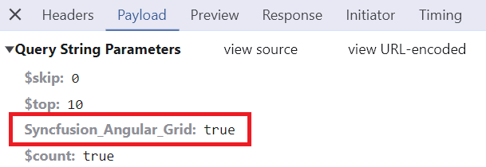

## Offline mode

On remote data binding, all grid actions such as paging, sorting, editing, grouping, filtering, etc., process on server-side. To avoid post back for every action, set the grid to load all data on initialization and make the actions process in client-side. To enable this behavior, use the `offline` property of `DataManager`.

```typescript
import { Component, OnInit } from '@angular/core';
import { DataManager, ODataAdaptor } from '@syncfusion/ej2-data';

@Component({
    selector: 'app-root',
    template: `<ejs-grid [dataSource]='data' [allowPaging]='true' [allowGrouping]='true' [allowSorting]='true' [pageSettings]='pageOptions'>
                <e-columns>
                    <e-column field='OrderID' headerText='Order ID' textAlign='Right' width=120></e-column>
                    <e-column field='CustomerID' headerText='Customer ID' width=150></e-column>
                    <e-column field='ShipCity' headerText='Ship City' width=150></e-column>
                    <e-column field='ShipName' headerText='Ship Name' width=150></e-column>
                </e-columns>
                </ejs-grid>`
})
export class AppComponent implements OnInit {

    public data: DataManager;
    public pageOptions = { pageSize: 7 };

    ngOnInit(): void {
        this.data = new DataManager({
            url: 'https://js.syncfusion.com/demos/ejServices/Wcf/Northwind.svc/Orders?$top=7',
            adaptor: new ODataAdaptor(),
            offline: true
        });
    }
}
```

## Fetch result from the DataManager query using external button 

By default, Syncfusion Angular Grid automatically binds a remote data source using the [DataManager](https://ej2.syncfusion.com/angular/documentation/data/getting-started). However, in some scenarios, it may be necessary to fetch data dynamically from the server using a query triggered by an external button. This approach allows greater control over when and how data loads into the grid.

To achieve this, use the `executeQuery` method of `DataManager` with a query object. This method enables running a custom query and retrieving results dynamically.

The following example demonstrates the process of fetching data from the server when an external button is clicked and displaying a status message indicating the data fetch status:









  
