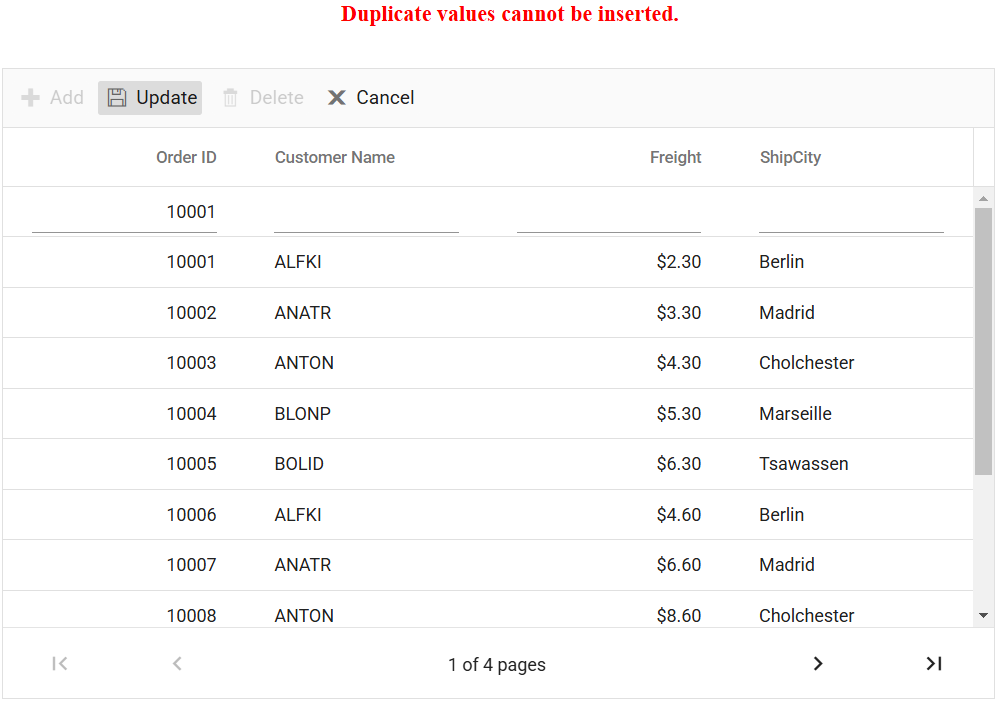

# Validation in Angular Grid Component

Data validation ensures that information entered or modified in the grid follows specific validation rules, preventing errors and maintaining accuracy. The Angular Grid component in Syncfusion provides built-in validation support to make this process easy and effective.

> For basic grid editing setup and configuration, refer to the [Editing Feature Setup](../editing/edit.md#set-up-editing) section.

## Column validation

Column validation applies validation rules to individual columns during edit operations, ensuring data accuracy before saving. Invalid data displays error messages and prevents saving. The [FormValidator](https://ej2.syncfusion.com/angular/documentation/api/form-validator) component validates data using rules defined in the [validationRules](https://ej2.syncfusion.com/angular/documentation/api/grid/column#validationrules) property for each column.

Example of applying validation rules to a grid column:









 
  


## Custom validation

Custom validation rules apply specific rules to grid columns beyond standard built-in validation. The [FormValidator](https://ej2.syncfusion.com/angular/documentation/api/form-validator) component applies these rules and displays error messages for invalid fields. Custom validation supports dependent field validation and numeric range validation for various application scenarios.

The following example demonstrates custom validation for the "Customer ID" column.










  


### Custom validation based on dropdown change

Dependent validation rules adjust based on selections in other columns, enabling linked column validation. The "Salary" column validation adjusts based on the "Role" column selection, ensuring both columns validate correctly together.

Example applying dependent validation between "Role" and "Salary" columns:










  


### Custom validation for numeric columns

Numeric column validation applies rules for numeric data such as positive values, minimum/maximum ranges, or decimal limits. This example uses "customFn" and "customFn1" functions configured through the "freightRules" object to validate numeric values. The numeric columns are bound to the `change` event, which calls the [validate](https://ej2.syncfusion.com/angular/documentation/api/form-validator#validate) method to check the value and display error messages whenever the data changes.










  


## Dynamically add or remove validation rules from the form

Validation rules can be added or removed from input elements based on application scenarios or data conditions. The [addRules](https://ej2.syncfusion.com/angular/documentation/api/form-validator#addrules) method adds validation rules dynamically to input elements using the name attribute.

The following example demonstrates dynamic addition or removal of validation rules for an input field based on a checkbox selection.










  


> To remove an existing validation rule from an input element, use the [removeRules](https://ej2.syncfusion.com/angular/documentation/api/form-validator#removerules) method.

## Change the position of validation error messages

Error message positioning customizes where validation messages appear in the grid. By default, messages display below the input field. The [customPlacement](https://ej2.syncfusion.com/angular/documentation/api/form-validator#customplacement) event repositions messages to custom locations based on application needs.

The following example demonstrates moving validation messages to the top of the input field.










  


## Show custom error message for failed CRUD actions

Error handling for CRUD operations in the grid displays helpful error messages when operations fail. The [actionFailure](https://ej2.syncfusion.com/angular/documentation/api/grid#actionfailure) event triggers on operation failures, providing access to error messages from server responses for display.

Example showing server error feedback in Angular Grid:




import { Component, ViewChild } from '@angular/core';
import { DataManager, UrlAdaptor } from '@syncfusion/ej2-data';
import { GridComponent, EditSettingsModel, ToolbarItems } from '@syncfusion/ej2-angular-grids';
import { FailureEventArgs } from '@syncfusion/ej2-angular-grids';

@Component({
  selector: 'app-root',
  templateUrl: './app.component.html',
})
export class AppComponent {
  @ViewChild('grid') public grid?: GridComponent;
  public data?: DataManager;
  public editSettings?: EditSettingsModel;
  public toolbar?: ToolbarItems[];
  public errorMessage: string = '';

  public ngOnInit(): void {
    this.data = new DataManager({
      url: 'https://localhost:****/api/grid', // Replace with your endpoint.
      insertUrl: 'https://localhost:****/api/grid/Insert',
      updateUrl:'https://localhost:****/api/grid/Update',
      removeUrl: 'https://localhost:****/api/grid/Remove',
      adaptor: new UrlAdaptor()
    });
    this.editSettings = { allowAdding: true, allowDeleting: true, allowEditing: true, mode: 'Normal' };
    this.toolbar = ['Add', 'Update', 'Delete', 'Cancel'];
  }

  public onActionFailure(args: FailureEventArgs): void {
   (args as any).error?.[0]?.error?.json().then((data: any) => {
      this.errorMessage = data.message; // Assign error message.
    }).catch(() => {
      this.errorMessage = "Error occurred, but message could not be retrieved.";
    });
  }
}






  {{ errorMessage }}

  <ejs-grid #grid [dataSource]='data' (actionFailure)="onActionFailure($event)" allowPaging="true" height="320" [toolbar]="toolbar" [editSettings]="editSettings">
    <e-columns>
      <e-column field='OrderID' headerText='Order ID' isPrimaryKey=true textAlign='Right' width='150'></e-column>
      <e-column field='CustomerID' headerText='Customer Name' width='150'></e-column>
      <e-column field='Freight' headerText='Freight' format="C2" width='150' textAlign='Right'></e-column>s
      <e-column field='ShipCity' headerText='ShipCity' width='150'></e-column>
    </e-columns>
  </ejs-grid>






using Microsoft.AspNetCore.Http;
using Microsoft.AspNetCore.Mvc;
using UrlAdaptor.Server.Models;
using Syncfusion.EJ2.Base;
using Newtonsoft.Json.Linq;

namespace UrlAdaptor.Server.Controllers
{
  [ApiController]
  public class GridController : Controller 
  {
    /// 

    /// Handles the HTTP POST request to retrieve data from the data source based on the DataManagerRequest.
    /// Supports filtering,searching, sorting, and paging operations (skip and take).
    /// 

    /// <param name="DataManagerRequest">Contains the filtering, sorting, and paging options requested by the client.</param>
    /// <returns>Returns the filtered,searched, sorted, and paginated data along with the total record count.</returns>
    [HttpPost]
    [Route("api/[controller]")]
    public object Post([FromBody] DataManagerRequest DataManagerRequest) {
      // Retrieve data from the data source (e.g., database).
      IQueryable<OrdersDetails> DataSource = GetOrderData().AsQueryable();
      QueryableOperation queryableOperation = new QueryableOperation(); // Initialize QueryableOperation instance.
      // Get the total count of records.
      int totalRecordsCount = DataSource.Count();
      // Handling paging operation.
      if (DataManagerRequest.Skip != 0) {
        DataSource = queryableOperation.PerformSkip(DataSource, DataManagerRequest.Skip);
      }
      if (DataManagerRequest.Take != 0) {
        DataSource = queryableOperation.PerformTake(DataSource, DataManagerRequest.Take);
      }
      // Return data based on the request.
      return new { result = DataSource, count = totalRecordsCount };
    }

    /// 

    /// Handles the HTTP GET request to retrieve all order records.
    /// 

    /// <returns>Returns a list of order details.</returns>
    [HttpGet]
    [Route("api/[controller]")]
    public List<OrdersDetails> GetOrderData() {
      var data = OrdersDetails.GetAllRecords().ToList();
      return data;
    }

    /// 

    /// Inserts a new data item into the data collection.
    /// 

    /// <param name="newRecord">It contains the new record detail which is need to be inserted.</param>
    /// <returns>Returns void.</returns>
    [HttpPost]
    [Route("api/[controller]/Insert")]
    public IActionResult Insert([FromBody] CRUDModel<OrdersDetails> value) {
      if (value == null) {
        return BadRequest(new { message = "Invalid data received." });
      }
      var existingOrder = OrdersDetails.order.FirstOrDefault(or => or.OrderID == value.value.OrderID);
      if (existingOrder == null) {
        OrdersDetails.order.Insert(0, value.value);
        return Ok(new { success = true, message = "Order added successfully.", data = value });
      }
      else {
        return BadRequest(new { success = false, message = "Duplicate values cannot be inserted." });
      }
    }

    /// 

    /// Update a existing data item from the data collection.
    /// 

    /// <param name="Order">It contains the updated record detail which is need to be updated.</param>
    /// <returns>Returns void.</returns>
    [HttpPost]
    [Route("api/[controller]/Update")]
    public IActionResult Update([FromBody] CRUDModel<OrdersDetails> Order) {
      var updatedOrder = Order.value;
      if (updatedOrder.OrderID > 10010 || updatedOrder.OrderID < 10030) {
        return BadRequest(new { message = "OrderID must be between 10010 and 10030 to update." });
      }
      var data = OrdersDetails.GetAllRecords().FirstOrDefault(or => or.OrderID == updatedOrder.OrderID);
      // Update the existing record
      data.OrderID = updatedOrder.OrderID;
      data.CustomerID = updatedOrder.CustomerID;
      data.ShipCity = updatedOrder.ShipCity;
      data.ShipCountry = updatedOrder.ShipCountry;
      return Ok(new { success = true, message = "Order updated successfully." });
    }

    /// 

    /// Remove a specific data item from the data collection.
    /// 

    /// <param name="value">It contains the specific record detail which is need to be removed.</param>
    /// <return>Returns void</return>
    [HttpPost]
    [Route("api/[controller]/Remove")]
    public IActionResult Remove([FromBody] CRUDModel<OrdersDetails> value) {
      int orderId = int.Parse(value.key.ToString());
      if (orderId > 10031 || orderId < 10045) {
        return BadRequest(new { message = "OrderID must be between 10031 and 10045 to delete." });
      }
      var data = OrdersDetails.GetAllRecords().FirstOrDefault(orderData => orderData.OrderID == orderId);
      OrdersDetails.GetAllRecords().Remove(data);
      return Ok(new { success = true, message = "Order deleted successfully." });
    }

    public class CRUDModel<T> where T : class
    {
      public string? action { get; set; }

      public string? keyColumn { get; set; }

      public object? key { get; set; }

      public T? value { get; set; }

      public List<T>? added { get; set; }

      public List<T>? changed { get; set; }

      public List<T>? deleted { get; set; }

      public IDictionary<string, object>? @params { get; set; }
    }
  }
}





namespace UrlAdaptor.Server.Models
{
    public class OrdersDetails
    {
      public static List<OrdersDetails> order = new List<OrdersDetails>();
      public OrdersDetails(){}
      public OrdersDetails(
      int OrderID, string CustomerId, int EmployeeId, double Freight, bool Verified,
      DateTime OrderDate, string ShipCity, string ShipName, string ShipCountry,
      DateTime ShippedDate, string ShipAddress) {
        this.OrderID = OrderID;
        this.CustomerID = CustomerId;
        this.EmployeeID = EmployeeId;
        this.Freight = Freight;
        this.ShipCity = ShipCity;
        this.Verified = Verified;
        this.OrderDate = OrderDate;
        this.ShipName = ShipName;
        this.ShipCountry = ShipCountry;
        this.ShippedDate = ShippedDate;
        this.ShipAddress = ShipAddress;
      }

      public static List<OrdersDetails> GetAllRecords()
      {
        if (order.Count() == 0)
        {
          int code = 10000;
          for (int i = 1; i < 10; i++)
          {
            order.Add(new OrdersDetails(code + 1, "ALFKI", i + 0, 2.3 * i, false, new DateTime(1991, 05, 15), "Berlin", "Simons bistro", "Denmark", new DateTime(1996, 7, 16), "Kirchgasse 6"));
            order.Add(new OrdersDetails(code + 2, "ANATR", i + 2, 3.3 * i, true, new DateTime(1990, 04, 04), "Madrid", "Queen Cozinha", "Brazil", new DateTime(1996, 9, 11), "Avda. Azteca 123"));
            order.Add(new OrdersDetails(code + 3, "ANTON", i + 1, 4.3 * i, true, new DateTime(1957, 11, 30), "Cholchester", "Frankenversand", "Germany", new DateTime(1996, 10, 7), "Carrera 52 con Ave. Bolívar #65-98 Llano Largo"));
            order.Add(new OrdersDetails(code + 4, "BLONP", i + 3, 5.3 * i, false, new DateTime(1930, 10, 22), "Marseille", "Ernst Handel", "Austria", new DateTime(1996, 12, 30), "Magazinweg 7"));
            order.Add(new OrdersDetails(code + 5, "BOLID", i + 4, 6.3 * i, true, new DateTime(1953, 02, 18), "Tsawassen", "Hanari Carnes", "Switzerland", new DateTime(1997, 12, 3), "1029 - 12th Ave. S."));
            code += 5;
          }
        }
        return order;
      }

      public int? OrderID { get; set; }
      public string? CustomerID { get; set; }
      public int? EmployeeID { get; set; }
      public double? Freight { get; set; }
      public string? ShipCity { get; set; }
      public bool? Verified { get; set; }
      public DateTime OrderDate { get; set; }
      public string? ShipName { get; set; }
      public string? ShipCountry { get; set; }
      public DateTime ShippedDate { get; set; }
      public string? ShipAddress { get; set; }
    }
}




The following screenshot demonstrates displaying error messages when CRUD operations fail:

