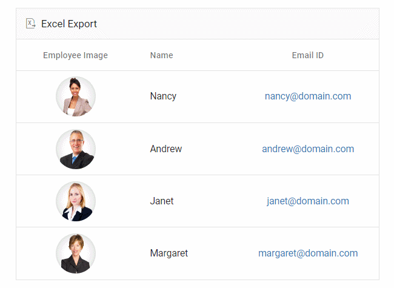
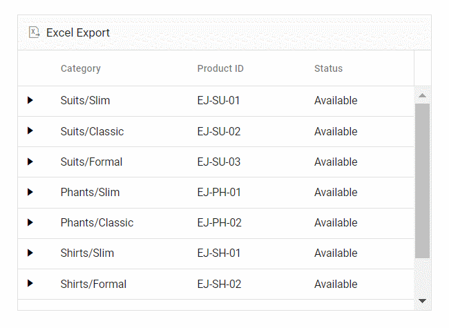
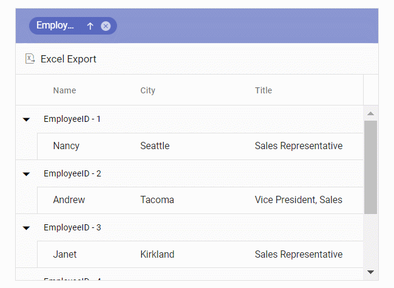

# Exporting grid with templates in Angular Grid control

The grid offers the option to export the column, detail, and caption templates to an Excel document. The template contains images, hyperlinks, and customized text.

## Exporting with column template

The Excel export functionality allows you to export Grid columns that include images, hyperlinks, and custom text to an Excel document.

In the following sample, the hyperlinks and images are exported to Excel using [hyperlink](https://ej2.syncfusion.com/angular/documentation/api/grid/excelQueryCellInfoEventArgs/#hyperlink) and [image](https://ej2.syncfusion.com/angular/documentation/api/grid/excelQueryCellInfoEventArgs/#image) properties in the [excelQueryCellInfo](https://ej2.syncfusion.com/angular/documentation/api/grid/#excelquerycellinfo) event.

> Excel Export supports base64 string to export the images.










  


## Exporting with detail template

By default, the grid will export the parent grid with expanded detail rows alone. Change the exporting option by using the `ExcelExportProperties.hierarchyExportMode` property. The available options are:

| Mode     | Behavior    |
|----------|-------------|
| Expanded | Exports the parent grid with expanded detail rows. |
| All      | Exports the parent grid with all the detail rows. |
| None     | Exports the parent grid alone. |

The detail rows in the exported Excel can be customized or formatted using the [exportDetailTemplate](https://ej2.syncfusion.com/angular/documentation/api/grid/#exportdetailtemplate) event. In this event, the detail rows of the Excel document are formatted in accordance with their parent row details.

In the following sample, the detail row content is formatted by specifying the [columnHeader](https://ej2.syncfusion.com/angular/documentation/api/grid/detailTemplateProperties/#columnheader) and [rows](https://ej2.syncfusion.com/angular/documentation/api/grid/detailTemplateProperties/#rows) properties using its [parentRow](https://ej2.syncfusion.com/angular/documentation/api/grid/exportDetailTemplateEventArgs/#parentrow) details. This allows for the creation of detail rows in the Excel document. Additionally, custom styles can be applied to specific cells using the [style](https://ej2.syncfusion.com/angular/documentation/api/grid/detailTemplateCell/#style) property.

> When using [rowSpan](https://ej2.syncfusion.com/angular/documentation/api/grid/detailTemplateCell/#rowspan), it is Essential&reg; to provide the cell's [index](https://ej2.syncfusion.com/angular/documentation/api/grid/detailTemplateCell/#index) for proper functionality.




import { NgModule } from '@angular/core'
import { BrowserModule } from '@angular/platform-browser'
import { GridModule } from '@syncfusion/ej2-angular-grids'
import { DetailRowService, ExcelExportService, ToolbarService } from '@syncfusion/ej2-angular-grids'
import { Component, OnInit, ViewChild } from '@angular/core';
import { employeeData } from './datasource';
import { GridComponent, ExportDetailTemplateEventArgs } from '@syncfusion/ej2-angular-grids';
import { ClickEventArgs } from '@syncfusion/ej2-navigations';
@Component({
imports: [
        
        GridModule        
    ],

providers: [DetailRowService, ExcelExportService, ToolbarService],
standalone: true,
    selector: 'app-root',
    template: `<ejs-grid #grid [dataSource]="data" id="DetailTemplateGrid" [toolbar]="toolbar" [allowExcelExport]="true"
        (toolbarClick)="toolbarClick($event)" (exportDetailTemplate)="exportDetailTemplate($event)" height="273px">
            <ng-template #detailTemplate let-data>
                <table class="detailtable" width="100%">
                    <colgroup>
                        <col width="40%" />
                        <col width="60%" />
                    </colgroup>
                    <thead>
                        <tr>
                            <th colspan="2" style="font-weight: 500;text-align: center;background-color: #ADD8E6;">
                            Product Details
                            </th>
                        </tr>
                    </thead>
                    <tbody>
                        <tr>
                            <td rowspan="4" style="text-align: center;">
                                
                            </td>
                            <td>
                                
                                Offers: {{ data.Offers }}
                                
                            </td>
                        </tr>
                        <tr>
                            <td>
                                Available: {{ data.Available }} 
                            </td>
                        </tr>
                        <tr>
                            <td>
                                
                                Contact:<a href="mailto:{{ data.Contact }}">{{ data.Contact }}</a>
                                
                            </td>
                        </tr>
                        <tr>
                            <td>
                                
                                Ratings: {{ data.Ratings }}
                            </td>
                        </tr>
                        <tr>
                            <td style="text-align: center;">
                                 {{ data.productDesc }}
                            </td>
                            <td>
                                {{ data.ReturnPolicy }}
                            </td>
                        </tr>
                        <tr>
                            <td style="text-align: center;">
                                 {{ data.Cost }}
                            </td>
                            <td>
                                {{ data.Cancellation }}
                            </td>
                        </tr>
                        <tr>
                            <td style="text-align: center;">
                                
                                {{ data.Status }}
                            </td>
                            <td>
                                {{ data.Delivery }}
                            </td>
                        </tr>
                    </tbody>
                </table>
            </ng-template>
            <e-columns>
                <e-column field="Category" headerText="Category" width="140"></e-column>
                <e-column field="ProductID" headerText="Product ID" width="120"></e-column>
                <e-column field="Status" headerText="Status" width="200"></e-column>
            </e-columns>
        </ejs-grid>`,
    styleUrls: ['app.style.css']
})
export class AppComponent implements OnInit {

    public data?: object[];
    public toolbar?: string[];
    @ViewChild('grid')
    public grid?: GridComponent;

    ngOnInit(): void {
        this.data = employeeData;
        this.toolbar = ['ExcelExport'];
    }

    toolbarClick(args: ClickEventArgs): void {
        if (args.item.id === 'DetailTemplateGrid_excelexport') {
            (this.grid as GridComponent).excelExport({ hierarchyExportMode: 'Expanded' });
        }
    }

    exportDetailTemplate(args: ExportDetailTemplateEventArgs): void {
        args.value = {
            columnHeader: [
                {
                    cells: [
                        {
                            index: 0,
                            colSpan: 2,
                            value: 'Product Details',
                            style: {
                                backColor: '#ADD8E6',
                                excelHAlign: 'Center',
                                bold: true,
                            },
                        },
                    ],
                },
            ],
            rows: [
                {
                    cells: [
                        {
                            index: 0,
                            rowSpan: 4,
                            image: {
                                base64: (args.parentRow as any).data['ProductImg'],
                                height: 80,
                                width: 100,
                            },
                        },
                        {
                            index: 1,
                            value: 'Offers: ' + (args.parentRow as any).data['Offers'],
                            style: { bold: true, fontColor: '#0a76ff' },
                        },
                    ],
                },
                {
                    cells: [
                        {
                            index: 1,
                            value: 'Available: ' + (args.parentRow as any).data['Available'],
                        },
                    ],
                },
                {
                    cells: [
                        {
                            index: 1,
                            value: 'Contact: ',
                            hyperLink: {
                                target: 'mailto:' + (args.parentRow as any).data['Contact'],
                                displayText: (args.parentRow as any).data['Contact'],
                            },
                        },
                    ],
                },
                {
                    cells: [
                        {
                            index: 1,
                            value: 'Ratings: ' + (args.parentRow as any).data['Ratings'],
                            style: { bold: true, fontColor: '#0a76ff' },
                        },
                    ],
                },
                {
                    cells: [
                        {
                            index: 0,
                            value: (args.parentRow as any).data['productDesc'],
                            style: { excelHAlign: 'Center' },
                        },
                        { index: 1, value: (args.parentRow as any).data['ReturnPolicy'] },
                    ],
                },
                {
                    cells: [
                        {
                            index: 0,
                            value: (args.parentRow as any).data['Cost'],
                            style: { excelHAlign: 'Center', bold: true },
                        },
                        { index: 1, value: (args.parentRow as any).data['Cancellation'] },
                    ],
                },
                {
                    cells: [
                        {
                            index: 0,
                            value: (args.parentRow as any).data['Status'],
                            style: {
                                bold: true,
                                fontColor:
                                    (args.parentRow as any).data['Status'] === 'Available'
                                        ? '#00FF00'
                                        : '#FF0000',
                                excelHAlign: 'Center',
                            },
                        },
                        {
                            index: 1,
                            value: (args.parentRow as any).data['Delivery'],
                            style: { bold: true, fontColor: '#0a76ff' },
                        },
                    ],
                },
            ],
        };
    }
}







  


## Exporting with caption template

The Excel export feature enables exporting of Grid with a caption template to an Excel document.

In the following sample, the customized caption text is exported to Excel using [captionText](https://ej2.syncfusion.com/angular/documentation/api/grid/exportGroupCaptionEventArgs/#captiontext) property in the [exportGroupCaption](https://ej2.syncfusion.com/angular/documentation/api/grid/#exportgroupcaption) event.




import { NgModule } from '@angular/core'
import { BrowserModule } from '@angular/platform-browser'
import { GridModule, GroupService, ToolbarService, ExcelExportService } from '@syncfusion/ej2-angular-grids'
import { Component, OnInit, ViewChild } from '@angular/core';
import { employeeData } from './datasource';
import { GridComponent, GroupSettingsModel, ExportGroupCaptionEventArgs } from '@syncfusion/ej2-angular-grids';
import { ClickEventArgs } from '@syncfusion/ej2-navigations';

@Component({
imports: [
        
        GridModule
    ],

providers: [GroupService, ToolbarService, ExcelExportService],
standalone: true,
    selector: 'app-root',
    template: `<ejs-grid #grid id="CaptionTemplateGrid" [dataSource]="data" [allowGrouping]="true" [groupSettings]="groupOptions"
               [toolbar]="toolbar" (toolbarClick)="toolbarClick($event)" [allowExcelExport]="true"
               (exportGroupCaption)="exportGroupCaption($event)" height='273px'>
                <e-columns>
                    <e-column field='EmployeeID' headerText='Employee ID' width='140'></e-column>
                    <e-column field='FirstName' headerText='First Name' width='120'></e-column>
                    <e-column field='City' headerText='City'></e-column>
                    <e-column field='Title' headerText='Title' width=170></e-column>
                </e-columns>
                <ng-template #groupSettingsCaptionTemplate let-data>
                    {{ data.field }} - {{ data.key }}
                </ng-template>
                </ejs-grid>`
})
export class AppComponent implements OnInit {

    public data?: object[];
    public groupOptions?: GroupSettingsModel;
    public toolbar?: string[];

    @ViewChild('grid')
    public grid?: GridComponent;

    ngOnInit(): void {
        this.data = employeeData;
        this.groupOptions = { columns: ['EmployeeID'] };
        this.toolbar = ['ExcelExport'];
    }
    toolbarClick(args: ClickEventArgs): void {
        if (args.item.id === 'CaptionTemplateGrid_excelexport') {
            (this.grid as GridComponent).excelExport();
        }
    }
    exportGroupCaption(args: ExportGroupCaptionEventArgs) {
        args.captionText = (args.data as any)['field'] + ' - ' + (args.data as any)['key'];
    }
}







  


