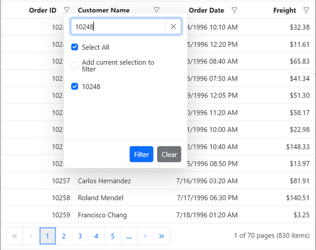

# Excel Like Filter in Angular Grid Component

The Syncfusion<sup style="font-size:70%">&reg;</sup> Angular Data Grid component offers an Excel-like filter feature, providing a familiar and user-friendly interface for filtering data within the grid. Excel-like filter displays a dialog with a checkbox list, search box, and sorting options, similar to Microsoft Excel's filter. This filtering type simplifies complex filtering operations on specific columns, allowing for quick data location and manipulation. Excel-like filtering is especially useful when dealing with large datasets and columns containing distinct categorical values (such as status, category, country, or department names).

The dialog displays all unique values from that column as a checkbox list. Values can be selected or deselected to include or exclude them from the Grid results, then "OK" button can be clicked to filter the data.

> For basic filtering setup and configuration, refer to the [Filter Feature Guide](filtering.md#setup-requirements).

## Enable Excel filtering

To enable the Excel like filtering, set the [filterSettings.type](https://ej2.syncfusion.com/angular/documentation/api/grid/filterSettings) property to `Excel`. This property determines the type of filter UI rendered in the grid.













> * The Excel-like filter feature supports various filter conditions, including text-based, number-based, date-based, and boolean-based filters.
> * The filter dialog provides additional options, such as sorting filter values, searching for specific values, and clearing applied filters.

## Checkbox filtering

Checkbox filtering is the core mechanism of Excel-like filter. When the filter dialog opens, all unique values from the selected column appear as a checkbox list. Multiple values can be selected by checking their boxes to include them in the filtered results. Values can be unchecked to exclude them from the results.

The checkbox list supports search functionality: typing in the search box filters the checkbox list to show only matching values, making it easier to find specific items in long lists.

The following example demonstrates to implement checkbox filtering in the Syncfusion Angular Grid:













## Customize the filter choice count

By default, the filter choice count is set to 1000, which means the filter dialog displays a maximum of 1000 distinct values for each column as a checkbox list. This default value ensures the filter operation remains efficient, even with large datasets. Remaining records (those beyond the first 1000) are accessible through the search box within the filter dialog.

**Why this limit exists**: Loading all distinct values from a column with tens of thousands of unique entries would cause the filter dialog to open slowly or freeze. The "1000" value limit prevents this performance issue while still providing access to all data via search.

The Grid component allows customization of the number of distinct values displayed in the checkbox list of the Excel/Checkbox filter dialog. The filter choice count can be adjusted by modifying the [filterChoiceCount](https://ej2.syncfusion.com/angular/documentation/api/grid/filterSearchBeginEventArgs#filterchoicecount) value. The count can be increased to display more initial options, or decreased to improve dialog opening speed for extremely large datasets.

The following example demonstrates to customize the filter choice count in the checkbox list of the filter dialog. In the [actionBegin](https://ej2.syncfusion.com/angular/documentation/api/grid#actionbegin) event, the code checks if the [requestType](https://ej2.syncfusion.com/angular/documentation/api/grid/filterEventArgs#requesttype) is either `filterChoiceRequest` or `filterSearchBegin`, then sets the `filterChoiceCount` property to the desired value.










  


> The specified filter choice count value determines the display of unique items as checkbox list in the `Excel/Checkbox` type filter dialog. Higher values may result in rendering delays when opening the filter dialog. Therefore, setting a reasonable filter choice count value is recommended for optimal performance.

## Add current selection to filter Checkbox/Excel

By default, the `CheckBox/Excel` filter in the Syncfusion Angular Grid applies filtering based solely on currently selected items. When multiple filtering actions are performed sequentially on the same column, previously filtered values are cleared and replaced with the new selection.

The `Add current selection to filter` checkbox functionality enables retention of previous filter values while performing new searches. This checkbox appears when searching data in the CheckBox/Excel filter search bar, allowing users to include new selections without removing previously applied filters. This cumulative filtering approach provides greater flexibility for complex filtering scenarios.

The following image illustrates the `Add current selection to filter` functionality:



## Show customized text in checkbox list data

The Grid component provides flexibility to customize the text displayed in the `Excel/Checkbox` filtering options. This customization enables modification of default text to provide more meaningful and contextual labels for filtering values.

Text customization is achieved by defining a `filterItemTemplate` and binding it to the target column. The `filterItemTemplate` property enables creation of custom templates for filter items, supporting any logic and HTML elements within the template to display desired text or content.

In the following example, the text displayed in the filter checkbox list for the "Delivered" column is customized. This is accomplished by defining a `filterItemTemplate` within the column definition for that specific column. Within the template, Angular's template syntax conditionally displays "Delivered" if the data value is `true` and "Not delivered" if the value is `false`.




import { NgModule } from '@angular/core'
import { BrowserModule } from '@angular/platform-browser'
import { GridModule } from '@syncfusion/ej2-angular-grids'
import { PageService, SortService, FilterService, GroupService } from '@syncfusion/ej2-angular-grids'

import { Component, OnInit, ViewChild } from '@angular/core';
import { categoryData } from './datasource';
import { PageSettingsModel } from '@syncfusion/ej2-angular-grids';

@Component({
imports: [GridModule],
providers: [PageService,
                SortService,
                FilterService,
                GroupService],
standalone: true,
  selector: 'app-root',
  template: `<div class="control-section">
    <ejs-grid #grid [dataSource]="data" allowPaging="true" allowFiltering="true" [pageSettings]="pageSettings" [filterSettings]="filterOptions" >
      <e-columns>
        <e-column field="CategoryName"  headerText="Category Name"  width="120" ></e-column>
        <e-column field="Delivered"  headerText="Delivered"  width="120"  displayAsCheckBox="true" [filter]="columnFilterSettings" > 
    <ng-template #filterItemTemplate let-data>{{data.Delivered == true ? "Delivered" : "Not delivered"}}</ng-template></e-column>
        <e-column field="ProductID" headerText="ProductID"  width="120" ></e-column>
      </e-columns>
    </ejs-grid>
  </div>
  `,
})
export class AppComponent implements OnInit {
  public data?: object[];
  public pageSettings?: PageSettingsModel = { pageSize: 6 };
  public filterOptions: Object = { type: 'Excel' };
  public columnFilterSettings?: Object;
  public filterItemTemplate?: string;

  ngOnInit(): void {
    this.data = categoryData;
    this.columnFilterSettings = {
      type: 'CheckBox',
      filterItemTemplate: this.filterItemTemplate,
    };
  }
}











## Show template in checkbox list data

The `filterItemTemplate` property in the grid allows customization of the appearance of filter items in the grid's filter checkbox list for a specific column. This property enables provision of custom UI or additional information within the filter checkbox list, such as icons, text, or any HTML elements, alongside the default filter items.

The following example demonstrates usage of `filterItemTemplate` to render icons alongside category names in the filter checkbox list for the "Category Name" column:




import { GridModule, PageService, SortService, FilterService, GroupService } from '@syncfusion/ej2-angular-grids';
import { Component, OnInit, ViewChild } from '@angular/core';
import { categoryData } from './datasource';
import { PageSettingsModel } from '@syncfusion/ej2-angular-grids';

@Component({
  imports: [GridModule],
  providers: [ PageService, SortService, FilterService, GroupService],
  standalone: true,
  selector: 'app-root',
  template: `<div class="control-section">
    <ejs-grid #grid [dataSource]="data" allowPaging="true" allowFiltering="true" [pageSettings]="pageSettings" [filterSettings]="filterOptions" >
      <e-columns>
        <e-column field="CategoryName"  headerText="Category Name"  width="150" [filter]="columnFilterSettings">
        <ng-template #filterItemTemplate let-data><span [ngClass]="categoryIcons[data.CategoryName]"></span> {{data.CategoryName}} </ng-template>
        </e-column>
        <e-column field="Discontinued"  headerText="Discontinued"  width="100" displayAsCheckBox="true" ></e-column>
        <e-column field="ProductID" headerText="ProductID"  width="120" ></e-column>
      </e-columns>
    </ejs-grid>
  </div>
  `,
})
export class AppComponent implements OnInit {
  public data?: object[];
  public pageSettings?: PageSettingsModel = { pageSize: 6 };
  public filterOptions: Object = { type: 'Excel' };
  public columnFilterSettings?: Object;
  @ViewChild('filterItemTemplate')
  public filterItemTemplate?: any;
  categoryIcons: { [key: string]: string } = {
    Beverages: 'fas fa-coffee',
    Condiments: 'fas	fa-leaf',
    Confections: 'fas fa-birthday-cake',
    DairyProducts: 'fas fa-ice-cream',
    Grains: 'fas fa-seedling',
    Meat: 'fas fa-drumstick-bite',
    Produce: 'fas fa-carrot',
    Seafood: 'fas fa-fish',
  };

  ngOnInit(): void {
    this.data = categoryData;
    this.columnFilterSettings = {
      type: 'Excel',
      filterItemTemplate: this.filterItemTemplate,
    };
  }
}










## Customize the excel filter dialog using CSS

The Syncfusion Angular Grid provides extensive flexibility for enhancing the visual presentation of the Excel filter dialog through CSS customization. This capability allows modification of the dialog's appearance to align with specific application requirements and aesthetic preferences.

**Removing context menu option**

The Excel filter dialog includes several features such as `context menu`, `search box`, and `checkbox list` that may not be required in certain scenarios. These options can be selectively removed using CSS targeting through the `className` attribute in the grid component.

To remove the context menu option from the Excel filter dialog, apply the following CSS rule:

```css
.e-grid .e-excelfilter .e-contextmenu-wrapper 
{
    display: none;
}
```

The following example demonstrates context menu removal in the Excel filter dialog using the above CSS customization:










  


## Bind custom remote datasource for excel/checkbox filtering

The Grid allows dynamic change of the filter data source for the Excel or Checkbox filter module using custom remote data. This capability enables the filter dialog to display values from a different data source than the Grid's main data source.

This can be accomplished by assigning a custom remote `DataManager` as the `dataSource` or by fetching the data initially and storing it in a global variable. This data can then be bound directly to the filter module's `dataSource` in the [actionBegin](https://ej2.syncfusion.com/angular/documentation/api/grid#actionbegin) event for the `filterBeforeOpen` [requestType](https://ej2.syncfusion.com/angular/documentation/api/grid/filterEventArgs#requesttype), as detailed in the [knowledge base article](https://support.syncfusion.com/kb/article/10065/change-the-data-source-for-checkbox-filter-popup-in-grid).

The following example demonstrates to dynamically change the remote custom data source for all columns in the Excel or checkbox filter dialog using a `DataManager` with `WebApiAdaptor`.










  


## Hide sorting option in filter dialog

The Excel-like filter dialog in the grid includes built-in sorting options (ascending and descending) by default within the context menu. To hide these sorting options, the `display` property of the following CSS classes can be set to `none`.

```css
.e-excel-ascending,
.e-excel-descending,
.e-separator.e-excel-separator {
 display: none;
}
```

The following example demonstrates to hide sorting options in the Excel filter dialog:










  


## Render checkbox list data in on-demand for excel/checkbox filtering

The `Excel/Checkbox` filter type of grid has a restriction where only the first 1000 unique sorted items are accessible in the filter dialog checkbox list content through scrolling. This limitation is in place to avoid rendering delays when opening the filter dialog. However, the searching and filtering processes consider all unique items in that particular column.

**Limitation**: Without on-demand loading, displaying all unique values from a column with "50,000" distinct entries would cause the filter dialog to freeze or take several seconds to open. The "1000" item limit prevents this performance issue by loading only the first batch initially.

The `Excel/Checkbox` filter provides on-demand loading capability for large datasets during scrolling to overcome scrolling limitations. This feature is enabled by setting the [filterSettings.enableInfiniteScrolling](https://ej2.syncfusion.com/angular/documentation/api/grid/filterSettings#enableinfinitescrolling) property to `true`. This functionality proves especially beneficial for managing extensive datasets, enhancing data loading performance in the checkbox list, and enabling interactive checkbox selection with persistence based on filtering criteria.

**On-Demand Loading in the Filter Dialog**: Similar to infinite scrolling in social media feeds, the filter dialog loads the next batch of values automatically as the scroll position reaches the bottom of the current list. This process repeats until all unique values have been loaded or the search box is used to narrow results.

The `Excel/Checkbox` filter retrieves distinct data in ascending order, governed by the [filterSettings.itemsCount](https://ej2.syncfusion.com/angular/documentation/api/grid/filterSettings#itemscount) property with a default value of "50". As the checkbox list data scroller reaches its end, the next dataset is fetched and displayed. This process only requests new checkbox list data without redundantly fetching existing loaded datasets.

### Customize the items count for initial rendering

Based on the items count value, the `Excel/Checkbox` filter retrieves unique data and displays it in the `Excel/Checkbox` filter content dialog. The count of on-demand data rendering for Excel/Checkbox filter can be customized by adjusting the [filterSettings.itemsCount](https://ej2.syncfusion.com/angular/documentation/api/grid/filterSettings#itemscount) property. The default value is "50".

```ts
grid.filterSettings = { enableInfiniteScrolling = true, itemsCount = 40 };
```

> It is recommended to keep the itemsCount below "300". Higher values may result in unwanted whitespace due to DOM maintenance performance degradation.

### Customize the loading animation effect

A loading effect indicates that data loading is in progress when the checkbox list data scroller reaches the end and there is a delay in receiving the data response from the server. The loading effect during on-demand data retrieval for Excel/Checkbox filter can be customized using the [filterSettings.loadingIndicator](https://ej2.syncfusion.com/angular/documentation/api/grid/filterSettings#loadingindicator) property. The default value is `Shimmer`.

**Example configuration**:

```ts
grid.filterSettings = { enableInfiniteScrolling = true, loadingIndicator = 'Spinner' };
```

The following example demonstrates On-Demand Excel filter implementation for the Angular Grid:










  


## See also

* [Filter using Wildcard and LIKE operator](./filtering#wildcard-and-like-operator-filter)
* [Change loading indicator in Angular Grid](../data-binding/data-binding#loading-animation)