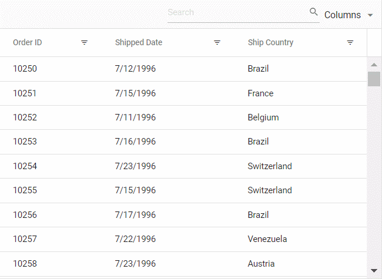
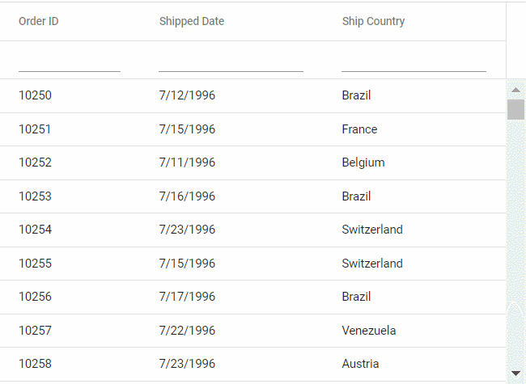

# Filtering in Angular Grid Component

Filtering is a powerful feature in the [Angular Data Grid](https://www.syncfusion.com/angular-components/angular-data-grid) component that enables selective viewing of data based on specific criteria. It allows narrowing down large datasets to focus on relevant information, thereby enhancing data analysis and decision-making.

## Set up filtering

To use filtering functionality, inject `FilterService` to the providers array.

```js

import { GridModule,FilterService } from '@syncfusion/ej2-angular-grids';
import { Component, OnInit } from '@angular/core';
import { data } from './datasource';

@Component({
    imports: [GridModule],
    providers: [PageService,SortService,FilterService,GroupService],
    standalone: true,
    selector: 'app-root',
    template: `<ejs-grid [dataSource]='data' [allowPaging]="true" [allowSorting]="true"
                [allowFiltering]="true" [pageSettings]="pageSettings">
                <e-columns>
                    <!-- Add column definitions here -->
                </e-columns>
                </ejs-grid>`
})
```

## Enable filtering

To enable filtering in the grid, set the [allowFiltering](https://ej2.syncfusion.com/angular/documentation/api/grid#allowfiltering) property to `true`. Once filtering is enabled, configure various filtering options through the [filterSettings](https://ej2.syncfusion.com/angular/documentation/api/grid/filterSettings) property to define the behavior and appearance of filters.

The following example demonstrates basic filtering functionality:










  


> * Apply and clear filtering programmatically using [filterByColumn](https://ej2.syncfusion.com/angular/documentation/api/grid/filter#filterbycolumn) and [clearFiltering](https://ej2.syncfusion.com/angular/documentation/api/grid/filter#clearfiltering) methods.
> * Disable filtering for specific columns by setting [columns.allowFiltering](https://ej2.syncfusion.com/angular/documentation/api/grid/column#allowfiltering) to `false`.

## Initial filter

To apply an initial filter, specify the filter criteria using the [predicate](https://ej2.syncfusion.com/angular/documentation/api/grid/predicate) object in [filterSettings.columns](https://ej2.syncfusion.com/angular/documentation/api/grid/filterSettingsModel#columns). The predicate object represents the filtering condition and contains properties such as field, operator, and value.

The following example demonstrates initial filter configuration:










  


### Initial filter with multiple values for same column

Initial filtering with multiple values allows to preset filter conditions for a specific column using multiple criteria. This displays only records matching any of the specified values when the grid first renders.

Set multiple [predicate](https://ej2.syncfusion.com/angular/documentation/api/grid/predicate) objects in [filterSettings.columns](https://ej2.syncfusion.com/angular/documentation/api/grid/filterSettingsModel#columns) for the same field.

The following example filters the "Customer ID" column to show only specific customer records.










  


### Initial filter with multiple values for different columns 

Initial filter configuration with multiple values across different columns sets predefined filter criteria for each column. This configuration displays filtered records immediately when the grid loads.

To apply filters with multiple values for different columns at initial rendering, configure multiple filter [predicate](https://ej2.syncfusion.com/angular/documentation/api/grid/predicate) objects in [filterSettings.columns](https://ej2.syncfusion.com/angular/documentation/api/grid/filterSettingsModel#columns).

The following example demonstrates to perform an initial filter with multiple values for different "Order ID" and "Customer ID" columns using `filterSettings.columns` and `predicate`.










  


## Filter operators

The Grid provides various filter operators to define filter conditions for columns. Define the filter operator using the [operator](https://ej2.syncfusion.com/angular/documentation/api/grid/predicateModel#operator) property in [filterSettings.columns](https://ej2.syncfusion.com/angular/documentation/api/grid/filterSettings#columns).

The available operators and its supported data types are:

Operator |Description |Supported Types
-----|-----|-----
`startsWith` |Checks whether a value begins with the specified value. |String
`endsWith` |Checks whether a value ends with specified value. |String
`contains` |Checks whether a value contains with specified value. |String
`doesnotstartwith` |Checks whether the value does not begin with the specified value. |String
`doesnotendwith` |Checks whether the value does not end with the specified value. |String
`doesnotcontain` |Checks whether the value does not contain the specified value. |String
`equal` |Checks whether a value equal to specified value. |String &#124; Number &#124; Boolean &#124; Date
`notEqual` |Checks whether a value not equal to specified value. |String &#124; Number &#124; Boolean &#124; Date
`greaterThan` |Checks whether a value is greater than with specified value. |Number &#124; Date
`greaterThanOrEqual` |Checks whether a value is greater than or equal to specified value. |Number &#124; Date
`lessThan` |Checks whether a value is less than with specified value. |Number &#124; Date
`lessThanOrEqual` |Checks whether a value is less than or equal to specified value. |Number &#124; Date
`isnull` |Returns the values that are null. |String &#124; Number &#124; Date
`isnotnull` |Returns the values that are not null. |String &#124; Number &#124; Date
`isempty` |Returns the values that are empty. |String
`isnotempty` |Returns the values that are not empty. |String
`between`|Filter the values based on the range between the start and end specified values. |Number &#124; Date
`in` |Filters multiple records in the same column that exactly match any of the selected values. |String &#124; Number &#124; Date
`notin` |Filters multiple records in the same column that do not match any of the selected values. |String &#124; Number &#124; Date

> By default, the grid uses different filter operators for different column types. The default filter operator for string columns is `startswith`, for numeric columns is `equal`, and for boolean columns is `equal`.

## Wildcard and LIKE operator filter

`Wildcard` and `LIKE` filter operators filters the value based on the given string pattern, and they apply to string-type columns. But it will work slightly differently.

### Wildcard filtering

The `Wildcard` filter processes one or more search patterns using the "*" symbol, retrieving values matching the specified patterns. This filter option supports all search scenarios in the DataGrid.

**Wildcard pattern examples:**

| Operator | Description |
|----------|-------------|
| a*b | Everything that starts with "a" and ends with "b" |
| a* | Everything that starts with "a" |
| *b | Everything that ends with "b" |
| *a* | Everything that contains "a" |
| *a*b* | Everything containing "a", followed by anything, then "b", followed by anything |



### LIKE filtering

The `LIKE` filter processes single search patterns using the "%" symbol, retrieving values matching the specified patterns. The following Grid features support LIKE filtering on string-type columns:

* Filter Menu
* Filter Bar with [filterSettings.showFilterBarOperator](https://ej2.syncfusion.com/angular/documentation/api/grid/filter#showFilterBarOperator) property enabled
* Custom Filter of Excel filter type

**LIKE pattern examples:**

| Operator | Description |
|----------|-------------|
| %ab% | Returns all values that contain "ab" characters |
| ab% | Returns all values that end with "ab" characters |
| %ab | Returns all values that start with "ab" characters |



## Diacritics filter

The diacritics filter feature handles text data that includes accented characters. Diacritics are accent marks added to letters (examples: é, ñ, ü, ç). By default, the grid ignores these characters during filtering.

This feature is essential for international data where names like "José" and "Jose" should be treated differently (or the same, depending on requirements).

Enable diacritic character consideration by setting [filterSettings.ignoreAccent](https://ej2.syncfusion.com/angular/documentation/api/grid/filter#filterbycolumn) to `true`.

The following example demonstrates diacritics filtering with the `ignoreAccent` property set to true:










  


## Perform ENUM column filtering

The Syncfusion Angular Grid supports filtering enum-type data using the [FilterTemplate](https://ej2.syncfusion.com/angular/documentation/api/grid/column#filtertemplate) feature. This is particularly useful for filtering predefined values, such as categories or statuses.

To achieve this functionality:

1. Render [DropDownList](https://ej2.syncfusion.com/angular/documentation/drop-down-list/getting-started) in the [FilterTemplate](https://ej2.syncfusion.com/angular/documentation/api/grid/column#filtertemplate) for the enum-type column
2. Bind the enumerated list data to the column
3. Use the [template](https://ej2.syncfusion.com/angular/documentation/api/grid/column#template) property to display enum values in a readable format
4. In the [change](https://ej2.syncfusion.com/angular/documentation/api/drop-down-list#change) event of the DropDownList, dynamically filter the column using the [filterByColumn](https://ej2.syncfusion.com/angular/documentation/api/grid#filterbycolumn) method

The following example demonstrates enum-type data filtering:




import { Component, OnInit, ViewChild } from '@angular/core';
import { GridModule,GridComponent,FilterService } from '@syncfusion/ej2-angular-grids';
import { DropDownListModule, ChangeEventArgs } from '@syncfusion/ej2-angular-dropdowns';
import { data, OrderData, FileType } from './datasource';

@Component({
  imports: [GridModule, DropDownListModule],
  selector: 'app-root',
  standalone: true,
  providers: [FilterService],
  template: `
    <ejs-grid #grid [dataSource]="data" [allowFiltering]="true" height="273px">
      <e-columns>
        <e-column field="OrderID" headerText="Order ID" textAlign="Right" width="100"></e-column>
        <e-column field="CustomerID" headerText="Customer ID" width="120"></e-column>
        <e-column field="ShipCity" headerText="Ship City" width="100"></e-column>
        <e-column field="ShipName" headerText="Ship Name" width="100"></e-column>
        <e-column field="Type" headerText="Type" width="130">
          <ng-template #template let-data>
            {{ data.Type === 1 ? 'Base' : data.Type === 2 ? 'Replace' : data.Type === 3 ? 'Delta' : '' }}
          </ng-template>
          <ng-template #filterTemplate let-data>
            <div>
              <ejs-dropdownlist  #dropDown [dataSource]="filterDropData" [fields]="{ text: 'Type', value: 'Type' }" [value]="filterDropData[0].Type" (change)="onTypeFilterChange($event)">
              </ejs-dropdownlist>
            </div>
          </ng-template>
        </e-column>
      </e-columns>
    </ejs-grid>`
})
export class AppComponent implements OnInit {
  @ViewChild('grid') public grid?: GridComponent;
  public data?: OrderData[];
  public filterDropData: { Type: string }[] = [
    { Type: 'All' },
    { Type: 'Base' },
    { Type: 'Replace' },
    { Type: 'Delta' },
  ];
  ngOnInit(): void {
    this.data = data; 
  }
  public onTypeFilterChange(args: ChangeEventArgs): void {
    if (args.value === 'All') {
      this.grid?.clearFiltering();
    } else {
      this.grid?.filterByColumn(
        'Type',
        'contains',
        FileType[args.value as keyof typeof FileType]
      );
    }
  }
}









  


## Filtering with case sensitivity

The Grid provides the flexibility to enable or disable case sensitivity during filtering. Control whether filtering operations consider the case of characters using the [enableCaseSensitivity](https://ej2.syncfusion.com/angular/documentation/api/grid/filterSettings#enablecasesensitivity) property within [filterSettings](https://ej2.syncfusion.com/angular/documentation/api/grid/filterSettings).

Below is an example code demonstrating to enable or disable case sensitivity while filtering:










  


## Enable different filter for a column

The Grid offers flexibility to customize filtering behavior for different columns by enabling various filter types such as `Menu`, `Excel`, or `CheckBox`. This allows tailoring the filtering experience to suit specific column needs. For example, use a menu-based filter for a category column, an Excel-like filter for a date column, and a checkbox filter for a status column.

It can be achieved by adjusting the [column.filter.type](https://ej2.syncfusion.com/angular/documentation/api/grid/column#filter) property based on requirements.

Here's an example where the menu filter is enabled by default for all columns, and filter types can be modified dynamically through a dropdown:













  


## Change default filter operator for particular column

The Grid provides flexibility to change the default filter operator for a particular column. By default, the filter operator for string columns is `startswith`, for numeric columns is `equal`, and for boolean columns is `equal`. Customize the filter operator to better match the nature of the data using the "operator" property within [filterSettings](https://ej2.syncfusion.com/angular/documentation/api/grid#filtersettings).

Here's an example that demonstrates to change the default filter operator column :













  


## Filter grid programmatically with single and multiple values using method 

Programmatic filtering allows applying filters to specific columns without relying on user interface interactions. This is achieved using the [filterByColumn](https://ej2.syncfusion.com/angular/documentation/api/grid#filterbycolumn) method.

The following example demonstrates programmatic filtering using single and multiple values for the "Order ID" and "Customer ID" columns. The `filterByColumn` method is called within an external button click function.










  


## Get filtered records

Retrieve filtered records using available methods and properties in the Grid component when working with data that matches currently applied filters.

**1. Using the getFilteredRecords() method**

The [getFilteredRecords](https://ej2.syncfusion.com/angular/documentation/api/grid#getfilteredrecords) method obtains an array of records that match currently applied filters on the grid.

The following example demonstrates getting filtered data using the `getFilteredRecords` method:













  


**2. Using the properties in the FilterEventArgs object**

Alternatively, use properties available in the [FilterEventArgs](https://ej2.syncfusion.com/angular/documentation/api/grid/filterEventArgs) object to obtain filter record details:

* [columns](https://ej2.syncfusion.com/angular/documentation/api/grid/filterEventArgs#columns): Returns the collection of filtered columns
* [currentFilterObject](https://ej2.syncfusion.com/angular/documentation/api/grid/filterEventArgs#currentfilterobject): Returns the currently filtered object
* [currentFilteringColumn](https://ej2.syncfusion.com/angular/documentation/api/grid/filterEventArgs#currentfilteringcolumn): Returns the currently filtered column name

Access these properties using the [actionComplete](https://ej2.syncfusion.com/angular/documentation/api/grid#actioncomplete) event handler:

```typescript
actionComplete(args: FilterEventArgs) {
    var column = args.columns;
    var object = args.currentFilterObject;
    var name = args.currentFilteringColumn;
}
```

## Clear filtering using methods

The Grid provides the [clearFiltering](https://ej2.syncfusion.com/angular/documentation/api/grid#clearfiltering) method to remove filter conditions and reset the grid to its original state.

The following example demonstrates clearing filters using the `clearFiltering` method:










  


## Filtering events

Filtering events allow customization of grid behavior when filtering is applied. Filtering can be prevented for specific columns, messages displayed to users, or other actions performed to suit application requirements.

Implement filtering events using available events such as [actionBegin](https://ej2.syncfusion.com/angular/documentation/api/grid#actionbegin) and [actionComplete](https://ej2.syncfusion.com/angular/documentation/api/grid#actioncomplete). These events enable intervention in the filtering process and customization as needed.

The following example demonstrates filtering prevention for the "Ship City" column during the `actionBegin` event:




import { MultiSelectModule, CheckBoxSelectionService,DropDownListAllModule } from '@syncfusion/ej2-angular-dropdowns';
import { CheckBoxModule } from '@syncfusion/ej2-angular-buttons';
import { MessageModule } from '@syncfusion/ej2-angular-notifications';
import { Component, OnInit, ViewChild } from '@angular/core';
import { data } from './datasource';
import { GridModule, FilterService, PageService,FilterSettingsModel, GridComponent, FilterEventArgs } from '@syncfusion/ej2-angular-grids';

@Component({
    imports: [
        GridModule,
        MultiSelectModule,
        DropDownListAllModule,
        CheckBoxModule,
        MessageModule
        ],
    providers: [FilterService, PageService,CheckBoxSelectionService],
    standalone: true,
    selector: 'app-root',
    template: `<div id='message'>{{message}}</div><ejs-grid #grid [dataSource]='data' [allowFiltering]='true' height='273px' (actionBegin)="actionBegin($event)" (actionComplete)="actionComplete($event)">
                <e-columns>
                    <e-column field='OrderID' headerText='Order ID' textAlign='Right' width=100></e-column>
                    <e-column field='CustomerID' headerText='Customer ID' width=120></e-column>
                    <e-column field='ShipCity' headerText='Ship City' width=100></e-column>
                    <e-column field='ShipName' headerText='Ship Name' width=100></e-column>
                </e-columns>
                </ejs-grid>`
})
export class AppComponent implements OnInit {

    public data?: object[];
    public filterOptions?: FilterSettingsModel;
    public message: string | undefined;
    @ViewChild('grid') public gridObj?: GridComponent;

    ngOnInit(): void {
        this.data = data;
    }

    actionBegin(args: FilterEventArgs) {
        if (args.requestType == 'filtering' && args.currentFilteringColumn == 'ShipCity') {
            args.cancel = true;
            this.message = 'The ' + args.type + ' event has been triggered and the ' + args.requestType + ' action is cancelled for ' + args.currentFilteringColumn;
        }
    }

    actionComplete(args: FilterEventArgs) {
        if (args.requestType == 'filtering' && args.currentFilteringColumn) {
            this.message = 'The ' + args.type + ' event has been triggered and the ' + args.requestType + ' action for the ' + args.currentFilteringColumn + ' column has been successfully executed';
        } else {
            this.message = '';
        }
    }
}








  


## See Also

* [Customizing Filter Dialog by using an additional parameter](../how-to/add-params-for-filtering)
* [Hide sorting options on Excel filter dialog](../how-to/hide-sorting-in-excel-filter)
* [How to apply initial filter on custom binding in Angular Grid](https://www.syncfusion.com/forums/152157/how-to-apply-initial-filter-on-custom-binding-in-angular-grid)
* [How to custom the display value of checkbox filter option in Angular Grid](https://www.syncfusion.com/forums/154478/how-to-custom-the-display-value-of-checkbox-filter-option-in-angular-grid)
* [How to change loading indicator in Angular Grid](../data-binding/data-binding#loading-animation)