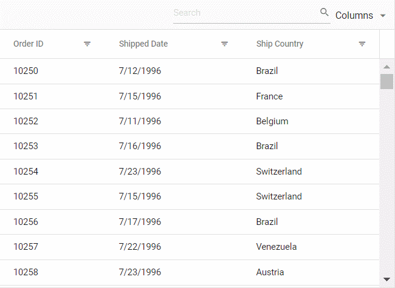
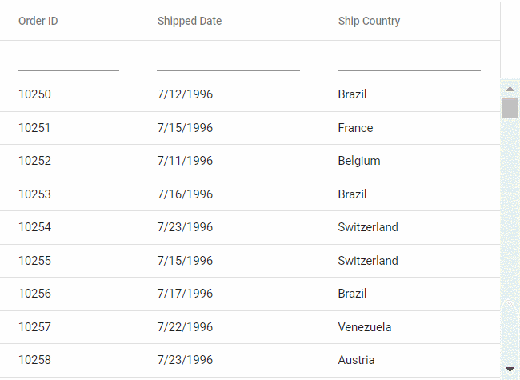

# Filtering in Angular Data Grid

The [Angular Data Grid](https://www.syncfusion.com/angular-components/angular-data-grid) provides flexible filtering capabilities for refining data based on specific criteria. Filtering helps narrow large datasets to focus on relevant information, improving data analysis and data exploration. Multiple filtering experiences are available, including filter bar, menu filter, excel filter, and checkbox filter, along with support for filter operators, wildcard and LIKE filtering, custom filter templates, and advanced filtering scenarios.

## Enable filtering

To enable filtering in the Data Grid, inject `FilterService` into the component providers and set the [allowFiltering](https://ej2.syncfusion.com/angular/documentation/api/grid#allowfiltering) property to `true`. Once filtering is enabled, configure various filtering options through the [filterSettings](https://ej2.syncfusion.com/angular/documentation/api/grid/filterSettings) property to define the behavior and appearance of filters.

The following example demonstrates basic filtering functionality:










  


> * Apply and clear filtering programmatically using [filterByColumn](https://ej2.syncfusion.com/angular/documentation/api/grid/filter#filterbycolumn) and [clearFiltering](https://ej2.syncfusion.com/angular/documentation/api/grid/filter#clearfiltering) methods.
> * Disable filtering for specific columns by setting [columns.allowFiltering](https://ej2.syncfusion.com/angular/documentation/api/grid/column#allowfiltering) to `false`.

## Filter types

The Data Grid supports multiple filtering options to meet different data-filtering requirements:

- **[Filter bar](filter-bar.md)**: Provides inline filtering directly within the column headers.
- **[Menu filter](filter-menu.md)**: Enables condition-based filtering through a filter menu.
- **[Excel filter](excel-like-filter.md)**: Offers an Excel-like filtering experience with search and checkbox-based value selection.
- **[CheckBox filter](excel-like-filter.md)**: Allows filtering by selecting from a list of distinct column values.

Use the `filterSettings.type` property to specify the desired filter type.

## Configure initial filter

To apply an initial filter, specify the filter criteria using the [predicate](https://ej2.syncfusion.com/angular/documentation/api/grid/predicate) object in [filterSettings.columns](https://ej2.syncfusion.com/angular/documentation/api/grid/filterSettingsModel#columns). The predicate object represents the filtering condition and contains properties such as field, operator, and value.

The following example demonstrates initial filter configuration:










  


### Initial filter with multiple values for the same column

Initial filtering with multiple values allows filter conditions to be preset for a specific column using multiple criteria. This displays only records matching any of the specified values when the grid first renders.

Set multiple [predicate](https://ej2.syncfusion.com/angular/documentation/api/grid/predicate) objects in [filterSettings.columns](https://ej2.syncfusion.com/angular/documentation/api/grid/filterSettingsModel#columns) for the same field.

The following example filters the "Customer ID" column to show only specific customer records.










  


### Initial filter with multiple values for different columns 

Initial filter configuration with multiple values across different columns sets predefined filter criteria for each column. This configuration displays filtered records immediately when the grid loads.

To apply filters with multiple values for different columns at initial rendering, configure multiple filter [predicate](https://ej2.syncfusion.com/angular/documentation/api/grid/predicate) objects in [filterSettings.columns](https://ej2.syncfusion.com/angular/documentation/api/grid/filterSettingsModel#columns).

The following example demonstrates performing an initial filter with multiple values for different "Order ID" and "Customer ID" columns using `filterSettings.columns` and `predicate`.










  


## Filter operators

The Data Grid provides various filter operators to define filter conditions for columns. Define the filter operator using the [operator](https://ej2.syncfusion.com/angular/documentation/api/grid/predicateModel#operator) property in [filterSettings.columns](https://ej2.syncfusion.com/angular/documentation/api/grid/filterSettings#columns).

The available operators and their supported data types are:

Operator |Description |Supported Types
-----|-----|-----
`startsWith` |Checks whether a value begins with the specified value. |String
`endsWith` |Checks whether a value ends with the specified value. |String
`contains` |Checks whether a value contains the specified value. |String
`doesnotstartwith` |Checks whether the value does not begin with the specified value. |String
`doesnotendwith` |Checks whether the value does not end with the specified value. |String
`doesnotcontain` |Checks whether the value does not contain the specified value. |String
`equal` |Checks whether a value is equal to the specified value. |String &#124; Number &#124; Boolean &#124; Date
`notEqual` |Checks whether a value is not equal to the specified value. |String &#124; Number &#124; Boolean &#124; Date
`greaterThan` |Checks whether a value is greater than the specified value. |Number &#124; Date
`greaterThanOrEqual` |Checks whether a value is greater than or equal to the specified value. |Number &#124; Date
`lessThan` |Checks whether a value is less than the specified value. |Number &#124; Date
`lessThanOrEqual` |Checks whether a value is less than or equal to the specified value. |Number &#124; Date
`isnull` |Returns the values that are null. |String &#124; Number &#124; Date
`isnotnull` |Returns the values that are not null. |String &#124; Number &#124; Date
`isempty` |Returns the values that are empty. |String
`isnotempty` |Returns the values that are not empty. |String
`between`|Filter the values based on the range between the specified start and end values. |Number &#124; Date
`in` |Filters multiple records in the same column that exactly match any of the selected values. |String &#124; Number &#124; Date
`notin` |Filters multiple records in the same column that do not match any of the selected values. |String &#124; Number &#124; Date

> By default, the grid uses different filter operators for different column types. The default filter operator for string columns is `startswith`, for numeric columns is `equal`, and for boolean columns is `equal`.

## Case-sensitive filtering

The Data Grid provides the flexibility to enable or disable case sensitivity during filtering. Control whether filtering operations consider the case of characters using the [enableCaseSensitivity](https://ej2.syncfusion.com/angular/documentation/api/grid/filterSettings#enablecasesensitivity) property within [filterSettings](https://ej2.syncfusion.com/angular/documentation/api/grid/filterSettings).

The following example demonstrates enabling or disabling case sensitivity while filtering.










  


## Diacritics filtering

The diacritics filter feature handles text data that contains accented characters such as é, ñ, ü, and ç. By default, the grid ignores these characters during filtering.

This feature is essential for international data where names like "José" and "Jose" should be treated differently (or the same, depending on requirements).

Enable diacritic character consideration by setting [filterSettings.ignoreAccent](https://ej2.syncfusion.com/angular/documentation/api/grid/filterSettings#ignoreaccent) to `true`.

The following example demonstrates diacritics filtering with the `ignoreAccent` property set to `true`:










  


## Wildcard and LIKE filters

`Wildcard` and `LIKE` filter operators filter values based on the given string pattern, and they apply to string-type columns. However, they work slightly differently.

### Wildcard filtering

The `Wildcard` filter processes one or more search patterns using the "*" symbol, retrieving values matching the specified patterns. This filter option supports a wide range of search scenarios.

**Wildcard pattern examples:**

| Operator | Description |
|----------|-------------|
| a*b | Everything that starts with "a" and ends with "b" |
| a* | Everything that starts with "a" |
| *b | Everything that ends with "b" |
| *a* | Everything that contains "a" |
| *a*b* | Everything containing "a", followed by anything, then "b", followed by anything |

### LIKE filtering

The `LIKE` filter processes single search patterns using the "%" symbol, retrieving values matching the specified patterns. The following Data Grid features support LIKE filtering on string-type columns:

* Filter Menu
* Filter Bar with [filterSettings.showFilterBarOperator](https://ej2.syncfusion.com/angular/documentation/api/grid/filter#showFilterBarOperator) property enabled
* Custom Filter of Excel filter type

**LIKE pattern examples:**

| Operator | Description |
|----------|-------------|
| %ab% | Returns all values that contain "ab" characters |
| ab% | Returns all values that end with "ab" characters |
| %ab | Returns all values that start with "ab" characters |

## Configure different filter types for columns

The Data Grid offers flexibility to customize filtering behavior for different columns by enabling various filter types such as `Menu`, `Excel`, or `CheckBox`. This allows the filtering experience to be tailored to suit specific column needs. For example, use a menu-based filter for a category column, an Excel-like filter for a date column, and a checkbox filter for a status column.

It can be achieved by adjusting the [column.filter.type](https://ej2.syncfusion.com/angular/documentation/api/grid/column#filter) property based on requirements.

The following example demonstrates configuring the Menu filter as the default filter type for all columns and modifying filter types dynamically using a dropdown.













  


## Change default filter operator for a particular column

The Data Grid provides flexibility to change the default filter operator for a particular column. By default, the filter operator for string columns is `startswith`, for numeric columns is `equal`, and for boolean columns is `equal`. Customize the filter operator to better match the nature of the data using the `operator` property within [filterSettings](https://ej2.syncfusion.com/angular/documentation/api/grid#filtersettings).

The following example demonstrates changing the default filter operator for a column:













  


## Enum filtering with custom filter templates

The Syncfusion Angular Data Grid supports filtering enum-type data using the [FilterTemplate](https://ej2.syncfusion.com/angular/documentation/api/grid/column#filtertemplate) feature. This is particularly useful for filtering predefined values, such as categories or statuses.

To achieve this functionality:

1. Render a [DropDownList](https://ej2.syncfusion.com/angular/documentation/drop-down-list/getting-started) in the [FilterTemplate](https://ej2.syncfusion.com/angular/documentation/api/grid/column#filtertemplate) for the enum-type column
2. Bind the enumerated list data to the column
3. Use the [template](https://ej2.syncfusion.com/angular/documentation/api/grid/column#template) property to display enum values in a readable format
4. In the [change](https://ej2.syncfusion.com/angular/documentation/api/drop-down-list#change) event of the DropDownList, dynamically filter the column using the [filterByColumn](https://ej2.syncfusion.com/angular/documentation/api/grid#filterbycolumn) method

The following example demonstrates enum-type data filtering:




import { Component, OnInit, ViewChild } from '@angular/core';
import { GridModule,GridComponent,FilterService } from '@syncfusion/ej2-angular-grids';
import { DropDownListModule, ChangeEventArgs } from '@syncfusion/ej2-angular-dropdowns';
import { data, OrderData, FileType } from './datasource';

@Component({
  imports: [GridModule, DropDownListModule],
  selector: 'app-root',
  standalone: true,
  providers: [FilterService],
  template: `
    <ejs-grid #grid [dataSource]="data" [allowFiltering]="true" height="273px">
      <e-columns>
        <e-column field="OrderID" headerText="Order ID" textAlign="Right" width="100"></e-column>
        <e-column field="CustomerID" headerText="Customer ID" width="120"></e-column>
        <e-column field="ShipCity" headerText="Ship City" width="100"></e-column>
        <e-column field="ShipName" headerText="Ship Name" width="100"></e-column>
        <e-column field="Type" headerText="Type" width="130">
          <ng-template #template let-data>
            {{ data.Type === 1 ? 'Base' : data.Type === 2 ? 'Replace' : data.Type === 3 ? 'Delta' : '' }}
          </ng-template>
          <ng-template #filterTemplate let-data>
            

              <ejs-dropdownlist  #dropDown [dataSource]="filterDropData" [fields]="{ text: 'Type', value: 'Type' }" [value]="filterDropData[0].Type" (change)="onTypeFilterChange($event)">
              </ejs-dropdownlist>
            

          </ng-template>
        </e-column>
      </e-columns>
    </ejs-grid>`
})
export class AppComponent implements OnInit {
  @ViewChild('grid') public grid?: GridComponent;
  public data?: OrderData[];
  public filterDropData: { Type: string }[] = [
    { Type: 'All' },
    { Type: 'Base' },
    { Type: 'Replace' },
    { Type: 'Delta' },
  ];
  ngOnInit(): void {
    this.data = data; 
  }
  public onTypeFilterChange(args: ChangeEventArgs): void {
    if (args.value === 'All') {
      this.grid?.clearFiltering();
    } else {
      this.grid?.filterByColumn(
        'Type',
        'contains',
        FileType[args.value as keyof typeof FileType]
      );
    }
  }
}









  


## Filtering events

Filtering events allow customization of grid behavior during filtering operations. Filtering can be prevented for specific columns, custom messages can be displayed, and additional actions can be performed based on application requirements.

Implement filtering events using available events such as [actionBegin](https://ej2.syncfusion.com/angular/documentation/api/grid#actionbegin) and [actionComplete](https://ej2.syncfusion.com/angular/documentation/api/grid#actioncomplete). These events enable intervention in the filtering process and customization as needed.

The following example demonstrates filtering prevention for the "Ship City" column during the `actionBegin` event:




import { MultiSelectModule, CheckBoxSelectionService,DropDownListAllModule } from '@syncfusion/ej2-angular-dropdowns';
import { CheckBoxModule } from '@syncfusion/ej2-angular-buttons';
import { MessageModule } from '@syncfusion/ej2-angular-notifications';
import { Component, OnInit, ViewChild } from '@angular/core';
import { data } from './datasource';
import { GridModule, FilterService, PageService,FilterSettingsModel, GridComponent, FilterEventArgs } from '@syncfusion/ej2-angular-grids';

@Component({
    imports: [
        GridModule,
        MultiSelectModule,
        DropDownListAllModule,
        CheckBoxModule,
        MessageModule
        ],
    providers: [FilterService, PageService,CheckBoxSelectionService],
    standalone: true,
    selector: 'app-root',
    template: `
{{message}}
<ejs-grid #grid [dataSource]='data' [allowFiltering]='true' height='273px' (actionBegin)="actionBegin($event)" (actionComplete)="actionComplete($event)">
                <e-columns>
                    <e-column field='OrderID' headerText='Order ID' textAlign='Right' width=100></e-column>
                    <e-column field='CustomerID' headerText='Customer ID' width=120></e-column>
                    <e-column field='ShipCity' headerText='Ship City' width=100></e-column>
                    <e-column field='ShipName' headerText='Ship Name' width=100></e-column>
                </e-columns>
                </ejs-grid>`
})
export class AppComponent implements OnInit {

    public data?: object[];
    public filterOptions?: FilterSettingsModel;
    public message: string | undefined;
    @ViewChild('grid') public gridObj?: GridComponent;

    ngOnInit(): void {
        this.data = data;
    }

    actionBegin(args: FilterEventArgs) {
        if (args.requestType == 'filtering' && args.currentFilteringColumn == 'ShipCity') {
            args.cancel = true;
            this.message = 'The ' + args.type + ' event has been triggered and the ' + args.requestType + ' action is cancelled for ' + args.currentFilteringColumn;
        }
    }

    actionComplete(args: FilterEventArgs) {
        if (args.requestType == 'filtering' && args.currentFilteringColumn) {
            this.message = 'The ' + args.type + ' event has been triggered and the ' + args.requestType + ' action for the ' + args.currentFilteringColumn + ' column has been successfully executed';
        } else {
            this.message = '';
        }
    }
}








  


## See Also

* [Customizing Filter Dialog by using an additional parameter](../how-to/add-params-for-filtering)
* [Hide sorting options on Excel filter dialog](../how-to/hide-sorting-in-excel-filter)
* [How to apply initial filter on custom binding in Angular Data Grid](https://www.syncfusion.com/forums/152157/how-to-apply-initial-filter-on-custom-binding-in-angular-grid)
* [How to custom the display value of checkbox filter option in Angular Data Grid](https://www.syncfusion.com/forums/154478/how-to-custom-the-display-value-of-checkbox-filter-option-in-angular-grid)
* [How to change loading indicator in Angular Data Grid](../data-binding/data-binding#loading-animation)