# Globalization in Angular Grid Component

The Syncfusion<sup style="font-size:70%">&reg;</sup> [Angular Data Grid](https://www.syncfusion.com/angular-components/angular-data-grid) component provides a Globalization feature (global and local) that enhances application accessibility for people from different regions and language backgrounds. Data can be displayed in preferred languages and formats, improving the overall user experience.

## Localization

The Syncfusion<sup style="font-size:70%">&reg;</sup> Angular Data Grid includes a built-in [Localization](https://ej2.syncfusion.com/angular/documentation/common/globalization/localization) library that allows customization of text used in the grid to match different languages or cultural preferences. The library enables changing static text on various elements such as the group drop area and pager information to languages like "Arabic", "German", "French", and more.

Define the [locale](https://ej2.syncfusion.com/angular/documentation/api/grid#locale) property and a translation object to configure localized text.

**Data Rendering**

Locale key words | Text | Example 
-----|-----|-----
`EmptyRecord` | No records to display | 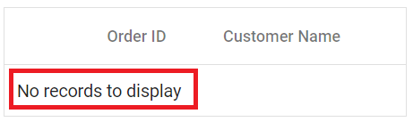
`EmptyDataSourceError` | DataSource must not be empty at initial load since columns are generated from dataSource in auto-generated columns

**Columns**

Locale key words | Text | Example 
-----|-----|-----
`True` | true | 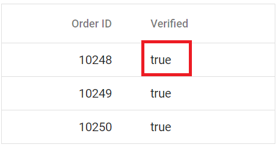
`False` | false | 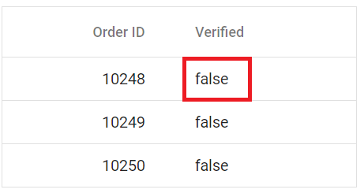
`ColumnHeader` | column header  | 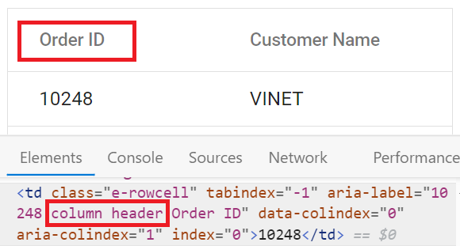
`TemplateCell` | is template cell | 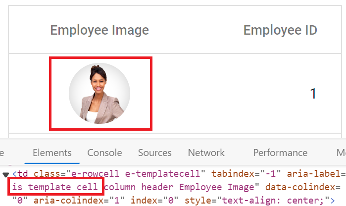
`ClipBoard` | clipboard | 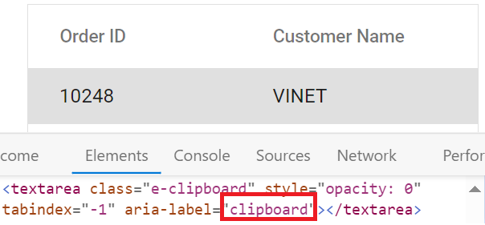
`CheckBoxLabel` | checkbox | 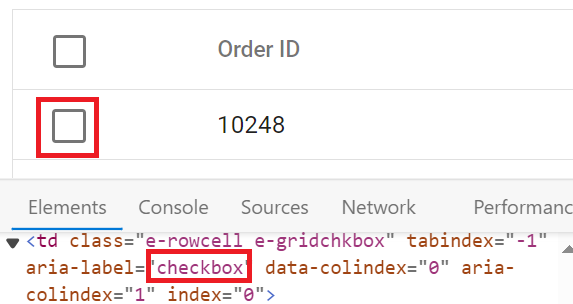

**ColumnChooser**

Locale key words | Text | Example 
-----|-----|-----
`Columnchooser` | Columns | 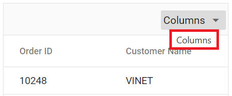
`ChooseColumns` | Choose Column | 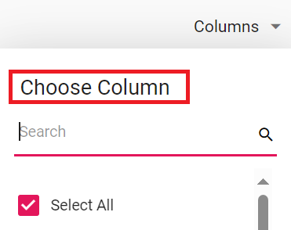
`ColumnChooserDialogARIA` | Column chooser | 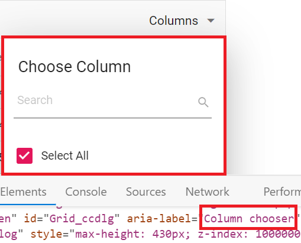

**Editing**

Locale key words | Text | Example 
-----|-----|-----
`Add` | Add | 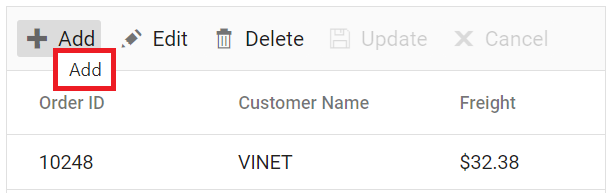
`Edit`| Edit | 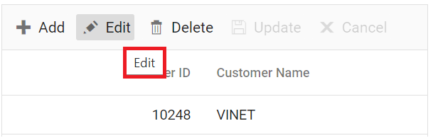
`Cancel`| Cancel | 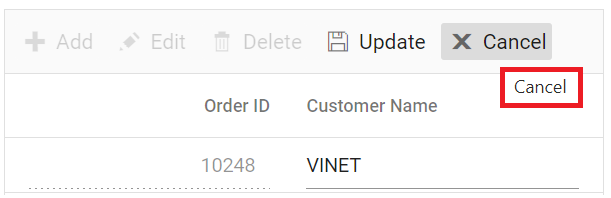
`Update`| Update | 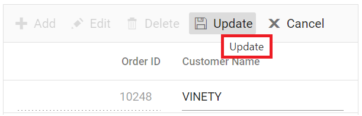
`Delete` | Delete | 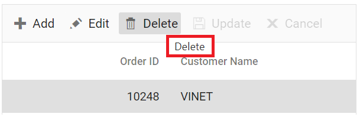
`Save` | Save | 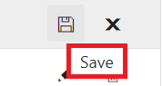
`EditOperationAlert` | No records selected for edit operation | 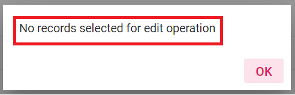
`DeleteOperationAlert` | No records selected for delete operation | 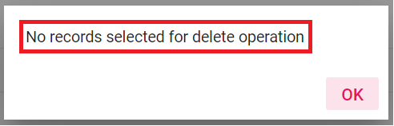
`SaveButton` | Save | 
`OKButton` | OK | 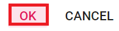
`CancelButton` | Cancel | 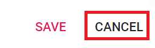
`EditFormTitle` | Details of | 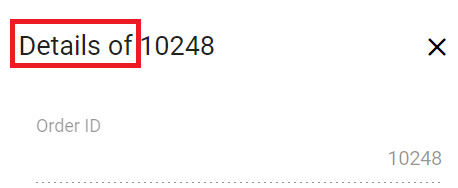
`AddFormTitle` | Add New Record | 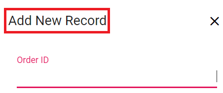
`BatchSaveConfirm` | Are you sure you want to save changes? | 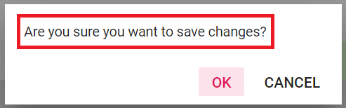
`BatchSaveLostChanges` | Unsaved changes will be lost. Are you sure you want to continue? | 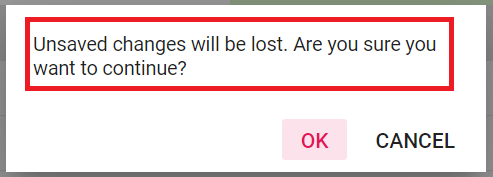
`ConfirmDelete` | Are you sure you want to Delete Record? | 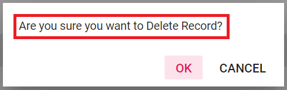
`CancelEdit` | Are you sure you want to Cancel the changes? | 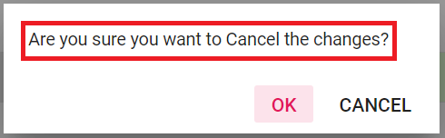
`DialogEditARIA` | Edit dialog | 
`CommandColumnAria` | Command column header  | 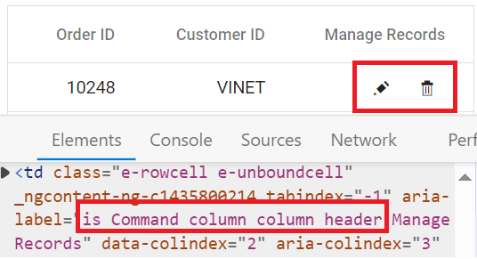
`DialogEdit` | Dialog edit | 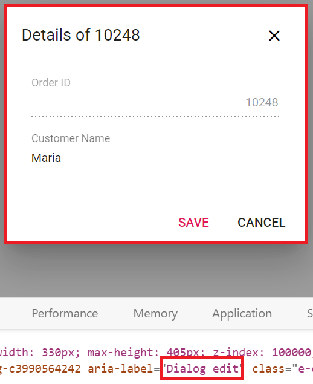

**Grouping**

Locale key words |Text | Example 
-----|-----|-----
`GroupDropArea` | Drag a column header here to group its column | 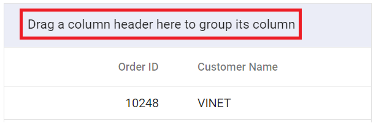
`UnGroup` | Click here to ungroup | 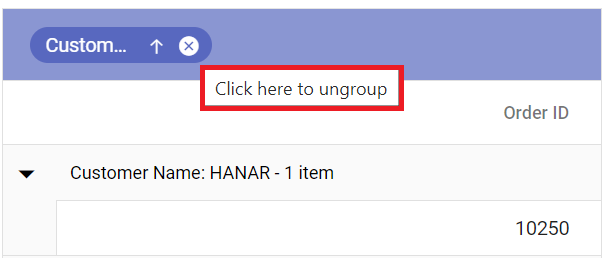
`GroupDisable` | Grouping is disabled for this column | 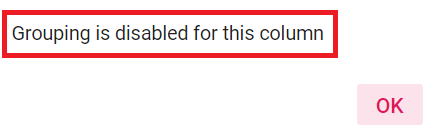
`Item` | item | 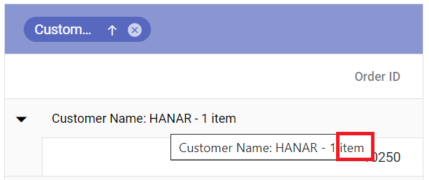
`Items` | items | 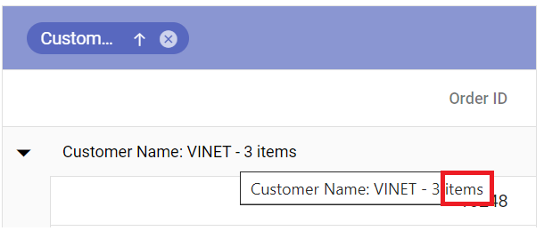
`UnGroupButton` | Click here to ungroup |
`GroupDescription` | Press Ctrl space to group | 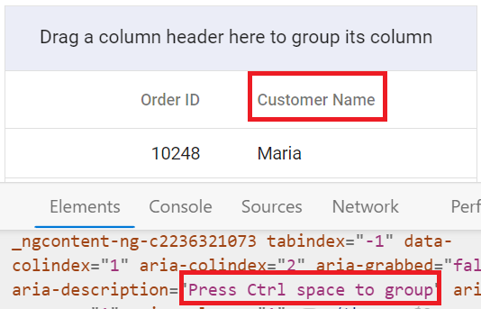
`GroupButton` | Group button | 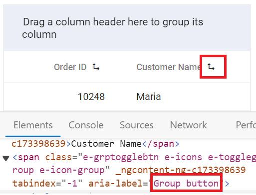
`UnGroupAria` | ungroup button | 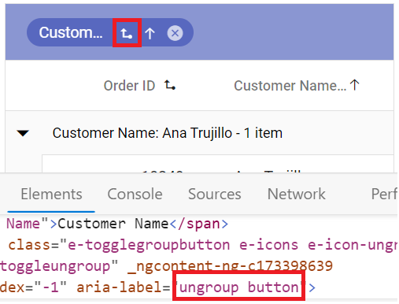
`GroupSeperator` | Separator for the grouped columns | 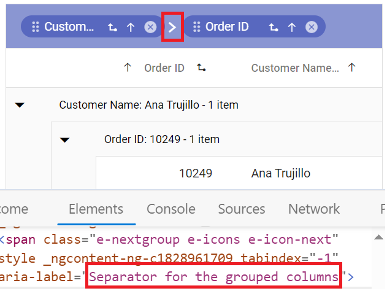
`UnGroupIcon` | ungroup the grouped column  | 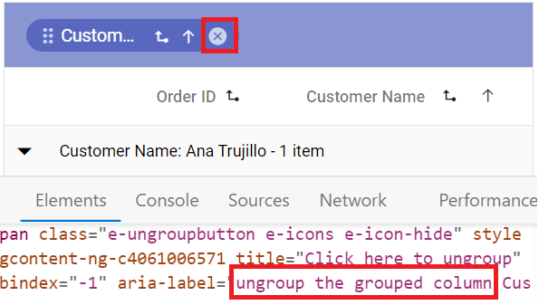
`GroupedSortIcon` | sort the grouped column  | 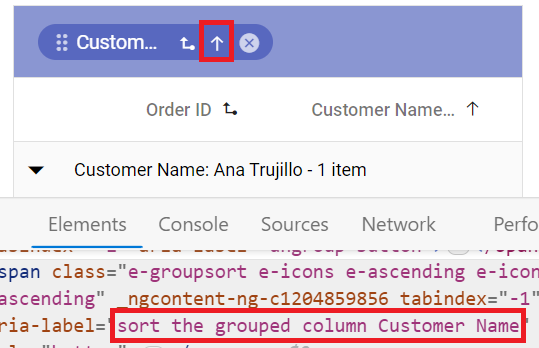
`GroupedDrag` | Drag the grouped column | 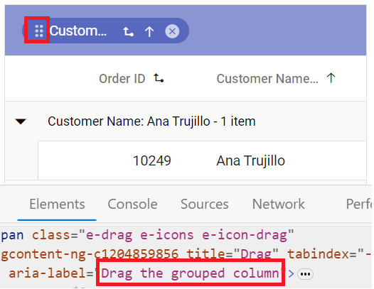
`GroupCaption` | is groupcaption cell | 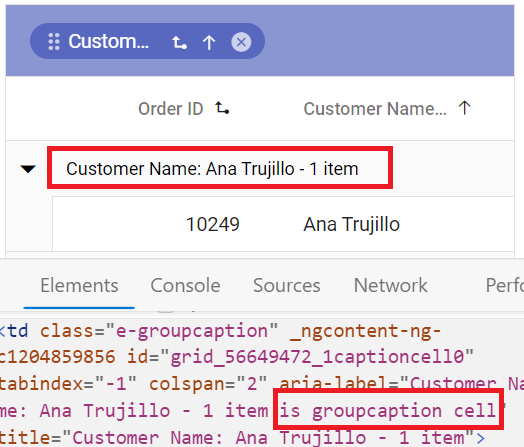
`Expanded` | Expanded | 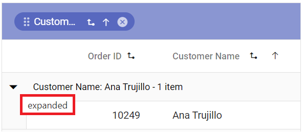
`Collapsed` | Collapsed | 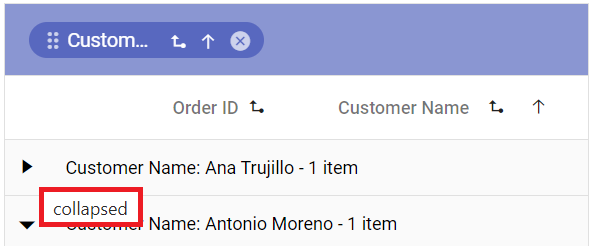

**Filtering**

Locale key words |Text | Example 
-----|-----|-----
`InvalidFilterMessage` | Invalid Filter Data
`FilterbarTitle` | Filter bar cell | 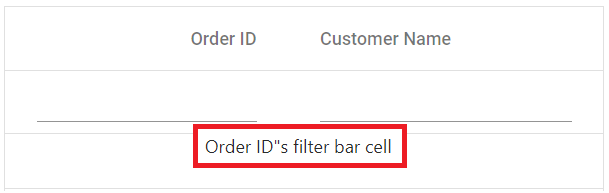
`Matchs` | No Matches Found | 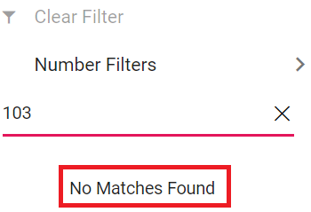
`FilterButton` | Filter | 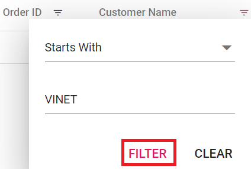
`ClearButton` | Clear | 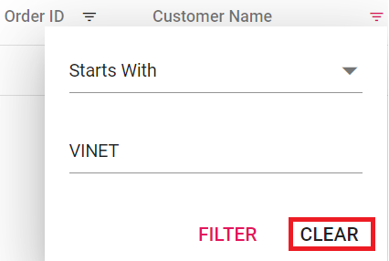
`StartsWith` | Starts With | 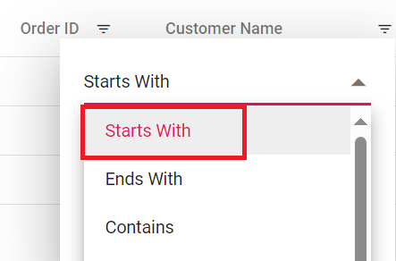
`EndsWith` | Ends With | 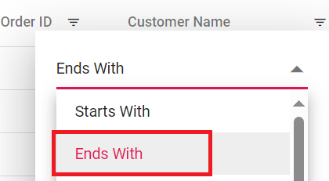
`Contains` | Contains | 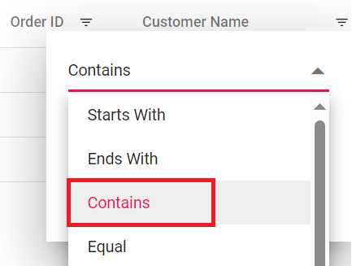
`Equal` | Equal | 
`NotEqual` | Not Equal | 
`LessThan` | Less Than | 
`LessThanOrEqual` | Less Than Or Equal | 
`GreaterThan` | Greater Than | 
`GreaterThanOrEqual` | Greater Than Or Equal | 
`ChooseDate` | Choose a Date | 
`EnterValue` | Enter the value | 
`SelectAll` | Select All | 
`Blanks` | Blanks | 
`FilterTrue` | True | 
`FilterFalse` | False | 
`NoResult` | No Matches Found | 
`ClearFilter` | Clear Filter | 
`NumberFilter` | Number Filters | 
`TextFilter` | Text Filters | 
`DateFilter` | Date Filters | 
`DateTimeFilter` | DateTime Filters | 
`MatchCase` | Match Case | 
`Between` | Between | 
`CustomFilter` | Custom Filter | 
`CustomFilterPlaceHolder` | Enter the value | 
`CustomFilterDatePlaceHolder` | Choose a date | 
`AND` | AND | 
`OR` | OR | 
`ShowRowsWhere` | Show rows where: | 
`NotStartsWith` | Does Not Start With | 
`Like` | Like | 
`NotEndsWith` | Does Not End With | 
`NotContains` | Does Not Contain | 
`IsNull` | Null | 
`NotNull` | Not Null | 
`IsEmpty` | Empty | 
`IsNotEmpty` | Not Empty | 
`AddCurrentSelection` | Add current selection to filter | 
`FilterMenuDialogARIA` | Filter menu dialog | 
`ExcelFilterDialogARIA` | Excel filter dialog | 
`CustomFilterDialogARIA` | Custom filter dialog | 
`SortAtoZ` | Sort A to Z | 
`SortZtoA` | Sort Z to A | 
`SortByOldest` | Sort by Oldest | 
`SortByNewest` | Sort by Newest | 
`SortSmallestToLargest` | Sort Smallest to Largest | 
`SortLargestToSmallest` | Sort Largest to Smallest | 
`FilterDescription` | Press Alt Down to open filter Menu | 

**Searching**

Locale key words |Text | Example 
-----|-----|-----
`Search` | Search | 
`SearchColumns` | search columns
`Clear` | Clear | 

**Sorting**

Locale key words |Text | Example 
-----|-----|-----
`Sort` | Sort | 
`SortDescription` | Press Enter to sort | 

**Toolbar**

Locale key words |Text | Example 
-----|-----|-----
`Print` | Print | 
`Pdfexport` | PDF Export | 
`Excelexport` | Excel Export | 
`Csvexport` | CSV Export | 

**ColumnMenu**

Locale key words |Text | Example 
-----|-----|-----
`FilterMenu` | Filter | 
`AutoFitAll` | Autofit all columns |
`AutoFit` | Autofit this column |
`ColumnMenuDialogARIA` | Column menu dialog | 
`ColumnMenuDescription` | Press Alt Down to open Column Menu | 

**ContextMenu**

Locale key words |Text | Example 
-----|-----|-----
`Copy` | Copy | 
`Group` | Group by this column | 
`Ungroup` | Ungroup by this column | 
`autoFitAll` | Auto Fit all columns | 
`autoFit` | Auto Fit this column | 
`Export` | Export | 
`FirstPage` | First Page | 
`LastPage` | Last Page | 
`PreviousPage` | Previous Page | 
`NextPage` | Next Page | 
`SortAscending` | Sort Ascending | 
`SortDescending` | Sort Descending | 
`EditRecord` | Edit Record | 
`DeleteRecord` | Delete Record | 

**Pager**

Locale key words |Text | Example 
-----|-----|-----
`currentPageInfo` | {0} of {1} pages | 
`totalItemsInfo` | ({0} items) | 
`firstPageTooltip` | Go to first page | 
`lastPageTooltip` | Go to last page | 
`nextPageTooltip` | Go to next page | 
`previousPageTooltip` | Go to previous page | 
`nextPagerTooltip` | Go to next pager items | 
`previousPagerTooltip` | Go to previous pager items | 
`pagerDropDown` | Items per page | 
`pagerAllDropDown` | Items | 
`All` | All | 
`totalItemInfo` | ({0} item) | 
`Container` | Pager Container | 
`Information` | Pager Information |
`ExternalMsg` | Pager external message | 
`Page` | Page  |
`Of `|  of  | 
`Pages` |  Pages |

### Loading translations for de culture

The built-in localization library supports loading translation objects for different cultures. Using the `L10n.load` function customizes the Grid's text content for different languages.

This enables specifying translation objects for specific cultures, such as "German (de)", allowing the Grid’s content to be displayed in the selected language.

**TypeScript settings for loading CLDR JSON files**

Follow the steps below to enable proper loading of CLDR JSON files(used for internationalization) in TypeScript:

1. Open **tsconfig.json** file.
2. Inside `compilerOptions` set both `resolveJsonModule` and `esModuleInterop` to `true`.

```ts
{
  compilerOptions: {
    resolveJsonModule: true,
    esModuleInterop: true,
  }
}
```

The following example demonstrates loading a translation object for "German (de)" by using `L10n.load` from the `ej2-base` module and setting the `locale` to "de-DE".














  


### Loading translations for fr cultures

Translation loading enables specifying translation objects for different cultures such as "German", "Arabic", and "French" so the grid displays content in the chosen language.

Please verify that JSON module support is enabled in **tsconfig.json** as mentioned earlier in this [guide](#loading-translations-for-de-culture).

The following example demonstrates loading a translation object for "French (fr)" by setting the `locale` to "fr-FR" and using `L10n.load` from the `ej2-base` module.













  


### Switch the different localization

The Syncfusion<sup style="font-size:70%">&reg;</sup> Angular Data Grid supports switching localization between cultures, allowing dynamic changes based on application requirements.

Switching localization requires the following steps:

**Step 1:** Import and load the required CLDR (Common Locale Data Repository) data for the desired culture using the `loadCldr` function.

```ts
loadCldr(
  caGregorian,
  currencies,
  numbers,
  timeZoneNames,
  numberingSystems
);
```
**Step 2:** Please verify that JSON module support is enabled in **tsconfig.json** as mentioned earlier in this [guide](#loading-translations-for-de-culture).

**Step 3:** Change the default culture and currency code using the `setCulture` and `setCurrencyCode` methods.

An example demonstrates switching to the "French" culture and setting the currency code to "EUR" via external button clicks. 













  


### Set different locale text for two Grids in same page

The Syncfusion<sup style="font-size:70%">&reg;</sup> Angular Data Grid allows configuring different [locale](https://ej2.syncfusion.com/angular/documentation/api/grid#locale) settings for multiple Grids displayed on the same page. By using the `L10n.load` function to define translations for specific languages so each Grid applies the appropriate localized text for headers, toolbar items, and action buttons.

For example, one Grid can use the "fr-FR" locale to display "French" text, while another Grid uses "en-US" and keeps the default "English" text. This shows that each Grid can have its own localization without affecting the others

## Internationalization

The [Internationalization](https://ej2.syncfusion.com/angular/documentation/common/globalization/internationalization) library provides localized formatting for number, date, and time values in the Grid based on language and region.

`Internationalization` enables globalization of number, date, and time values using format strings defined in the [format](https://ej2.syncfusion.com/angular/documentation/api/grid/column#format) property.

This ensures that the Grid component uses the correct format strings for number, date, and time values based on the selected culture.













  


> * In the above sample, the "Freight" column is formatted using [NumberFormatOptions](https://ej2.syncfusion.com/angular/documentation/common/globalization/internationalization#manipulating-numbers).
> * By default, the [locale](https://ej2.syncfusion.com/angular/documentation/api/grid#locale) value is "en-US". Change the `locale` property to use a different culture.

## Right-to-Left - RTL

The Right-to-Left (RTL) feature switches text direction and layout from left-to-right to right-to-left. This feature is especially beneficial for interacting with the grid in languages that are written and read from right to left, such as "Arabic", "Farsi", "Urdu", and others. Enabling RTL significantly improves the experience and accessibility for such languages.

Enable RTL by setting the [enableRtl](https://ej2.syncfusion.com/angular/documentation/api/grid#enablertl) property to `true`. This adjusts the Grid's text direction and layout for right-to-left languages.

Please verify that JSON module support is enabled in **tsconfig.json** as mentioned earlier in this [guide](#loading-translations-for-de-culture).

The example below adds an [EJ2 Toggle Switch Button](https://ej2.syncfusion.com/angular/documentation/switch/getting-started) to enable or disable RTL for the "Arabic (ar-AE)" locale. When toggled, the [change](https://ej2.syncfusion.com/angular/documentation/api/switch/index-default#change) event updates the grid's `enableRtl` property.













  


## See Also

* [Internationalization](https://ej2.syncfusion.com/angular/documentation/common/globalization/internationalization)
* [Localization](https://ej2.syncfusion.com/angular/documentation/common/globalization/localization)
* [Apply Grid localization using external JSON file in Angular](https://www.syncfusion.com/forums/144844/apply-grid-localization-from-external-json-file-in-angular-grid)

