# Hierarchy grid in Angular Grid component

The Hierarchy Grid in an Angular Grid component displays hierarchical data in a tabular format with expandable and collapsible rows. This feature represents parent and child relationships within the grid, making it easier to navigate and understand structured data with multiple levels.

This feature is enabled by utilizing the [childGrid](https://ej2.syncfusion.com/angular/documentation/api/grid/#childgrid) and [childGrid.queryString](https://ej2.syncfusion.com/angular/documentation/api/grid/#querystring) properties of the grid component.

To enable the Hierarchy Grid feature:

1. Inject the **DetailRowService** in the provider section of your **AppModule**. This service is essential for handling the hierarchy grid functionality.

2. Define the `childGrid` property within the Grid component configuration. This property describes the complete configuration options of the child grid.

3. Specify the `childGrid.queryString` property to establish the relationship between the parent and child grids and visualize the data in a hierarchical structure. This property determines how child records are fetched based on the parent record's key field value.

The following example demonstrates how to enable the hierarchy feature in the grid










  


> * Grid supports n levels of child grids for complex hierarchical data structures.
> * Hierarchical binding is not supported when [DetailTemplate](https://ej2.syncfusion.com/angular/documentation/api/grid/#detailtemplate) is enabled.
> * In Syncfusion Grid component, searching operates independently for parent and child grids. Searching within the parent grid filters only parent records, and similarly, searching within the child grid filters only child records. The component does not support simultaneous searching across both parent and child grids.

## Bind hierarchy grid with different field

By default, the parent and child grids use the same field name to map and render a hierarchical grid. However, the component supports establishing a parent-child relationship between grids with different field names. This feature is beneficial when creating a parent-child relationship between grids while using distinct field names for data mapping. This allows for flexible establishment of the desired relationship between parent and child grids, even with different field names for data mapping.

By default, the parent and child grid relationship is maintained using the [queryString](https://ej2.syncfusion.com/angular/documentation/api/grid/#querystring) property, which requires the same field name for both grids. However, to achieve the parent and child relationship with different fields, modify the mapping value in the [load](https://ej2.syncfusion.com/angular/documentation/api/grid/#load) event of the child grid. 

In the following example, the `load` event is utilized to customize the mapping value for the child grid. By accessing the `parentDetails` property and its **parentKeyFieldValue**, the desired mapping value can be set. The `parentRowData` property contains the data of the parent row, and by using the **EmployeeID** field name, the corresponding value can be extracted from the parent row data.










  


> Make sure to adjust the field name according to the specific data structure and requirements.

## Expand child grid initially

Expanding the child grid initially in the Syncfusion Angular Grid component provides immediate visibility into hierarchical data without requiring manual expansion of each child row. This approach enhances data visibility and improves the overall experience upon grid load.

To achieve this, use the [expand](https://ej2.syncfusion.com/angular/documentation/api/grid/detailRow/#expand) method with the desired target index (number) in the [dataBound](https://ej2.syncfusion.com/angular/documentation/api/grid/#databound) event of the grid. 

In the provided example, the third record of the grid is expanded by utilizing the `expand` method within the `dataBound` event.










  


> Index values begin with **"0"**, allowing specification of the desired target index to expand a specific child grid initially.

## Dynamically load child grid data

Dynamically loading child grid data in the Syncfusion Angular Grid improves performance, optimizes data transmission, and enables on-demand access to relevant information. This approach also adds flexibility in data presentation, enhancing the overall efficiency of the application.

To dynamically load the `dataSource` of a child grid in the Grid, utilize the [load](https://ej2.syncfusion.com/angular/documentation/api/grid/#load) event of the parent grid. This event allows customization of the loading behavior of the child grid based on the data of the parent grid.

The following example demonstrates how to dynamically load child grid data using the `load` event.










  


## Dynamically bind data to child grid based on parent row data

Dynamically binding data to a child grid based on the parent row data in the Syncfusion Angular Grid component is useful when displaying child grid data that is specific to each parent row. This feature allows for a dynamic and contextual representation of data within the child grid.

To dynamically bind data to the child grid based on the parent row data instead of using the [queryString](https://ej2.syncfusion.com/angular/documentation/api/grid/#querystring) property, utilize the [detailDataBound](https://ej2.syncfusion.com/angular/documentation/api/grid/#detaildatabound) event of the grid. This event is triggered when expanding the child grid.

In the `detailDataBound` event handler, the child grid's dataSource can be filtered based on the **EmployeeID** column value of the parent row data. This can be achieved by using the `DataManager` plugin and applying a filter to the child grid's dataSource. The filtered data can be assigned as the new dataSource for the child grid. This can be demonstrated by the following sample.










  


## Adding record in child grid

Adding a record in a child grid within the Syncfusion Angular Grid component is useful when providing the ability to add new records to the child grid. This feature allows input and saving of additional data specific to each parent row.

To maintain the parent-child relationship in the Grid when adding a record to the child grid, set the value for the `queryString` in the added data. This can be done using the [actionBegin](https://ej2.syncfusion.com/angular/documentation/api/grid/#actionbegin) event.

In the following example, the parent and child grids are related by the **EmployeeID** field. To add a new record in the child grid, the **EmployeeID** field needs to be set with the value of the parent record's `queryString` in the `actionBegin` event. 










  


## Template column in child grid

A template column in a child grid within the Syncfusion Angular Grid component is valuable when customizing the appearance and functionality of specific columns in the child grid. It is useful for incorporating interactive elements, custom formatting, or complex data representation within specific columns of the child grid.

To achieve this, utilize the [template](https://ej2.syncfusion.com/angular/documentation/api/grid/column/#template) property of a column to display a custom element instead of a field value in the Grid. Template columns defined in the child grid will be null in the **ngOnInit** method, which means they will not be shown in the UI. They will be rendered after the entire HTML view rendering process, and can be accessed and utilized in the **ngAfterViewInit** method to display the template columns in the child grid.

During the [load](https://ej2.syncfusion.com/angular/documentation/api/grid/#load) event of the child grid, it is necessary to set the 'registeredTemplate' to empty. This action will remove any previously existing templates. By doing so, templates can be dynamically applied to the grid's cells based on different conditions or requirements.

The following example demonstrates how to show a custom image in the **Employee Image** column of the child grid by utilizing the `template` property of the column.




import { NgModule } from '@angular/core'
import { BrowserModule } from '@angular/platform-browser'
import { GridModule } from '@syncfusion/ej2-angular-grids'
import { PageService, SortService, FilterService, GroupService,DetailRowService } from '@syncfusion/ej2-angular-grids'


import { Component, OnInit, ViewChild, ViewContainerRef, Inject, AfterViewInit } from '@angular/core';
import { data, employeeData } from './datasource';

@Component({
imports: [
        
        GridModule
    ],

providers: [PageService,
        SortService,
        FilterService,
        GroupService,DetailRowService],
standalone: true,
    selector: 'app-root',
    template: `<ejs-grid [dataSource]='parentData' height='315px' [childGrid]='childGrid'>
                    <e-columns>
                        <e-column field='EmployeeID' headerText='Employee ID' textAlign='Right' width=80></e-column>
                        <e-column field='FirstName' headerText='FirstName' width=100></e-column>
                        <e-column field='LastName' headerText='Last Name' width=100></e-column>
                        <e-column field='City' headerText='City' width=100></e-column>
                    </e-columns>
                </ejs-grid>
                <ng-template #childtemplate let-data>
                    <div class="image">
                        
                    </div>
                </ng-template>`,
})
export class AppComponent implements OnInit, AfterViewInit {

    constructor(@Inject(ViewContainerRef) private viewContainerRef?: ViewContainerRef) {

    }
    public parentData?: object[];
    @ViewChild('childtemplate' , { static: true }) public childtemplate?: any;
    public childGrid?: any;

    ngAfterViewInit() {
        this.childtemplate.elementRef.nativeElement._viewContainerRef = this.viewContainerRef;
        this.childtemplate.elementRef.nativeElement.propName = 'template';
    }

    ngOnInit(): void {
        this.parentData = employeeData;
        this.childGrid = {
            dataSource: data,
            queryString: 'EmployeeID',
            load() {
                this.registeredTemplate = {};   // set registerTemplate value as empty in load event
            },
            columns: [
                { headerText: 'Employee Image', textAlign: 'Center', template: this.childtemplate, width: 120 },
                { field: 'OrderID', headerText: 'Order ID', textAlign: 'Right', width: 90 },
                { field: 'CustomerID', headerText: 'Customer ID', width: 100 },
                { field: 'ShipCity', headerText: 'Ship City', width: 100 },
                { field: 'ShipName', headerText: 'Ship Name', width: 120 }
            ],
        };
    }
}







  


## How to get parent details in child grid

Getting parent details in a child grid in an Angular Grid component is useful when displaying and utilizing information from the parent row within the child grid. This can be beneficial in scenarios where additional context is needed or calculations are performed based on the parent row's data.

To achieve this, utilize the [created](https://ej2.syncfusion.com/angular/documentation/api/grid/#created) event. This event is triggered when the child grid is created and can be used to handle the child grid initialization.

The following example demonstrates how to obtain parent details in a child grid using the `created` event. Within the `created` event, the parent row data can be accessed using `this.parentDetails.parentRowData` and the desired details can be displayed in the message.










  


## Render aggregates in child grid

The Aggregates feature in the Syncfusion Angular Grid component allows displaying aggregate values in the footer, group footer, and group caption of the child grid. With this feature, calculations can be easily performed on specific columns and summary information can be shown. 

Rendering aggregates in a child grid involves displaying summary data at the footer or group caption of the grid. This can be particularly useful in hierarchical grids where each child grid represents detailed data that needs to be summarized.

The following example demonstrates how to render aggregates in a child grid to display the sum and maximum values of the **Freight** column.












## Expand all by external button

The Hierarchy Grid in the Syncfusion Angular Grid component allows expanding all child grid rows using an external button. This feature provides a convenient overview of all the hierarchical data within the grid, eliminating the need to manually expand each row individually.

By default, Grid renders all child grid rows in collapsed state. To expand all child grid rows in the Grid using an external button, utilize the [expandAll](https://ej2.syncfusion.com/angular/documentation/api/grid/detailRow/#expandall) method provided by the DetailRow module. Similarly, to collapse all grid rows, use the [collapseAll](https://ej2.syncfusion.com/angular/documentation/api/grid/detailRow/#collapseall) method. 

The following example demonstrates how to expand and collapse the hierarchy grid using an external button click function.










  


> The `expandAll` and `collapseAll` methods are not recommended for large datasets due to the considerable time required to update the changes in the UI.

## Customize hierarchy grid icons

The default expand/collapse icons in the Hierarchy Grid of Syncfusion Grid component can be customized using custom CSS, allowing modification of their visual representation. To achieve this, add the following CSS to the index.html file:

```
    .e-grid .e-icon-grightarrow::before,
    .e-grid-menu .e-icon-grightarrow::before {
    content: '\e85f';
    }
    .e-grid .e-icon-gdownarrow::before,
    .e-grid-menu .e-icon-gdownarrow::before {
    content: '\e83f';
    }

```

In the demo below, the expand/collapse icons have been changed to arrow-down and arrow-right icons.










  


## Hide the expand/collapse icon in parent row when no record in child grid

The Syncfusion Angular Grid allows hiding the expand/collapse icon in the parent row when there are no records in the child grid. However, in certain scenarios, hiding the expand/collapse icon for parent rows that do not have any child records provides a cleaner and more intuitive interface by eliminating unnecessary icons in empty parent rows.

To achieve this, utilize the [rowDataBound](https://ej2.syncfusion.com/angular/documentation/api/grid/#rowdatabound) event to hide the icon when there are no records in the child grid.

To hide the expand/collapse icon in parent row when no records in child grid, follow the given steps:

1. **Create a CSS Class with Custom Style**: Define a CSS class that overrides the default appearance of the Grid. This class will be used to customize the background color of the parent row when it is selected and when hovering over rows.

```css
    .e-row[aria-selected="true"] .e-customizedexpandcell {
        background-color: #e0e0e0;
    }

    .e-grid.e-gridhover tr[role='row']:hover {
        background-color: #eee;
    }
```

2. **Implement the rowDataBound Event Handler:** This event is triggered for each row in the grid when data is bound, allowing customization of the row's appearance and behavior. In the provided code, the handler checks if the current row has any child records associated with it. If not, it hides the content of the first element, which contains the expand/collapse icon, and applies a custom CSS class (e-customizedexpandcell) to modify its appearance.

```typescript
    public rowDataBound(args: RowDataBoundEventArgs) {
        const parentData: number = (args.data as Employee)['EmployeeID'];
        const childrecord: object[] = new DataManager(childData as JSON[]).
            executeLocal(new Query().where('EmployeeID', 'equal', parentData, true));
        if (childrecord.length === 0) {
            // Here hide which parent row has no child records
            const rowElement = args.row as HTMLTableRowElement;
            const cellElement= rowElement.querySelector('td') as HTMLTableCellElement
            cellElement.innerHTML = ' '; 
            cellElement.className = 'e-customizedexpandcell';
        }
    }
```

The following example demonstrates how to hide the expand/collapse icon in the row with **EmployeeID** as **1**, which does not have record in child Grid.










  


## Customize the child grid

The Syncfusion Angular Grid component offers various ways to customize the child grid appearance using both default CSS and custom themes. To access the child grid elements, use the **.e-detailcell** class selector, which targets the child grid.

### Header

The appearance of the header elements in the child grid can be customized using CSS. Here are examples of how to customize the child grid header, header cell, and header cell div element.

**Customizing the child grid header**

To customize the appearance of the child grid header root element, use the following CSS code:

```css
.e-detailcell .e-grid .e-headercontent{
    border: 2px solid green;
}
```
In this example, the **.e-detailcell** class targets the child grid and **.e-headercontent** targets its header root element. The `border` property can be modified to change the style of the header border. This customization allows overriding the thin line between the header and content of the child grid.

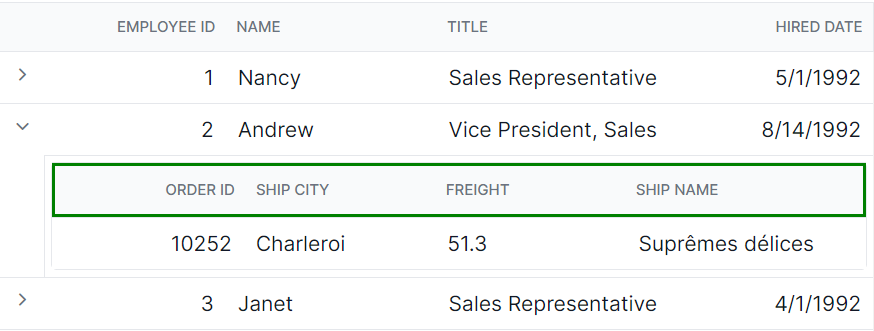

**Customizing the child grid header cell**

To customize the appearance of the grid header cell elements, use the following CSS code:

```css
.e-detailcell .e-grid .e-headercontent .e-headercell{
    color: #ffffff;
    background-color: #1ea8bd;
}
```
In this example, the **.e-headercell** class targets the header cell elements. The `color` and `background-color` properties can be modified to change the text color and background of the child grid's header cells.

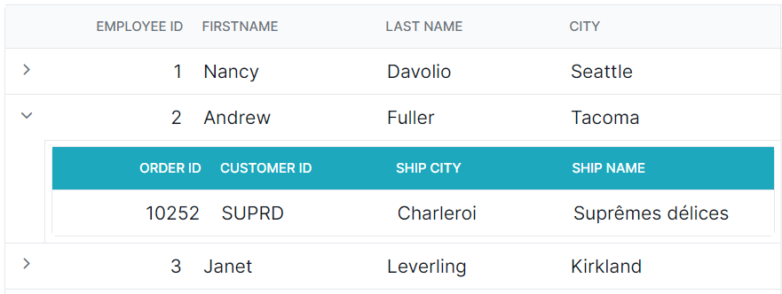

**Customizing the child grid header cell div element**

To customize the appearance of the child grid header cell div element, use the following CSS code:

```css
.e-detailcell .e-grid .e-headercelldiv {
    font-size: 15px;
    font-weight: bold;
    color: darkblue;
}
```
In this example, the **.e-headercelldiv** class targets the div element within the header cell of the child grid. The `font-size`, `font-weight`, `color` properties can be modified to change the font size, font-weight and color of the header text content.

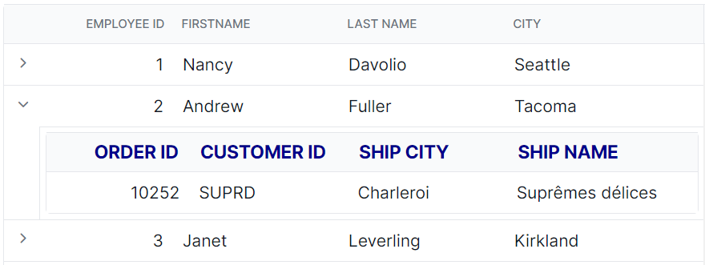

### Paging

The appearance of the paging elements in the child grid can be customized using CSS. Here are examples of how to customize the pager root element, pager container element, pager navigation elements, pager page numeric link elements, and pager current page numeric element of the child grid.

**Customizing the child grid pager root element**

To customize the appearance of the child grid pager root element, use the following CSS code:

```css
.e-detailcell .e-grid  .e-gridpager {
    font-family: cursive;
    background-color: #deecf9;
}
```
In this example, the **.e-detailcell** class targets the child grid and the **.e-gridpager** class targets the pager root element. The `font-family` can be modified to change the font family and `background-color` property can be modified to change the background color of the pager.

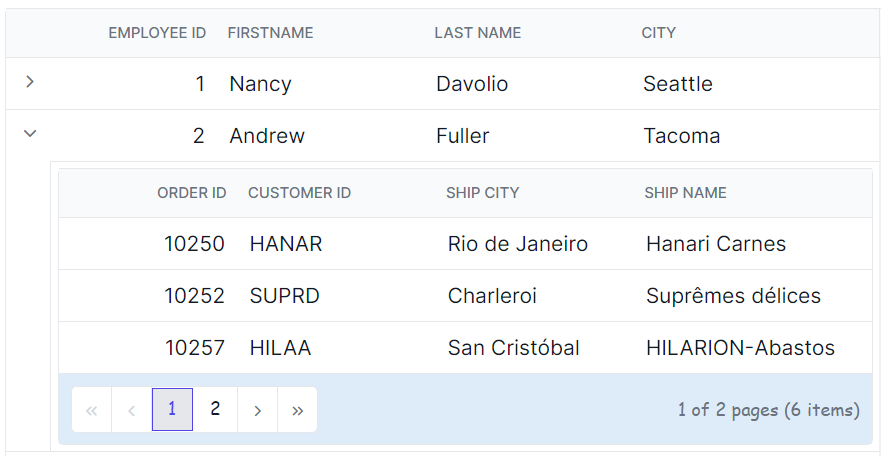

**Customizing the child grid pager container element**

To customize the appearance of the child grid pager container element, use the following CSS code:

```css
.e-detailcell .e-grid .e-pagercontainer {
    border: 2px solid #00b5ff;
    font-family: cursive;
}
```

In this example, the **.e-pagercontainer** class targets the pager container element. The `border` property and `font-family` property can be modified to change the border color and font family of the pager container.

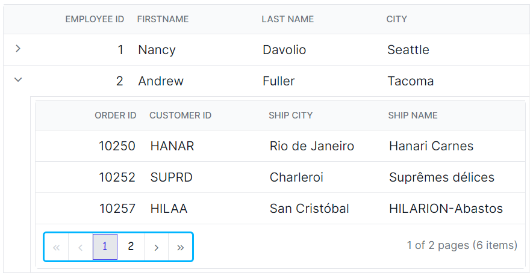

**Customizing the child grid pager navigation elements**

To customize the appearance of the child grid pager navigation elements, use the following CSS code:

```css
.e-detailcell .e-grid .e-gridpager .e-prevpagedisabled,
.e-detailcell .e-grid .e-gridpager .e-prevpage,
.e-detailcell .e-grid .e-gridpager .e-nextpage,
.e-detailcell .e-grid .e-gridpager .e-nextpagedisabled,
.e-detailcell .e-grid .e-gridpager .e-lastpagedisabled,
.e-detailcell .e-grid .e-gridpager .e-lastpage,
.e-detailcell .e-grid .e-gridpager .e-firstpage,
.e-detailcell .e-grid .e-gridpager .e-firstpagedisabled {
    background-color: #deecf9;
}
```

In this example, the classes **.e-prevpagedisabled, .e-prevpage, .e-nextpage, .e-nextpagedisabled, .e-lastpagedisabled, .e-lastpage, .e-firstpage,** and **.e-firstpagedisabled** target the various pager navigation elements of the child grid. The `background-color` property can be modified to change the background color of these elements.

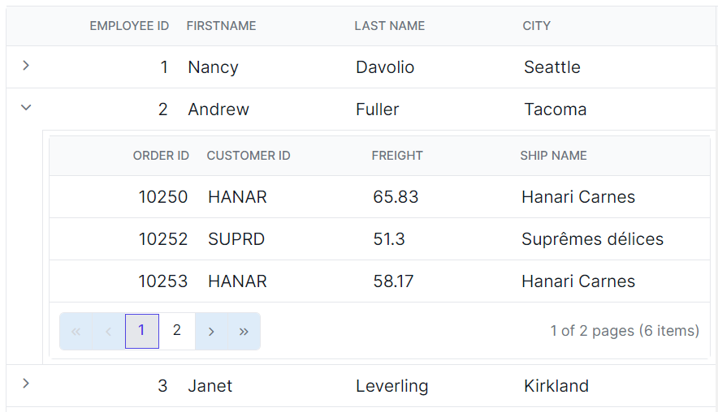

**Customizing the child grid pager page numeric link elements**

To customize the appearance of the child grid pager current page numeric link elements, use the following CSS code:

```css
.e-detailcell .e-grid .e-gridpager .e-numericitem {
    background-color: #5290cb;
    color: #ffffff;
    cursor: pointer;
}

.e-detailcell .e-grid .e-gridpager .e-numericitem:hover {
    background-color: white;
    color: #007bff;
}
```

In this example, the **.e-numericitem** class targets the page numeric link elements. The `background-color`, `color` properties can be modified to change the background color and text color of these elements.

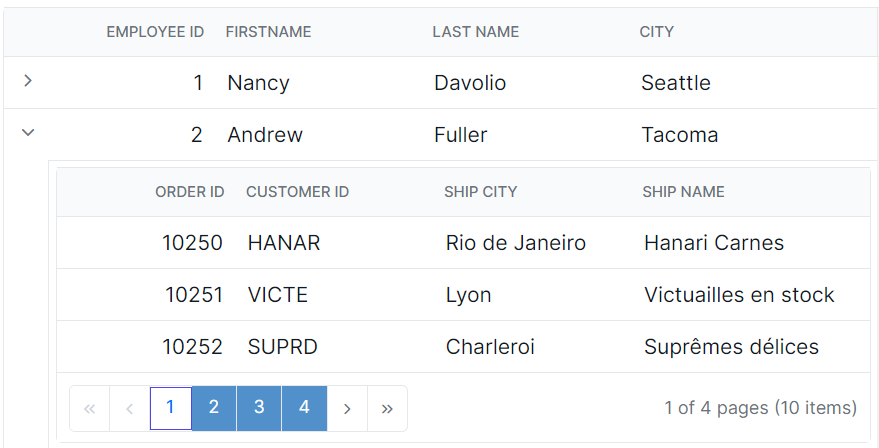

**Customizing the child grid pager current page numeric element**

To customize the appearance of the child grid pager current page numeric element, use the following CSS code:

```css
.e-detailcell .e-grid .e-gridpager .e-currentitem {
    background-color: #0078d7;
    color: #fff;
}
```

In this example, the **.e-currentitem** class targets the current page numeric item. The `background-color` property can be modified to change the background color of this element and `color` property can be modified to change the text color.

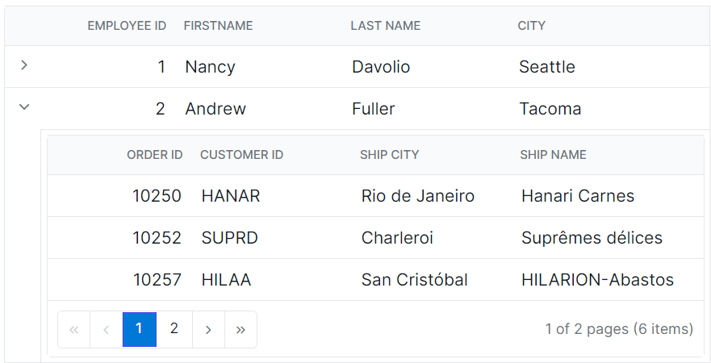

### Sorting

The appearance of the sorting icons and multi sorting icons in the child grid can be customized using CSS. The available Syncfusion [icons](https://ej2.syncfusion.com/angular/documentation/appearance/icons#material) based on the theme can be used. Here's how to do it:

**Customizing the child grid sorting icon**

To customize the sorting icon that appears in the child grid header when sorting is applied, use the following CSS code:

```css
.e-detailcell .e-grid .e-icon-ascending::before {
    content: '\e7a3';
    /* Icon code for ascending order */
}

.e-detailcell .e-grid .e-icon-descending::before {
    content: '\e7b6';
    /* Icon code for descending order */
}
```
In this example, the **.e-detailcell** class targets the child grid and the **.e-icon-ascending::before** class targets the sorting icon for ascending order, and the **.e-icon-descending::before** class targets the sorting icon for descending order.

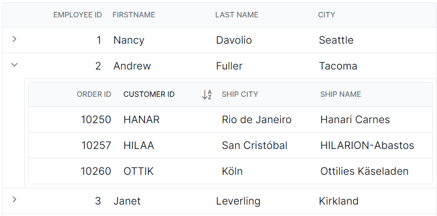

**Customizing the child grid multi sorting icon**

To customize the multi sorting icon that appears in the child grid header when multiple columns are sorted, use the following CSS code:

```css
.e-detailcell .e-grid .e-sortnumber {
    background-color: #deecf9;
    font-family: cursive;
}
```

In this example, the **.e-sortnumber** class targets the background color and font family of the multi sorting icon. The `background-color` and `font-family` properties can be modified to customize the appearance of the multi sorting icon.

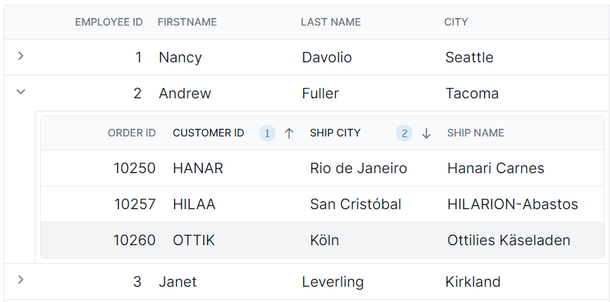

### Filtering

The appearance of filtering elements in the child grid can be customized using CSS. Below are examples of how to customize various filtering elements, including filter bar cell elements, filter bar input elements, focus styles, clear icons, filter icons, filter dialog content, filter dialog footer, filter dialog input elements, filter dialog button elements, and Excel filter dialog number filters.

**Customizing the child grid filter bar cell element**

To customize the appearance of the filter bar cell element in the child grid header, use the following CSS code:

```css
.e-detailcell .e-grid .e-filterbar .e-filterbarcell {
  background-color: #045fb4;
}

```
In this example, the **.e-detailcell** class targets the child grid and the **.e-filterbarcell** class targets the filter bar cell element in the child grid header. The `background-color` property can be modified to change the color of the filter bar cell element.

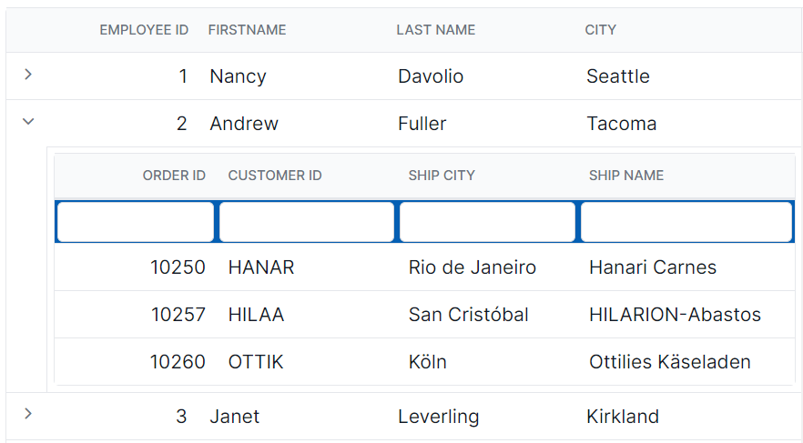

**Customizing the child grid filter bar input element**

To customize the appearance of the filter bar input element in the child grid header, use the following CSS code:

```css
.e-detailcell .e-grid .e-filterbarcell .e-input-group input.e-input{
    font-family: cursive;
}
```
In this example, the **.e-filterbarcell** class targets the filter bar cell element, and the **.e-input** class targets the input element within the cell. The `font-family` property can be modified to change the font of the filter bar input element.

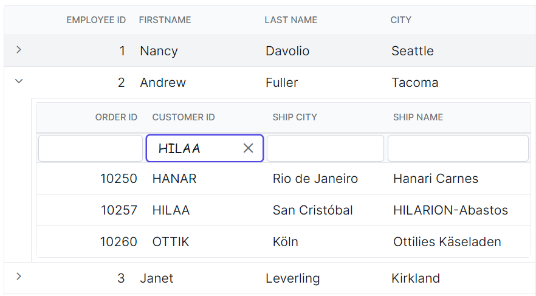

**Customizing the child grid filter bar input focus**

To customize the appearance of the child grid's filter bar input element's focus highlight, use the following CSS code:

```css
.e-detailcell .e-grid .e-filterbarcell .e-input-group.e-input-focus{
    background-color: #deecf9;
}
```
In this example, the **.e-filterbarcell** class targets the filter bar cell element, and the **.e-input-group.e-input-focus** class targets the focused input element. The `background-color` property can be modified to change the color of the focus highlight.

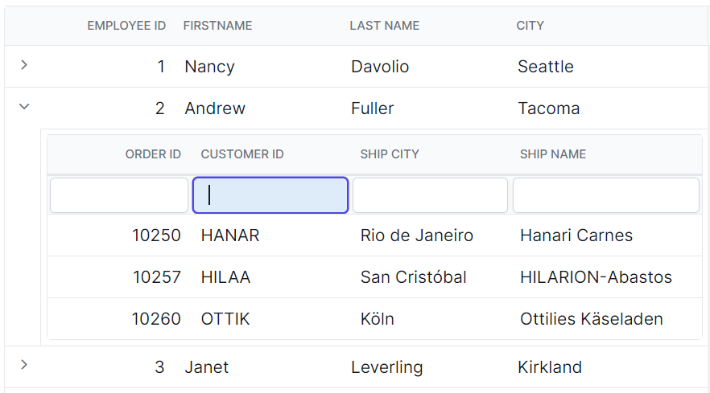

**Customizing the child grid filter bar input clear icon**

To customize the appearance of the child grid's filter bar input element's clear icon, use the following CSS code:

```css
.e-detailcell .e-grid .e-filterbarcell .e-input-group .e-clear-icon::before {
    content: '\e72c';
}
```
In this example, the **.e-clear-icon** class targets the clear icon element within the input group. The `content` property can be modified to change the icon displayed.

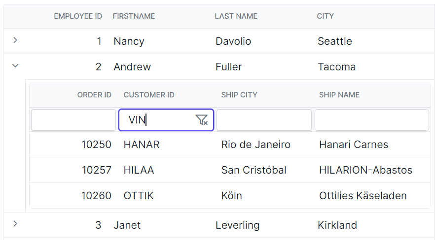

**Customizing the child grid filtering icon**

To customize the appearance of the filtering icon in the child grid header, use the following CSS code:

```css
.e-detailcell .e-grid .e-icon-filter::before{
    content: '\e81e';
}
```
In this example, the **.e-icon-filter** class targets the filtering icon element. The `content` property can be modified to change the icon displayed.

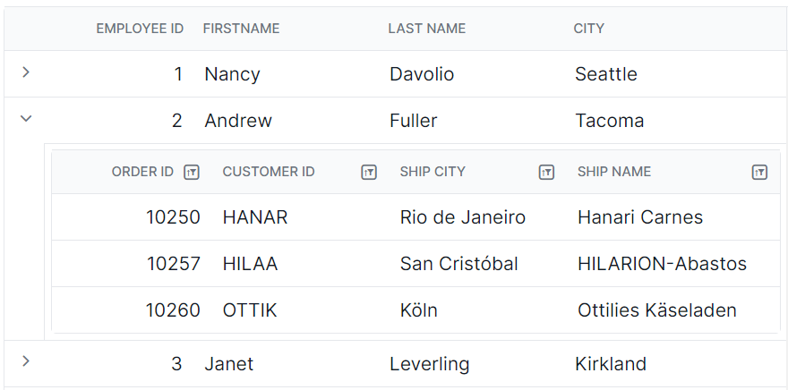

**Customizing the child grid filter dialog content**

To customize the appearance of the child grid's filter dialog's content element, use the following CSS code:

```css
.e-detailcell .e-grid .e-filter-popup .e-dlg-content {
    background-color: #deecf9;
}
```
In this example, the **.e-filter-popup .e-dlg-content** classes target the content element within the filter dialog. The `background-color` property can be modified to change the color of the dialog's content.

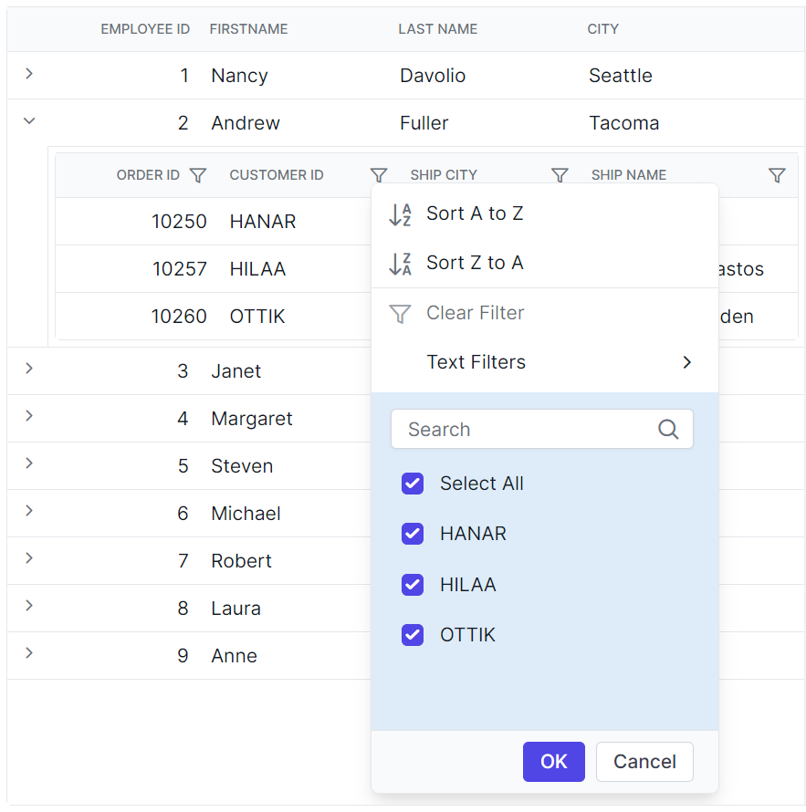

**Customizing the child grid filter dialog footer**

To customize the appearance of the child grid's filter dialog's footer element, use the following CSS code:

```css
.e-detailcell .e-grid .e-filter-popup .e-footer-content {
    background-color: #deecf9;
}
```
In this example, the **.e-filter-popup .e-footer-content** classes target the footer element within the filter dialog. The `background-color` property can be modified to change the color of the dialog's footer.

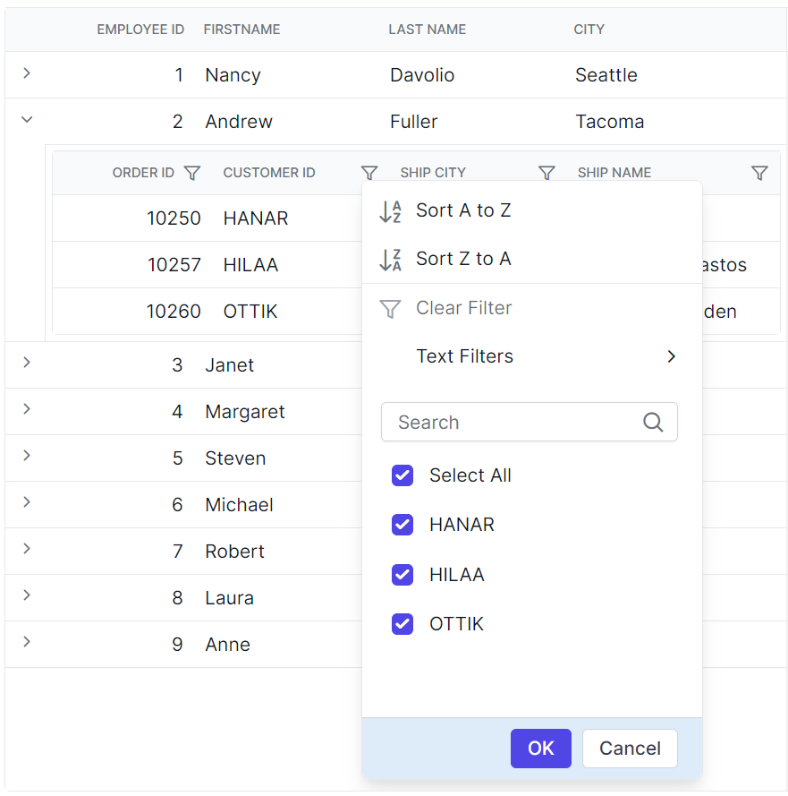

**Customizing the child grid filter dialog input element**

To customize the appearance of the child grid's filter dialog's input elements, use the following CSS code:

```css
.e-detailcell .e-grid .e-filter-popup .e-input-group input.e-input{
    font-family: cursive;
}
```
In this example, the **.e-filter-popup** class targets the filter dialog, and the **.e-input** class targets the input elements within the dialog. The `font-family` property can be modified to change the font of the input elements.

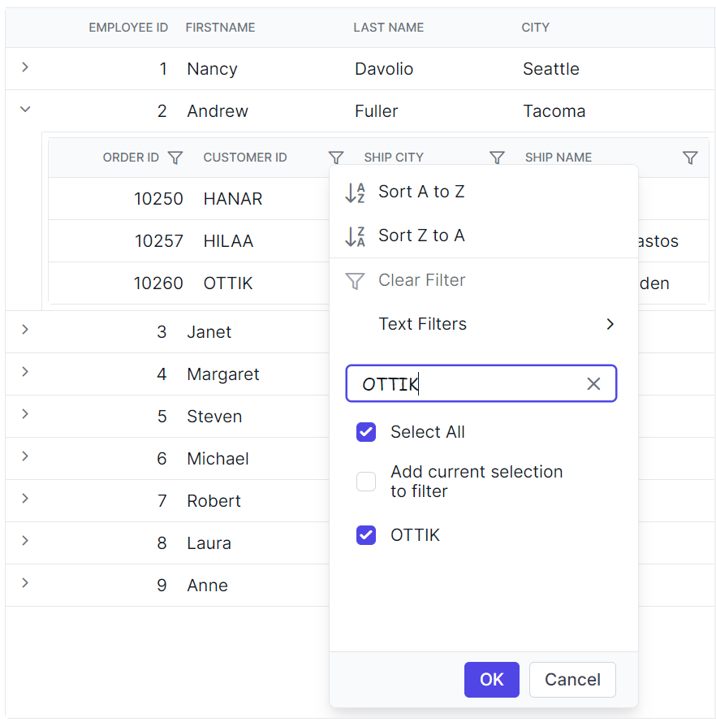

**Customizing the child grid filter dialog button element**

To customize the appearance of the child grid's filter dialog's button elements, use the following CSS code:

```css
.e-detailcell .e-grid .e-filter-popup .e-btn{
    font-family: cursive;
}
```
In this example, the **.e-filter-popup** class targets the filter dialog, and the **.e-btn** class targets the button elements within the dialog. The `font-family` property can be modified to change the font of the button elements.

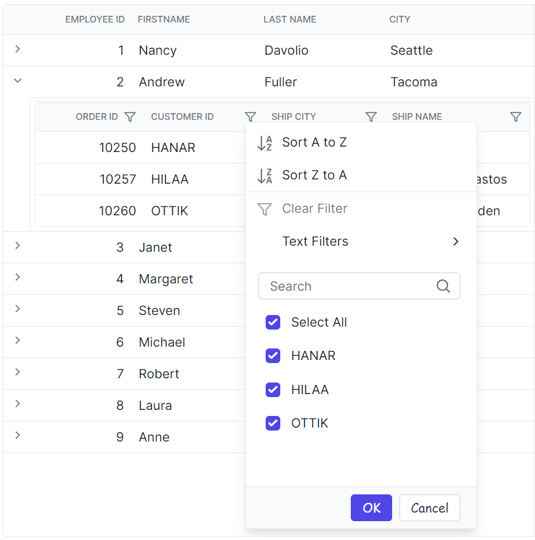

**Customizing the child grid excel filter dialog number filters element**

To customize the appearance of the excel filter dialog's number filters in the child grid, use the following CSS code:

```css
.e-detailcell .e-grid .e-filter-popup .e-contextmenu-wrapper ul{
    background-color: #deecf9;
}
```
In this example, the **.e-filter-popup .e-contextmenu-wrapper** ul classes target the number filter elements within the excel filter dialog. The `background-color` property can be modified to change the color of these elements.

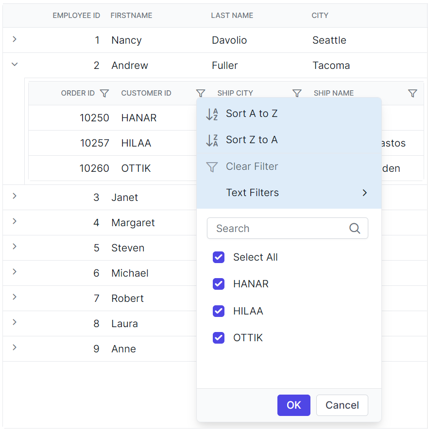

### Grouping

The appearance of grouping elements in the child grid can be customized using CSS. Here are examples of how to customize the group header, group expand/collapse icons, group caption row, and grouping indent cell.

**Customizing the child grid group header**

To customize the appearance of the child grid's group header element, use the following CSS code:

```css
.e-detailcell .e-grid .e-groupdroparea {
    background-color: #132f49;
}
```
In this example, the **.e-detailcell** class targets the child grid and the **.e-groupdroparea** class targets the group header element. The `background-color` property can be modified to change the color of the group header.

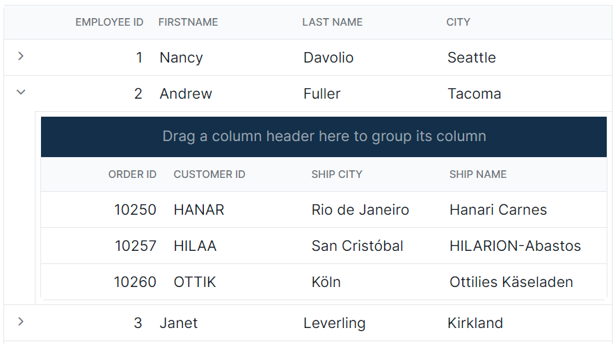

**Customizing the child grid group expand or collapse icons**

To customize the appearance of the group expand/collapse icons in the child grid, use the following CSS code:

```css
.e-detailcell .e-grid .e-icon-gdownarrow::before{
    content:'\e7c9'
}
.e-detailcell .e-grid .e-icon-grightarrow::before{
    content:'\e80f'
}
```

In this example, the **.e-icon-gdownarrow** and **.e-icon-grightarrow** classes target the expand and collapse icons, respectively. The `content` property can be modified to change the icon displayed. The available Syncfusion icons based on the theme can be used.

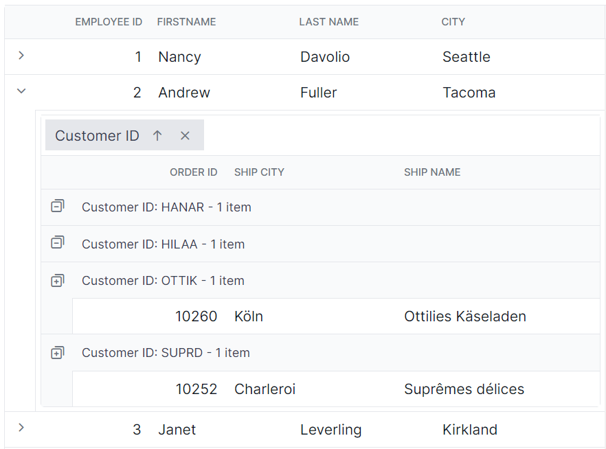

**Customizing the child grid group caption row**

To customize the appearance of the child grid's group caption row and the icons indicating record expansion or collapse, use the following CSS code:

```css
.e-detailcell .e-grid .e-groupcaption {
    background-color: #deecf9;
}

.e-detailcell .e-grid .e-recordplusexpand,
.e-detailcell .e-grid .e-recordpluscollapse {
    background-color: #deecf9;
}
```

In this example, the **.e-groupcaption** class targets the group caption row element, and the **.e-recordplusexpand** and **.e-recordpluscollapse** classes target the icons indicating record expansion or collapse. The `background-color` property can be modified to change the color of these elements.

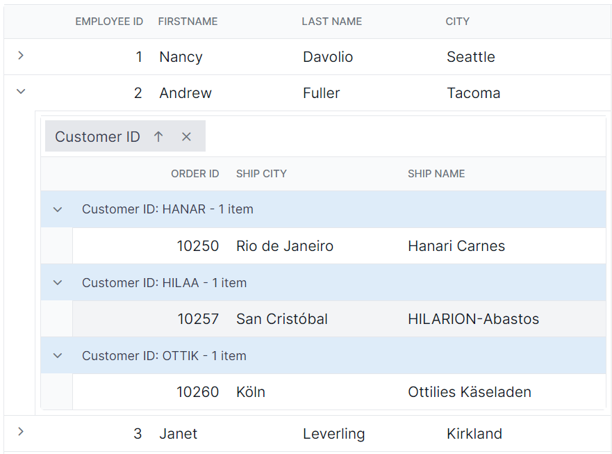

**Customizing the child grid grouping indent cell**

To customize the appearance of the child grid's grouping indent cell element, use the following CSS code:

```css
.e-detailcell .e-grid .e-indentcell {
    background-color: #deecf9;
}
```

In this example, the **.e-indentcell** class targets the grouping indent cell element. The `background-color` property can be modified to change the color of the indent cell.

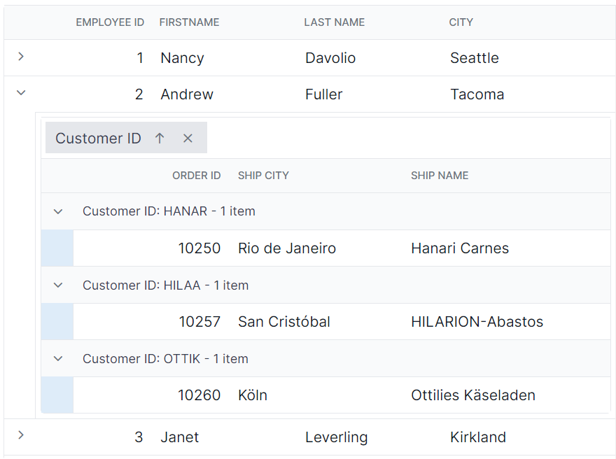

### Toolbar

The appearance of the toolbar in the child grid can be customized using CSS. Here are examples of how to customize the toolbar root element and toolbar button element.

**Customizing the child grid toolbar root element**

To customize the appearance of the child grid's toolbar root element, use the following CSS code:

```css
.e-detailcell .e-grid .e-toolbar-items {
    background-color: #deecf9;
}
```

In this example, the **.e-detailcell** class targets the child grid and the **.e-toolbar-items** class targets the background color of the toolbar root element. The `background-color` property can be modified to change the background color of the toolbar.

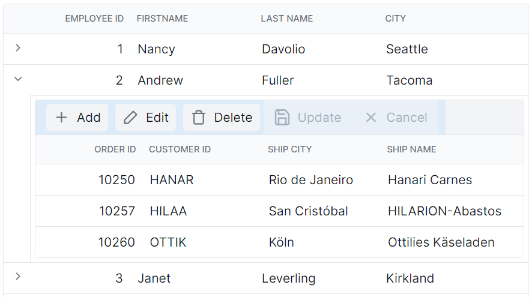

**Customizing the child grid toolbar button element**

To customize the appearance of the child grid's toolbar buttons, use the following CSS code:

```css
.e-detailcell .e-grid .e-toolbar .e-btn {
    background-color: #deecf9;
}
```

In this example, the **.e-toolbar .e-btn** selector targets the background color of the toolbar button elements. The `background-color` property can be modified to change the background color of the toolbar buttons.

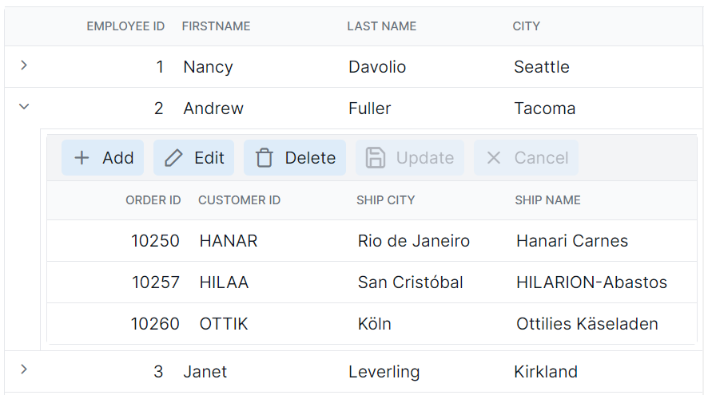

### Editing

The appearance of editing-related elements in the child grid can be customized using CSS. Below are examples of how to customize various editing-related elements.

**Customizing the child grid edited and added row element**

To customize the appearance of edited and added row table elements in the child grid, use the following CSS code:

```css
.e-detailcell .e-grid .e-editedrow table, 
.e-detailcell .e-grid .e-addedrow table {
	background-color: #62b2eb;
}
```
In this example, the **.e-detailcell** class targets the child grid and the **.e-editedrow** class represents the edited row element, and the **.e-addedrow** class represents the added row element. The `background-color` property can be modified to change the color of these row table elements.

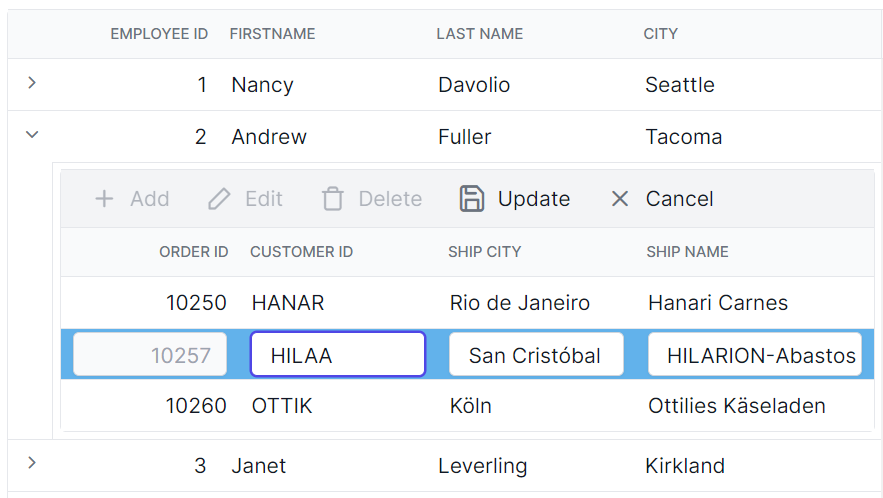
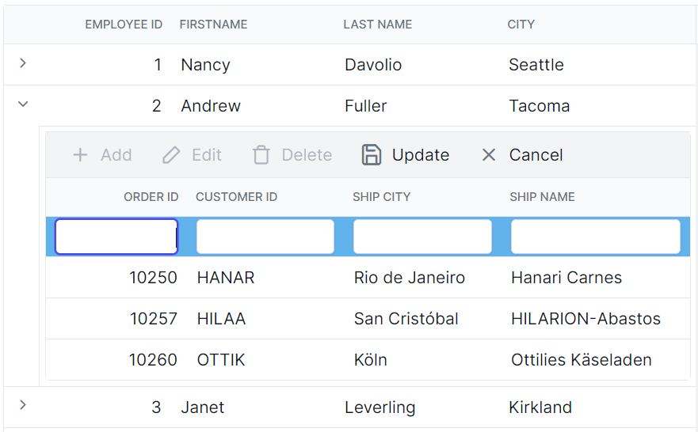

**Customizing the child grid edited row input element**

To customize the appearance of edited row input elements in the child grid, use the following CSS code:

```css
.e-detailcell .e-grid .e-editedrow .e-input-group input.e-input{
  font-family: cursive;
  color:rgb(214, 33, 123)
}
```
In this example, the **.e-editedrow** class represents the edited row element, and the **.e-input** class represents the input elements within the form. The `font-family` property can be modified to change the font and `color` property can be modified to change text color of the input elements.

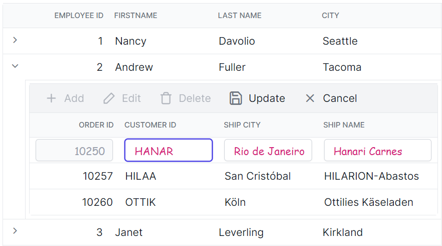

**Customizing the child grid edit dialog header element**

To customize the appearance of the edit dialog header element in the child grid, use the following CSS code:

```css
.e-edit-dialog .e-dlg-header-content {
    background-color: #deecf9;
}
```
In this example, the **.e-edit-dialog** class represents the edit dialog, and the **.e-dlg-header-content** class targets the header content within the dialog. The `background-color` property can be modified to change the color of the header element.

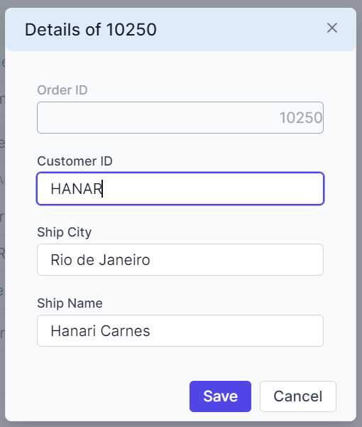

**Customizing the child grid edited row input element in dialog edit mode**

To customize the appearance of the child grid's edited row input elements in dialog edit mode, use the following CSS code:

```css
.e-grid .e-gridform .e-rowcell .e-float-input .e-field {
    font-family: cursive;
}
```
In this example, the **.e-gridform** class represents the editing form, and the **.e-float-input** class targets the floating input elements within the form. The `font-family` property can be modified to change the font of the input elements.

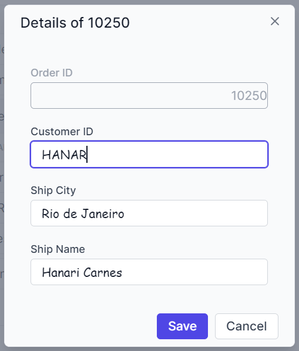

**Customizing the child grid command column buttons**

To customize the appearance of the child grid's command column buttons such as edit, delete, update, and cancel, use the following CSS code:

```css
.e-detailcell .e-grid .e-delete::before ,.e-grid .e-cancel-icon::before{
    color: #f51717;
}
.e-detailcell .e-grid .e-edit::before, .e-grid .e-update::before {
    color: #077005;
}
```
In this example, the **.e-edit, .e-delete, .e-update, and .e-cancel-icon** classes represent the respective command column buttons. The `color` property can be modified to change the color of these buttons.

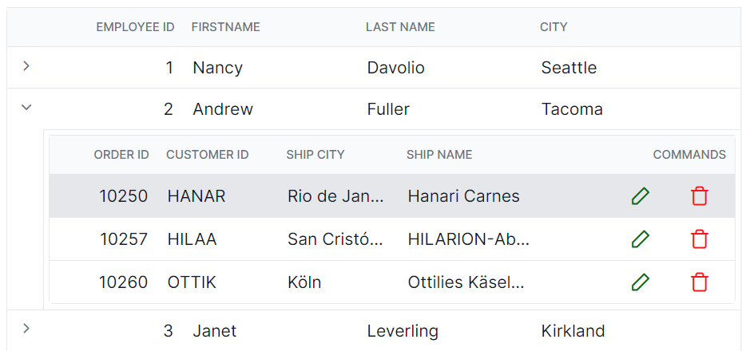
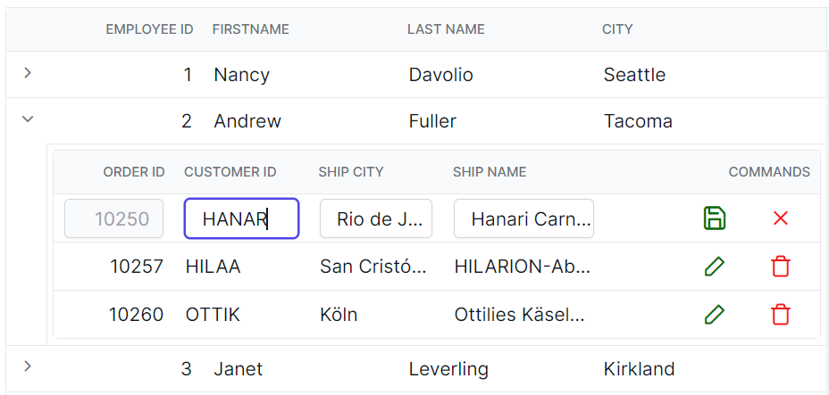

### Aggregate

The appearance of aggregate elements in the child grid can be customized using CSS. Below are examples of how to customize the aggregate root element and the aggregate cell elements.

**Customizing the child grid aggregate root element**

To customize the appearance of the child grid's aggregate root elements, use the following CSS code:

```css
.e-detailcell .e-grid .e-gridfooter {
    font-family: cursive;
}
```

In this example, the **.e-detailcell** class targets the child grid and the **e-gridfooter** class represents the root element of the aggregate row in the grid footer. The `font-family` property can be modified to change the font of the aggregate root element.

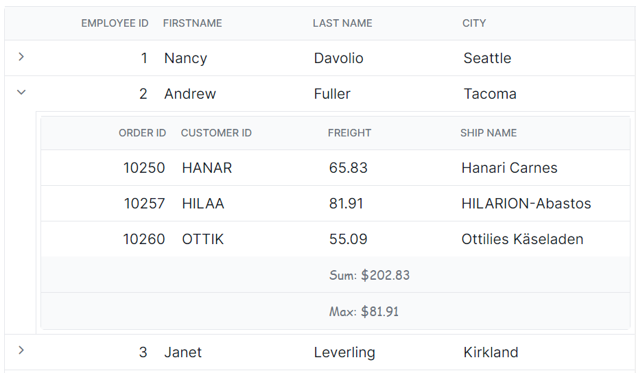

**Customizing the child grid aggregate cell elements**

To customize the appearance of the child grid's aggregate cell elements (summary row cell elements), use the following CSS code:

```css
.e-detailcell .e-grid .e-summaryrow .e-summarycell {
    background-color: #deecf9;
}
```

In this example, the **e-summaryrow** class represents the summary row containing aggregate cells, and the **e-summarycell** class targets individual aggregate cells within the summary row. The `background-color` property can be modified to change the `color` of the aggregate cell elements.

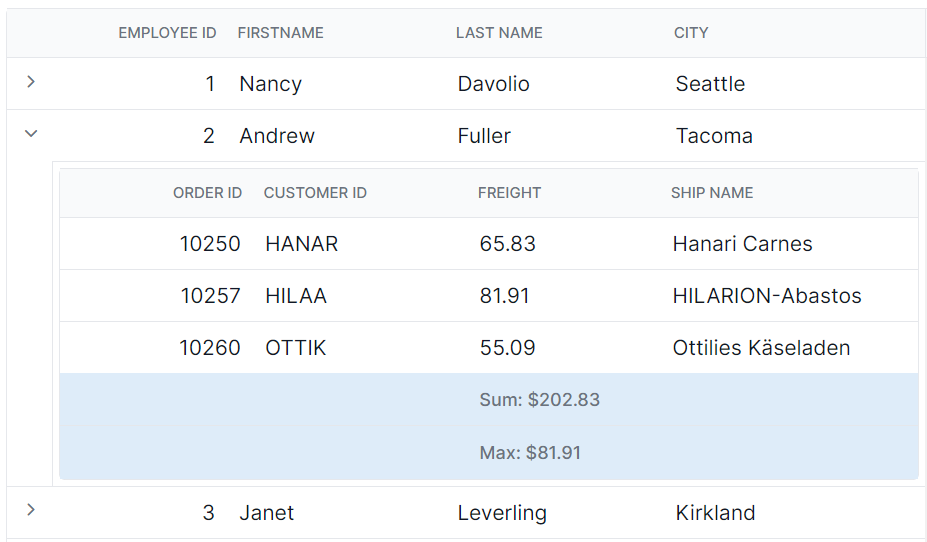

### Selection

The appearance of the selection in the child grid can be customized using CSS. Here are examples of how to customize the row selection background, cell selection background, and column selection background.

**Customizing the child grid row selection background**

To customize the appearance of the child grid's row selection, use the following CSS code:

```css
.e-detailcell .e-grid td.e-selectionbackground {
    background-color: #00b7ea;
}
```
In this example, the **.e-detailcell** class targets the child grid and the **.e-selectionbackground** class targets the background color of the row selection. The `background-color` property can be modified to change the background color of the selected rows.

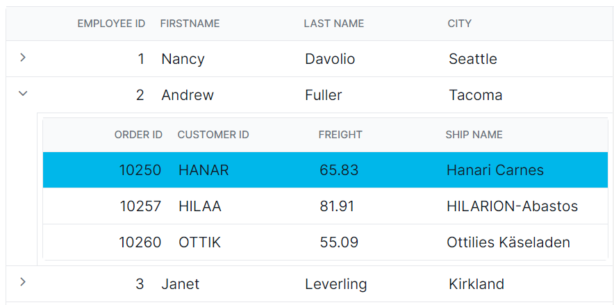

**Customizing the child grid cell selection background**

To customize the appearance of the child grid's cell selection, use the following CSS code:

```css
.e-detailcell .e-grid td.e-cellselectionbackground {
    background-color: #00b7ea;
}
```

In this example, the **.e-cellselectionbackground** class targets the background color of the cell selection. The `background-color` property can be modified to change the background color of the selected cells.

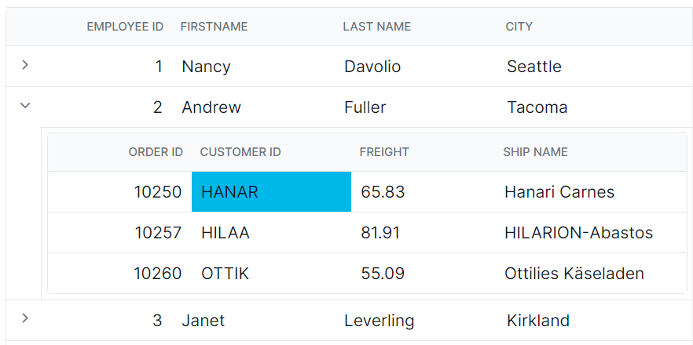

**Customizing the child grid column selection background**

To customize the appearance of the child grid's column selection, use the following CSS code:

```css
.e-detailcell .e-grid .e-columnselection {
    background-color: #aec2ec;
}
```
In this example, the **.e-columnselection** class targets the background color of the column selection. The `background-color` property can be modified to change the background color of the selected columns.

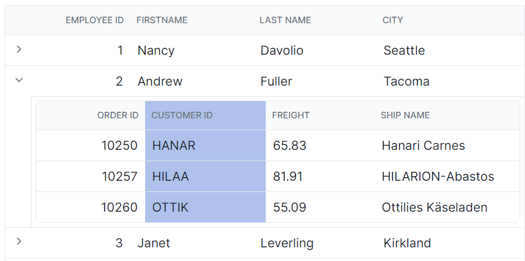

## See Also

* [Multiple queryString in hierarchy child grid in Angular Grid](https://www.syncfusion.com/forums/165124/multiple-querystring-in-hierarchy-child-grid-in-angular-grid)