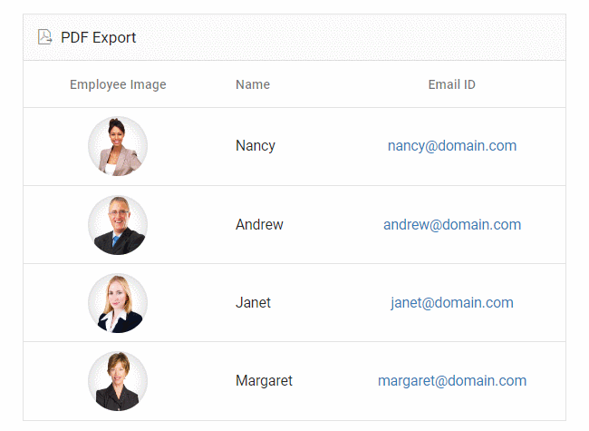
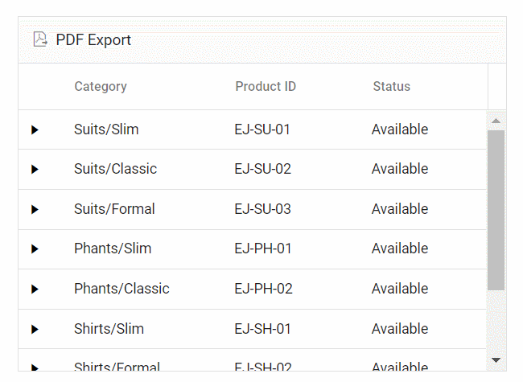
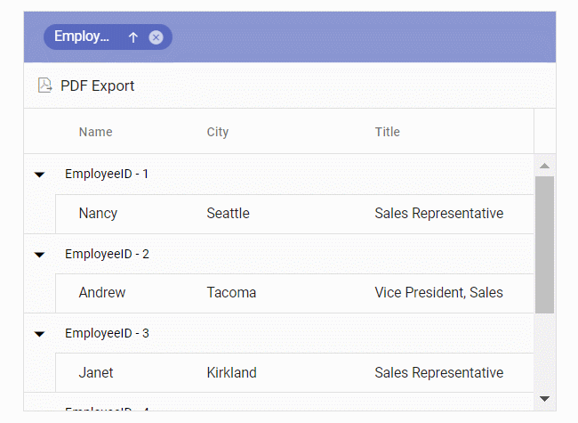

# Exporting with Templates in Angular Grid Control

The Angular Grid component allows exporting column, detail, and caption templates to PDF documents. Exported templates can include images, hyperlinks, and customized text formatting.

## Exporting with column template

The PDF export functionality allows exporting Grid columns that include images, hyperlinks, and custom text to a PDF document. The [pdfQueryCellInfo](https://ej2.syncfusion.com/angular/documentation/api/grid#pdfquerycellinfo) event enables customization of cell content during export.

The following sample demonstrates exporting hyperlinks and images to PDF using the [hyperlink](https://ej2.syncfusion.com/angular/documentation/api/grid/pdfQueryCellInfoEventArgs#hyperlink) and [image](https://ej2.syncfusion.com/angular/documentation/api/grid/pdfQueryCellInfoEventArgs#image) properties in the `pdfQueryCellInfo` event.

> PDF export supports base64 strings for exporting images.




import { Component, OnInit, ViewChild } from '@angular/core';
import { employeeData } from './datasource';
import { Column, GridComponent, Hyperlink, Image, PdfQueryCellInfoEventArgs } from '@syncfusion/ej2-angular-grids';
import { ClickEventArgs } from '@syncfusion/ej2-navigations';

interface PdfGridImage {
    base64: string;
    height: number;
    width: number;
}

interface ColumnDataType {
    EmployeeImage: string;
    EmailID: string;
}

@Component({
    selector: 'app-root',
    template: `<ejs-grid #grid id="ColumnTemplateGrid" [dataSource]="data" [toolbar]="toolbar" (toolbarClick)="toolbarClick($event)"
               [allowPdfExport]="true" (pdfQueryCellInfo)="pdfQueryCellInfo($event)" height='273px'>
                    <e-columns>
                        <e-column headerText='Employee Image' width='150' textAlign='Center'>
                            <ng-template #template let-data>
                                

                                   
                                

                            </ng-template>
                        </e-column>
                        <e-column field='FirstName' headerText='Name' width='130'></e-column>
                        <e-column headerText="Email ID" width='180'>
                            <ng-template #template let-data>
                                

                                    <a href="mailto:{{ data.EmailID }}">{{ data.EmailID }}</a>
                                

                            </ng-template>
                        </e-column>
                    </e-columns>
                </ejs-grid>`,
    styleUrls: ['app.style.css']
})

export class AppComponent implements OnInit {

    public data?: object[];
    public toolbar?: string[];
    @ViewChild('grid')
    public grid?: GridComponent;

    public ngOnInit(): void {
        this.data = employeeData;
        this.toolbar = ['PdfExport'];
    }
    toolbarClick(args: ClickEventArgs): void {
        if (args.item.id === 'ColumnTemplateGrid_pdfexport') {
            this.grid!.pdfExport();
        }
    }
    pdfQueryCellInfo(args: PdfQueryCellInfoEventArgs): void {
        const columnHeaderText = (args.column as Column).headerText;

        if (columnHeaderText === 'Employee Image' && args.data && ('EmployeeImage' in args.data)) {
            args.image = {
                base64: args.data['EmployeeImage'] as string,
                height: 50,
                width: 50,
            } as PdfGridImage;
        }
        if (columnHeaderText === 'Email ID' && args.data && ('EmailID' in args.data)) {
            args.hyperLink = {
                target: 'mailto:' + (args.data['EmailID'] as string),
                displayText: args.data['EmailID'] as string,
            };
        }
    }

}







  


## Exporting with detail template

By default, the Grid exports the parent grid with expanded detail rows. Control this behavior by setting the `PdfExportProperties.hierarchyExportMode` property. The available options are:

| Mode     | Behavior    |
|----------|-------------|
| `Expanded` | Exports the parent grid with expanded detail rows. |
| `All`      | Exports the parent grid with all detail rows. |
| `None`     | Exports the parent grid alone. |

The detail rows in the exported PDF can be customized and formatted using the [exportDetailTemplate](https://ej2.syncfusion.com/angular/documentation/api/grid#exportdetailtemplate) event. This event formats detail rows based on parent row data.

The following sample configures detail row formatting using the [columnCount](https://ej2.syncfusion.com/angular/documentation/api/grid/detailTemplateProperties#columncount), [columnHeader](https://ej2.syncfusion.com/angular/documentation/api/grid/detailtemplateproperties#columnheader), and [rows](https://ej2.syncfusion.com/angular/documentation/api/grid/detailTemplateProperties#rows) properties using its [parentRow](https://ej2.syncfusion.com/angular/documentation/api/grid/exportDetailTemplateEventArgs#parentrow) details. This allows for the creation of detail rows in the PDF document. Custom cell styling is applied using the [style](https://ej2.syncfusion.com/angular/documentation/api/grid/detailTemplateCell#style) property.

> If `columnCount` is not provided, the columns in the detail row of the PDF grid will be generated based on the count of the `columnHeader`/`rows` first row's [cells](https://ej2.syncfusion.com/angular/documentation/api/grid/detailTemplateRow#cells).
> When using [rowSpan](https://ej2.syncfusion.com/angular/documentation/api/grid/detailTemplateCell#rowspan), it is Essential&reg; to provide the cell's [index](https://ej2.syncfusion.com/angular/documentation/api/grid/detailTemplateCell#index) for proper functionality.




import { Component, OnInit, ViewChild } from '@angular/core';
import { employeeData, } from './datasource';
import { GridComponent, ExportDetailTemplateEventArgs } from '@syncfusion/ej2-angular-grids';
import { ClickEventArgs } from '@syncfusion/ej2-navigations';

interface Row {
    data: DataType;
    parentRow: object[]
}

interface DataType {
    Category: string,
    Offers: string,
    Cost: string,
    Available: string,
    ItemID: string,
    ProductID: string,
    Contact: string,
    Status: string,
    ProductImg: string,
    productDesc: string,
    ReturnPolicy: string,
    Delivery: string,
    Cancellation: string,
    Ratings: string
}
@Component({
    selector: 'app-root',
    template: `<ejs-grid #grid [dataSource]="data" id="DetailTemplateGrid" [toolbar]="toolbar" [allowPdfExport]="true"
        (toolbarClick)="toolbarClick($event)" (exportDetailTemplate)="exportDetailTemplate($event)" height="273px">
            <ng-template #detailTemplate let-data>
                <table class="detailtable" width="100%">
                    <colgroup>
                        <col width="40%" />
                        <col width="60%" />
                    </colgroup>
                    <thead>
                        <tr>
                            <th colspan="2" style="font-weight: 500;text-align: center;background-color: #ADD8E6;">
                            Product Details
                            </th>
                        </tr>
                    </thead>
                    <tbody>
                        <tr>
                            <td rowspan="4" style="text-align: center;">
                                
                            </td>
                            <td>
                                
                                Offers: {{ data.Offers }}
                                
                            </td>
                        </tr>
                        <tr>
                            <td>
                                Available: {{ data.Available }} 
                            </td>
                        </tr>
                        <tr>
                            <td>
                                
                                Contact:<a href="mailto:{{ data.Contact }}">{{ data.Contact }}</a>
                                
                            </td>
                        </tr>
                        <tr>
                            <td>
                                
                                Ratings: {{ data.Ratings }}
                            </td>
                        </tr>
                        <tr>
                            <td style="text-align: center;">
                                 {{ data.productDesc }}
                            </td>
                            <td>
                                {{ data.ReturnPolicy }}
                            </td>
                        </tr>
                        <tr>
                            <td style="text-align: center;">
                                 {{ data.Cost }}
                            </td>
                            <td>
                                {{ data.Cancellation }}
                            </td>
                        </tr>
                        <tr>
                            <td style="text-align: center;">
                                
                                {{ data.Status }}
                            </td>
                            <td>
                                {{ data.Delivery }}
                            </td>
                        </tr>
                    </tbody>
                </table>
            </ng-template>
            <e-columns>
                <e-column field="Category" headerText="Category" width="140"></e-column>
                <e-column field="ProductID" headerText="Product ID" width="120"></e-column>
                <e-column field="Status" headerText="Status" width="120"></e-column>
            </e-columns>
        </ejs-grid>`,
    styleUrls: ['app.style.css']
})
export class AppComponent implements OnInit {

    public data?: object[];
    public toolbar?: string[];
    @ViewChild('grid')
    public grid?: GridComponent;

    ngOnInit(): void {
        this.data = employeeData;
        this.toolbar = ['PdfExport'];
    }

    toolbarClick(args: ClickEventArgs): void {
        if (args.item.id === 'DetailTemplateGrid_pdfexport') {
            (this.grid as GridComponent).pdfExport({ hierarchyExportMode: 'Expanded' });
        }
    }

    exportDetailTemplate(args: ExportDetailTemplateEventArgs): void {
        const parentRow = (args.parentRow as object as Row)
        const columnData=parentRow.data as DataType
        args.value = {
            columnCount: 2,
            columnHeader: [
                {
                    cells: [
                        {
                            index: 0,
                            colSpan: 2,
                            value: 'Product Details',
                            style: {
                                backColor: '#ADD8E6',
                                pdfTextAlignment: 'Center',
                                bold: true,
                            },
                        },
                    ],
                },
            ],
            rows: [
                {
                    cells: [
                        {
                            index: 0,
                            rowSpan: 4,
                            image: { base64: columnData['ProductImg'], width: 80 },
                        },
                        {
                            index: 1,
                            value: 'Offers: ' + columnData['Offers'],
                            style: { fontColor: '#0A76FF', fontSize: 15 },
                        },
                    ],
                },
                {
                    cells: [
                        {
                            index: 1,
                            value: 'Available: ' + columnData['Available'],
                        },
                    ],
                },
                {
                    cells: [
                        {
                            index: 1,
                            value: 'Contact: ',
                            hyperLink: {
                                target: 'mailto:' + columnData['Contact'],
                                displayText: columnData['Contact'],
                            },
                        },
                    ],
                },
                {
                    cells: [
                        {
                            index: 1,
                            value: 'Ratings: ' + columnData['Ratings'],
                            style: { fontColor: '#0A76FF', fontSize: 15 },
                        },
                    ],
                },
                {
                    cells: [
                        {
                            index: 0,
                            value: columnData['productDesc'],
                            style: { pdfTextAlignment: 'Center' },
                        },
                        { index: 1, value: columnData['ReturnPolicy'] },
                    ],
                },
                {
                    cells: [
                        {
                            index: 0,
                            value: columnData['Cost'],
                            style: { bold: true, pdfTextAlignment: 'Center' },
                        },
                        { index: 1, value: columnData['Cancellation'] },
                    ],
                },
                {
                    cells: [
                        {
                            index: 0,
                            value: columnData['Status'],
                            style: {
                                fontColor:
                                columnData['Status'] === 'Available'
                                        ? '#00FF00'
                                        : '#FF0000',
                                pdfTextAlignment: 'Center',
                                fontSize: 15,
                            },
                        },
                        {
                            index: 1,
                            value: columnData['Delivery'],
                            style: { fontColor: '#0A76FF', fontSize: 15 },
                        },
                    ],
                },
            ],
        };
    }
}







  


## Exporting with caption template

The PDF export feature enables exporting Grid with caption templates to PDF documents. The [exportGroupCaption](https://ej2.syncfusion.com/angular/documentation/api/grid#exportgroupcaption) event allows customization of caption text during export.

The following sample demonstrates exporting customized caption text using the [captionText](https://ej2.syncfusion.com/angular/documentation/api/grid/exportGroupCaptionEventArgs#captiontext) property in the `exportGroupCaption` event.




import { Component, OnInit, ViewChild } from '@angular/core';
import { employeeData } from './datasource';
import { GridComponent, GroupSettingsModel, ExportGroupCaptionEventArgs } from '@syncfusion/ej2-angular-grids';
import { ClickEventArgs } from '@syncfusion/ej2-navigations';

@Component({
    selector: 'app-root',
    template: `<ejs-grid #grid id="CaptionTemplateGrid" [dataSource]="data" [allowGrouping]="true" [groupSettings]="groupOptions"
               [toolbar]="toolbar" (toolbarClick)="toolbarClick($event)" [allowPdfExport]="true"
               (exportGroupCaption)="exportGroupCaption($event)" height='245px'>
                <e-columns>
                    <e-column field='EmployeeID' headerText='Employee ID' width='140'></e-column>
                    <e-column field='FirstName' headerText='First Name' width='120'></e-column>
                    <e-column field='City' headerText='City'></e-column>
                    <e-column field='Title' headerText='Title' width=170></e-column>
                </e-columns>
                <ng-template #groupSettingsCaptionTemplate let-data>
                    {{ data.field }} - {{ data.key }}
                </ng-template>
                </ejs-grid>`
})
export class AppComponent implements OnInit {

    public data?: object[];
    public groupOptions?: GroupSettingsModel;
    public toolbar?: string[];

    @ViewChild('grid')
    public grid?: GridComponent;

    ngOnInit(): void {
        this.data = employeeData;
        this.groupOptions = { columns: ['EmployeeID'] };
        this.toolbar = ['PdfExport'];
    }
    toolbarClick(args: ClickEventArgs): void {
        if (args.item.id === 'CaptionTemplateGrid_pdfexport') {
            (this.grid as GridComponent).pdfExport();
        }
    }
    exportGroupCaption(args: ExportGroupCaptionEventArgs) {
        args.captionText = (args.data as CaptionDataStructure)['field'] + ' - ' + (args.data as CaptionDataStructure)['key'];
    }
}

interface CaptionDataStructure {
    field: string;
    key: string;
}







  


