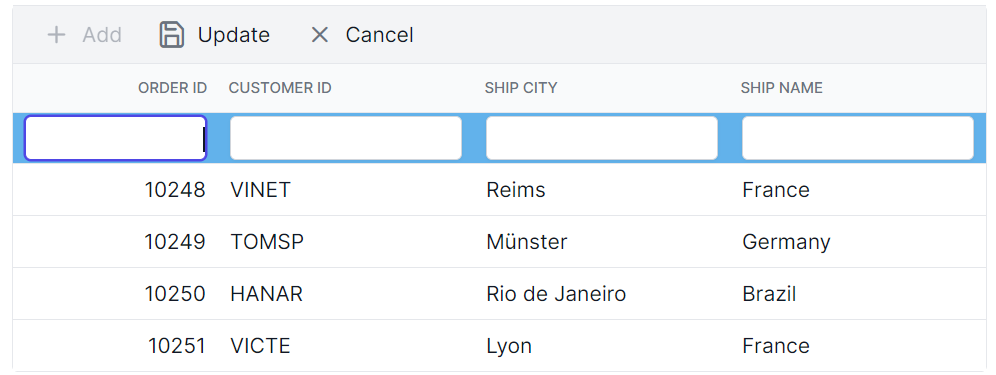
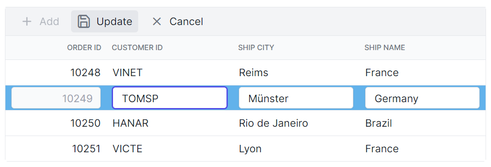
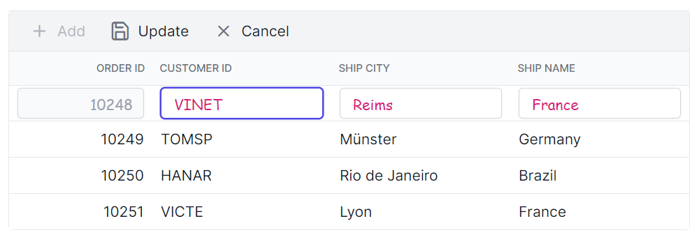
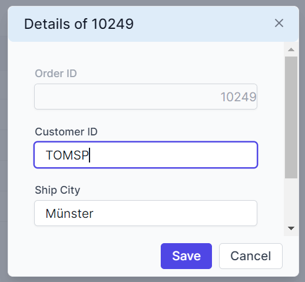
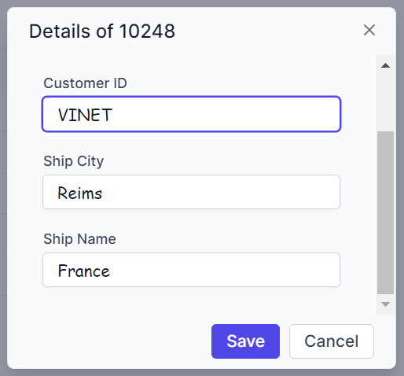
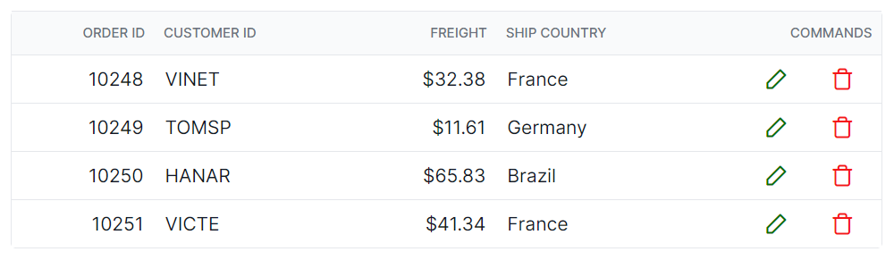
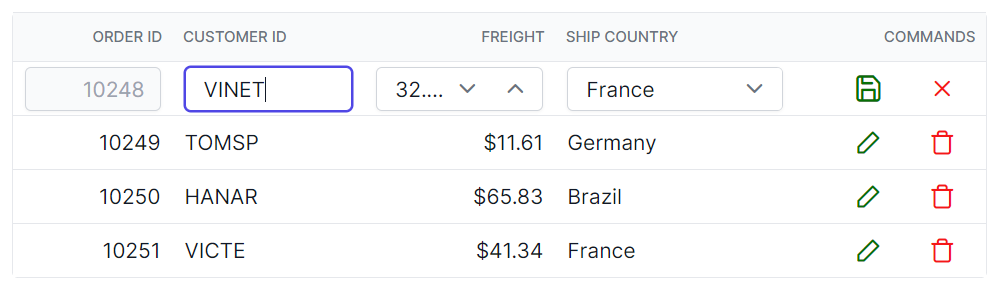

# Editing Styles in Angular Data Grid

Customize the appearance of editing elements in the [Angular Data Grid](https://www.syncfusion.com/angular-components/angular-data-grid) using CSS. The following examples demonstrate styling edited rows, edit dialogs, input fields, and command buttons.

## Customize edited and added row table elements

Use the `.e-editedrow` and `.e-addedrow` classes to style edited and added row table elements.

```css
.e-grid .e-editedrow table, .e-grid .e-addedrow table {
    background-color: #62b2eb;
}
```




## Customize the edited row input element

Use the `.e-gridform` and `.e-input` classes to style the input element in an edited form row.

```css
.e-grid .e-gridform .e-rowcell .e-input-group .e-input.e-field {
    font-family: cursive;
    color:rgb(214, 33, 123)
}
```



## Customize the edit dialog header

Use the `.e-edit-dialog` and `.e-dlg-header-content` classes to style the edit dialog header.

```css
.e-edit-dialog .e-dlg-header-content {
    background-color: #deecf9;
}
```



## Customize input fields in dialog edit mode

Use the `.e-gridform` and `.e-float-input` classes to customize the input elements within the edit dialog.

```css
.e-gridform .e-rowcell .e-float-input .e-field {
    font-family: cursive;
}
```



## Customize the command column buttons

Use the  `.e-edit`, `.e-delete`, `.e-update`, and `.e-cancel-icon` classes to style the respective command column buttons in the grid.

```css

.e-grid .e-delete::before ,.e-grid .e-cancel-icon::before {
    color: #f51717;
}
.e-grid .e-edit::before, .e-grid .e-update::before {
    color: #077005;
}
```



