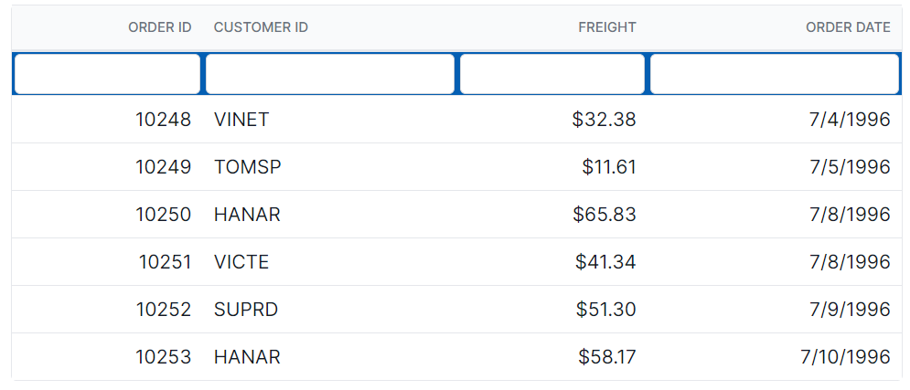
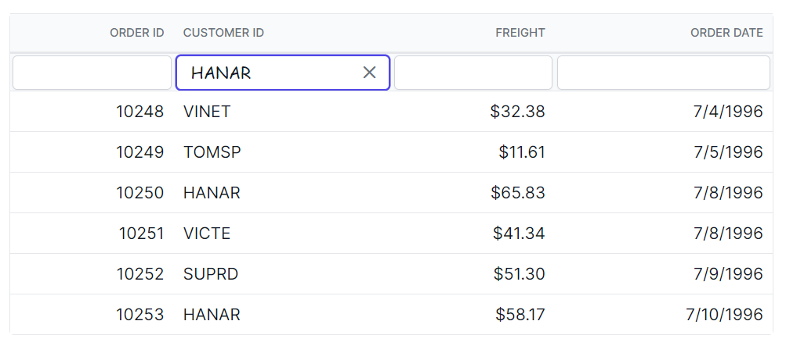
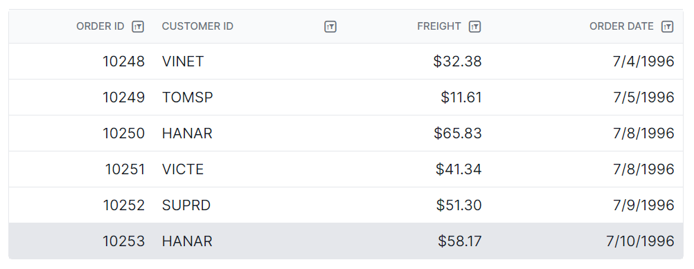
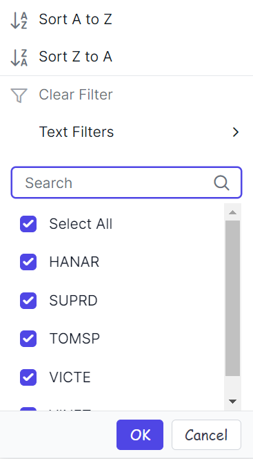
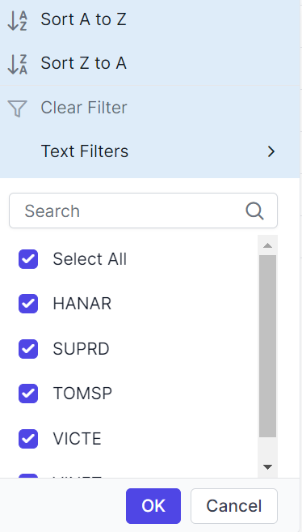

# Filtering Customization in Angular Grid component

Customize the appearance of filtering elements in the Syncfusion Angular Grid component using CSS. Below are examples for styling various filter bar elements, input fields, icons, dialog content, and Excel-style filter menus.

## Customize the Filter Bar Cell Element

The `.e-filterbarcell` class is used to style the filter bar cell element in the grid header.

```css
.e-grid .e-filterbarcell {
    background-color: #045fb4;
}
```



## Customize the filter bar input element

The `.e-filterbarcell` and `.e-input` classes are used to style the filter bar input element.

```css
.e-grid .e-filterbarcell .e-input-group input.e-input{
    font-family: cursive;
}
```



## Customizing the filter bar input focus

The `.e-filterbarcell` and `.e-input-group.e-input-focus` classes are used to style the focused filter bar input element.

```css
.e-grid .e-filterbarcell .e-input-group.e-input-focus{
    background-color: #deecf9;
}
```


## Customizing the filter bar input clear icon

The `.e-clear-icon` class is used to style the clear icon element within the input group.

```css
.e-grid .e-filterbarcell .e-input-group .e-clear-icon::before {
    content: '\e72c';
}
```


## Customize the grid filtering icon

The `.e-icon-filter` class is used to style the filtering icon element in the grid header.

```css
.e-grid .e-icon-filter::before{
      content: '\e81e';
}
```



## Customizing the filter dialog content

The `.e-filter-popup` `.e-dlg-content` classes are used to style the content element within the filter dialog.

```css
.e-grid .e-filter-popup .e-dlg-content {
    background-color: #deecf9;
}
```


## Customizing the filter dialog footer

The `.e-filter-popup` `.e-footer-content` classes are used to style the footer element within the filter dialog.

```css
.e-grid .e-filter-popup .e-footer-content {
    background-color: #deecf9;
}
```


## Customizing the filter dialog input element

The `.e-filter-popup` and `.e-input` classes are used to style the input elements within the filter dialog.

```css
.e-grid .e-filter-popup .e-input-group input.e-input{
    font-family: cursive;
}
```


## Customizing the filter dialog button element

The `.e-filter-popup` and `.e-btn` classes are used to style the button elements within the filter dialog.

```css
.e-grid .e-filter-popup .e-btn{
    font-family: cursive;
}
```



## Customizing the excel filter dialog number filters element

The `.e-filter-popup` `.e-contextmenu-wrapper ul` classes are used to style the number filter elements within the Excel filter dialog.

```css
.e-grid .e-filter-popup .e-contextmenu-wrapper ul{
    background-color: #deecf9;
}
```


