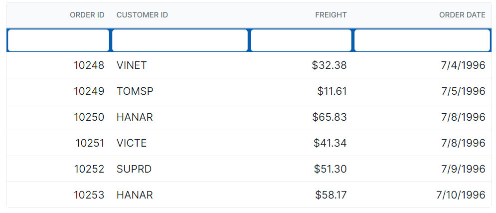
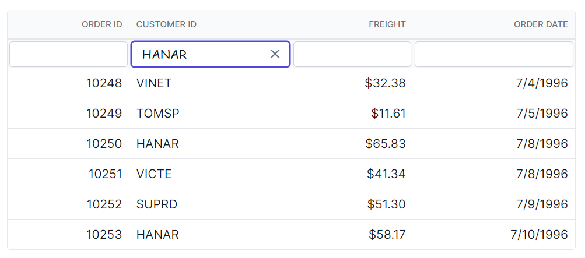
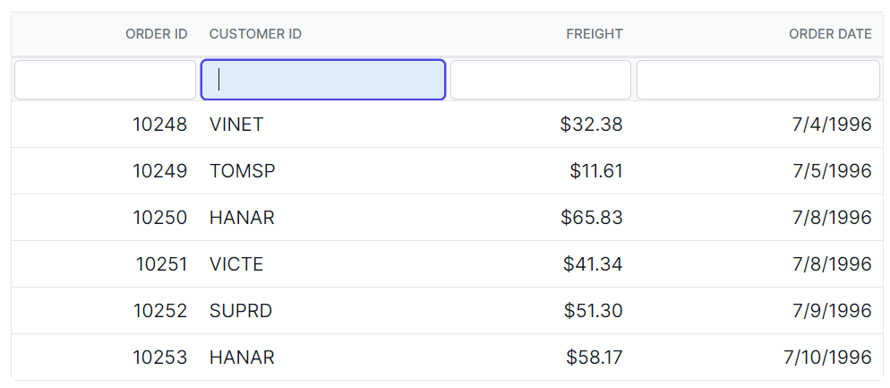
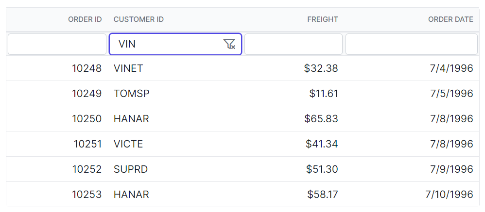
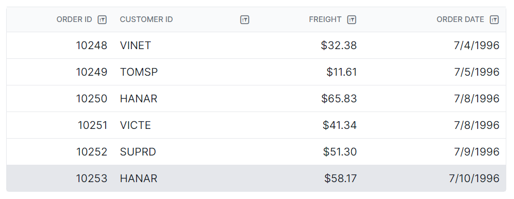
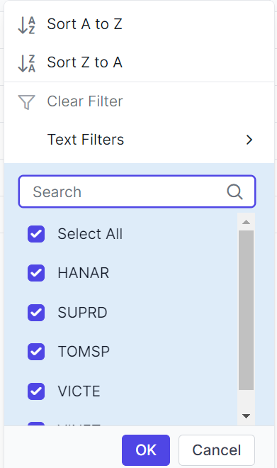
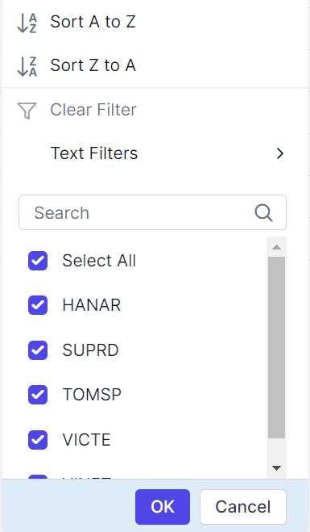
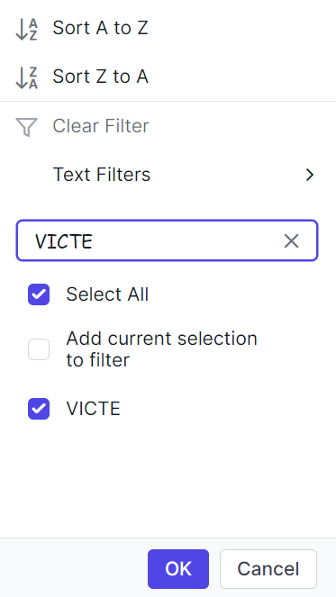
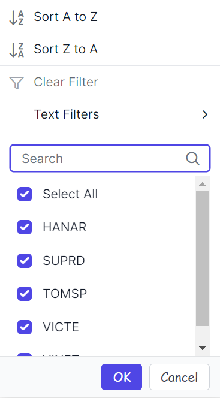
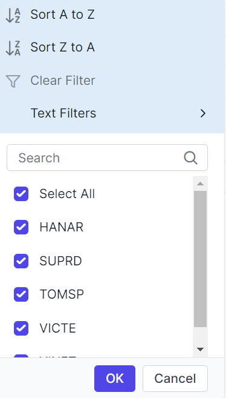

# Filtering Styles in Angular Data Grid

Customize the appearance of filtering elements in the [Angular Data Grid](https://www.syncfusion.com/angular-components/angular-data-grid) component using CSS. The following examples demonstrate styling the filter bar, filter icons, filter dialog, and Excel filter menu.

## Customize filter bar styles

Use the following CSS selectors to customize the appearance of filter bar elements in the Angular Data Grid.

### Filter bar cell

Use the `.e-filterbarcell` class to style the filter bar cell element in the grid header.

```css
.e-grid .e-filterbarcell {
    background-color: #045fb4;
}
```



### Filter bar input

Use the `.e-filterbarcell` and `.e-input` classes to style the filter bar input element.

```css
.e-grid .e-filterbarcell .e-input-group input.e-input{
    font-family: cursive;
}
```



### Filter input focus

Use the `.e-filterbarcell` and `.e-input-group.e-input-focus` classes to style the focused filter bar input element.

```css
.e-grid .e-filterbarcell .e-input-group.e-input-focus{
    background-color: #deecf9;
}
```



### Filter input clear icon

Use the `.e-clear-icon` class to style the clear icon element within the input group.

```css
.e-grid .e-filterbarcell .e-input-group .e-clear-icon::before {
    content: '\e72c';
}
```



## Customize the grid filtering icon

Use the `.e-icon-filter` class to style the filtering icon element in the grid header.

```css
.e-grid .e-icon-filter::before{
      content: '\e81e';
}
```



## Customize filter dialog appearance

Use the following CSS selectors to customize the appearance of the filter dialog, including its content, footer, input fields, and buttons.

### Dialog content

Use the `.e-filter-popup` `.e-dlg-content` classes to style the content element within the filter dialog.

```css
.e-grid .e-filter-popup .e-dlg-content {
    background-color: #deecf9;
}
```



### Dialog footer

Use the `.e-filter-popup` `.e-footer-content` classes to style the footer element within the filter dialog.

```css
.e-grid .e-filter-popup .e-footer-content {
    background-color: #deecf9;
}
```



### Dialog input

Use the `.e-filter-popup` and `.e-input` classes to style the input elements within the filter dialog.

```css
.e-grid .e-filter-popup .e-input-group input.e-input{
    font-family: cursive;
}
```



### Dialog buttons

Use the `.e-filter-popup` and `.e-btn` classes to style the button elements within the filter dialog.

```css
.e-grid .e-filter-popup .e-btn{
    font-family: cursive;
}
```



## Customize the excel filter dialog number filters element

Use the `.e-filter-popup` `.e-contextmenu-wrapper ul` classes to style the number filter elements within the Excel filter dialog.

```css
.e-grid .e-filter-popup .e-contextmenu-wrapper ul{
    background-color: #deecf9;
}
```


