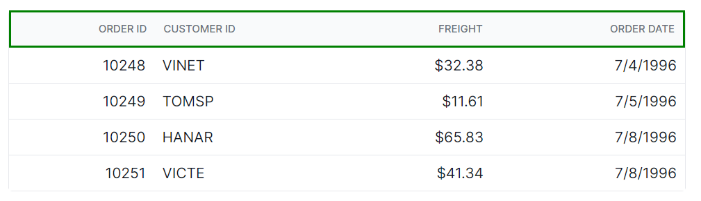
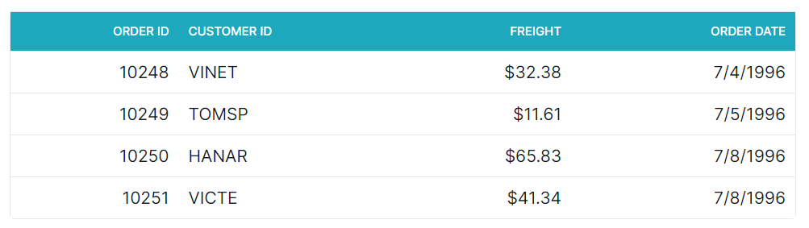
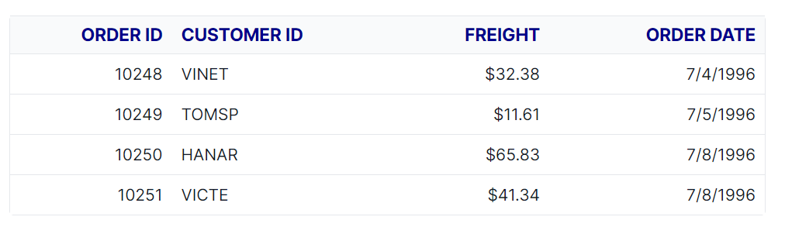

# Header in Angular Grid component

The appearance of the header elements in the Angular Data Grid component can be customized using CSS. Here are examples for customizing the grid header, header cell, and header cell div element.

## Customize the Grid header root

The `.e-gridheader` class is used to style the root element of the grid header.

```css
.e-grid .e-gridheader {
    border: 2px solid green;
}
```



## Customize the Grid header cell

The `.e-headercell` class is used to style the root element of the header cell elements.

```css
.e-grid .e-headercell {
    color: #ffffff;
    background-color: #1ea8bd;
}
```



## Customize the Grid header cell content

The `.e-headercelldiv` class is used to apply custom styles to the div element inside each grid header cell.

```css
.e-grid .e-headercelldiv {
    font-size: 15px;
    font-weight: bold;
    color: darkblue;
}
```


