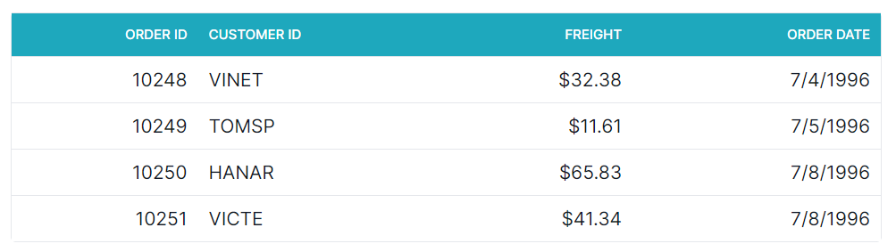
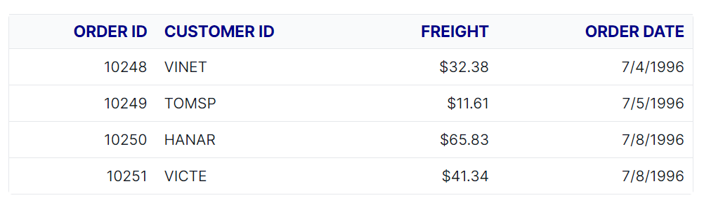

# Header Styles in Angular Data Grid

Customize the appearance of the header in the [Angular Data Grid](https://www.syncfusion.com/angular-components/angular-data-grid) using CSS. The following examples demonstrate styling the grid header, header cells, and header cell content.

## Customize the header

Use the `.e-gridheader` class to style the root element of the grid header.

```css
.e-grid .e-gridheader {
    border: 2px solid green;
}
```


## Customize the header cell

Use the `.e-headercell` class to style the root element of the header cell elements.

```css
.e-grid .e-headercell {
    color: #ffffff;
    background-color: #1ea8bd;
}
```



## Customize the header cell content

Use the `.e-headercelldiv` class to apply custom styles to the div element inside each grid header cell.

```css
.e-grid .e-headercelldiv {
    font-size: 15px;
    font-weight: bold;
    color: darkblue;
}
```


