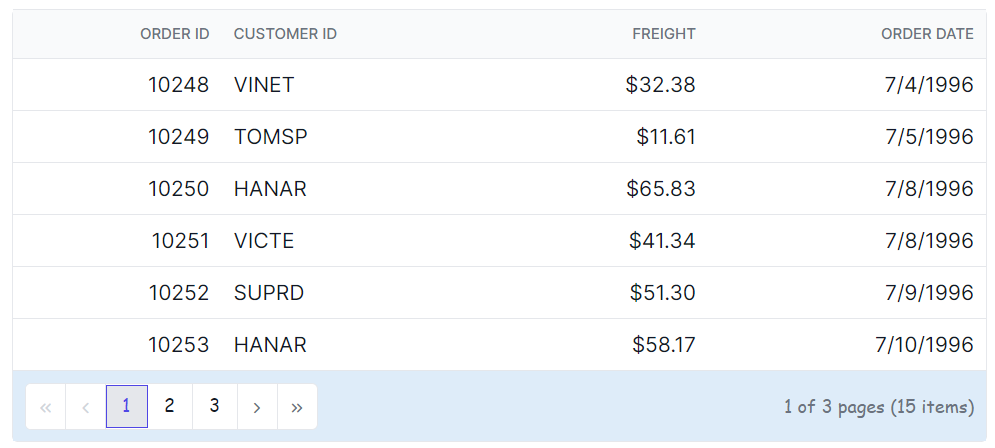
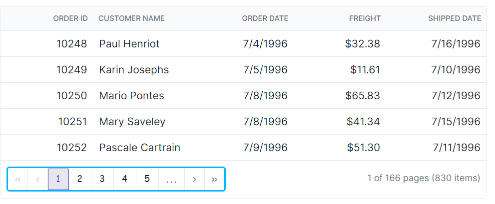
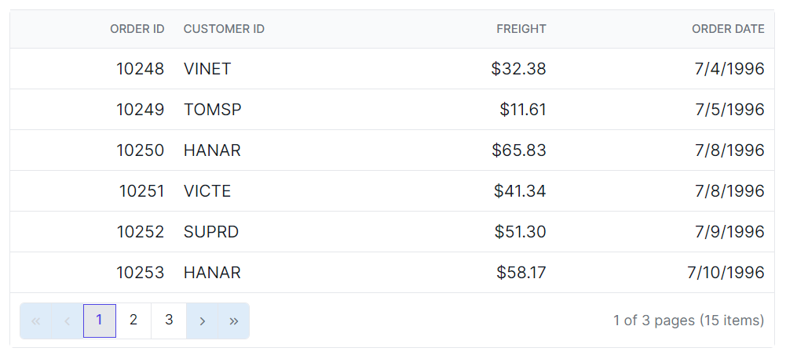
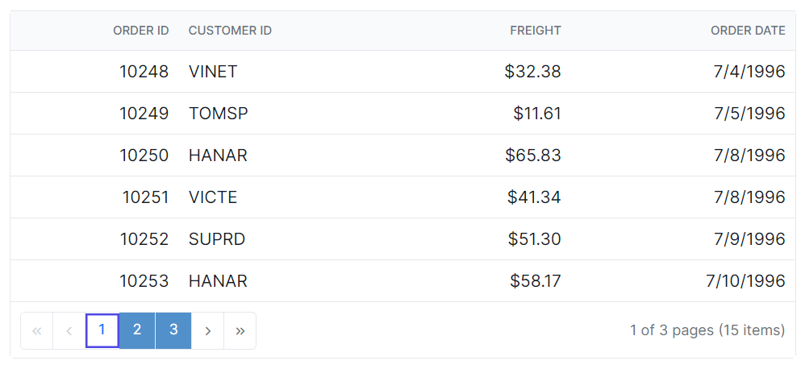
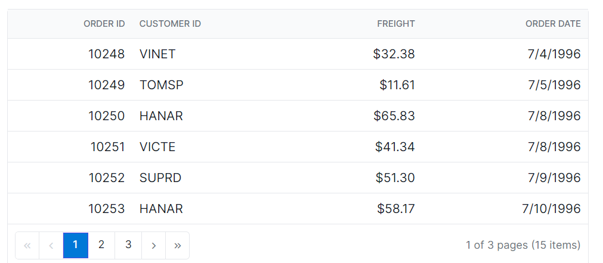

# Paging Styles in Angular Data Grid

Customize the appearance of the pager in the [Angular Data Grid](https://www.syncfusion.com/angular-components/angular-data-grid) using CSS. The following examples demonstrate styling the pager root, pager container, navigation buttons, and numeric pager items.

## Customize the pager root

Use the `.e-gridpager` class to style the pager root element.

```css
.e-grid .e-gridpager {
    font-family: cursive;
    background-color: #deecf9;
}
```



## Customize the pager container

Use the `.e-pagercontainer` class to style the pager container element.

```css
.e-grid .e-pagercontainer {
    border: 2px solid #00b5ff;
    font-family: cursive;
}
```



## Customize pager navigation buttons

Use the classes `.e-prevpagedisabled`, `.e-prevpage`, `.e-nextpage`, `.e-nextpagedisabled`, `.e-lastpagedisabled`, `.e-lastpage`, `.e-firstpage`, and `.e-firstpagedisabled` to style the various pager navigation elements.

```css
.e-grid .e-gridpager .e-prevpagedisabled,
.e-grid .e-gridpager .e-prevpage,
.e-grid .e-gridpager .e-nextpage,
.e-grid .e-gridpager .e-nextpagedisabled,
.e-grid .e-gridpager .e-lastpagedisabled,
.e-grid .e-gridpager .e-lastpage,
.e-grid .e-gridpager .e-firstpage,
.e-grid .e-gridpager .e-firstpagedisabled {
    background-color: #deecf9;
}
```



## Customize pager page number links

Use the `.e-numericitem` class to style the page numeric link elements.

```css
.e-grid .e-gridpager .e-numericitem {
    background-color: #5290cb;
    color: #ffffff;
    cursor: pointer;
    }
    
.e-grid .e-gridpager .e-numericitem:hover {
    background-color: white;
    color:  #007bff;
}
```



## Customize the current page item

Use the `.e-currentitem` class to style the current page numeric item.

```css
.e-grid .e-gridpager .e-currentitem {
    background-color: #0078d7;
    color: #fff;
}
```


