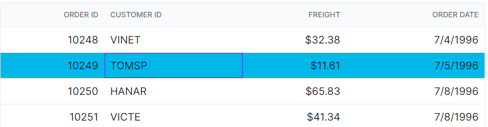
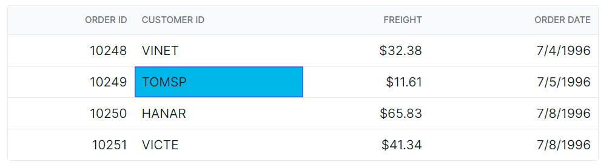
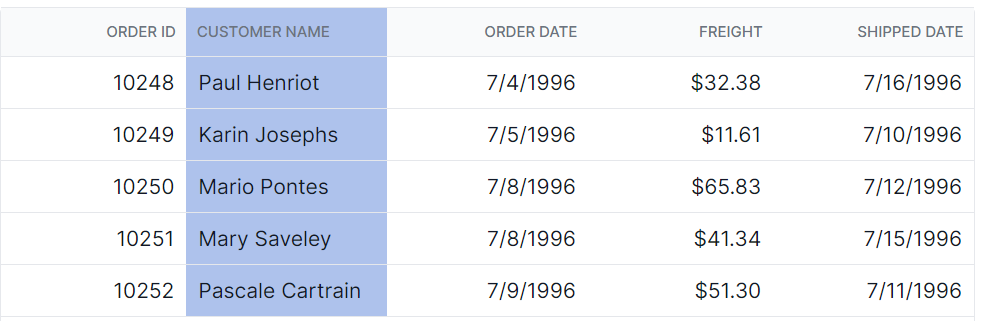

# Selection Customization in Angular Grid Component

The appearance of selection in the Angular Data Grid component can be customized using CSS. Here are examples for customizing the row selection background, cell selection background, and column selection background.

## Customizing the row selection background

The `.e-selectionbackground` class is used to style the row selection background.

```css
.e-grid td.e-selectionbackground {
    background-color: #00b7ea;
}
```



## Customizing the cell selection background

The `.e-cellselectionbackground` class is used to style the cell selection background.

```css
.e-grid td.e-cellselectionbackground {
    background-color: #00b7ea;
}
```



## Customizing the column selection background

The `.e-columnselection` class is used to style the column selection background.

```css
.e-grid .e-columnselection {
    background-color: #aec2ec;
}
```


