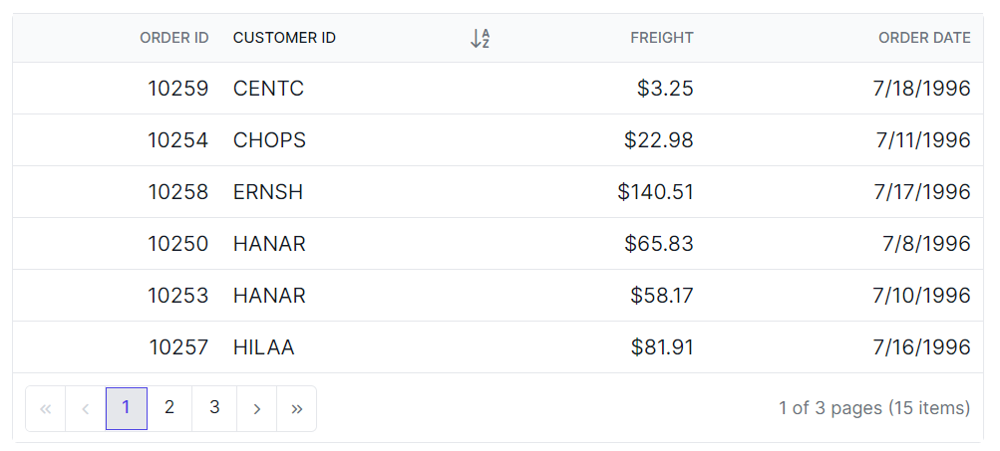
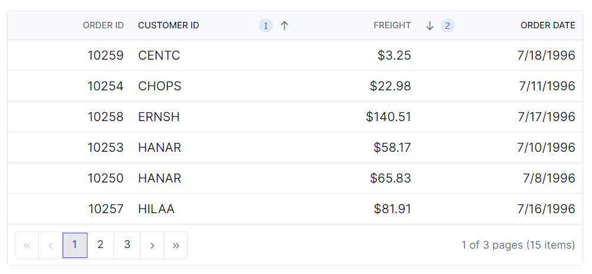

# Sorting Customization in Angular Grid Component

The appearance of the sorting icons and multi sorting icons in the Syncfusion<sup style="font-size:70%">&reg;</sup> Angular Grid component can be customized using CSS. Available Syncfusion<sup style="font-size:70%">&reg;</sup> [icons](https://ej2.syncfusion.com/angular/documentation/appearance/icons#material) can be used based on the active theme.

## Customize the Grid Sorting Icon

The `.e-icon-ascending::before` and `.e-icon-descending::before` classes are used to style the sorting icons for ascending and descending order.

```css
.e-grid .e-icon-ascending::before {
    content: '\e7a3'; /* Icon code for ascending order */
}
.e-grid .e-icon-descending::before {
    content: '\e7b6'; /* Icon code for descending order */
}
```



## Customize the Grid Multi Sorting Icon

The `.e-sortnumber` class is used to style the multi sorting icon.

```css
.e-grid .e-sortnumber {
    background-color: #deecf9;
    font-family: cursive;
}
```


