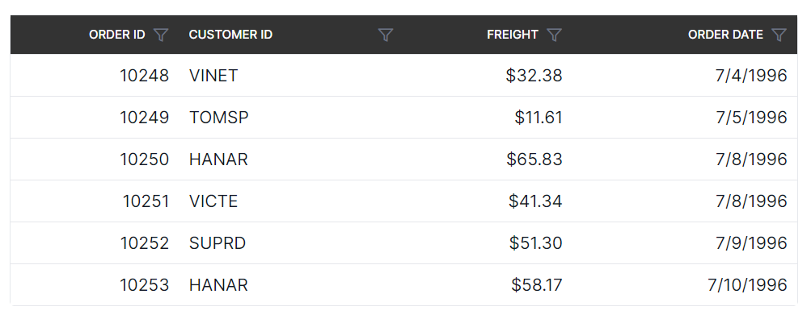
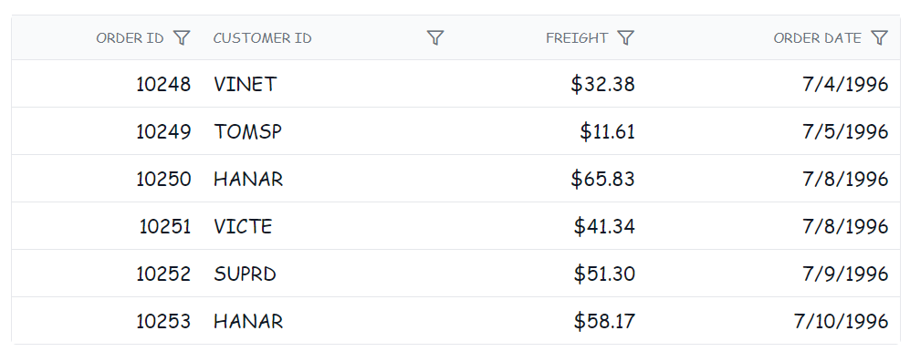

# Style and Appearance in Angular Grid Component

The Grid component offers various ways to customize its appearance using both default CSS and custom themes. Common approaches:

**Default CSS overrides**

Custom CSS can override the default styles of the Grid component. This allows changes to colors, fonts, paddings, and more. Inspect the generated HTML of the grid using browser developer tools to identify the relevant CSS classes and styles.

A basic example demonstrates overriding the grid’s header background color:

```css
/* In the component's CSS file */
.e-grid .e-headercell {
    background-color: #333; /* Override the header background color */
    color: #fff;
}
```



**Using Theme Studio**

Syncfusion's Theme Studio tool allows creation of custom themes for all controls, including the grid. This advanced approach defines a comprehensive set of styles to achieve a consistent look and feel across an application.

1. Visit the [Syncfusion<sup style="font-size:70%">&reg;</sup> Theme Studio](https://ej2.syncfusion.com/themestudio/?theme=material).
2. Select the grid control from the left panel.
3. Customize various aspects of the control's appearance, such as colors, typography, and spacing.
4. Download the generated CSS file and include it in the Angular project.

## Customize the Grid root element

The `.e-grid` class is used to style the root element of the Syncfusion<sup style="font-size:70%">&reg;</sup> Angular Grid component.

```css
.e-grid {
    font-family: cursive;
}
```















  


## See Also

[Footer template styling in Angular Grid](https://ej2.syncfusion.com/angular/documentation/grid/style-and-appearance/style-and-appearance)
